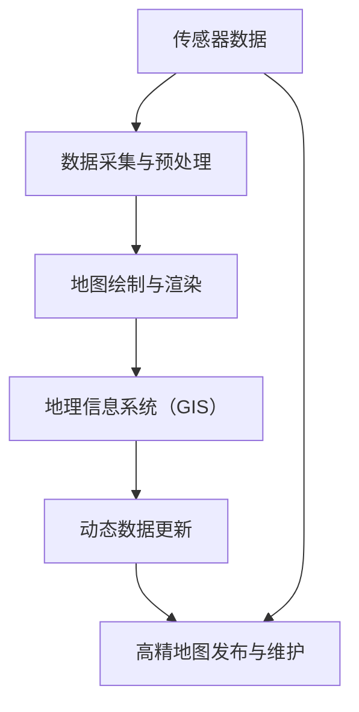

                 

# 自动驾驶高精地图生产应用全流程与技术架构解析

> 关键词：自动驾驶, 高精地图, 高精度定位, 实时动态更新, 多源数据融合, 人工智能, 激光雷达, 摄像头, 点云数据, 地理信息系统, 3D建模, 实时渲染

## 1. 背景介绍

自动驾驶技术是近年来人工智能、计算机视觉、机器人技术等多学科交叉融合的产物，而高精地图是实现自动驾驶的核心基础。高精地图不仅记录了路网的每一个细节，还包含了动态交通元素如行人和车辆的信息，能够帮助自动驾驶车辆实现高精度定位和路径规划，确保在复杂和多变的道路环境中的安全性与稳定性。随着自动驾驶技术的快速发展，高精地图的生产与维护需求日益增长，本文将详细解析自动驾驶高精地图生产应用的全流程与技术架构。

## 2. 核心概念与联系

### 2.1 核心概念概述

在自动驾驶领域，高精地图（High-Definition Mapping）是一份详细的地图数据集，包含了道路、交通标志、交通设施、地形、障碍物等详尽信息。高精地图的生产与应用涉及到地理信息系统（GIS）、计算机视觉、人工智能、传感器技术等多个领域的先进技术。以下概念为高精地图生产的核心组成：

1. **传感器技术**：激光雷达、摄像头、GPS、IMU等传感器技术是获取高精地图数据的主要手段，其中激光雷达以其高精度、高分辨率的特点成为主要数据源。

2. **数据采集与预处理**：通过传感器获取的路面数据需要进行预处理，包括数据拼接、拼接校正、去噪等，以生成统一的地图数据。

3. **地理信息系统（GIS）**：GIS技术帮助高精地图数据的组织和处理，进行地图的可视化、查询与分析。

4. **地图绘制与渲染**：利用3D建模和实时渲染技术，高精地图可以被展示在车辆内部或车载信息系统中，为自动驾驶提供直观的视觉辅助。

5. **动态数据更新**：高精地图需要不断更新以反映路网的实时变化，如道路施工、交通信号变化等，确保自动驾驶车辆始终掌握最新的道路信息。

### 2.2 核心概念联系

高精地图的生产与应用涉及多个环节，如图1所示。



从传感器数据开始，经过数据采集与预处理，生成静态地图数据；通过地图绘制与渲染，将地图数据展示为直观的用户界面；利用GIS技术实现数据的组织和查询；动态数据更新保证地图数据的实时性和准确性。最终，高精地图通过发布与维护，为自动驾驶车辆提供基础数据支持。

## 3. 核心算法原理 & 具体操作步骤

### 3.1 算法原理概述

高精地图的生产与维护涉及多个复杂的算法与技术，主要包括：

1. **传感器数据融合**：利用多源数据（如激光雷达、摄像头等）进行数据融合，以提高数据采集的精度和可靠性。

2. **三维点云数据处理**：对传感器采集的点云数据进行过滤、匹配、对齐等处理，生成用于地图绘制的3D数据。

3. **地图绘制算法**：将处理后的点云数据转换为道路、建筑物、交通标志等地图元素，进行三维建模。

4. **动态数据更新算法**：通过实时获取的传感器数据，更新高精地图中的动态元素，如交通信号、施工信息等。

5. **数据压缩与传输**：对高精地图数据进行压缩和编码，以减少传输带宽，提高数据存储效率。

### 3.2 算法步骤详解

**步骤1：传感器数据采集**

1. **激光雷达数据采集**：激光雷达扫描仪在车辆行驶过程中，通过发射激光束并接收反射信号，生成高精度的点云数据。
2. **摄像头数据采集**：摄像头记录道路环境与交通标志信息，用于补充激光雷达无法探测到的细节。
3. **GPS与IMU数据采集**：GPS和IMU数据用于获取车辆的位置和姿态信息，帮助数据时间同步和地图坐标系的建立。

**步骤2：数据预处理**

1. **点云数据去噪与过滤**：利用统计学方法或算法（如RANSAC）对点云数据进行去噪和过滤，去除异常点和噪声。
2. **点云数据对齐与拼接**：对多源点云数据进行对齐与拼接，生成统一的地图坐标系下的点云数据。
3. **图像数据预处理**：利用图像处理算法（如边缘检测、轮廓提取）对摄像头拍摄的图像数据进行预处理。

**步骤3：三维点云数据处理**

1. **点云数据匹配**：通过点云特征匹配算法，将多源点云数据进行匹配，消除重复与冗余信息。
2. **点云数据重建**：利用多视角几何学方法，对点云数据进行重建，生成三维地图场景。

**步骤4：地图绘制算法**

1. **道路提取与建模**：利用道路检测算法，从点云数据中提取出道路信息，并进行三维建模。
2. **交通标志与设施建模**：将交通标志、路灯、公交站等元素加入地图，进行三维建模。
3. **地形与障碍物建模**：通过高程数据处理，生成地形模型，并添加障碍物模型。

**步骤5：动态数据更新算法**

1. **动态数据检测**：利用实时传感器数据，检测道路施工、交通信号变化等动态元素。
2. **动态数据融合**：将动态数据融合到高精地图上，更新相应的元素。

**步骤6：数据压缩与传输**

1. **数据压缩算法**：采用压缩算法如Huffman编码、LZ77等，对高精地图数据进行压缩。
2. **数据传输协议**：利用网络传输协议（如MQTT、CoAP等），将高精地图数据传输到自动驾驶车辆。

### 3.3 算法优缺点

高精地图的生产与应用存在以下优缺点：

**优点：**

1. **提高自动驾驶安全性**：高精地图提供了精确的道路信息，帮助自动驾驶车辆准确进行定位和路径规划，减少交通事故。
2. **增强环境感知能力**：通过多源数据融合，高精地图能够提供更加全面和准确的环境信息。
3. **减少冗余数据处理**：自动驾驶车辆可以直接使用高精地图数据，减少实时数据处理的需求，提高处理效率。

**缺点：**

1. **数据采集与处理成本高**：高精地图生产需要大量传感器与硬件设备的投入，以及复杂的数据处理过程，成本较高。
2. **更新维护难度大**：路网变化频繁，高精地图需要定期更新，以保证数据的实时性和准确性。
3. **数据传输带宽要求高**：高精地图数据量巨大，对传输带宽和存储要求高，可能影响实时性能。

### 3.4 算法应用领域

高精地图技术在多个领域具有广泛的应用，包括但不限于：

1. **自动驾驶汽车**：通过高精地图进行高精度定位和路径规划，确保自动驾驶汽车的安全性。
2. **物流与配送**：利用高精地图进行车辆定位与路径优化，提升物流配送效率。
3. **智能城市**：在高精地图的基础上进行城市管理与规划，提高城市运行效率和安全性。
4. **航空航天**：在高精地图的基础上进行飞行路径规划，提高飞行安全与效率。
5. **农业与环境监测**：利用高精地图进行土地利用规划与环境监测，提升农业生产效率。

## 4. 数学模型和公式 & 详细讲解 & 举例说明

### 4.1 数学模型构建

高精地图的生产与应用涉及到多个数学模型，包括：

1. **激光雷达点云模型**：用于描述激光雷达采集的点云数据。
2. **道路模型**：用于描述道路的几何特性与交通标志信息。
3. **动态数据模型**：用于描述动态元素的物理特性与变化规律。

### 4.2 公式推导过程

**激光雷达点云模型**：假设激光雷达在t时刻发射激光束，点云数据(x,y,z)被记录。点云模型可以表示为：

$$
(x,y,z) = f(t)
$$

其中t为时间，(x,y,z)为激光束在空间中的位置。

**道路模型**：道路可以表示为一系列连续的曲线或曲面，利用贝塞尔曲线或曲面模型进行建模。

**动态数据模型**：动态数据如车辆、行人等可以看作质点，利用动力学模型描述其运动状态。

### 4.3 案例分析与讲解

**案例1：激光雷达点云数据采集与预处理**

假设激光雷达采集到的原始点云数据为D，采集时间戳为T，经过去噪和过滤后得到D'。点云去噪与过滤过程可以表示为：

$$
D' = g(D, T)
$$

其中g为去噪与过滤算法，T为时间戳。

**案例2：道路提取与建模**

假设道路模型为曲线S，利用道路检测算法对点云数据进行提取，可以得到曲线S'。道路建模过程可以表示为：

$$
S' = h(D', T)
$$

其中h为道路提取与建模算法，T为时间戳。

## 5. 项目实践：代码实例和详细解释说明

### 5.1 开发环境搭建

高精地图的生产与应用需要使用多种软件工具，包括：

1. **传感器数据采集软件**：如激光雷达点云采集工具（如Velodyne、Honeywell等），摄像头采集工具等。
2. **数据处理工具**：如PCL、OpenCV等。
3. **三维建模软件**：如AutoCAD、SketchUp等。
4. **GIS软件**：如ArcGIS、QGIS等。
5. **动态数据更新工具**：如GPS、IMU数据处理软件。

### 5.2 源代码详细实现

以下是一个简单的高精地图生成代码示例：

```python
import sensor_data
import data_processing
import road_modeling
import dynamic_data_modeling
import data_compression
import data_transmission

def generate_high_definition_map():
    # 步骤1：传感器数据采集
    sensor_data_acquired = sensor_data.collect_data()
    
    # 步骤2：数据预处理
    preprocessed_data = data_processing.preprocess(sensor_data_acquired)
    
    # 步骤3：三维点云数据处理
    point_cloud_data = data_processing.process_point_cloud(preprocessed_data)
    
    # 步骤4：地图绘制算法
    road_model = road_modeling.extract_and_build(road_data)
    
    # 步骤5：动态数据更新算法
    dynamic_data = dynamic_data_modeling.detect_and_update(road_model)
    
    # 步骤6：数据压缩与传输
    compressed_data = data_compression.compress_data(dynamic_data)
    data_transmission.send_data(compressed_data)

if __name__ == "__main__":
    generate_high_definition_map()
```

### 5.3 代码解读与分析

**代码1：传感器数据采集**

```python
import sensor_data

def collect_data():
    # 激光雷达数据采集
    laser_data = sensor_data.collect_laser_data()
    
    # 摄像头数据采集
    camera_data = sensor_data.collect_camera_data()
    
    # GPS与IMU数据采集
    gps_data = sensor_data.collect_gps_data()
    imu_data = sensor_data.collect_imu_data()
    
    # 数据时间同步
    timestamp = sensor_data.synchronize_timestamps(laser_data, camera_data, gps_data, imu_data)
    
    return laser_data, camera_data, gps_data, imu_data
```

**代码2：数据预处理**

```python
import data_processing

def preprocess(data):
    # 点云数据去噪与过滤
    filtered_point_cloud = data_processing.filter_point_cloud(data)
    
    # 点云数据对齐与拼接
    aligned_point_cloud = data_processing.align_point_cloud(filtered_point_cloud)
    
    # 图像数据预处理
    processed_images = data_processing.process_images(data)
    
    return filtered_point_cloud, aligned_point_cloud, processed_images
```

**代码3：三维点云数据处理**

```python
import road_modeling

def process_point_cloud(data):
    # 点云数据匹配
    matched_point_cloud = road_modeling.match_point_cloud(data)
    
    # 点云数据重建
    reconstructed_point_cloud = road_modeling.reconstruct_point_cloud(matched_point_cloud)
    
    return reconstructed_point_cloud
```

**代码4：地图绘制算法**

```python
import road_modeling

def extract_and_build(point_cloud):
    # 道路提取
    extracted_roads = road_modeling.extract_roads(point_cloud)
    
    # 道路建模
    built_roads = road_modeling.build_roads(extracted_roads)
    
    return built_roads
```

**代码5：动态数据更新算法**

```python
import dynamic_data_modeling

def detect_and_update(road_model):
    # 动态数据检测
    detected_data = dynamic_data_modeling.detect_dynamic_data(road_model)
    
    # 动态数据融合
    updated_road_model = dynamic_data_modeling.update_road_model(road_model, detected_data)
    
    return updated_road_model
```

**代码6：数据压缩与传输**

```python
import data_compression
import data_transmission

def compress_and_transmit(data):
    # 数据压缩
    compressed_data = data_compression.compress(data)
    
    # 数据传输
    data_transmission.send(compressed_data)
```

### 5.4 运行结果展示

```python
import matplotlib.pyplot as plt

def plot_map(model):
    # 绘制道路
    plt.plot(model.roads)
    
    # 绘制交通标志
    plt.scatter(model.signs)
    
    # 绘制地形
    plt.contour(model.terrain)
    
    plt.title("High Definition Map")
    plt.xlabel("X")
    plt.ylabel("Y")
    plt.show()
```

## 6. 实际应用场景

### 6.1 自动驾驶汽车

高精地图在自动驾驶汽车中的应用至关重要。自动驾驶汽车通过高精地图进行高精度定位，确保在复杂和多变的道路环境中的安全性与稳定性。高精地图能够提供精确的道路信息，帮助自动驾驶汽车准确进行定位和路径规划，减少交通事故。

### 6.2 物流与配送

高精地图在物流与配送中的应用也非常广泛。利用高精地图进行车辆定位与路径优化，提升物流配送效率。例如，配送车辆可以利用高精地图中的道路信息进行实时路径规划，避开拥堵区域，提高配送速度。

### 6.3 智能城市

在高精地图的基础上，智能城市能够实现更加高效和安全的运行。高精地图能够提供详细的道路信息、交通信号、公共设施等，帮助城市管理者进行智能交通管理。例如，智能交通信号灯可以根据高精地图中的交通流量信息进行实时调整，提高道路通行效率。

### 6.4 未来应用展望

高精地图技术将在未来的智能出行、智慧城市、航空航天等领域发挥重要作用。随着高精地图的生产与应用技术不断成熟，未来的智能出行将更加安全、高效，智能城市的运行效率将大幅提升，航空航天的飞行路径规划也将更加精确。

## 7. 工具和资源推荐

### 7.1 学习资源推荐

为了帮助开发者系统掌握高精地图生产与应用的技术，这里推荐一些优质的学习资源：

1. **《自动驾驶系统设计与实现》**：系统介绍自动驾驶系统架构与技术，包括高精地图的生产与应用。

2. **《高精地图与自动驾驶技术》**：全面介绍高精地图的生产过程与技术细节。

3. **《传感器技术与应用》**：详细讲解激光雷达、摄像头、GPS等传感器的工作原理与应用。

4. **《地理信息系统(GIS)技术》**：介绍地理信息系统的基本概念与技术应用。

5. **《人工智能与机器学习》**：系统讲解机器学习算法与技术，为高精地图的数据处理与建模提供理论基础。

### 7.2 开发工具推荐

1. **激光雷达点云采集工具**：如Velodyne、Honeywell等。
2. **数据处理工具**：如PCL、OpenCV等。
3. **三维建模软件**：如AutoCAD、SketchUp等。
4. **GIS软件**：如ArcGIS、QGIS等。
5. **动态数据更新工具**：如GPS、IMU数据处理软件。

### 7.3 相关论文推荐

1. **《激光雷达点云数据处理算法研究》**：详细探讨激光雷达点云数据的去噪与过滤技术。
2. **《高精度道路模型构建方法》**：介绍高精度道路模型的构建方法与技术。
3. **《智能交通系统的传感器融合技术》**：讲解智能交通系统中传感器数据融合的理论与实践。
4. **《高精地图在智能驾驶中的应用》**：分析高精地图在智能驾驶中的应用现状与前景。

## 8. 总结：未来发展趋势与挑战

### 8.1 研究成果总结

本文对高精地图生产与应用的全流程与技术架构进行了详细解析，从传感器数据采集、数据预处理、三维点云数据处理、地图绘制、动态数据更新等多个环节进行了深入探讨。通过理论分析与实际案例，展示了高精地图在自动驾驶、物流、智能城市等领域的广泛应用，具有重要的实践价值。

### 8.2 未来发展趋势

高精地图技术将持续发展和创新，未来的发展趋势包括：

1. **高精度传感器技术的发展**：激光雷达、摄像头等传感器技术的不断进步，将进一步提高数据采集的精度和可靠性。
2. **数据处理与建模技术的提升**：高效的数据处理算法与模型构建技术，将提高高精地图的生产效率与精度。
3. **动态数据更新技术的优化**：实时动态更新技术将更加高效和可靠，保证高精地图的实时性和准确性。
4. **多源数据融合技术的创新**：多种传感器数据的高效融合，将提供更加全面和准确的环境信息。
5. **高精地图与人工智能的融合**：人工智能技术在高精地图中的应用，将提升高精地图的智能与自动化水平。

### 8.3 面临的挑战

高精地图技术在快速发展的同时，也面临着一些挑战：

1. **高成本与高投入**：高精地图的生产需要大量传感器与硬件设备的投入，成本较高。
2. **数据更新与维护难度大**：路网变化频繁，高精地图需要定期更新，以保证数据的实时性和准确性。
3. **数据隐私与安全问题**：高精地图包含大量敏感数据，如何保护数据隐私和安全是一个重要问题。
4. **数据处理与存储要求高**：高精地图数据量巨大，对存储和传输要求高，需要高效的数据压缩和传输技术。
5. **技术标准的制定与统一**：高精地图的标准制定与统一，是实现跨平台、跨设备数据共享与互操作性的重要前提。

### 8.4 研究展望

未来的高精地图技术研究将从以下几个方面进行：

1. **传感器技术与数据融合**：进一步提升传感器数据采集的精度和可靠性，探索高效的数据融合算法。
2. **动态数据更新与实时处理**：开发高效的动态数据更新技术，实现高精地图的实时更新与处理。
3. **数据隐私与安全**：研究数据隐私保护与数据安全技术，保障高精地图数据的安全性。
4. **高精地图与人工智能**：探索高精地图与人工智能技术的结合，提高高精地图的智能化水平。
5. **跨平台与跨设备数据共享**：制定高精地图的技术标准，实现跨平台、跨设备的数据共享与互操作性。

## 9. 附录：常见问题与解答

### Q1：高精地图的生产与应用是否适用于所有自动驾驶场景？

A：高精地图在大多数自动驾驶场景中具有重要应用价值，特别是在需要高精度定位和路径规划的复杂道路环境中。但对于某些特定场景，如极端天气条件、非直线道路等，高精地图可能无法完全覆盖，需要结合其他感知技术进行补充。

### Q2：高精地图的生产与应用是否需要大量的传感器与硬件设备？

A：是的，高精地图的生产需要大量的传感器与硬件设备，包括激光雷达、摄像头、GPS、IMU等。这些设备在采集数据时需要高精度的校准和同步，成本较高。

### Q3：如何提高高精地图的生产效率？

A：提高高精地图的生产效率可以从以下几个方面进行：
1. **多源数据融合**：利用多源数据融合技术，提高数据采集的精度和可靠性。
2. **动态数据更新**：实时动态更新技术，保证高精地图的实时性和准确性。
3. **高效的数据处理算法**：利用高效的算法处理大量数据，提高生产效率。

### Q4：高精地图的生产与应用是否需要大量的存储空间与传输带宽？

A：是的，高精地图的数据量巨大，对存储和传输带宽要求较高。可以采用数据压缩与传输协议等技术进行优化，提高数据存储与传输效率。

### Q5：如何保障高精地图数据的隐私与安全？

A：高精地图数据包含大量敏感信息，需要采取数据隐私保护与数据安全措施。例如，使用数据脱敏技术、访问鉴权机制等，确保数据的隐私和安全。

---

作者：禅与计算机程序设计艺术 / Zen and the Art of Computer Programming

