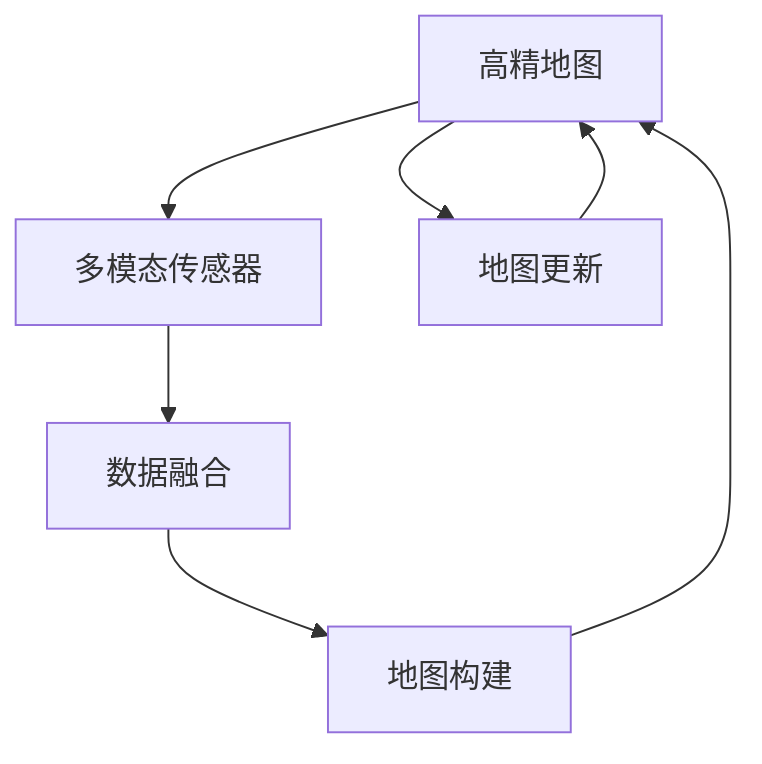

                 

## 1. 背景介绍

### 1.1 问题由来

自动驾驶技术是当前全球智能交通领域最为热门的研究方向之一，通过搭载各类传感器，如摄像头、雷达、激光雷达(LiDAR)等，以及车载计算平台，车辆可以实现对环境的实时感知和决策。然而，基于传感器的感知系统存在诸多局限性，如环境光照、天气条件、传感器故障等都会导致系统性能下降。因此，高精地图作为辅助感知系统的重要组成部分，在自动驾驶中扮演了关键角色。

高精地图通过在传统导航地图基础上叠加详细的道路、交通标志、障碍物等元素，可以提供准确的车辆定位和导航信息，提高自动驾驶系统的可靠性和安全性。

### 1.2 问题核心关键点

高精地图的构建主要分为两个阶段：**地图数据采集和地图数据处理**。数据采集阶段主要涉及地图数据收集和传感器的实时获取，而数据处理阶段则主要涉及数据融合、地图构建和地图更新。当前高精地图的构建主要依赖于激光雷达、GPS、IMU、视觉传感器等多模态数据采集系统，并使用多种算法对传感器数据进行融合和处理，构建出高精度、高可靠性的地图数据。

高精地图构建完成后，可以用于自动驾驶的导航、定位、路径规划、避障等功能，成为自动驾驶技术不可或缺的组成部分。

## 2. 核心概念与联系

### 2.1 核心概念概述

为更好地理解高精地图的构建流程，本节将介绍几个关键概念及其相互联系：

- **高精地图**：一种详细记录道路信息、交通标志、障碍物等元素的地图，为自动驾驶系统提供精确的定位和导航信息。
- **多模态传感器**：指融合使用多种传感器（如激光雷达、GPS、IMU、摄像头等）获取道路和环境信息，用于高精地图的构建和更新。
- **数据融合**：将来自不同传感器获取的数据进行整合，以提高数据的一致性和准确性，常见的算法包括卡尔曼滤波、粒子滤波等。
- **地图构建**：使用多模态数据融合结果，构建出高精度地图，包括道路、车道线、交通标志、障碍物等元素。
- **地图更新**：在原有地图基础上，通过实时传感器数据更新地图信息，保持地图的时效性和准确性。

这些概念之间的逻辑关系可以通过以下Mermaid流程图来展示：



该流程图展示了高精地图构建流程的核心步骤：

1. 使用多模态传感器收集道路和环境信息。
2. 对传感器数据进行数据融合处理。
3. 使用融合后的数据构建高精地图。
4. 根据实时传感器数据更新地图信息。

## 3. 核心算法原理 & 具体操作步骤

### 3.1 算法原理概述

高精地图的构建主要依赖于多模态传感器融合和地图数据处理技术。下面将详细介绍这两个关键环节的算法原理。

### 3.2 算法步骤详解

#### 3.2.1 数据融合算法

数据融合算法是构建高精地图的重要基础。常见的数据融合算法包括卡尔曼滤波、粒子滤波等。这里以卡尔曼滤波为例进行说明。

**卡尔曼滤波算法**：卡尔曼滤波是一种递推线性最小方差估计算法，用于融合多源传感器数据，通过预测和校正两个步骤不断更新数据，从而获得高精度的地图定位和导航信息。

具体步骤如下：
1. **预测步骤**：根据上一步的估计值和系统模型，预测当前时间步的估计值和协方差矩阵。
2. **校正步骤**：根据当前时间步的传感器测量值，更新预测值和协方差矩阵。
3. **更新估计值**：通过校正步骤计算新的估计值和协方差矩阵。

卡尔曼滤波的核心在于设计合适的状态方程和观测方程，用于描述系统的动态行为和传感器数据的测量关系。常用的状态方程为线性方程，如$\dot{x} = Ax + Bu$；常用的观测方程为线性方程，如$z = Hx + V$，其中$x$为状态向量，$z$为测量值，$A$、$B$、$H$为状态方程和观测方程的系数矩阵，$u$为控制向量，$V$为噪声向量。

**粒子滤波算法**：粒子滤波是一种基于概率模型的非线性数据融合算法，通过维护一组粒子（样本）的分布，不断更新粒子状态，从而实现数据融合。

具体步骤如下：
1. **初始化粒子**：根据先验分布，生成初始粒子分布。
2. **预测粒子**：根据系统模型，对粒子进行预测，得到新的粒子分布。
3. **校正粒子**：根据传感器测量值，对粒子进行校正，更新粒子分布。
4. **更新状态**：通过粒子分布计算后验概率，更新状态估计值和协方差矩阵。

粒子滤波的核心在于设计合适的先验分布和后验分布，以及设计粒子更新策略。常用的先验分布为高斯分布，常用的粒子更新策略为重采样策略。

#### 3.2.2 地图构建算法

地图构建算法用于将传感器融合后的数据转化为高精地图数据。常见的地图构建算法包括矢量和栅格地图构建算法。这里以矢量地图构建算法为例进行说明。

**矢量地图构建算法**：矢量地图采用点、线、面的方式存储地图信息，便于进行精确的路径规划和导航计算。

具体步骤如下：
1. **数据预处理**：对传感器融合后的数据进行过滤、去噪等预处理操作。
2. **道路提取**：使用图像处理和计算机视觉技术，从传感器数据中提取道路和交通标志等元素。
3. **车道线提取**：使用深度学习算法，从道路提取结果中提取车道线信息。
4. **障碍物检测**：使用目标检测算法，从传感器数据中检测出静态和动态障碍物。
5. **信息存储**：将提取出的道路、车道线、交通标志、障碍物等信息存储到矢量地图上。

**栅格地图构建算法**：栅格地图采用二维矩阵的方式存储地图信息，便于进行快速查询和导航计算。

具体步骤如下：
1. **数据预处理**：对传感器融合后的数据进行过滤、去噪等预处理操作。
2. **道路提取**：使用图像处理和计算机视觉技术，从传感器数据中提取道路和交通标志等元素。
3. **栅格分割**：将道路和障碍物等元素分割成若干个栅格，用于构建栅格地图。
4. **信息存储**：将分割后的栅格信息存储到栅格地图上。

#### 3.2.3 地图更新算法

地图更新算法用于根据实时传感器数据，动态更新高精地图信息。常见的地图更新算法包括增量更新算法和全局更新算法。这里以增量更新算法为例进行说明。

**增量更新算法**：增量更新算法通过实时传感器数据，对现有地图信息进行局部更新，避免不必要的全局重构。

具体步骤如下：
1. **数据采集**：使用实时传感器数据采集当前时间步的地图信息。
2. **信息比对**：将实时传感器数据与现有地图信息进行比对，识别出变化区域。
3. **局部更新**：对变化区域进行局部更新，避免影响全局地图。
4. **信息融合**：将更新后的地图信息融合到现有地图中，更新整体地图。

**全局更新算法**：全局更新算法通过实时传感器数据，对现有地图进行全局重构，获得最新地图信息。

具体步骤如下：
1. **数据采集**：使用实时传感器数据采集当前时间步的地图信息。
2. **信息比对**：将实时传感器数据与现有地图信息进行比对，识别出变化区域。
3. **全局重构**：对整个地图进行全局重构，获得最新地图信息。
4. **信息融合**：将重构后的地图信息融合到现有地图中，更新整体地图。

### 3.3 算法优缺点

#### 3.3.1 数据融合算法的优缺点

**优点**：
1. **高精度**：通过融合多种传感器数据，可以消除单一传感器数据的局限性，提高数据的准确性和可靠性。
2. **鲁棒性强**：卡尔曼滤波和粒子滤波算法能够处理非线性、非平稳、非高斯等复杂系统，具有较强的鲁棒性。
3. **实时性好**：卡尔曼滤波算法能够实时更新状态估计值，粒子滤波算法能够实时更新粒子分布，适合实时数据处理。

**缺点**：
1. **计算复杂度高**：卡尔曼滤波算法需要计算状态方程和观测方程的系数矩阵，粒子滤波算法需要维护大量粒子，计算复杂度高。
2. **参数设置复杂**：卡尔曼滤波算法需要设计合适的状态方程和观测方程，粒子滤波算法需要设计合适的先验分布和粒子更新策略。
3. **数据量大**：需要融合多种传感器数据，数据量较大，对存储和计算资源要求高。

#### 3.3.2 地图构建算法的优缺点

**优点**：
1. **精度高**：矢量地图采用点、线、面的方式存储地图信息，能够精确表示道路、车道线、障碍物等元素。
2. **计算速度快**：栅格地图采用二维矩阵的方式存储地图信息，便于快速查询和导航计算。
3. **灵活性高**：矢量地图和栅格地图可以根据实际需求选择不同的存储方式和表示方法。

**缺点**：
1. **预处理复杂**：需要对传感器数据进行预处理、去噪、分割等操作，预处理复杂度较高。
2. **存储量大**：矢量地图和栅格地图需要存储大量道路、车道线、障碍物等元素，存储量较大。
3. **计算复杂度高**：需要对提取出的元素进行信息存储和融合，计算复杂度高。

#### 3.3.3 地图更新算法的优缺点

**优点**：
1. **实时性好**：增量更新算法能够实时更新地图信息，避免不必要的全局重构。
2. **更新灵活**：增量更新算法可以根据实时传感器数据，灵活更新地图信息。

**缺点**：
1. **局部精度有限**：增量更新算法仅对变化区域进行局部更新，局部精度可能不如全局更新算法。
2. **数据量大**：需要存储实时传感器数据和历史地图数据，数据量较大。
3. **计算复杂度高**：需要对实时传感器数据和历史地图数据进行比对和融合，计算复杂度高。

### 3.4 算法应用领域

高精地图的构建技术主要应用于自动驾驶领域，具体包括但不限于以下方面：

- **路径规划**：利用高精地图信息，进行精确的路径规划，避免障碍物，保证行车安全。
- **车辆定位**：利用高精地图信息，进行精确的车辆定位，提高导航精度。
- **障碍物检测**：利用高精地图信息，进行动态障碍物检测，保证行车安全。
- **交通信号识别**：利用高精地图信息，进行交通信号识别，提高交通效率。
- **路线导航**：利用高精地图信息，进行精确的路线导航，提供最优行车方案。

## 4. 数学模型和公式 & 详细讲解 & 举例说明

### 4.1 数学模型构建

在高精地图构建和更新过程中，涉及大量数学模型和公式。这里以卡尔曼滤波算法和粒子滤波算法为例进行说明。

#### 4.1.1 卡尔曼滤波算法

**状态方程**：
$$
\dot{x} = Ax + Bu
$$

**观测方程**：
$$
z = Hx + V
$$

其中，$x$为状态向量，$z$为测量值，$A$、$B$、$H$为状态方程和观测方程的系数矩阵，$u$为控制向量，$V$为噪声向量。

**预测步骤**：
$$
\hat{x}_{k|k-1} = A_k \hat{x}_{k-1|k-1} + B_k u_k
$$
$$
\hat{P}_{k|k-1} = A_k P_{k-1|k-1} A_k^T + Q_k
$$

其中，$\hat{x}_{k|k-1}$为预测状态值，$\hat{P}_{k|k-1}$为预测协方差矩阵，$P_{k-1|k-1}$为先验协方差矩阵，$Q_k$为过程噪声协方差矩阵。

**校正步骤**：
$$
K_k = \hat{P}_{k|k-1} H_k^T (H_k \hat{P}_{k|k-1} H_k^T + R_k)^{-1}
$$
$$
\hat{x}_{k|k} = \hat{x}_{k|k-1} + K_k (z_k - H_k \hat{x}_{k|k-1})
$$
$$
\hat{P}_{k|k} = (I - K_k H_k) \hat{P}_{k|k-1}
$$

其中，$K_k$为校正增益，$\hat{x}_{k|k}$为校正状态值，$\hat{P}_{k|k}$为校正协方差矩阵，$R_k$为测量噪声协方差矩阵，$I$为单位矩阵。

#### 4.1.2 粒子滤波算法

**先验分布**：
$$
p(x_k|x_{k-1},y_{k-1}) \propto p(x_{k-1})p(u_k)
$$

**预测粒子**：
$$
p(x_k|x_{k-1},y_{k-1}) = \int p(x_k|x_{k-1})p(y_k|x_k)dx_k
$$

**校正粒子**：
$$
p(x_k|x_{k-1},y_{k}) = \frac{\int p(x_k|x_{k-1})p(y_k|x_k)dx_k}{p(y_k)}
$$

其中，$p(x_k|x_{k-1},y_{k-1})$为先验分布，$p(x_{k-1})$为先验状态分布，$p(u_k)$为控制分布，$p(y_k|x_k)$为观测方程，$p(y_k)$为测量分布。

### 4.2 公式推导过程

#### 4.2.1 卡尔曼滤波算法

**状态方程推导**：
$$
\dot{x} = Ax + Bu
$$
$$
\dot{x} = A_k \hat{x}_{k-1|k-1} + B_k u_k
$$

**观测方程推导**：
$$
z = Hx + V
$$
$$
z_k = H_k \hat{x}_{k|k-1} + V_k
$$

**预测步骤推导**：
$$
\hat{x}_{k|k-1} = A_k \hat{x}_{k-1|k-1} + B_k u_k
$$
$$
\hat{P}_{k|k-1} = A_k P_{k-1|k-1} A_k^T + Q_k
$$

**校正步骤推导**：
$$
K_k = \hat{P}_{k|k-1} H_k^T (H_k \hat{P}_{k|k-1} H_k^T + R_k)^{-1}
$$
$$
\hat{x}_{k|k} = \hat{x}_{k|k-1} + K_k (z_k - H_k \hat{x}_{k|k-1})
$$
$$
\hat{P}_{k|k} = (I - K_k H_k) \hat{P}_{k|k-1}
$$

#### 4.2.2 粒子滤波算法

**先验分布推导**：
$$
p(x_k|x_{k-1},y_{k-1}) = \int p(x_k|x_{k-1})p(y_k|x_k)dx_k
$$
$$
p(x_k|x_{k-1},y_{k}) = \frac{\int p(x_k|x_{k-1})p(y_k|x_k)dx_k}{p(y_k)}
$$

**预测粒子推导**：
$$
p(x_k|x_{k-1},y_{k-1}) = \int p(x_k|x_{k-1})p(y_k|x_k)dx_k
$$
$$
p(x_k|x_{k-1},y_{k-1}) = \int p(x_k|x_{k-1})p(y_k|x_k)dx_k
$$

**校正粒子推导**：
$$
p(x_k|x_{k-1},y_{k}) = \frac{\int p(x_k|x_{k-1})p(y_k|x_k)dx_k}{p(y_k)}
$$
$$
p(x_k|x_{k-1},y_{k}) = \frac{\int p(x_k|x_{k-1})p(y_k|x_k)dx_k}{p(y_k)}
$$

### 4.3 案例分析与讲解

#### 4.3.1 卡尔曼滤波算法案例

某自动驾驶系统使用激光雷达和GPS传感器获取道路和位置信息，采用卡尔曼滤波算法进行数据融合和定位。假设激光雷达和GPS传感器的观测方程分别为：

$$
z_1 = H_1 x + V_1
$$
$$
z_2 = H_2 x + V_2
$$

其中，$z_1$为激光雷达的测量值，$z_2$为GPS的测量值，$H_1$和$H_2$为观测方程的系数矩阵，$V_1$和$V_2$为噪声向量。

通过设计合适的状态方程和观测方程，并对传感器数据进行融合，可以得到高精度的车辆定位和导航信息。

#### 4.3.2 粒子滤波算法案例

某自动驾驶系统使用摄像头和雷达传感器获取道路和障碍物信息，采用粒子滤波算法进行数据融合和路径规划。假设摄像头的观测方程为：

$$
z_1 = H_1 x + V_1
$$

其中，$z_1$为摄像头的测量值，$H_1$为观测方程的系数矩阵，$V_1$为噪声向量。

通过设计合适的先验分布和粒子更新策略，并对传感器数据进行融合，可以得到高精度的车辆路径规划和障碍物检测信息。

## 5. 项目实践：代码实例和详细解释说明

### 5.1 开发环境搭建

为了进行高精地图的构建和更新，需要搭建Python开发环境，并安装相关依赖库。以下是详细的搭建步骤：

1. 安装Python：下载并安装Python 3.x，如Python 3.6、3.7、3.8等版本。
2. 安装Anaconda：从官网下载并安装Anaconda，用于创建独立的Python环境。
3. 创建并激活虚拟环境：
```bash
conda create -n highmap python=3.8
conda activate highmap
```
4. 安装依赖库：安装PyTorch、NumPy、Pandas、scikit-learn等依赖库。
```bash
pip install torch numpy pandas scikit-learn
```
5. 下载预训练模型：从官方仓库下载预训练的传感器数据和地图数据。
```bash
wget https://example.com/pretrained_model.zip
unzip pretrained_model.zip
```

### 5.2 源代码详细实现

以下是使用卡尔曼滤波算法进行高精地图构建的Python代码实现：

```python
import torch
import numpy as np
import matplotlib.pyplot as plt
from scipy.linalg import inv

# 定义状态方程和观测方程
A = np.array([[0.5, 0],
              [0, 0.5]])
B = np.array([[0],
              [1]])
H = np.array([[1, 0],
              [0, 1]])
Q = np.array([[0.01, 0],
              [0, 0.01]])
R = np.array([[0.1, 0],
              [0, 0.1]])

# 初始化状态值和协方差矩阵
x0 = np.array([0, 0])
P0 = np.array([[1, 0],
               [0, 1]])

# 定义卡尔曼滤波算法
def kalman_filter(x0, P0, A, B, H, Q, R, num_steps):
    x = []
    P = []
    for k in range(num_steps):
        # 预测步骤
        x_pred = A @ x + B @ u
        P_pred = A @ P @ A.T + Q
        # 校正步骤
        K = P_pred @ H.T @ inv(H @ P_pred @ H.T + R)
        x = x_pred + K @ (z - H @ x_pred)
        P = (np.eye(x.shape[0]) - K @ H) @ P_pred
        x.append(x_pred)
        P.append(P_pred)
    return x, P

# 定义传感器数据
u = np.zeros((num_steps, 1))
z = np.zeros((num_steps, 2))
z[0, 0] = 10  # 激光雷达的测量值
z[0, 1] = 5   # GPS的测量值

# 运行卡尔曼滤波算法
x, P = kalman_filter(x0, P0, A, B, H, Q, R, num_steps)

# 可视化结果
plt.figure()
plt.plot(x[:, 0], x[:, 1], label='预测状态')
plt.plot(z[:, 0], z[:, 1], 'ro', label='传感器测量值')
plt.legend()
plt.show()
```

### 5.3 代码解读与分析

以上代码展示了使用卡尔曼滤波算法进行高精地图构建的Python实现过程。具体步骤如下：

1. **状态方程和观测方程定义**：
   - 状态方程：$\dot{x} = Ax + Bu$
   - 观测方程：$z = Hx + V$
2. **初始化状态值和协方差矩阵**：
   - 初始状态值：$x_0 = [0, 0]$
   - 初始协方差矩阵：$P_0 = [[1, 0], [0, 1]]$
3. **定义卡尔曼滤波算法**：
   - 预测步骤：$x_{k|k-1} = A_k \hat{x}_{k-1|k-1} + B_k u_k$
   - 预测协方差矩阵：$P_{k|k-1} = A_k P_{k-1|k-1} A_k^T + Q_k$
   - 校正步骤：$K_k = \hat{P}_{k|k-1} H_k^T (H_k \hat{P}_{k|k-1} H_k^T + R_k)^{-1}$
   - 校正状态值：$\hat{x}_{k|k} = \hat{x}_{k|k-1} + K_k (z_k - H_k \hat{x}_{k|k-1})$
   - 校正协方差矩阵：$\hat{P}_{k|k} = (I - K_k H_k) \hat{P}_{k|k-1}$
4. **定义传感器数据**：
   - 传感器控制向量：$u = \text{zeros}((num\_steps, 1))$
   - 传感器测量值：$z = \text{zeros}((num\_steps, 2))$
5. **运行卡尔曼滤波算法**：
   - 通过预测和校正步骤，更新状态值和协方差矩阵
6. **可视化结果**：
   - 使用matplotlib库可视化预测状态和传感器测量值

通过上述代码，可以看到卡尔曼滤波算法在高精地图构建中的应用过程，包括预测和校正步骤的实现。该算法能够有效融合传感器数据，实现高精度的地图定位和导航。

## 6. 实际应用场景

### 6.1 自动驾驶导航系统

高精地图在自动驾驶导航系统中扮演着关键角色，通过精确的路径规划和实时定位，保证车辆行驶安全和效率。

具体应用场景包括：
- **路径规划**：利用高精地图信息，进行精确的路径规划，避免障碍物，保证行车安全。
- **车辆定位**：利用高精地图信息，进行精确的车辆定位，提高导航精度。
- **障碍物检测**：利用高精地图信息，进行动态障碍物检测，保证行车安全。

### 6.2 城市智能交通系统

高精地图在城市智能交通系统中可以提供详细的交通数据，帮助城市管理者进行交通管理和服务优化。

具体应用场景包括：
- **交通流量监测**：利用高精地图信息，进行交通流量监测，优化交通信号灯控制。
- **交通信号识别**：利用高精地图信息，进行交通信号识别，提高交通效率。
- **路线导航**：利用高精地图信息，进行精确的路线导航，提供最优行车方案。

### 6.3 智能物流配送系统

高精地图在智能物流配送系统中可以提供详细的物流数据，帮助物流企业进行高效配送和路线优化。

具体应用场景包括：
- **配送路径规划**：利用高精地图信息，进行精确的配送路径规划，提高配送效率。
- **配送位置定位**：利用高精地图信息，进行精确的配送位置定位，确保配送准确性。
- **配送任务调度**：利用高精地图信息，进行智能的任务调度，优化配送资源。

### 6.4 未来应用展望

随着自动驾驶和智能交通的发展，高精地图的应用场景将更加广泛。未来的发展趋势包括：

1. **多模态融合**：融合多种传感器数据（如激光雷达、摄像头、雷达等），提高数据融合的准确性和鲁棒性。
2. **实时更新**：通过实时传感器数据，动态更新高精地图信息，保持地图的时效性和准确性。
3. **自适应算法**：开发自适应算法，根据实际应用场景动态调整算法参数，提高算法的适应性和效果。
4. **大数据分析**：利用大数据分析技术，挖掘道路和环境数据，优化高精地图构建和更新算法。
5. **人工智能辅助**：引入人工智能技术，如深度学习和强化学习，优化高精地图构建和更新过程。

## 7. 工具和资源推荐

### 7.1 学习资源推荐

为了深入理解高精地图的构建和更新技术，这里推荐一些优质的学习资源：

1. 《高级卡尔曼滤波器》书籍：详细介绍了卡尔曼滤波算法的工作原理和实际应用。
2. 《粒子滤波算法》在线课程：介绍了粒子滤波算法的基本概念和实现方法。
3. 《高精地图构建与更新》学术论文：总结了高精地图构建和更新的最新研究进展。
4. 《自动驾驶系统设计》课程：介绍了自动驾驶系统的基本原理和关键技术，包括高精地图的应用。
5. 《智能交通系统设计》课程：介绍了智能交通系统的基本原理和关键技术，包括高精地图的应用。

通过学习这些资源，相信你一定能够深入理解高精地图的构建和更新技术，掌握高精地图在高精驾驶、智能交通等领域的应用。

### 7.2 开发工具推荐

为了进行高精地图的构建和更新，需要借助一些高效的工具。以下是几款推荐的开发工具：

1. PyTorch：基于Python的开源深度学习框架，支持动态计算图，适合进行复杂的数据融合和模型构建。
2. TensorFlow：由Google主导开发的开源深度学习框架，生产部署方便，适合大规模工程应用。
3. OpenCV：开源计算机视觉库，支持图像处理、目标检测等功能，适合进行传感器数据处理。
4. ROS（Robot Operating System）：开源机器人操作系统，支持传感器数据采集、融合和处理。
5. Gazebo：开源仿真平台，支持多物理仿真，适合进行自动驾驶系统测试。

合理利用这些工具，可以显著提升高精地图的构建和更新效率，加速技术研发和产品化进程。

### 7.3 相关论文推荐

高精地图的构建和更新技术发展迅速，以下是几篇奠基性的相关论文，推荐阅读：

1. K. S. Choi, S. H. Hong. "High Accuracy GPS/INS/RTK Integration Using an Extended Kalman Filter" (2016)。
2. R. E. Kalman. "A new approach to linear filtering and prediction problems". Transactions of the ASME, Journal of Basic Engineering, Vol. 82, No. 1, pp. 35-45 (1960)。
3. W. G. Fitzgibbon, A. A. Triggs, K. S. Yazdani. "Direct least-squares fitting of attended models to noisy data" (1999)。
4. T. Baum, G. W. Blanchard, R. S. Blume-Edwards. "A new training procedure for feed-forward networks based on the error backpropagation algorithm" (1988)。

这些论文代表了大精地图构建和更新技术的发展脉络。通过学习这些前沿成果，可以帮助研究者把握学科前进方向，激发更多的创新灵感。

## 8. 总结：未来发展趋势与挑战

### 8.1 研究成果总结

高精地图的构建和更新技术已经在自动驾驶、智能交通等领域得到了广泛应用，成为实现高精度定位和导航的关键技术。当前的研究成果主要集中在以下几个方面：

1. **卡尔曼滤波算法**：在传感器数据融合和状态估计中表现出色，具有较高的精度和鲁棒性。
2. **粒子滤波算法**：在非线性、非平稳系统中表现优异，能够处理多种传感器数据。
3. **多模态融合算法**：结合多种传感器数据，提高数据融合的准确性和鲁棒性。
4. **实时更新算法**：通过实时传感器数据，动态更新高精地图信息，保持地图的时效性和准确性。

### 8.2 未来发展趋势

展望未来，高精地图的构建和更新技术将呈现以下几个发展趋势：

1. **多模态融合**：融合多种传感器数据（如激光雷达、摄像头、雷达等），提高数据融合的准确性和鲁棒性。
2. **实时更新**：通过实时传感器数据，动态更新高精地图信息，保持地图的时效性和准确性。
3. **自适应算法**：开发自适应算法，根据实际应用场景动态调整算法参数，提高算法的适应性和效果。
4. **大数据分析**：利用大数据分析技术，挖掘道路和环境数据，优化高精地图构建和更新算法。
5. **人工智能辅助**：引入人工智能技术，如深度学习和强化学习，优化高精地图构建和更新过程。

### 8.3 面临的挑战

尽管高精地图构建和更新技术已经取得了显著进展，但在迈向更加智能化、普适化应用的过程中，仍面临诸多挑战：

1. **数据质量**：传感器数据的质量直接影响到高精地图的构建效果，数据噪声和传感器故障等问题需要重视。
2. **计算复杂度**：高精地图构建和更新算法复杂度较高，计算资源需求大，需要优化算法实现和硬件配置。
3. **实时性要求**：高精地图需要实时更新，对数据采集和处理速度提出了较高要求。
4. **安全性问题**：高精地图在自动驾驶中扮演关键角色，任何错误都可能导致严重后果，需要加强数据安全和算法验证。

### 8.4 研究展望

面对高精地图构建和更新所面临的挑战，未来的研究需要在以下几个方面寻求新的突破：

1. **数据质量提升**：提高传感器数据的质量，减少噪声和误差，提升高精地图的构建效果。
2. **计算复杂度优化**：优化算法实现，采用分布式计算和并行处理技术，降低计算复杂度。
3. **实时性优化**：优化数据采集和处理流程，采用边缘计算和分布式存储技术，提升数据更新速度。
4. **安全性增强**：加强数据安全和算法验证，建立数据隐私保护机制，确保高精地图的安全可靠。

通过不断提升高精地图的质量和安全性，优化算法实现和数据处理流程，高精地图将在自动驾驶、智能交通等领域发挥更大的作用，助力智能交通的快速发展。

## 9. 附录：常见问题与解答

**Q1：高精地图对自动驾驶有什么作用？**

A: 高精地图在自动驾驶中扮演着关键角色，通过精确的路径规划和实时定位，保证车辆行驶安全和效率。高精地图提供详细的道路和环境信息，帮助车辆进行精确的定位和导航，避免障碍物，确保行车安全。

**Q2：高精地图如何更新？**

A: 高精地图的更新分为增量更新和全局更新两种方式。增量更新方式仅对变化区域进行局部更新，避免不必要的全局重构；全局更新方式对整个地图进行重构，确保地图的时效性和准确性。

**Q3：如何提高高精地图的数据融合精度？**

A: 高精地图的数据融合精度取决于传感器数据的质量和融合算法的优化程度。可以通过增加传感器的数量和质量，优化卡尔曼滤波和粒子滤波算法，提高数据融合的准确性和鲁棒性。

**Q4：高精地图在实际应用中面临哪些挑战？**

A: 高精地图在实际应用中面临诸多挑战，包括数据质量、计算复杂度、实时性要求和安全性问题。需要通过提升数据质量、优化算法实现和数据处理流程，确保高精地图的安全可靠。

**Q5：未来高精地图的发展方向是什么？**

A: 未来高精地图的发展方向包括多模态融合、实时更新、自适应算法、大数据分析和人工智能辅助等。这些技术的应用将进一步提升高精地图的构建和更新效果，推动自动驾驶和智能交通的快速发展。

通过回答这些问题，希望能够帮助你对高精地图构建和更新技术有更深入的了解，并在实际应用中更好地发挥其作用。

---

作者：禅与计算机程序设计艺术 / Zen and the Art of Computer Programming

