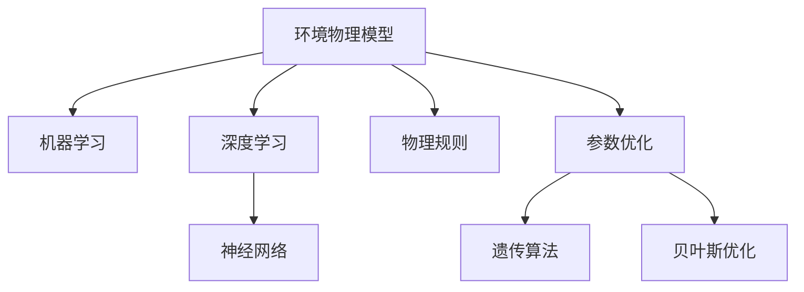

                 

## 1. 背景介绍

### 1.1 问题由来

环境物理学是研究自然环境（如气候、土壤、水体等）中各种物理现象及其对人类活动影响的科学。然而，在实际应用中，复杂的自然环境系统难以通过直接的实验测量获得全面而准确的数据，因此建立一套能够模拟自然环境物理行为的高效模型是环境物理研究的重要需求。

环境物理模型的建立通常涉及多学科知识的交叉，包括气象学、水文学、土壤学、生态学等。这些模型需要处理大量的数据，进行复杂的物理过程模拟，并且需要具备良好的可扩展性和可预测性。近年来，随着高性能计算和数据科学技术的飞速发展，机器学习和大数据技术开始被广泛应用于环境物理模型的构建中，极大地提升了模型的精度和效率。

### 1.2 问题核心关键点

构建高效、准确的环境物理模型，主要包括以下几个关键点：

1. **数据驱动**：充分利用大数据技术，从各种传感器、遥感数据中提取环境数据，构建数据驱动的物理模型。
2. **机器学习**：采用机器学习算法，如深度学习、神经网络等，提高模型对复杂非线性关系的拟合能力。
3. **物理规则**：确保模型中包含物理规律，如能量守恒、质量守恒等，以增强模型的物理合理性和解释性。
4. **参数优化**：通过优化算法，如遗传算法、贝叶斯优化等，寻找最优模型参数，提升模型性能。
5. **模型验证**：通过交叉验证、留一法等方法，验证模型的泛化能力，确保模型在未见过的数据上也能有良好表现。

### 1.3 问题研究意义

构建高效的环境物理模型，对环境监测、气候预测、生态保护、资源管理等领域具有重要意义。具体来说：

1. **环境监测**：通过实时监测自然环境中的物理参数，如气温、湿度、风速等，及时发现环境变化，进行预警和应急响应。
2. **气候预测**：利用历史和实时的环境数据，建立气候模型，准确预测未来的气候变化趋势，指导农业生产、城市规划等。
3. **生态保护**：模拟自然环境中的生态过程，如水循环、碳循环等，预测环境变化对生态系统的影响，指导生态保护措施。
4. **资源管理**：模拟水资源、土地资源等的利用和分布，优化资源配置，提高资源利用效率。

## 2. 核心概念与联系

### 2.1 核心概念概述

- **环境物理模型**：通过数学模型或计算模型，模拟自然环境中各种物理现象及其交互作用的系统。常见的环境物理模型包括气候模型、水文模型、土壤模型等。
- **机器学习**：一种数据驱动的模型构建方法，通过训练算法，从大量数据中学习模式和规律，用于预测和决策。
- **深度学习**：机器学习的一种，通过多层神经网络结构，实现对非线性复杂关系的建模和预测。
- **物理规则**：自然界中普遍适用的物理定律，如牛顿力学、热力学等，用于指导模型构建和验证。
- **参数优化**：通过优化算法，寻找模型的最优参数组合，提升模型精度和泛化能力。

这些核心概念之间的逻辑关系可以通过以下Mermaid流程图来展示：



这个流程图展示了两大类模型的构建过程及其核心组成：

1. 环境物理模型的构建可以分为机器学习、深度学习、物理规则和参数优化四个主要步骤。
2. 其中，机器学习和深度学习是用于处理数据和建立预测模型的技术，而物理规则是用于指导模型设计和验证的基础，参数优化则是用于提升模型性能的算法。

## 3. 核心算法原理 & 具体操作步骤

### 3.1 算法原理概述

构建环境物理模型通常分为数据预处理、模型建立、模型训练、模型验证和模型部署五个步骤。

1. **数据预处理**：从各种传感器、遥感数据中提取环境数据，进行清洗、归一化、特征提取等处理。
2. **模型建立**：选择合适的机器学习或深度学习算法，构建环境物理模型。
3. **模型训练**：利用历史数据，对模型进行训练，调整模型参数，使其能够准确预测未来的环境物理参数。
4. **模型验证**：通过交叉验证、留一法等方法，验证模型的泛化能力，确保模型在未见过的数据上也能有良好表现。
5. **模型部署**：将训练好的模型部署到生产环境中，进行实时监测和预测。

### 3.2 算法步骤详解

以下是环境物理模型的详细操作步骤：

**Step 1: 数据预处理**

1. **数据采集**：从各种传感器、遥感数据中采集环境数据，如气温、湿度、风速、降雨量等。
2. **数据清洗**：去除缺失值、异常值和噪声，保证数据质量。
3. **数据归一化**：将数据进行归一化处理，使其符合模型训练要求。
4. **特征提取**：提取有意义的特征，如温度变化率、降水量等，用于构建模型。

**Step 2: 模型建立**

1. **算法选择**：根据任务需求，选择适当的机器学习或深度学习算法，如回归模型、神经网络等。
2. **模型设计**：构建模型的网络结构、层数、激活函数等参数，进行初始化。

**Step 3: 模型训练**

1. **损失函数**：定义合适的损失函数，如均方误差、交叉熵等，用于衡量模型预测值与真实值之间的差异。
2. **优化器**：选择合适的优化器，如随机梯度下降（SGD）、Adam等，用于调整模型参数。
3. **迭代训练**：利用历史数据，进行迭代训练，逐步调整模型参数，最小化损失函数。
4. **早停策略**：设置早停策略，避免过拟合，确保模型泛化能力。

**Step 4: 模型验证**

1. **验证集**：将数据集分为训练集和验证集，使用验证集评估模型性能。
2. **交叉验证**：使用交叉验证方法，如K折交叉验证，评估模型在不同数据集上的表现。
3. **超参数调优**：通过超参数调优，如网格搜索、贝叶斯优化等，找到最优模型参数。

**Step 5: 模型部署**

1. **模型保存**：将训练好的模型保存为文件，便于后续使用。
2. **模型部署**：将模型部署到生产环境中，如服务器、嵌入式设备等。
3. **实时监测**：实时监测环境数据，输入模型进行预测，输出环境物理参数。

### 3.3 算法优缺点

环境物理模型的构建，具有以下优点：

1. **高效性**：利用机器学习和大数据技术，可以快速构建高效的环境物理模型，处理大量复杂数据。
2. **准确性**：通过优化算法和物理规则，提高模型对复杂非线性关系的拟合能力，实现高精度的预测。
3. **可扩展性**：模型可以扩展到更复杂的物理过程，支持更多环境参数的模拟。

同时，环境物理模型也存在一些局限性：

1. **数据依赖**：模型的准确性高度依赖于数据的完整性和质量，数据缺失或噪声会对模型预测产生影响。
2. **物理合理性**：如果模型缺乏物理合理性，可能会导致预测结果与实际情况不符。
3. **计算资源消耗**：构建和训练复杂模型需要大量计算资源，可能存在计算瓶颈。
4. **模型解释性**：复杂的深度学习模型缺乏可解释性，难以理解和调试。

### 3.4 算法应用领域

环境物理模型的应用领域非常广泛，包括但不限于以下几个方面：

1. **气象预报**：利用历史气象数据和实时监测数据，构建气象模型，进行气候预测和灾害预警。
2. **水资源管理**：模拟水循环过程，预测水资源变化，优化水资源配置。
3. **生态系统模拟**：模拟生态系统中的生态过程，如碳循环、能量流动等，研究生态保护措施。
4. **土地利用规划**：模拟土地利用变化，预测土地资源分布，指导土地利用规划。
5. **环境污染监测**：利用环境监测数据，构建环境污染模型，进行污染源追踪和污染预测。

## 4. 数学模型和公式 & 详细讲解 & 举例说明

### 4.1 数学模型构建

环境物理模型的构建，通常涉及以下几个步骤：

1. **数据描述**：定义环境数据集，如气温、湿度、降雨量等。
2. **特征选择**：选择有意义的特征，如温度变化率、降水量等。
3. **模型选择**：选择合适的机器学习或深度学习模型，如回归模型、神经网络等。
4. **参数优化**：使用优化算法，如遗传算法、贝叶斯优化等，优化模型参数。

以温度预测为例，常用的数学模型包括线性回归模型和神经网络模型。线性回归模型的数学模型为：

$$
y = w_0 + w_1 x_1 + w_2 x_2 + \cdots + w_n x_n
$$

其中，$y$ 为预测值，$x_1, x_2, \cdots, x_n$ 为特征变量，$w_0, w_1, w_2, \cdots, w_n$ 为模型参数。

神经网络模型的数学模型为：

$$
y = \sigma(Wx + b)
$$

其中，$y$ 为预测值，$x$ 为输入向量，$W$ 为权重矩阵，$b$ 为偏置向量，$\sigma$ 为激活函数，如 sigmoid、ReLU 等。

### 4.2 公式推导过程

以线性回归模型为例，推导模型的损失函数和梯度更新公式。

1. **损失函数**：

$$
\mathcal{L} = \frac{1}{2N} \sum_{i=1}^N (y_i - \hat{y}_i)^2
$$

其中，$y_i$ 为真实值，$\hat{y}_i$ 为预测值，$N$ 为样本数量。

2. **梯度更新**：

$$
\frac{\partial \mathcal{L}}{\partial w_j} = -\frac{1}{N} \sum_{i=1}^N (y_i - \hat{y}_i) x_{ij}
$$

其中，$x_{ij}$ 为第 $i$ 个样本的第 $j$ 个特征变量。

### 4.3 案例分析与讲解

以温度预测为例，分析模型的构建和训练过程。

1. **数据准备**：收集历史温度数据，如每天的最高温度、最低温度等。
2. **特征选择**：选择有意义的特征，如前一天的温度、当前的湿度等。
3. **模型构建**：使用线性回归模型或神经网络模型，构建温度预测模型。
4. **模型训练**：利用历史数据，训练模型，调整模型参数。
5. **模型验证**：通过交叉验证等方法，验证模型的泛化能力。

## 5. 项目实践：代码实例和详细解释说明

### 5.1 开发环境搭建

在进行环境物理模型的开发前，需要准备好开发环境。以下是使用Python进行TensorFlow开发的环境配置流程：

1. 安装Anaconda：从官网下载并安装Anaconda，用于创建独立的Python环境。

2. 创建并激活虚拟环境：
```bash
conda create -n tf-env python=3.8 
conda activate tf-env
```

3. 安装TensorFlow：从官网获取对应的安装命令。例如：
```bash
pip install tensorflow
```

4. 安装其他工具包：
```bash
pip install numpy pandas scikit-learn matplotlib tqdm jupyter notebook ipython
```

完成上述步骤后，即可在`tf-env`环境中开始模型开发。

### 5.2 源代码详细实现

下面是使用TensorFlow实现的温度预测模型的代码实现。

```python
import tensorflow as tf
import numpy as np
from sklearn.model_selection import train_test_split
from sklearn.metrics import mean_squared_error

# 准备数据
X = np.load('temperature_data.npy')[:, :-1]
y = np.load('temperature_data.npy')[:, -1]

# 分割数据集
X_train, X_test, y_train, y_test = train_test_split(X, y, test_size=0.2)

# 定义模型
model = tf.keras.Sequential([
    tf.keras.layers.Dense(64, activation='relu'),
    tf.keras.layers.Dense(64, activation='relu'),
    tf.keras.layers.Dense(1)
])

# 编译模型
model.compile(optimizer=tf.keras.optimizers.Adam(learning_rate=0.001),
              loss='mse',
              metrics=['mae'])

# 训练模型
history = model.fit(X_train, y_train, epochs=100, batch_size=32, validation_data=(X_test, y_test))

# 评估模型
mse = mean_squared_error(y_test, model.predict(X_test))
print(f'Mean Squared Error: {mse}')
```

### 5.3 代码解读与分析

**数据准备**：
- 使用`numpy`库加载历史温度数据，选择有意义的特征（如前一天的温度、当前的湿度等）。
- 使用`sklearn`库的`train_test_split`方法，将数据集分割为训练集和测试集。

**模型构建**：
- 使用`tensorflow`库的`Sequential`模型，定义包含两个`Dense`层的神经网络。
- 第一个`Dense`层有64个神经元，使用ReLU激活函数。
- 第二个`Dense`层有64个神经元，使用ReLU激活函数。
- 输出层有1个神经元，用于预测温度。

**模型训练**：
- 使用`compile`方法编译模型，选择Adam优化器和均方误差损失函数。
- 使用`fit`方法训练模型，指定训练轮数和批量大小。
- 使用`validation_data`参数指定验证集，实时监测模型在验证集上的表现。

**模型评估**：
- 使用`predict`方法对测试集进行预测。
- 使用`mean_squared_error`方法计算预测值和真实值之间的均方误差。

## 6. 实际应用场景

### 6.1 气象预报

气象预报是环境物理模型的一个重要应用场景。通过收集历史气象数据和实时监测数据，可以构建气象模型，进行气候预测和灾害预警。例如，利用气温、湿度、风速等环境数据，构建神经网络模型，预测未来的天气变化。

### 6.2 水资源管理

水资源管理涉及到水循环过程的模拟和预测。通过收集水文数据，如降雨量、水位等，构建神经网络模型，模拟水资源变化，优化水资源配置。例如，利用历史降雨量数据，预测未来的水位变化，指导灌溉和排水。

### 6.3 生态系统模拟

生态系统模拟涉及生态系统中碳循环和能量流动等复杂过程。通过收集生态数据，如植被覆盖、土壤湿度等，构建神经网络模型，模拟生态系统的变化。例如，利用历史植被覆盖数据，预测未来的碳排放量，指导生态保护措施。

### 6.4 未来应用展望

随着环境物理模型的不断发展，未来将有以下几个趋势：

1. **多模态融合**：将不同模态的数据（如遥感数据、气象数据等）融合到模型中，提高模型的预测能力。
2. **动态更新**：利用实时数据，动态更新模型参数，提高模型的实时性和准确性。
3. **自适应学习**：引入自适应学习算法，如强化学习，使模型能够自适应环境变化，提升模型的泛化能力。
4. **模型压缩**：使用模型压缩技术，如知识蒸馏，减小模型的计算资源消耗，提高模型的部署效率。

## 7. 工具和资源推荐

### 7.1 学习资源推荐

为了帮助开发者系统掌握环境物理模型的构建技术，这里推荐一些优质的学习资源：

1. **《TensorFlow官方文档》**：提供了全面的TensorFlow使用指南和代码示例，是TensorFlow学习的权威资料。
2. **《Python机器学习》**：由Sebastian Raschka撰写，全面介绍了机器学习和深度学习的理论基础和实践技巧。
3. **《深度学习入门：基于Python的理论与实现》**：由斋藤康毅撰写，详细介绍了深度学习的理论基础和TensorFlow的使用方法。
4. **Kaggle**：提供了大量机器学习和深度学习的数据集和竞赛，可以实践和验证模型效果。

通过对这些资源的学习实践，相信你一定能够快速掌握环境物理模型的构建技巧，并应用于实际问题中。

### 7.2 开发工具推荐

高效的开发离不开优秀的工具支持。以下是几款用于环境物理模型开发的工具：

1. **Jupyter Notebook**：免费的开源Jupyter Notebook环境，支持Python、TensorFlow等编程语言，便于交互式编程。
2. **TensorBoard**：TensorFlow配套的可视化工具，实时监测模型训练状态，并提供丰富的图表呈现方式。
3. **Weights & Biases**：模型训练的实验跟踪工具，可以记录和可视化模型训练过程中的各项指标，方便对比和调优。
4. **PyTorch Lightning**：基于PyTorch的快速原型开发框架，支持模型训练、验证、保存等操作。
5. **TensorFlow Extended (TFX)**：用于数据管道和模型部署的TensorFlow扩展工具，支持模型训练、导出和部署。

合理利用这些工具，可以显著提升环境物理模型开发效率，加速模型创新迭代。

### 7.3 相关论文推荐

环境物理模型的研究源于学界的持续探索。以下是几篇奠基性的相关论文，推荐阅读：

1. **《神经网络与深度学习》**：由Ian Goodfellow、Yoshua Bengio、Aaron Courville撰写，全面介绍了神经网络和深度学习的理论基础和实践方法。
2. **《机器学习实战》**：由Peter Harrington撰写，详细介绍了机器学习和深度学习的应用案例和实践技巧。
3. **《Deep Learning》**：由Ian Goodfellow、Yoshua Bengio、Aaron Courville撰写，全面介绍了深度学习的理论基础和实践方法。
4. **《神经网络与深度学习》**：由Michael Nielsen撰写，详细介绍了神经网络和深度学习的理论基础和实践方法。

这些论文代表了大环境物理模型构建技术的发展脉络。通过学习这些前沿成果，可以帮助研究者把握学科前进方向，激发更多的创新灵感。

## 8. 总结：未来发展趋势与挑战

### 8.1 总结

本文对环境物理模型的构建过程进行了全面系统的介绍。首先阐述了环境物理模型的研究背景和意义，明确了机器学习和深度学习在模型构建中的重要地位。其次，从原理到实践，详细讲解了环境物理模型的数学模型和算法实现，提供了完整的代码实例。同时，本文还广泛探讨了环境物理模型在气象预报、水资源管理、生态系统模拟等多个领域的应用前景，展示了模型的强大应用潜力。此外，本文精选了环境物理模型的各类学习资源，力求为读者提供全方位的技术指引。

通过本文的系统梳理，可以看到，环境物理模型的构建已经成为环境物理研究的重要手段，极大地提升了环境预测和决策的精度和效率。未来，伴随机器学习和大数据技术的持续演进，环境物理模型必将在环境监测、气候预测、生态保护等领域发挥更大的作用。

### 8.2 未来发展趋势

展望未来，环境物理模型的构建将呈现以下几个发展趋势：

1. **模型复杂化**：随着数据的增多和模型训练技术的进步，环境物理模型的复杂度将不断提高，可以处理更复杂的物理过程和更多环境参数。
2. **自适应学习**：引入自适应学习算法，使模型能够自适应环境变化，提高模型的泛化能力和实时性。
3. **多模态融合**：将不同模态的数据（如遥感数据、气象数据等）融合到模型中，提高模型的预测能力。
4. **动态更新**：利用实时数据，动态更新模型参数，提高模型的实时性和准确性。
5. **模型压缩**：使用模型压缩技术，如知识蒸馏，减小模型的计算资源消耗，提高模型的部署效率。

以上趋势凸显了环境物理模型构建技术的广阔前景。这些方向的探索发展，必将进一步提升环境物理模型的精度和应用范围，为环境监测、气候预测、生态保护等提供更强大的支持。

### 8.3 面临的挑战

尽管环境物理模型构建技术已经取得了显著进展，但在迈向更加智能化、普适化应用的过程中，仍面临诸多挑战：

1. **数据依赖**：模型的准确性高度依赖于数据的完整性和质量，数据缺失或噪声会对模型预测产生影响。
2. **物理合理性**：如果模型缺乏物理合理性，可能会导致预测结果与实际情况不符。
3. **计算资源消耗**：构建和训练复杂模型需要大量计算资源，可能存在计算瓶颈。
4. **模型解释性**：复杂的深度学习模型缺乏可解释性，难以理解和调试。
5. **模型泛化能力**：模型在未见过的数据上泛化能力不足，可能存在过拟合问题。

### 8.4 研究展望

为了应对上述挑战，未来的研究需要在以下几个方面寻求新的突破：

1. **数据增强**：引入数据增强技术，如数据扩充、数据合成等，提升数据的完整性和多样性。
2. **物理约束**：在模型构建过程中引入物理约束，确保模型具备物理合理性。
3. **模型压缩**：使用模型压缩技术，如知识蒸馏，减小模型的计算资源消耗，提高模型的部署效率。
4. **可解释性**：引入可解释性算法，如LIME、SHAP等，提升模型的可解释性和可调试性。
5. **泛化能力**：使用泛化能力增强技术，如正则化、对抗训练等，提升模型的泛化能力和鲁棒性。

这些研究方向将推动环境物理模型的不断进步，为环境监测、气候预测、生态保护等提供更高效、更准确、更可靠的解决方案。

## 9. 附录：常见问题与解答

**Q1：如何选择合适的模型算法？**

A: 选择合适的模型算法需要考虑以下几个因素：

1. **任务类型**：不同类型的任务需要不同的算法，如回归任务可以选择线性回归或神经网络等。
2. **数据特点**：数据的特点（如数据量、噪声等）也会影响算法的选择，如处理大规模数据可以选择分布式训练的算法。
3. **计算资源**：计算资源的限制也会影响算法的选择，如需要快速训练可以选择轻量级的算法。

**Q2：如何进行模型优化？**

A: 模型优化可以从以下几个方面入手：

1. **参数优化**：使用优化算法，如梯度下降、Adam等，调整模型参数，最小化损失函数。
2. **正则化**：使用正则化技术，如L2正则、Dropout等，避免过拟合。
3. **超参数调优**：通过网格搜索、贝叶斯优化等方法，找到最优模型参数。
4. **模型压缩**：使用模型压缩技术，如知识蒸馏，减小模型的计算资源消耗，提高模型的部署效率。

**Q3：如何评估模型性能？**

A: 评估模型性能可以从以下几个方面入手：

1. **损失函数**：通过损失函数评估模型预测值与真实值之间的差异。
2. **指标评价**：使用评估指标，如均方误差、均方根误差等，评估模型预测值与真实值之间的差异。
3. **交叉验证**：使用交叉验证方法，如K折交叉验证，评估模型在不同数据集上的表现。
4. **模型对比**：对比不同模型在相同数据集上的表现，选择最优模型。

**Q4：如何进行模型部署？**

A: 模型部署可以按照以下步骤进行：

1. **模型保存**：将训练好的模型保存为文件，便于后续使用。
2. **模型部署**：将模型部署到生产环境中，如服务器、嵌入式设备等。
3. **实时监测**：实时监测环境数据，输入模型进行预测，输出环境物理参数。
4. **监控告警**：设置异常告警阈值，确保模型输出的准确性和稳定性。

**Q5：如何提高模型的可解释性？**

A: 提高模型的可解释性可以从以下几个方面入手：

1. **特征选择**：选择有意义的特征，减少模型的复杂度，提高模型的可解释性。
2. **模型解释**：使用模型解释技术，如LIME、SHAP等，解释模型的预测过程和结果。
3. **可视化**：使用可视化工具，如TensorBoard，展示模型的训练过程和预测结果，帮助理解和调试模型。

---

作者：禅与计算机程序设计艺术 / Zen and the Art of Computer Programming

