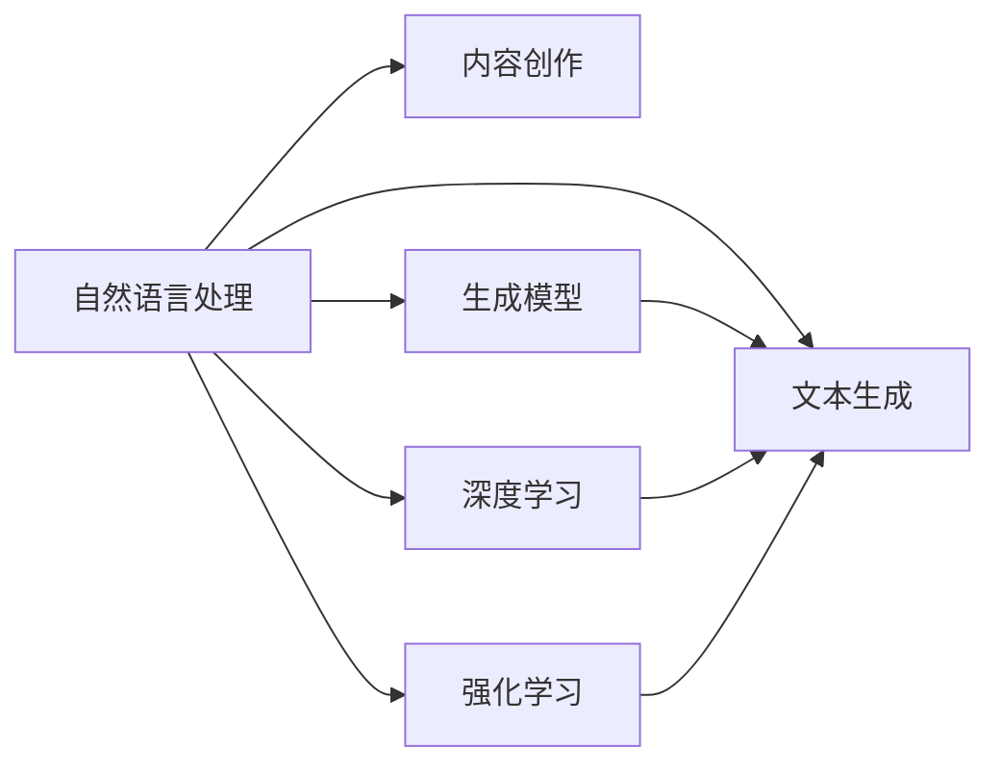

                 

# 自然语言处理的应用：AI内容创作

> 关键词：自然语言处理, 内容创作, 生成模型, 文本生成, 深度学习, 强化学习, 应用场景, 技术实践

## 1. 背景介绍

在当今信息爆炸的时代，内容的创作和传播成为了一种新的价值增长点。无论是社交媒体上的个性化推荐、搜索引擎的智能回答，还是教育、娱乐等领域，高质量内容的生成都具有重要意义。自然语言处理（Natural Language Processing, NLP）作为人工智能领域的前沿技术，正逐渐成为内容创作的重要工具。本文将围绕AI内容创作的几个关键技术点进行详细讨论，希望能帮助读者更好地理解这一领域的发展和应用。

## 2. 核心概念与联系

### 2.1 核心概念概述

为了更好地理解AI内容创作，首先需要对几个核心概念进行概述：

- **自然语言处理（NLP）**：研究如何让计算机理解和处理人类语言的技术，涉及语音识别、文本分析、机器翻译等多个方向。
- **内容创作（Content Creation）**：包括文本生成、图像生成、音频生成等多种形式，旨在创作出符合用户需求的高质量内容。
- **生成模型（Generative Models）**：一类可以生成新数据（如文本、图像、音频）的机器学习模型，常见包括基于循环神经网络（RNN）的模型、变分自编码器（VAE）、生成对抗网络（GAN）等。
- **文本生成（Text Generation）**：生成模型在文本领域的应用，如文本摘要、机器翻译、对话系统等。
- **深度学习（Deep Learning）**：一类基于神经网络的机器学习技术，包括卷积神经网络（CNN）、循环神经网络（RNN）、变换器（Transformer）等。
- **强化学习（Reinforcement Learning, RL）**：一种通过试错学习优化策略的机器学习方法，常用于生成模型的优化。

这些概念之间的联系可以构建一个简单的Mermaid流程图，如下：



从图中可以看到，NLP是内容创作的基础，生成模型和深度学习是实现文本生成等任务的核心技术，而强化学习则用于优化生成模型的性能。

### 2.2 核心概念原理和架构

**文本生成**是AI内容创作的核心任务之一。文本生成一般分为两步：先通过语言模型学习文本的概率分布，然后使用生成模型根据此分布生成新的文本。

一个简单的文本生成过程如下：

1. 使用大量未标注文本数据对语言模型进行预训练，学习文本的概率分布。
2. 在预训练后的语言模型基础上，添加生成模块，如解码器，根据文本生成目标，使用模型概率输出新文本。

**深度学习**和**生成模型**是实现文本生成的关键技术。其中，**深度学习**通过多层次的神经网络来捕捉数据的复杂特征，从而实现更加精确的预测；**生成模型**则是通过训练生成数据，使得模型能够生成符合特定分布的新数据。

在实践中，**Transformer**作为当前最先进的文本生成模型架构，已经被广泛应用于文本生成任务中。Transformer模型通过自注意力机制（Self-Attention），可以在大规模数据上高效地捕捉长距离依赖关系，同时保持较好的并行性和可解释性。

## 3. 核心算法原理 & 具体操作步骤

### 3.1 算法原理概述

**深度学习**和**生成模型**的结合，使得文本生成等AI内容创作任务得以实现。以下将详细介绍深度学习在文本生成中的应用。

**Transformer模型**是当前文本生成领域的主流架构，其核心思想是自注意力机制，通过学习输入序列和目标序列之间的依赖关系，生成目标序列中的每一个元素。

Transformer模型主要由编码器和解码器组成，编码器负责将输入序列映射为高维向量表示，解码器则在此基础上生成目标序列。

Transformer模型的自注意力机制可以表示为：

$$
\text{Attention}(Q, K, V) = \text{Softmax}(\frac{QK^T}{\sqrt{d_k}})V
$$

其中，$Q, K, V$分别为查询、键、值向量，$d_k$为向量维度。

**深度学习**在文本生成中的应用，主要体现在以下几个方面：

- 语言模型的预训练：通过大规模无标签文本数据训练语言模型，学习文本的分布特征。
- 生成模型的训练：在预训练后的语言模型基础上，添加生成模块，如解码器，训练生成模型，使其能够根据文本生成目标。

### 3.2 算法步骤详解

**语言模型的预训练**是文本生成的第一步。预训练过程一般使用大规模未标注数据，通过自监督学习任务（如语言建模、掩码语言建模）训练模型。

以**语言建模**为例，目标是通过训练模型，使其能够预测给定文本序列中下一个单词的概率分布。具体步骤如下：

1. 准备大规模未标注文本数据。
2. 将文本数据转换为模型所需的输入格式。
3. 使用语言模型（如RNN、Transformer）进行训练，最小化预测概率与真实标签之间的差异。

**生成模型的训练**则是文本生成的第二步。在预训练后的语言模型基础上，添加生成模块，如解码器，训练生成模型，使其能够根据文本生成目标。

以**基于Transformer的文本生成模型**为例，训练步骤如下：

1. 准备大规模标注数据，如文本生成数据集。
2. 将文本生成数据转换为模型所需的输入格式。
3. 使用Transformer模型进行训练，最小化生成序列与真实序列之间的差异。

### 3.3 算法优缺点

**深度学习**和**生成模型**在文本生成中的应用，具有以下优点：

- 生成质量高：通过深度学习技术，模型能够学习到复杂的文本结构，生成高质量的文本。
- 适应性强：生成模型可以适应不同的生成任务，如文本摘要、机器翻译、对话系统等。
- 应用广泛：文本生成技术被广泛应用于社交媒体、搜索引擎、在线教育等多个领域。

同时，这些方法也存在一些缺点：

- 模型复杂度高：深度学习模型参数量巨大，需要大量计算资源进行训练和推理。
- 训练时间长：深度学习模型的训练时间较长，需要高效的计算平台支持。
- 过拟合风险：深度学习模型容易过拟合训练数据，生成质量不稳定。

### 3.4 算法应用领域

文本生成技术在多个领域具有广泛应用，以下是几个典型的应用场景：

- **机器翻译**：将一种语言翻译成另一种语言，常见如谷歌翻译、百度翻译等。
- **对话系统**：如智能客服、虚拟助手等，通过文本生成技术，自动回答用户问题。
- **文本摘要**：自动提取文本的主要内容，生成简短摘要。
- **创意写作**：如自动创作诗歌、小说等，生成符合特定风格和主题的文本。

## 4. 数学模型和公式 & 详细讲解 & 举例说明

### 4.1 数学模型构建

文本生成模型通常由以下三个部分组成：

1. 编码器：将输入文本转换为向量表示。
2. 解码器：根据向量表示生成目标文本。
3. 注意力机制：学习输入序列和目标序列之间的依赖关系。

以**基于Transformer的文本生成模型**为例，其数学模型可以表示为：

$$
\text{Encoder}(\text{Input}) = \text{Encoder Self-Attention}(\text{Input}) + \text{Encoder Feed-Forward}
$$

$$
\text{Decoder}(\text{Input}, \text{Encoder Output}) = \text{Decoder Self-Attention}(\text{Input}, \text{Encoder Output}) + \text{Decoder Feed-Forward}
$$

其中，$\text{Encoder Self-Attention}$ 和 $\text{Decoder Self-Attention}$ 为自注意力机制，$\text{Encoder Feed-Forward}$ 和 $\text{Decoder Feed-Forward}$ 为前向神经网络层。

### 4.2 公式推导过程

以**掩码语言建模**为例，目标是通过训练模型，使其能够预测给定文本序列中下一个单词的概率分布。

掩码语言建模的过程可以分为两个步骤：

1. 训练语言模型，预测给定文本序列中下一个单词的概率。
2. 使用训练好的语言模型，生成新的文本序列。

**掩码语言建模**的数学模型可以表示为：

$$
\text{Language Model}(x_1, x_2, ..., x_n) = \prod_{i=1}^{n} p(x_i | x_{<i})
$$

其中，$x_1, x_2, ..., x_n$ 为文本序列中的单词，$p(x_i | x_{<i})$ 表示在给定前 $i-1$ 个单词的条件下，生成单词 $x_i$ 的概率。

**掩码语言建模**的训练过程可以分为以下两个步骤：

1. 数据预处理：将文本数据转换为模型所需的输入格式，如将文本转换为单词向量。
2. 训练模型：使用自监督学习任务（如掩码语言建模）训练语言模型，最小化预测概率与真实标签之间的差异。

### 4.3 案例分析与讲解

**BERT模型**是目前最先进的预训练语言模型之一，其核心思想是通过大规模无标签文本数据训练模型，学习文本的概率分布。BERT模型主要由以下两部分组成：

1. 掩码语言建模：通过预测给定文本序列中下一个单词的概率，学习文本的概率分布。
2. 下一句分类：通过判断两个句子是否是连续的，学习句子之间的依赖关系。

**BERT模型的训练过程**可以分为以下两个步骤：

1. 数据预处理：将文本数据转换为模型所需的输入格式，如将文本转换为单词向量。
2. 训练模型：使用掩码语言建模和下一句分类任务训练BERT模型，最小化预测概率与真实标签之间的差异。

## 5. 项目实践：代码实例和详细解释说明

### 5.1 开发环境搭建

在进行AI内容创作项目实践前，首先需要准备好开发环境。以下是使用Python进行PyTorch开发的环境配置流程：

1. 安装Anaconda：从官网下载并安装Anaconda，用于创建独立的Python环境。
2. 创建并激活虚拟环境：
```bash
conda create -n pytorch-env python=3.8 
conda activate pytorch-env
```

3. 安装PyTorch：根据CUDA版本，从官网获取对应的安装命令。例如：
```bash
conda install pytorch torchvision torchaudio cudatoolkit=11.1 -c pytorch -c conda-forge
```

4. 安装Transformers库：
```bash
pip install transformers
```

5. 安装各类工具包：
```bash
pip install numpy pandas scikit-learn matplotlib tqdm jupyter notebook ipython
```

完成上述步骤后，即可在`pytorch-env`环境中开始项目实践。

### 5.2 源代码详细实现

下面以**基于Transformer的文本生成模型**为例，给出使用Transformers库对模型进行训练和推理的PyTorch代码实现。

首先，定义模型和优化器：

```python
from transformers import TransformerLMHeadModel, AdamW

model = TransformerLMHeadModel.from_pretrained('bert-base-cased')
optimizer = AdamW(model.parameters(), lr=2e-5)
```

接着，定义训练和评估函数：

```python
from torch.utils.data import DataLoader
from tqdm import tqdm
from sklearn.metrics import perplexity

device = torch.device('cuda') if torch.cuda.is_available() else torch.device('cpu')
model.to(device)

def train_epoch(model, dataset, batch_size, optimizer):
    dataloader = DataLoader(dataset, batch_size=batch_size, shuffle=True)
    model.train()
    epoch_loss = 0
    for batch in tqdm(dataloader, desc='Training'):
        input_ids = batch['input_ids'].to(device)
        attention_mask = batch['attention_mask'].to(device)
        labels = batch['labels'].to(device)
        model.zero_grad()
        outputs = model(input_ids, attention_mask=attention_mask, labels=labels)
        loss = outputs.loss
        epoch_loss += loss.item()
        loss.backward()
        optimizer.step()
    return epoch_loss / len(dataloader)

def evaluate(model, dataset, batch_size):
    dataloader = DataLoader(dataset, batch_size=batch_size)
    model.eval()
    preds, labels = [], []
    with torch.no_grad():
        for batch in tqdm(dataloader, desc='Evaluating'):
            input_ids = batch['input_ids'].to(device)
            attention_mask = batch['attention_mask'].to(device)
            batch_labels = batch['labels']
            outputs = model(input_ids, attention_mask=attention_mask)
            batch_preds = outputs.logits.argmax(dim=2).to('cpu').tolist()
            batch_labels = batch_labels.to('cpu').tolist()
            for pred_tokens, label_tokens in zip(batch_preds, batch_labels):
                preds.append(pred_tokens[:len(label_tokens)])
                labels.append(label_tokens)
                
    return perplexity(labels, preds)
```

最后，启动训练流程并在测试集上评估：

```python
epochs = 5
batch_size = 16

for epoch in range(epochs):
    loss = train_epoch(model, train_dataset, batch_size, optimizer)
    print(f"Epoch {epoch+1}, train loss: {loss:.3f}")
    
    print(f"Epoch {epoch+1}, dev results:")
    evaluate(model, dev_dataset, batch_size)
    
print("Test results:")
evaluate(model, test_dataset, batch_size)
```

以上就是使用PyTorch对基于Transformer的文本生成模型进行训练和评估的完整代码实现。可以看到，得益于Transformers库的强大封装，我们可以用相对简洁的代码完成模型的加载和训练。

### 5.3 代码解读与分析

让我们再详细解读一下关键代码的实现细节：

**TransformerLMHeadModel类**：
- `__init__`方法：初始化模型参数和数据预处理组件。
- `__getitem__`方法：对单个样本进行处理，将文本输入编码为token ids，并将标签转换为模型所需的输出格式。

**训练和评估函数**：
- 使用PyTorch的DataLoader对数据集进行批次化加载，供模型训练和推理使用。
- 训练函数`train_epoch`：对数据以批为单位进行迭代，在每个批次上前向传播计算损失函数，并反向传播更新模型参数。
- 评估函数`evaluate`：与训练类似，不同点在于不更新模型参数，并在每个batch结束后将预测和标签结果存储下来，最后使用perplexity计算模型性能。

**训练流程**：
- 定义总的epoch数和batch size，开始循环迭代
- 每个epoch内，先在训练集上训练，输出平均loss
- 在验证集上评估，输出perplexity指标
- 重复上述步骤直至收敛

可以看到，PyTorch配合Transformers库使得文本生成模型的代码实现变得简洁高效。开发者可以将更多精力放在数据处理、模型改进等高层逻辑上，而不必过多关注底层的实现细节。

当然，工业级的系统实现还需考虑更多因素，如模型的保存和部署、超参数的自动搜索、更灵活的任务适配层等。但核心的文本生成范式基本与此类似。

## 6. 实际应用场景

### 6.1 社交媒体推荐

社交媒体推荐是AI内容创作的重要应用场景之一。通过深度学习技术，社交媒体平台可以分析用户行为和兴趣，自动生成个性化的推荐内容，提升用户粘性和满意度。

在技术实现上，可以收集用户点赞、评论、分享等行为数据，提取和用户交互的物品标题、描述、标签等文本内容。将文本内容作为模型输入，用户的后续行为（如是否点赞、分享等）作为监督信号，在此基础上微调预训练语言模型。微调后的模型能够从文本内容中准确把握用户的兴趣点。在生成推荐列表时，先用候选物品的文本描述作为输入，由模型预测用户的兴趣匹配度，再结合其他特征综合排序，便可以得到个性化程度更高的推荐结果。

### 6.2 创意写作

创意写作是文本生成技术的另一大应用场景。通过深度学习技术，AI可以快速生成符合特定风格和主题的文本，如自动创作诗歌、小说等。

在实际应用中，可以定义各种创意写作任务，如写一首诗歌、创作一篇新闻报道、生成一篇故事等。通过设计合适的任务模板和约束条件，训练生成模型，使其能够按照指定的风格和主题生成文本。对于需要更加精确的控制（如生成特定主题的文本），可以通过多轮迭代和人工干预，逐步优化生成结果。

### 6.3 个性化教育

个性化教育是AI内容创作的另一个重要应用场景。通过深度学习技术，AI可以自动生成符合学生学习进度和兴趣的个性化教育内容，提升教学效果。

在技术实现上，可以收集学生的作业、测试、互动等数据，提取和学生互动的内容文本。将文本内容作为模型输入，学生的后续行为（如是否通过测试、完成作业等）作为监督信号，在此基础上微调预训练语言模型。微调后的模型能够从文本内容中准确把握学生的学习情况和兴趣点。在生成个性化教育内容时，先用学生的学习记录作为输入，由模型预测学生可能感兴趣的内容，再结合其他特征综合生成，便可以得到符合学生需求的教育内容。

### 6.4 未来应用展望

随着深度学习技术的不断进步，基于AI内容创作的技术将在更多领域得到应用，为各行各业带来变革性影响。

在智慧医疗领域，基于AI内容创作的技术可以用于自动生成医学文档、疾病诊断报告等，提升医疗服务的效率和质量。

在金融领域，基于AI内容创作的技术可以用于自动生成金融报告、投资分析等，提高金融决策的精准性。

在智能制造领域，基于AI内容创作的技术可以用于自动生成设备维护报告、生产调度计划等，优化生产管理。

此外，在新闻、广告、旅游等多个领域，基于AI内容创作的技术也将不断涌现，为各行各业提供新的内容创作解决方案，推动产业升级和创新。

## 7. 工具和资源推荐

### 7.1 学习资源推荐

为了帮助开发者系统掌握AI内容创作的技术基础和实践技巧，这里推荐一些优质的学习资源：

1. 《深度学习与自然语言处理》系列书籍：由大模型技术专家撰写，详细介绍了深度学习在自然语言处理中的应用，包括文本生成、机器翻译、对话系统等多个方向。
2. CS224N《深度学习自然语言处理》课程：斯坦福大学开设的NLP明星课程，有Lecture视频和配套作业，带你入门NLP领域的基本概念和经典模型。
3. 《Transformer from Scratch》博文：一篇详细的Transformer模型实现教程，适合新手入门。
4. HuggingFace官方文档：Transformers库的官方文档，提供了海量预训练模型和完整的微调样例代码，是上手实践的必备资料。

通过对这些资源的学习实践，相信你一定能够快速掌握AI内容创作的精髓，并用于解决实际的NLP问题。

### 7.2 开发工具推荐

高效的开发离不开优秀的工具支持。以下是几款用于AI内容创作开发的常用工具：

1. PyTorch：基于Python的开源深度学习框架，灵活动态的计算图，适合快速迭代研究。大部分预训练语言模型都有PyTorch版本的实现。
2. TensorFlow：由Google主导开发的开源深度学习框架，生产部署方便，适合大规模工程应用。同样有丰富的预训练语言模型资源。
3. Transformers库：HuggingFace开发的NLP工具库，集成了众多SOTA语言模型，支持PyTorch和TensorFlow，是进行内容创作任务开发的利器。
4. Weights & Biases：模型训练的实验跟踪工具，可以记录和可视化模型训练过程中的各项指标，方便对比和调优。与主流深度学习框架无缝集成。
5. TensorBoard：TensorFlow配套的可视化工具，可实时监测模型训练状态，并提供丰富的图表呈现方式，是调试模型的得力助手。

合理利用这些工具，可以显著提升AI内容创作任务的开发效率，加快创新迭代的步伐。

### 7.3 相关论文推荐

AI内容创作技术的发展源于学界的持续研究。以下是几篇奠基性的相关论文，推荐阅读：

1. Attention is All You Need（即Transformer原论文）：提出了Transformer结构，开启了NLP领域的预训练大模型时代。
2. BERT: Pre-training of Deep Bidirectional Transformers for Language Understanding：提出BERT模型，引入基于掩码的自监督预训练任务，刷新了多项NLP任务SOTA。
3. Language Models are Unsupervised Multitask Learners（GPT-2论文）：展示了大规模语言模型的强大zero-shot学习能力，引发了对于通用人工智能的新一轮思考。
4. Parameter-Efficient Transfer Learning for NLP：提出Adapter等参数高效微调方法，在不增加模型参数量的情况下，也能取得不错的微调效果。
5. Adversarial Sequence Generation with Semi-Supervised Learning：引入对抗训练方法，提高生成模型的鲁棒性和泛化性能。

这些论文代表了大语言模型和文本生成技术的发展脉络。通过学习这些前沿成果，可以帮助研究者把握学科前进方向，激发更多的创新灵感。

## 8. 总结：未来发展趋势与挑战

### 8.1 总结

本文对AI内容创作的几个关键技术点进行了详细讨论。首先，介绍了自然语言处理、内容创作、生成模型等核心概念，并构建了它们之间的联系。其次，深入讲解了深度学习在文本生成中的应用，包括Transformer模型的构建、训练和评估过程。最后，探讨了AI内容创作在多个领域的实际应用，展望了未来的发展趋势。

通过本文的系统梳理，可以看到，AI内容创作技术正在成为自然语言处理领域的重要范式，极大地拓展了预训练语言模型的应用边界，催生了更多的落地场景。AI内容创作技术的发展将为各行各业带来变革性影响，提升内容创作的效率和质量。

### 8.2 未来发展趋势

展望未来，AI内容创作技术将呈现以下几个发展趋势：

1. 模型规模持续增大。随着算力成本的下降和数据规模的扩张，预训练语言模型的参数量还将持续增长。超大规模语言模型蕴含的丰富语言知识，有望支撑更加复杂多变的生成任务。
2. 生成质量进一步提升。深度学习技术的发展，将使得文本生成模型的生成质量进一步提升，能够生成更加流畅、自然、符合人类语言习惯的文本。
3. 应用场景更加广泛。AI内容创作技术将在更多领域得到应用，如医疗、金融、教育等，为各行各业提供新的内容创作解决方案。
4. 参数高效微调方法不断发展。未来将涌现更多参数高效的微调方法，如Prefix-Tuning、LoRA等，在节省计算资源的同时，仍能保证生成质量。
5. 多模态内容创作兴起。AI内容创作技术将与图像、视频、语音等多模态数据进行结合，实现视觉、语音等多模态信息与文本信息的协同建模。

以上趋势凸显了AI内容创作技术的广阔前景。这些方向的探索发展，必将进一步提升内容创作的效率和质量，为各行各业带来新的变革。

### 8.3 面临的挑战

尽管AI内容创作技术已经取得了显著进展，但在迈向更加智能化、普适化应用的过程中，它仍面临诸多挑战：

1. 标注成本高。尽管深度学习技术在文本生成中的应用已经取得了不错的效果，但标注数据的获取和维护仍然是一个难题。对于长尾应用场景，难以获得充足的高质量标注数据，成为制约技术发展的瓶颈。如何进一步降低生成任务对标注样本的依赖，将是重要的研究方向。
2. 生成质量不稳定。深度学习模型容易过拟合训练数据，生成质量不稳定。如何提高生成模型的泛化能力和鲁棒性，确保生成内容的质量和多样性，是一个重要的挑战。
3. 计算资源需求大。深度学习模型的训练和推理需要大量的计算资源，对硬件平台的要求较高。如何优化模型结构，提升计算效率，降低硬件成本，是未来需要解决的重要问题。
4. 生成内容缺乏可解释性。生成模型的内部机制难以解释，生成的内容缺乏可解释性，导致应用场景受到限制。如何赋予生成模型更强的可解释性，增强模型的可信度，是一个需要深入研究的课题。
5. 伦理道德问题。AI内容创作技术可能被用于生成有害内容，如虚假信息、诽谤、色情内容等，带来伦理道德风险。如何设计合理的约束机制，避免有害内容的生成，确保技术的安全性和伦理性，是一个重要的挑战。

### 8.4 研究展望

面对AI内容创作技术所面临的挑战，未来的研究需要在以下几个方面寻求新的突破：

1. 探索无监督和半监督生成方法。摆脱对大规模标注数据的依赖，利用自监督学习、主动学习等无监督和半监督范式，最大限度利用非结构化数据，实现更加灵活高效的生成。
2. 研究参数高效和计算高效的生成方法。开发更加参数高效的生成方法，如Prefix-Tuning、LoRA等，在固定大部分预训练参数的同时，只更新极少量的生成任务相关参数。同时优化生成模型的计算图，减少前向传播和反向传播的资源消耗，实现更加轻量级、实时性的部署。
3. 引入因果分析和博弈论工具。将因果分析方法引入生成模型，识别出模型决策的关键特征，增强生成内容的因果性和逻辑性。借助博弈论工具刻画人机交互过程，主动探索并规避模型的脆弱点，提高系统稳定性。
4. 纳入伦理道德约束。在生成模型的训练目标中引入伦理导向的评估指标，过滤和惩罚有害的生成内容。同时加强人工干预和审核，建立生成内容的监管机制，确保输出符合人类价值观和伦理道德。
5. 结合先验知识。将符号化的先验知识，如知识图谱、逻辑规则等，与生成模型进行巧妙融合，引导生成模型学习更准确、合理的语言模型。同时加强不同模态数据的整合，实现视觉、语音等多模态信息与文本信息的协同建模。

这些研究方向将引领AI内容创作技术迈向更高的台阶，为构建安全、可靠、可解释、可控的智能系统铺平道路。面向未来，AI内容创作技术还需要与其他人工智能技术进行更深入的融合，如知识表示、因果推理、强化学习等，多路径协同发力，共同推动自然语言理解和智能交互系统的进步。只有勇于创新、敢于突破，才能不断拓展内容创作的边界，让智能技术更好地造福人类社会。

## 9. 附录：常见问题与解答

**Q1：深度学习模型容易过拟合训练数据，如何避免？**

A: 深度学习模型容易过拟合训练数据，可以采用以下几种方法：

1. 数据增强：通过回译、近义替换等方式扩充训练集。
2. 正则化：使用L2正则、Dropout、Early Stopping等避免过拟合。
3. 模型裁剪：去除不必要的层和参数，减小模型尺寸，加快推理速度。
4. 多模型集成：训练多个生成模型，取平均输出，抑制过拟合。

这些方法需要根据具体任务和数据特点进行灵活组合，最大化减少过拟合风险。

**Q2：如何提高生成模型的泛化能力和鲁棒性？**

A: 提高生成模型的泛化能力和鲁棒性可以从以下几个方面入手：

1. 引入对抗训练方法，提高生成模型的鲁棒性和泛化性能。
2. 使用生成模型的自适应学习机制，增强模型的泛化能力。
3. 引入因果推断方法，增强生成模型的因果关系，避免生成内容的逻辑错误。
4. 设计合理的约束机制，避免有害内容的生成，确保技术的安全性和伦理性。

通过这些方法，可以有效地提升生成模型的泛化能力和鲁棒性，确保生成内容的质量和多样性。

**Q3：AI内容创作技术如何在实际应用中保持内容的多样性和高质量？**

A: 在实际应用中，保持内容的多样性和高质量需要从以下几个方面入手：

1. 数据收集和标注：收集高质量的数据，标注数据应覆盖各种场景和主题，确保生成内容的多样性和代表性。
2. 模型训练和调优：在模型训练过程中，不断优化模型结构，调整超参数，提升生成质量。
3. 用户反馈和迭代：通过用户反馈和迭代，不断优化生成内容，确保生成内容符合用户需求和期望。
4. 技术整合和集成：将AI内容创作技术与其他技术进行整合和集成，如结合先验知识、引入因果推断方法等，提升生成内容的可信度和质量。

通过这些措施，可以确保AI内容创作技术在实际应用中保持内容的多样性和高质量，提升用户的体验和满意度。

---

作者：禅与计算机程序设计艺术 / Zen and the Art of Computer Programming

