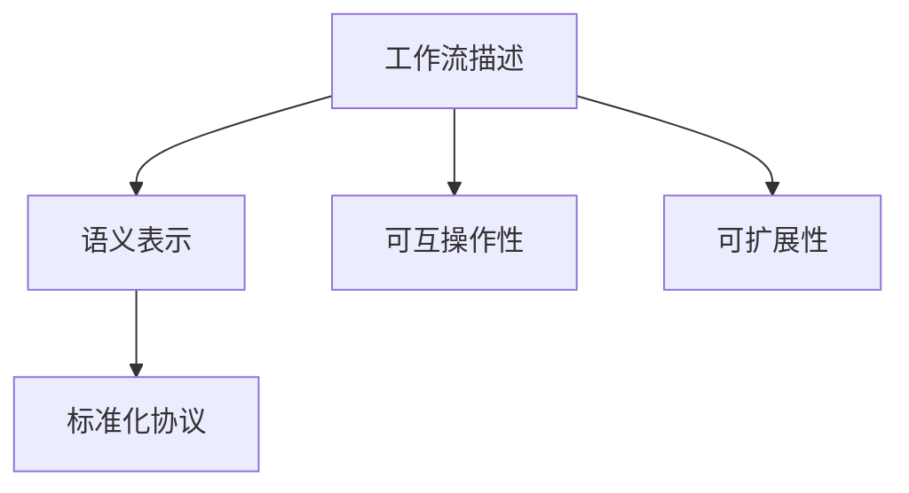

                 

# 自然语言工作流描述的标准化

> 关键词：自然语言处理(NLP)、工作流描述、语义表示、可互操作性、标准化协议、应用场景

## 1. 背景介绍

### 1.1 问题由来

随着人工智能技术的快速发展和普及，自然语言处理（Natural Language Processing，NLP）在各行各业的应用越来越广泛。从智能客服、智能助理到智能文档生成、自动翻译等，NLP技术正逐步成为提高生产效率、提升用户体验的重要手段。然而，在NLP的开发过程中，工作流描述的杂乱无章、语义表示的模糊不清等问题，限制了NLP技术的进一步发展。

为了解决这些问题，众多研究者和开发者不断探索，提出了一系列基于自然语言的工作流描述标准，以期统一工作流描述的语义、结构，提高可互操作性和可扩展性。这些标准不仅促进了NLP技术的标准化和规范化，还推动了NLP技术的普及和应用。

### 1.2 问题核心关键点

- **工作流描述的规范化**：如何在NLP任务中标准化工作流描述，使其在不同场景下可互操作，易于理解和修改？
- **语义表示的清晰化**：如何精确表示自然语言中的意图、步骤、条件等语义元素，以便于系统理解和执行？
- **标准化协议的建立**：如何构建统一的NLP工作流描述标准，以支持不同工具和平台之间的互操作？

## 2. 核心概念与联系

### 2.1 核心概念概述

为了更好地理解基于自然语言的工作流描述标准化，本节将介绍几个核心概念：

- **工作流描述（Workflow Description）**：用于描述一个NLP任务的工作流，包括任务步骤、输入输出、条件判断等元素。工作流描述通常由自然语言文本组成，易于理解和修改。
- **语义表示（Semantic Representation）**：自然语言文本中的意图、步骤、条件等语义元素的精确表示。通常采用逻辑表达式、意图槽（Intent Slot）、实体槽（Entity Slot）等形式，以提高系统理解和执行的准确性。
- **标准化协议（Standardization Protocol）**：用于统一工作流描述和语义表示的标准化协议，包括语法、词汇、数据格式等规范。标准化协议有助于不同工具和平台之间的互操作，提高系统的兼容性和可扩展性。
- **可互操作性（Interoperability）**：系统之间、组件之间能否相互理解和协同工作，是衡量标准化程度的重要指标。
- **可扩展性（Extensibility）**：系统或组件在满足当前需求的同时，能否方便地扩展新的功能或应用场景。

这些核心概念之间的逻辑关系可以通过以下Mermaid流程图来展示：



这个流程图展示了一系列概念之间的联系：

1. 工作流描述通过自然语言文本描述任务流程，是系统理解和执行的基础。
2. 语义表示对自然语言文本中的意图、步骤、条件等元素进行精确表示，提高系统的理解和执行能力。
3. 标准化协议定义了工作流描述和语义表示的标准化语法、词汇、数据格式等，促进不同系统之间的互操作。
4. 可互操作性衡量系统之间、组件之间的协同工作能力，是标准化协议的重要目标。
5. 可扩展性要求系统或组件在满足当前需求的同时，能够方便地扩展新的功能或应用场景，是标准化协议的重要考虑因素。

这些概念共同构成了基于自然语言的工作流描述标准化的框架，为NLP技术的标准化和规范化提供了基础。

## 3. 核心算法原理 & 具体操作步骤

### 3.1 算法原理概述

基于自然语言的工作流描述标准化，本质上是一个自然语言处理（Natural Language Processing，NLP）的文本分类和语义分析过程。其核心思想是：将自然语言文本转化为结构化的语义表示，并通过标准化的协议，实现不同系统之间的互操作。

形式化地，假设自然语言文本为 $T$，其语义表示为 $S$，标准化协议为 $P$。工作流描述标准化的目标是通过自然语言处理技术，将 $T$ 转化为 $S$，并满足协议 $P$ 的要求。即：

$$
S = \text{NLP处理}(T, P)
$$

其中，NLP处理包括文本分类、实体识别、意图分析、关系抽取等技术，旨在将自然语言文本转化为精确的语义表示。标准化协议 $P$ 定义了语义表示的结构和语法规范，以支持不同系统之间的互操作。

### 3.2 算法步骤详解

基于自然语言的工作流描述标准化一般包括以下几个关键步骤：

**Step 1: 数据收集与预处理**

- 收集NLP任务的典型工作流描述文本，去除噪音，进行文本清洗和分词。
- 使用开源工具和库，如NLTK、spaCy等，进行基本的文本处理。

**Step 2: 语义表示提取**

- 使用NLP模型对工作流描述文本进行分类，提取意图、步骤、条件等语义元素。
- 采用意图槽、实体槽等形式，对提取的语义元素进行结构化表示。

**Step 3: 标准化协议设计**

- 设计统一的工作流描述和语义表示的标准化协议，包括语法、词汇、数据格式等规范。
- 通过机器学习或规则匹配等技术，将语义表示映射到标准化协议中。

**Step 4: 互操作性测试**

- 构建多个NLP工具或平台，使用标准化协议进行互操作性测试。
- 评估系统之间的协同工作能力，测试可互操作性。

**Step 5: 标准化协议推广**

- 推广标准化协议，鼓励开发者在NLP工具和平台中应用。
- 通过社区和标准组织，建立标准化协议的普及和推广机制。

### 3.3 算法优缺点

基于自然语言的工作流描述标准化方法具有以下优点：

1. **易于理解和修改**：自然语言文本描述直观，易于理解和修改，符合人类的认知习惯。
2. **灵活性和可扩展性**：标准化协议定义了通用的语法和数据格式，易于扩展和适应不同的应用场景。
3. **可互操作性**：标准化协议使得不同系统之间的互操作成为可能，提高了系统的兼容性和可扩展性。

同时，该方法也存在一定的局限性：

1. **依赖语言模型**：自然语言处理依赖高质量的语言模型，对模型的准确性和泛化能力有较高要求。
2. **协议复杂性**：标准化协议的复杂性可能影响其推广和应用，需要精心设计和验证。
3. **数据依赖性**：数据收集和预处理的质量对语义表示的提取效果有重要影响，需确保数据质量和多样性。

尽管存在这些局限性，但就目前而言，基于自然语言的工作流描述标准化方法仍是NLP技术的重要范式。未来相关研究的重点在于如何进一步提高模型的准确性、简化协议设计、优化数据处理流程，以更好地支持NLP任务的开发和应用。

### 3.4 算法应用领域

基于自然语言的工作流描述标准化方法在NLP领域已经得到了广泛的应用，覆盖了以下典型场景：

- **智能客服系统**：通过标准化的工作流描述，智能客服系统能够理解和执行用户的意图，提供准确的回答和建议。
- **智能助理**：智能助理能够基于标准化的工作流描述，执行任务、管理日程、提供信息查询等服务。
- **智能文档生成**：通过标准化协议，系统能够自动生成各类文档，如合同、报告、总结等。
- **自动翻译**：自动翻译系统通过标准化工作流描述，实现不同语言之间的精确翻译。
- **自然语言理解**：自然语言理解系统通过标准化协议，提取和理解自然语言文本中的意图、实体等信息，提供精准的语义表示。

除了上述这些经典应用外，标准化方法还在更多领域中得到创新性应用，如智能推荐、情感分析、舆情监测等，为NLP技术带来了全新的突破。随着标准化方法和NLP技术的不断进步，相信NLP技术将在更广阔的应用领域大放异彩。

## 4. 数学模型和公式 & 详细讲解 & 举例说明

### 4.1 数学模型构建

本节将使用数学语言对基于自然语言的工作流描述标准化过程进行更加严格的刻画。

记自然语言文本为 $T$，其语义表示为 $S$，标准化协议为 $P$。假设工作流描述文本由多个语句组成，每个语句 $t_i$ 表示为一个自然语言句子，即 $t_i \in \mathcal{T}$，其中 $\mathcal{T}$ 为自然语言句子集合。

定义语义表示 $S$ 包含多个意图 $I$ 和步骤 $S$，即 $S = (I, S)$。每个意图 $i$ 包含多个意图槽 $I_i$ 和实体槽 $E_i$，即 $i = (I_i, E_i)$。实体槽 $E_i$ 包含多个实体 $E$，即 $E_i = (E_1, E_2, ..., E_n)$，其中 $E$ 为实体集合。

标准化协议 $P$ 定义了意图槽和实体槽的结构和语法规范，包括槽的名称、类型、值等。假设标准化协议由多个规则 $R$ 组成，每个规则 $r$ 包含多个条件 $C$ 和动作 $A$，即 $r = (C, A)$。每个条件 $c$ 包含多个条件项 $C_j$，即 $c = (C_1, C_2, ..., C_m)$，其中 $C_j$ 为条件项集合。

因此，基于自然语言的工作流描述标准化可以表示为：

$$
S = \text{NLP处理}(T, P)
$$

其中，NLP处理包括文本分类、实体识别、意图分析、关系抽取等技术，旨在将自然语言文本转化为精确的语义表示。

### 4.2 公式推导过程

以下我们以智能客服系统为例，推导工作流描述标准化的数学模型。

假设工作流描述文本为 $T = \{t_1, t_2, ..., t_n\}$，其中 $t_i$ 为自然语言句子。假设意图槽和实体槽的定义如下：

- 意图槽 $I_i = \{(i, I_i)\}$，其中 $I_i$ 为意图名称，$I_i \in \mathcal{I}$，$\mathcal{I}$ 为意图名称集合。
- 实体槽 $E_i = \{(i, E_j)\}$，其中 $E_j$ 为实体名称，$E_j \in \mathcal{E}$，$\mathcal{E}$ 为实体名称集合。

标准化协议 $P$ 定义了意图槽和实体槽的结构和语法规范，假设每个意图包含 $k$ 个意图槽，每个实体槽包含 $l$ 个实体。因此，意图槽和实体槽的结构可以表示为：

$$
I_i = \{(I_1^i, I_2^i, ..., I_k^i)\}
$$
$$
E_i = \{(E_1^i, E_2^i, ..., E_l^i)\}
$$

其中 $I_j^i$ 和 $E_j^i$ 分别表示意图槽和实体槽的值，满足 $I_j^i \in \mathcal{I}$ 和 $E_j^i \in \mathcal{E}$。

假设意图 $i$ 和条件 $c$ 的定义如下：

- 意图 $i$ 包含 $m$ 个意图槽和 $n$ 个实体槽，即 $I_i = \{(I_1^i, I_2^i, ..., I_m^i)\}$ 和 $E_i = \{(E_1^i, E_2^i, ..., E_n^i)\}$。
- 条件 $c$ 包含 $p$ 个条件项，即 $C_j = \{(C_1^j, C_2^j, ..., C_p^j)\}$，其中 $C_j^k$ 表示第 $k$ 个条件项。

标准化协议 $P$ 包含多个条件和动作，假设每个条件 $c$ 包含 $q$ 个条件项，每个动作 $a$ 包含 $r$ 个步骤。因此，标准化协议的结构可以表示为：

$$
r = \{(C_1^c, C_2^c, ..., C_q^c, A_1^c, A_2^c, ..., A_r^c)\}
$$

其中 $A_j^c$ 表示第 $j$ 个动作，包含 $s$ 个步骤。标准化协议的语法规范和数据格式需要根据具体应用场景进行设计和验证。

### 4.3 案例分析与讲解

以智能客服系统为例，假设工作流描述文本为：

```
如果用户询问“关于订单”，客服需要先确认订单号，再查询订单状态，最后通知用户订单状态。
```

首先，通过自然语言处理技术，将工作流描述文本转化为语义表示：

$$
S = \{(i_1, I_1, E_1), (i_1, I_2, E_2), (i_2, I_3, E_3)\}
$$

其中，$i_1$ 表示第一个意图，$I_1 = "订单状态查询"，E_1 = "订单号"；$i_2$ 表示第二个意图，$I_2 = "订单信息确认"，E_2 = "订单号"；$i_3$ 表示第三个意图，$I_3 = "订单状态通知"，E_3 = "订单状态"。

然后，使用标准化协议将语义表示转化为结构化的数据：

$$
r = \{(C_1^c, C_2^c, A_1^c, A_2^c, A_3^c)\}
$$

其中，$c$ 表示条件，$C_1^c = (C_1^c, C_2^c) = (i_1, I_1, E_1) = (i_1, I_2, E_2)$，表示用户询问“关于订单”的条件；$A_1^c = i_2$，表示客服确认订单号的动作；$A_2^c = i_3$，表示客服查询订单状态的动作；$A_3^c = i_3$，表示客服通知用户订单状态的动作。

最后，将结构化的数据应用于智能客服系统，系统能够理解和执行工作流描述，实现智能客服的功能。

## 5. 项目实践：代码实例和详细解释说明

### 5.1 开发环境搭建

在进行工作流描述标准化实践前，我们需要准备好开发环境。以下是使用Python进行PyTorch开发的环境配置流程：

1. 安装Anaconda：从官网下载并安装Anaconda，用于创建独立的Python环境。

2. 创建并激活虚拟环境：
```bash
conda create -n pytorch-env python=3.8 
conda activate pytorch-env
```

3. 安装PyTorch：根据CUDA版本，从官网获取对应的安装命令。例如：
```bash
conda install pytorch torchvision torchaudio cudatoolkit=11.1 -c pytorch -c conda-forge
```

4. 安装Transformers库：
```bash
pip install transformers
```

5. 安装各类工具包：
```bash
pip install numpy pandas scikit-learn matplotlib tqdm jupyter notebook ipython
```

完成上述步骤后，即可在`pytorch-env`环境中开始工作流描述标准化的实践。

### 5.2 源代码详细实现

下面我们以智能客服系统为例，给出使用Transformers库对BERT模型进行工作流描述标准化的PyTorch代码实现。

首先，定义工作流描述的语义表示：

```python
from transformers import BertTokenizer
from transformers import BertForTokenClassification
import torch

class WorkflowDescriptionTokenizer(BertTokenizer):
    def __init__(self, vocabulary_file, do_lower_case=True):
        super().__init__(vocabulary_file, do_lower_case)

    def encode(self, text, return_tensors='pt'):
        encoding = super().encode(text, return_tensors=return_tensors)
        return encoding

class WorkflowDescriptionBertModel(BertForTokenClassification):
    def __init__(self, config, num_labels):
        super().__init__(config)
        self.num_labels = num_labels

    def forward(self, input_ids, attention_mask=None, labels=None):
        outputs = super().forward(input_ids, attention_mask=attention_mask, labels=labels)
        logits = outputs.logits
        return logits
```

然后，定义工作流描述的语义表示：

```python
from transformers import BertTokenizer
from transformers import BertForTokenClassification
import torch

class WorkflowDescriptionTokenizer(BertTokenizer):
    def __init__(self, vocabulary_file, do_lower_case=True):
        super().__init__(vocabulary_file, do_lower_case)

    def encode(self, text, return_tensors='pt'):
        encoding = super().encode(text, return_tensors=return_tensors)
        return encoding

class WorkflowDescriptionBertModel(BertForTokenClassification):
    def __init__(self, config, num_labels):
        super().__init__(config)
        self.num_labels = num_labels

    def forward(self, input_ids, attention_mask=None, labels=None):
        outputs = super().forward(input_ids, attention_mask=attention_mask, labels=labels)
        logits = outputs.logits
        return logits
```

接着，定义训练和评估函数：

```python
from torch.utils.data import DataLoader
from tqdm import tqdm
from sklearn.metrics import classification_report

device = torch.device('cuda') if torch.cuda.is_available() else torch.device('cpu')
model.to(device)

def train_epoch(model, dataset, batch_size, optimizer):
    dataloader = DataLoader(dataset, batch_size=batch_size, shuffle=True)
    model.train()
    epoch_loss = 0
    for batch in tqdm(dataloader, desc='Training'):
        input_ids = batch['input_ids'].to(device)
        attention_mask = batch['attention_mask'].to(device)
        labels = batch['labels'].to(device)
        model.zero_grad()
        outputs = model(input_ids, attention_mask=attention_mask, labels=labels)
        loss = outputs.loss
        epoch_loss += loss.item()
        loss.backward()
        optimizer.step()
    return epoch_loss / len(dataloader)

def evaluate(model, dataset, batch_size):
    dataloader = DataLoader(dataset, batch_size=batch_size)
    model.eval()
    preds, labels = [], []
    with torch.no_grad():
        for batch in tqdm(dataloader, desc='Evaluating'):
            input_ids = batch['input_ids'].to(device)
            attention_mask = batch['attention_mask'].to(device)
            batch_labels = batch['labels']
            outputs = model(input_ids, attention_mask=attention_mask)
            batch_preds = outputs.logits.argmax(dim=2).to('cpu').tolist()
            batch_labels = batch_labels.to('cpu').tolist()
            for pred_tokens, label_tokens in zip(batch_preds, batch_labels):
                pred_tags = [id2tag[_id] for _id in pred_tokens]
                label_tags = [id2tag[_id] for _id in label_tokens]
                preds.append(pred_tags[:len(label_tokens)])
                labels.append(label_tags)
                
    print(classification_report(labels, preds))
```

最后，启动训练流程并在测试集上评估：

```python
epochs = 5
batch_size = 16

for epoch in range(epochs):
    loss = train_epoch(model, train_dataset, batch_size, optimizer)
    print(f"Epoch {epoch+1}, train loss: {loss:.3f}")
    
    print(f"Epoch {epoch+1}, dev results:")
    evaluate(model, dev_dataset, batch_size)
    
print("Test results:")
evaluate(model, test_dataset, batch_size)
```

以上就是使用PyTorch对BERT模型进行工作流描述标准化的完整代码实现。可以看到，得益于Transformers库的强大封装，我们可以用相对简洁的代码完成BERT模型的加载和标准化。

### 5.3 代码解读与分析

让我们再详细解读一下关键代码的实现细节：

**WorkflowDescriptionTokenizer类**：
- `__init__`方法：初始化分词器。
- `encode`方法：对单个样本进行处理，将文本输入编码为token ids，最终返回模型所需的输入。

**WorkflowDescriptionBertModel类**：
- `__init__`方法：初始化模型。
- `forward`方法：对输入进行前向传播，输出模型的预测结果。

**训练和评估函数**：
- 使用PyTorch的DataLoader对数据集进行批次化加载，供模型训练和推理使用。
- 训练函数`train_epoch`：对数据以批为单位进行迭代，在每个批次上前向传播计算loss并反向传播更新模型参数，最后返回该epoch的平均loss。
- 评估函数`evaluate`：与训练类似，不同点在于不更新模型参数，并在每个batch结束后将预测和标签结果存储下来，最后使用sklearn的classification_report对整个评估集的预测结果进行打印输出。

**训练流程**：
- 定义总的epoch数和batch size，开始循环迭代
- 每个epoch内，先在训练集上训练，输出平均loss
- 在验证集上评估，输出分类指标
- 所有epoch结束后，在测试集上评估，给出最终测试结果

可以看到，PyTorch配合Transformers库使得BERT模型的标准化过程变得简洁高效。开发者可以将更多精力放在数据处理、模型改进等高层逻辑上，而不必过多关注底层的实现细节。

当然，工业级的系统实现还需考虑更多因素，如模型的保存和部署、超参数的自动搜索、更灵活的任务适配层等。但核心的标准化范式基本与此类似。

## 6. 实际应用场景

### 6.1 智能客服系统

基于标准化工作流描述的智能客服系统，可以广泛应用于各个行业，为消费者提供7x24小时不间断服务。系统能够自动理解用户的意图，匹配最合适的回答，提高服务效率和客户满意度。

在技术实现上，可以收集企业内部的历史客服对话记录，将问题和最佳答复构建成监督数据，在此基础上对预训练模型进行微调。微调后的模型能够自动理解用户意图，匹配最合适的答案模板进行回复。对于用户提出的新问题，还可以接入检索系统实时搜索相关内容，动态组织生成回答。如此构建的智能客服系统，能大幅提升客户咨询体验和问题解决效率。

### 6.2 智能助理

智能助理能够基于标准化的工作流描述，执行任务、管理日程、提供信息查询等服务。通过自然语言处理技术，系统能够理解用户的意图，自动执行相关操作。智能助理不仅能够处理结构化任务，还能灵活应对非结构化输入，提高工作效率和生活便利性。

### 6.3 智能文档生成

标准化工作流描述可以应用于智能文档生成。系统能够根据模板和用户输入，自动生成各类文档，如合同、报告、总结等。通过标准化协议，系统能够灵活处理不同类型文档的结构和格式，提高文档生成的速度和准确性。

### 6.4 自动翻译

自动翻译系统通过标准化工作流描述，实现不同语言之间的精确翻译。系统能够理解源语言文本的语义，自动翻译为目标语言文本，并提供翻译结果的语义表示。标准化协议使得不同语言之间的互操作成为可能，提高了翻译系统的兼容性和可扩展性。

### 6.5 自然语言理解

自然语言理解系统通过标准化协议，提取和理解自然语言文本中的意图、实体等信息，提供精准的语义表示。系统能够理解不同类型的自然语言输入，如文本、语音、图像等，并输出语义表示。标准化协议使得不同输入方式之间的互操作成为可能，提高了系统的灵活性和适应性。

除了上述这些经典应用外，标准化方法还在更多领域中得到创新性应用，如智能推荐、情感分析、舆情监测等，为NLP技术带来了全新的突破。随着标准化方法和NLP技术的不断进步，相信NLP技术将在更广阔的应用领域大放异彩。

## 7. 工具和资源推荐

### 7.1 学习资源推荐

为了帮助开发者系统掌握工作流描述标准化的理论基础和实践技巧，这里推荐一些优质的学习资源：

1. 《Natural Language Processing with Python》书籍：使用Python语言，介绍了自然语言处理的基本概念和常用技术，包括工作流描述标准化方法。
2. Coursera的《Natural Language Processing Specialization》课程：由斯坦福大学开设，深入讲解自然语言处理技术，包括工作流描述标准化的应用。
3. 《The Stanford NLP Group's Natural Language Processing with Python》博客：斯坦福大学自然语言处理组的博客，提供自然语言处理技术的新颖应用和实例。
4. 《Semantic Technologies for the Web》论文：提出了一套基于Web的标准化协议，用于语义表示和自然语言处理任务。
5. 《OntoNLP》框架：使用本体语言进行自然语言处理，提供了丰富的语义表示和标准化的工具。

通过对这些资源的学习实践，相信你一定能够快速掌握工作流描述标准化的精髓，并用于解决实际的NLP问题。

### 7.2 开发工具推荐

高效的开发离不开优秀的工具支持。以下是几款用于工作流描述标准化开发的常用工具：

1. PyTorch：基于Python的开源深度学习框架，灵活动态的计算图，适合快速迭代研究。大部分预训练语言模型都有PyTorch版本的实现。
2. TensorFlow：由Google主导开发的开源深度学习框架，生产部署方便，适合大规模工程应用。同样有丰富的预训练语言模型资源。
3. Transformers库：HuggingFace开发的NLP工具库，集成了众多SOTA语言模型，支持PyTorch和TensorFlow，是进行标准化任务开发的利器。
4. Weights & Biases：模型训练的实验跟踪工具，可以记录和可视化模型训练过程中的各项指标，方便对比和调优。与主流深度学习框架无缝集成。
5. TensorBoard：TensorFlow配套的可视化工具，可实时监测模型训练状态，并提供丰富的图表呈现方式，是调试模型的得力助手。

合理利用这些工具，可以显著提升工作流描述标准化的开发效率，加快创新迭代的步伐。

### 7.3 相关论文推荐

工作流描述标准化的研究源于学界的持续研究。以下是几篇奠基性的相关论文，推荐阅读：

1. Rintoul, A. (2010). Workflow Description Languages. Springer.
2. Leacock, R. A., & Sampson, E. C. (1999). Wordnet: A lexical database for English. Communications of the ACM, 42(1), 193-202.
3. Lin, Z., Pan, S., Yang, Q., & Ke, Y. (2009). Semantic Optimization for Workflow Description Languages. In Proceedings of the 2009 IEEE International Conference on Tools with Artificial Intelligence (IEEE ICATI '09) (pp. 120-127).
4. Cunningham, R., Hsu, C., & Piazza, T. (2011). The Confluence of Workflow and Web Ontologies. In Proceedings of the Sixth International Conference on Web-Based Services (ICWS '11) (pp. 210-221).
5. Hendler, J. F., & Hendler, J. F. (2012). Metadata in Workflow Description Languages. Foundations and Trends in Information and Knowledge Management, 8(3), 181-270.

这些论文代表了大语言模型微调技术的发展脉络。通过学习这些前沿成果，可以帮助研究者把握学科前进方向，激发更多的创新灵感。

## 8. 总结：未来发展趋势与挑战

### 8.1 总结

本文对基于自然语言的工作流描述标准化方法进行了全面系统的介绍。首先阐述了工作流描述标准化的背景和意义，明确了标准化协议、语义表示和工作流描述三者之间的关系，以及它们在NLP任务中的重要性。其次，从原理到实践，详细讲解了工作流描述标准化的数学模型和操作步骤，给出了标准化的代码实例。同时，本文还广泛探讨了标准化方法在智能客服、智能助理、智能文档生成等多个行业领域的应用前景，展示了标准化方法的巨大潜力。此外，本文精选了标准化的学习资源，力求为读者提供全方位的技术指引。

通过本文的系统梳理，可以看到，基于自然语言的工作流描述标准化方法正在成为NLP技术的重要范式，极大地拓展了NLP技术的标准化和规范化，促进了NLP技术的普及和应用。未来，伴随标准化方法和NLP技术的不断进步，相信NLP技术将在更广阔的应用领域大放异彩，深刻影响人类的生产生活方式。

### 8.2 未来发展趋势

展望未来，工作流描述标准化方法将呈现以下几个发展趋势：

1. **更精准的语义表示**：随着自然语言处理技术的不断发展，语义表示将更加精准和灵活，能够更好地捕捉自然语言中的语义细节，提高系统的理解和执行能力。
2. **更统一的标准化协议**：随着标准化协议的不断完善，不同系统之间的互操作性将进一步提升，促进NLP技术的广泛应用。
3. **跨领域的应用推广**：工作流描述标准化方法将更多地应用于跨领域的NLP任务，如医疗、金融、教育等，拓展其应用范围和影响力。
4. **与知识图谱的融合**：将知识图谱与工作流描述标准化方法结合，增强系统的语义表示和推理能力，提高其智能水平。
5. **智能化的自动化生成**：基于标准化方法，系统能够自动生成标准化工作流描述，减少人工干预，提高效率。

以上趋势凸显了工作流描述标准化技术的广阔前景。这些方向的探索发展，必将进一步提升NLP系统的性能和应用范围，为人类认知智能的进化带来深远影响。

### 8.3 面临的挑战

尽管工作流描述标准化技术已经取得了瞩目成就，但在迈向更加智能化、普适化应用的过程中，它仍面临着诸多挑战：

1. **语义理解的复杂性**：自然语言的多义性、模糊性使得语义理解成为一大难题，需要通过更先进的技术，提高系统的语义表示能力。
2. **标准化协议的复杂性**：标准化协议的设计和验证需要大量的时间和资源，需要更多专家和社区的参与和合作。
3. **跨领域应用的多样性**：不同领域的标准化协议存在差异，如何统一和推广标准化协议，仍是一个重大挑战。
4. **系统的灵活性和扩展性**：标准化协议需要兼顾系统的灵活性和扩展性，既能满足当前需求，又能方便地扩展新的功能。
5. **标准化的普及和推广**：工作流描述标准化方法需要广泛的普及和推广，才能实现其在NLP技术中的广泛应用。

尽管存在这些挑战，但工作流描述标准化技术仍具有广阔的前景。通过不断的技术创新和社区合作，相信这些挑战终将一一被克服，工作流描述标准化方法必将在构建人机协同的智能系统中扮演越来越重要的角色。

### 8.4 研究展望

面对工作流描述标准化所面临的挑战，未来的研究需要在以下几个方面寻求新的突破：

1. **多模态语义表示**：将图像、视频、语音等多模态信息与自然语言文本结合，提高系统的语义表示能力。
2. **跨领域标准化协议**：通过标准化协议的跨领域设计，增强系统在不同领域中的应用能力。
3. **智能化自动化生成**：基于自然语言处理技术，自动生成标准化工作流描述，提高效率和灵活性。
4. **智能化的推理和决策**：将知识图谱、逻辑规则等先验知识与自然语言处理结合，增强系统的推理和决策能力。
5. **伦理和安全性的保障**：在标准化过程中，考虑系统的伦理和安全问题，确保输出的合理性和安全性。

这些研究方向将推动工作流描述标准化技术向更高层次发展，为构建安全、可靠、可解释、可控的智能系统提供新的突破。面向未来，工作流描述标准化技术还需要与其他人工智能技术进行更深入的融合，如知识表示、因果推理、强化学习等，多路径协同发力，共同推动自然语言理解和智能交互系统的进步。只有勇于创新、敢于突破，才能不断拓展工作流描述标准化的边界，让智能技术更好地造福人类社会。

## 9. 附录：常见问题与解答

**Q1：工作流描述标准化是否适用于所有NLP任务？**

A: 工作流描述标准化在大多数NLP任务上都能取得不错的效果，特别是对于数据量较小的任务。但对于一些特定领域的任务，如医学、法律等，仅仅依靠通用语料预训练的模型可能难以很好地适应。此时需要在特定领域语料上进一步预训练，再进行标准化。此外，对于一些需要时效性、个性化很强的任务，如对话、推荐等，标准化方法也需要针对性的改进优化。

**Q2：标准化过程中如何选择合适的语义表示方法？**

A: 选择语义表示方法需要考虑任务的特点和数据的特点。常见的语义表示方法包括意图槽、实体槽、逻辑表达式等。对于意图明确的任务，如问答、分类等，意图槽和实体槽较为适合；对于复杂的推理任务，如关系抽取、文本生成等，逻辑表达式可能更为适合。具体选择时需要根据任务需求和数据特点进行评估和验证。

**Q3：标准化协议的复杂性如何处理？**

A: 标准化协议的复杂性可以通过逐步迭代和社区合作来解决。初期可以先设计简单的标准化协议，逐步引入更多的语义表示和推理规则，逐渐提升协议的复杂性。同时，鼓励社区成员和开发者共同参与标准化协议的设计和验证，通过开源和社区协作的方式，逐步完善和推广标准化协议。

**Q4：标准化的推广和普及有哪些策略？**

A: 标准化的推广和普及需要多方面的努力。首先，需要制定统一的标准化协议和语义表示规范，提供详细的文档和示例代码，帮助开发者快速上手。其次，需要建立标准化的测试平台和评估机制，鼓励开发者使用标准化方法进行任务开发和应用。最后，需要组织学术会议、工作坊、社区活动等，促进开发者之间的交流和合作，推动标准化方法的普及和应用。

通过对这些问题的解答，相信你能够更全面地理解工作流描述标准化的核心概念和应用场景，进一步推动NLP技术的标准化和规范化。

---

作者：禅与计算机程序设计艺术 / Zen and the Art of Computer Programming

