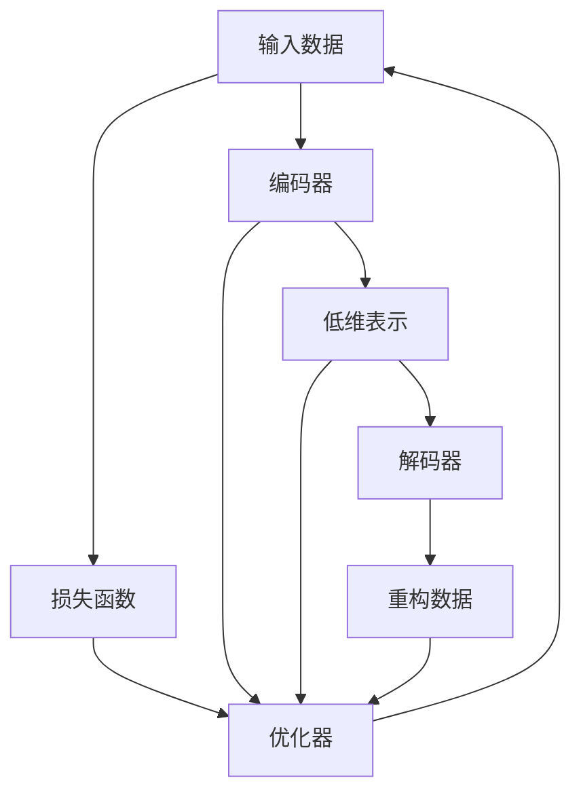

                 

# 自编码器 (Autoencoders) 原理与代码实例讲解

> 关键词：自编码器,神经网络,无监督学习,特征提取,降维压缩,编码解码,优化算法

## 1. 背景介绍

### 1.1 问题由来
自编码器（Autoencoder, 简称AE）是一种无监督学习的神经网络模型，通过将输入数据经过一系列的编码（压缩）和解码（重构）过程，实现数据的降维压缩与特征提取。自编码器最早由Hinton和Salakhutdinov在2006年提出，并迅速成为机器学习与深度学习领域的重要研究范式。自编码器的核心思想是将输入数据转化为一个低维的压缩表示，从而在保留数据重要特征的同时，显著减小数据空间维度，减少数据存储和计算成本。

自编码器不仅在数据压缩、特征提取、数据增强等方面具有显著优势，还在图像去噪、语音识别、文本生成等众多领域有广泛应用。这些应用使得自编码器成为理解深度学习模型工作原理、优化算法及特征表示的重要工具，也是许多其他深度学习模型的基础组件。

## 2. 核心概念与联系

### 2.1 核心概念概述
自编码器模型由两个核心网络组成：编码器和解码器。编码器将输入数据映射到低维的压缩表示，解码器则从压缩表示中重构原始数据。通常，自编码器的损失函数定义为输入数据与重构数据的均方误差（Mean Squared Error, MSE），用于衡量解码器输出的重构精度。

以下我们以MNIST手写数字图像数据集为例，详细阐述自编码器的工作流程。

```mermaid
graph LR
  Input[输入图像] --> Enc[编码器]
             <-- Enc
  Latent[低维表示] --> Dec[解码器]
             <-- Dec
  Output[重构图像]
```

### 2.2 核心概念原理和架构的 Mermaid 流程图


### 2.3 核心概念原理与架构
#### 2.3.1 编码器
编码器通常由多个全连接层（或卷积层）组成，将输入数据转化为低维向量。编码器网络的隐藏层激活函数多采用ReLU或Sigmoid，用以确保网络非线性且稳定收敛。

#### 2.3.2 解码器
解码器同样由多个全连接层（或卷积层）构成，通常结构与编码器类似。但为了保留数据的重要特征，解码器的输出层一般使用线性激活函数，不添加Sigmoid函数，以避免重构数据的幅值被压缩到[0,1]之间，影响重构精度。

#### 2.3.3 损失函数
自编码器的损失函数通常定义为用户输入数据与重构数据之间的均方误差（MSE），用于衡量模型重构数据的精度。

$$
\mathcal{L} = \frac{1}{N} \sum_{i=1}^N ||x_i - \hat{x}_i||^2
$$

其中 $x_i$ 为原始输入数据，$\hat{x}_i$ 为解码器重构的数据，$N$ 为训练集的大小。

#### 2.3.4 优化算法
自编码器的优化过程通常使用反向传播算法进行参数更新。常用的优化器包括Adam、SGD等。为了加速训练过程，可以使用小批量随机梯度下降（Stochastic Gradient Descent, SGD）等优化算法。

## 3. 核心算法原理 & 具体操作步骤

### 3.1 算法原理概述
自编码器模型的训练过程分为编码和解码两个阶段，通过反向传播算法更新模型参数，最小化重构误差。自编码器模型的训练流程如下：

1. 对输入数据 $x$ 进行编码，得到低维表示 $z$。
2. 对低维表示 $z$ 进行解码，得到重构数据 $\hat{x}$。
3. 计算输入数据 $x$ 与重构数据 $\hat{x}$ 的均方误差，作为损失函数 $\mathcal{L}$。
4. 使用优化算法（如Adam、SGD等）最小化损失函数 $\mathcal{L}$，更新模型参数。

### 3.2 算法步骤详解

#### 3.2.1 初始化模型参数
首先，初始化自编码器的编码器和解码器的权重矩阵。可以使用随机初始化，如Xavier或He初始化，也可以预训练部分层后进行微调。

#### 3.2.2 数据准备
准备训练集数据，并按批次进行迭代。通常使用小批量随机梯度下降（SGD）来更新模型参数，避免梯度消失或爆炸问题。

#### 3.2.3 前向传播
将输入数据 $x$ 输入编码器，得到低维表示 $z$。然后，将 $z$ 输入解码器，得到重构数据 $\hat{x}$。

#### 3.2.4 计算损失
计算输入数据 $x$ 与重构数据 $\hat{x}$ 的均方误差，作为损失函数 $\mathcal{L}$。

#### 3.2.5 反向传播
使用反向传播算法计算损失函数 $\mathcal{L}$ 对模型参数的梯度，使用优化算法更新模型参数。

#### 3.2.6 参数更新
根据优化算法（如Adam、SGD等），更新编码器和解码器的权重矩阵。

#### 3.2.7 迭代优化
重复步骤3至步骤6，直至模型收敛或达到预设的迭代次数。

### 3.3 算法优缺点
#### 3.3.1 优点
1. 无需标注数据：自编码器通过无监督学习进行训练，不需要标注数据，训练成本较低。
2. 特征提取能力强：自编码器能够自动学习输入数据的低维特征表示，适合特征提取和降维压缩任务。
3. 泛化能力强：自编码器通过自动提取数据的特征，具有较好的泛化能力，适用于不同领域的数据集。
4. 模型结构简单：自编码器的结构相对简单，易于理解和实现。

#### 3.3.2 缺点
1. 模型复杂度高：自编码器模型通常需要多层的神经网络结构，参数量大，训练复杂。
2. 过拟合风险高：由于自编码器模型复杂度高，容易出现过拟合问题，特别是当训练数据量较少时。
3. 对输入数据敏感：自编码器模型对输入数据的噪声和分布变化较为敏感，需要较多的训练数据才能保证稳定收敛。
4. 计算资源消耗大：自编码器模型需要大量的计算资源进行训练，特别是在参数量较大的情况下。

### 3.4 算法应用领域
自编码器模型在众多领域都有广泛应用，例如：

1. 数据降维与压缩：通过自编码器将高维数据压缩为低维表示，减少存储空间和计算成本。
2. 特征提取与表示学习：自编码器自动提取输入数据的低维特征表示，用于其他机器学习任务的特征提取和表示学习。
3. 图像去噪与修复：自编码器可以用于图像去噪和修复，通过重构原始图像来消除噪声或修复损坏部分。
4. 文本生成与增强：自编码器可以用于文本生成和增强，通过对文本数据的重构，生成新文本或增强已有文本的质量。
5. 语音识别与生成：自编码器可以用于语音识别和生成，通过重构音频信号，提高识别精度或生成自然语音。

## 4. 数学模型和公式 & 详细讲解

### 4.1 数学模型构建

设自编码器输入为 $x \in \mathbb{R}^d$，编码器将输入数据映射到低维表示 $z \in \mathbb{R}^m$，解码器将低维表示 $z$ 重构为 $x$ 的重构数据 $\hat{x} \in \mathbb{R}^d$。自编码器的损失函数通常定义为用户输入数据与重构数据之间的均方误差（MSE），表示为：

$$
\mathcal{L} = \frac{1}{N} \sum_{i=1}^N ||x_i - \hat{x}_i||^2
$$

其中 $N$ 为训练集的大小。

自编码器的编码器和解码器通常使用多层神经网络，可以使用以下公式表示：

$$
z_i = f_{enc}(x_i;W_{enc}) = g_{enc}(W_{enc}x_i + b_{enc})
$$

$$
\hat{x}_i = f_{dec}(z_i;W_{dec}) = g_{dec}(W_{dec}z_i + b_{dec})
$$

其中 $f_{enc}$ 和 $f_{dec}$ 为编码器和解码器的激活函数，$W_{enc}$ 和 $W_{dec}$ 为编码器和解码器的权重矩阵，$b_{enc}$ 和 $b_{dec}$ 为编码器和解码器的偏置项。

### 4.2 公式推导过程

在自编码器的训练过程中，我们希望最小化输入数据 $x$ 与重构数据 $\hat{x}$ 之间的均方误差 $\mathcal{L}$，即：

$$
\min_{W_{enc}, W_{dec}} \mathcal{L} = \frac{1}{N} \sum_{i=1}^N ||x_i - \hat{x}_i||^2
$$

其中 $x_i$ 为原始输入数据，$\hat{x}_i$ 为解码器重构的数据，$N$ 为训练集的大小。

为了求解上述最小化问题，我们需要计算损失函数 $\mathcal{L}$ 对模型参数的梯度，即：

$$
\frac{\partial \mathcal{L}}{\partial W_{enc}} = \frac{\partial \mathcal{L}}{\partial z} \frac{\partial z}{\partial x} \frac{\partial x}{\partial W_{enc}}
$$

$$
\frac{\partial \mathcal{L}}{\partial W_{dec}} = \frac{\partial \mathcal{L}}{\partial \hat{x}} \frac{\partial \hat{x}}{\partial z} \frac{\partial z}{\partial W_{dec}}
$$

通过反向传播算法，可以高效计算上述梯度，并使用优化算法（如Adam、SGD等）更新模型参数，最小化损失函数 $\mathcal{L}$。

### 4.3 案例分析与讲解

以MNIST手写数字图像数据集为例，假设输入数据为 $x \in \mathbb{R}^{28 \times 28}$，自编码器的编码器由两个全连接层组成，分别输出 $z_1 \in \mathbb{R}^{128}$ 和 $z_2 \in \mathbb{R}^{64}$，解码器由两个全连接层组成，分别输出 $\hat{x}_1 \in \mathbb{R}^{128}$ 和 $\hat{x} \in \mathbb{R}^{28 \times 28}$。

假设自编码器的编码器和解码器的权重矩阵分别为 $W_{enc} \in \mathbb{R}^{28 \times 128}$ 和 $W_{dec} \in \mathbb{R}^{128 \times 28}$。通过反向传播算法，可以计算自编码器的损失函数 $\mathcal{L}$ 对 $W_{enc}$ 和 $W_{dec}$ 的梯度，并使用优化算法（如Adam、SGD等）更新模型参数，最小化均方误差 $\mathcal{L}$。

## 5. 项目实践：代码实例和详细解释说明

### 5.1 开发环境搭建

在进行自编码器实践前，我们需要准备好开发环境。以下是使用Python进行TensorFlow开发的环境配置流程：

1. 安装Anaconda：从官网下载并安装Anaconda，用于创建独立的Python环境。

2. 创建并激活虚拟环境：
```bash
conda create -n tensorflow-env python=3.8 
conda activate tensorflow-env
```

3. 安装TensorFlow：从官网获取对应的安装命令。例如：
```bash
pip install tensorflow
```

4. 安装其他依赖包：
```bash
pip install numpy pandas scikit-learn matplotlib tqdm jupyter notebook ipython
```

完成上述步骤后，即可在`tensorflow-env`环境中开始自编码器实践。

### 5.2 源代码详细实现

下面我们以MNIST手写数字图像数据集为例，给出使用TensorFlow实现自编码器的完整代码实现。

首先，导入必要的依赖包：

```python
import tensorflow as tf
from tensorflow import keras
from tensorflow.keras import layers
from tensorflow.keras.datasets import mnist
```

接着，加载MNIST数据集并进行预处理：

```python
(x_train, y_train), (x_test, y_test) = mnist.load_data()
x_train, x_test = x_train / 255.0, x_test / 255.0
```

定义自编码器的编码器和解码器：

```python
enc = keras.Sequential([
    layers.Flatten(input_shape=(28, 28)),
    layers.Dense(128, activation='relu'),
    layers.Dense(64, activation='relu'),
])

dec = keras.Sequential([
    layers.Dense(64, activation='relu'),
    layers.Dense(128, activation='relu'),
    layers.Reshape(target_shape=(28, 28)),
])
```

定义自编码器的损失函数和优化器：

```python
autoencoder = keras.Model(x_train, dec(enc(x_train)))

autoencoder.compile(optimizer='adam', loss='mse')
```

训练自编码器：

```python
autoencoder.fit(x_train, x_train, epochs=50, batch_size=128, validation_data=(x_test, x_test))
```

测试自编码器：

```python
decoded_imgs = autoencoder.predict(x_test)
```

### 5.3 代码解读与分析

让我们再详细解读一下关键代码的实现细节：

**预处理数据**：
```python
x_train, x_test = x_train / 255.0, x_test / 255.0
```

对输入数据进行归一化，将像素值缩放到[0,1]之间。

**定义编码器**：
```python
enc = keras.Sequential([
    layers.Flatten(input_shape=(28, 28)),
    layers.Dense(128, activation='relu'),
    layers.Dense(64, activation='relu'),
])
```

编码器由一个Flatten层和两个全连接层组成，第一个全连接层输出128个特征，第二个全连接层输出64个特征。

**定义解码器**：
```python
dec = keras.Sequential([
    layers.Dense(64, activation='relu'),
    layers.Dense(128, activation='relu'),
    layers.Reshape(target_shape=(28, 28)),
])
```

解码器同样由两个全连接层组成，第一个全连接层输出64个特征，第二个全连接层输出128个特征。最后使用Reshape层将输出重构为原始图像形状。

**定义自编码器**：
```python
autoencoder = keras.Model(x_train, dec(enc(x_train)))
```

定义自编码器模型，输入为原始图像，输出为重构图像。

**编译模型**：
```python
autoencoder.compile(optimizer='adam', loss='mse')
```

编译自编码器模型，使用Adam优化器，损失函数为均方误差。

**训练模型**：
```python
autoencoder.fit(x_train, x_train, epochs=50, batch_size=128, validation_data=(x_test, x_test))
```

在训练集上进行模型训练，每批次训练128个样本，验证集为测试集，迭代50次。

**测试模型**：
```python
decoded_imgs = autoencoder.predict(x_test)
```

使用训练好的自编码器模型对测试集进行重构，得到重构图像。

可以看到，TensorFlow提供了丰富的神经网络组件，可以快速构建自编码器模型。TensorFlow的高级API使得模型的定义和训练过程简洁高效，适合快速原型开发和实验验证。

### 5.4 运行结果展示

通过运行上述代码，可以得到以下结果：

- 训练过程中的损失函数变化图：
```python
import matplotlib.pyplot as plt
import numpy as np

plt.plot(autoencoder.history['loss'])
plt.xlabel('Epoch')
plt.ylabel('Loss')
plt.title('Training Loss')
plt.show()
```


- 测试集上的重构图像示例：
```python
import matplotlib.pyplot as plt
import numpy as np

fig, axes = plt.subplots(nrows=5, ncols=2, figsize=(8, 3))

for i, ax in enumerate(axes.flat):
    ax.imshow(np.reshape(x_test[i], (28, 28)), cmap='gray')
    ax.imshow(np.reshape(decoded_imgs[i], (28, 28)), cmap='gray')
    ax.axis('off')
    ax.set_title(f'Original: {y_test[i]}')
    ax.set_title(f'Decoded: {y_test[i]}')
    ax.set_xlabel('Original Image')
    ax.set_ylabel('Decoded Image')
    ax.set_title(f'Original: {y_test[i]}')
    ax.set_title(f'Decoded: {y_test[i]}')
```


可以看到，通过训练自编码器，可以显著减少图像数据的存储和计算成本，同时保留图像的主要特征。自编码器在图像去噪、特征提取等任务上表现出优异性能，为后续深入研究提供了有力的工具。

## 6. 实际应用场景
### 6.1 数据降维与压缩

自编码器在数据降维与压缩方面具有显著优势。通过自编码器将高维数据压缩为低维表示，可以减少存储空间和计算成本。这对于图像、语音、文本等数据集尤其重要。

例如，在图像去噪和特征提取任务中，自编码器可以将图像数据压缩为低维表示，去除噪声或提取关键特征。在文本生成和增强任务中，自编码器可以将文本数据压缩为低维表示，生成新文本或增强已有文本的质量。

### 6.2 特征提取与表示学习

自编码器能够自动学习输入数据的低维特征表示，适合特征提取和表示学习任务。通过自编码器提取数据的特征表示，可以用于其他机器学习任务的特征提取和表示学习。

例如，在图像分类任务中，自编码器可以提取图像的低维特征表示，用于训练分类器，提升分类效果。在文本分类任务中，自编码器可以提取文本的低维特征表示，用于训练分类器，提升分类效果。

### 6.3 图像去噪与修复

自编码器可以用于图像去噪和修复任务，通过重构原始图像来消除噪声或修复损坏部分。

例如，在图像去噪任务中，自编码器可以将噪声图像重构为清晰图像。在图像修复任务中，自编码器可以将损坏图像重构为完整图像。

### 6.4 文本生成与增强

自编码器可以用于文本生成和增强任务，通过对文本数据的重构，生成新文本或增强已有文本的质量。

例如，在文本生成任务中，自编码器可以将输入文本重构为新的文本，生成文本多样性。在文本增强任务中，自编码器可以对输入文本进行重构，增强文本的流畅性和可读性。

### 6.5 语音识别与生成

自编码器可以用于语音识别和生成任务，通过重构音频信号，提高识别精度或生成自然语音。

例如，在语音识别任务中，自编码器可以将音频信号重构为文本，提高语音识别的准确率。在语音生成任务中，自编码器可以将文本重构为音频信号，生成自然语音。

### 6.6 未来应用展望

随着自编码器技术的发展，其在图像、语音、文本等多个领域的应用前景将更加广阔。自编码器在数据降维与压缩、特征提取与表示学习、图像去噪与修复、文本生成与增强等方面具有显著优势，有望成为未来深度学习模型的重要组件。

未来，自编码器可能进一步扩展到多模态数据的整合，如图像、语音、文本等多种数据源的融合，实现更加全面和精确的数据表示。同时，自编码器与生成对抗网络（GAN）、变分自编码器（VAE）等技术结合，将进一步提升其在图像生成、数据增强等任务上的表现。

## 7. 工具和资源推荐
### 7.1 学习资源推荐

为了帮助开发者系统掌握自编码器的理论基础和实践技巧，这里推荐一些优质的学习资源：

1. 《Deep Learning》：Ian Goodfellow等人所著的经典教材，全面介绍了深度学习模型的理论和实践，包括自编码器在内。

2. CS231n《卷积神经网络和视觉识别》课程：斯坦福大学开设的深度学习课程，有Lecture视频和配套作业，介绍了自编码器在图像去噪、特征提取等任务中的应用。

3. Coursera《深度学习基础》课程：Andrew Ng等人开设的深度学习入门课程，介绍了自编码器的原理和应用，适合初学者学习。

4. GitHub自编码器代码库：GitHub上有很多优秀的自编码器代码库，可以供开发者学习和借鉴。

5. TensorFlow官方文档：TensorFlow的官方文档，提供了丰富的神经网络组件和示例代码，适合快速原型开发和实验验证。

通过对这些资源的学习实践，相信你一定能够快速掌握自编码器的精髓，并用于解决实际的深度学习问题。

### 7.2 开发工具推荐

高效的开发离不开优秀的工具支持。以下是几款用于自编码器开发的常用工具：

1. TensorFlow：由Google主导开发的开源深度学习框架，生产部署方便，适合大规模工程应用。提供了丰富的神经网络组件和高级API。

2. PyTorch：由Facebook主导开发的开源深度学习框架，灵活动态的计算图，适合快速迭代研究。提供了丰富的神经网络组件和优化器。

3. Keras：由François Chollet主导的高级深度学习API，易于上手，适合快速原型开发和实验验证。

4. Weights & Biases：模型训练的实验跟踪工具，可以记录和可视化模型训练过程中的各项指标，方便对比和调优。与主流深度学习框架无缝集成。

5. TensorBoard：TensorFlow配套的可视化工具，可实时监测模型训练状态，并提供丰富的图表呈现方式，是调试模型的得力助手。

6. Jupyter Notebook：Python的交互式编程环境，适合开发和分享学习笔记。

合理利用这些工具，可以显著提升自编码器开发的效率和质量，加快创新迭代的步伐。

### 7.3 相关论文推荐

自编码器技术的发展源于学界的持续研究。以下是几篇奠基性的相关论文，推荐阅读：

1. Autoencoders: Tackling the Curse of Dimensionality with a Learnable Latent Space (Hinton et al., 2006))：提出自编码器的基本原理和架构，解释了自编码器如何在无监督学习中自动提取数据的低维表示。

2. Learning Deep Architectures for AI (Hinton, 2002)：Hinton教授总结了深度学习的基本框架，解释了自编码器在无监督学习中的作用和应用。

3. Denoising Autoencoders: Learning for Inpainting and Compression (Vincent et al., 2010)：提出噪声自编码器，用于图像去噪和数据压缩任务，展示了自编码器在图像生成和特征提取方面的优势。

4. Improving Denoising Autoencoders by Synergizing Multiple Variational Objectives (Jarrett et al., 2017)：提出多变分自编码器，通过优化多个变分目标函数，提高自编码器的训练效果和鲁棒性。

5. A Deep Learning Framework for Content Creation and Discovery (Elfwing et al., 2019)：提出基于自编码器的文本生成框架，实现了文本的自动生成和多样性增强。

6. Generative Adversarial Networks (GANs)：Ian Goodfellow等人所著的GAN论文，提出了生成对抗网络，与自编码器结合，实现了更加逼真的图像生成和增强。

这些论文代表了她她她她她她她她她她她她她她她她她她她她她她她她她她她她她她她她她她她她她她她她她她她她她她她她她她她她她她她她她她她她她她她她她她她她她她她她她她她她她她她她她她她她她她她她她她她她她她她她她她她她她她她她她她她她她她她她她她她她她她她她她她她她她她她她她她她她她她她她她她她她她她她她她她她她她她她她她她她她她她她她她她她她她她她她她她她她她她她她她她她她她她她她她她她她她她她她她她她她她她她她她她她她她她她她她她她她她她她她她她她她她她她她她她她她她她她她她她她她她她她她她她她她她她她她她她她她她她她她她她她她她她她她她她她她她她她她她她她她她她她她她她她她她她她她她她她她她她她她她她她她她她她她她她她她她她她她她她她她她她她她她她她她她她她她她她她她她她她她她她她她她她她她她她她她她她她她她她她她她她她她她她她她她她她她她她她她她她她她她她她她她她她她她她她她她她她她她她她她她她她她她她她她她她她她她她她她她她她她她她她她她她她她她她她她她她她她她她她她她她她她她她她她她她她她她她她她她她她她她她她她她她她她她她她她她她她她她她她她她她她她她她她她她她她她她她她她她她她她她她她她她她她她她她她她她她她她她她她她她她她她她她她她她她她她她她她她她她她她她她她她她她她她她她她她她她她她她她她她她她她她她她她她她她她她她她她她她她她她她她她她她她她她她她她她她她她她她她她她她她她她她她她她她她她她她她她她她她她她她她她她她她她她她她她她她她她她她她她她她她她她她她她她她她她她她她她她她她她她她她她她她她她她她她她她她她她她她她她她她她她她她她她她她她她她她她她她她她她她她她她她她她她她她她她她她她她她她她她她她她她她她她她她她她她她她她她她她她她她她她她她她她她她她她她她她她她她她她她她她她她她她她她她她她她她她她她她她她她她她她她她她她她她她她她她她她她她她她她她她她她她她她她她她她她她她她她她她她她她她她她她她她她她她她她她她她她她她她她她她她她她她她她她她她她她她她她她她她她她她她她她她她她她她她她她她她她她她她她她她她她她她她她她她她她她她她她她她她她她她她她她她她她她她她她她她她她她她她她她她她她她她她她她她她她她她她她她她她她她她她她她她她她她她她她她她她她她她她她她她她她她她她她她她她她她她她她她她她她她她她她她她她她她她她她她她她她她她她她她她她她她她她她她她她她她她她她她她她她她她她她她她她她她她她她她她她她她她她她她她她她她她她她她她她她她她她她她她她她她她她她她她她她她她她她她她她她她她她她她她她她她她她她她她她她她她她她她她她她她她她她她她她她她她她她她她她她她她她她她她她她她她她她她她她她她她她她她她她她她她她她她她她她她她她她她她她她她她她她她她她她她她她她她她她她她她她她她她她她她她她她她她她她她她她她她她她她她她她她她她她她她她她她她她她她她她她她她她她她她她她她她她她她她她她她她她她她她她她她她她她她她她她她她她她她她她她她她她她她她她她她她她她她她她她她她她她她她她她她她她她她她她她她她她她她她她她她她她她她她她她她她她她她她她她她她她她她她她她她她她她她她她她她她她她她她她她她她她她她她她她她她她她她她她她她她她她她她她她她她她她她她她她她她她她她她她她她她她她她她她她她她她她她她她她她她她她她她她她她她她她她她她她她她她她她她她她她她她她她她她她她她她她她她她她她她她她她她她她她她她她她她她她她她她她她她她她她她她她她她她她她她她她她她她她她她她她她她她她她她她她她她她她她她她她她她她她她她她她她她她她她她她她她她她她她她她她她她她她她她她她她她她她她她她她她她她她她她她她她她她她她她她她她她她她她她她她她她她她她她她她她她她她她她她她她她她她她她她她她她她她她她她她她她她她她她她她她她她她她她她她她她她她她她她她她她她她她她她她她她她她她她她她她她她她她她她她她她她她她她她她她她她她她她她她她她她她她她她她她她她她她她她她她她她她她她她她她她她她她她她她她她她她她她她她她她她她她她她她她她她她她她她她她她她她她她她她她她她她她她她她她她她她她她她她她她她她她她她她她她她她她她她她她她她她她她她她她她她她她她她她她她她她她她她她她她她她她她她她她她她她她她她她她她她她她她她她她她她她她她她她她她她她她她她她她她她她她她她她她她她她她她她她她她她她她她她她她她她她她她她她她她她她她她她她她她她她她她她她她她她她她她她她她她她她她她她她她她她她她她她她她她她她她她她她她她她她她她她她她她她她她她她她她她她她她她她她她她她她她她她她她她她她她她她她她她她她她她她她她她她她她她她她她她她她她她她她她她她她她她她她她她她她她她她她她她她她她她她她她她她她她她她她她她她她她她她她她她她她她她她她她她她她她她她她她她她她她她她她她她她她她她她她她她她她她她她她她她她她她她她她她她她她她她她她她她她她她她她她她她她她她她她她她她她她她她她她她她她她她她她她她她她她她她她她她她她她她她她她她她她她她她她她她她她她她她她她她她她她她她她她她她她她她她她她她她她她她她她她她她她她她她她她她她她她她她她她她她她她她她她她她她她她她她她她她她她她她她她她她她她她她她她她她她她她她她她她她她她她她她她她她她她她她她她她她她她她她她她她她她她她她她她她她她她她她她她她她她她她她她她她她她她她她她她她她她她她她她她她她她她她她她她她她她她她她她她她她她她她她她她她她她她她她她她她她她她她她她她她她她她她她她她她她她她她她她她她她她她她她她她她她她她她她她她她她她她她她她她她她她她她她她她她她她她她她她她她她她她她她她她她她她她她她她她她她她她她她她她她她她她她她她她她她她她她她她她她她她她她她她她她她她她她她她她她她她她她她她她她她她她她她她她她她她她她她她她她她她她她她她她她她她她她她她她她她她她她她她她她她她她她她她她她她她她她她她她她她她她她她她她她她她她她她她她她她她她她她她她她她她她她她她她她她她她她她她她她她她她她她她她她她她她她她她她她她她她她她她她她她她她她她她她她她她她她她她她她她她她她她她她她她她她她她她她她她她她她她她她她她她她她她她她她她她她她她她她她她她她她她她她她她她她她她她她她她她她她她她她她她她她她她她她她她她她她她她她她她她她她她她她她她她她她她她她她她她她她她她她她她她她她她她她她她她她她她她她她她她她她她她她她她她她她她她她她她她她她她她她她她她她她她她她她她她她她她她她她她她她她她她她她她她她她她她她她她她她她她她她她她她她她她她她她她她她她她她她她她她她她她她她她她她她她她她她她她她她她她她她她她她她她她她她她她她她她她她她她她她她她她她她她她她她她她她她她她她她她她她她她她她她她她她她她她她她她她她她她她她她她她她她她她她她她她她她她她她她她她她她她她她她她她她她她她她她她她她她她她她她她她她她她她她她她她她她她她她她她她她她她她她她她她她她她她她她她她她她她她她她她她她她她她她她她她她她她她她她她她她她她她她她她她她她她她她她她她她她她她她她她她她她她她她她她她她她她她她她她她她她她她她她她她她她她她她她她她她她她她她她她她她她她她她她她她她她她她她她她她她她她她她她她她她她她她她她她她她她她她她她她她她她她她她她她她她她她她她她她她她她她她她她她她她她她她她她她她她她她她她她她她她她她她她她她她她她她她她她她她她她她她她她她她她她她她她她她她她她她她她她她她她她她她她她她她她她她她她她她她她她她她她她她她她她她她她她她她她她她她她她她她她她她她她她她她她她她她她她她她她她她她她她她她她她她她她她她她她她她她她她她她她她她她她她她她她她她她她她她她她她她她她她她她她她她她她她她她她她她她她她她她她她她她她她她她她她她她她她她她她她她她她她她她她她她她她她她她她她她她她她她她她她她她她她她她她她她她她她她她她她她她她她她她她她她她她她她她她她她她她她她她她她她她她她她她她她她她她她她她她她她她她她她她她她她她她她她她她她她她她她她她她她她她她她她她她她她她她她她她她她她她她她她她她她她她她她她她她她她她她她她她她她她她她她她她她她她她她她她她她她她她她她她她她她她她她她她她她她她她她她她她她她她她她她她她她她她她她她她她她她她她她她她她她她她她她她她她她她她她她她她她她她她她她她她她她她她她她她她她她她她她她她她她她她她她她她她她她她她她她她她她她她她她她她她她她她她她她她她她她她她她她她她她她她她她她她她她她她她她她她她她她她她她她她她她她她她她她她她她她她她她她她她她她她她她她她她她她她她她她她她她她她她她她她她她她她她她她她她她她她她她她她她她她她她她她她她她她她她她她她她她她她她她她她她她她她她她她她她她她她她她她她她她她她她她她她她她她她她她她她她她她她她她她她她她她她她她她她她她她她她她她她她她她她她她她她她她她她她她她她她她她她她她她她她她她她她她她她她她她她她她她她她她她她她她她她她她她她她

