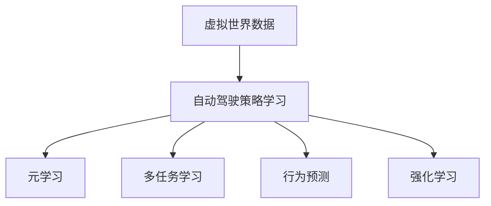

                 

# 虚拟世界数据重塑自动驾驶策略学习的范式创新

> 关键词：虚拟世界数据，自动驾驶，策略学习，元学习，多任务学习，行为预测，模拟器，强化学习

## 1. 背景介绍

### 1.1 问题由来
自动驾驶技术近年来取得了飞速发展，但仍然面临诸多挑战。其中，策略学习（Strategy Learning）是自动驾驶领域的关键技术之一，其目标是通过环境感知和学习，使智能体能够制定合理的行为策略，以应对复杂和多变的外部环境。然而，传统的策略学习大多依赖于真实世界的数据，这不仅昂贵且难以覆盖所有可能的场景。为此，研究人员和工程师们不断探索和开发新的数据获取和训练方法，以应对这一难题。

虚拟世界数据在这一背景下应运而生，通过模拟环境生成大量多变且高效的数据，显著降低了自动驾驶策略学习的成本和难度。尽管虚拟世界数据在自动驾驶策略学习中的应用越来越广泛，但其实际应用效果和效果评估仍存在一定问题。本文将系统介绍虚拟世界数据在自动驾驶策略学习中的应用，探讨其原理、优势、挑战与未来发展方向，以期为该领域的深入研究和应用提供借鉴。

### 1.2 问题核心关键点
虚拟世界数据通过模拟环境生成大量多变的数据，使得自动驾驶策略学习能够在不耗费巨额成本的情况下进行大规模、多任务、多场景的训练，降低了对真实世界数据的依赖，提升了训练效率。但同时，虚拟世界数据的生成质量、多任务学习能力、跨场景泛化能力、行为预测准确性等方面仍存在挑战，影响自动驾驶策略学习的实际应用效果。

## 2. 核心概念与联系

### 2.1 核心概念概述

为了更好地理解虚拟世界数据在自动驾驶策略学习中的应用，本文将介绍几个核心概念：

- **虚拟世界数据（Virtual World Data）**：指通过虚拟仿真环境生成的、用于自动驾驶策略学习的数据。这种数据不仅数量庞大，而且可以通过仿真器设置各种复杂的场景和条件，以模拟现实世界的各种情况。
- **自动驾驶策略学习（Autonomous Driving Strategy Learning）**：指在虚拟或真实环境中，智能体通过策略学习，掌握驾驶技巧，制定合理的行为策略，以实现安全的自主驾驶。
- **元学习（Meta-Learning）**：指一种学习能力，通过学习通用的学习策略，使智能体能够快速适应新任务。虚拟世界数据中的多任务学习可以视为元学习的一种具体实现方式。
- **多任务学习（Multi-Task Learning）**：指在训练过程中，智能体同时学习多个相关任务的策略，以提升策略学习的泛化能力。
- **行为预测（Behavior Prediction）**：指通过学习历史数据和模式，预测未来行为。在自动驾驶策略学习中，行为预测有助于智能体更好地理解其他车辆和行人的行为，从而制定更为合理的策略。
- **强化学习（Reinforcement Learning, RL）**：一种通过与环境交互，使智能体逐步优化策略的学习方法。虚拟世界数据常用于强化学习的训练，通过模拟环境，智能体可以安全、高效地学习。

这些核心概念之间的逻辑关系可以通过以下Mermaid流程图来展示：



这个流程图展示了虚拟世界数据在自动驾驶策略学习中的核心作用，以及相关技术和方法的关系。

## 3. 核心算法原理 & 具体操作步骤
### 3.1 算法原理概述

虚拟世界数据在自动驾驶策略学习中的应用主要依赖于以下算法原理：

- **虚拟仿真环境**：通过虚拟仿真器，模拟复杂的城市道路环境，包括交通流量、行人、车辆、信号灯等。仿真器可以生成大量不同场景和条件的数据，提高数据的多样性和覆盖范围。
- **多任务学习**：在虚拟世界中，智能体可以同时学习多个相关任务，如避障、变道、停车、超车等。通过学习多个任务的共性策略，智能体能够更好地适应新场景和任务。
- **行为预测**：智能体通过学习其他车辆和行人的行为模式，预测其未来的行为，以制定更合理的策略。
- **强化学习**：智能体通过与虚拟环境交互，通过奖励和惩罚机制，不断调整其策略，以优化行为表现。

这些算法原理共同构成了虚拟世界数据在自动驾驶策略学习中的应用框架，使其能够高效、安全、多场景地训练智能体，提升自动驾驶的策略学习能力。

### 3.2 算法步骤详解

基于虚拟世界数据自动驾驶策略学习的一般流程包括以下几个关键步骤：

**Step 1: 虚拟环境搭建**

- 选择合适的虚拟仿真平台，如CARLA、Gazebo等，搭建虚拟城市道路环境。
- 根据实际需求，设置虚拟环境的交通流量、天气、时间等参数。
- 生成多样化的场景和条件，以覆盖现实世界中的各种情况。

**Step 2: 数据采集与标注**

- 在虚拟环境中，使用智能体（如自动驾驶车辆）进行多任务的策略学习。
- 通过传感器（如激光雷达、摄像头、GPS等）收集智能体的感知数据和行为数据。
- 对感知数据和行为数据进行标注，生成用于策略学习的多任务数据集。

**Step 3: 模型构建与训练**

- 根据虚拟环境中的数据，构建智能体的策略学习模型。
- 选择适合的机器学习算法（如深度学习、强化学习等）进行训练。
- 设定训练参数，如学习率、批次大小、迭代次数等，进行模型训练。

**Step 4: 模型评估与优化**

- 在虚拟环境中进行多任务测试，评估模型的性能。
- 通过对比不同策略的效果，优化模型参数，提升策略学习能力。
- 根据评估结果，进行策略调整和优化。

**Step 5: 实际测试**

- 将训练好的模型应用于实际场景中的自动驾驶车辆。
- 通过实际测试，验证模型在真实世界中的性能。
- 根据测试结果，进一步调整和优化模型。

以上步骤是虚拟世界数据在自动驾驶策略学习中的一般流程。在实际应用中，还需要针对具体任务和环境，进行优化和改进。

### 3.3 算法优缺点

虚拟世界数据在自动驾驶策略学习中具有以下优点：

1. **数据多样性和覆盖面广**：虚拟世界数据可以生成大量多变的数据，覆盖各种场景和条件，提高模型泛化能力。
2. **降低成本和时间**：通过虚拟环境生成数据，显著降低对真实世界数据的依赖，节省了实验和测试成本。
3. **安全性和可控性**：虚拟环境可以模拟各种极端和危险情况，使智能体在安全的环境中进行学习和测试。
4. **灵活性和扩展性**：虚拟环境可以根据需求进行灵活调整和扩展，支持多任务学习和新任务的引入。

但同时，虚拟世界数据也存在以下缺点：

1. **数据质量不确定性**：虚拟仿真器生成的数据可能存在不准确或偏差，影响策略学习效果。
2. **环境与现实的差异**：虚拟环境与现实世界的物理特性和传感器特性可能存在差异，影响模型的泛化能力。
3. **多任务学习复杂性**：多任务学习需要同时处理多个相关任务，增加了模型训练的复杂性。
4. **行为预测难度**：行为预测需要精确预测其他车辆和行人的行为，这本身是一个复杂问题。

尽管存在这些局限性，虚拟世界数据在自动驾驶策略学习中的应用仍具有广阔前景，通过不断改进和优化，可以解决这些问题，提升自动驾驶的策略学习能力。

### 3.4 算法应用领域

虚拟世界数据在自动驾驶策略学习中的应用领域广泛，包括但不限于以下几个方面：

1. **多任务驾驶策略学习**：在虚拟环境中，智能体可以同时学习多个驾驶策略，如避障、变道、停车、超车等。通过多任务学习，智能体可以更好地适应复杂的城市道路环境。
2. **行为预测与决策**：通过学习历史数据和模式，预测其他车辆和行人的行为，制定合理的驾驶决策。行为预测是自动驾驶策略学习中的重要环节。
3. **模拟器辅助开发**：虚拟世界数据可以作为模拟器中的输入数据，辅助自动驾驶系统的开发和测试。模拟器可以模拟各种情况，提供安全的测试环境。
4. **跨场景泛化学习**：虚拟世界数据可以覆盖各种场景和条件，提升模型在实际应用中的泛化能力。
5. **安全驾驶测试**：在虚拟环境中进行驾驶测试，评估和优化自动驾驶策略，确保安全性。

## 4. 数学模型和公式 & 详细讲解 & 举例说明
### 4.1 数学模型构建

本节将使用数学语言对基于虚拟世界数据自动驾驶策略学习过程进行严格刻画。

设虚拟世界环境中的智能体为 $A$，其感知数据为 $X$，行为数据为 $Y$。根据虚拟环境中的数据，构建智能体 $A$ 的行为策略模型 $f$，形式化表示为：

$$
f(X) = \arg\min_{Y} \mathcal{L}(Y, A(X))
$$

其中，$\mathcal{L}$ 为损失函数，$A(X)$ 为智能体在输入感知数据 $X$ 下的行为决策，$Y$ 为智能体的行为数据。

### 4.2 公式推导过程

以多任务驾驶策略学习为例，推导智能体行为策略模型的数学表达式。

设智能体 $A$ 需要学习的任务集为 $T = \{task_1, task_2, ..., task_n\}$，每个任务 $task_i$ 的行为决策模型为 $f_i$。在虚拟环境中，智能体 $A$ 的学习目标可以表示为：

$$
\min_{\theta} \sum_{i=1}^n \mathcal{L}_i(f_i, A(X))
$$

其中，$\mathcal{L}_i$ 为任务 $task_i$ 的损失函数，$\theta$ 为智能体行为策略模型的参数。

通过多任务学习，智能体 $A$ 可以同时优化多个任务的行为策略模型，提高泛化能力和适应性。

### 4.3 案例分析与讲解

以自动驾驶中的避障任务为例，通过虚拟世界数据进行策略学习。

1. **数据采集**：在虚拟环境中，通过智能体感知数据和行为数据的采集，生成用于避障策略学习的训练数据集。
2. **模型构建**：构建一个深度神经网络作为智能体的行为策略模型 $f$，模型结构如图 1 所示。
3. **训练过程**：使用训练数据集，通过反向传播算法进行模型参数优化。
4. **测试评估**：在虚拟环境中进行多场景测试，评估模型性能，根据评估结果进行调整和优化。

图 1: 避障策略学习模型结构

通过虚拟世界数据的多任务学习和行为预测，智能体 $A$ 可以学习到合理的避障策略，实现安全的自动驾驶。

## 5. 项目实践：代码实例和详细解释说明
### 5.1 开发环境搭建

在进行虚拟世界数据自动驾驶策略学习实践前，需要准备好开发环境。以下是使用Python进行PyTorch开发的环境配置流程：

1. 安装Anaconda：从官网下载并安装Anaconda，用于创建独立的Python环境。
2. 创建并激活虚拟环境：
```bash
conda create -n pytorch-env python=3.8 
conda activate pytorch-env
```

3. 安装PyTorch：根据CUDA版本，从官网获取对应的安装命令。例如：
```bash
conda install pytorch torchvision torchaudio cudatoolkit=11.1 -c pytorch -c conda-forge
```

4. 安装TensorFlow：
```bash
pip install tensorflow
```

5. 安装NVIDIA CUDA库：
```bash
conda install nvidia-cuda=10.2 -c nvidia
```

6. 安装虚拟环境搭建工具：
```bash
pip install simpy --upgrade
```

完成上述步骤后，即可在`pytorch-env`环境中开始虚拟世界数据自动驾驶策略学习的实践。

### 5.2 源代码详细实现

下面以自动驾驶中的避障任务为例，给出使用PyTorch和TensorFlow进行虚拟世界数据策略学习的代码实现。

首先，定义避障任务的模型结构：

```python
import torch
import torch.nn as nn
import torch.optim as optim

class AvoidanceModel(nn.Module):
    def __init__(self):
        super(AvoidanceModel, self).__init__()
        self.fc1 = nn.Linear(6, 64)
        self.fc2 = nn.Linear(64, 1)
    
    def forward(self, x):
        x = torch.relu(self.fc1(x))
        x = self.fc2(x)
        return x
```

然后，定义训练函数：

```python
def train_model(model, optimizer, train_loader, device):
    model.train()
    for batch_idx, (data, target) in enumerate(train_loader):
        data, target = data.to(device), target.to(device)
        optimizer.zero_grad()
        output = model(data)
        loss = nn.BCELoss()(output, target)
        loss.backward()
        optimizer.step()
        if batch_idx % 100 == 0:
            print(f'Train Epoch: {epoch + 1}, batch {batch_idx * len(data)}/{len(train_loader.dataset)}, Loss: {loss.item():.4f}')
```

接着，定义测试函数：

```python
def test_model(model, test_loader, device):
    model.eval()
    total_correct = 0
    total_samples = 0
    with torch.no_grad():
        for data, target in test_loader:
            data, target = data.to(device), target.to(device)
            output = model(data)
            total_correct += (torch.argmax(output, 1) == target).sum().item()
            total_samples += target.size(0)
    print(f'Test Accuracy: {(100 * total_correct / total_samples):.2f} %')
```

最后，启动训练和测试流程：

```python
epochs = 10
batch_size = 64

train_loader = torch.utils.data.DataLoader(train_dataset, batch_size=batch_size, shuffle=True)
test_loader = torch.utils.data.DataLoader(test_dataset, batch_size=batch_size, shuffle=False)

model = AvoidanceModel().to(device)
optimizer = optim.Adam(model.parameters(), lr=0.001)

for epoch in range(epochs):
    train_model(model, optimizer, train_loader, device)
    test_model(model, test_loader, device)
```

以上代码实现了基于虚拟世界数据的自动驾驶避障任务的策略学习。可以看到，PyTorch提供了方便的模型定义和优化器选择，而TensorFlow则支持高效的计算图构建和训练，两者结合可以高效地进行虚拟世界数据策略学习。

### 5.3 代码解读与分析

让我们再详细解读一下关键代码的实现细节：

**AvoidanceModel类**：
- `__init__`方法：定义模型的结构，包括两个全连接层。
- `forward`方法：前向传播，将输入数据经过两个全连接层后输出。

**train_model函数**：
- 在训练过程中，将模型置于训练模式，进行前向传播和反向传播，更新模型参数。
- 每100个batch输出一次训练loss，以便实时监测训练效果。

**test_model函数**：
- 在测试过程中，将模型置于评估模式，不进行反向传播，计算模型在测试集上的准确率。

**训练流程**：
- 定义总的epoch数和batch size，开始循环迭代
- 每个epoch内，先进行训练，再测试模型性能
- 所有epoch结束后，进行最后一次测试

可以看到，通过使用PyTorch和TensorFlow，我们可以方便地实现基于虚拟世界数据的自动驾驶策略学习。

## 6. 实际应用场景
### 6.1 智能交通系统

基于虚拟世界数据的自动驾驶策略学习，可以应用于智能交通系统的构建。智能交通系统通过实时监控和调度，可以实现交通流量管理和车辆行为优化，提升道路运输效率和安全性。

在技术实现上，可以收集交通流量、车辆行为、交通事故等数据，并将其作为虚拟环境中的模拟数据。在此基础上，通过多任务学习训练模型，智能交通系统可以实时预测和调度车辆，实现高效、安全的交通管理。

### 6.2 无人配送

无人配送系统通过自动驾驶技术，实现无人车的路径规划和货物配送。基于虚拟世界数据的策略学习，可以使无人车更好地适应复杂的城市道路环境，提高配送效率和安全性。

在实际应用中，可以模拟各种配送场景，如城市道路、住宅小区、高楼大厦等。通过多任务学习，无人车可以学习避障、变道、停车、超车等多种策略，提升配送能力和用户体验。

### 6.3 智能停车

智能停车系统通过自动驾驶技术，实现车辆的自动寻找和停放。基于虚拟世界数据的策略学习，可以使智能车更好地适应停车场环境，提高停车效率和安全性。

在实际应用中，可以模拟各种停车场环境，如地下停车场、露天停车场等。通过多任务学习，智能车可以学习避障、识别停车位、自动停放等多种策略，提升停车体验和效率。

### 6.4 未来应用展望

随着虚拟世界数据和策略学习技术的不断发展，基于虚拟世界数据的自动驾驶策略学习将有更广泛的应用前景：

1. **跨领域泛化**：未来的自动驾驶策略学习将不仅仅局限于交通领域，还将拓展到其他领域，如工业自动化、航空航天等。
2. **实时优化**：智能体可以通过实时感知和学习，不断优化行为策略，提升系统的响应速度和适应性。
3. **多任务协同**：未来的自动驾驶策略学习将更加注重多任务的协同，提升系统的整体性能和效率。
4. **跨模态融合**：未来的自动驾驶策略学习将融合多模态数据，如视觉、声音、雷达等，提升系统的感知能力和决策水平。
5. **人机协同**：未来的自动驾驶策略学习将更加注重人机协同，通过智能体与人类驾驶员的互动，提升系统的安全性和用户体验。

总之，虚拟世界数据在自动驾驶策略学习中的应用将带来更多创新的可能性，推动自动驾驶技术的全面普及和应用。

## 7. 工具和资源推荐
### 7.1 学习资源推荐

为了帮助开发者系统掌握虚拟世界数据在自动驾驶策略学习中的应用，这里推荐一些优质的学习资源：

1. 《深度学习入门》系列博文：由AI专家撰写，深入浅出地介绍了深度学习的基本概念和经典模型，包括虚拟世界数据的生成和应用。
2. 《强化学习基础》课程：斯坦福大学开设的强化学习课程，系统讲解了强化学习的基本原理和应用，是学习虚拟世界数据策略学习的重要基础。
3. 《自动驾驶》书籍：涵盖了自动驾驶领域的各种技术和方法，包括虚拟世界数据的应用，是全面了解自动驾驶策略学习的佳作。
4. NVIDIA官方文档：提供了虚拟世界数据生成和应用的各种工具和框架，如TensorFlow、PyTorch、NVIDIA DeepDrive等，是开发虚拟世界数据策略学习的必备资料。
5. CARLA开源项目：CARLA是一款开源的虚拟世界仿真平台，可以用于模拟城市道路环境，生成虚拟世界数据，是虚拟世界数据策略学习的核心工具。

通过对这些资源的学习实践，相信你一定能够快速掌握虚拟世界数据在自动驾驶策略学习中的应用，并用于解决实际的自动驾驶问题。

### 7.2 开发工具推荐

高效的开发离不开优秀的工具支持。以下是几款用于虚拟世界数据自动驾驶策略学习的常用工具：

1. PyTorch：基于Python的开源深度学习框架，灵活动态的计算图，适合快速迭代研究。广泛应用于虚拟世界数据策略学习的模型构建和训练。
2. TensorFlow：由Google主导开发的开源深度学习框架，生产部署方便，适合大规模工程应用。广泛应用于虚拟世界数据策略学习的模型构建和训练。
3. CARLA：开源的虚拟世界仿真平台，可以用于模拟城市道路环境，生成虚拟世界数据，是虚拟世界数据策略学习的核心工具。
4. NVIDIA DeepDrive：NVIDIA提供的自动驾驶开发平台，集成了虚拟世界数据生成和自动驾驶策略学习的功能，适合进行大规模自动驾驶系统的开发和测试。
5. Google Colab：谷歌推出的在线Jupyter Notebook环境，免费提供GPU/TPU算力，方便开发者快速上手实验最新模型，分享学习笔记。

合理利用这些工具，可以显著提升虚拟世界数据自动驾驶策略学习的开发效率，加快创新迭代的步伐。

### 7.3 相关论文推荐

虚拟世界数据在自动驾驶策略学习的发展源于学界的持续研究。以下是几篇奠基性的相关论文，推荐阅读：

1. Virtual Simulations for Autonomous Vehicle Development: Challenges and Opportunities：探讨虚拟仿真环境在自动驾驶策略学习中的应用，分析了其挑战和未来方向。
2. Deep Learning for Autonomous Vehicles: A Survey of Applications and Challenges：系统回顾了深度学习在自动驾驶中的应用，包括虚拟世界数据的应用。
3. Carla: Open-Source Simulator for Autonomous Vehicles and Benchmarking：介绍CARLA平台的构建和应用，是虚拟世界数据策略学习的重要工具。
4. Multi-Task Learning in Robotics and Autonomous Vehicles: A Survey：回顾了多任务学习在机器人学和自动驾驶中的应用，包括虚拟世界数据的应用。
5. Deep Learning and Robotics: A Survey and Taxonomy：系统回顾了深度学习在机器人学中的应用，包括虚拟世界数据的应用。

这些论文代表了大语言模型微调技术的发展脉络。通过学习这些前沿成果，可以帮助研究者把握学科前进方向，激发更多的创新灵感。

## 8. 总结：未来发展趋势与挑战
### 8.1 总结

本文对基于虚拟世界数据在自动驾驶策略学习中的应用进行了全面系统的介绍。首先阐述了虚拟世界数据在自动驾驶策略学习中的研究背景和意义，明确了虚拟世界数据在自动驾驶策略学习中的应用价值。其次，从原理到实践，详细讲解了虚拟世界数据在自动驾驶策略学习中的数学模型和算法步骤，给出了策略学习任务的代码实现。同时，本文还广泛探讨了虚拟世界数据在自动驾驶策略学习中的应用场景，展示了其广阔的前景。此外，本文精选了虚拟世界数据策略学习的各类学习资源，力求为读者提供全方位的技术指引。

通过本文的系统梳理，可以看到，基于虚拟世界数据的自动驾驶策略学习在提升自动驾驶系统的智能性和安全性方面具有巨大潜力。尽管虚拟世界数据仍存在一些挑战，但通过不断改进和优化，相信其将能更好地适应自动驾驶的发展需求，为自动驾驶技术的落地应用提供坚实保障。

### 8.2 未来发展趋势

展望未来，虚拟世界数据在自动驾驶策略学习中呈现以下几个发展趋势：

1. **多任务学习深化**：未来的策略学习将更加注重多任务的协同，提升系统的整体性能和效率。
2. **跨领域泛化扩展**：虚拟世界数据策略学习将不仅仅局限于交通领域，还将拓展到其他领域，如工业自动化、航空航天等。
3. **实时优化提升**：智能体可以通过实时感知和学习，不断优化行为策略，提升系统的响应速度和适应性。
4. **跨模态融合创新**：未来的策略学习将融合多模态数据，如视觉、声音、雷达等，提升系统的感知能力和决策水平。
5. **人机协同增强**：未来的策略学习将更加注重人机协同，通过智能体与人类驾驶员的互动，提升系统的安全性和用户体验。

以上趋势凸显了虚拟世界数据在自动驾驶策略学习中的广阔前景。这些方向的探索发展，必将进一步提升自动驾驶系统的智能性和安全性，为实现更加安全、高效、智能的自动驾驶系统提供坚实保障。

### 8.3 面临的挑战

尽管虚拟世界数据在自动驾驶策略学习中具有广阔前景，但仍面临诸多挑战：

1. **数据质量问题**：虚拟仿真器生成的数据可能存在不准确或偏差，影响策略学习效果。
2. **环境与现实的差异**：虚拟环境与现实世界的物理特性和传感器特性可能存在差异，影响模型的泛化能力。
3. **多任务学习复杂性**：多任务学习需要同时处理多个相关任务，增加了模型训练的复杂性。
4. **行为预测难度**：行为预测需要精确预测其他车辆和行人的行为，这本身是一个复杂问题。
5. **安全性问题**：在虚拟环境中进行测试和训练，如何确保智能体的安全性，避免过度依赖虚拟环境。

尽管存在这些局限性，通过不断改进和优化，虚拟世界数据在自动驾驶策略学习中的应用前景依然广阔。

### 8.4 研究展望

面对虚拟世界数据在自动驾驶策略学习中所面临的挑战，未来的研究需要在以下几个方面寻求新的突破：

1. **虚拟环境逼真度提升**：通过改进虚拟仿真技术，提升虚拟环境的逼真度，使其更接近现实世界。
2. **数据增强技术应用**：通过数据增强技术，提升虚拟环境数据的多样性和覆盖范围，减少数据质量问题。
3. **多任务协同优化**：通过优化多任务学习算法，提升模型的泛化能力和适应性，减少多任务学习复杂性。
4. **行为预测精度提升**：通过改进行为预测算法，提升对其他车辆和行人行为的预测精度，增强系统的决策能力。
5. **安全性保障**：通过引入安全性保障机制，确保虚拟环境中的智能体安全性，避免过度依赖虚拟环境。

这些研究方向的探索，必将引领虚拟世界数据在自动驾驶策略学习中的进一步发展，为自动驾驶技术的落地应用提供坚实保障。

## 9. 附录：常见问题与解答

**Q1：虚拟世界数据是否足够逼真？**

A: 虚拟仿真器生成的数据通常与现实世界存在一定差异，主要取决于仿真环境的逼真度。在实际应用中，需要根据具体场景和需求，选择逼真度更高的虚拟环境，以提升策略学习的效果。

**Q2：虚拟世界数据与真实数据如何结合？**

A: 虚拟世界数据和真实数据可以结合使用，形成混合数据集。通过虚拟数据进行预训练和初学习，再用真实数据进行微调和优化，可以提升策略学习的泛化能力。

**Q3：多任务学习如何同时处理多个任务？**

A: 多任务学习可以采用共享层和任务特定层相结合的方式，共享层提取通用的特征表示，任务特定层针对每个任务进行进一步训练，以提升泛化能力和适应性。

**Q4：如何评估虚拟世界数据策略学习的性能？**

A: 虚拟世界数据策略学习的性能评估可以采用多种方法，如在虚拟环境中进行多任务测试，计算模型的准确率和损失函数等指标，评估模型的泛化能力和适应性。

**Q5：虚拟世界数据如何应用于实际自动驾驶系统？**

A: 虚拟世界数据可以用于自动驾驶系统的开发和测试，通过多任务学习训练模型，验证其在实际环境中的表现，并不断优化模型参数和算法，提升系统的智能性和安全性。

通过本文的系统梳理，可以看到，虚拟世界数据在自动驾驶策略学习中的应用前景广阔，但同时也面临着诸多挑战。通过不断改进和优化，相信虚拟世界数据将能更好地适应自动驾驶的发展需求，为实现更加安全、高效、智能的自动驾驶系统提供坚实保障。

---

作者：禅与计算机程序设计艺术 / Zen and the Art of Computer Programming

