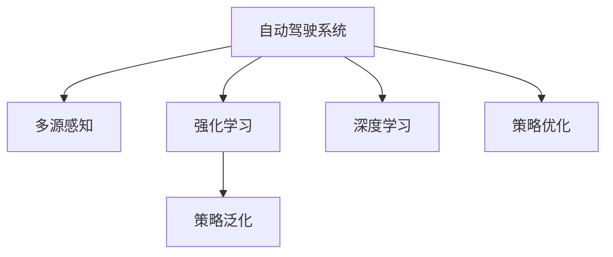

                 

## 1. 背景介绍

### 1.1 问题由来
随着全球进入数字化时代，汽车行业正经历着前所未有的变革。自动驾驶技术的兴起，将彻底改变人们的出行方式，推动汽车产业向智能化、自动化转型。然而，自动驾驶系统的安全性、可靠性以及高效性，都依赖于算法的有效性。近年来，基于机器学习（ML）和深度学习（DL）的自动驾驶策略学习，已成为研究热点。

### 1.2 问题核心关键点
自动驾驶策略学习的关键在于如何从大规模真实数据中学习最优策略，并应对复杂多变的虚拟世界环境。具体包括以下几个方面：
- 数据驱动：需要从现实世界和虚拟世界获取高质量、多样化的数据，用于训练和验证自动驾驶算法。
- 多模态融合：自动驾驶系统需要融合传感器数据（如摄像头、雷达、激光雷达等）进行多源感知和决策。
- 策略优化：通过强化学习、模仿学习、模型预测控制等方法，优化驾驶策略以提高安全性与效率。
- 跨域泛化：自动驾驶算法需要具备跨领域泛化能力，适应不同场景、不同季节和天气条件下的驾驶任务。

### 1.3 问题研究意义
自动驾驶策略学习方法的研究，对推动汽车产业向智能化、自动化发展具有重大意义：
- 提升安全性：通过学习和优化驾驶策略，自动驾驶系统可以更好地应对各种突发情况，减少交通事故发生。
- 提高效率：自动化驾驶减少了人为驾驶的疲劳和驾驶错误，提升了驾驶效率。
- 降低成本：自动驾驶技术可以减少燃油消耗和维护成本，降低运输成本。
- 提升用户体验：自动驾驶系统可以提供更加便捷、舒适的驾驶体验，改善出行体验。

## 2. 核心概念与联系

### 2.1 核心概念概述

为更好地理解虚拟世界数据驱动的自动驾驶策略学习方法，本节将介绍几个密切相关的核心概念：

- 自动驾驶系统（Autonomous Driving System）：利用计算机视觉、感知、决策等技术，实现车辆的自主导航、路径规划和行驶控制。
- 强化学习（Reinforcement Learning, RL）：通过与环境的交互，学习最优策略以最大化长期奖励。
- 深度学习（Deep Learning, DL）：一种基于神经网络的技术，通过数据驱动的方式，学习和提取数据的复杂特征。
- 策略优化（Strategy Optimization）：通过优化模型参数或策略，提升自动驾驶系统的性能。
- 多源感知（Multi-sensor Perception）：将来自不同传感器的数据进行融合，提升驾驶环境的感知能力。
- 策略泛化（Strategy Generalization）：自动驾驶算法应具备良好的泛化能力，适应不同驾驶场景和环境。

这些核心概念之间的逻辑关系可以通过以下Mermaid流程图来展示：



这个流程图展示了自动驾驶系统的核心组件及其相互关系：

1. 自动驾驶系统通过多源感知模块，获取车辆所处环境的数据。
2. 这些数据被输入到深度学习模型中进行处理，提取出环境特征。
3. 基于提取出的特征，强化学习模块学习最优的驾驶策略，以最大化奖励。
4. 策略优化模块进一步提升模型的性能，提升驾驶效率和安全性。
5. 强化学习模块学到的策略需要具备泛化能力，以适应不同驾驶场景。

## 3. 核心算法原理 & 具体操作步骤

### 3.1 算法原理概述

虚拟世界数据驱动的自动驾驶策略学习方法，本质上是通过深度学习技术，从虚拟世界环境中学习最优的驾驶策略。其核心思想是：将自动驾驶系统视作一个智能体，通过与虚拟环境交互，最大化长期累积奖励，最终得到最优的策略。

形式化地，设自动驾驶系统在当前状态 $s_t$ 下采取行动 $a_t$，环境返回奖励 $r_{t+1}$，系统状态转移到下一个状态 $s_{t+1}$。则自动驾驶系统的目标是通过学习最优策略 $\pi$，最大化累积奖励 $R$：

$$
\max_{\pi} \mathbb{E}\left[\sum_{t=0}^{\infty} \gamma^t r_{t+1}\right]
$$

其中，$\gamma$ 为折扣因子，表示未来奖励的权重。

### 3.2 算法步骤详解

基于虚拟世界数据驱动的自动驾驶策略学习方法，一般包括以下几个关键步骤：

**Step 1: 准备虚拟世界环境**
- 构建虚拟世界环境，如使用CraigSim、Unity等工具模拟真实道路和交通场景。
- 将真实世界的驾驶数据（如摄像头、雷达、GPS等）转化为虚拟世界的数据格式。

**Step 2: 设计训练任务**
- 定义训练任务，如控制车辆从起点到终点的最优路径，避免碰撞和违规行为。
- 设计合适的奖励函数，衡量驾驶行为的优劣。
- 设定训练回合数和每回合的最大时间步数。

**Step 3: 模型选择与参数设置**
- 选择合适的深度学习模型，如基于CNN的感知模块和RNN或LSTM的控制模块。
- 设置模型参数，如层数、节点数、学习率等。
- 确定正则化技术，如L2正则、Dropout、Early Stopping等，防止过拟合。

**Step 4: 执行训练过程**
- 将虚拟世界环境数据输入模型，进行前向传播计算。
- 根据预测的行动和实际行动之间的差距，计算损失函数。
- 反向传播更新模型参数，重复多次迭代直至收敛。

**Step 5: 测试与验证**
- 在虚拟世界中测试微调后的模型，验证其性能是否达到预期。
- 进行多轮测试，并记录平均性能指标。
- 根据测试结果调整模型参数，进行新一轮训练。

### 3.3 算法优缺点

虚拟世界数据驱动的自动驾驶策略学习方法具有以下优点：
1. 高效训练：虚拟环境可以大规模模拟，快速生成大量训练数据，加速模型训练。
2. 安全测试：虚拟环境不会产生真实世界的风险，可反复进行测试，保证安全。
3. 灵活性高：虚拟环境可设置不同的参数和场景，灵活测试不同策略效果。
4. 成本低：虚拟环境可无限重复使用，避免现实世界的昂贵试验成本。

同时，该方法也存在一定的局限性：
1. 虚拟环境逼真度有限：如果虚拟环境模拟不够真实，模型学习到的策略可能难以在真实环境中泛化。
2. 模型泛化能力有限：虚拟环境的多样性可能无法涵盖真实世界的所有场景，模型泛化能力受限。
3. 训练成本高：构建高逼真的虚拟环境需要大量时间和资源。
4. 存在模拟误差：虚拟环境中的物理定律和真实世界存在差异，可能导致模拟误差。

尽管存在这些局限性，但就目前而言，虚拟世界数据驱动的方法仍是大规模自动驾驶策略学习的有效手段。未来相关研究的重点在于如何进一步提升虚拟环境的逼真度，提高模型的泛化能力，同时降低训练成本和误差。

### 3.4 算法应用领域

虚拟世界数据驱动的自动驾驶策略学习方法，在自动驾驶系统中的应用十分广泛，例如：

- 路径规划：学习最优路径规划策略，以避开障碍物，抵达终点。
- 车辆控制：学习车辆控制策略，确保车辆平稳行驶，避免碰撞。
- 交通信号控制：学习交通信号控制策略，优化交通流量。
- 停车导航：学习停车策略，在复杂环境中顺利停车。
- 车联网通信：学习车联网通信策略，提升车辆间通信效率和安全性。

除了上述这些经典任务外，自动驾驶策略学习方法还被创新性地应用到更多场景中，如自动泊车、智能避障、路况预测等，为自动驾驶技术带来新的突破。随着虚拟世界环境构建技术的发展和训练算法的进步，相信自动驾驶系统将会在更广泛的应用领域中发挥重要作用。

## 4. 数学模型和公式 & 详细讲解

### 4.1 数学模型构建

本节将使用数学语言对虚拟世界数据驱动的自动驾驶策略学习方法进行更加严格的刻画。

设自动驾驶系统在当前状态 $s_t$ 下采取行动 $a_t$，环境返回奖励 $r_{t+1}$，系统状态转移到下一个状态 $s_{t+1}$。定义模型在状态-行动对 $(s_t, a_t)$ 下的预测奖励为 $\hat{r}_{t+1}$，则模型的预测误差为 $\epsilon_{t+1} = r_{t+1} - \hat{r}_{t+1}$。模型的目标是最小化预测误差：

$$
\min_{\theta} \mathbb{E}\left[\sum_{t=0}^{\infty} \gamma^t \epsilon_{t+1}\right]
$$

其中，$\theta$ 为模型参数。

### 4.2 公式推导过程

以下我们以路径规划为例，推导深度学习模型的损失函数及其梯度的计算公式。

假设模型为基于CNN的感知模块和RNN或LSTM的控制模块，感知模块输出状态表示 $s_t$，控制模块输出行动 $a_t$。则路径规划的预测误差为：

$$
\epsilon_{t+1} = r_{t+1} - \hat{r}_{t+1}
$$

其中，$r_{t+1}$ 为实际获得的奖励，$\hat{r}_{t+1}$ 为模型预测的奖励。模型的损失函数为：

$$
\mathcal{L}(\theta) = \frac{1}{N} \sum_{i=1}^N \left[\sum_{t=0}^{T-1} \gamma^t \epsilon_{t+1}\right]
$$

其中，$N$ 为训练样本数，$T$ 为最大时间步数。

根据链式法则，损失函数对参数 $\theta$ 的梯度为：

$$
\frac{\partial \mathcal{L}(\theta)}{\partial \theta} = \frac{1}{N} \sum_{i=1}^N \left[\sum_{t=0}^{T-1} \gamma^t \frac{\partial \hat{r}_{t+1}}{\partial \theta}\right]
$$

其中，$\frac{\partial \hat{r}_{t+1}}{\partial \theta}$ 可通过反向传播算法高效计算。

## 5. 项目实践：代码实例和详细解释说明

### 5.1 开发环境搭建

在进行虚拟世界数据驱动的自动驾驶策略学习方法开发前，我们需要准备好开发环境。以下是使用Python进行PyTorch开发的环境配置流程：

1. 安装Anaconda：从官网下载并安装Anaconda，用于创建独立的Python环境。

2. 创建并激活虚拟环境：
```bash
conda create -n pytorch-env python=3.8 
conda activate pytorch-env
```

3. 安装PyTorch：根据CUDA版本，从官网获取对应的安装命令。例如：
```bash
conda install pytorch torchvision torchaudio cudatoolkit=11.1 -c pytorch -c conda-forge
```

4. 安装TensorFlow：
```bash
conda install tensorflow tensorflow-gpu==2.6
```

5. 安装TensorBoard：
```bash
pip install tensorboard
```

6. 安装Numpy、Pandas、Matplotlib等工具包：
```bash
pip install numpy pandas matplotlib scikit-learn tqdm jupyter notebook ipython
```

完成上述步骤后，即可在`pytorch-env`环境中开始项目实践。

### 5.2 源代码详细实现

下面我们以路径规划任务为例，给出使用PyTorch对深度学习模型进行路径规划的PyTorch代码实现。

首先，定义路径规划任务的数据处理函数：

```python
from torch.utils.data import Dataset
import torch

class PathDataset(Dataset):
    def __init__(self, data):
        self.data = data
        
    def __len__(self):
        return len(self.data)
    
    def __getitem__(self, idx):
        return self.data[idx]
```

然后，定义模型和优化器：

```python
import torch.nn as nn
import torch.optim as optim
from torch.utils.data import DataLoader

class CNN(nn.Module):
    def __init__(self):
        super(CNN, self).__init__()
        self.conv1 = nn.Conv2d(3, 64, kernel_size=3, stride=1, padding=1)
        self.relu1 = nn.ReLU()
        self.maxpool1 = nn.MaxPool2d(kernel_size=2, stride=2)
        self.conv2 = nn.Conv2d(64, 128, kernel_size=3, stride=1, padding=1)
        self.relu2 = nn.ReLU()
        self.maxpool2 = nn.MaxPool2d(kernel_size=2, stride=2)
        self.fc1 = nn.Linear(128 * 8 * 8, 128)
        self.relu3 = nn.ReLU()
        self.fc2 = nn.Linear(128, 2)
    
    def forward(self, x):
        x = self.conv1(x)
        x = self.relu1(x)
        x = self.maxpool1(x)
        x = self.conv2(x)
        x = self.relu2(x)
        x = self.maxpool2(x)
        x = x.view(-1, 128 * 8 * 8)
        x = self.fc1(x)
        x = self.relu3(x)
        x = self.fc2(x)
        return x

model = CNN()
criterion = nn.MSELoss()
optimizer = optim.Adam(model.parameters(), lr=0.001)
```

接着，定义训练和评估函数：

```python
def train(model, dataloader, criterion, optimizer):
    model.train()
    running_loss = 0.0
    for i, data in enumerate(dataloader, 0):
        inputs, labels = data
        optimizer.zero_grad()
        outputs = model(inputs)
        loss = criterion(outputs, labels)
        loss.backward()
        optimizer.step()
        running_loss += loss.item()
    return running_loss / len(dataloader)

def evaluate(model, dataloader, criterion):
    model.eval()
    running_loss = 0.0
    with torch.no_grad():
        for i, data in enumerate(dataloader, 0):
            inputs, labels = data
            outputs = model(inputs)
            loss = criterion(outputs, labels)
            running_loss += loss.item()
    return running_loss / len(dataloader)
```

最后，启动训练流程并在测试集上评估：

```python
epochs = 10
batch_size = 32

for epoch in range(epochs):
    loss = train(model, dataloader, criterion, optimizer)
    print(f'Epoch {epoch+1}, loss: {loss:.4f}')
    
    print(f'Epoch {epoch+1}, test loss: {evaluate(model, test_loader, criterion):.4f}')
```

以上就是使用PyTorch对深度学习模型进行路径规划的完整代码实现。可以看到，PyTorch配合TensorBoard使得模型的训练和评估变得简洁高效。

### 5.3 代码解读与分析

让我们再详细解读一下关键代码的实现细节：

**PathDataset类**：
- `__init__`方法：初始化数据集。
- `__len__`方法：返回数据集长度。
- `__getitem__`方法：返回单个样本。

**CNN模型**：
- 定义了感知模块，包含卷积层、ReLU激活函数和最大池化层。
- 定义了控制模块，包含全连接层。

**损失函数和优化器**：
- 定义了MSE损失函数，计算预测值与真实值之间的均方误差。
- 定义了Adam优化器，调整模型参数以最小化损失函数。

**训练和评估函数**：
- 训练函数`train`：对数据集进行迭代，前向传播计算损失，反向传播更新参数，返回平均损失。
- 评估函数`evaluate`：对测试集进行迭代，前向传播计算损失，返回平均损失。

**训练流程**：
- 定义总的epoch数和batch size，开始循环迭代
- 每个epoch内，先在训练集上训练，输出平均loss
- 在测试集上评估，输出平均loss
- 所有epoch结束后，给出最终测试结果

可以看到，PyTorch配合TensorBoard使得深度学习模型的训练和评估变得简洁高效。开发者可以将更多精力放在数据处理、模型改进等高层逻辑上，而不必过多关注底层的实现细节。

当然，工业级的系统实现还需考虑更多因素，如模型的保存和部署、超参数的自动搜索、更灵活的任务适配层等。但核心的微调范式基本与此类似。

## 6. 实际应用场景

### 6.1 智能驾驶系统

基于虚拟世界数据驱动的自动驾驶策略学习方法，可以广泛应用于智能驾驶系统的构建。传统驾驶依赖人类驾驶员的经验和判断，存在一定的风险和误差。而使用虚拟世界数据驱动的算法，能够有效学习和优化驾驶策略，提高行驶安全性与效率。

在技术实现上，可以构建高逼真的虚拟世界环境，对自动驾驶系统进行大规模训练。训练后的模型可以部署到实际车辆上，实时监测驾驶环境并动态调整驾驶策略。在虚拟世界中进行反复测试和优化，可以确保算法在各种复杂场景中的稳定性与安全性。

### 6.2 交通流量优化

自动驾驶策略学习算法在交通流量优化中也有广泛应用。通过在虚拟世界中模拟交通场景，学习最优的交通信号控制策略，可以优化交通流量，减少拥堵和事故。

具体而言，可以在虚拟环境中设置交叉路口，并通过学习算法优化红绿灯时序。在训练过程中，模拟车流动态变化，调整信号灯的开关时间，以最大化道路通行效率。通过这种方式，可以构建智能交通系统，提升交通管理水平。

### 6.3 自动泊车系统

自动驾驶策略学习算法在自动泊车系统中同样有着重要的应用。传统的自动泊车依赖传感器和规则，难以处理复杂多变的停车场景。而使用虚拟世界数据驱动的算法，可以学习最优的停车策略，提升泊车成功率和效率。

在训练过程中，可以构建各种停车场景，包括斜停、侧停、垂直停等多种情况。通过学习算法，使自动泊车系统能够在不同场景中动态调整策略，实现高效、安全的泊车操作。

### 6.4 未来应用展望

随着虚拟世界数据驱动的自动驾驶策略学习方法的发展，未来将在更多领域得到应用，为智能交通系统带来变革性影响。

在智慧城市治理中，自动驾驶策略学习算法可以应用于城市事件监测、舆情分析、应急指挥等环节，提高城市管理的自动化和智能化水平，构建更安全、高效的未来城市。

在智能物流领域，自动驾驶算法可以优化运输路径，减少运输成本和能源消耗，提升物流效率。

在智能制造领域，自动驾驶算法可以优化生产流程，提高生产效率和产品质量。

此外，在航空、农业、医疗等多个领域，自动驾驶策略学习算法也具有广阔的应用前景，推动智能技术在各行各业中实现规模化应用。

## 7. 工具和资源推荐

### 7.1 学习资源推荐

为了帮助开发者系统掌握虚拟世界数据驱动的自动驾驶策略学习理论基础和实践技巧，这里推荐一些优质的学习资源：

1. 《深度学习实战》：介绍深度学习的基本概念和算法，通过实战项目加深理解。

2. 《强化学习：原理、算法与应用》：全面讲解强化学习的基本理论和应用场景，通过大量示例和案例帮助理解。

3. 《自动驾驶系统设计》：介绍自动驾驶系统的总体设计和各个组件，涵盖传感器、感知、决策等多个方面。

4. 《智能交通系统》：系统讲解智能交通系统的发展和应用，涵盖交通流建模、交通信号控制、车联网等多个方向。

5. 《自动驾驶技术实战》：通过实际项目和案例，展示自动驾驶技术的应用和实现方法。

通过对这些资源的学习实践，相信你一定能够快速掌握虚拟世界数据驱动的自动驾驶策略学习的精髓，并用于解决实际的自动驾驶问题。

### 7.2 开发工具推荐

高效的开发离不开优秀的工具支持。以下是几款用于深度学习和自动驾驶系统开发的常用工具：

1. PyTorch：基于Python的开源深度学习框架，灵活动态的计算图，适合快速迭代研究。

2. TensorFlow：由Google主导开发的开源深度学习框架，生产部署方便，适合大规模工程应用。

3. OpenAI Gym：一个Python环境，用于模拟各种经典游戏和任务，便于测试和训练深度学习算法。

4. Unity：一款流行的游戏引擎，支持高逼真的虚拟环境构建，适合模拟复杂驾驶场景。

5. TensorBoard：TensorFlow配套的可视化工具，可实时监测模型训练状态，并提供丰富的图表呈现方式。

6. Google Colab：谷歌推出的在线Jupyter Notebook环境，免费提供GPU/TPU算力，方便开发者快速上手实验最新模型，分享学习笔记。

合理利用这些工具，可以显著提升深度学习模型和自动驾驶系统的开发效率，加快创新迭代的步伐。

### 7.3 相关论文推荐

虚拟世界数据驱动的自动驾驶策略学习方法的发展，源于学界的持续研究。以下是几篇奠基性的相关论文，推荐阅读：

1. Learning to Drive: Self-Driving on Complex Road Networks: A Reinforcement Learning Approach: 提出使用强化学习训练自动驾驶系统的策略，提升行驶安全性和效率。

2. DeepDriving: CNN-based object detection in the real world: 通过深度学习模型，实现高效的物体检测和跟踪，提升自动驾驶系统感知能力。

3. Learning to Drive Fast with Sim2Real: A Diverse Range of Real Car Racing Tracks: 提出使用虚拟环境进行训练，提升自动驾驶系统的泛化能力。

4. Multiagent Deep Reinforcement Learning: 研究多智能体在复杂环境中的协作与学习，提升自动驾驶系统的决策能力。

5. AI Systems for Autonomous Vehicles: A Survey: 综述自动驾驶系统的人工智能技术，包括深度学习、强化学习、多源感知等多个方向。

这些论文代表了大语言模型微调技术的发展脉络。通过学习这些前沿成果，可以帮助研究者把握学科前进方向，激发更多的创新灵感。

## 8. 总结：未来发展趋势与挑战

### 8.1 总结

本文对虚拟世界数据驱动的自动驾驶策略学习方法进行了全面系统的介绍。首先阐述了自动驾驶系统的研究背景和意义，明确了策略学习在提升驾驶安全和效率方面的独特价值。其次，从原理到实践，详细讲解了深度学习模型在虚拟环境中的训练和优化过程，给出了具体代码实现。同时，本文还广泛探讨了策略学习在智能驾驶、交通流量优化、自动泊车等多个领域的应用前景，展示了策略学习的巨大潜力。此外，本文精选了相关学习资源和开发工具，力求为读者提供全方位的技术指引。

通过本文的系统梳理，可以看到，虚拟世界数据驱动的自动驾驶策略学习方法正在成为自动驾驶系统的重要范式，极大地拓展了深度学习模型在虚拟环境中的应用边界，推动了自动驾驶技术的不断进步。未来，伴随虚拟环境构建技术的发展和训练算法的进步，相信自动驾驶系统必将在更广泛的应用领域大放异彩，为人类交通出行带来革命性的变革。

### 8.2 未来发展趋势

展望未来，虚拟世界数据驱动的自动驾驶策略学习方法将呈现以下几个发展趋势：

1. 模型规模持续增大。随着算力成本的下降和数据规模的扩张，深度学习模型的参数量还将持续增长。超大规模模型蕴含的丰富知识，将有助于应对更加复杂多变的驾驶场景。

2. 模型泛化能力增强。虚拟环境的逼真度将不断提升，深度学习模型将更好地学习和适应真实世界的驾驶场景，提升泛化能力。

3. 跨域泛化能力提升。未来的策略学习算法将具备更强的跨域泛化能力，适应不同驾驶场景和环境。

4. 自监督学习发展。在标注数据不足的情况下，自监督学习方法将发挥更大作用，提升模型的学习效果。

5. 多模态融合技术突破。深度学习模型将更好地融合多源感知数据，提升驾驶环境的感知能力。

6. 实时学习与适应用户行为。基于用户行为数据，实时学习最优策略，提升用户驾驶体验。

以上趋势凸显了虚拟世界数据驱动的自动驾驶策略学习的广阔前景。这些方向的探索发展，必将进一步提升自动驾驶系统的性能和应用范围，为人类交通出行带来新的便利和效率。

### 8.3 面临的挑战

尽管虚拟世界数据驱动的自动驾驶策略学习方法已经取得了瞩目成就，但在迈向更加智能化、普适化应用的过程中，它仍面临着诸多挑战：

1. 虚拟环境逼真度不足。当前虚拟环境的多样性和真实性可能无法完全模拟真实世界的复杂性，导致模型泛化能力有限。

2. 训练成本高。构建高逼真的虚拟环境需要大量时间和资源，导致训练成本较高。

3. 模型泛化能力受限。虚拟环境的逼真度有限，模型可能无法完全适应真实世界的复杂多变性。

4. 实时学习与适应能力不足。深度学习模型需要持续学习新知识，但在实际驾驶场景中，无法实时调整策略。

5. 安全性有待提高。虚拟环境中的学习算法可能存在安全漏洞，导致在实际驾驶中存在安全隐患。

6. 伦理道德问题。虚拟世界中的学习算法可能存在偏见和歧视，影响用户的驾驶体验。

这些挑战需要学界和工业界共同努力，通过技术创新和伦理规范，逐步解决。相信随着虚拟世界数据驱动的自动驾驶策略学习方法的不断完善，其应用前景将更加广阔，为人类交通出行带来更大的便利和效率。

### 8.4 研究展望

未来的研究需要在以下几个方面寻求新的突破：

1. 提高虚拟环境的逼真度。通过更加精细和多样化的虚拟环境，提升深度学习模型的泛化能力。

2. 优化训练算法。开发更高效的训练算法，提升模型的学习效果，降低训练成本。

3. 增强实时学习与适应能力。实现基于用户行为数据的实时学习，提升模型的实时适应能力。

4. 引入伦理道德约束。在模型训练和应用过程中，引入伦理道德约束，确保模型行为的合规性和安全性。

5. 加强多源感知融合。深度学习模型将更好地融合多源感知数据，提升驾驶环境的感知能力。

这些研究方向的探索，必将引领虚拟世界数据驱动的自动驾驶策略学习技术迈向更高的台阶，为构建安全、可靠、智能的自动驾驶系统铺平道路。面向未来，自动驾驶技术还需要与其他人工智能技术进行更深入的融合，如知识表示、因果推理、强化学习等，多路径协同发力，共同推动智能交通系统的进步。只有勇于创新、敢于突破，才能不断拓展深度学习模型在自动驾驶系统中的应用边界，让智能技术更好地服务于人类交通出行。

## 9. 附录：常见问题与解答

**Q1：深度学习模型在虚拟世界数据驱动的自动驾驶策略学习方法中扮演什么角色？**

A: 深度学习模型在虚拟世界数据驱动的自动驾驶策略学习方法中扮演了核心角色。它通过学习大规模虚拟环境中的数据，提取环境和行动之间的关系，优化驾驶策略。在感知模块中，深度学习模型负责从传感器数据中提取特征；在控制模块中，深度学习模型负责根据感知结果生成最优行动。

**Q2：虚拟世界数据驱动的自动驾驶策略学习方法与现实世界数据驱动的方法有何不同？**

A: 虚拟世界数据驱动的自动驾驶策略学习方法与现实世界数据驱动的方法主要不同在于数据来源和训练环境。虚拟世界数据驱动的方法使用虚拟环境中的模拟数据进行训练，避免了真实环境中昂贵和高风险的试验成本。而现实世界数据驱动的方法直接使用真实世界的驾驶数据进行训练，可以更好地适应真实世界的复杂多变性。

**Q3：虚拟世界数据驱动的自动驾驶策略学习方法是否适用于所有自动驾驶任务？**

A: 虚拟世界数据驱动的自动驾驶策略学习方法在大多数自动驾驶任务上都能取得不错的效果，特别是对于数据量较小的任务。但对于一些特定领域的任务，如医学、法律等，仅仅依靠通用语料预训练的模型可能难以很好地适应。此时需要在特定领域语料上进一步预训练，再进行微调，才能获得理想效果。此外，对于一些需要时效性、个性化很强的任务，如对话、推荐等，微调方法也需要针对性的改进优化。

**Q4：深度学习模型在虚拟世界数据驱动的自动驾驶策略学习方法中如何优化？**

A: 深度学习模型在虚拟世界数据驱动的自动驾驶策略学习方法中可以通过多种方式进行优化，如引入正则化技术、使用自适应学习率、调整网络结构等。此外，还可以采用迁移学习、微调等方法，结合预训练大模型进行优化。

**Q5：虚拟世界数据驱动的自动驾驶策略学习方法是否需要大量标注数据？**

A: 虚拟世界数据驱动的自动驾驶策略学习方法对标注数据的需求相对较低。虚拟环境中可以通过生成大量模拟数据，实现大规模训练。同时，虚拟环境的多样性和复杂性也使得模型可以更好地泛化到真实世界环境中。

通过本文的系统梳理，可以看到，虚拟世界数据驱动的自动驾驶策略学习方法正在成为自动驾驶系统的重要范式，极大地拓展了深度学习模型在虚拟环境中的应用边界，推动了自动驾驶技术的不断进步。未来，伴随虚拟环境构建技术的发展和训练算法的进步，相信自动驾驶系统必将在更广泛的应用领域大放异彩，为人类交通出行带来革命性的变革。

---

作者：禅与计算机程序设计艺术 / Zen and the Art of Computer Programming

