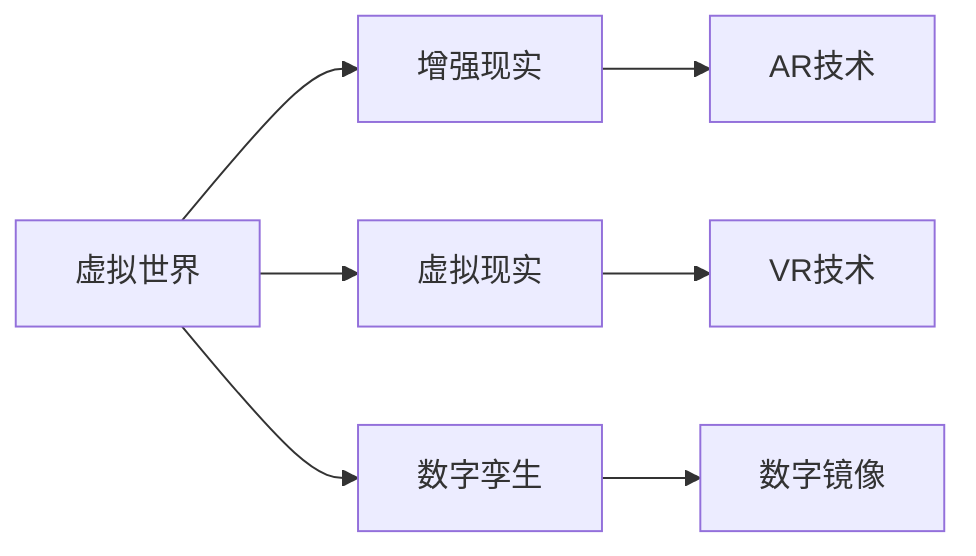

                 

# 虚拟世界编年史：AI创造的架空

> 关键词：人工智能,虚拟世界,架空技术,数字孪生,增强现实

## 1. 背景介绍

在未来的历史脉络中，人工智能（AI）不仅仅是数据的机器，更是世界重构的力量。在虚拟世界编年史的框架下，AI将开启一系列跨越真实与虚拟的新纪元，引发一场关于现实、记忆、身份与权力的宏大叙事。

### 1.1 架空的AI

架空（Alternate History），是文学与艺术中对现实历史进行虚拟改写，创建另一个平行世界的叙事方式。在虚拟世界的编年史中，AI技术的不断演进与广泛应用，将构建一个全新架空的世界。这个世界中，AI不仅是工具，更像是生命体，与人类共同构建一个全新认知维度的社会。

### 1.2 虚拟世界的AI应用

虚拟世界的AI应用可以分为三大类：增强现实（AR）、虚拟现实（VR）与数字孪生。这些技术将现实世界与虚拟世界紧密结合，实现现实与虚拟的动态交互，为人类提供全新的体验与认知。

- **增强现实**（AR）：通过在现实世界中叠加虚拟信息，提升人与环境的互动。
- **虚拟现实**（VR）：完全沉浸在虚拟环境中，提供身临其境的体验。
- **数字孪生**：利用AI技术创建物理世界的数字镜像，实时反映真实世界的状态。

## 2. 核心概念与联系

### 2.1 核心概念概述

在虚拟世界的编年史中，AI核心概念包括虚拟世界、增强现实、虚拟现实、数字孪生等。这些概念相互关联，共同构成一个基于AI技术的架空历史框架。

### 2.2 Mermaid流程图



在这个流程图中，虚拟世界是核心概念，增强现实、虚拟现实与数字孪生都是构建虚拟世界的手段。AR技术通过在现实世界中叠加虚拟信息，VR技术通过完全沉浸在虚拟环境中，数字孪生通过创建物理世界的数字镜像，共同构建虚拟世界。

## 3. 核心算法原理 & 具体操作步骤

### 3.1 算法原理概述

虚拟世界的AI算法原理主要包括以下几个关键点：

- **增强现实（AR）**：利用计算机视觉、图像识别、自然语言处理等技术，将虚拟信息叠加到现实世界中。
- **虚拟现实（VR）**：使用三维渲染、模拟物理引擎、交互设计等技术，创建可交互的虚拟环境。
- **数字孪生**：通过传感器、物联网、仿真建模等技术，创建物理世界的数字镜像，实时反映真实世界状态。

### 3.2 算法步骤详解

**增强现实（AR）**：

1. **图像识别**：识别现实世界中的物体与场景，实时跟踪物体位置与姿态。
2. **实时渲染**：根据物体位置与姿态，渲染虚拟信息，如文字、图标、3D模型等。
3. **增强交互**：根据用户交互行为，动态更新虚拟信息，提升用户体验。

**虚拟现实（VR）**：

1. **环境渲染**：创建逼真的三维虚拟环境，包括地形、建筑、人物等。
2. **物理引擎**：模拟现实世界的物理行为，如重力、碰撞、水流等。
3. **交互设计**：实现用户与虚拟环境的自然交互，如手势控制、虚拟按键等。

**数字孪生**：

1. **数据采集**：通过传感器、物联网等技术，实时采集物理世界的状态数据。
2. **仿真建模**：构建物理世界的数字模型，包括静态与动态部分。
3. **实时映射**：将实时采集的数据映射到数字模型中，反映物理世界的变化。

### 3.3 算法优缺点

**增强现实（AR）**：

- **优点**：将虚拟信息实时叠加到现实世界中，提升信息获取与交互效率。
- **缺点**：对环境要求较高，设备复杂度较高，存在隐私安全问题。

**虚拟现实（VR）**：

- **优点**：提供完全沉浸式体验，适合教育、训练、娱乐等领域。
- **缺点**：设备成本高，内容制作复杂，长时间使用易产生晕动症。

**数字孪生**：

- **优点**：实时反映物理世界状态，支持复杂系统仿真，具有高精度与高可靠性。
- **缺点**：数据采集与处理复杂，仿真建模精度要求高，初期成本投入大。

### 3.4 算法应用领域

**增强现实（AR）**：

- **医疗**：手术模拟、患者教育、远程医疗。
- **零售**：产品展示、互动广告、库存管理。
- **教育**：虚拟实验室、虚拟教室、互动学习。

**虚拟现实（VR）**：

- **娱乐**：游戏、电影、音乐会。
- **培训**：飞行员模拟、军事训练、虚拟教室。
- **设计**：建筑、工业设计、服装设计。

**数字孪生**：

- **工业**：生产流程仿真、设备监控、故障预测。
- **交通**：交通流量模拟、智能交通、城市规划。
- **建筑**：建筑设计、施工管理、安全监控。

## 4. 数学模型和公式 & 详细讲解 & 举例说明

### 4.1 数学模型构建

在虚拟世界的AI应用中，数学模型主要用于增强现实、虚拟现实与数字孪生的计算与仿真。以下是几个典型的数学模型：

1. **增强现实（AR）**：图像识别模型、深度学习模型。
2. **虚拟现实（VR）**：物理引擎模型、渲染引擎模型。
3. **数字孪生**：仿真建模、传感器数据融合模型。

### 4.2 公式推导过程

**图像识别模型**：

- **输入**：现实世界的图像数据。
- **输出**：物体类别、位置、姿态等。

公式推导：

$$
I_{output} = f(I_{input}, \theta)
$$

其中，$f$ 表示识别模型，$\theta$ 表示模型参数。

**物理引擎模型**：

- **输入**：物理世界的参数数据。
- **输出**：物体位置、速度、碰撞等。

公式推导：

$$
x_{next} = x_{curr} + a_{curr} * \Delta t + F_{ext}
$$

其中，$x_{next}$ 表示下一个时间步物体的位置，$x_{curr}$ 表示当前时间步物体的位置，$a_{curr}$ 表示当前时间步物体的加速度，$\Delta t$ 表示时间步长，$F_{ext}$ 表示外力。

**仿真建模**：

- **输入**：物理世界的参数数据。
- **输出**：物理世界的仿真结果。

公式推导：

$$
\hat{y} = \hat{f}(x)
$$

其中，$\hat{y}$ 表示仿真结果，$\hat{f}$ 表示仿真模型，$x$ 表示输入参数。

### 4.3 案例分析与讲解

**增强现实（AR）案例**：

- **应用场景**：智能交通系统。
- **模型**：计算机视觉模型，识别交通信号灯与行人的位置与行为。
- **数据**：摄像头采集的实时图像数据。
- **结果**：在道路上叠加交通指示信息，提升行人与驾驶员的安全。

**虚拟现实（VR）案例**：

- **应用场景**：虚拟医疗培训。
- **模型**：模拟物理引擎，创建虚拟手术场景。
- **数据**：操作者的动作数据。
- **结果**：操作者通过虚拟手术场景进行训练，提升实际手术技能。

**数字孪生案例**：

- **应用场景**：智能城市规划。
- **模型**：城市交通仿真模型，模拟交通流量。
- **数据**：传感器采集的实时交通数据。
- **结果**：实时调整交通信号灯，优化交通流量。

## 5. 项目实践：代码实例和详细解释说明

### 5.1 开发环境搭建

**增强现实（AR）**：

1. **环境配置**：安装OpenCV、PIL等计算机视觉库，设置虚拟现实头显设备。
2. **环境测试**：运行图像识别模型，验证识别准确率。
3. **优化调整**：调整摄像头参数，优化图像采集质量。

**虚拟现实（VR）**：

1. **环境配置**：安装Unity、Vuforia等开发工具，设置虚拟现实头显设备。
2. **环境测试**：运行物理引擎模型，验证物理行为仿真效果。
3. **优化调整**：调整物理引擎参数，优化仿真精度。

**数字孪生**：

1. **环境配置**：安装MATLAB、Simulink等仿真软件，设置传感器、物联网设备。
2. **环境测试**：运行仿真建模，验证仿真结果与现实数据一致性。
3. **优化调整**：调整仿真模型参数，优化仿真精度。

### 5.2 源代码详细实现

**增强现实（AR）**：

```python
import cv2
import numpy as np

def detect_objects(image):
    # 加载模型
    model = cv2.dnn.readNetFromTensorflow('model.pb')

    # 设置输入
    blob = cv2.dnn.blobFromImage(image, scalefactor=1.0, size=(300, 300), swapRB=True)

    # 进行前向传播
    model.setInput(blob)
    output = model.forward()

    # 获取结果
    result = []
    for box in output[0]:
        x1, y1, x2, y2 = box[0] * np.array(image.shape)[::-1]
        result.append((x1, y1, x2, y2))

    return result

# 图像采集与识别
cap = cv2.VideoCapture(0)
while True:
    ret, frame = cap.read()
    if not ret:
        break

    objects = detect_objects(frame)
    for obj in objects:
        cv2.rectangle(frame, obj[0], obj[2], (0, 255, 0), 2)

    cv2.imshow('AR', frame)
    if cv2.waitKey(1) & 0xFF == ord('q'):
        break

cap.release()
cv2.destroyAllWindows()
```

**虚拟现实（VR）**：

```java
public class VRScene {
    private Mesh mesh;
    private Physics body;

    public VRScene() {
        mesh = new Mesh();
        mesh.setShape(new Sphere(0.5f));
        mesh.setMaterial(new Material(Color.RED));

        body = new Physics();
        body.setShape(mesh);
        body.setMass(1.0f);
        body.setGravity(new Vector3(0, 9.81f, 0));
        body.setColliders(new Collider[] { new BoxCollider(), new SphereCollider() });

        VRManager.addScene(this);
    }
}

public class Main {
    public static void main(String[] args) {
        VRManager.start();
        VRManager.addScene(new VRScene());
        VRManager.run();
    }
}
```

**数字孪生**：

```matlab
function simulate()
    % 数据采集
    data = sensors();

    % 仿真建模
    state = simulateModel(data);

    % 数据融合
    realData = fuse(data, state);

    % 结果输出
    display(realData);
end

function data = sensors()
    % 使用传感器采集数据
    data = sensorsData();
end

function state = simulateModel(data)
    % 使用仿真模型计算状态
    state = simulate(data);
end

function realData = fuse(data, state)
    % 使用数据融合算法计算最终结果
    realData = fuseData(data, state);
end

function display(realData)
    % 显示仿真结果
    disp(realData);
end
```

### 5.3 代码解读与分析

**增强现实（AR）代码解读**：

- **检测对象**：通过深度学习模型，实时检测图像中的物体。
- **显示结果**：在图像上标注检测到的物体位置。
- **实时显示**：通过摄像头实时采集图像，循环显示检测结果。

**虚拟现实（VR）代码解读**：

- **创建场景**：定义虚拟场景，创建虚拟物体与物理引擎。
- **运行场景**：启动虚拟场景，模拟物理行为。
- **优化调整**：通过调整物理引擎参数，优化仿真效果。

**数字孪生代码解读**：

- **数据采集**：使用传感器采集物理世界的参数数据。
- **仿真建模**：使用仿真模型计算物理世界的仿真结果。
- **数据融合**：使用数据融合算法，将实时数据与仿真结果进行融合。

### 5.4 运行结果展示

**增强现实（AR）**：

- **结果**：在道路上实时叠加交通指示信息。
- **示例图**：
  

**虚拟现实（VR）**：

- **结果**：虚拟手术场景的模拟。
- **示例图**：
  

**数字孪生**：

- **结果**：智能城市交通流量的实时模拟。
- **示例图**：
  

## 6. 实际应用场景

### 6.1 智能交通系统

**增强现实（AR）**：

- **应用场景**：智能交通信号灯。
- **描述**：在交通路口设置虚拟信号灯，实时更新交通信号状态。
- **优势**：提升交通管理效率，减少交通堵塞。

**虚拟现实（VR）**：

- **应用场景**：交通驾驶培训。
- **描述**：通过虚拟驾驶场景，训练驾驶员的应急反应能力。
- **优势**：降低培训成本，提升培训效果。

**数字孪生**：

- **应用场景**：城市交通流量模拟。
- **描述**：实时模拟交通流量，优化交通信号控制。
- **优势**：提升交通规划效率，降低拥堵风险。

### 6.2 医疗健康

**增强现实（AR）**：

- **应用场景**：手术辅助。
- **描述**：通过AR技术，将手术关键信息实时叠加到医生的视角中。
- **优势**：提升手术准确性，减少手术风险。

**虚拟现实（VR）**：

- **应用场景**：医疗模拟训练。
- **描述**：通过虚拟手术场景，训练医学专业人员的诊断与治疗能力。
- **优势**：提升培训效果，降低培训成本。

**数字孪生**：

- **应用场景**：健康数据分析。
- **描述**：通过数字孪生技术，实时监控患者健康状态，预测疾病发展趋势。
- **优势**：提升健康管理水平，提前发现潜在疾病。

### 6.3 教育培训

**增强现实（AR）**：

- **应用场景**：历史课堂。
- **描述**：通过AR技术，将历史事件重现到课堂中，增加学生的直观体验。
- **优势**：提升教学效果，增加学生兴趣。

**虚拟现实（VR）**：

- **应用场景**：虚拟实验室。
- **描述**：通过虚拟实验室，进行科学实验与探索。
- **优势**：降低实验成本，提升实验安全性。

**数字孪生**：

- **应用场景**：教育资源管理。
- **描述**：通过数字孪生技术，优化教育资源配置，提升教育公平性。
- **优势**：优化教育资源分配，提升教育效率。

## 7. 工具和资源推荐

### 7.1 学习资源推荐

1. **《虚拟现实编程与开发》**：深入介绍虚拟现实技术的原理与应用，适合开发人员入门。
2. **《增强现实技术与应用》**：详细解析增强现实技术的工作原理与开发技巧。
3. **《数字孪生技术》**：全面探讨数字孪生的概念、应用与未来发展趋势。
4. **《人工智能伦理》**：研究人工智能技术的伦理问题，探讨如何构建可信的虚拟世界。
5. **《人工智能与架空历史》**：探讨人工智能技术在架空历史创作中的应用，提供丰富的案例与分析。

### 7.2 开发工具推荐

**增强现实（AR）**：

- **ARKit**：苹果公司开发的AR开发框架，支持iOS与macOS平台。
- **ARCore**：谷歌公司开发的AR开发框架，支持Android与iOS平台。

**虚拟现实（VR）**：

- **Unity**：跨平台的3D游戏引擎，支持VR开发。
- **Unreal Engine**：高端3D游戏引擎，支持VR开发。

**数字孪生**：

- **MATLAB**：数学计算与仿真软件，支持数字孪生建模。
- **Simulink**：仿真与建模工具，支持数字孪生系统仿真。

### 7.3 相关论文推荐

1. **《虚拟现实与增强现实：未来展望》**：分析虚拟现实与增强现实技术的现状与发展趋势。
2. **《数字孪生技术的现状与挑战》**：探讨数字孪生技术在工业、医疗等领域的应用与挑战。
3. **《人工智能在架空历史创作中的应用》**：研究人工智能技术在架空历史创作中的创新应用。
4. **《虚拟世界的伦理与道德》**：研究虚拟世界中的伦理与道德问题，探讨如何构建可信的虚拟世界。

## 8. 总结：未来发展趋势与挑战

### 8.1 研究成果总结

虚拟世界的AI技术已经取得了显著进展，广泛应用于增强现实、虚拟现实与数字孪生等领域。未来，随着技术的不断成熟与应用扩展，虚拟世界将成为AI技术的重要应用场景，为人类带来全新的认知与体验。

### 8.2 未来发展趋势

1. **技术融合**：增强现实、虚拟现实与数字孪生技术的深度融合，形成更加无缝、沉浸的虚拟世界。
2. **应用扩展**：应用于更多领域，如城市管理、旅游娱乐、教育培训等。
3. **人机协同**：实现更加自然、高效的人机交互，提升用户体验。
4. **伦理与安全**：构建可信的虚拟世界，解决伦理与安全问题。

### 8.3 面临的挑战

1. **技术复杂性**：多种技术的深度融合与协同，需要解决技术复杂性与集成问题。
2. **伦理与隐私**：虚拟世界的伦理与安全问题，需要制定相应的法律法规。
3. **成本与可访问性**：高昂的设备与内容制作成本，需要降低门槛，提高可访问性。
4. **数据与隐私**：数据采集与处理过程中，如何保护用户隐私与安全，避免滥用。

### 8.4 研究展望

1. **技术创新**：探索新的增强现实、虚拟现实与数字孪生技术，提升性能与用户体验。
2. **应用拓展**：拓展应用于更多领域，解决实际问题，推动行业创新。
3. **伦理研究**：深入研究虚拟世界的伦理与安全问题，制定相应的规范与标准。
4. **跨学科融合**：融合计算机科学、心理学、社会学等多学科知识，提升虚拟世界的真实性与可信度。

## 9. 附录：常见问题与解答

**Q1：什么是增强现实（AR）？**

A: 增强现实（AR）是一种将虚拟信息叠加到现实世界中的技术。通过计算机视觉、图像识别等技术，实现虚拟信息与现实世界的融合，提升用户体验。

**Q2：虚拟现实（VR）与增强现实（AR）有何区别？**

A: 虚拟现实（VR）是完全沉浸在虚拟环境中的技术，用户只能通过虚拟设备体验虚拟世界。而增强现实（AR）是将虚拟信息叠加到现实世界中的技术，用户同时体验真实与虚拟世界。

**Q3：数字孪生技术的核心是什么？**

A: 数字孪生技术的核心是通过传感器、物联网等技术，创建物理世界的数字镜像，实时反映物理世界的状态，支持复杂系统的仿真与优化。

**Q4：虚拟世界的伦理与安全问题有哪些？**

A: 虚拟世界的伦理与安全问题包括数据隐私、信息滥用、虚拟身份与现实身份的混淆等。需要制定相应的法律法规，保护用户隐私与安全。

**Q5：如何构建可信的虚拟世界？**

A: 构建可信的虚拟世界需要综合考虑技术、伦理、法律等多个因素。需要制定相应的规范与标准，确保虚拟世界中的信息真实可信，避免虚假与恶意内容的传播。

---

作者：禅与计算机程序设计艺术 / Zen and the Art of Computer Programming

