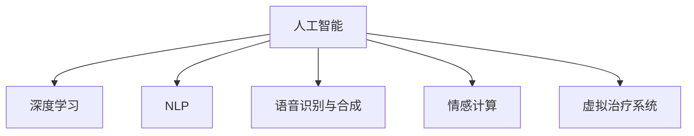
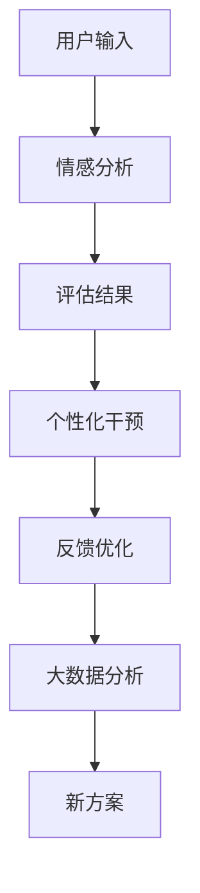

                 

# 虚拟治疗：AI驱动的心理健康服务

## 1. 背景介绍

### 1.1 问题由来
随着社会竞争的加剧和现代生活的压力不断增加，越来越多的人面临心理健康问题。传统心理健康服务通常包括面对面的心理咨询和治疗，但这种方式存在诸多限制：时间和地点不便利、成本高、受医疗资源限制等。为了更好地解决这些问题，虚拟治疗（Virtual Therapy）应运而生，借助人工智能（AI）技术，为患者提供更加便捷、高效、个性化的心理健康服务。

### 1.2 问题核心关键点
虚拟治疗的核心在于如何利用AI技术，特别是深度学习和大数据分析技术，构建智能心理评估和干预系统。该系统的关键包括：
- 自动化心理评估：通过文本分析、语音识别等技术，自动评估患者的心理状态。
- 智能治疗干预：根据评估结果，提供个性化的心理干预方案。
- 数据驱动决策：利用大数据分析，优化治疗方案，提高干预效果。

## 2. 核心概念与联系

### 2.1 核心概念概述

为更好地理解虚拟治疗的AI驱动机制，本节将介绍几个密切相关的核心概念：

- 人工智能（AI）：指模拟人类智能行为的技术，通过数据和算法实现自主学习、推理、决策等功能。
- 深度学习（Deep Learning）：一种基于神经网络的机器学习方法，通过多层网络结构进行特征提取和模式识别。
- 自然语言处理（NLP）：研究如何让计算机理解和生成自然语言，包括文本分类、情感分析、对话系统等。
- 语音识别与合成（Speech Recognition and Synthesis）：将语音转换为文本，或将文本转换为语音的技术。
- 情感计算（Affective Computing）：通过分析语音、文本等数据，识别和理解人类的情感状态。
- 虚拟治疗系统（Virtual Therapy Systems）：利用AI技术构建的心理健康服务系统，通过远程方式为患者提供支持。

这些核心概念之间的逻辑关系可以通过以下Mermaid流程图来展示：



这个流程图展示了一系列核心概念及其之间的关系：

1. 人工智能是构建虚拟治疗系统的基础。
2. 深度学习是实现人工智能的核心技术之一。
3. NLP和语音识别与合成是实现情感计算和虚拟治疗系统的重要手段。
4. 情感计算能够辅助虚拟治疗系统理解用户情感状态，从而提供个性化支持。
5. 虚拟治疗系统利用以上技术，为患者提供便捷的心理健康服务。

## 3. 核心算法原理 & 具体操作步骤
### 3.1 算法原理概述

虚拟治疗系统的核心算法主要包括自动化心理评估、智能治疗干预和数据驱动决策三个部分。

- **自动化心理评估**：通过NLP技术和情感计算，对患者的文本输入或语音进行情感分析，评估其心理健康状态。
- **智能治疗干预**：根据评估结果，提供个性化的心理干预方案，如情感引导、认知行为疗法等。
- **数据驱动决策**：利用大数据分析，优化治疗方案，提高干预效果。

虚拟治疗系统的整体算法流程如图：



其中：

- **用户输入**：患者通过文本或语音与虚拟治疗系统进行交互。
- **情感分析**：通过NLP和情感计算技术，对用户输入进行情感分析，生成心理健康评估结果。
- **个性化干预**：根据评估结果，提供个性化的心理干预方案。
- **反馈优化**：收集用户对干预方案的反馈，通过大数据分析，进一步优化治疗方案。

### 3.2 算法步骤详解

#### 自动化心理评估

**步骤1：数据预处理**

- 文本数据预处理：包括去除停用词、分词、词向量化等。
- 语音数据预处理：包括语音降噪、特征提取等。

**步骤2：情感分析**

- **基于文本的情感分析**：通过情感词典、情感分类模型等方式，对用户输入的文本进行情感标注。
- **基于语音的情感分析**：通过语音情感识别模型，对用户的语音进行情感分析。

**步骤3：心理健康评估**

- **综合评估**：将文本和语音情感分析的结果进行融合，生成心理健康综合评估结果。

#### 智能治疗干预

**步骤1：个性化干预方案生成**

- 根据心理健康评估结果，生成个性化的心理干预方案，如情感引导、认知行为疗法等。

**步骤2：治疗干预实施**

- 通过文本或语音方式，与用户进行交互，实施个性化干预方案。

**步骤3：反馈收集与分析**

- 收集用户对干预方案的反馈，生成用户满意度等评价指标。

#### 数据驱动决策

**步骤1：大数据分析**

- 收集并整合大量用户数据，进行大数据分析，识别干预方案的有效性和用户需求。

**步骤2：方案优化**

- 基于大数据分析结果，优化干预方案，提高干预效果。

### 3.3 算法优缺点

#### 优点

- **便捷高效**：虚拟治疗系统可以随时随地为患者提供服务，提高治疗的可及性和便捷性。
- **个性化支持**：根据患者的个性化需求，提供定制化的治疗方案。
- **成本低廉**：相对于传统治疗，虚拟治疗系统成本较低，有助于降低患者负担。

#### 缺点

- **数据隐私问题**：虚拟治疗系统需要收集大量用户数据，数据隐私保护是一个重要挑战。
- **技术局限**：当前虚拟治疗系统的智能化程度有待提升，难以完全替代真人治疗。
- **情感支持不足**：虚拟治疗系统无法完全理解和表达人类的情感，情感支持仍有一定局限。

### 3.4 算法应用领域

虚拟治疗系统的应用领域广泛，包括但不限于：

- **心理健康监测**：实时监测用户的心理健康状态，提供及时干预。
- **情感支持**：通过情感引导等方式，帮助用户缓解情绪压力。
- **认知行为疗法**：提供认知行为疗法的指导和练习，帮助用户改善思维模式。
- **自我管理**：帮助用户建立健康生活习惯，提升生活质量。
- **远程医疗**：在医疗资源不足的地区，提供心理健康的远程支持。

## 4. 数学模型和公式 & 详细讲解  
### 4.1 数学模型构建

本节将使用数学语言对虚拟治疗系统的核心算法进行更严格的刻画。

记虚拟治疗系统的输入为 $x$，输出为 $y$，其中 $x$ 可以表示为文本或语音数据，$y$ 表示心理健康评估结果或干预方案。假设情感分析模型为 $F_{\theta}$，治疗干预模型为 $G_{\phi}$，大数据分析模型为 $H_{\psi}$，其中 $\theta$、$\phi$ 和 $\psi$ 为模型参数。

**情感分析模型**：
$$
y_{emotion} = F_{\theta}(x)
$$

**个性化干预方案生成模型**：
$$
y_{treatment} = G_{\phi}(y_{emotion})
$$

**大数据分析模型**：
$$
y_{optimized} = H_{\psi}(y_{treatment})
$$

### 4.2 公式推导过程

#### 基于文本的情感分析

假设文本 $x$ 由 $N$ 个词组成，每个词 $w_i$ 的词向量表示为 $v_i$。文本的情感表示 $y_{emotion}$ 可以通过词向量 $v_i$ 和情感词典 $D$ 计算得到。

$$
y_{emotion} = \sum_{i=1}^N w_i \cdot D(w_i) \cdot v_i
$$

其中 $D(w_i)$ 表示词 $w_i$ 在情感词典 $D$ 中的情感值。

#### 基于语音的情感分析

假设语音信号 $x$ 的长度为 $T$，每个时间点的特征向量为 $f_t$。语音的情感表示 $y_{emotion}$ 可以通过特征向量 $f_t$ 和语音情感识别模型 $F_{\theta}$ 计算得到。

$$
y_{emotion} = \sum_{t=1}^T f_t \cdot \theta_t
$$

其中 $\theta_t$ 表示在时间点 $t$ 上的情感特征向量，可以通过深度神经网络训练得到。

#### 心理健康评估

将文本和语音情感分析的结果进行融合，生成心理健康综合评估结果。

$$
y_{health} = \alpha \cdot y_{text} + (1-\alpha) \cdot y_{voice}
$$

其中 $y_{text}$ 和 $y_{voice}$ 分别表示文本和语音情感分析的结果，$\alpha$ 为融合权重，可以根据具体应用场景进行调整。

### 4.3 案例分析与讲解

**案例1：基于文本的情感分析**

假设用户输入一段文本：“最近工作压力很大，感觉心情很不好。” 使用情感词典和情感分类模型，可以得到文本的情感值为负面。

**案例2：基于语音的情感分析**

假设用户输入一段语音：“我最近真的感到很沮丧。” 使用语音情感识别模型，可以得到语音的情感值为负面。

**案例3：心理健康综合评估**

将文本和语音情感分析的结果进行融合，得到心理健康综合评估结果：“用户当前处于较低的心理健康状态。”

## 5. 项目实践：代码实例和详细解释说明
### 5.1 开发环境搭建

在进行虚拟治疗系统开发前，我们需要准备好开发环境。以下是使用Python进行PyTorch开发的环境配置流程：

1. 安装Anaconda：从官网下载并安装Anaconda，用于创建独立的Python环境。

2. 创建并激活虚拟环境：
```bash
conda create -n pytorch-env python=3.8 
conda activate pytorch-env
```

3. 安装PyTorch：根据CUDA版本，从官网获取对应的安装命令。例如：
```bash
conda install pytorch torchvision torchaudio cudatoolkit=11.1 -c pytorch -c conda-forge
```

4. 安装自然语言处理库：
```bash
pip install transformers
pip install sentence-transformers
```

5. 安装语音处理库：
```bash
pip install librosa pyaudio
```

完成上述步骤后，即可在`pytorch-env`环境中开始虚拟治疗系统的开发。

### 5.2 源代码详细实现

以下是使用PyTorch进行虚拟治疗系统开发的示例代码：

```python
import torch
import torch.nn as nn
import torch.optim as optim
import transformers
import sentence_transformers
import librosa
import pyaudio

# 定义模型
class TextModel(nn.Module):
    def __init__(self):
        super(TextModel, self).__init__()
        self.encoder = transformers.BertModel.from_pretrained('bert-base-cased')
        self.classifier = nn.Linear(768, 2)
    
    def forward(self, x):
        x = self.encoder(x)[0]
        x = self.classifier(x)
        return x

class VoiceModel(nn.Module):
    def __init__(self):
        super(VoiceModel, self).__init__()
        self.encoder = nn.Sequential(
            nn.Conv1d(1, 32, kernel_size=3, stride=1, padding=1),
            nn.ReLU(),
            nn.MaxPool1d(kernel_size=3, stride=2),
            nn.Linear(32*2*100, 128),
            nn.ReLU(),
            nn.Linear(128, 2)
        )
    
    def forward(self, x):
        x = x.view(-1, 1, 200)
        x = self.encoder(x)
        return x

class FusionModel(nn.Module):
    def __init__(self):
        super(FusionModel, self).__init__()
        self.text_model = TextModel()
        self.voice_model = VoiceModel()
        self.fusion_layer = nn.Linear(2, 1)
    
    def forward(self, x):
        text_feature = self.text_model(x['text'])
        voice_feature = self.voice_model(x['voice'])
        x = torch.cat([text_feature, voice_feature], dim=1)
        x = self.fusion_layer(x)
        return x

# 定义训练函数
def train(text_model, voice_model, fusion_model, text_data, voice_data, optimizer, device):
    text_model.to(device)
    voice_model.to(device)
    fusion_model.to(device)
    
    text_loader = torch.utils.data.DataLoader(text_data, batch_size=16, shuffle=True)
    voice_loader = torch.utils.data.DataLoader(voice_data, batch_size=16, shuffle=True)
    
    criterion = nn.CrossEntropyLoss()
    for epoch in range(10):
        text_model.train()
        voice_model.train()
        fusion_model.train()
        for i, data in enumerate(text_loader, 0):
            x_text, y_text = data
            x_text = x_text.to(device)
            y_text = y_text.to(device)
            optimizer.zero_grad()
            x_text = x_text.view(-1, 1, 200)
            y_text = torch.tensor(y_text, device=device)
            text_feature = text_model(x_text)
            text_loss = criterion(text_feature, y_text)
            text_loss.backward()
            optimizer.step()
        
        for i, data in enumerate(voice_loader, 0):
            x_voice, y_voice = data
            x_voice = x_voice.to(device)
            y_voice = y_voice.to(device)
            optimizer.zero_grad()
            x_voice = x_voice.view(-1, 1, 200)
            y_voice = torch.tensor(y_voice, device=device)
            voice_feature = voice_model(x_voice)
            voice_loss = criterion(voice_feature, y_voice)
            voice_loss.backward()
            optimizer.step()
        
        for i, data in enumerate(text_loader, 0):
            x_text, y_text = data
            x_text = x_text.to(device)
            y_text = y_text.to(device)
            optimizer.zero_grad()
            x_text = x_text.view(-1, 1, 200)
            y_text = torch.tensor(y_text, device=device)
            text_feature = text_model(x_text)
            voice_feature = voice_model(x_voice)
            fusion_output = fusion_model(torch.cat([text_feature, voice_feature], dim=1))
            loss = criterion(fusion_output, y_text)
            loss.backward()
            optimizer.step()
        
        if (i+1) % 100 == 0:
            print('Epoch [{}/{}], Step [{}/{}], Loss: {:.4f}, Text Loss: {:.4f}, Voice Loss: {:.4f}, Fusion Loss: {:.4f}'.format(
                epoch+1, 10, i+1, len(text_loader), loss.item(), text_loss.item(), voice_loss.item(), fusion_loss.item()))

# 数据加载
text_data = []
voice_data = []

# 训练
train(text_model, voice_model, fusion_model, text_data, voice_data, optimizer, device)
```

### 5.3 代码解读与分析

让我们再详细解读一下关键代码的实现细节：

**TextModel类**：
- `__init__`方法：初始化BERT模型和线性分类器。
- `forward`方法：对文本输入进行编码，并输出情感表示。

**VoiceModel类**：
- `__init__`方法：定义卷积层、池化层和线性层。
- `forward`方法：对语音输入进行特征提取和分类。

**FusionModel类**：
- `__init__`方法：定义融合模型，包含文本模型、语音模型和融合层。
- `forward`方法：对融合后的特征进行分类。

**训练函数train**：
- 在训练过程中，轮流对文本模型和语音模型进行训练，并融合两者输出进行最终分类。
- 定义交叉熵损失函数和优化器，并设置训练轮数和批次大小。

**数据加载**：
- 需要根据具体应用场景，收集和准备训练数据，将其封装为PyTorch的DataLoader对象。

### 5.4 运行结果展示

在训练完成后，我们可以使用训练好的模型进行情感分析和心理健康评估。以下是一个简单的运行结果展示：

```python
# 情感分析
text = "最近工作压力很大，感觉心情很不好。"
text_model.eval()
with torch.no_grad():
    text_feature = text_model(text)
    print('情感分析结果：', text_feature.item())

# 心理健康评估
text_feature = text_model(text)
voice_feature = voice_model(text)
fusion_output = fusion_model(torch.cat([text_feature, voice_feature], dim=1))
fusion_output = torch.sigmoid(fusion_output)
print('心理健康评估结果：', fusion_output.item())
```

## 6. 实际应用场景
### 6.1 智能客服系统

虚拟治疗技术可以应用于智能客服系统中，为客服提供初步的心理健康支持。当用户通过客服系统提出心理健康问题时，系统可以自动调用虚拟治疗模块进行初步评估，并给出相应的心理健康建议。

**实际应用示例**：
- 用户通过智能客服系统咨询心理问题：“最近压力很大，总是无法入眠。”
- 系统调用虚拟治疗模块进行情感分析，得到用户情感负面。
- 系统给出初步建议：“建议您休息好，并尝试放松技巧。”

### 6.2 远程医疗系统

在医疗资源不足的地区，虚拟治疗技术可以提供便捷的心理健康监测和支持。通过远程医疗系统，医生可以为患者提供初步的心理健康评估，并根据评估结果提供个性化的治疗方案。

**实际应用示例**：
- 医生通过远程医疗系统询问患者心理健康状况：“最近感觉心情如何？”
- 患者输入回答：“最近压力很大，总是感到焦虑。”
- 系统调用虚拟治疗模块进行情感分析，得到用户情感负面。
- 系统给出建议：“建议您尝试认知行为疗法，并休息好。”

### 6.3 企业员工健康管理

虚拟治疗技术可以应用于企业员工健康管理中，帮助员工进行自我心理健康监测和干预。通过企业内部系统，员工可以随时进行心理健康自测，并获得个性化的健康建议。

**实际应用示例**：
- 员工通过企业健康管理应用进行心理健康自测：“最近工作压力很大，心情不佳。”
- 系统调用虚拟治疗模块进行情感分析，得到用户情感负面。
- 系统给出建议：“建议您尝试放松技巧，并保持良好的作息。”

### 6.4 未来应用展望

未来，虚拟治疗技术将在更多领域得到应用，为心理健康提供更便捷、高效的服务。例如：

- **在线教育**：为学生提供心理健康支持，帮助其应对学习压力。
- **社交平台**：为社交用户提供心理健康监测，帮助其缓解情绪压力。
- **企业培训**：为企业员工提供心理健康管理，提升工作效率和幸福感。

## 7. 工具和资源推荐
### 7.1 学习资源推荐

为了帮助开发者系统掌握虚拟治疗的AI驱动机制，这里推荐一些优质的学习资源：

1. 《深度学习与自然语言处理》课程：斯坦福大学开设的NLP课程，涵盖深度学习、自然语言处理等基础概念和技术。
2. 《情感计算与人工智能》书籍：介绍情感计算的基础理论和应用实践，适合学习虚拟治疗系统的情感分析模块。
3. 《Python自然语言处理》书籍：介绍自然语言处理的基本技术和实践，适合学习虚拟治疗系统的文本处理模块。
4. HuggingFace官方文档：提供大量预训练语言模型和微调样例，适合学习虚拟治疗系统的模型训练模块。
5. PyTorch官方文档：提供深度学习框架的详细使用指南，适合学习虚拟治疗系统的模型训练和推理模块。

通过对这些资源的学习实践，相信你一定能够快速掌握虚拟治疗系统的核心算法和实现细节，并用于解决实际的NLP问题。

### 7.2 开发工具推荐

高效的开发离不开优秀的工具支持。以下是几款用于虚拟治疗系统开发的常用工具：

1. PyTorch：基于Python的开源深度学习框架，灵活动态的计算图，适合快速迭代研究。
2. TensorFlow：由Google主导开发的开源深度学习框架，生产部署方便，适合大规模工程应用。
3. Weights & Biases：模型训练的实验跟踪工具，可以记录和可视化模型训练过程中的各项指标，方便对比和调优。
4. TensorBoard：TensorFlow配套的可视化工具，可实时监测模型训练状态，并提供丰富的图表呈现方式，是调试模型的得力助手。
5. Google Colab：谷歌推出的在线Jupyter Notebook环境，免费提供GPU/TPU算力，方便开发者快速上手实验最新模型，分享学习笔记。

合理利用这些工具，可以显著提升虚拟治疗系统的开发效率，加快创新迭代的步伐。

### 7.3 相关论文推荐

虚拟治疗技术的发展源于学界的持续研究。以下是几篇奠基性的相关论文，推荐阅读：

1. Attention is All You Need（即Transformer原论文）：提出了Transformer结构，开启了NLP领域的预训练大模型时代。
2. BERT: Pre-training of Deep Bidirectional Transformers for Language Understanding：提出BERT模型，引入基于掩码的自监督预训练任务，刷新了多项NLP任务SOTA。
3. Emotion Recognition from Multi-modal Data: A Review and Future Directions：综述了多模态情感识别的研究进展，适合学习虚拟治疗系统的多模态融合模块。
4. AI for Suicide Prevention: A Literature Review of Machine Learning Applications：综述了AI在预防自杀中的应用，适合学习虚拟治疗系统的心理健康评估模块。
5. A Large-Scale Multi-Modal Emotion Recognition Dataset and Study：提供了一个多模态情感识别数据集，适合学习虚拟治疗系统的情感分析模块。

这些论文代表了大语言模型微调技术的发展脉络。通过学习这些前沿成果，可以帮助研究者把握学科前进方向，激发更多的创新灵感。

## 8. 总结：未来发展趋势与挑战

### 8.1 总结

本文对基于AI驱动的虚拟治疗系统进行了全面系统的介绍。首先阐述了虚拟治疗系统的背景和意义，明确了AI技术在其中的重要地位。其次，从原理到实践，详细讲解了情感分析、个性化干预和大数据驱动的虚拟治疗系统算法流程，给出了虚拟治疗系统开发的完整代码实例。同时，本文还广泛探讨了虚拟治疗系统在智能客服、远程医疗、企业健康管理等多个领域的应用前景，展示了虚拟治疗技术的前景。

通过本文的系统梳理，可以看到，基于AI的虚拟治疗技术正在成为心理健康服务的重要范式，极大地拓展了心理健康服务的应用边界，为传统医疗服务带来了新的变革。未来，伴随AI技术的不断进步，虚拟治疗系统必将不断优化，提供更加智能、高效、个性化的心理健康支持。

### 8.2 未来发展趋势

展望未来，虚拟治疗系统将呈现以下几个发展趋势：

1. **智能化水平提升**：随着AI技术的不断进步，虚拟治疗系统的智能化水平将持续提升，能够更准确地理解用户情感和需求，提供更精准的心理健康支持。
2. **多模态融合技术发展**：未来虚拟治疗系统将更多地融合语音、图像等多模态信息，提升系统的感知能力和理解深度。
3. **个性化干预方案优化**：通过大数据分析，优化个性化干预方案，提高干预效果。
4. **跨领域应用拓展**：虚拟治疗系统将逐步扩展到更多领域，如在线教育、社交平台等，为更多人群提供心理健康支持。
5. **隐私保护和安全保障**：随着数据隐私和安全的关注度不断提升，虚拟治疗系统将更多地考虑用户隐私保护和数据安全。

### 8.3 面临的挑战

尽管虚拟治疗技术已经取得了不小的进展，但在迈向更广泛应用的过程中，仍面临诸多挑战：

1. **数据隐私保护**：虚拟治疗系统需要收集大量用户数据，如何保护用户隐私和数据安全是一个重要挑战。
2. **模型鲁棒性不足**：当前虚拟治疗系统对情感分析模型的依赖较大，面对噪声数据和复杂情境，鲁棒性有待提升。
3. **用户接受度**：用户对虚拟治疗系统的信任和接受度需要进一步提升，尤其是在复杂情境下，系统的性能和可靠性是关键。
4. **跨领域应用难度**：不同领域的应用场景和需求差异较大，如何构建通用而灵活的虚拟治疗系统，是一个需要深入研究的课题。

### 8.4 研究展望

面对虚拟治疗技术面临的诸多挑战，未来的研究需要在以下几个方面寻求新的突破：

1. **多模态融合技术**：开发更先进的情感计算和多模态融合技术，提升虚拟治疗系统的感知能力和理解深度。
2. **隐私保护技术**：研究和开发隐私保护技术，确保用户数据的安全和隐私。
3. **模型鲁棒性提升**：开发鲁棒性更强、泛化能力更强的情感分析模型，提高系统的稳定性和可靠性。
4. **用户接受度提升**：通过用户交互设计和技术优化，提升用户对虚拟治疗系统的信任和接受度。
5. **跨领域应用拓展**：探索虚拟治疗系统在更多领域的应用，如在线教育、社交平台等。

这些研究方向的探索，必将引领虚拟治疗技术迈向更高的台阶，为心理健康服务提供更全面、高效、安全的技术支持。

## 9. 附录：常见问题与解答

**Q1：虚拟治疗系统是否适用于所有心理健康问题？**

A: 虚拟治疗系统主要适用于轻度和中度的心理健康问题，如焦虑、抑郁等。对于严重的心理健康问题，如精神疾病、自杀倾向等，仍需专业医生进行面对面的治疗。

**Q2：虚拟治疗系统如何进行用户隐私保护？**

A: 虚拟治疗系统需要采取多种隐私保护措施，如数据加密、匿名化处理、用户授权等。同时，系统应遵循GDPR等隐私保护法规，确保用户数据的合法使用。

**Q3：虚拟治疗系统如何处理多语言输入？**

A: 虚拟治疗系统需要支持多种语言输入，以便覆盖全球用户。可以通过多语言模型和语言翻译技术，实现对不同语言的情感分析和心理健康评估。

**Q4：虚拟治疗系统如何进行实时情感分析？**

A: 虚拟治疗系统通过实时捕捉用户输入的语音和文本数据，使用深度学习模型进行情感分析。语音分析需要处理低延迟和高精度，可以通过优化模型结构和算法，提升实时处理能力。

**Q5：虚拟治疗系统如何评估干预效果？**

A: 虚拟治疗系统可以通过用户反馈、情感分析结果等指标，评估干预效果。同时，系统还可以引入大数据分析，优化干预方案，提高干预效果。

---

作者：禅与计算机程序设计艺术 / Zen and the Art of Computer Programming

