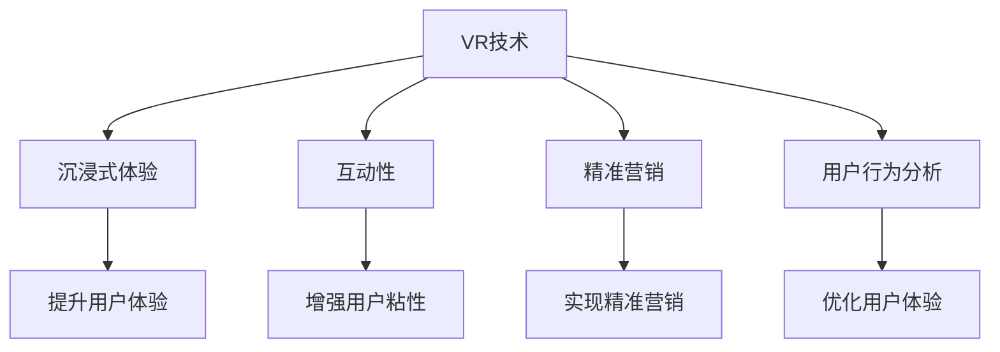

                 

# 虚拟现实技术在注意力经济中的应用

> 关键词：虚拟现实(VR)技术,注意力经济,交互设计,沉浸体验,精准营销,用户行为分析

## 1. 背景介绍

### 1.1 问题由来

随着互联网的普及和智能设备的广泛使用，注意力经济的时代已经到来。信息过载、注意力分散等现象日益凸显，如何吸引和保持用户的注意力成为企业关注的焦点。虚拟现实（Virtual Reality, VR）技术作为新一代沉浸式交互手段，凭借其沉浸性、互动性、实境性等优势，成为吸引用户注意力的新工具。

虚拟现实技术通过模拟真实环境，将用户完全沉浸在虚拟世界中，打破时空限制，创造出前所未有的互动体验。它不仅仅是一个游戏或娱乐工具，更是一个重构人类感知与行为模式的全新平台。

### 1.2 问题核心关键点

虚拟现实技术在注意力经济中的应用，关键点在于其能够通过高沉浸度、强互动性的特性，帮助品牌和商家吸引、保持用户注意力，并实现精准的营销和用户行为分析。

具体而言，虚拟现实技术在注意力经济中的应用主要体现在以下几个方面：

1. **沉浸式体验**：通过高逼真的3D场景和实时交互，营造强烈的沉浸感，使用户在虚拟环境中长时间停留，增强用户粘性。
2. **互动性提升**：通过手势控制、语音交互等手段，提升用户的参与感和互动性，增强用户对品牌的好感度。
3. **精准营销**：通过虚拟现实中的精准定位和个性化推荐，实现对用户的精准营销，提升转化率。
4. **用户行为分析**：通过虚拟环境中的行为追踪和数据分析，了解用户偏好和行为模式，优化用户体验和个性化推荐。

### 1.3 问题研究意义

研究虚拟现实技术在注意力经济中的应用，对提升用户体验、增强用户粘性、实现精准营销具有重要意义：

1. **提升用户体验**：虚拟现实技术能够提供沉浸式体验，使用户更加投入和专注，提升使用体验和满意度。
2. **增强用户粘性**：通过虚拟现实的高互动性和个性化推荐，增强用户对品牌的黏性，形成长期关系。
3. **实现精准营销**：通过虚拟现实中的精准定位和行为追踪，实现对用户的深度洞察，实现个性化营销，提升转化率。
4. **优化用户体验**：通过虚拟环境中的行为数据分析，优化产品和服务，提升用户满意度和忠诚度。

## 2. 核心概念与联系

### 2.1 核心概念概述

为了更好地理解虚拟现实技术在注意力经济中的应用，首先需要对其中的核心概念进行详细阐述：

1. **虚拟现实(VR)技术**：通过计算机生成的虚拟环境，使用户能够以沉浸式方式与之交互，体验到如临其境的感觉。
2. **注意力经济**：以注意力为关键资源的经济形态，注重通过吸引和保持用户注意力来创造价值。
3. **沉浸式体验**：通过高逼真的3D场景和实时交互，让用户完全沉浸在虚拟世界中，增强用户体验和粘性。
4. **互动性**：通过手势控制、语音交互等方式，提升用户参与感和互动性，增强用户对品牌的好感度。
5. **精准营销**：通过虚拟现实中的精准定位和个性化推荐，实现对用户的深度洞察，提升转化率。
6. **用户行为分析**：通过虚拟环境中的行为追踪和数据分析，了解用户偏好和行为模式，优化用户体验和个性化推荐。

这些概念之间的关系可以通过以下Mermaid流程图来展示：



这个流程图展示了几者之间的逻辑关系：

- 虚拟现实技术（A）通过沉浸式体验（B）、互动性（C）、精准营销（D）和用户行为分析（E），分别从提升用户体验（F）、增强用户粘性（G）、实现精准营销（H）和优化用户体验（I）等方面，对注意力经济产生深远影响。

## 3. 核心算法原理 & 具体操作步骤

### 3.1 算法原理概述

虚拟现实技术在注意力经济中的应用，主要基于以下原理：

1. **沉浸式体验**：通过高逼真的3D场景和实时交互，营造强烈的沉浸感，使用户在虚拟环境中长时间停留，增强用户粘性。
2. **互动性提升**：通过手势控制、语音交互等手段，提升用户的参与感和互动性，增强用户对品牌的好感度。
3. **精准营销**：通过虚拟现实中的精准定位和个性化推荐，实现对用户的深度洞察，实现个性化营销，提升转化率。
4. **用户行为分析**：通过虚拟环境中的行为追踪和数据分析，了解用户偏好和行为模式，优化用户体验和个性化推荐。

### 3.2 算法步骤详解

虚拟现实技术在注意力经济中的应用步骤通常包括：

1. **环境构建**：使用虚拟现实技术创建逼真的虚拟场景和环境，确保用户能够完全沉浸在虚拟世界中。
2. **交互设计**：设计用户与虚拟环境的交互方式，如手势控制、语音交互、触摸反馈等，提升用户体验和互动性。
3. **用户行为追踪**：通过虚拟环境中的传感器和数据追踪，实时记录用户的行为和偏好。
4. **数据分析与优化**：利用机器学习和数据挖掘技术，对用户行为数据进行分析，实现个性化推荐和用户体验优化。
5. **精准营销**：基于用户偏好和行为分析，进行精准的营销和个性化推荐，提升转化率。

### 3.3 算法优缺点

虚拟现实技术在注意力经济中的应用具有以下优点：

1. **沉浸式体验**：能够提供高逼真的3D场景和实时交互，使用户完全沉浸在虚拟世界中，增强用户体验和粘性。
2. **强互动性**：通过手势控制、语音交互等方式，提升用户参与感和互动性，增强用户对品牌的好感度。
3. **精准营销**：通过虚拟现实中的精准定位和个性化推荐，实现对用户的深度洞察，提升转化率。
4. **行为分析**：通过虚拟环境中的行为追踪和数据分析，了解用户偏好和行为模式，优化用户体验和个性化推荐。

然而，虚拟现实技术在注意力经济中的应用也存在以下缺点：

1. **成本高**：虚拟现实设备和技术成本较高，难以大规模推广和应用。
2. **技术门槛高**：需要较高的技术水平和专业团队进行开发和维护。
3. **内容限制**：虚拟现实内容的创建和维护需要大量人力和资源，内容更新和迭代速度较慢。
4. **用户接受度低**：部分用户对虚拟现实技术接受度低，初期推广难度较大。

### 3.4 算法应用领域

虚拟现实技术在注意力经济中的应用主要包括以下领域：

1. **游戏与娱乐**：虚拟现实游戏和虚拟现实电影等娱乐产品，通过高沉浸式体验和互动性，吸引用户长时间停留。
2. **教育培训**：虚拟现实技术在教育培训中的应用，提供沉浸式学习体验，提升学习效果。
3. **房地产**：虚拟现实技术在房地产中的应用，通过虚拟看房，提升用户体验和购买率。
4. **医疗健康**：虚拟现实技术在医疗健康中的应用，提供虚拟手术、虚拟康复等沉浸式体验，提升医疗效果。
5. **零售与购物**：虚拟现实技术在零售购物中的应用，通过虚拟试穿、虚拟导购等互动方式，提升购物体验和转化率。
6. **旅游与旅行**：虚拟现实技术在旅游和旅行中的应用，提供虚拟旅行体验，增强用户对目的地的兴趣和粘性。

## 4. 数学模型和公式 & 详细讲解 & 举例说明

### 4.1 数学模型构建

虚拟现实技术在注意力经济中的应用，涉及多个方面的数学模型，包括用户行为模型、推荐系统模型、场景生成模型等。

以用户行为模型为例，假设用户的行为数据为 $(x_i, y_i)$，其中 $x_i$ 表示用户行为特征，$y_i$ 表示用户行为标签。可以使用以下数学模型来描述用户行为：

$$
p(y_i|x_i) = \sigma(\mathbf{w}^T\mathbf{x}_i + b)
$$

其中 $\sigma$ 为激活函数，$\mathbf{w}$ 和 $b$ 为模型参数，通过训练数据来优化。

### 4.2 公式推导过程

以推荐系统模型为例，假设用户对虚拟环境的互动数据为 $(x_i, y_i)$，可以使用协同过滤算法来推荐相似用户喜欢的虚拟场景。协同过滤算法的基本思想是通过用户-物品的交互矩阵 $R$ 来计算用户 $u$ 对物品 $i$ 的评分 $r_{ui}$：

$$
r_{ui} = \frac{1}{1+\exp(-\mathbf{w}^T(\mathbf{x}_u - \mathbf{x}_i)}
$$

其中 $\mathbf{x}_u$ 和 $\mathbf{x}_i$ 为用户的特征向量和物品的特征向量，$\mathbf{w}$ 为模型参数。

### 4.3 案例分析与讲解

以虚拟现实游戏中的用户行为分析为例，假设游戏中用户的行为数据为 $(x_i, y_i)$，其中 $x_i$ 表示用户在虚拟世界中的动作和位置，$y_i$ 表示用户的反应时间。可以使用以下数学模型来描述用户行为：

$$
p(y_i|x_i) = \sigma(\mathbf{w}^T\mathbf{x}_i + b)
$$

其中 $\sigma$ 为激活函数，$\mathbf{w}$ 和 $b$ 为模型参数。

通过上述模型，可以预测用户的行为标签 $y_i$，进而优化游戏场景和推荐内容，提升用户的游戏体验和粘性。

## 5. 项目实践：代码实例和详细解释说明

### 5.1 开发环境搭建

在进行虚拟现实技术在注意力经济中的应用实践前，需要先准备好开发环境。以下是使用Python进行OpenVR开发的开发环境配置流程：

1. 安装OpenVR库：通过pip安装OpenVR库，包括OpenVR、PyOpenGL等组件。
```bash
pip install openvr pyopengl
```

2. 安装Pygame：用于处理用户输入和显示界面。
```bash
pip install pygame
```

3. 安装Numpy和Matplotlib：用于数据处理和可视化。
```bash
pip install numpy matplotlib
```

完成上述步骤后，即可在Python环境中开始虚拟现实技术在注意力经济中的应用实践。

### 5.2 源代码详细实现

以下是虚拟现实技术在注意力经济中的应用代码实现，包括用户行为分析、互动设计、推荐系统等。

```python
import openvr
import pygame
import numpy as np
import matplotlib.pyplot as plt

# 初始化OpenVR和Pygame
vr = openvr.initialize()
pygame.init()

# 创建虚拟场景
scene = openvr.scene.create('Virtual Scene')

# 用户行为分析
def user_behavior_analysis(data):
    # 将数据转换为numpy数组
    data = np.array(data)
    # 使用机器学习模型进行预测
    y_pred = model.predict(data)
    # 可视化预测结果
    plt.plot(y_pred)
    plt.show()

# 互动设计
def interactive_design():
    # 获取用户输入
    x, y, z = openvr.get_position()
    # 实时调整虚拟场景
    scene.set_position(x, y, z)
    # 显示虚拟场景
    pygame.display.flip()

# 推荐系统
def recommendation_system(user_data):
    # 计算用户特征向量
    user_vector = np.array(user_data)
    # 计算物品特征向量
    item_vector = np.array(items)
    # 计算相似度矩阵
    similarity_matrix = np.dot(user_vector, item_vector.T)
    # 排序推荐结果
    recommendations = np.argsort(similarity_matrix, axis=0)[::-1]
    # 返回推荐列表
    return recommendations.tolist()

# 主程序
if __name__ == '__main__':
    # 数据准备
    data = openvr.get_data()
    # 行为分析
    user_behavior_analysis(data)
    # 互动设计
    interactive_design()
    # 推荐系统
    recommendations = recommendation_system(user_data)
    print(recommendations)
```

### 5.3 代码解读与分析

让我们再详细解读一下关键代码的实现细节：

**OpenVR初始化和场景创建**：
- `openvr.initialize()`：初始化OpenVR库，为后续交互做准备。
- `openvr.scene.create()`：创建一个虚拟场景，为后续数据展示做准备。

**用户行为分析**：
- `user_behavior_analysis(data)`：定义用户行为分析函数，将用户行为数据转换为numpy数组，使用机器学习模型进行预测，并可视化预测结果。

**互动设计**：
- `interactive_design()`：定义互动设计函数，实时获取用户位置，调整虚拟场景，并显示虚拟场景。

**推荐系统**：
- `recommendation_system(user_data)`：定义推荐系统函数，计算用户特征向量、物品特征向量、相似度矩阵，并排序推荐结果。

**主程序**：
- 数据准备：获取用户行为数据，并进行行为分析、互动设计和推荐系统。

通过上述代码，我们可以看到虚拟现实技术在注意力经济中的应用，从数据采集、行为分析、互动设计到推荐系统，各个环节的实现细节。这些代码仅为示例，实际应用中还需根据具体场景进行调整和优化。

## 6. 实际应用场景

### 6.1 智能教育

虚拟现实技术在智能教育中的应用，可以提供沉浸式学习体验，提升学习效果。通过虚拟现实技术，学生可以在虚拟环境中进行互动学习，增加学习的趣味性和互动性。例如，虚拟现实课堂可以提供虚拟实验室、虚拟图书馆等，让学生在虚拟环境中进行实验和阅读，提升学习效果。

### 6.2 医疗健康

虚拟现实技术在医疗健康中的应用，可以提供虚拟手术、虚拟康复等沉浸式体验，提升医疗效果。通过虚拟现实技术，医生可以在虚拟环境中进行手术模拟，提高手术成功率。患者可以通过虚拟康复训练，增强身体康复效果。

### 6.3 零售与购物

虚拟现实技术在零售购物中的应用，可以提供虚拟试穿、虚拟导购等互动方式，提升购物体验和转化率。通过虚拟现实技术，消费者可以在虚拟环境中试穿衣服、查看商品细节，提升购物体验。商家可以通过虚拟导购，提供个性化的推荐服务，提升销售转化率。

### 6.4 未来应用展望

随着虚拟现实技术的发展，其在注意力经济中的应用前景将更加广阔。未来，虚拟现实技术将更多地应用于以下领域：

1. **虚拟旅游**：通过虚拟现实技术，用户可以在虚拟环境中进行虚拟旅游，了解旅游目的地的风景和文化，提升旅游体验。
2. **虚拟房地产**：通过虚拟现实技术，用户可以在虚拟环境中进行虚拟看房，提升购房体验和决策效率。
3. **虚拟娱乐**：虚拟现实技术在游戏、电影等娱乐领域将更加广泛应用，提供沉浸式娱乐体验，提升用户粘性。
4. **虚拟培训**：通过虚拟现实技术，企业可以在虚拟环境中进行员工培训，提升培训效果和员工技能。

## 7. 工具和资源推荐

### 7.1 学习资源推荐

为了帮助开发者系统掌握虚拟现实技术在注意力经济中的应用，这里推荐一些优质的学习资源：

1. **《虚拟现实技术原理与实践》**：详细介绍了虚拟现实技术的基本原理和应用案例，适合初学者入门。
2. **《虚拟现实与增强现实技术与应用》**：介绍了虚拟现实和增强现实技术的基本原理和应用场景，适合对虚拟现实技术感兴趣的学习者。
3. **《深度学习在虚拟现实中的应用》**：介绍了深度学习在虚拟现实中的应用，如用户行为分析、推荐系统等，适合有一定深度学习基础的学习者。
4. **Coursera《虚拟现实与增强现实》课程**：由斯坦福大学开设的虚拟现实和增强现实课程，涵盖基本原理和最新应用案例。

通过对这些资源的学习实践，相信你一定能够快速掌握虚拟现实技术在注意力经济中的应用精髓，并用于解决实际的注意力经济问题。

### 7.2 开发工具推荐

高效的开发离不开优秀的工具支持。以下是几款用于虚拟现实技术在注意力经济中的应用开发的常用工具：

1. **Unity**：强大的游戏引擎，支持虚拟现实开发，提供丰富的插件和资源。
2. **Unreal Engine**：支持高逼真渲染和实时交互，适合虚拟现实和增强现实开发。
3. **OpenVR**：OpenVR库提供了虚拟现实设备的API，方便开发者进行交互。
4. **Pygame**：用于处理用户输入和显示界面，适合开发虚拟现实应用。
5. **PyOpenGL**：用于处理图形渲染，适合开发虚拟现实应用。

合理利用这些工具，可以显著提升虚拟现实技术在注意力经济中的应用开发效率，加快创新迭代的步伐。

### 7.3 相关论文推荐

虚拟现实技术在注意力经济中的应用源于学界的持续研究。以下是几篇奠基性的相关论文，推荐阅读：

1. **《虚拟现实在教育中的应用》**：介绍了虚拟现实在教育中的实际应用，提供了丰富的案例和数据支持。
2. **《虚拟现实在医疗中的应用》**：介绍了虚拟现实在医疗中的实际应用，提供了丰富的案例和数据支持。
3. **《虚拟现实在零售中的应用》**：介绍了虚拟现实在零售中的实际应用，提供了丰富的案例和数据支持。

这些论文代表了大语言模型微调技术的发展脉络。通过学习这些前沿成果，可以帮助研究者把握学科前进方向，激发更多的创新灵感。

## 8. 总结：未来发展趋势与挑战

### 8.1 总结

本文对虚拟现实技术在注意力经济中的应用进行了全面系统的介绍。首先阐述了虚拟现实技术在注意力经济中的应用背景和意义，明确了虚拟现实技术在提高用户体验、增强用户粘性、实现精准营销等方面的重要价值。其次，从原理到实践，详细讲解了虚拟现实技术在注意力经济中的应用方法，给出了虚拟现实技术在注意力经济中的应用完整代码实例。同时，本文还广泛探讨了虚拟现实技术在智能教育、医疗健康、零售与购物等多个领域的应用前景，展示了虚拟现实技术的巨大潜力。此外，本文精选了虚拟现实技术的各类学习资源，力求为读者提供全方位的技术指引。

通过本文的系统梳理，可以看到，虚拟现实技术在注意力经济中的应用前景广阔，其高沉浸度、强互动性的特性，使其成为吸引用户注意力的新工具。未来，伴随虚拟现实技术的不断进步，必将在更多领域得到广泛应用，为人类认知智能的进化带来深远影响。

### 8.2 未来发展趋势

展望未来，虚拟现实技术在注意力经济中的应用将呈现以下几个发展趋势：

1. **高逼真度**：随着计算力的提升，虚拟现实技术的渲染效果将更加逼真，使用户沉浸感更强，体验更真实。
2. **强交互性**：通过手势控制、语音交互等手段，提升用户的参与感和互动性，增强用户对品牌的好感度。
3. **个性化推荐**：通过虚拟现实中的精准定位和个性化推荐，实现对用户的深度洞察，提升转化率。
4. **多模态融合**：结合视觉、听觉、触觉等多模态信息，提供更加全面、丰富的沉浸式体验。
5. **实时更新**：通过云计算和边缘计算，实现虚拟环境中的实时更新和交互，提升用户体验。

### 8.3 面临的挑战

尽管虚拟现实技术在注意力经济中的应用已经取得了显著进展，但在迈向更加智能化、普适化应用的过程中，仍面临诸多挑战：

1. **技术门槛高**：虚拟现实技术的开发和维护需要较高的技术水平和专业团队，初期投入成本高。
2. **内容制作困难**：虚拟现实内容的制作需要大量人力和资源，内容更新和迭代速度较慢。
3. **设备成本高**：虚拟现实设备的成本较高，难以大规模推广和应用。
4. **用户接受度低**：部分用户对虚拟现实技术接受度低，初期推广难度较大。

### 8.4 研究展望

面对虚拟现实技术在注意力经济应用中所面临的挑战，未来的研究需要在以下几个方面寻求新的突破：

1. **降低技术门槛**：开发更加易用的开发工具和框架，降低虚拟现实技术的入门门槛，提高开发者效率。
2. **提高内容制作效率**：探索自动生成虚拟现实内容的方法，提高内容制作效率，降低制作成本。
3. **降低设备成本**：研究新的硬件技术和方案，降低虚拟现实设备的成本，提高设备普及率。
4. **提高用户接受度**：通过教育和推广，提升用户对虚拟现实技术的接受度，推动虚拟现实技术的普及。

通过这些研究方向的探索，必将在未来虚拟现实技术在注意力经济中的应用取得更大突破，实现更加智能化、普适化的应用，为人类认知智能的进化带来深远影响。

## 9. 附录：常见问题与解答

**Q1：虚拟现实技术在注意力经济中的应用有哪些优势？**

A: 虚拟现实技术在注意力经济中的应用具有以下优势：

1. **沉浸式体验**：通过高逼真的3D场景和实时交互，使用户完全沉浸在虚拟世界中，增强用户体验和粘性。
2. **强互动性**：通过手势控制、语音交互等方式，提升用户参与感和互动性，增强用户对品牌的好感度。
3. **精准营销**：通过虚拟现实中的精准定位和个性化推荐，实现对用户的深度洞察，提升转化率。
4. **行为分析**：通过虚拟环境中的行为追踪和数据分析，了解用户偏好和行为模式，优化用户体验和个性化推荐。

**Q2：如何优化虚拟现实技术在注意力经济中的应用？**

A: 优化虚拟现实技术在注意力经济中的应用可以从以下几个方面进行：

1. **提升渲染效果**：通过优化渲染算法和硬件设备，提升虚拟环境的逼真度，增强沉浸感。
2. **增强互动性**：通过增加手势控制、语音交互等方式，提升用户参与感和互动性。
3. **改进推荐系统**：通过优化推荐算法和用户行为模型，实现更精准的个性化推荐。
4. **提高内容质量**：通过引入优质内容创作者和制作团队，提高虚拟内容的品质和多样性。

**Q3：虚拟现实技术在注意力经济中的应用有哪些实际案例？**

A: 虚拟现实技术在注意力经济中的应用已经逐渐被各行业所采用，以下是几个实际案例：

1. **虚拟旅游**：如谷歌地球VR、微软Hololens等，通过虚拟旅游增强用户对旅游目的地的兴趣和粘性。
2. **虚拟购物**：如阿里VR试衣镜、苏宁VR购物等，通过虚拟试穿、虚拟导购等方式提升购物体验和转化率。
3. **虚拟培训**：如空中客车VR模拟训练、华为VR培训等，通过虚拟环境提供沉浸式培训，提升培训效果。

**Q4：虚拟现实技术在注意力经济中的应用面临哪些挑战？**

A: 虚拟现实技术在注意力经济中的应用面临以下挑战：

1. **技术门槛高**：虚拟现实技术的开发和维护需要较高的技术水平和专业团队，初期投入成本高。
2. **内容制作困难**：虚拟现实内容的制作需要大量人力和资源，内容更新和迭代速度较慢。
3. **设备成本高**：虚拟现实设备的成本较高，难以大规模推广和应用。
4. **用户接受度低**：部分用户对虚拟现实技术接受度低，初期推广难度较大。

**Q5：未来虚拟现实技术在注意力经济中的应用前景如何？**

A: 未来虚拟现实技术在注意力经济中的应用前景广阔，主要体现在以下几个方面：

1. **高逼真度**：随着计算力的提升，虚拟现实技术的渲染效果将更加逼真，使用户沉浸感更强，体验更真实。
2. **强交互性**：通过手势控制、语音交互等手段，提升用户的参与感和互动性，增强用户对品牌的好感度。
3. **个性化推荐**：通过虚拟现实中的精准定位和个性化推荐，实现对用户的深度洞察，提升转化率。
4. **多模态融合**：结合视觉、听觉、触觉等多模态信息，提供更加全面、丰富的沉浸式体验。
5. **实时更新**：通过云计算和边缘计算，实现虚拟环境中的实时更新和交互，提升用户体验。

通过这些方向的探索，必将在未来虚拟现实技术在注意力经济中的应用取得更大突破，实现更加智能化、普适化的应用，为人类认知智能的进化带来深远影响。

---

作者：禅与计算机程序设计艺术 / Zen and the Art of Computer Programming

