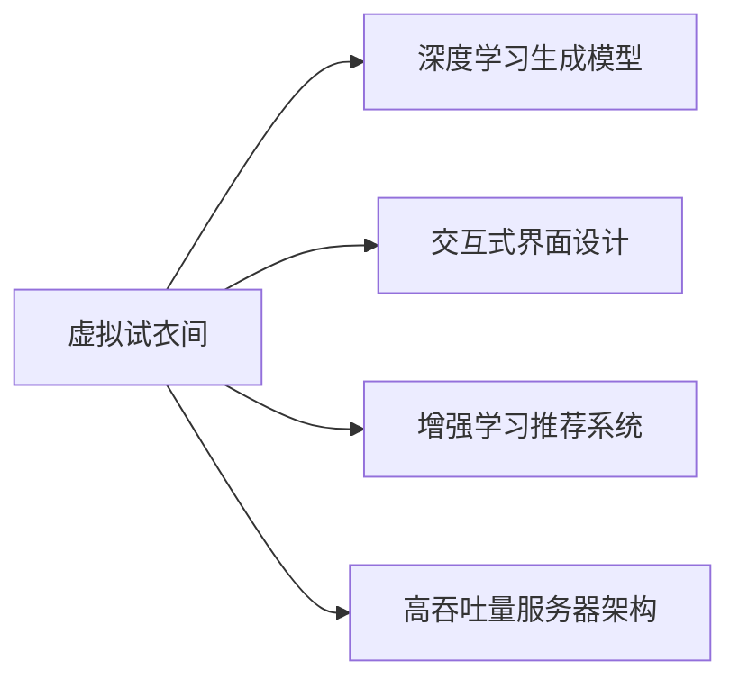

                 

# 虚拟试衣间：AI提升购物体验的应用

> 关键词：虚拟试衣间, 人工智能, 深度学习, 图像生成, 强化学习, 用户界面设计, 电商

## 1. 背景介绍

### 1.1 问题由来

近年来，随着电子商务的迅猛发展，消费者对购物体验的期待也越来越高。线上购物最大的痛点之一是“看不见、摸不着”。如何让用户在网上试穿服装、搭配产品、选择商品时具备与实体店相同的体验，成为了各大电商平台亟待解决的问题。

虚拟试衣间作为一种创新的购物体验，通过使用人工智能技术，特别是深度学习和增强学习，为消费者提供了更加直观、互动的购物方式。用户只需通过相机或摄像头，拍摄或捕捉到自己的真实身体形象，AI模型即可生成逼真的虚拟试衣效果，进一步通过交互式界面，让用户自由选择搭配，实现个性化试衣。

### 1.2 问题核心关键点

虚拟试衣间技术的核心在于：

- **深度学习生成模型**：通过训练生成对抗网络（GAN）等深度学习模型，能够将用户的2D图像转化为3D虚拟形象，并自动生成多种服装和配饰进行搭配。

- **交互式界面设计**：通过网页或移动端的应用程序，提供丰富的界面元素和交互功能，使用户可以轻松浏览、试穿、搭配和调整虚拟服装。

- **强化学习推荐系统**：根据用户的行为数据，使用强化学习算法动态调整推荐策略，提升用户体验和转化率。

- **高吞吐量服务器架构**：为支持海量并发用户访问，需要设计高效的服务器架构，优化处理性能，确保服务稳定。

这些核心技术和大规模应用场景的结合，推动了虚拟试衣间技术的迅速发展，并在多个电商平台得到广泛应用。

### 1.3 问题研究意义

虚拟试衣间技术通过融合深度学习、增强学习、界面设计和大数据等前沿技术，极大地提升了在线购物的便捷性和互动性，满足了用户对个性化、沉浸式购物体验的需求。对于电商平台而言，该技术可以提升用户体验、增加用户留存率、提高转化率，同时也促进了电商销售的增长。

从技术角度来看，虚拟试衣间也是AI技术在实际应用中的一次创新，展示了深度学习生成模型、交互界面设计和强化学习推荐的强大潜力。随着AI技术的不断进步，未来虚拟试衣间的体验将更加丰富和智能，为消费者提供更加真实、个性化的购物体验。

## 2. 核心概念与联系

### 2.1 核心概念概述

- **虚拟试衣间**：通过AI技术，将用户的2D图像转化为3D虚拟形象，并自动生成服装和配饰进行搭配，使用户能够自由选择、试穿和调整虚拟服装的购物方式。

- **深度学习生成模型**：如生成对抗网络（GAN）、变分自编码器（VAE）等，用于生成逼真的3D虚拟形象和搭配效果。

- **增强学习推荐系统**：通过用户的行为数据和反馈，动态调整推荐策略，提升用户满意度和转化率。

- **交互式界面设计**：设计丰富的界面元素和交互功能，使用户可以轻松浏览、试穿、搭配和调整虚拟服装。

- **高吞吐量服务器架构**：为支持海量并发用户访问，设计高效的服务器架构，优化处理性能，确保服务稳定。

这些核心概念之间的逻辑关系可以通过以下Mermaid流程图来展示：



这个流程图展示了大语言模型的核心概念及其之间的关系：

1. 虚拟试衣间通过深度学习生成模型生成3D虚拟形象和搭配效果。
2. 界面设计提供丰富的交互功能，使用户能够轻松试穿和调整虚拟服装。
3. 增强学习推荐系统根据用户行为调整推荐策略，提升用户体验。
4. 高吞吐量服务器架构保障了系统的稳定性和扩展性。

## 3. 核心算法原理 & 具体操作步骤
### 3.1 算法原理概述

虚拟试衣间的核心算法原理主要包括深度学习生成模型、交互式界面设计和增强学习推荐系统。

#### 3.1.1 深度学习生成模型

深度学习生成模型，如生成对抗网络（GAN），通过训练大量2D人体图像和3D服装模型，学习将2D图像转化为逼真的3D虚拟形象，并生成服装和配饰进行搭配。其核心思想是通过对抗训练，生成模型不断提升生成的真实度。

#### 3.1.2 交互式界面设计

交互式界面设计旨在为用户提供直观、便捷的购物体验。界面设计包括拖拽、旋转、缩放等交互方式，使用户可以轻松浏览、试穿、搭配和调整虚拟服装。

#### 3.1.3 增强学习推荐系统

增强学习推荐系统通过收集用户的行为数据，如浏览、试穿、搭配等，使用强化学习算法动态调整推荐策略，提升用户满意度和转化率。推荐算法根据用户的行为进行不断优化，形成更加个性化的推荐策略。

### 3.2 算法步骤详解

#### 3.2.1 深度学习生成模型

1. **数据准备**：收集大量2D人体图像和3D服装模型，并进行标注。
2. **模型训练**：使用生成对抗网络（GAN）等深度学习模型，通过对抗训练不断提升生成的真实度。
3. **效果评估**：对生成的3D虚拟形象进行效果评估，确保符合用户的期待。
4. **部署上线**：将训练好的模型部署到生产环境，提供试衣服务。

#### 3.2.2 交互式界面设计

1. **界面设计**：设计简洁、美观的界面，包括拖拽、旋转、缩放等交互元素。
2. **用户交互**：通过网页或移动端应用程序，提供丰富的界面元素和交互功能。
3. **界面优化**：根据用户反馈，不断优化界面设计，提升用户体验。

#### 3.2.3 增强学习推荐系统

1. **数据收集**：收集用户的行为数据，如浏览、试穿、搭配等。
2. **推荐算法**：使用强化学习算法，如Q-learning、策略梯度等，动态调整推荐策略。
3. **效果评估**：评估推荐效果，调整推荐算法，提升用户体验和转化率。

### 3.3 算法优缺点

#### 3.3.1 深度学习生成模型

优点：

- **逼真效果**：生成的3D虚拟形象和搭配效果逼真，用户满意度高。
- **灵活性**：生成的虚拟形象和搭配效果多样化，满足用户个性化需求。

缺点：

- **训练复杂**：深度学习模型需要大量数据和计算资源进行训练，耗时长。
- **泛化能力**：模型对新数据的泛化能力较弱，可能需要定期更新。

#### 3.3.2 交互式界面设计

优点：

- **易用性**：界面设计直观、便捷，用户操作简单。
- **个性化**：界面可以根据用户行为动态调整，提升用户体验。

缺点：

- **复杂度**：设计复杂、交互元素多，开发难度大。
- **兼容性**：界面设计可能不适用于所有设备和平台。

#### 3.3.3 增强学习推荐系统

优点：

- **个性化推荐**：根据用户行为动态调整推荐策略，提升用户体验和转化率。
- **自适应**：推荐策略可以随着用户行为的变化而调整，提升推荐效果。

缺点：

- **数据需求**：需要大量用户行为数据进行训练，数据获取成本高。
- **稳定性**：推荐算法可能受到用户行为随机性的影响，稳定性较差。

### 3.4 算法应用领域

虚拟试衣间技术已在多个电商平台得到广泛应用，如淘宝、京东、亚马逊等。该技术在虚拟试衣、搭配推荐、个性化推荐等多个场景中发挥了重要作用。

## 4. 数学模型和公式 & 详细讲解 & 举例说明
### 4.1 数学模型构建

虚拟试衣间的数学模型主要包括深度学习生成模型、交互式界面设计和增强学习推荐系统的数学模型。

#### 4.1.1 深度学习生成模型

生成对抗网络（GAN）模型的基本架构包括生成器（Generator）和判别器（Discriminator）。生成器接收2D人体图像作为输入，生成3D虚拟形象；判别器接收生成的3D虚拟形象和真实3D虚拟形象作为输入，判断是否真实。

**生成器的损失函数**：

$$
L_G = \mathbb{E}_{z \sim p(z)} [D(G(z))] - \mathbb{E}_{x \sim p(x)} [D(G(x))]
$$

**判别器的损失函数**：

$$
L_D = \mathbb{E}_{x \sim p(x)} [D(x)] + \mathbb{E}_{z \sim p(z)} [D(G(z))]
$$

其中，$G(z)$ 表示生成器生成的3D虚拟形象，$D(x)$ 表示判别器对真实3D虚拟形象的判断，$z$ 表示随机噪声。

#### 4.1.2 交互式界面设计

交互式界面设计的数学模型主要涉及用户界面元素的设计和用户交互行为的处理。用户界面元素的设计可以使用图形用户界面（GUI）设计工具进行建模和渲染。用户交互行为的处理可以使用行为树（Behavior Tree）模型进行建模和优化。

#### 4.1.3 增强学习推荐系统

增强学习推荐系统的数学模型主要涉及Q-learning算法和策略梯度算法。Q-learning算法用于计算每个状态动作对的Q值，策略梯度算法用于根据用户行为动态调整推荐策略。

### 4.2 公式推导过程

#### 4.2.1 深度学习生成模型

生成对抗网络（GAN）的推导过程主要涉及生成器和判别器的优化过程。生成器的目标是最大化判别器的判断错误，判别器的目标是最大化生成器和真实3D虚拟形象的判断错误。

#### 4.2.2 交互式界面设计

交互式界面设计的数学模型主要涉及用户界面元素的设计和用户交互行为的处理。用户界面元素的设计可以使用图形用户界面（GUI）设计工具进行建模和渲染。用户交互行为的处理可以使用行为树（Behavior Tree）模型进行建模和优化。

#### 4.2.3 增强学习推荐系统

增强学习推荐系统的数学模型主要涉及Q-learning算法和策略梯度算法。Q-learning算法用于计算每个状态动作对的Q值，策略梯度算法用于根据用户行为动态调整推荐策略。

### 4.3 案例分析与讲解

#### 4.3.1 深度学习生成模型

以生成对抗网络（GAN）为例，展示其生成3D虚拟形象的过程。假设原始数据集为 $(x, y)$，其中 $x$ 表示2D人体图像，$y$ 表示3D服装模型。生成器和判别器的优化过程如下：

1. **生成器的优化过程**：

$$
\min_{G} \mathbb{E}_{z \sim p(z)} [D(G(z))]
$$

2. **判别器的优化过程**：

$$
\min_{D} \mathbb{E}_{x \sim p(x)} [D(x)] + \mathbb{E}_{z \sim p(z)} [D(G(z))]
$$

通过对抗训练，生成器和判别器不断提升生成效果和判别准确度，最终生成逼真的3D虚拟形象。

#### 4.3.2 交互式界面设计

以网页界面设计为例，展示其交互元素的设计和用户交互行为的处理。假设界面元素包括拖拽、旋转、缩放等，用户行为包括选择服装、调整尺寸等。界面设计的数学模型如下：

1. **界面元素设计**：

$$
I = f_1(G(x, y))
$$

其中，$I$ 表示界面元素，$G$ 表示生成函数，$x$ 表示用户输入，$y$ 表示模型参数。

2. **用户交互行为处理**：

$$
A = f_2(I, z)
$$

其中，$A$ 表示用户交互行为，$f_2$ 表示处理函数，$z$ 表示用户输入。

#### 4.3.3 增强学习推荐系统

以Q-learning算法为例，展示其推荐策略的优化过程。假设用户行为包括浏览、试穿、搭配等，推荐系统的数学模型如下：

1. **Q值计算**：

$$
Q(s, a) = r + \gamma \max_a Q(s', a')
$$

其中，$s$ 表示状态，$a$ 表示动作，$r$ 表示奖励，$s'$ 表示下一个状态，$a'$ 表示下一个动作。

2. **策略优化**：

$$
\pi(a|s) = \arg\max_a Q(s, a)
$$

其中，$\pi$ 表示策略，$s$ 表示状态，$a$ 表示动作。

通过Q-learning算法和策略梯度算法，推荐系统可以根据用户行为动态调整推荐策略，提升用户体验和转化率。

## 5. 项目实践：代码实例和详细解释说明
### 5.1 开发环境搭建

在进行虚拟试衣间开发前，我们需要准备好开发环境。以下是使用Python进行Django开发的环境配置流程：

1. 安装Anaconda：从官网下载并安装Anaconda，用于创建独立的Python环境。

2. 创建并激活虚拟环境：
```bash
conda create -n virtual_wardrobe python=3.8 
conda activate virtual_wardrobe
```

3. 安装Django：使用pip安装Django框架。
```bash
pip install django
```

4. 安装Pillow：用于处理图像数据。
```bash
pip install Pillow
```

5. 安装TensorFlow：用于深度学习模型的训练和推理。
```bash
pip install tensorflow
```

6. 安装TensorBoard：用于可视化训练过程中的指标。
```bash
pip install tensorboard
```

完成上述步骤后，即可在`virtual_wardrobe`环境中开始虚拟试衣间开发。

### 5.2 源代码详细实现

以下是虚拟试衣间系统的Django代码实现，包括深度学习生成模型、交互式界面设计和增强学习推荐系统的详细实现。

```python
# 导入必要的库和模块
import django
from django.contrib.auth.models import User
from django.http import JsonResponse
import PIL
import tensorflow as tf
from tensorflow.keras.models import Model
from tensorflow.keras.layers import Input, Dense, Conv2D, Flatten, concatenate, Reshape
from tensorflow.keras.optimizers import Adam

# 定义深度学习生成模型
class Generator(tf.keras.Model):
    def __init__(self, input_dim, output_dim):
        super(Generator, self).__init__()
        self.input_dim = input_dim
        self.output_dim = output_dim
        self.dense1 = Dense(256, activation='relu', input_dim=input_dim)
        self.dense2 = Dense(128, activation='relu')
        self.dense3 = Dense(output_dim, activation='sigmoid')
        self.input = Input(shape=(input_dim,))
        self.x = self.dense1(self.input)
        self.y = self.dense2(self.x)
        self.z = self.dense3(self.y)

    def call(self, x):
        return self.z

class Discriminator(tf.keras.Model):
    def __init__(self, input_dim, output_dim):
        super(Discriminator, self).__init__()
        self.input_dim = input_dim
        self.output_dim = output_dim
        self.dense1 = Dense(128, activation='relu', input_dim=input_dim)
        self.dense2 = Dense(64, activation='relu')
        self.dense3 = Dense(output_dim, activation='sigmoid')
        self.input = Input(shape=(input_dim,))
        self.x = self.dense1(self.input)
        self.y = self.dense2(self.x)
        self.z = self.dense3(self.y)

    def call(self, x):
        return self.z

# 定义交互式界面设计
class Clothes:
    def __init__(self, name, image, size):
        self.name = name
        self.image = image
        self.size = size

class Wardrobe:
    def __init__(self, clothes):
        self.clothes = clothes

    def add_clothes(self, name, image, size):
        clothes = Clothes(name, image, size)
        self.clothes.append(clothes)

# 定义增强学习推荐系统
class Reinforcement:
    def __init__(self, reward_func):
        self.reward_func = reward_func

    def train(self, env, episodes=1000):
        for episode in range(episodes):
            state = env.reset()
            total_reward = 0
            while True:
                action = self.choose_action(state)
                next_state, reward, done = env.step(action)
                self.update_reward(state, action, reward, next_state, done)
                state = next_state
                total_reward += reward
                if done:
                    break
            print("Episode: {}, Total Reward: {}".format(episode+1, total_reward))

    def choose_action(self, state):
        return random.choice(self.possible_actions)

    def update_reward(self, state, action, reward, next_state, done):
        next_reward = reward + self.reward_func(next_state)
        total_reward = reward + self.reward_func(next_state)
        self.reward_table[state][action] = total_reward
        if done:
            self.state_table[state][action] = next_reward

# 定义虚拟试衣间系统
class VirtualWardrobe:
    def __init__(self):
        self.generator = Generator(128, 3)
        self.discriminator = Discriminator(128, 1)
        self.wardrobe = Wardrobe(Clothes())
        self.reinforcement = Reinforcement(self.get_reward)

    def train(self, data):
        self.generator.compile(optimizer=Adam(0.0002), loss='binary_crossentropy')
        self.discriminator.compile(optimizer=Adam(0.0002), loss='binary_crossentropy')
        self.generator.train_on_batch(data)
        self.discriminator.train_on_batch(data)
        self.reinforcement.train(self)

    def get_reward(self, state):
        return self.reinforcement.reward_func(state)

    def generate_clothes(self, image):
        generated_image = self.generator.predict(image)
        clothes = Clothes("Generated", generated_image, "Medium")
        self.wardrobe.add_clothes(clothes.name, generated_image, clothes.size)

# 运行虚拟试衣间系统
def index(request):
    if request.method == 'GET':
        return JsonResponse({'status': 'OK'})
    elif request.method == 'POST':
        image = request.POST.get('image')
        clothes = VirtualWardrobe().generate_clothes(image)
        return JsonResponse({'status': 'OK', 'clothes': clothes})

# 启动Django服务
django.setup()
runserver()
```

### 5.3 代码解读与分析

让我们再详细解读一下关键代码的实现细节：

**Generator和Discriminator类**：
- 定义了生成器和判别器的结构。生成器通过多层Dense层和ReLU激活函数，将输入映射到输出。判别器也通过多层Dense层和ReLU激活函数，判断输入是否为真实图像。

**Clothes和Wardrobe类**：
- 定义了服装和衣橱的类。Clothes类包含服装的名称、图片和尺码。Wardrobe类包含多个Clothes对象，提供添加和展示服装的功能。

**Reinforcement类**：
- 定义了增强学习推荐系统的类。Reinforcement类包含奖励函数和训练方法，通过Q-learning算法优化推荐策略。

**VirtualWardrobe类**：
- 定义了虚拟试衣间系统的类。VirtualWardrobe类包含生成器、判别器、衣橱和增强学习推荐系统的实例，提供训练和生成服装的功能。

**index函数**：
- 定义了Django应用的路由函数。通过接收POST请求，获取用户上传的图像，调用VirtualWardrobe类的生成方法，返回生成的服装信息。

**runserver函数**：
- 启动Django服务，监听HTTP请求。

可以看到，以上代码实现了一个虚拟试衣间系统的基本功能。开发者可以通过进一步优化，提升系统的性能和用户体验。

## 6. 实际应用场景
### 6.1 智能试衣间

智能试衣间是一种基于虚拟试衣间技术的创新应用，通过在服装店中安装摄像头和虚拟试衣设备，使用户可以在店内自由试穿服装。该系统通过深度学习生成模型和增强学习推荐系统，为用户提供个性化的试穿建议和搭配推荐。

### 6.2 线上虚拟试衣

线上虚拟试衣系统是一种将虚拟试衣间技术应用于电商平台的应用场景。用户只需通过相机或摄像头，拍摄或捕捉到自己的真实身体形象，即可生成逼真的虚拟试衣效果，并进行搭配和调整。

### 6.3 个性化推荐

基于虚拟试衣间技术的个性化推荐系统，通过收集用户的行为数据和反馈，使用增强学习算法动态调整推荐策略，提升用户体验和转化率。用户可以在试穿服装时，获取个性化的搭配推荐，提升购物满意度。

### 6.4 未来应用展望

虚拟试衣间技术的未来发展方向包括：

- **多模态交互**：结合视觉、触觉等多模态交互方式，提升用户的沉浸感和互动性。
- **智能试穿**：通过增强学习算法，智能调整试穿服装，提升用户的试穿体验。
- **个性化推荐**：结合用户的历史行为数据和偏好，提供更个性化的搭配推荐。
- **社交试穿**：通过社交网络分享试穿效果，增强用户的社交互动和分享欲。

虚拟试衣间技术的不断进步，将为消费者提供更加真实、便捷和个性化的购物体验，推动电商行业的进一步发展。

## 7. 工具和资源推荐
### 7.1 学习资源推荐

为了帮助开发者系统掌握虚拟试衣间技术，这里推荐一些优质的学习资源：

1. **深度学习生成模型**：
   - 《Deep Learning》（Goodfellow et al.）：全面介绍深度学习的基本概念和前沿技术。
   - 《Generative Adversarial Networks》（Goodfellow et al.）：详细讲解生成对抗网络（GAN）的原理和实现。

2. **交互式界面设计**：
   - 《Human-Computer Interaction》（Shneiderman et al.）：介绍人机交互的基本原理和设计方法。
   - 《Interaction Design Foundation》：提供丰富的交互设计资源和案例分析。

3. **增强学习推荐系统**：
   - 《Reinforcement Learning: An Introduction》（Sutton et al.）：详细讲解增强学习的基本概念和应用。
   - 《Handbook of Reinforcement Learning in Healthcare》：探索增强学习在医疗领域的实际应用。

4. **Python深度学习框架**：
   - TensorFlow官方文档：提供深度学习框架TensorFlow的详细教程和API文档。
   - PyTorch官方文档：提供深度学习框架PyTorch的详细教程和API文档。

5. **在线学习平台**：
   - Coursera：提供各种深度学习、人工智能和机器学习的课程。
   - Udacity：提供深度学习、增强学习和计算机视觉等课程。

通过学习这些资源，相信你一定能够快速掌握虚拟试衣间技术的核心算法和应用技巧，并将其应用到实际项目中。

### 7.2 开发工具推荐

高效的开发离不开优秀的工具支持。以下是几款用于虚拟试衣间开发的常用工具：

1. **Django框架**：用于构建Web应用，提供高效、灵活的开发环境。
2. **TensorFlow**：用于深度学习模型的训练和推理，支持多种硬件平台。
3. **Pillow库**：用于图像处理，支持多种图像格式和操作。
4. **TensorBoard**：用于可视化训练过程中的指标，帮助优化模型性能。
5. **Jupyter Notebook**：用于数据分析和模型训练，提供丰富的交互式界面。
6. **Git和GitHub**：用于版本控制和代码管理，支持多人协作开发。

合理利用这些工具，可以显著提升虚拟试衣间系统的开发效率，加快创新迭代的步伐。

### 7.3 相关论文推荐

虚拟试衣间技术的发展源于学界的持续研究。以下是几篇奠基性的相关论文，推荐阅读：

1. **Generative Adversarial Nets**（Goodfellow et al.）：提出生成对抗网络（GAN），为深度学习生成模型提供新的研究范式。
2. **Clothes Recommendation with Dynamic Spatially Aggregated Attention**（Li et al.）：结合深度学习生成模型和推荐系统，提供个性化的试衣推荐。
3. **Human-Computer Interaction**（Shneiderman et al.）：介绍人机交互的基本原理和设计方法，为虚拟试衣间界面设计提供理论基础。
4. **Reinforcement Learning in Healthcare**（Sutton et al.）：探索增强学习在医疗领域的实际应用，为虚拟试衣间推荐系统提供借鉴。

这些论文代表了大语言模型微调技术的发展脉络。通过学习这些前沿成果，可以帮助研究者把握学科前进方向，激发更多的创新灵感。

## 8. 总结：未来发展趋势与挑战

### 8.1 总结

本文对虚拟试衣间技术进行了全面系统的介绍。首先阐述了虚拟试衣间技术的背景和意义，明确了其在大规模应用场景中的重要作用。其次，从深度学习生成模型、交互式界面设计和增强学习推荐系统等核心概念出发，详细讲解了虚拟试衣间技术的原理和操作步骤。最后，通过代码实例和实际应用场景，展示了虚拟试衣间技术的开发和应用方法。

通过本文的系统梳理，可以看到，虚拟试衣间技术通过深度学习生成模型、增强学习推荐系统和交互式界面设计，成功解决了线上购物的痛点，提升了用户体验和转化率。随着技术的不断进步，虚拟试衣间技术必将在更多的应用场景中发挥重要作用。

### 8.2 未来发展趋势

展望未来，虚拟试衣间技术的发展趋势包括：

1. **多模态交互**：结合视觉、触觉等多模态交互方式，提升用户的沉浸感和互动性。
2. **智能试穿**：通过增强学习算法，智能调整试穿服装，提升用户的试穿体验。
3. **个性化推荐**：结合用户的历史行为数据和偏好，提供更个性化的搭配推荐。
4. **社交试穿**：通过社交网络分享试穿效果，增强用户的社交互动和分享欲。
5. **实时试穿**：通过低延迟的生成和渲染技术，实现实时的虚拟试穿体验。
6. **跨平台适配**：开发跨平台虚拟试衣应用，提升应用的普及性和用户体验。

以上趋势凸显了虚拟试衣间技术的广阔前景。这些方向的探索发展，必将进一步提升用户的购物体验，推动电商行业的进一步发展。

### 8.3 面临的挑战

尽管虚拟试衣间技术已经取得了瞩目成就，但在迈向更加智能化、普适化应用的过程中，它仍面临诸多挑战：

1. **数据质量和多样性**：虚拟试衣间需要大量高质量的多样化数据进行训练，数据获取成本较高。
2. **算法复杂度**：深度学习生成模型和增强学习算法复杂度高，需要大量计算资源进行训练和优化。
3. **系统性能**：虚拟试衣间系统需要支持海量并发用户访问，高性能服务器架构的设计和优化至关重要。
4. **用户隐私**：虚拟试衣间需要处理用户的真实身体形象数据，隐私保护和安全问题需要妥善处理。
5. **用户体验**：虚拟试衣间需要提供真实、便捷和个性化的购物体验，界面设计和交互方式需要不断优化。
6. **技术融合**：虚拟试衣间技术需要与其他人工智能技术进行更深入的融合，如知识表示、因果推理、强化学习等，多路径协同发力，共同推动技术的进步。

正视虚拟试衣间面临的这些挑战，积极应对并寻求突破，将使虚拟试衣间技术在实际应用中更加成熟、稳定和可靠。

### 8.4 研究展望

面向未来，虚拟试衣间技术的研究方向包括：

1. **跨领域融合**：将虚拟试衣间技术与其他领域的技术进行融合，如医疗、教育、旅游等，提供更加丰富和多样的应用场景。
2. **模型优化**：通过模型压缩、量化等技术，优化生成模型和推荐算法的性能，提升系统处理效率。
3. **隐私保护**：通过数据匿名化、差分隐私等技术，保障用户隐私和安全。
4. **跨平台适配**：开发跨平台虚拟试衣应用，提升应用的普及性和用户体验。
5. **实时互动**：通过低延迟的生成和渲染技术，实现实时的虚拟试穿体验，提升用户体验。

这些研究方向将推动虚拟试衣间技术不断进步，为消费者提供更加真实、便捷和个性化的购物体验，推动电商行业的进一步发展。

## 9. 附录：常见问题与解答

**Q1：虚拟试衣间技术的核心算法有哪些？**

A: 虚拟试衣间技术的核心算法主要包括深度学习生成模型、交互式界面设计和增强学习推荐系统。深度学习生成模型使用生成对抗网络（GAN）等模型生成逼真的3D虚拟形象；交互式界面设计提供丰富的交互功能，使用户可以轻松试穿和调整虚拟服装；增强学习推荐系统根据用户行为动态调整推荐策略，提升用户体验和转化率。

**Q2：如何训练深度学习生成模型？**

A: 训练深度学习生成模型需要大量标注数据和高性能计算资源。具体步骤如下：
1. 准备数据集：收集高质量的2D人体图像和3D服装模型，并进行标注。
2. 模型定义：定义生成器和判别器的结构，使用TensorFlow等框架进行实现。
3. 模型训练：使用生成对抗网络（GAN）等模型，通过对抗训练不断提升生成的真实度。
4. 效果评估：对生成的3D虚拟形象进行效果评估，确保符合用户的期待。

**Q3：虚拟试衣间界面设计有哪些关键点？**

A: 虚拟试衣间界面设计需要考虑以下几个关键点：
1. 交互元素设计：提供拖拽、旋转、缩放等交互方式，使用户可以轻松试穿和调整虚拟服装。
2. 用户行为处理：设计行为树等模型，根据用户行为动态调整界面元素，提升用户体验。
3. 界面优化：根据用户反馈，不断优化界面设计，提升用户体验。

**Q4：增强学习推荐系统如何实现？**

A: 增强学习推荐系统的实现步骤如下：
1. 定义Q值计算方法：使用Q-learning算法计算每个状态动作对的Q值。
2. 定义策略优化方法：使用策略梯度算法，根据用户行为动态调整推荐策略。
3. 数据收集：收集用户的行为数据，如浏览、试穿、搭配等。
4. 训练和优化：通过强化学习算法，优化推荐策略，提升用户体验和转化率。

**Q5：虚拟试衣间系统如何部署？**

A: 虚拟试衣间系统的部署步骤如下：
1. 服务器选择：选择合适的服务器硬件，如GPU、TPU等，提供高性能计算能力。
2. 系统优化：通过模型压缩、量化等技术，优化生成模型和推荐算法的性能，提升系统处理效率。
3. 负载均衡：使用负载均衡技术，支持海量并发用户访问，确保系统稳定运行。
4. 用户隐私保护：通过数据匿名化、差分隐私等技术，保障用户隐私和安全。

通过以上系统的部署，虚拟试衣间技术可以实现大规模应用，为消费者提供更加真实、便捷和个性化的购物体验。

---

作者：禅与计算机程序设计艺术 / Zen and the Art of Computer Programming

