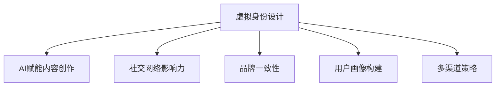

                 

## 1. 背景介绍

### 1.1 问题由来

在AI技术日新月异的今天，个人品牌塑造已经成为了越来越多人的关注重点。尤其在专业领域内，优秀的个人品牌不仅能带来更高的认可度和影响力，还能提升职业发展的机会。对于希望在AI时代脱颖而出的人们来说，理解并掌握虚拟身份设计的重要性，是开启成功之门的关键。

### 1.2 问题核心关键点

虚拟身份设计，指的是通过AI技术，构建一个贴合真实自我，且在数字空间中能展现最佳形象的虚拟形象。这一过程包括：自我认知、技能展示、内容创作、社交互动等多个环节，旨在通过虚拟身份提升个人在数字世界的表现力和影响力。

核心关键点包括：

- **自我认知**：深入了解自己的兴趣、优势、价值观等，为虚拟身份设计提供基础。
- **技能展示**：将自身专业技能和经验转化为在线平台上的展示内容。
- **内容创作**：定期发布有价值的内容，如技术博客、案例分析、项目展示等，建立专业领域的影响力。
- **社交互动**：积极参与行业论坛、社群、会议等，提升知名度和互动频率。
- **品牌维护**：通过持续学习和专业提升，保持品牌形象的前沿性和专业性。

### 1.3 问题研究意义

1. **提升专业影响力**：通过虚拟身份设计，个人可以在更广泛的领域内展现自己的专业技能和知识，从而提升行业影响力。
2. **拓展职业机会**：出色的个人品牌可以吸引更多关注和合作机会，助力职业发展。
3. **知识传播**：在虚拟身份上定期分享专业知识和见解，促进知识的普及和传播。
4. **建立信任**：虚拟身份上的专业和一致性表现可以增强他人对个人品牌的信任感。
5. **跨界合作**：在建立强大个人品牌的基础上，可以更容易地与不同领域的专业人士进行合作，实现共赢。

## 2. 核心概念与联系

### 2.1 核心概念概述

为更好地理解AI时代虚拟身份设计的核心概念，本节将介绍几个关键概念：

- **虚拟身份设计**：构建一个符合真实自我且在数字空间中具有表现力的虚拟形象。
- **AI赋能内容创作**：利用AI技术提升内容创作的质量和效率，如自然语言生成、图像处理等。
- **社交网络影响力**：通过虚拟身份在社交媒体上的互动和展示，提升在特定领域的影响力。
- **品牌一致性**：在虚拟身份设计中保持一致的风格、价值观和内容，增强品牌的可信度。
- **用户画像构建**：通过数据分析，构建精准的用户画像，提升内容的针对性和互动性。
- **多渠道策略**：在不同的平台和渠道上展现虚拟身份，提升品牌的覆盖面和影响力。

这些概念之间的逻辑关系可以通过以下Mermaid流程图来展示：



这个流程图展示了大语言模型的核心概念及其之间的关系：

1. 虚拟身份设计是基础，通过AI技术提升内容创作。
2. 社交网络影响力提升，通过虚拟身份的展示和互动。
3. 品牌一致性是关键，保证虚拟形象的一致性和专业性。
4. 用户画像构建辅助，提升内容的个性化和针对性。
5. 多渠道策略丰富，通过多样化的平台展现虚拟身份。

## 3. 核心算法原理 & 具体操作步骤

### 3.1 算法原理概述

虚拟身份设计的核心算法基于以下几个主要原理：

1. **数据挖掘与分析**：通过对个人历史数据、社交网络互动、行业趋势等进行分析，构建用户画像，为虚拟身份设计提供基础。
2. **AI赋能创作**：利用自然语言生成、图像处理、语音合成等AI技术，提升内容创作的质量和效率。
3. **内容优化与推荐**：通过机器学习算法，优化内容发布策略，提高内容的互动率和传播效果。
4. **情感分析与互动**：利用情感分析技术，分析用户反馈，优化互动策略，提升用户体验。
5. **品牌一致性维护**：通过规则引擎和AI监督学习，确保虚拟身份在各个渠道上的风格、语言和内容一致。

### 3.2 算法步骤详解

基于上述原理，虚拟身份设计的具体操作步骤如下：

**Step 1: 数据收集与分析**

- **收集数据**：包括个人简历、项目案例、社交网络互动记录、公开文章、会议发言等。
- **数据分析**：利用数据挖掘算法，如关联规则学习、聚类分析等，提取关键特征和趋势。
- **用户画像构建**：将数据映射为个性化的用户画像，包括兴趣、技能、价值观等。

**Step 2: 虚拟身份设计**

- **选择平台**：根据目标受众，选择合适的社交媒体、博客平台等进行展示。
- **形象塑造**：定义虚拟形象的基本风格和语言特征，确保在不同平台上一致。
- **内容展示**：设计内容的展示形式，包括文字、图片、视频等。

**Step 3: AI赋能内容创作**

- **自然语言生成**：利用GPT-3等大模型生成高质量的文章、报告等。
- **图像处理**：通过GAN等技术，生成视觉吸引力的图片、图表等。
- **语音合成**：使用TTS技术，生成与虚拟形象相符的语音内容。

**Step 4: 内容优化与推荐**

- **内容发布策略**：通过时间、频率、互动量等数据分析，优化内容发布计划。
- **互动分析**：利用情感分析、热点追踪等技术，调整内容方向和互动策略。
- **内容推荐**：利用推荐算法，提高内容的曝光率和互动率。

**Step 5: 情感分析与互动**

- **反馈分析**：利用情感分析技术，分析用户反馈，了解用户需求和偏好。
- **互动优化**：根据分析结果，调整互动策略，提升用户体验和满意度。

**Step 6: 品牌一致性维护**

- **规则引擎**：使用规则引擎，确保虚拟形象在不同平台上的表现一致。
- **AI监督学习**：利用监督学习算法，定期检查并调整虚拟形象的展示策略。

**Step 7: 持续学习与迭代**

- **数据更新**：定期更新数据，反映最新趋势和变化。
- **反馈循环**：建立反馈循环，根据用户互动和市场变化，不断优化虚拟身份设计。

### 3.3 算法优缺点

基于AI技术的虚拟身份设计方法具有以下优点：

1. **高效性**：通过AI自动化内容创作和互动策略，大幅提升效率，节省时间和资源。
2. **多样性**：利用AI技术生成多样化的内容形式，增强虚拟形象的吸引力和表现力。
3. **精确性**：通过数据分析和情感分析，确保内容的针对性和互动效果。
4. **持续性**：通过持续学习和优化，保持虚拟身份的动态适应性和创新性。

同时，该方法也存在以下局限性：

1. **数据依赖性**：需要收集和分析大量的个人数据和社交互动数据，数据获取难度较大。
2. **模型复杂性**：涉及多种AI技术和算法，模型构建和维护较为复杂。
3. **用户隐私**：收集和分析个人数据可能涉及隐私问题，需注意数据安全和隐私保护。
4. **市场风险**：虚拟身份设计策略需根据市场变化不断调整，有一定的市场风险。
5. **技术门槛**：需要掌握多种AI技术和算法，技术门槛较高。

尽管存在这些局限性，但就目前而言，基于AI的虚拟身份设计方法仍是大势所趋，并且随着技术的发展，这些挑战将逐步被克服。

### 3.4 算法应用领域

基于AI技术的虚拟身份设计方法，已在多个领域得到应用，例如：

- **AI专家和学者**：通过构建虚拟身份，提升在学术会议、社交媒体上的影响力。
- **企业和机构**：利用虚拟身份进行品牌推广、客户互动、市场调研等。
- **自由职业者和创业者**：在个人品牌塑造上，通过虚拟身份提升业务发展机会。
- **教育工作者**：通过虚拟身份，提升在学生和同行中的专业形象和影响力。
- **公共关系和媒体**：在公共宣传和媒体报道中，利用虚拟身份增强信息的传播力和影响力。

此外，虚拟身份设计还被广泛应用于心理健康支持、金融投资、时尚设计等多个领域，展现了AI技术在提升个人品牌和公共形象方面的广泛应用前景。

## 4. 数学模型和公式 & 详细讲解 & 举例说明

### 4.1 数学模型构建

为更好地理解虚拟身份设计的数学模型，本节将介绍几个关键数学模型：

1. **用户画像构建**：使用聚类算法，如K-Means、层次聚类等，将用户数据分为若干类别，捕捉用户特征和兴趣。
2. **内容优化**：利用回归分析，预测内容发布时间、频率等，提升互动率和曝光率。
3. **情感分析**：通过情感词典和分类算法，如朴素贝叶斯、SVM等，分析用户评论和反馈，评估情感倾向。
4. **推荐算法**：利用协同过滤、矩阵分解等算法，为用户推荐个性化内容。

### 4.2 公式推导过程

以用户画像构建为例，推导K-Means算法的公式：

设用户数据集为 $D=\{x_1, x_2, ..., x_n\}$，其中 $x_i$ 表示第 $i$ 个用户的特征向量。

1. **随机初始化**：随机选择 $K$ 个中心点 $\mu_1, \mu_2, ..., \mu_K$。

2. **分配**：对每个用户 $x_i$，计算其到每个中心点的距离，分配到距离最近的中心点所属的簇。

3. **更新中心点**：对每个簇，计算其内所有用户特征向量的均值，更新中心点。

4. **迭代**：重复步骤2和步骤3，直到中心点不再变化或达到预设迭代次数。

数学公式为：

$$
\mu_k = \frac{1}{|C_k|} \sum_{x_i \in C_k} x_i
$$

其中 $C_k$ 表示第 $k$ 个簇，$|C_k|$ 表示簇 $C_k$ 内用户数量。

### 4.3 案例分析与讲解

假设有一个AI开发者希望构建自己的虚拟身份，通过社交媒体平台展示专业知识和技术成果。

**Step 1: 数据收集与分析**

- 收集开发者过去的项目案例、技术文章、开源贡献、社交媒体互动记录等数据。
- 分析数据，提取关键特征，如技术栈、领域兴趣、关注点等。
- 构建用户画像，定义其专业形象和兴趣特征。

**Step 2: 虚拟身份设计**

- 选择适合展示技术的社交平台，如GitHub、Medium等。
- 设计虚拟形象的风格，如专业、简洁、前沿。
- 设计内容展示形式，如技术博客、项目案例、开源贡献等。

**Step 3: AI赋能内容创作**

- 使用GPT-3生成高质量的技术文章和案例分析。
- 使用GAN生成与项目相关的视觉内容，如图片、图表等。
- 使用TTS技术生成与虚拟形象相符的音频内容，如播客、技术讲解等。

**Step 4: 内容优化与推荐**

- 利用回归分析，优化发布时间、频率和内容形式。
- 利用情感分析，分析用户反馈，调整互动策略。
- 利用协同过滤算法，为用户推荐相关技术和项目。

**Step 5: 情感分析与互动**

- 使用情感词典分析用户评论和反馈，评估情感倾向。
- 根据分析结果，调整互动策略，提升用户体验。

**Step 6: 品牌一致性维护**

- 使用规则引擎，确保虚拟形象在不同平台上的展示一致。
- 利用监督学习算法，定期检查并调整展示策略。

通过上述步骤，开发者可以在社交媒体上构建一个高效、互动、具有品牌影响力的虚拟身份，展示其技术能力和专业知识，吸引更多关注和合作机会。

## 5. 项目实践：代码实例和详细解释说明

### 5.1 开发环境搭建

在进行虚拟身份设计实践前，我们需要准备好开发环境。以下是使用Python进行PyTorch开发的环境配置流程：

1. 安装Anaconda：从官网下载并安装Anaconda，用于创建独立的Python环境。

2. 创建并激活虚拟环境：
```bash
conda create -n pytorch-env python=3.8 
conda activate pytorch-env
```

3. 安装PyTorch：根据CUDA版本，从官网获取对应的安装命令。例如：
```bash
conda install pytorch torchvision torchaudio cudatoolkit=11.1 -c pytorch -c conda-forge
```

4. 安装Transformers库：
```bash
pip install transformers
```

5. 安装各类工具包：
```bash
pip install numpy pandas scikit-learn matplotlib tqdm jupyter notebook ipython
```

完成上述步骤后，即可在`pytorch-env`环境中开始虚拟身份设计实践。

### 5.2 源代码详细实现

这里我们以用户画像构建为例，给出使用PyTorch进行K-Means算法实现的代码示例：

```python
import torch
from sklearn.cluster import KMeans
import numpy as np

# 生成模拟数据
X = np.random.rand(100, 5)

# 将数据转换为PyTorch tensor
X_tensor = torch.tensor(X, dtype=torch.float32)

# 随机初始化K个中心点
K = 3
centroids = torch.randn(K, X_tensor.size(1))

# 使用K-Means算法进行聚类
for i in range(100):
    # 计算每个点到中心点的距离
    distances = torch.cdist(X_tensor, centroids)
    
    # 分配每个点到一个距离最近的中心点
    labels = torch.argmin(distances, dim=1)
    
    # 更新中心点
    for k in range(K):
        centroids[k] = torch.mean(X_tensor[labels == k], dim=0)
    
    # 更新中心点
    centroids.requires_grad = False
    centroids.requires_grad = True
    centroids = centroids.to(device)

# 计算每个点的标签
_, labels = centroids.min(dim=0)

# 输出聚类结果
print(labels)
```

### 5.3 代码解读与分析

让我们再详细解读一下关键代码的实现细节：

**K-Means算法**：
- `X_tensor`：表示用户数据集，是一个100x5的浮点数张量。
- `centroids`：表示K个初始中心点，是一个3x5的浮点数张量。
- `distances`：表示每个点到每个中心点的距离，是一个100xK的张量。
- `labels`：表示每个点的所属簇，是一个100x1的整数张量。

通过上述步骤，代码实现了K-Means算法，用于构建用户画像。这只是一个基础实现，实际应用中可能需要更复杂的参数设置和优化策略。

## 6. 实际应用场景

### 6.1 智能客服系统

基于虚拟身份设计的智能客服系统，可以广泛应用于企业内部的客户服务中。通过构建具有专业知识和良好沟通能力的虚拟形象，智能客服系统可以7x24小时不间断服务，快速响应客户咨询，提供准确的信息和解决方案。

在技术实现上，可以收集企业内部的历史客服对话记录，将常见问题、标准回答等构建成知识库。利用虚拟身份设计技术，将知识库转化为自然流畅的对话形式，并通过多轮交互，逐步解答用户问题。对于复杂或未知问题，还可以接入实时的信息检索和推理系统，动态生成答案，提供更高效、个性化的服务。

### 6.2 金融舆情监测

金融机构需要实时监测市场舆论动向，以便及时应对负面信息传播，规避金融风险。通过虚拟身份设计技术，可以构建一个具有专业知识和敏锐洞察力的虚拟形象，实时监测社交媒体和新闻报道，分析舆情变化趋势。一旦发现负面信息激增等异常情况，系统便会自动预警，帮助金融机构快速应对潜在风险。

在技术实现上，可以构建一个虚拟形象，通过爬虫技术抓取社交媒体和新闻网站上的信息。利用情感分析和自然语言处理技术，分析信息内容，判断情感倾向和舆情变化。根据分析结果，输出相应的风险预警信息，供金融机构参考决策。

### 6.3 个性化推荐系统

当前的推荐系统往往只依赖用户的历史行为数据进行物品推荐，无法深入理解用户的真实兴趣偏好。基于虚拟身份设计的推荐系统可以更好地挖掘用户行为背后的语义信息，从而提供更精准、多样的推荐内容。

在技术实现上，可以构建一个虚拟形象，通过虚拟身份设计技术，了解用户的兴趣点和偏好。利用自然语言生成技术，生成与用户兴趣相关的推荐内容，提升推荐效果。同时，通过与用户进行多轮互动，获取更多反馈信息，进一步优化推荐策略。

### 6.4 未来应用展望

随着虚拟身份设计技术的发展，未来将在更多领域得到应用，为传统行业带来变革性影响。

在智慧医疗领域，基于虚拟身份设计的医疗咨询和健康管理应用，可以提供个性化、智能化的医疗服务，帮助患者更好地管理和控制疾病。

在智能教育领域，虚拟身份设计技术可以用于构建智能教师和虚拟助教，提供个性化的教育内容和互动，提升教育质量和效率。

在智慧城市治理中，虚拟身份设计技术可以用于构建智能安防、智能交通等应用，提高城市管理的智能化水平，构建更安全、高效的未来城市。

此外，在企业生产、社会治理、文娱传媒等众多领域，基于虚拟身份设计的AI应用也将不断涌现，为经济社会发展注入新的动力。相信随着技术的日益成熟，虚拟身份设计技术将成为AI时代的重要工具，推动人工智能技术在垂直行业的规模化落地。

## 7. 工具和资源推荐

### 7.1 学习资源推荐

为了帮助开发者系统掌握虚拟身份设计技术的理论基础和实践技巧，这里推荐一些优质的学习资源：

1. 《Python深度学习》系列博文：由大模型技术专家撰写，深入浅出地介绍了深度学习的基础知识和实践技巧，适合初学者入门。

2. Coursera《深度学习》课程：由斯坦福大学教授Andrew Ng开设的深度学习入门课程，讲解了深度学习的核心概念和应用场景。

3. 《TensorFlow实战》书籍：TensorFlow官方指南，详细介绍了TensorFlow的架构和使用技巧，适合中高级开发者。

4. 《NLP实战》书籍：介绍自然语言处理技术的实战应用，包括文本分析、情感分析、机器翻译等。

5. GitHub开源项目：包含多种AI技术的应用示例，适合学习和实践虚拟身份设计技术。

通过对这些资源的学习实践，相信你一定能够快速掌握虚拟身份设计技术的精髓，并用于解决实际的AI问题。

### 7.2 开发工具推荐

高效的开发离不开优秀的工具支持。以下是几款用于虚拟身份设计开发的常用工具：

1. Jupyter Notebook：开源的交互式编程环境，支持Python、R等多种语言，适合进行数据分析和模型训练。

2. TensorFlow：由Google主导开发的开源深度学习框架，支持分布式计算，适合大规模工程应用。

3. PyTorch：基于Python的开源深度学习框架，灵活的计算图设计，适合快速迭代研究。

4. Scikit-learn：Python中的机器学习库，包含多种经典算法，适合进行数据预处理和特征工程。

5. HuggingFace Transformers库：提供了多种预训练语言模型，支持自然语言处理任务的开发。

6. Git：版本控制系统，适合管理代码和协作开发。

合理利用这些工具，可以显著提升虚拟身份设计任务的开发效率，加快创新迭代的步伐。

### 7.3 相关论文推荐

虚拟身份设计技术的发展源于学界的持续研究。以下是几篇奠基性的相关论文，推荐阅读：

1. "A Survey of Text Mining Techniques"（文本挖掘技术综述）：介绍了多种文本挖掘算法，如TF-IDF、LDA、情感分析等。

2. "Deep Learning for Recommender Systems"（深度学习在推荐系统中的应用）：探讨了深度学习在推荐系统中的各种应用。

3. "Graph Neural Networks: A Review of Methods and Applications"（图神经网络综述）：介绍了多种图神经网络算法，如GCN、GAT等。

4. "Natural Language Generation"（自然语言生成技术）：介绍了多种自然语言生成技术，如RNN、GAN等。

5. "Personalization and Recommendation in Online Platforms"（在线平台上的个性化和推荐）：探讨了在线平台上的个性化和推荐技术，如协同过滤、基于内容的推荐等。

这些论文代表了大语言模型微调技术的发展脉络。通过学习这些前沿成果，可以帮助研究者把握学科前进方向，激发更多的创新灵感。

## 8. 总结：未来发展趋势与挑战

### 8.1 总结

本文对虚拟身份设计技术进行了全面系统的介绍。首先阐述了虚拟身份设计在AI时代的背景和意义，明确了虚拟身份设计在提升个人品牌和行业影响力方面的独特价值。其次，从原理到实践，详细讲解了虚拟身份设计的数学原理和关键步骤，给出了虚拟身份设计任务开发的完整代码实例。同时，本文还广泛探讨了虚拟身份设计在智能客服、金融舆情、个性化推荐等多个领域的应用前景，展示了虚拟身份设计技术的巨大潜力。此外，本文精选了虚拟身份设计技术的各类学习资源，力求为读者提供全方位的技术指引。

通过本文的系统梳理，可以看到，虚拟身份设计技术正在成为AI时代的重要范式，极大地拓展了AI技术的实际应用边界，催生了更多的落地场景。受益于大数据、深度学习和自然语言处理等前沿技术，虚拟身份设计技术必将带来深刻变革，引领人工智能技术进入更加智能、普适的新阶段。

### 8.2 未来发展趋势

展望未来，虚拟身份设计技术将呈现以下几个发展趋势：

1. **技术融合**：与AI技术深度融合，构建更具智能化的虚拟形象，实现更高效的内容创作和互动。
2. **数据驱动**：通过数据驱动的方式，持续优化虚拟身份设计和互动策略，提升效果。
3. **跨界应用**：在医疗、教育、金融、娱乐等多个领域得到应用，推动各行业数字化转型。
4. **用户体验**：通过虚拟身份设计技术，提升用户体验和互动效果，构建更个性化的服务。
5. **伦理和隐私**：重视虚拟身份设计中的伦理和隐私问题，确保技术应用的安全性和可靠性。
6. **创新探索**：持续进行技术创新和探索，推动虚拟身份设计技术的边界不断拓展。

以上趋势凸显了虚拟身份设计技术的广阔前景。这些方向的探索发展，必将进一步提升AI技术的应用范围和深度，为人类社会带来更多的创新和福祉。

### 8.3 面临的挑战

尽管虚拟身份设计技术已经取得了显著成果，但在迈向更加智能化、普适化应用的过程中，它仍面临诸多挑战：

1. **数据质量**：虚拟身份设计依赖大量的高质量数据，数据获取和标注成本较高，且数据质量和分布问题可能影响效果。
2. **模型复杂性**：涉及多种AI技术和算法，模型构建和维护较为复杂，对开发者要求较高。
3. **伦理和隐私**：虚拟身份设计涉及个人数据隐私和伦理问题，如何确保数据安全和用户隐私保护，是一个重要挑战。
4. **技术门槛**：技术门槛较高，需要掌握多种AI技术和算法，非专业人员难以入门。
5. **市场竞争**：市场竞争激烈，需要不断创新和优化，才能在激烈的市场竞争中脱颖而出。

尽管存在这些挑战，但通过技术进步和业界合作，这些挑战将逐步被克服，虚拟身份设计技术必将为AI时代带来更加智能、普适的虚拟形象。

### 8.4 研究展望

面对虚拟身份设计所面临的挑战，未来的研究需要在以下几个方面寻求新的突破：

1. **跨领域融合**：与其他AI技术（如自然语言处理、计算机视觉等）进行深度融合，提升虚拟形象的多模态能力和表现力。
2. **个性化推荐**：基于用户画像和行为数据，进行更精准、个性化的推荐和互动。
3. **情感分析**：利用深度学习技术，提升情感分析的准确性和全面性，增强虚拟形象的互动效果。
4. **伦理和隐私保护**：在虚拟身份设计过程中，重视伦理和隐私问题，确保技术应用的安全性和可信度。
5. **用户体验优化**：通过虚拟身份设计技术，提升用户体验和互动效果，构建更个性化的服务。

这些研究方向的探索，必将引领虚拟身份设计技术迈向更高的台阶，为构建更加智能、普适的虚拟形象铺平道路。面向未来，虚拟身份设计技术还需要与其他AI技术进行更深入的融合，如知识表示、因果推理、强化学习等，多路径协同发力，共同推动人工智能技术的发展和应用。只有勇于创新、敢于突破，才能不断拓展虚拟身份设计的边界，让AI技术更好地造福人类社会。

## 9. 附录：常见问题与解答

**Q1：虚拟身份设计是否适用于所有领域？**

A: 虚拟身份设计技术适用于需要展示专业知识和技术的各种领域，如教育、医疗、金融、法律、科技等。但需要注意的是，不同领域的虚拟形象设计和互动策略可能有所不同，需要根据具体情况进行调整。

**Q2：虚拟身份设计对技术要求高，一般开发者难以实现？**

A: 确实，虚拟身份设计技术对技术要求较高，但可以通过学习相关课程、参考开源项目、参加相关培训等方式，逐步掌握所需的知识和技能。同时，许多AI技术框架（如TensorFlow、PyTorch等）提供了丰富的API和工具，降低了技术门槛，使开发者能够快速上手。

**Q3：虚拟身份设计是否需要大量标注数据？**

A: 虚拟身份设计需要收集和分析大量的个人数据和社交互动数据，数据量较大。但通过数据增强和迁移学习等技术，可以一定程度上降低对标注数据的依赖。

**Q4：虚拟身份设计如何保证品牌一致性？**

A: 通过规则引擎和AI监督学习，确保虚拟形象在不同平台上的风格、语言和内容一致。定期检查和调整展示策略，保持品牌形象的前沿性和专业性。

**Q5：虚拟身份设计在实际应用中如何提高互动效果？**

A: 利用情感分析和自然语言处理技术，分析用户反馈，调整互动策略。通过多轮互动和个性化推荐，提升用户体验和互动效果。

通过对这些常见问题的解答，可以更好地理解和掌握虚拟身份设计技术的核心要点，为实际应用中的技术挑战做好准备。

