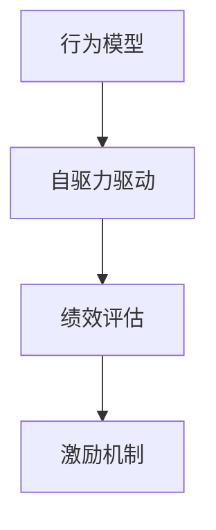

                 

# 行为模型应用:培养团队自驱力

> 关键词：自驱力,行为模型,团队管理,员工激励,绩效评估

## 1. 背景介绍

### 1.1 问题由来
在现代企业管理中，如何激发和维持员工的自驱力成为了一个关键问题。自驱力强的员工不仅工作效率高，还能为企业带来更大的创新动力和竞争优势。然而，由于员工个体的性格、背景、动机各异，传统的管理手段往往难以有效激励每个成员。

特别是随着数字化、信息化时代的到来，员工的工作环境和需求也随之变化，传统的以命令和控制为核心的管理方式已经无法满足员工的个性化需求。如何设计出一套能够有效激励员工自驱力的行为模型，成为了许多企业管理者面临的挑战。

### 1.2 问题核心关键点
本节将介绍如何通过行为模型培养团队的自驱力，从而提升团队的工作效率和创新能力。核心关键点包括：

1. **行为模型构建**：理解并量化员工的行为特征，构建行为模型。
2. **自驱力驱动**：将行为模型与自驱力因素相结合，设计激励机制。
3. **模型应用**：将行为模型应用于实际管理中，培养员工自驱力。

## 2. 核心概念与联系

### 2.1 核心概念概述

为更好地理解基于行为模型的团队管理方法，本节将介绍几个密切相关的核心概念：

- **行为模型**：基于行为科学的理论和方法，对员工的行为特征进行量化和建模，用于预测和优化员工的行为表现。
- **自驱力**：指员工在没有外部压力或强制的情况下，出于内在动机和兴趣，主动追求工作目标的能力和态度。
- **绩效评估**：通过一系列客观和主观指标，对员工的工作表现进行量化和评估，用于反馈和激励。
- **激励机制**：根据行为模型和自驱力理论，设计的一套规则和制度，用以激发员工的内在动机和潜力。

这些核心概念之间的逻辑关系可以通过以下Mermaid流程图来展示：



这个流程图展示了几者之间的联系：

1. 行为模型通过量化员工的行为特征，为自驱力的驱动和激励机制的制定提供数据支持。
2. 自驱力因素是行为模型应用的基础，用于设计和调整激励措施。
3. 绩效评估基于行为模型和激励机制，对员工的工作表现进行反馈和评估。
4. 激励机制结合行为模型和自驱力因素，对员工进行系统化激励。

## 3. 核心算法原理 & 具体操作步骤
### 3.1 算法原理概述

基于行为模型的团队管理方法，本质上是一种数据驱动、行为导向的激励机制设计。其核心思想是：通过行为模型量化员工的行为特征，结合自驱力因素，设计出符合员工内在动机的激励措施，从而最大化员工的自驱力和工作表现。

具体而言，行为模型由一系列行为指标构成，每个指标可以量化为具体的数值。通过对这些指标的组合和分析，可以预测员工的行为表现。自驱力因素通常包括内在动机、兴趣、价值观等，结合行为模型的输出，设计出个性化的激励措施。绩效评估通过行为模型和激励机制，对员工的行为表现进行实时反馈，进一步优化激励策略。

### 3.2 算法步骤详解

基于行为模型的团队管理方法一般包括以下几个关键步骤：

**Step 1: 数据收集与行为模型构建**

- 选择合适的行为指标，收集员工的历史数据，如工作时长、任务完成度、创新成果等。
- 使用数据分析工具和技术，对数据进行预处理和特征提取，构建行为模型。
- 对行为模型进行评估和优化，确保其能够准确反映员工的行为特征。

**Step 2: 自驱力因素识别**

- 通过问卷调查、面谈等方式，收集员工的内在动机、兴趣、价值观等自驱力因素。
- 对自驱力因素进行分类和量化，建立自驱力指标体系。
- 对自驱力指标进行评估和优化，确保其能够反映员工的真实需求。

**Step 3: 激励措施设计**

- 将行为模型和自驱力指标相结合，设计出个性化的激励措施。例如，对于注重创新的员工，可以设计创新奖励机制；对于注重合作的员工，可以设计团队协作奖励。
- 确定激励措施的实施方式，如物质奖励、荣誉奖励、职业发展机会等。
- 对激励措施进行评估和优化，确保其能够最大化员工的自驱力。

**Step 4: 绩效评估与反馈**

- 通过行为模型和激励措施，对员工的工作表现进行实时评估和反馈。
- 将评估结果与员工的个人发展计划相结合，提供个性化的职业发展建议。
- 持续收集员工反馈，优化行为模型和激励措施，提升员工的满意度和自驱力。

### 3.3 算法优缺点

基于行为模型的团队管理方法具有以下优点：

1. **数据驱动**：通过行为模型量化员工的行为特征，提供数据支持，减少了主观判断的偏差。
2. **个性化激励**：根据员工的内在动机和兴趣，设计个性化的激励措施，提升员工的自驱力。
3. **实时反馈**：通过行为模型和绩效评估，实现实时反馈和优化，及时调整激励策略。
4. **系统化管理**：将行为模型、自驱力因素、激励措施和绩效评估系统化集成，形成闭环管理。

同时，该方法也存在一些局限性：

1. **数据依赖**：行为模型的构建和优化需要大量的数据支持，数据收集和处理成本较高。
2. **员工参与**：自驱力因素的识别和激励措施的设计需要员工的主动参与，可能面临员工的抵触情绪。
3. **隐私保护**：行为模型和激励措施的设计可能涉及员工隐私，需要严格保护。
4. **模型复杂**：行为模型的构建和优化需要一定的技术复杂度，对企业的数据分析能力要求较高。

尽管存在这些局限性，但行为模型方法在提升员工自驱力和工作表现方面具有独特的优势，是企业管理创新的一个重要方向。

### 3.4 算法应用领域

基于行为模型的团队管理方法，已经在多个领域得到了应用，如高科技企业、互联网公司、制造业等，取得了良好的效果。具体应用场景包括：

- **高科技企业**：通过行为模型量化员工的工作效率和创新成果，结合员工的自驱力因素，设计激励措施，提升员工的创新力和技术贡献。
- **互联网公司**：通过行为模型监测员工的工作负荷和压力，结合自驱力因素，设计工作调整和心理支持措施，提升员工的幸福感和工作满意度。
- **制造业**：通过行为模型量化员工的操作规范和质量控制，结合自驱力因素，设计绩效奖金和技能培训激励措施，提升员工的操作技能和生产效率。
- **金融行业**：通过行为模型监测员工的市场风险评估能力，结合自驱力因素，设计绩效奖金和职业发展机会，提升员工的金融素养和风险控制能力。

除了这些传统行业外，行为模型方法也在医疗、教育、政府等新兴领域逐步推广，为提升组织效率和员工满意度提供新的解决方案。

## 4. 数学模型和公式 & 详细讲解  
### 4.1 数学模型构建

行为模型的构建涉及多个行为指标，每个指标可以量化为具体的数值。以员工的工作效率为例，可以设计以下行为指标：

1. **工作时长**：每天工作的小时数。
2. **任务完成度**：完成的任务数量与计划任务数量的比例。
3. **创新成果**：提出新方案的数量和质量。
4. **客户满意度**：客户的满意度评分。

假设每个行为指标可以量化为一个数值 $x_i$，则行为模型可以表示为：

$$
M = (x_1, x_2, x_3, x_4)
$$

其中 $x_1, x_2, x_3, x_4$ 分别表示员工在工作时长、任务完成度、创新成果和客户满意度方面的表现。

### 4.2 公式推导过程

为了更好地评估员工的行为表现，可以设计一个综合评分函数 $S$，用于计算行为模型的综合评分：

$$
S = w_1 \times x_1 + w_2 \times x_2 + w_3 \times x_3 + w_4 \times x_4
$$

其中 $w_1, w_2, w_3, w_4$ 为各个行为指标的权重，可以通过数据分析方法确定，如主成分分析(PCA)、因子分析等。

通过行为模型和综合评分函数，可以实时评估员工的行为表现，并与自驱力因素相结合，设计激励措施。

### 4.3 案例分析与讲解

以一个高科技企业的软件开发团队为例，分析如何通过行为模型和自驱力因素设计激励措施。

假设员工的行为指标为工作时长、任务完成度、创新成果和代码质量，综合评分函数为：

$$
S = 0.4 \times \text{工作时长} + 0.3 \times \text{任务完成度} + 0.2 \times \text{创新成果} + 0.1 \times \text{代码质量}
$$

通过行为模型，可以实时评估每个员工的行为表现，并结合自驱力因素，设计激励措施。

假设某个员工的内在动机为创新，兴趣为代码设计，价值观为团队协作。根据这些自驱力因素，可以设计以下激励措施：

1. **创新奖励**：对于创新成果排名前几名的员工，给予奖金和专利申报机会。
2. **代码设计奖**：对于代码设计质量高、创新性强的员工，给予技术分享机会和团队荣誉。
3. **团队协作奖**：对于积极参与团队协作、贡献显著的员工，给予晋升机会和团队培训。

通过这些激励措施，可以最大化员工的自驱力和工作表现，提升团队的整体创新能力和工作效率。

## 5. 项目实践：代码实例和详细解释说明
### 5.1 开发环境搭建

在进行行为模型实践前，我们需要准备好开发环境。以下是使用Python进行数据分析和行为模型开发的环境配置流程：

1. 安装Anaconda：从官网下载并安装Anaconda，用于创建独立的Python环境。

2. 创建并激活虚拟环境：
```bash
conda create -n behavior-env python=3.8 
conda activate behavior-env
```

3. 安装NumPy、Pandas、Scikit-learn、Matplotlib等必要的科学计算库：
```bash
conda install numpy pandas scikit-learn matplotlib seaborn statsmodels
```

4. 安装TensorFlow或PyTorch，用于构建行为模型和进行数据分析：
```bash
pip install tensorflow==2.4 pytorch==1.8
```

完成上述步骤后，即可在`behavior-env`环境中开始行为模型实践。

### 5.2 源代码详细实现

下面以一个简单的行为模型为例，展示如何使用Python进行行为模型的构建和评估。

假设我们有员工行为数据，包含工作时长、任务完成度、创新成果和代码质量，每个指标的评分范围为0-10分，共收集了100个员工的样本数据。

首先，导入必要的库：

```python
import numpy as np
import pandas as pd
import matplotlib.pyplot as plt
from sklearn.decomposition import PCA
```

然后，读取数据集：

```python
data = pd.read_csv('employee_data.csv')
```

接着，对数据进行预处理，计算每个行为指标的综合评分：

```python
# 计算每个行为指标的综合评分
data['score'] = 0.4 * data['work_hours'] + 0.3 * data['task_completion'] + 0.2 * data['innovation'] + 0.1 * data['code_quality']
```

使用PCA进行降维，提取主要行为特征：

```python
# 使用PCA进行降维
pca = PCA(n_components=2)
X = pca.fit_transform(data[["work_hours", "task_completion", "innovation", "code_quality"]])
```

最后，绘制行为特征的散点图，可视化行为模型：

```python
plt.scatter(X[:, 0], X[:, 1], c=data['score'], cmap='coolwarm')
plt.colorbar(label='score')
plt.xlabel('Principal Component 1')
plt.ylabel('Principal Component 2')
plt.title('Employee Behavior Model')
plt.show()
```

通过上述代码，我们构建了一个简单的行为模型，并对其进行了可视化展示。在实际应用中，还需要根据具体场景对行为指标和综合评分函数进行调整和优化。

### 5.3 代码解读与分析

让我们再详细解读一下关键代码的实现细节：

**data.read_csv('employee_data.csv')**：读取员工行为数据，其中包含工作时长、任务完成度、创新成果和代码质量等行为指标。

**data['score'] = 0.4 * data['work_hours'] + 0.3 * data['task_completion'] + 0.2 * data['innovation'] + 0.1 * data['code_quality']**：计算每个员工的行为指标的综合评分，权重系数根据数据分析结果确定。

**pca = PCA(n_components=2)**：使用主成分分析进行降维，提取两个主要行为特征。

**X = pca.fit_transform(data[["work_hours", "task_completion", "innovation", "code_quality"]])**：对行为指标进行降维，得到两个主要行为特征。

**plt.scatter(X[:, 0], X[:, 1], c=data['score'], cmap='coolwarm')**：绘制行为特征的散点图，不同颜色的点表示不同的综合评分。

可以看到，通过Python和科学计算库，我们可以很方便地构建和评估行为模型，将其应用于实际的管理决策中。

当然，工业级的系统实现还需考虑更多因素，如模型的保存和部署、超参数的自动搜索、更灵活的行为指标选择等。但核心的行为模型构建思路基本与此类似。

## 6. 实际应用场景
### 6.1 智能客服系统

基于行为模型的团队管理方法，可以应用于智能客服系统的构建。传统客服往往需要配备大量人力，高峰期响应缓慢，且一致性和专业性难以保证。通过行为模型，可以量化员工的服务质量和客户满意度，设计个性化的激励措施，提升客服人员的自驱力和工作表现。

在技术实现上，可以收集客户反馈和内部培训数据，将其作为行为模型的训练数据。通过行为模型，实时评估客服人员的服务质量和客户满意度，根据评估结果进行实时反馈和激励。例如，对于客户满意度高的客服人员，可以给予奖金和晋升机会；对于服务质量低的客服人员，可以提供培训和辅导。

### 6.2 金融投资管理

金融投资管理团队需要实时监控市场风险和收益，及时做出投资决策。通过行为模型，可以量化员工的市场风险评估能力和投资回报，设计个性化的激励措施。例如，对于风险评估能力强的员工，可以给予奖金和股票期权；对于投资回报高的员工，可以提供更多的投资资源和研究支持。

通过行为模型和激励机制，可以实现投资管理的系统化、数据化，提升团队的风险控制能力和投资收益。

### 6.3 医疗健康管理

医疗健康管理团队需要实时监测患者的健康状态和护理效果，提升患者的治疗效果和生活质量。通过行为模型，可以量化医护人员的工作质量和护理效果，设计个性化的激励措施。例如，对于治疗效果好的医护人员，可以给予奖金和晋升机会；对于护理效果差的医护人员，可以提供培训和辅导。

通过行为模型和激励机制，可以实现医疗健康管理的系统化、数据化，提升团队的工作质量和护理效果。

### 6.4 未来应用展望

随着行为模型的不断发展和完善，其应用领域将不断扩展，带来更多的创新机遇。

在智慧医疗领域，行为模型可以应用于医生、护士、管理人员等多个角色，提升医疗服务的质量和效率。

在智慧教育领域，行为模型可以应用于教师、学生、管理员等多个角色，提升教学质量和学生满意度。

在智慧城市治理中，行为模型可以应用于公安、交通、环保等多个领域，提升城市管理的自动化和智能化水平，构建更安全、高效的未来城市。

此外，在企业生产、社会治理、文娱传媒等众多领域，行为模型也将不断推广，为提升组织效率和员工满意度提供新的解决方案。

## 7. 工具和资源推荐
### 7.1 学习资源推荐

为了帮助开发者系统掌握行为模型的理论和实践，这里推荐一些优质的学习资源：

1. 《行为科学与管理》系列书籍：由行为科学领域的专家撰写，系统介绍了行为科学的理论和方法，帮助理解行为模型的构建和应用。
2. 《数据科学导论》课程：由斯坦福大学开设的线上课程，涵盖了数据科学的基本概念和常用技术，包括数据收集、数据清洗、数据分析等。
3. 《Python数据科学手册》书籍：介绍了使用Python进行数据分析和机器学习的详细方法和技巧，适用于行为模型的实践开发。
4. 《TensorFlow教程》文档：TensorFlow官方文档，提供了丰富的教程和样例代码，帮助快速上手行为模型的开发。
5. Kaggle在线数据竞赛：提供大量数据集和实际问题，通过参与竞赛，学习和实践行为模型的构建和优化。

通过对这些资源的学习实践，相信你一定能够快速掌握行为模型的精髓，并用于解决实际的团队管理问题。

### 7.2 开发工具推荐

高效的开发离不开优秀的工具支持。以下是几款用于行为模型开发的工具：

1. Jupyter Notebook：开源的交互式编程环境，支持多种语言和库，方便进行行为模型的开发和可视化。
2. Python：开源的编程语言，具有丰富的科学计算库和数据分析工具，支持行为模型的构建和优化。
3. TensorFlow：由Google主导开发的深度学习框架，支持分布式计算和模型优化，适用于行为模型的训练和部署。
4. Scikit-learn：开源的机器学习库，提供了丰富的数据处理和模型训练工具，适用于行为模型的预处理和分析。
5. Matplotlib：开源的可视化库，支持绘制各种图表，方便行为模型的可视化和解释。

合理利用这些工具，可以显著提升行为模型的开发效率，加快创新迭代的步伐。

### 7.3 相关论文推荐

行为模型的研究和应用源于学界的持续研究。以下是几篇奠基性的相关论文，推荐阅读：

1. Maslow's Hierarchy of Needs（马斯洛需求层次理论）：提出了人的需求层次，帮助理解员工的自驱力因素。
2. Herzberg's Two-Factor Theory（赫茨伯格双因素理论）：提出了激励因素和保健因素的概念，为行为模型的构建提供了理论基础。
3. Vroom's Expectancy Theory（期望理论）：提出了激励与期望的关系，为行为模型的设计提供了心理学依据。
4. Skinner's Operant Conditioning Theory（斯金纳的操作条件反射理论）：提出了正负强化和惩罚的概念，为行为模型的实施提供了方法指导。
5. Adam's Equity Theory（亚当的公平理论）：提出了公平感对员工自驱力的影响，为行为模型的优化提供了心理学视角。

这些论文代表了大行为模型研究的理论基础，通过学习这些前沿成果，可以帮助研究者把握学科前进方向，激发更多的创新灵感。

## 8. 总结：未来发展趋势与挑战
### 8.1 总结

本文对基于行为模型的团队管理方法进行了全面系统的介绍。首先阐述了行为模型和自驱力因素的理论基础，明确了行为模型在提升团队自驱力和工作表现方面的独特价值。其次，从原理到实践，详细讲解了行为模型的构建和激励措施的设计，给出了行为模型任务开发的完整代码实例。同时，本文还广泛探讨了行为模型在多个行业领域的应用前景，展示了行为模型的广阔前景。

通过本文的系统梳理，可以看到，基于行为模型的团队管理方法正在成为企业人力资源管理的重要范式，极大地提升了团队的创新能力和工作效率。未来，伴随行为模型的不断演进，行为管理技术还将进一步提升员工的自驱力和工作满意度，为企业的数字化转型和智能化升级提供新的动力。

### 8.2 未来发展趋势

展望未来，行为模型技术将呈现以下几个发展趋势：

1. **数据智能化**：行为模型的构建和优化将更加依赖于智能化数据处理技术，如深度学习、自然语言处理等，提升数据建模的精度和效率。
2. **自驱力因素的多样化**：未来的行为模型将综合考虑更多自驱力因素，如情感、道德、社会责任等，提升员工的全面发展。
3. **激励措施的个性化**：行为模型将结合员工的个性化需求，设计更加多样化和个性化的激励措施，提升员工的自驱力和幸福感。
4. **行为模型与AI的融合**：行为模型将与人工智能技术进行深度融合，实现自动化评估和实时反馈，提升激励效果。
5. **跨组织行为管理**：行为模型将广泛应用于跨组织协同管理，提升团队协作和组织绩效。

这些趋势凸显了行为模型技术在企业管理中的重要地位，为企业提升人力资源管理水平提供了新的路径。

### 8.3 面临的挑战

尽管行为模型技术已经取得了一定的成就，但在迈向更加智能化、普适化应用的过程中，它仍面临着诸多挑战：

1. **数据获取和隐私保护**：行为模型的构建需要大量高质量数据，数据获取和隐私保护成为主要障碍。如何在保证隐私的前提下，获取有效的数据支持，是一大难题。
2. **模型复杂性**：行为模型的构建和优化需要考虑多种因素，如行为指标、自驱力因素、激励措施等，模型复杂度较高。如何设计简化的行为模型，提升模型可解释性和实用性，还需要进一步研究。
3. **员工接受度**：行为模型的实施需要员工的积极参与和反馈，可能面临员工的抵触情绪。如何设计合理的激励措施，提升员工的接受度和参与度，是关键问题。
4. **模型效果评估**：行为模型的效果评估需要建立明确的指标体系，如何设计和验证行为模型的效果评估方法，还需要更多的实践探索。

尽管存在这些挑战，但行为模型技术在提升员工自驱力和工作表现方面的独特优势，使得其在企业管理中具有重要的应用价值。未来，需要更多研究和实践，不断优化行为模型，提升其应用效果和普适性。

### 8.4 研究展望

面对行为模型面临的挑战，未来的研究需要在以下几个方面寻求新的突破：

1. **数据获取与隐私保护**：探索新的数据获取和隐私保护技术，如差分隐私、联邦学习等，保障数据获取的效率和隐私。
2. **行为模型简化**：设计简化的行为模型，提升模型的可解释性和实用性，降低模型的复杂度。
3. **员工参与度提升**：设计更加个性化的激励措施，提升员工的参与度和接受度，增强行为模型的实际效果。
4. **模型效果评估**：建立更为全面和有效的行为模型效果评估体系，帮助设计和优化行为模型。

这些研究方向将推动行为模型技术的不断进步，为企业管理创新提供更多的技术支撑。未来，行为模型必将成为人力资源管理的重要工具，帮助企业提升员工的自驱力和工作表现，构建更高效、更灵活、更智能的组织体系。

## 9. 附录：常见问题与解答
**Q1：行为模型是否适用于所有员工？**

A: 行为模型适用于大多数员工，特别是那些具有高度自主性和自驱力的员工。然而，对于某些特定群体，如青少年、低学历员工等，可能存在一定的局限性。需要根据具体情况，灵活调整行为模型的构建和应用方式。

**Q2：如何确定行为指标和自驱力因素？**

A: 行为指标和自驱力因素的确定需要结合企业的具体业务需求和员工特点。可以通过问卷调查、访谈等方式，收集员工的反馈和意见，确定行为指标和自驱力因素。也可以通过数据分析和经验总结，逐步优化行为模型。

**Q3：行为模型是否需要定期更新？**

A: 行为模型需要根据企业的业务发展和员工特点进行定期更新。随着员工的工作内容和环境变化，行为模型也需要不断调整和优化，以保持其准确性和实用性。

**Q4：如何平衡激励措施的公平性和个性化？**

A: 激励措施的设计需要平衡公平性和个性化。可以通过建立公平的评估标准，设计合理的激励分配规则，确保激励措施的公平性。同时，根据员工的具体需求和表现，设计个性化的激励措施，提升员工的满意度。

**Q5：行为模型是否需要考虑外部环境因素？**

A: 行为模型的设计需要考虑外部环境因素，如市场变化、经济波动等。这些外部因素可能会影响员工的行为表现，需要在行为模型中加以考虑，以提高模型的适应性和稳定性。

---

作者：禅与计算机程序设计艺术 / Zen and the Art of Computer Programming

