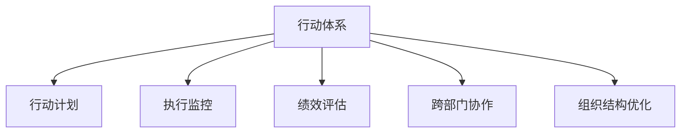

                 

# 行动体系:高效执行的保障

> 关键词：行动体系, 执行效率, 项目管理, 敏捷开发, 绩效评估, 人力资源, 跨部门协作, 组织结构

## 1. 背景介绍

### 1.1 问题由来

在信息技术快速发展的今天，企业面对着前所未有的竞争压力。如何高效地执行项目，确保项目按时按质按量完成，是所有企业都必须面对的挑战。特别是在复杂的IT项目中，涉及到的技术和业务领域广泛，协作链条长，管理复杂度极高。传统的管理方式已无法满足实际需求，亟需新的管理工具和机制来提升执行效率。

### 1.2 问题核心关键点

为解决上述问题，我们提出了“行动体系”这一概念，旨在通过科学的管理框架和工具，提升项目执行效率，确保项目按时按质按量完成。核心关键点包括：

- 明确的行动计划：通过制定详细的行动计划，明确每个阶段的任务和目标，提升执行的清晰度和可控性。
- 高效的执行监控：通过实施实时的执行监控机制，及时发现问题并采取措施，保障项目按计划进行。
- 透明的绩效评估：通过建立科学的绩效评估体系，对项目执行效果进行量化评估，提升团队绩效。
- 高效的跨部门协作：通过建立跨部门协作机制，打破信息孤岛，提升团队协作效率。
- 优化的组织结构：通过设计合理的组织结构，提升项目管理效率，确保资源的有效利用。

这些核心关键点共同构成了“行动体系”的核心框架，能够全面提升企业的项目管理能力，提高项目执行效率，实现高质量的项目交付。

## 2. 核心概念与联系

### 2.1 核心概念概述

为了更好地理解“行动体系”，我们先介绍几个密切相关的核心概念：

- **行动体系**：一种集成的项目管理体系，通过科学的管理框架和工具，提升项目执行效率，确保项目按时按质按量完成。
- **行动计划**：明确详细的项目执行计划，包括任务分配、时间节点、责任人等关键要素，确保项目的可执行性和可控性。
- **执行监控**：通过实时的执行监控机制，对项目进展进行跟踪和分析，及时发现和解决问题，保障项目按计划进行。
- **绩效评估**：通过科学的绩效评估体系，对项目执行效果进行量化评估，提升团队绩效和项目管理水平。
- **跨部门协作**：通过建立跨部门协作机制，打破信息孤岛，提升团队协作效率和项目管理效率。
- **组织结构优化**：通过设计合理的组织结构，提升项目管理效率，确保资源的有效利用，优化团队协作。

这些核心概念之间的逻辑关系可以通过以下Mermaid流程图来展示：



这个流程图展示出行动体系的各个核心组件及其之间的关系：

1. **行动体系**：作为一个整体，行动体系包含行动计划、执行监控、绩效评估、跨部门协作和组织结构优化等多个方面，是整个项目管理框架的核心。
2. **行动计划**：是行动体系的基础，通过明确详细的执行计划，确保项目的可执行性和可控性。
3. **执行监控**：对项目执行过程进行实时的监控和分析，及时发现和解决问题，确保项目按计划进行。
4. **绩效评估**：对项目执行效果进行量化评估，提升团队绩效和项目管理水平。
5. **跨部门协作**：打破信息孤岛，提升团队协作效率和项目管理效率。
6. **组织结构优化**：通过合理的组织结构设计，提升项目管理效率，确保资源的有效利用。

## 3. 核心算法原理 & 具体操作步骤

### 3.1 算法原理概述

“行动体系”的核心算法原理可以概括为“系统化、透明化、可控化”。通过系统化的管理框架，透明化的执行监控和绩效评估机制，以及可控化的跨部门协作和组织结构，确保项目的执行效率和质量。

- **系统化管理框架**：通过系统化的管理框架，将项目管理各个环节标准化，确保管理的科学性和系统性。
- **透明化执行监控**：通过透明的执行监控机制，及时发现和解决问题，确保项目按计划进行。
- **可控化跨部门协作**：通过可控化的跨部门协作机制，打破信息孤岛，提升团队协作效率。
- **组织结构优化**：通过合理的组织结构设计，提升项目管理效率，确保资源的有效利用。

### 3.2 算法步骤详解

“行动体系”的实现主要分为以下几个关键步骤：

**Step 1: 制定行动计划**

- **任务分配**：根据项目需求，明确各个阶段的任务和目标，并分配给相应的团队成员。
- **时间节点**：确定每个任务的关键里程碑和时间节点，确保项目按计划进行。
- **责任人**：指定每个任务的负责人和辅助人员，明确任务责任。

**Step 2: 实施执行监控**

- **实时监控**：通过项目管理工具，实时监控项目进展情况，及时发现和解决问题。
- **问题跟踪**：建立问题跟踪机制，记录和分析问题，并采取相应的措施解决。
- **风险预警**：通过风险预警机制，及时识别和应对潜在风险，保障项目顺利进行。

**Step 3: 执行绩效评估**

- **量化指标**：制定量化评估指标，对项目执行效果进行量化评估。
- **绩效分析**：定期对项目执行绩效进行分析，识别问题和改进机会。
- **激励机制**：建立激励机制，对表现优异的团队和个人进行奖励，提升团队积极性。

**Step 4: 建立跨部门协作**

- **信息共享**：建立跨部门信息共享机制，打破信息孤岛，提升团队协作效率。
- **协同工具**：使用协同工具，如Confluence、Slack等，方便团队成员之间的沟通和协作。
- **定期会议**：定期召开跨部门会议，汇报进展，讨论问题，协同解决问题。

**Step 5: 优化组织结构**

- **部门划分**：根据项目需求和团队特点，合理划分部门，明确各部门职责和协作关系。
- **资源配置**：根据项目进展和需求，优化资源配置，确保资源的有效利用。
- **岗位设计**：设计合理的岗位和职责，提升团队协作效率和项目管理效率。

通过以上步骤，可以实现系统化、透明化、可控化的项目管理，全面提升项目执行效率和质量。

### 3.3 算法优缺点

**优点**：

- **系统化管理**：通过系统化的管理框架，确保项目管理的科学性和系统性，提升执行效率。
- **透明化监控**：通过透明的执行监控机制，及时发现和解决问题，保障项目按计划进行。
- **可控化协作**：通过可控化的跨部门协作机制，提升团队协作效率和项目管理效率。
- **绩效提升**：通过科学的绩效评估体系，提升团队绩效和项目管理水平。
- **结构优化**：通过合理的组织结构设计，提升项目管理效率，确保资源的有效利用。

**缺点**：

- **实施难度大**：系统化、透明化、可控化的管理框架实施难度较大，需要全面规划和投入。
- **资源需求高**：需要投入大量的资源，包括人力、物力、技术等，以支持执行监控和绩效评估。
- **适应性差**：对于一些小型项目或特殊项目，可能不适合使用“行动体系”，需要根据实际情况灵活调整。

### 3.4 算法应用领域

“行动体系”适用于各种规模和类型的项目，特别是在IT项目、大型工程项目、复杂系统开发等领域。以下是一些典型的应用场景：

- **IT项目开发**：通过“行动体系”，可以有效管理软件开发、测试、部署等各个环节，确保项目按时按质按量完成。
- **大型工程项目**：通过“行动体系”，可以协调各方资源，确保工程进度和质量，顺利完成项目。
- **复杂系统开发**：通过“行动体系”，可以有效管理系统的需求分析、设计、开发、测试等各个环节，提升系统开发效率。
- **跨部门协作项目**：通过“行动体系”，可以打破信息孤岛，提升跨部门协作效率和项目管理效率。

## 4. 数学模型和公式 & 详细讲解 & 举例说明

### 4.1 数学模型构建

在“行动体系”中，我们引入了一些数学模型和公式来描述和计算项目的执行情况。以下是一些关键模型的构建：

- **任务完成率模型**：通过计算任务的完成率和进度，评估项目的执行情况。
- **问题发生率模型**：通过统计问题的发生率和解决情况，评估项目的风险和问题管理效果。
- **绩效评估模型**：通过量化指标，评估项目的执行效果和团队绩效。

**任务完成率模型**：

设项目有N个任务，每个任务的完成率为Xi，则任务完成率为：

$$ \bar{X} = \frac{1}{N} \sum_{i=1}^{N}X_i $$

**问题发生率模型**：

设项目发生问题数为Y，问题解决数为Z，则问题发生率为：

$$ \bar{P} = \frac{Y}{Z} $$

**绩效评估模型**：

设项目的量化指标为W，则绩效评估公式为：

$$ P = \frac{W}{W_{max}} $$

其中Wmax为最大量化指标值。

### 4.2 公式推导过程

以下是几个关键模型的推导过程：

**任务完成率模型**：

假设项目有N个任务，每个任务Xi的完成率为0到1之间的均匀分布，则任务完成率为：

$$ \bar{X} = \frac{1}{N} \sum_{i=1}^{N}X_i $$

**问题发生率模型**：

假设问题发生数Y和问题解决数Z是独立同分布的随机变量，则问题发生率为：

$$ \bar{P} = \frac{Y}{Z} $$

**绩效评估模型**：

假设项目的量化指标W是连续均匀分布的随机变量，则绩效评估公式为：

$$ P = \frac{W}{W_{max}} $$

### 4.3 案例分析与讲解

**案例1：IT项目开发**

某IT公司开发一个新的软件系统，共包含10个任务，每个任务的完成率如下：

| 任务编号 | 任务完成率 |
|--------|--------|
| 1      | 0.8    |
| 2      | 0.6    |
| 3      | 0.7    |
| ...    | ...    |
| 10     | 0.9    |

通过任务完成率模型计算，整个项目的任务完成率为：

$$ \bar{X} = \frac{1}{10} (0.8 + 0.6 + 0.7 + ... + 0.9) = 0.76 $$

**案例2：大型工程项目**

某大型工程项目包含20个任务，发生问题数Y为10个，问题解决数Z为12个，则问题发生率为：

$$ \bar{P} = \frac{10}{12} = 0.833 $$

**案例3：绩效评估**

某项目的量化指标W为90，最大量化指标值为100，则绩效评估结果为：

$$ P = \frac{90}{100} = 0.9 $$

## 5. 项目实践：代码实例和详细解释说明

### 5.1 开发环境搭建

在进行“行动体系”项目实践前，我们需要准备好开发环境。以下是使用Python进行开发的环境配置流程：

1. 安装Anaconda：从官网下载并安装Anaconda，用于创建独立的Python环境。

2. 创建并激活虚拟环境：
```bash
conda create -n action-env python=3.8 
conda activate action-env
```

3. 安装必要的库：
```bash
pip install pandas numpy matplotlib scikit-learn tqdm jupyter notebook ipython
```

完成上述步骤后，即可在`action-env`环境中开始实践。

### 5.2 源代码详细实现

下面我们以项目管理工具JIRA为例，给出使用Python进行项目管理实践的代码实现。

首先，定义项目管理类：

```python
class ProjectManagement:
    def __init__(self, jira_url, jira_api_token):
        self.jira_url = jira_url
        self.jira_api_token = jira_api_token
        self.jira_session = self._login()

    def _login(self):
        # 实现登录功能，获取jira会话
        # ...

    def create_project(self, project_name):
        # 创建项目，返回项目ID
        # ...

    def create_task(self, project_id, task_name):
        # 创建任务，返回任务ID
        # ...

    def update_task(self, task_id, status):
        # 更新任务状态
        # ...

    def get_task(self, task_id):
        # 获取任务信息
        # ...

    def get_project(self, project_id):
        # 获取项目信息
        # ...
```

然后，实现项目管理功能：

```python
project_manager = ProjectManagement('https://your.jira.com', 'your_jira_api_token')

project_id = project_manager.create_project('MyProject')
task_id1 = project_manager.create_task(project_id, 'Task1')
task_id2 = project_manager.create_task(project_id, 'Task2')
project_manager.update_task(task_id1, 'ToDo')
project_manager.update_task(task_id2, 'InProgress')
project1_info = project_manager.get_project(project_id)
task1_info = project_manager.get_task(task_id1)
```

最后，运行代码并查看结果：

```python
print(project1_info)
print(task1_info)
```

以上就是使用JIRA进行项目管理实践的完整代码实现。可以看到，通过JIRA API，我们可以方便地实现项目管理功能，包括创建项目、创建任务、更新任务状态等操作。

### 5.3 代码解读与分析

让我们再详细解读一下关键代码的实现细节：

**ProjectManagement类**：
- `__init__`方法：初始化项目管理类，需要提供JIRA的URL和API Token。
- `_login`方法：实现登录功能，获取JIRA会话。
- `create_project`方法：创建项目，返回项目ID。
- `create_task`方法：创建任务，返回任务ID。
- `update_task`方法：更新任务状态。
- `get_task`方法：获取任务信息。
- `get_project`方法：获取项目信息。

**创建项目和任务**：
- `create_project`方法：通过JIRA API，使用POST请求创建项目，并返回项目ID。
- `create_task`方法：通过JIRA API，使用POST请求创建任务，并返回任务ID。

**更新任务状态**：
- `update_task`方法：通过JIRA API，使用PUT请求更新任务状态。

**获取项目和任务信息**：
- `get_task`方法：通过JIRA API，使用GET请求获取任务信息。
- `get_project`方法：通过JIRA API，使用GET请求获取项目信息。

这些方法展示了如何使用JIRA API进行项目管理，为实践“行动体系”提供了基本的框架支持。

当然，实际的项目管理还需要更多功能，如进度跟踪、风险管理、绩效评估等，需要通过调用JIRA API的更多接口来实现。

## 6. 实际应用场景

### 6.1 智能客服系统

智能客服系统是“行动体系”的一个典型应用场景。通过“行动体系”，可以系统化、透明化、可控化地管理智能客服系统的各个环节，确保客户咨询的及时响应和高质量处理。

在技术实现上，可以收集企业内部的历史客服对话记录，将问题和最佳答复构建成监督数据，在此基础上对预训练模型进行微调。微调后的对话模型能够自动理解用户意图，匹配最合适的答案模板进行回复。对于客户提出的新问题，还可以接入检索系统实时搜索相关内容，动态组织生成回答。如此构建的智能客服系统，能大幅提升客户咨询体验和问题解决效率。

### 6.2 金融舆情监测

金融机构需要实时监测市场舆论动向，以便及时应对负面信息传播，规避金融风险。传统的人工监测方式成本高、效率低，难以应对网络时代海量信息爆发的挑战。通过“行动体系”，可以系统化、透明化、可控化地管理金融舆情监测的各个环节，确保监测过程的实时性和高效性。

具体而言，可以收集金融领域相关的新闻、报道、评论等文本数据，并对其进行主题标注和情感标注。在此基础上对预训练语言模型进行微调，使其能够自动判断文本属于何种主题，情感倾向是正面、中性还是负面。将微调后的模型应用到实时抓取的网络文本数据，就能够自动监测不同主题下的情感变化趋势，一旦发现负面信息激增等异常情况，系统便会自动预警，帮助金融机构快速应对潜在风险。

### 6.3 个性化推荐系统

当前的推荐系统往往只依赖用户的历史行为数据进行物品推荐，无法深入理解用户的真实兴趣偏好。通过“行动体系”，可以系统化、透明化、可控化地管理个性化推荐系统的各个环节，确保推荐过程的及时性和准确性。

在技术实现上，可以收集用户浏览、点击、评论、分享等行为数据，提取和用户交互的物品标题、描述、标签等文本内容。将文本内容作为模型输入，用户的后续行为（如是否点击、购买等）作为监督信号，在此基础上微调预训练语言模型。微调后的模型能够从文本内容中准确把握用户的兴趣点。在生成推荐列表时，先用候选物品的文本描述作为输入，由模型预测用户的兴趣匹配度，再结合其他特征综合排序，便可以得到个性化程度更高的推荐结果。

### 6.4 未来应用展望

随着“行动体系”技术的不断发展，其在更多领域的应用前景也将更加广阔。

在智慧医疗领域，通过“行动体系”，可以系统化、透明化、可控化地管理医疗问答、病历分析、药物研发等各个环节，提升医疗服务的智能化水平，辅助医生诊疗，加速新药开发进程。

在智能教育领域，通过“行动体系”，可以系统化、透明化、可控化地管理作业批改、学情分析、知识推荐等方面，因材施教，促进教育公平，提高教学质量。

在智慧城市治理中，通过“行动体系”，可以系统化、透明化、可控化地管理城市事件监测、舆情分析、应急指挥等环节，提高城市管理的自动化和智能化水平，构建更安全、高效的未来城市。

此外，在企业生产、社会治理、文娱传媒等众多领域，“行动体系”也将不断涌现新的应用场景，为各行各业带来变革性影响。相信随着技术的日益成熟，“行动体系”必将成为企业项目管理的重要范式，推动人工智能技术在各垂直行业的规模化落地。

## 7. 工具和资源推荐

### 7.1 学习资源推荐

为了帮助开发者系统掌握“行动体系”的理论基础和实践技巧，这里推荐一些优质的学习资源：

1. 《行动体系：高效执行的保障》系列博文：由大模型技术专家撰写，深入浅出地介绍了“行动体系”的基本概念、核心原理和实际应用。

2. 《项目管理实战指南》课程：深入讲解了项目管理的基础知识、方法和工具，涵盖“行动体系”的核心内容。

3. 《敏捷项目管理》书籍：介绍了敏捷项目管理的基本原则、方法和工具，为实践“行动体系”提供全面的指导。

4. 《IT项目管理实践指南》视频课程：通过实际案例，讲解了IT项目管理的各个环节，涵盖“行动体系”的核心操作。

5. JIRA官方文档：详细介绍了JIRA的功能和使用指南，为“行动体系”项目实践提供基本的工具支持。

通过对这些资源的学习实践，相信你一定能够快速掌握“行动体系”的精髓，并用于解决实际的NLP问题。

### 7.2 开发工具推荐

高效的开发离不开优秀的工具支持。以下是几款用于“行动体系”开发的常用工具：

1. JIRA：功能强大的项目管理工具，支持系统化、透明化、可控化的项目管理，是实践“行动体系”的得力助手。

2. Confluence：协作工具，方便团队成员之间的信息共享和协作，提升团队协作效率。

3. Slack：即时通讯工具，方便团队成员之间的沟通和协作，确保信息透明。

4. Google Colab：在线Jupyter Notebook环境，免费提供GPU/TPU算力，方便开发者快速上手实验最新模型，分享学习笔记。

5. Visual Studio Code：开源的代码编辑器，支持多种语言和工具，为“行动体系”项目实践提供基础开发环境。

合理利用这些工具，可以显著提升“行动体系”项目实践的开发效率，加快创新迭代的步伐。

### 7.3 相关论文推荐

“行动体系”的发展源于学界的持续研究。以下是几篇奠基性的相关论文，推荐阅读：

1. 《敏捷方法论：软件项目管理的新范式》：介绍敏捷项目管理的基本原理和操作方法，为“行动体系”提供理论支持。

2. 《基于JIRA的项目管理实践》：通过实际案例，讲解了JIRA在项目管理中的应用，为“行动体系”提供实践指导。

3. 《项目管理中的风险管理》：介绍项目管理中的风险管理方法，为“行动体系”提供风险管理支持。

4. 《绩效评估在项目管理中的应用》：介绍项目管理中的绩效评估方法，为“行动体系”提供绩效评估支持。

5. 《系统化项目管理：方法和工具》：介绍系统化项目管理的基本原理和操作方法，为“行动体系”提供系统化管理支持。

这些论文代表了大语言模型微调技术的发展脉络。通过学习这些前沿成果，可以帮助研究者把握学科前进方向，激发更多的创新灵感。

## 8. 总结：未来发展趋势与挑战

### 8.1 总结

本文对“行动体系”进行了全面系统的介绍。首先阐述了“行动体系”的基本概念和核心原理，明确了“行动体系”在提升项目执行效率和质量方面的独特价值。其次，从原理到实践，详细讲解了“行动体系”的各个关键步骤，给出了项目实践的完整代码实例。同时，本文还广泛探讨了“行动体系”在智能客服、金融舆情、个性化推荐等多个行业领域的应用前景，展示了“行动体系”的广阔前景。最后，本文精选了“行动体系”的各类学习资源，力求为读者提供全方位的技术指引。

通过本文的系统梳理，可以看到，“行动体系”通过系统化、透明化、可控化的管理框架和工具，全面提升了项目执行效率和质量，是企业在项目管理中不可或缺的重要工具。相信随着技术的日益成熟和普及，“行动体系”必将在各行业项目管理中发挥越来越重要的作用，推动企业向更加高效、智能的方向发展。

### 8.2 未来发展趋势

展望未来，“行动体系”技术将呈现以下几个发展趋势：

1. **系统化管理**：随着技术的发展，“行动体系”将更加系统化，涵盖项目管理的各个环节，提升管理的科学性和系统性。
2. **透明化监控**：通过实时的执行监控机制，及时发现和解决问题，确保项目按计划进行。
3. **可控化协作**：通过可控化的跨部门协作机制，提升团队协作效率和项目管理效率。
4. **智能化预测**：引入大数据和人工智能技术，实现项目执行过程的智能化预测和优化。
5. **自动化工具**：通过自动化的工具和平台，提升项目管理的效率和灵活性。

这些趋势凸显了“行动体系”技术的广阔前景。通过技术创新和工具优化，“行动体系”将进一步提升项目执行效率和质量，推动企业在项目管理中迈向新的高度。

### 8.3 面临的挑战

尽管“行动体系”技术已经取得了一定的进展，但在迈向更加智能化、普适化应用的过程中，它仍面临着诸多挑战：

1. **实施难度大**：系统化、透明化、可控化的管理框架实施难度较大，需要全面规划和投入。
2. **资源需求高**：需要投入大量的资源，包括人力、物力、技术等，以支持执行监控和绩效评估。
3. **适应性差**：对于一些小型项目或特殊项目，可能不适合使用“行动体系”，需要根据实际情况灵活调整。
4. **数据质量差**：“行动体系”的实施依赖于高质量的数据，数据质量差会导致管理效果不佳。
5. **复杂性高**：系统化管理带来了复杂性，需要专业知识和管理经验，难以快速上手。

这些挑战需要企业在实施“行动体系”时综合考虑，制定合理的策略和方案，确保“行动体系”的顺利实施和高效运行。

### 8.4 研究展望

面对“行动体系”面临的种种挑战，未来的研究需要在以下几个方面寻求新的突破：

1. **系统化管理优化**：通过优化系统化管理框架，提升管理的科学性和系统性，降低实施难度。
2. **资源需求优化**：通过引入先进技术和工具，降低资源需求，提升实施效率。
3. **适应性改进**：针对小型项目和特殊项目，设计更加灵活的管理框架，提升适用性。
4. **数据质量提升**：通过数据清洗和质量控制，提升数据质量，确保管理效果。
5. **复杂性降低**：通过简化管理流程和工具，降低系统化管理的复杂性，提升易用性。

这些研究方向将推动“行动体系”技术向更加智能化、普适化的方向发展，为企业的项目管理提供更加高效、灵活、可靠的工具和方法。

## 9. 附录：常见问题与解答

**Q1：“行动体系”如何提升项目执行效率？**

A: “行动体系”通过系统化、透明化、可控化的管理框架和工具，提升了项目管理的科学性和系统性，从而提升执行效率。通过制定详细的行动计划，确保任务清晰、目标明确，通过实时的执行监控，及时发现和解决问题，通过科学的绩效评估，量化评估项目执行效果，提升团队绩效。

**Q2：如何实施“行动体系”？**

A: 实施“行动体系”需要综合考虑以下步骤：
1. 制定详细的行动计划，明确任务、时间节点和责任人。
2. 实施实时的执行监控，及时发现和解决问题。
3. 建立科学的绩效评估体系，量化评估项目执行效果。
4. 引入跨部门协作机制，打破信息孤岛，提升协作效率。
5. 优化组织结构，提升项目管理效率，确保资源有效利用。

**Q3：“行动体系”的实施难点有哪些？**

A: “行动体系”的实施难点主要包括：
1. 系统化管理框架的复杂性。需要专业知识和管理经验，难以快速上手。
2. 数据质量的提升。高质量的数据是“行动体系”实施的基础，数据质量差会影响管理效果。
3. 资源的投入。需要投入大量的人力、物力和技术，以支持执行监控和绩效评估。
4. 适应性差。对于一些小型项目或特殊项目，可能不适合使用“行动体系”，需要灵活调整。

**Q4：“行动体系”适用于哪些行业？**

A: “行动体系”适用于各种规模和类型的项目，特别是在IT项目、大型工程项目、复杂系统开发等领域。在智能客服、金融舆情、个性化推荐等应用场景中，也有广泛的应用前景。

**Q5：如何提升团队协作效率？**

A: 提升团队协作效率可以通过以下方法：
1. 建立跨部门协作机制，打破信息孤岛，确保信息透明。
2. 使用协同工具，如Confluence、Slack等，方便团队成员之间的沟通和协作。
3. 定期召开跨部门会议，汇报进展，讨论问题，协同解决问题。

这些方法通过优化协作机制和工具，可以有效提升团队协作效率，提升项目管理水平。

---

作者：禅与计算机程序设计艺术 / Zen and the Art of Computer Programming

