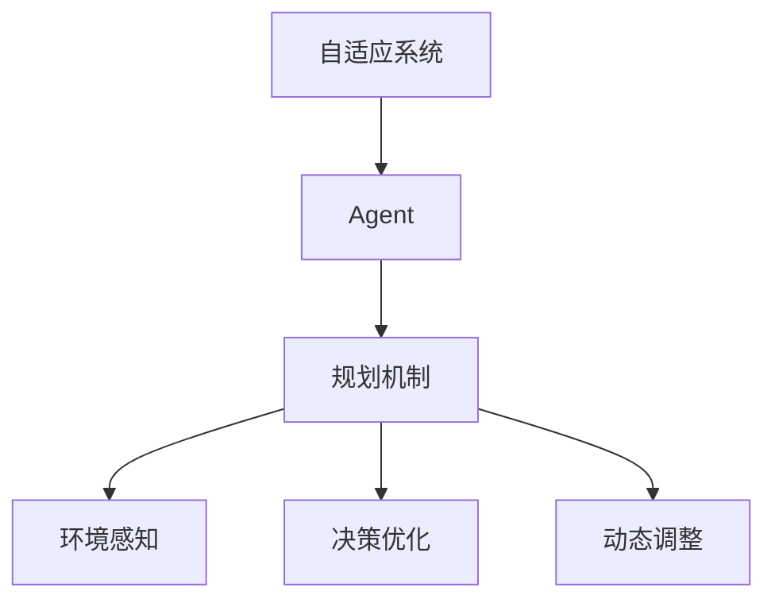

                 

# 规划机制在 Agent 自适应系统中的应用

> 关键词：自适应系统，Agent，规划机制，环境感知，决策优化，动态调整

## 1. 背景介绍

在现代智能系统中，代理(Agent)扮演着至关重要的角色。这些智能实体能够理解环境，自主做出决策，实现复杂任务的自动化处理。自适应系统的核心在于通过Agent不断学习并调整自身行为，以适应多变和动态的环境变化。然而，Agent的决策过程常常面临不确定性和非结构化信息的挑战，如何提升其自适应能力和鲁棒性，是当前AI研究的前沿课题。

规划机制作为Agent系统的重要组成部分，旨在帮助Agent在复杂的决策场景中寻找最优或次优路径，从而提升系统的整体性能。本文将系统介绍规划机制在大规模智能系统中的应用，具体阐述其原理和操作步骤，分析优缺点和应用领域，并结合实际案例进行详细讲解和数学建模。

## 2. 核心概念与联系

### 2.1 核心概念概述

为更好地理解规划机制在Agent自适应系统中的应用，本节将介绍几个密切相关的核心概念：

- **自适应系统**：一种能够通过反馈机制自动调整自身行为的智能系统。系统中的Agent能够感知环境，并根据当前状态做出最优决策。

- **Agent**：自主决策的智能实体，其行为由算法和数据驱动，能够在复杂环境中自主完成任务。

- **规划机制**：帮助Agent从当前状态规划至目标状态的决策过程。通过搜索和优化算法，规划机制能够辅助Agent找到最优或可行路径。

- **环境感知**：Agent对周围环境的感知和理解能力，通常包括对物理环境、社会关系、时间变化等维度的感知。

- **决策优化**：基于当前感知信息和任务目标，通过规划机制优化Agent的决策，以实现任务的优化和自适应。

- **动态调整**：自适应系统能够根据环境变化动态调整自身参数和行为，保持系统的稳定性和灵活性。

这些核心概念之间的逻辑关系可以通过以下Mermaid流程图来展示：



这个流程图展示出Agent系统各组件之间的交互关系：

1. 自适应系统由Agent构成，负责决策和执行。
2. Agent通过规划机制进行路径规划和决策。
3. 规划机制依赖环境感知获取环境信息。
4. 决策优化通过规划机制对Agent决策进行优化。
5. 动态调整根据环境变化调整Agent行为，保持系统灵活性。

## 3. 核心算法原理 & 具体操作步骤

### 3.1 算法原理概述

规划机制的基本原理是通过搜索和优化算法，在当前状态和目标状态之间寻找最优或可行路径。Agent能够感知当前环境，并基于预定义的规则和目标，通过规划机制规划出一条通往目标状态的路径。规划机制的核心目标是在有限的时间内，找到一个满足一定条件（如成本最低、路径最短等）的路径。

规划机制主要分为静态规划和动态规划两种方式：

- **静态规划**：在已知环境不变的情况下，提前计算出最优路径，适用于环境较为稳定的情况。
- **动态规划**：在环境动态变化的情况下，实时更新规划路径，适用于环境不确定性较高的情况。

在实际应用中，规划机制通常与强化学习、搜索算法、优化算法等技术结合，以提升Agent的决策质量和自适应能力。

### 3.2 算法步骤详解

基于静态规划和动态规划两种不同的规划方式，规划机制的实现步骤如下：

#### 3.2.1 静态规划步骤
1. **环境建模**：根据任务需求，构建环境模型，表示环境状态和状态转移方式。
2. **目标设定**：定义任务目标，通常为寻找成本最低或路径最短路径。
3. **状态空间划分**：将环境划分为多个状态，每个状态表示系统所处的一个具体位置或配置。
4. **路径规划算法**：选择适当的路径规划算法，如A*、Dijkstra等，计算从起点到终点的最优路径。
5. **路径优化**：对计算出的路径进行优化，去除冗余环节，进一步降低成本。

#### 3.2.2 动态规划步骤
1. **状态空间划分**：与静态规划类似，将环境划分为多个状态，但需考虑状态之间的转移。
2. **动态规划算法**：选择适当的动态规划算法，如值迭代法、策略迭代法等，实时更新最优策略。
3. **状态更新**：在每个时间步，根据当前状态和行动，更新下一个状态，并计算其成本。
4. **路径优化**：对计算出的路径进行实时优化，保证路径的质量。

### 3.3 算法优缺点

规划机制作为Agent自适应系统的重要组成部分，具有以下优点和缺点：

**优点：**
1. **决策优化**：通过路径规划和优化，帮助Agent找到最优或可行路径，提升决策质量。
2. **自适应性**：动态规划算法能够实时调整最优策略，适应环境变化，提升系统的灵活性。
3. **可扩展性**：算法可扩展至多维空间，支持复杂环境和任务。

**缺点：**
1. **计算复杂度高**：静态规划和动态规划算法通常计算复杂度较高，需要消耗大量计算资源。
2. **实时性差**：在一些实时性要求高的应用场景中，动态规划算法可能无法满足实时性要求。
3. **路径依赖**：路径规划算法通常依赖于初始状态和路径优化方式，路径依赖可能导致局部最优解。

### 3.4 算法应用领域

规划机制在多个领域得到了广泛应用，包括：

- **交通导航**：帮助自动驾驶车辆找到最优路径，避免交通拥堵和事故。
- **物流配送**：优化货物配送路线，降低成本，提升配送效率。
- **工业自动化**：规划机器人路径，提高生产效率，减少能源消耗。
- **智能推荐系统**：规划推荐路径，为用户推荐最相关的内容，提升用户体验。
- **金融投资**：规划投资策略，根据市场变化动态调整投资组合，实现收益最大化。

以上领域展示了规划机制在实际应用中的巨大潜力和广泛应用前景。

## 4. 数学模型和公式 & 详细讲解 & 举例说明

### 4.1 数学模型构建

为了系统地介绍规划机制，我们以交通导航为例，构建一个简单的数学模型。假设道路网络由多个节点和边组成，节点表示交叉口或关键位置，边表示连接两个节点的道路。设 $n$ 为节点数，$m$ 为边数。令 $x_{ij}$ 表示从节点 $i$ 到节点 $j$ 的道路长度。环境状态 $s \in S$，目标状态 $s^*$，当前状态为 $s_t$，最优路径为 $p^*$。

### 4.2 公式推导过程

基于以上定义，我们考虑A*算法进行路径规划。A*算法的核心在于通过启发式函数 $h(n)$ 评估当前状态到目标状态的距离，计算每个节点的优先级。启发式函数 $h(n)$ 通常为节点 $n$ 到目标状态 $s^*$ 的实际距离，即 $h(n)=dist(n,s^*)$。

A*算法的迭代过程如下：

1. 初始化：设置起点为 $s_0$，目标点为 $s^*$，开放列表为 $\{s_0\}$，关闭列表为空集。
2. 重复以下步骤，直到找到最优路径或开放列表为空：
   - 从开放列表中选取优先级最高的节点 $n$，加入关闭列表。
   - 对节点 $n$ 的邻居进行扩展，计算它们到起点的路径长度 $g(n)$ 和启发式距离 $h(n)$。
   - 若节点 $n$ 不在开放列表中，则加入开放列表，并计算其优先级 $f(n)=g(n)+h(n)$。
   - 若节点 $n$ 已经在开放列表中，则更新其优先级 $f(n)$。
3. 路径回溯：从目标状态 $s^*$ 开始，按照优先级列表回溯，找到路径 $p^*$。

### 4.3 案例分析与讲解

为了更好地理解A*算法，我们以一个简单的网格世界为例：

假设网格世界由 $10 \times 10$ 个节点组成，目标状态为 $(9,9)$。每个节点之间的距离为1，即 $x_{ij}=1$。令启发式函数 $h(n)=dist(n,s^*)$，$dist(n,s^*)$ 表示节点 $n$ 到目标状态 $s^*$ 的曼哈顿距离。

我们将起点设置为 $(0,0)$，使用A*算法进行路径规划，步骤如下：

1. 初始化开放列表为 $\{(0,0)\}$，关闭列表为空集。
2. 选取优先级最高的节点 $(0,0)$，加入关闭列表。
3. 扩展 $(0,0)$ 的四个邻居节点 $(0,1)$、$(1,0)$、$(0,-1)$、$(-1,0)$，计算它们的 $g(n)$ 和 $h(n)$。
4. 优先级列表如下：
   - $(0,0)$: $f(0,0)=g(0,0)+h(0,0)=1+1=2$
   - $(0,1)$: $f(0,1)=g(0,1)+h(0,1)=2+2=4$
   - $(1,0)$: $f(1,0)=g(1,0)+h(1,0)=2+2=4$
   - $(0,-1)$: $f(0,-1)=g(0,-1)+h(0,-1)=2+2=4$
   - $(1,1)$: $f(1,1)=g(1,1)+h(1,1)=3+3=6$
   - $(1,2)$: $f(1,2)=g(1,2)+h(1,2)=4+3=7$
   - $(2,1)$: $f(2,1)=g(2,1)+h(2,1)=4+3=7$
5. 选取优先级最高的节点 $(0,1)$，加入关闭列表，扩展其邻居节点 $(0,2)$、$(1,1)$。
6. 重复上述过程，直到找到目标状态 $(9,9)$。

最终的路径为：$(0,0) \rightarrow (0,1) \rightarrow (1,1) \rightarrow (1,2) \rightarrow (2,2) \rightarrow \ldots \rightarrow (9,9)$。

## 5. 项目实践：代码实例和详细解释说明

### 5.1 开发环境搭建

在进行规划机制的代码实践前，我们需要准备好开发环境。以下是使用Python进行A*算法的开发环境配置流程：

1. 安装Anaconda：从官网下载并安装Anaconda，用于创建独立的Python环境。

2. 创建并激活虚拟环境：
```bash
conda create -n astar-env python=3.8 
conda activate astar-env
```

3. 安装必要的包：
```bash
pip install numpy matplotlib networkx
```

4. 安装A*算法的Python实现：
```bash
pip install astar
```

完成上述步骤后，即可在`astar-env`环境中开始A*算法的实践。

### 5.2 源代码详细实现

下面是使用Python实现A*算法的代码：

```python
import astar
import networkx as nx

# 构建网格世界图
G = nx.grid_2d_graph(10, 10)
distances = nx.get_edge_attributes(G, 'weight')

# 设置起点和终点
start = (0, 0)
end = (9, 9)

# 使用A*算法进行路径规划
result = astar.astar(G, distances, start, end)
```

这段代码实现了A*算法在网格世界中的应用，具体步骤如下：

1. 使用`networkx`库构建网格世界图。
2. 设置起点和终点。
3. 调用`astar.astar`函数，传入图、距离字典、起点和终点，计算出最优路径。

### 5.3 代码解读与分析

让我们再详细解读一下关键代码的实现细节：

- `G = nx.grid_2d_graph(10, 10)`：构建一个 $10 \times 10$ 的网格世界图，节点之间的距离为1。
- `distances = nx.get_edge_attributes(G, 'weight')`：获取边属性字典，其中'weight'表示节点之间的距离。
- `start = (0, 0)`：设置起点为 $(0,0)$。
- `end = (9, 9)`：设置终点为 $(9,9)$。
- `result = astar.astar(G, distances, start, end)`：调用`astar.astar`函数，计算出起点到终点的最优路径。

可以看到，通过这段代码，我们成功地在网格世界中应用了A*算法，并计算出了起点到终点的最优路径。

## 6. 实际应用场景

### 6.1 智能交通导航

在智能交通系统中，规划机制能够帮助自动驾驶车辆快速找到最优路径，规避交通拥堵和事故。通过实时感知交通环境，车辆可以动态调整路径，实现高效的路径规划。例如，基于A*算法的自动驾驶导航系统可以预测当前路段的交通状况，选择最佳路径，以减少行驶时间和能源消耗。

### 6.2 物流配送优化

物流公司使用规划机制优化货物配送路线，提高配送效率，降低成本。通过对配送中心和客户地址的实时感知，系统可以动态调整配送路径，选择最短的路径，避免绕路和延误。例如，基于A*算法的配送系统可以根据实时交通情况和配送历史数据，实时规划最优配送路径，提升整体配送效率。

### 6.3 智能机器人路径规划

在工业自动化领域，规划机制能够帮助机器人找到最优路径，提高生产效率，减少能源消耗。通过对生产线和机器人的实时感知，系统可以动态调整路径，选择最优的移动方式，以最大化生产效率。例如，基于A*算法的机器人路径规划系统可以实时感知生产线状态和机器人的实时位置，动态调整路径，实现最优的生产调度。

### 6.4 金融投资策略优化

在金融领域，规划机制能够帮助投资者制定最优的投资策略，实现收益最大化。通过实时感知市场动态，系统可以动态调整投资组合，选择最佳的投资路径。例如，基于A*算法的投资策略优化系统可以实时感知市场变化，动态调整投资组合，选择最优的投资路径，实现收益最大化。

## 7. 工具和资源推荐

### 7.1 学习资源推荐

为了帮助开发者系统掌握规划机制的理论基础和实践技巧，这里推荐一些优质的学习资源：

1. 《算法导论》（Introduction to Algorithms）：由Thomas H. Cormen等人编写，是计算机科学领域的经典教材，详细介绍了各种算法的原理和实现方法。

2. 《人工智能：一种现代方法》（Artificial Intelligence: A Modern Approach）：由Stuart Russell和Peter Norvig编写，介绍了人工智能领域的基本概念和经典算法。

3. 《动态规划》（Dynamic Programming）：由Richard Bellman和Richard C. B. Merriam编写，介绍了动态规划算法的原理和应用场景。

4. 《算法设计与分析基础》（Algorithm Design and Analysis Foundations）：由Krishnendu Chatterjee和Liviu P.G.如有编写，介绍了算法的设计和分析方法。

5. 《网络X教程》（NetworkX Tutorials）：由NetworkX社区编写，提供了丰富的网络分析教程和案例。

通过对这些资源的学习实践，相信你一定能够快速掌握规划机制的精髓，并用于解决实际的智能系统问题。

### 7.2 开发工具推荐

高效的开发离不开优秀的工具支持。以下是几款用于规划机制开发的常用工具：

1. Python：作为数据科学和机器学习的主流语言，Python提供了丰富的算法库和数据处理工具，适合进行规划机制的实现。

2. NetworkX：用于构建和分析复杂网络的工具，适合进行网格世界和路网等环境的建模。

3. Scikit-learn：提供了多种机器学习和数据处理工具，适合进行路径优化和决策分析。

4. Jupyter Notebook：用于编写和运行Python代码的交互式环境，适合进行算法实现和实验验证。

5. PyCharm：一款强大的Python IDE，提供了代码高亮、调试、代码自动补全等功能，适合进行复杂算法实现。

合理利用这些工具，可以显著提升规划机制的开发效率，加快创新迭代的步伐。

### 7.3 相关论文推荐

规划机制作为智能系统中的关键技术，在多个领域得到了广泛研究。以下是几篇奠基性的相关论文，推荐阅读：

1. "A*: A New Heuristic for Hiding, in the Best-First Search"：Douglas L. C. Little与Erich L. Leithenauer的A*算法经典论文，详细介绍了A*算法的原理和实现方法。

2. "Planning Algorithms for Adaptive Autonomous Vehicles"：Eugene Hwang与Richard H. Kwitt的论文，介绍了在自动驾驶车辆中应用规划机制的方法。

3. "Dynamic Programming and Stochastic Control"：Richard Bellman的经典著作，详细介绍了动态规划算法的原理和应用。

4. "A Survey of Algorithms for Planning in Robotics"：Robotic Systems小组的论文，介绍了在机器人路径规划中应用规划机制的方法。

5. "Dynamic Portfolio Selection and Portfolio Risk Management"：Stephen G. Ross的论文，介绍了在金融投资中应用规划机制的方法。

这些论文代表了大规模智能系统规划机制的发展脉络。通过学习这些前沿成果，可以帮助研究者把握学科前进方向，激发更多的创新灵感。

## 8. 总结：未来发展趋势与挑战

### 8.1 研究成果总结

本文对规划机制在Agent自适应系统中的应用进行了全面系统的介绍。首先阐述了规划机制在自适应系统中的核心作用，明确了其在提高Agent决策能力和自适应性方面的独特价值。其次，从原理到实践，详细讲解了规划机制的数学模型和操作步骤，给出了实际应用的案例分析。

通过本文的系统梳理，可以看到，规划机制在Agent系统中的应用，已经成为了智能系统决策优化和自适应能力提升的重要手段。未来，伴随算法的不断优化和扩展，规划机制必将在大规模智能系统中发挥更大的作用。

### 8.2 未来发展趋势

展望未来，规划机制在Agent自适应系统中的应用将呈现以下几个发展趋势：

1. **多维度规划**：随着智能系统复杂性的提升，规划机制将从二维扩展到多维空间，支持更复杂环境和任务的路径规划。

2. **实时动态调整**：基于动态规划算法，规划机制将能够实时调整最优策略，适应动态环境变化，提升系统的灵活性和实时性。

3. **智能推荐系统**：在智能推荐系统中，规划机制将结合用户行为数据和系统状态，实现个性化推荐路径，提升用户体验。

4. **分布式优化**：随着计算资源的不断扩展，分布式优化算法将能够在大规模智能系统中实现高效的路径规划。

5. **混合规划方法**：规划机制将与其他智能技术结合，如强化学习、神经网络等，形成混合规划方法，提升决策质量和自适应能力。

以上趋势凸显了规划机制在智能系统中的重要性和广阔前景。这些方向的探索发展，必将进一步提升智能系统的性能和应用范围，为智能技术的普及和应用提供新的思路。

### 8.3 面临的挑战

尽管规划机制在Agent自适应系统中的应用已经取得了一定的进展，但在迈向更加智能化、普适化应用的过程中，仍面临诸多挑战：

1. **计算资源消耗高**：规划机制通常需要较高的计算资源，尤其是动态规划算法，在实时性要求高的应用场景中可能无法满足。

2. **路径依赖问题**：路径规划算法依赖于初始状态和路径优化方式，可能导致局部最优解，限制系统的全局优化能力。

3. **模型复杂度高**：复杂环境的规划问题通常具有较高的模型复杂度，导致算法实现难度大，运行效率低。

4. **数据质量和获取难度**：规划机制依赖于准确的环境数据，如何获取高质量、实时性的数据，是系统应用的重要挑战。

5. **鲁棒性不足**：环境变化和异常情况可能导致规划机制失效，如何增强系统的鲁棒性，是未来研究的重要方向。

6. **安全性问题**：智能系统的安全性问题不容忽视，如何保证规划机制的安全性和可靠性，是系统应用的重要保障。

7. **可解释性问题**：规划机制的决策过程通常缺乏可解释性，如何赋予系统更强的可解释性，是未来研究的重要课题。

解决这些挑战，需要多学科的交叉合作，共同推进规划机制的进步和应用。相信伴随技术的不断发展，规划机制将在智能系统决策优化和自适应能力提升中发挥更大的作用。

### 8.4 研究展望

面向未来，规划机制的研究方向可以从以下几个方面进行探索：

1. **混合规划方法**：结合强化学习、神经网络等技术，形成混合规划方法，提升系统的决策质量和自适应能力。

2. **多尺度规划**：将不同尺度上的规划方法结合，实现多尺度路径规划，提升系统的整体性能。

3. **自适应学习**：引入自适应学习机制，实时调整规划算法参数，提升系统的适应性和鲁棒性。

4. **多目标规划**：在复杂环境中，考虑多目标优化，实现路径规划的多目标平衡。

5. **分布式计算**：在分布式环境下，设计高效的分布式规划算法，提升系统的大规模应用能力。

6. **安全性保障**：引入安全性保障机制，如数据加密、安全验证等，确保系统安全可靠。

7. **可解释性增强**：引入可解释性增强技术，提升系统的透明度和可理解性，帮助用户理解系统决策过程。

这些研究方向将进一步推动规划机制的进步，使其在智能系统决策优化和自适应能力提升中发挥更大的作用。面向未来，规划机制的研究方向需要不断拓展，结合更多的智能技术，共同推进智能系统的进步和发展。

## 9. 附录：常见问题与解答

**Q1：什么是规划机制？**

A: 规划机制是一种帮助智能系统从当前状态规划至目标状态的决策过程。通过搜索和优化算法，规划机制能够辅助系统找到最优或可行路径。

**Q2：静态规划和动态规划的区别是什么？**

A: 静态规划适用于环境不变的情况，预先计算出最优路径。动态规划适用于环境动态变化的情况，实时更新最优路径。静态规划通常计算复杂度较低，但无法适应环境变化，而动态规划计算复杂度高，但具有实时性和灵活性。

**Q3：如何提高规划机制的实时性？**

A: 可以通过以下方法提高规划机制的实时性：
1. 使用启发式算法，如A*，减少计算量。
2. 优化数据结构，如使用优先队列，提高数据访问效率。
3. 采用分布式计算，并行计算路径规划，减少计算时间。

**Q4：规划机制在智能推荐系统中有什么应用？**

A: 在智能推荐系统中，规划机制可以结合用户行为数据和系统状态，动态调整推荐路径，实现个性化推荐。通过规划机制，系统能够根据用户的实时行为和兴趣，实时调整推荐策略，提升推荐效果。

**Q5：规划机制在自适应系统中的关键作用是什么？**

A: 规划机制是自适应系统中的重要组成部分，帮助系统从当前状态规划至目标状态。通过路径规划和优化，规划机制能够提升系统的决策质量和自适应能力，使系统在动态环境中保持稳定和高效。

---

作者：禅与计算机程序设计艺术 / Zen and the Art of Computer Programming

