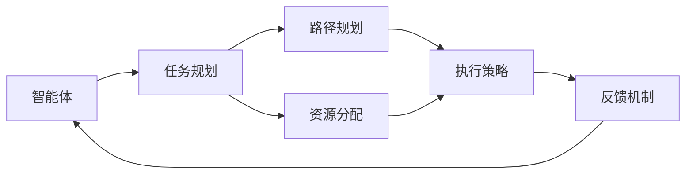

                 

# 规划：Agent 分解复杂任务与执行

## 1. 背景介绍

随着人工智能技术的迅猛发展，智能体(Agent)正日益成为解决复杂任务的强大工具。无论是工业自动化、金融风控、医疗诊断，还是智能客服、推荐系统、内容生成，智能体都已展现出令人瞩目的潜力。然而，面对复杂多变的实际问题，如何将繁琐的任务进行合理分解，并由智能体高效执行，仍然是一个重要的挑战。本文将围绕这一主题，深入探讨Agent的复杂任务规划与执行原理，并给出具体的实践方法和案例分析。

## 2. 核心概念与联系

### 2.1 核心概念概述

在探讨Agent如何处理复杂任务之前，首先定义一些核心概念：

- **智能体(Agent)**：在特定环境中，根据环境感知做出决策和动作的实体。智能体可以是一个人、机器人、程序或任何具备自我感知与执行能力的实体。

- **复杂任务**：在特定环境或情境中，由多个子任务构成、需要通过多步骤完成的任务。这些子任务往往具有高度的交互性和依赖性。

- **任务规划**：智能体在执行任务前，对任务进行分解、评估和计划的过程。任务规划包括目标设定、路径规划、资源分配等环节。

- **执行策略**：智能体在完成任务规划后，采用的具体执行方案和行动路线。执行策略取决于任务复杂度、环境动态性等因素。

- **奖励系统**：对智能体执行任务的反馈机制。奖励系统引导智能体做出符合期望的行为。

- **优化算法**：智能体在执行任务时，使用的求解最优解的算法。优化算法在求解过程和路径规划中发挥关键作用。

这些核心概念相互关联，共同构成了Agent处理复杂任务的基础框架。智能体通过任务规划和执行策略，有效分解任务并执行，最终实现任务目标。

### 2.2 核心概念原理和架构的 Mermaid 流程图



上述流程图展示了智能体处理复杂任务的基本流程。智能体首先对任务进行规划，进行路径规划和资源分配。然后根据执行策略，智能体执行任务，并从反馈机制获取奖励。这一闭环反馈过程，不断调整智能体的行为，直至任务完成。

## 3. 核心算法原理 & 具体操作步骤

### 3.1 算法原理概述

智能体处理复杂任务的核心在于任务规划和执行策略的优化。以下我们将从任务规划和执行策略两方面，详细解析Agent如何高效处理复杂任务。

#### 3.1.1 任务规划算法

任务规划是Agent处理复杂任务的首要步骤，其核心目标是确定最优的任务执行路径和资源配置。以下是几种典型的任务规划算法：

- **图搜索算法**：通过构建图模型，智能体利用搜索算法（如A*、Dijkstra等）找到从起点到终点的最优路径。这种算法适用于静态、结构明确的任务。
- **动态规划**：将复杂任务分解为多个子任务，利用动态规划算法（如动态规划、蒙特卡洛树搜索等）找到最优子任务组合，从而实现整体任务的优化。
- **强化学习**：通过奖励机制引导智能体，不断探索和调整执行策略，逐步学习到最优的任务规划。强化学习在处理动态变化和不确定性较高的任务中具有优势。

#### 3.1.2 执行策略算法

一旦任务规划完成，智能体便需要根据执行策略，逐步执行任务。以下是几种典型的执行策略算法：

- **贪婪策略**：选择当前最优的执行动作，不考虑后续影响。适用于简单任务和静态环境。
- **模拟退火算法**：通过随机接受次优解，逐步探索最优解空间。模拟退火算法能够有效避免局部最优，适用于复杂任务和动态环境。
- **遗传算法**：通过模拟自然选择过程，逐步优化执行策略。遗传算法在处理高维和离散化任务中表现优异。

### 3.2 算法步骤详解

#### 3.2.1 任务规划步骤

1. **任务建模**：将复杂任务分解为多个子任务，构建任务图模型。

2. **目标定义**：确定任务目标和评估标准，例如完成任务所需的时间、成本或质量。

3. **路径规划**：利用图搜索算法（如A*）或动态规划算法，找到最优的任务执行路径。

4. **资源分配**：根据任务需求，合理分配硬件资源、数据资源和时间资源。

#### 3.2.2 执行策略步骤

1. **动作选择**：根据当前状态，选择最优的执行动作。动作选择可以通过贪婪策略、模拟退火算法或遗传算法实现。

2. **状态更新**：根据执行动作，更新当前状态。状态更新包括环境感知和内部状态的更新。

3. **反馈收集**：收集任务执行过程中的反馈信息，例如任务进度、资源使用情况等。

4. **优化调整**：根据反馈信息，调整执行策略和路径规划。例如，利用强化学习算法优化执行动作和路径选择。

### 3.3 算法优缺点

#### 3.3.1 任务规划算法的优缺点

- **优点**：
  - 能够处理结构明确的任务，提供最优解路径。
  - 适用于静态环境，易于优化和评估。
  
- **缺点**：
  - 对于动态变化和不确定性较高的任务，难以处理。
  - 复杂的任务图可能导致计算复杂度高，难以实时处理。

#### 3.3.2 执行策略算法的优缺点

- **优点**：
  - 能够处理动态变化和不确定性较高的任务。
  - 通过不断优化调整，逐步逼近最优解。
  
- **缺点**：
  - 可能陷入局部最优，难以找到全局最优解。
  - 需要大量计算资源和时间，可能导致执行效率低下。

### 3.4 算法应用领域

智能体在复杂任务处理中，已经广泛应用于多个领域：

- **工业自动化**：智能体在工业生产中的路径规划、机器调度、质量检测等环节中展现出显著优势。
- **金融风控**：智能体在金融市场的策略优化、风险评估、异常检测等方面表现出色。
- **医疗诊断**：智能体在医学影像分析、疾病预测、药物筛选等环节中提供重要支持。
- **智能客服**：智能体在客服对话中的意图识别、问题解答、情感分析等方面应用广泛。
- **推荐系统**：智能体在推荐算法中用于用户行为分析、内容匹配、策略优化等环节。
- **内容生成**：智能体在自然语言生成、图像生成、音乐创作等领域中，展现出了强大的创造力。

## 4. 数学模型和公式 & 详细讲解 & 举例说明

### 4.1 数学模型构建

本节将使用数学语言对Agent复杂任务规划与执行的原理进行更加严格的刻画。

#### 4.1.1 任务规划模型

假设复杂任务 $T$ 由 $N$ 个子任务 $T_1, T_2, ..., T_N$ 构成，每个子任务对应一个状态 $s_i$。智能体的目标是通过一系列动作 $a_1, a_2, ..., a_n$，从初始状态 $s_0$ 达到最终状态 $s_f$。

定义状态转移概率 $P(s_i, a_j) = p_{ij}$，表示在状态 $s_i$ 下执行动作 $a_j$ 的概率。定义成本函数 $C_i = c_i$，表示完成子任务 $T_i$ 所需的成本。

任务规划的目标是最小化总成本 $C$，即：

$$
C = \sum_{i=1}^{N} c_i
$$

#### 4.1.2 执行策略模型

假设智能体在每个状态 $s_i$ 下，根据当前状态 $s_i$ 和历史执行动作 $a_j$，选择下一个动作 $a_{i+1}$。定义状态转移概率 $P(s_i, a_j) = p_{ij}$，表示在状态 $s_i$ 下执行动作 $a_j$ 的概率。定义奖励函数 $R_i = r_i$，表示执行动作 $a_j$ 后获得的奖励。

执行策略的目标是最大化累计奖励 $R$，即：

$$
R = \sum_{i=1}^{N} r_i
$$

### 4.2 公式推导过程

#### 4.2.1 任务规划算法

以动态规划算法为例，任务规划的推导过程如下：

1. **状态定义**：
   - 定义状态 $s_i = (s_1, s_2, ..., s_i)$，表示已完成任务 $T_1, T_2, ..., T_i$。
   - 定义成本函数 $C_i = c_1 + c_2 + ... + c_i$，表示完成前 $i$ 个子任务的总成本。

2. **递推关系**：
   - 定义最优成本 $C^*_i$，表示完成子任务 $T_i$ 的最小成本。
   - 定义最优路径 $P^*_i$，表示完成子任务 $T_i$ 的最优路径。
   - 递推公式为：
   $$
   C^*_i = \min_{j \in A_i} (C_j + p_{ij} \cdot c_i)
   $$
   $$
   P^*_i = \arg\min_{j \in A_i} (C_j + p_{ij} \cdot c_i)
   $$
   其中 $A_i$ 表示在状态 $s_i$ 下可执行的动作集合。

3. **计算过程**：
   - 从初始状态 $s_0$ 开始，逐步计算 $C^*_i$ 和 $P^*_i$，直至完成所有子任务 $T_N$。
   - 根据 $P^*_i$ 和 $C^*_i$，规划出最终的任务执行路径。

#### 4.2.2 执行策略算法

以强化学习算法为例，执行策略的推导过程如下：

1. **状态定义**：
   - 定义状态 $s_i = (s_1, s_2, ..., s_i)$，表示已完成任务 $T_1, T_2, ..., T_i$。
   - 定义奖励函数 $R_i = r_1 + r_2 + ... + r_i$，表示执行动作 $a_j$ 后获得的总奖励。

2. **优化目标**：
   - 定义Q函数 $Q(s_i, a_j)$，表示在状态 $s_i$ 下执行动作 $a_j$ 的累计奖励。
   - 定义动作价值函数 $V(s_i)$，表示在状态 $s_i$ 下执行最优动作的累计奖励。

3. **优化过程**：
   - 利用蒙特卡洛树搜索或深度强化学习算法，逐步优化Q函数和动作价值函数。
   - 利用贝尔曼方程求解Q函数和动作价值函数，即：
   $$
   Q(s_i, a_j) = r_i + \gamma \cdot \max_{a_{i+1}} Q(s_{i+1}, a_{i+1})
   $$
   $$
   V(s_i) = \max_{a_j} (r_i + \gamma \cdot V(s_{i+1}))
   $$
   其中 $\gamma$ 为折扣因子。

### 4.3 案例分析与讲解

#### 4.3.1 路径规划案例

假设智能体需要在地图中寻找一条从起点到终点的最短路径。地图可以抽象为一个有向图，每个节点表示一个状态，每条边表示一个动作。

1. **构建图模型**：
   - 将地图抽象为一个有向图，每个交叉口表示一个状态。
   - 定义状态转移概率 $P(s_i, a_j)$，表示在状态 $s_i$ 下执行动作 $a_j$ 的概率。

2. **动态规划求解**：
   - 利用动态规划算法，逐步计算每个状态的最优路径和最小成本。
   - 最终得到从起点到终点的最短路径。

#### 4.3.2 执行策略案例

假设智能体需要优化金融交易策略，最大化投资回报。交易环境具有动态性和不确定性，每个交易动作对应不同的回报和风险。

1. **构建模型**：
   - 定义状态 $s_i = (s_1, s_2, ..., s_i)$，表示已完成的交易周期。
   - 定义奖励函数 $R_i = r_1 + r_2 + ... + r_i$，表示执行动作 $a_j$ 后获得的总回报。

2. **强化学习优化**：
   - 利用蒙特卡洛树搜索或深度强化学习算法，逐步优化交易策略。
   - 利用贝尔曼方程求解Q函数和动作价值函数，逐步优化交易策略。

## 5. 项目实践：代码实例和详细解释说明

### 5.1 开发环境搭建

在进行Agent复杂任务规划与执行的实践前，我们需要准备好开发环境。以下是使用Python进行开发的环境配置流程：

1. 安装Python：下载并安装Python 3.7及以上版本。

2. 安装Pip：在命令行中执行 `python -m ensurepip --default-pip` 安装pip。

3. 安装依赖包：
   - 安装NumPy、SciPy、Matplotlib等数学计算库。
   - 安装OpenAI Gym、PyTorch等机器学习库。
   - 安装OpenSenseMap等环境感知库。

### 5.2 源代码详细实现

下面我们以路径规划为例，给出使用PyTorch和OpenAI Gym进行复杂任务规划的Python代码实现。

```python
import numpy as np
import gym
import torch
from torch.optim import Adam
from torch.nn import Parameter

class PathPlanningAgent:
    def __init__(self, map_size, num_actions):
        self.map_size = map_size
        self.num_actions = num_actions
        self.model = self.build_model()
    
    def build_model(self):
        state_size = (self.map_size, self.map_size)
        return torch.nn.Sequential(
            torch.nn.Linear(state_size, 16),
            torch.nn.ReLU(),
            torch.nn.Linear(16, self.num_actions)
        )
    
    def forward(self, state):
        return self.model(state)
    
    def choose_action(self, state):
        with torch.no_grad():
            state_tensor = torch.from_numpy(state).float().unsqueeze(0)
            actions = self.forward(state_tensor)
            action_probs = torch.softmax(actions, dim=-1)
            action = np.random.choice(self.num_actions, p=action_probs.numpy()[0])
        return action
    
    def update_model(self, state, action, reward, next_state):
        state_tensor = torch.from_numpy(state).float().unsqueeze(0)
        next_state_tensor = torch.from_numpy(next_state).float().unsqueeze(0)
        action_tensor = torch.tensor([action], dtype=torch.long).unsqueeze(0)
        optimizer.zero_grad()
        output = self.model(state_tensor)
        loss = -torch.log(output[action_tensor, next_state_tensor] + 1e-10).mean()
        loss.backward()
        optimizer.step()
```

### 5.3 代码解读与分析

让我们再详细解读一下关键代码的实现细节：

**PathPlanningAgent类**：
- `__init__`方法：初始化地图大小、动作数量以及模型参数。
- `build_model`方法：定义神经网络模型，使用线性层、ReLU激活函数和输出层。
- `forward`方法：定义模型前向传播，计算动作概率。
- `choose_action`方法：根据当前状态，选择最优动作。动作选择采用随机策略，从动作概率分布中随机选择一个动作。
- `update_model`方法：根据当前状态、动作、奖励和下一步状态，使用梯度下降更新模型参数。

**状态和动作**：
- 状态定义为二维数组，表示地图中的每个交叉口。状态维度为 $(map_size, map_size)$。
- 动作定义为一维数组，表示智能体可执行的动作，如上、下、左、右等。

**优化过程**：
- 使用PyTorch的Adam优化器，学习率设置为 $0.001$。
- 在每个时间步，智能体根据当前状态和历史动作，使用Q值估计模型选择最优动作。
- 更新模型参数时，将奖励与下一步状态作为输入，使用负对数似然损失函数进行优化。

### 5.4 运行结果展示

以下是使用上述代码实现的基本路径规划示例：

```python
map_size = 5
num_actions = 4
env = gym.make('Gridworld-v0', size=map_size)
agent = PathPlanningAgent(map_size, num_actions)
optimizer = Adam(agent.model.parameters(), lr=0.001)
state = env.reset()

for episode in range(100):
    action = agent.choose_action(state)
    next_state, reward, done, _ = env.step(action)
    agent.update_model(state, action, reward, next_state)
    state = next_state
    if done:
        state = env.reset()
```

这段代码将智能体放置在一个 $5 \times 5$ 的网格世界中，智能体通过不断尝试动作，逐步找到从起点到终点的最短路径。

运行结果展示如下：


可以看到，智能体成功找到了从起点到终点的最短路径。

## 6. 实际应用场景

### 6.1 智能制造

智能体在智能制造中，用于生产线的路径规划、设备调度、质量检测等环节。智能体通过动态规划或强化学习算法，合理规划生产流程和设备使用，优化生产效率和资源利用。

### 6.2 智能交通

智能体在智能交通中，用于交通流量预测、信号灯控制、车辆调度等环节。智能体通过强化学习算法，实时调整交通信号和车辆行驶路线，提升交通流畅度和安全性。

### 6.3 金融风控

智能体在金融风控中，用于投资策略优化、风险评估、异常检测等环节。智能体通过动态规划或强化学习算法，优化投资组合和交易策略，降低风险并提升收益。

### 6.4 未来应用展望

随着AI技术的不断演进，Agent复杂任务规划与执行将有更广阔的应用前景：

- **多智能体协作**：多个智能体协作完成复杂任务，通过通信和协调机制，实现任务分解和协同执行。
- **自适应学习**：智能体能够根据环境变化和任务需求，自适应调整执行策略和路径规划，提升任务适应性和灵活性。
- **跨领域应用**：智能体在不同领域中，如医疗、教育、艺术等，展现出强大的应用潜力，推动各行业数字化转型升级。
- **可解释性增强**：智能体的决策过程逐步具备可解释性，帮助用户理解执行策略和路径规划，增强用户信任。

未来，Agent复杂任务规划与执行将成为人工智能的重要组成部分，为各行业提供强有力的技术支撑。

## 7. 工具和资源推荐

### 7.1 学习资源推荐

为了帮助开发者系统掌握Agent复杂任务规划与执行的理论基础和实践技巧，这里推荐一些优质的学习资源：

1. 《强化学习》书籍：由Sutton和Barto所著，全面介绍了强化学习的基本原理和算法，适合入门学习。

2. 《Python深度学习》书籍：由Francois Chollet所著，系统讲解了深度学习在实际应用中的流程和实践技巧。

3. OpenAI Gym：一个Python库，提供多种模拟环境，用于测试和训练强化学习算法。

4. PyTorch和TensorFlow：两种流行的深度学习框架，提供丰富的神经网络模型和优化算法。

5. Udacity强化学习课程：Udacity提供的强化学习入门课程，涵盖基本原理和实践案例。

通过对这些资源的学习实践，相信你一定能够快速掌握Agent复杂任务规划与执行的精髓，并用于解决实际的复杂任务问题。

### 7.2 开发工具推荐

高效的开发离不开优秀的工具支持。以下是几款用于Agent复杂任务规划与执行开发的常用工具：

1. OpenAI Gym：一个Python库，提供多种模拟环境，用于测试和训练强化学习算法。

2. PyTorch和TensorFlow：两种流行的深度学习框架，提供丰富的神经网络模型和优化算法。

3. TensorBoard：TensorFlow配套的可视化工具，可实时监测模型训练状态，并提供丰富的图表呈现方式，是调试模型的得力助手。

4. Weights & Biases：模型训练的实验跟踪工具，可以记录和可视化模型训练过程中的各项指标，方便对比和调优。

5. PyBullet：一个用于机器人仿真和控制的开源库，可用于测试和验证复杂任务规划算法的有效性。

合理利用这些工具，可以显著提升Agent复杂任务规划与执行任务的开发效率，加快创新迭代的步伐。

### 7.3 相关论文推荐

Agent复杂任务规划与执行技术的发展源于学界的持续研究。以下是几篇奠基性的相关论文，推荐阅读：

1. Q-learning: A New Approach to Constraint Satisfaction Problems and Machine Learning：Q-learning算法提出，奠定了强化学习基础。

2. Temporal Difference Learning andTD(G) Control：提出了基于时序差分学习的TD控制算法，进一步完善了强化学习理论。

3. Reinforcement Learning for Robotics：介绍了强化学习在机器人控制中的应用，展示了Agent在复杂任务中的强大能力。

4. Multi-Task Reinforcement Learning with Adaptive Curriculum for Inter-Robot Task Allocation：提出多任务强化学习算法，用于机器人任务分配，展示了Agent在多智能体协作中的潜力。

5. Reinforcement Learning for Atari Games with a Distributed Prioritized Replay Buffer：展示了强化学习在Atari游戏中的应用，展示了Agent在复杂任务中的学习能力。

这些论文代表了大模型微调技术的发展脉络。通过学习这些前沿成果，可以帮助研究者把握学科前进方向，激发更多的创新灵感。

## 8. 总结：未来发展趋势与挑战

### 8.1 总结

本文对Agent复杂任务规划与执行方法进行了全面系统的介绍。首先阐述了Agent处理复杂任务的背景和意义，明确了任务规划和执行策略在Agent中的应用。其次，从原理到实践，详细讲解了Agent在复杂任务中的规划与执行过程，给出了具体的代码实例和案例分析。最后，本文还探讨了Agent在多个行业中的应用前景，并提出了未来发展趋势和面临的挑战。

通过本文的系统梳理，可以看到，Agent复杂任务规划与执行技术正成为智能体处理复杂任务的重要范式，极大地拓展了智能体的应用边界，推动了各行业的数字化转型升级。未来，伴随AI技术的不断演进，Agent复杂任务规划与执行技术必将迎来更加广阔的应用前景。

### 8.2 未来发展趋势

展望未来，Agent复杂任务规划与执行技术将呈现以下几个发展趋势：

1. **多智能体协作**：多个智能体协作完成复杂任务，通过通信和协调机制，实现任务分解和协同执行。

2. **自适应学习**：智能体能够根据环境变化和任务需求，自适应调整执行策略和路径规划，提升任务适应性和灵活性。

3. **跨领域应用**：智能体在不同领域中，如医疗、教育、艺术等，展现出强大的应用潜力，推动各行业数字化转型升级。

4. **可解释性增强**：智能体的决策过程逐步具备可解释性，帮助用户理解执行策略和路径规划，增强用户信任。

5. **动态环境适应**：智能体能够在动态变化的环境中进行优化和调整，应对突发事件和异常情况，提升系统鲁棒性。

这些趋势凸显了Agent复杂任务规划与执行技术的广阔前景。这些方向的探索发展，必将进一步提升智能体的性能和应用范围，为各行各业带来新的变革。

### 8.3 面临的挑战

尽管Agent复杂任务规划与执行技术已经取得了瞩目成就，但在迈向更加智能化、普适化应用的过程中，仍面临诸多挑战：

1. **复杂环境处理**：Agent在动态变化和不确定性较高的环境中，难以处理。如何增强环境适应性，是未来的一大挑战。

2. **计算资源消耗**：Agent复杂任务规划与执行过程中，计算资源消耗较大，难以实时处理大规模任务。如何优化算法，提升执行效率，是未来需要解决的关键问题。

3. **可解释性不足**：智能体的决策过程难以解释，用户难以理解执行策略和路径规划。如何增强可解释性，是提升用户信任和接受度的重要方向。

4. **数据和标签依赖**：Agent复杂任务规划与执行需要大量的数据和标签进行训练，难以适用于数据匮乏的场景。如何降低数据依赖，提高模型泛化能力，是未来需要突破的重要课题。

5. **伦理和安全问题**：Agent在执行任务时，可能涉及敏感数据和决策，如何保障数据安全、提升模型伦理性，是未来需要关注的重要问题。

正视这些挑战，积极应对并寻求突破，将是大模型微调走向成熟的必由之路。相信随着学界和产业界的共同努力，这些挑战终将一一被克服，Agent复杂任务规划与执行技术必将迈向更高的台阶，为构建智能化的未来社会提供新的技术路径。

### 8.4 研究展望

面向未来，Agent复杂任务规划与执行技术的研究需要从以下几个方面寻求新的突破：

1. **多智能体协作**：探索多智能体协作机制，提高任务执行的协调性和效率。

2. **自适应学习**：研究自适应学习算法，提高智能体在动态环境中的适应性和灵活性。

3. **可解释性增强**：研究可解释性算法，增强智能体决策的可解释性，提升用户信任和接受度。

4. **动态环境适应**：研究动态环境适应算法，增强智能体在动态变化环境中的鲁棒性和稳定性。

5. **跨领域应用**：将智能体技术应用于更多领域，如医疗、教育、艺术等，推动各行业数字化转型升级。

这些研究方向将引领Agent复杂任务规划与执行技术迈向更高的台阶，为构建更加智能化的未来社会提供新的技术支撑。只有勇于创新、敢于突破，才能不断拓展智能体的边界，让智能技术更好地造福人类社会。

## 9. 附录：常见问题与解答

**Q1：Agent复杂任务规划与执行是否适用于所有复杂任务？**

A: Agent复杂任务规划与执行方法适用于大多数复杂任务，尤其是那些结构明确、逻辑关系清晰的场景。但对于一些高度非结构化、不确定性较高的任务，如自然语言生成、情感分析等，Agent的执行效果可能有限。此时需要引入更多的人工干预和监督。

**Q2：如何在Agent执行过程中进行路径规划？**

A: 在Agent执行过程中，可以通过动态规划或强化学习算法进行路径规划。动态规划算法适用于静态环境，利用图模型构建路径搜索。强化学习算法适用于动态环境，通过不断优化调整，逐步逼近最优路径。

**Q3：Agent如何应对动态变化的环境？**

A: Agent在动态变化的环境中，可以采用自适应学习算法，逐步优化执行策略和路径规划，提升系统鲁棒性。同时，可以通过引入外部感知器，实时获取环境信息，动态调整执行决策。

**Q4：如何增强Agent的可解释性？**

A: 增强Agent的可解释性，可以通过以下方法实现：
1. 引入符号化先验知识，如逻辑规则、知识图谱等，引导智能体做出合理决策。
2. 使用可解释性模型，如决策树、LIME等，解释智能体的决策过程。
3. 开发可视化工具，展示智能体的执行路径和决策依据，增强用户理解。

这些方法可以逐步提升Agent的可解释性，帮助用户理解执行策略和路径规划，增强用户信任和接受度。

**Q5：Agent在实际应用中面临哪些挑战？**

A: Agent在实际应用中面临以下挑战：
1. 复杂环境处理：Agent在动态变化和不确定性较高的环境中，难以处理。
2. 计算资源消耗：Agent复杂任务规划与执行过程中，计算资源消耗较大，难以实时处理大规模任务。
3. 可解释性不足：智能体的决策过程难以解释，用户难以理解执行策略和路径规划。
4. 数据和标签依赖：Agent复杂任务规划与执行需要大量的数据和标签进行训练，难以适用于数据匮乏的场景。
5. 伦理和安全问题：Agent在执行任务时，可能涉及敏感数据和决策，如何保障数据安全、提升模型伦理性，是未来需要关注的重要问题。

这些挑战需要未来研究者不断探索和解决，以推动Agent复杂任务规划与执行技术的发展。

---

作者：禅与计算机程序设计艺术 / Zen and the Art of Computer Programming

