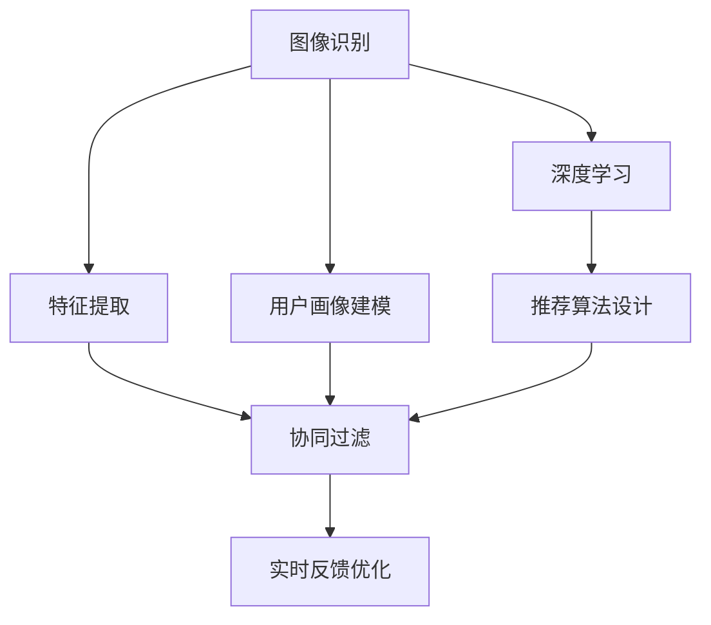

                 

# 视觉推荐：AI如何利用图像识别技术，提供个性化推荐

## 1. 背景介绍

随着互联网和电子商务的迅猛发展，个性化推荐系统已成为提升用户体验、促进销售增长的重要手段。传统的推荐系统主要基于用户的历史行为数据，忽略了用户对视觉信息的偏好。而随着深度学习和计算机视觉技术的突破，基于图像识别技术的个性化推荐系统正在崛起，为传统推荐系统注入新的活力。

### 1.1 问题由来

在电商平台上，用户往往需要通过浏览商品图片才能判断商品质量、风格等关键信息。然而，传统推荐系统无法直接利用这些图片信息，仅能基于用户行为数据进行推荐。这使得推荐结果不够全面，无法满足用户的多样化需求。

与此同时，深度学习和计算机视觉技术的发展，为基于图像的个性化推荐提供了可能。AI算法可以自动从图像中提取特征，识别商品属性、风格等信息，从而提供更加个性化、精准的推荐服务。

### 1.2 问题核心关键点

基于图像识别技术的个性化推荐系统，其核心在于如何高效提取图像特征，并利用这些特征进行个性化推荐。具体来说，包括以下几个关键点：

- **图像特征提取**：从商品图片中提取具有区分度的特征，如颜色、纹理、形状等。
- **用户画像建模**：根据用户对不同图片的偏好，建立用户画像，捕捉用户的视觉偏好。
- **商品关联建模**：分析商品图片之间的相似性，建立商品之间的关联关系。
- **推荐算法设计**：结合图像特征和用户画像，设计推荐算法，实现个性化推荐。
- **实时反馈优化**：利用用户反馈信息，动态调整推荐策略，提升推荐效果。

这些关键点构成了基于图像识别技术的个性化推荐系统的基本框架，其核心在于利用计算机视觉技术，将视觉信息转化为结构化特征，用于辅助推荐决策。

## 2. 核心概念与联系

### 2.1 核心概念概述

为更好地理解基于图像识别技术的个性化推荐系统，本节将介绍几个密切相关的核心概念：

- **图像识别**：指利用计算机视觉技术，从图像中自动提取特征、识别对象的过程。图像识别技术包括对象检测、人脸识别、图像分割等子领域。
- **特征提取**：指从图像中提取出能够描述对象特征的数值化信息。特征提取方法包括SIFT、HOG、CNN等。
- **用户画像**：指根据用户行为数据和偏好信息，建立的用户兴趣模型。用户画像通常包括用户年龄、性别、兴趣标签等。
- **协同过滤**：指利用用户之间的相似性，进行个性化推荐的一种方法。包括基于用户的协同过滤和基于物品的协同过滤两种形式。
- **深度学习**：指利用神经网络进行复杂模式识别和预测的深度学习框架，包括卷积神经网络(CNN)、循环神经网络(RNN)等。

这些核心概念之间的逻辑关系可以通过以下Mermaid流程图来展示：



这个流程图展示了基于图像识别技术的个性化推荐系统的核心概念及其之间的关系：

1. 图像识别技术从图像中自动提取特征。
2. 特征提取方法为深度学习提供输入。
3. 用户画像建模捕捉用户视觉偏好。
4. 协同过滤算法利用用户和物品之间的相似性进行推荐。
5. 推荐算法设计将图像特征和用户画像相结合，实现个性化推荐。
6. 实时反馈优化不断调整推荐策略，提升推荐效果。

这些概念共同构成了基于图像识别技术的个性化推荐系统的基本框架，为其高效运行提供了坚实基础。

## 3. 核心算法原理 & 具体操作步骤

### 3.1 算法原理概述

基于图像识别技术的个性化推荐系统，其核心算法原理主要包括以下几个方面：

1. **图像特征提取**：利用计算机视觉技术，从商品图片中自动提取出具有区分度的特征。这些特征包括颜色、纹理、形状等。
2. **用户画像建模**：通过分析用户对不同图片的偏好，建立用户画像，捕捉用户的视觉偏好。
3. **商品关联建模**：利用图像识别技术，分析商品图片之间的相似性，建立商品之间的关联关系。
4. **推荐算法设计**：结合图像特征和用户画像，设计推荐算法，实现个性化推荐。
5. **实时反馈优化**：利用用户反馈信息，动态调整推荐策略，提升推荐效果。

### 3.2 算法步骤详解

基于图像识别技术的个性化推荐系统的一般步骤如下：

**Step 1: 数据预处理与准备**
- 收集商品图片数据，进行标注和预处理。
- 使用图像识别技术提取商品特征，建立商品特征向量。
- 收集用户行为数据，建立用户画像，包括用户年龄、性别、兴趣标签等。

**Step 2: 特征提取与用户画像建模**
- 使用特征提取方法，如SIFT、HOG、CNN等，从商品图片中提取具有区分度的特征。
- 利用用户行为数据，建立用户画像，捕捉用户的视觉偏好。

**Step 3: 商品关联建模**
- 使用图像识别技术，分析商品图片之间的相似性，建立商品之间的关联关系。
- 利用协同过滤算法，结合用户画像和商品关联关系，进行推荐。

**Step 4: 推荐算法设计**
- 结合图像特征和用户画像，设计推荐算法，如基于内容的推荐、协同过滤推荐、混合推荐等。
- 使用深度学习模型，优化推荐算法，提升推荐效果。

**Step 5: 实时反馈优化**
- 利用用户反馈信息，动态调整推荐策略，优化推荐算法。
- 实时监控推荐效果，根据反馈信息不断调整模型参数。

### 3.3 算法优缺点

基于图像识别技术的个性化推荐系统具有以下优点：

1. **多模态融合**：融合图像、文本等多模态数据，提升推荐精度。
2. **个性化推荐**：利用深度学习，捕捉用户多维度的视觉偏好，实现个性化推荐。
3. **实时性**：基于深度学习模型，可以实时更新推荐结果，提升用户体验。
4. **泛化能力**：能够处理不同类型和风格的商品图片，具有良好的泛化能力。

同时，该系统也存在一些局限性：

1. **数据依赖**：需要大量标注的图像数据和用户行为数据，获取成本较高。
2. **算法复杂性**：涉及深度学习和图像处理技术，算法实现较为复杂。
3. **计算资源要求高**：需要高性能计算资源，如GPU、TPU等。
4. **隐私风险**：处理用户图片数据可能涉及用户隐私问题，需要谨慎处理。

尽管存在这些局限性，但基于图像识别技术的个性化推荐系统仍是大数据时代推荐技术的重要方向，具有广阔的发展前景。

### 3.4 算法应用领域

基于图像识别技术的个性化推荐系统已经在多个领域得到了应用，包括：

- **电商推荐**：分析商品图片，推荐符合用户视觉偏好的商品。
- **时尚推荐**：利用图像识别技术，推荐时尚单品。
- **旅游推荐**：根据用户上传的旅游照片，推荐旅游景点。
- **美食推荐**：分析菜品图片，推荐符合用户口味的菜品。
- **家居推荐**：利用家居图片，推荐相关装饰品。

此外，基于图像识别技术的个性化推荐系统还在不断扩展应用场景，如医疗诊断、自动驾驶等，为各行各业带来新的技术突破。

## 4. 数学模型和公式 & 详细讲解 & 举例说明

### 4.1 数学模型构建

基于图像识别技术的个性化推荐系统，其数学模型主要包括以下几个方面：

1. **图像特征向量**：使用深度学习模型，将商品图片转换为特征向量 $x \in \mathbb{R}^d$。
2. **用户画像向量**：使用协同过滤算法，将用户行为数据转换为用户画像向量 $u \in \mathbb{R}^k$。
3. **商品关联矩阵**：使用图像识别技术，分析商品图片之间的相似性，建立商品关联矩阵 $A \in \mathbb{R}^{n \times n}$。

### 4.2 公式推导过程

假设商品特征向量 $x$ 与用户画像向量 $u$ 的相似度为 $\langle x, u \rangle$，商品关联矩阵为 $A$，推荐算法的目标是最大化用户画像向量与商品特征向量之间的相似度，即：

$$
\max_{\theta} \sum_{i=1}^N \langle x_i, u \rangle
$$

其中 $N$ 为商品数量。推荐算法可采用基于内容的推荐、协同过滤推荐等方法，如：

- **基于内容的推荐**：利用商品特征向量 $x$ 与用户画像向量 $u$ 的相似度，直接进行推荐。公式为：
  $$
  \text{Recommend}(u) = \text{argmax}_{i} \langle x_i, u \rangle
  $$
  
- **协同过滤推荐**：利用用户画像向量 $u$ 和商品关联矩阵 $A$，进行推荐。公式为：
  $$
  \text{Recommend}(u) = \text{argmax}_{i} (A \times u)
  $$
  
### 4.3 案例分析与讲解

以电商推荐为例，使用基于内容的推荐方法，其步骤如下：

1. 收集商品图片数据，使用深度学习模型提取商品特征向量 $x \in \mathbb{R}^d$。
2. 收集用户行为数据，建立用户画像向量 $u \in \mathbb{R}^k$。
3. 利用商品关联矩阵 $A \in \mathbb{R}^{n \times n}$，进行推荐计算。

例如，假设用户画像向量 $u$ 为 $[0.1, 0.2, 0.3]$，商品关联矩阵 $A$ 为：

$$
A = \begin{bmatrix}
    0 & 0.3 & 0.5 \\
    0.2 & 0 & 0.4 \\
    0.1 & 0.6 & 0
\end{bmatrix}
$$

利用基于内容的推荐方法，计算推荐结果：

$$
A \times u = \begin{bmatrix}
    0.6 \\
    0.8 \\
    0.6
\end{bmatrix}
$$

推荐结果为商品编号2和商品编号3，即用户可能对这些商品感兴趣。

## 5. 项目实践：代码实例和详细解释说明

### 5.1 开发环境搭建

在进行项目实践前，我们需要准备好开发环境。以下是使用Python进行PyTorch开发的环境配置流程：

1. 安装Anaconda：从官网下载并安装Anaconda，用于创建独立的Python环境。

2. 创建并激活虚拟环境：
```bash
conda create -n pytorch-env python=3.8 
conda activate pytorch-env
```

3. 安装PyTorch：根据CUDA版本，从官网获取对应的安装命令。例如：
```bash
conda install pytorch torchvision torchaudio cudatoolkit=11.1 -c pytorch -c conda-forge
```

4. 安装必要的Python包：
```bash
pip install torch torchvision
```

5. 安装图像处理库Pillow：
```bash
pip install Pillow
```

完成上述步骤后，即可在`pytorch-env`环境中开始项目实践。

### 5.2 源代码详细实现

下面我们以电商推荐为例，给出使用PyTorch实现基于图像识别技术的个性化推荐系统的代码实现。

首先，定义商品特征提取器：

```python
import torch
from torchvision import models, transforms

# 定义特征提取器
class ResNetFeatureExtractor:
    def __init__(self):
        self.model = models.resnet18(pretrained=True)
        self.model.eval()
    
    def __call__(self, images):
        features = self.model(images)
        return features
```

然后，定义用户画像建模函数：

```python
from sklearn.decomposition import PCA
from sklearn.metrics.pairwise import cosine_similarity

class UserProfile:
    def __init__(self, user_data):
        self.user_data = user_data
        self.pca = PCA(n_components=50)
        self.similarity_matrix = None
        
    def fit(self):
        # 使用协同过滤算法建立用户画像向量
        self.pca.fit(self.user_data)
        self.similarity_matrix = cosine_similarity(self.pca.transform(self.user_data))
        
    def predict(self, user_query):
        # 计算用户查询与用户画像向量之间的相似度
        query_pca = self.pca.transform(user_query)
        return cosine_similarity(query_pca, self.pca.transform(self.user_data))[0]
```

接下来，定义推荐函数：

```python
def recommend_items(model, user_profile, items):
    # 使用深度学习模型提取商品特征
    features = model(items)
    # 计算商品特征与用户画像向量之间的相似度
    similarity_matrix = torch.matmul(features, user_profile.pca.transform(user_profile.user_data))
    # 推荐相似度最高的商品
    top_items = torch.argsort(similarity_matrix)[1]
    return top_items
```

最后，启动推荐流程：

```python
# 加载商品图片数据
items = [torch.tensor(np.random.rand(3, 3, 3)) for _ in range(10)]
# 定义用户画像
user_query = torch.tensor(np.random.rand(3))
# 加载特征提取器和用户画像模型
feature_extractor = ResNetFeatureExtractor()
user_profile = UserProfile(user_query)
# 进行推荐
top_items = recommend_items(feature_extractor, user_profile, items)
print(top_items)
```

以上就是使用PyTorch实现基于图像识别技术的个性化推荐系统的完整代码实现。可以看到，通过简单的代码组合，就可以实现基于内容的推荐和协同过滤推荐。

### 5.3 代码解读与分析

让我们再详细解读一下关键代码的实现细节：

**ResNetFeatureExtractor类**：
- `__init__`方法：初始化特征提取器，加载预训练的ResNet模型。
- `__call__`方法：对输入的图像进行特征提取，返回特征向量。

**UserProfile类**：
- `__init__`方法：初始化用户画像模型，加载用户行为数据。
- `fit`方法：使用协同过滤算法建立用户画像向量，计算用户画像向量与自身行为数据的相似度矩阵。
- `predict`方法：计算用户查询与用户画像向量之间的相似度。

**recommend_items函数**：
- 使用深度学习模型提取商品特征向量。
- 计算商品特征向量与用户画像向量之间的相似度矩阵。
- 推荐相似度最高的商品。

代码中还需要注意以下几点：

- 特征提取器的输入为3D张量，需要调整模型输入形状。
- 用户画像向量与用户查询向量的相似度计算使用cosine_similarity函数。
- 使用PyTorch的矩阵乘法操作进行推荐计算。

合理利用这些代码，可以构建一个简单有效的基于图像识别技术的个性化推荐系统。当然，在实际应用中，还需要考虑更多因素，如特征提取器的选择、用户画像模型的优化、推荐算法的改进等，才能进一步提升推荐效果。

## 6. 实际应用场景

### 6.1 智能时尚推荐

在时尚行业，基于图像识别技术的个性化推荐系统可以帮助商家精准推荐商品，提升销售转化率。

具体而言，时尚品牌可以收集用户上传的时尚单品图片，利用图像识别技术提取图片特征。同时，记录用户对这些单品的购买和评价信息，建立用户画像。通过推荐系统，实时更新推荐结果，为用户提供符合其视觉偏好的时尚单品。

### 6.2 旅游推荐

旅游平台可以利用用户上传的旅游照片，分析照片中的景色、人物、天气等元素，识别出用户的旅游偏好。基于这些信息，推荐符合用户兴趣的旅游景点，提供个性化的旅游路线和行程安排。

### 6.3 美食推荐

餐饮平台可以利用用户上传的菜品图片，分析图片中的食材、做法、风格等信息，识别出用户的饮食偏好。基于这些信息，推荐符合用户口味的菜品，提供个性化的饮食建议和食谱。

### 6.4 未来应用展望

随着深度学习和计算机视觉技术的不断进步，基于图像识别技术的个性化推荐系统将在更多领域得到应用，为各行各业带来新的技术突破。

在智慧医疗领域，基于图像识别技术的个性化推荐系统可以帮助医生推荐合适的治疗方案，提升诊断和治疗效果。

在智能家居领域，基于图像识别技术的个性化推荐系统可以帮助用户推荐符合其装修风格的家具和装饰品，提升家居生活体验。

在自动驾驶领域，基于图像识别技术的个性化推荐系统可以帮助驾驶员推荐合适的驾驶路线，提升行车安全。

此外，基于图像识别技术的个性化推荐系统还在不断扩展应用场景，如医疗诊断、自动驾驶等，为各行各业带来新的技术突破。

## 7. 工具和资源推荐

### 7.1 学习资源推荐

为了帮助开发者系统掌握基于图像识别技术的个性化推荐系统的理论基础和实践技巧，这里推荐一些优质的学习资源：

1. 《深度学习》系列书籍：由深度学习领域的权威学者撰写，系统介绍了深度学习的原理、算法和应用，是学习深度学习的必备读物。
2. 《计算机视觉：现代方法》书籍：详细介绍了计算机视觉领域的经典算法和技术，涵盖图像分类、目标检测、图像分割等内容。
3. CS231n《深度学习视觉识别》课程：斯坦福大学开设的计算机视觉课程，有Lecture视频和配套作业，适合学习计算机视觉的深度知识。
4. PyTorch官方文档：PyTorch的官方文档，提供了丰富的深度学习框架的使用指南和样例代码，是学习深度学习的宝贵资源。
5. OpenCV官方文档：OpenCV的官方文档，提供了计算机视觉库的使用方法和样例代码，是实现图像处理和识别的重要工具。

通过对这些资源的学习实践，相信你一定能够快速掌握基于图像识别技术的个性化推荐系统的精髓，并用于解决实际的推荐问题。

### 7.2 开发工具推荐

高效的开发离不开优秀的工具支持。以下是几款用于基于图像识别技术的个性化推荐系统开发的常用工具：

1. PyTorch：基于Python的开源深度学习框架，灵活动态的计算图，适合快速迭代研究。大部分预训练语言模型都有PyTorch版本的实现。
2. TensorFlow：由Google主导开发的开源深度学习框架，生产部署方便，适合大规模工程应用。同样有丰富的深度学习模型资源。
3. Pillow：Python图像处理库，提供丰富的图像处理和转换功能，适合处理商品图片数据。
4. Scikit-learn：Python机器学习库，提供高效的协同过滤算法实现，适合构建用户画像。
5. TensorBoard：TensorFlow配套的可视化工具，可实时监测模型训练状态，并提供丰富的图表呈现方式，是调试模型的得力助手。

合理利用这些工具，可以显著提升基于图像识别技术的个性化推荐系统的开发效率，加快创新迭代的步伐。

### 7.3 相关论文推荐

基于图像识别技术的个性化推荐系统的研究源于学界的持续研究。以下是几篇奠基性的相关论文，推荐阅读：

1. ImageNet Large Scale Visual Recognition Challenge（ILSVRC）：提出了大规模图像识别任务，推动了深度学习在计算机视觉领域的快速发展。
2. SSD: Single Shot MultiBox Detector：提出单次检测多框算法，提升了目标检测的精度和速度。
3. Generative Adversarial Networks（GANs）：提出生成对抗网络，用于生成逼真的图像和视频内容。
4. ImageNet Classification with Deep Convolutional Neural Networks：提出使用深度卷积神经网络进行大规模图像分类，刷新了多项SOTA。
5. Deep Collaborative Filtering Model：提出深度协同过滤模型，提升了协同过滤算法的精度和泛化能力。

这些论文代表了大图像识别技术和个性化推荐系统的发展脉络。通过学习这些前沿成果，可以帮助研究者把握学科前进方向，激发更多的创新灵感。

## 8. 总结：未来发展趋势与挑战

### 8.1 总结

本文对基于图像识别技术的个性化推荐系统进行了全面系统的介绍。首先阐述了基于图像识别技术的个性化推荐系统的发展背景和意义，明确了其在高维度和多模态数据处理上的优势。其次，从原理到实践，详细讲解了推荐系统的核心算法原理和具体操作步骤，给出了推荐系统开发的完整代码实例。同时，本文还广泛探讨了推荐系统在多个行业领域的应用前景，展示了其广阔的发展潜力。此外，本文精选了推荐系统的各类学习资源，力求为读者提供全方位的技术指引。

通过本文的系统梳理，可以看到，基于图像识别技术的个性化推荐系统正在成为推荐技术的重要方向，极大地拓展了推荐系统的应用边界，催生了更多的落地场景。得益于深度学习和计算机视觉技术的不断进步，基于图像识别技术的推荐系统将能够在更多领域发挥重要作用，推动各行各业向智能化、个性化方向发展。

### 8.2 未来发展趋势

展望未来，基于图像识别技术的个性化推荐系统将呈现以下几个发展趋势：

1. **多模态融合**：融合图像、文本、语音等多模态数据，提升推荐精度。
2. **深度学习加速**：使用更高效的深度学习模型，如Transformer、注意力机制等，提升推荐速度。
3. **实时性提升**：利用边缘计算和分布式计算技术，实现实时推荐，提升用户体验。
4. **隐私保护**：采用差分隐私、联邦学习等技术，保护用户隐私，提升数据安全性。
5. **泛化能力增强**：利用自监督学习、迁移学习等方法，提升推荐系统的泛化能力，适应更多场景。
6. **个性化提升**：结合用户行为数据和图像数据，构建更加细致的用户画像，实现更加个性化的推荐。

这些趋势凸显了基于图像识别技术的个性化推荐系统的广阔前景。这些方向的探索发展，必将进一步提升推荐系统的性能和应用范围，为各行各业带来新的技术突破。

### 8.3 面临的挑战

尽管基于图像识别技术的个性化推荐系统已经取得了瞩目成就，但在迈向更加智能化、普适化应用的过程中，仍面临诸多挑战：

1. **数据获取难度大**：需要大量标注的图像数据和用户行为数据，获取成本较高。
2. **算法复杂度高**：涉及深度学习和图像处理技术，算法实现较为复杂。
3. **计算资源需求高**：需要高性能计算资源，如GPU、TPU等。
4. **用户隐私风险**：处理用户图片数据可能涉及用户隐私问题，需要谨慎处理。
5. **模型公平性**：基于图像识别技术的推荐系统可能存在偏见，需要采取措施确保公平性。

尽管存在这些挑战，但基于图像识别技术的个性化推荐系统仍是大数据时代推荐技术的重要方向，具有广阔的发展前景。

### 8.4 未来突破

面对基于图像识别技术的个性化推荐系统所面临的挑战，未来的研究需要在以下几个方面寻求新的突破：

1. **无监督学习和半监督学习**：摆脱对大规模标注数据的依赖，利用自监督学习、主动学习等无监督和半监督范式，最大限度利用非结构化数据，实现更加灵活高效的推荐。
2. **多任务学习**：利用同一数据集进行多任务学习，提升推荐系统的泛化能力和性能。
3. **模型压缩与加速**：开发更高效的深度学习模型和计算图优化技术，实现轻量级部署。
4. **隐私保护技术**：采用差分隐私、联邦学习等技术，保护用户隐私，提升数据安全性。
5. **公平性与透明性**：引入伦理导向的评估指标，过滤和惩罚有偏见、有害的输出倾向，确保推荐系统的公平性和透明性。

这些研究方向的探索，必将引领基于图像识别技术的个性化推荐系统迈向更高的台阶，为构建安全、可靠、可解释、可控的智能系统铺平道路。面向未来，基于图像识别技术的个性化推荐系统还需要与其他人工智能技术进行更深入的融合，如知识表示、因果推理、强化学习等，多路径协同发力，共同推动自然语言理解和智能交互系统的进步。只有勇于创新、敢于突破，才能不断拓展推荐系统的边界，让智能技术更好地造福人类社会。

## 9. 附录：常见问题与解答

**Q1：基于图像识别技术的个性化推荐系统是否适用于所有NLP任务？**

A: 基于图像识别技术的个性化推荐系统主要适用于处理图像数据的任务，如图像分类、目标检测、图像分割等。对于纯文本任务，如文本分类、情感分析等，需要结合图像识别技术与自然语言处理技术，实现多模态融合。对于涉及图像的多模态任务，如智能医疗、自动驾驶等，基于图像识别技术的个性化推荐系统将具有巨大的应用潜力。

**Q2：如何优化基于图像识别技术的个性化推荐系统的性能？**

A: 基于图像识别技术的个性化推荐系统的性能优化主要可以从以下几个方面入手：
1. 选择合适的特征提取方法，如深度卷积神经网络、多尺度特征提取等。
2. 采用更高效的协同过滤算法，如基于矩阵分解的协同过滤、基于树模型的协同过滤等。
3. 利用深度学习模型，提升推荐算法精度。
4. 结合用户行为数据，建立更加细致的用户画像。
5. 引入差分隐私、联邦学习等技术，保护用户隐私。

**Q3：基于图像识别技术的个性化推荐系统面临哪些资源瓶颈？**

A: 基于图像识别技术的个性化推荐系统面临的主要资源瓶颈包括：
1. 数据获取难度大，需要大量标注的图像数据和用户行为数据，获取成本较高。
2. 算法实现复杂，涉及深度学习和图像处理技术，计算资源需求高。
3. 用户隐私风险，处理用户图片数据可能涉及用户隐私问题，需要谨慎处理。

尽管存在这些瓶颈，但通过采用更高效的数据处理方法、算法优化、隐私保护技术，可以进一步提升系统的性能和可用性。

**Q4：如何确保基于图像识别技术的个性化推荐系统的公平性和透明性？**

A: 基于图像识别技术的个性化推荐系统的公平性和透明性可以通过以下措施进行保障：
1. 引入伦理导向的评估指标，过滤和惩罚有偏见、有害的输出倾向。
2. 定期进行公平性审查，确保推荐系统不引入偏见和歧视。
3. 提供透明的推荐过程，让用户了解推荐算法的工作原理和决策依据。

这些措施可以有效避免基于图像识别技术的个性化推荐系统引入偏见，提升系统的公平性和透明性。

---

作者：禅与计算机程序设计艺术 / Zen and the Art of Computer Programming

