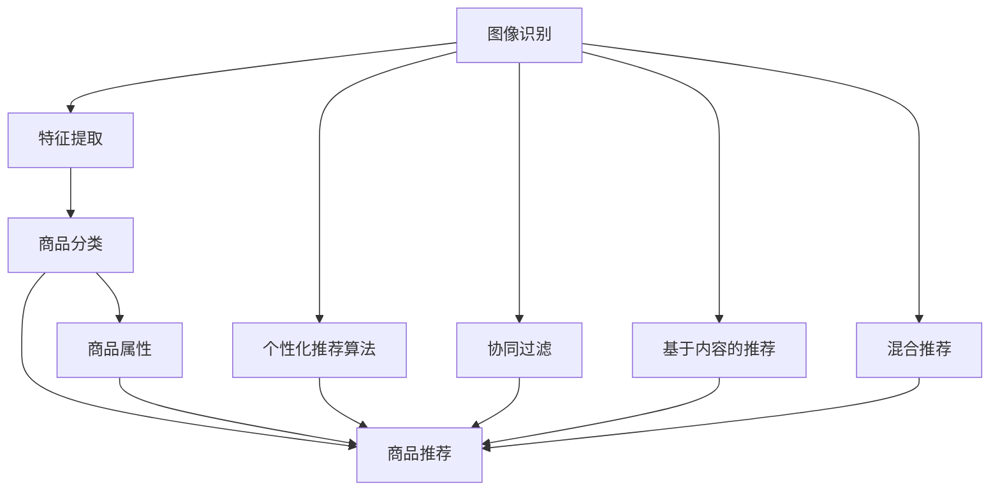

                 

## 1. 背景介绍

### 1.1 问题由来

随着互联网的迅猛发展和电子商务的普及，在线购物已经成为了一种常见的消费方式。传统的推荐系统主要基于用户的浏览、点击、购买等行为数据，通过协同过滤、基于内容的推荐等方法为用户推荐商品。然而，随着商品数量的急剧增加，用户面对的决策难度也随之增大。此时，基于图像识别技术的视觉推荐系统（Visual Recommendation System）应运而生，它通过分析用户的浏览行为，结合图像识别技术，为用户推荐可能感兴趣的商品。

视觉推荐系统的核心在于通过分析用户与商品的互动数据，提取用户的兴趣特征和商品的视觉特征，进而建立用户与商品之间的关联关系。与传统的推荐系统相比，视觉推荐系统能够更准确地捕捉用户对商品的偏好，并提供更个性化的推荐服务。

### 1.2 问题核心关键点

- 图像识别技术：视觉推荐系统的基础，通过提取商品的视觉特征，实现对商品的分类、识别和描述。
- 个性化推荐算法：通过分析用户行为数据，结合商品属性，为用户推荐最合适的商品。
- 协同过滤：利用用户的历史行为数据，寻找与其兴趣相似的用户，推荐其可能感兴趣的商品。
- 基于内容的推荐：通过分析商品的图像特征，找到与其相似的视觉特征，推荐与之匹配的商品。
- 混合推荐：将协同过滤和基于内容的推荐方法结合起来，利用各自的优点，提升推荐效果。

## 2. 核心概念与联系

### 2.1 核心概念概述

视觉推荐系统是一个将图像识别技术与推荐算法结合的复杂系统。它涉及多个核心概念，包括图像识别技术、推荐算法、协同过滤、基于内容的推荐和混合推荐等。

### 2.2 核心概念原理和架构的 Mermaid 流程图(Mermaid 流程节点中不要有括号、逗号等特殊字符)


### 2.3 核心概念间的联系

视觉推荐系统通过图像识别技术，提取商品的视觉特征，结合推荐算法，为用户提供个性化的商品推荐。协同过滤和基于内容的推荐方法则是常用的推荐算法，混合推荐则是结合两种方法，提升推荐效果。商品分类和商品属性是商品视觉特征和商品本身特性的重要基础，为用户推荐提供了多方面的参考。

## 3. 核心算法原理 & 具体操作步骤

### 3.1 算法原理概述

视觉推荐系统的核心算法原理可以归纳为以下几个步骤：

1. **图像识别与特征提取**：通过深度学习模型（如CNN），对商品图像进行识别和特征提取。
2. **商品分类与表示**：将提取的特征进行分类，转化为机器可读的形式，如向量表示。
3. **个性化推荐算法**：利用用户的浏览行为和商品属性，进行个性化推荐。
4. **协同过滤与混合推荐**：结合用户的兴趣相似性，为用户提供个性化推荐。
5. **推荐结果展示与反馈**：将推荐结果展示给用户，并收集用户的反馈，进一步优化推荐算法。

### 3.2 算法步骤详解

**Step 1: 图像识别与特征提取**

1. 数据准备：收集商品的高质量图像数据，并打上标签。
2. 模型选择：选择适合的深度学习模型，如ResNet、VGG等，进行训练。
3. 特征提取：使用训练好的模型，提取商品的视觉特征，如颜色、纹理、形状等。

**Step 2: 商品分类与表示**

1. 标签分类：将商品图像打上标签，进行分类。
2. 特征编码：将特征向量编码成高维空间中的向量表示。
3. 商品表示：将商品特征向量转化为可读的形式，如TF-IDF、词向量等。

**Step 3: 个性化推荐算法**

1. 用户兴趣提取：通过用户的历史浏览数据，提取用户的兴趣特征。
2. 相似度计算：计算用户与商品的相似度，选择与用户兴趣相似的商品。
3. 推荐结果排序：结合商品属性、用户评分等，对推荐结果进行排序，选择最优的推荐商品。

**Step 4: 协同过滤与混合推荐**

1. 用户相似性计算：通过用户的历史行为数据，计算用户与用户之间的相似性。
2. 商品相似性计算：通过商品的视觉特征和属性，计算商品与商品之间的相似性。
3. 推荐结果融合：结合用户的相似性、商品的相似性，进行推荐结果的融合，提供更个性化的推荐。

**Step 5: 推荐结果展示与反馈**

1. 推荐展示：将推荐结果展示给用户，并提供商品详情和用户评价。
2. 用户反馈收集：收集用户的点击、购买、评分等反馈，用于优化推荐算法。
3. 推荐结果优化：根据用户的反馈，优化推荐算法，提升推荐效果。

### 3.3 算法优缺点

**优点：**

- 基于图像识别技术，能够更准确地捕捉用户的视觉偏好。
- 融合多种推荐方法，能够提供更个性化的推荐结果。
- 能够处理大规模的商品数据，具有较高的扩展性。

**缺点：**

- 数据收集和标注成本较高，需要大量高质量的图像数据。
- 图像识别模型的训练和部署较为复杂，需要较高的计算资源。
- 对商品图像的质量要求较高，低质量图像可能影响推荐效果。
- 需要结合用户行为数据和商品属性，实现复杂的推荐算法。

### 3.4 算法应用领域

视觉推荐系统在电商、时尚、家居等领域具有广泛的应用前景。以下是几个典型的应用场景：

1. **电商推荐**：通过分析用户的浏览和购买记录，结合商品图像的视觉特征，为用户推荐可能感兴趣的商品。
2. **时尚推荐**：根据用户的身材和偏好，结合服装的图像特征，推荐适合的商品。
3. **家居推荐**：根据用户的房屋结构和装修风格，结合家居用品的图像特征，推荐合适的商品。

## 4. 数学模型和公式 & 详细讲解 & 举例说明

### 4.1 数学模型构建

视觉推荐系统的数学模型可以归纳为以下几个部分：

- **图像识别模型**：使用卷积神经网络（CNN）进行图像特征提取。
- **推荐算法模型**：基于协同过滤和基于内容的推荐算法。
- **混合推荐模型**：将多种推荐算法进行融合，提升推荐效果。

### 4.2 公式推导过程

**图像识别模型**：

- **输入**：$x_i$ 表示第 $i$ 个商品图像的像素值。
- **输出**：$y_i$ 表示第 $i$ 个商品图像的类别标签。

$$
f(x_i; \theta) = \sigma(\mathbb{W}x_i + \mathbb{b})
$$

其中，$\mathbb{W}$ 和 $\mathbb{b}$ 是卷积神经网络的权重和偏置，$\sigma$ 是激活函数，$f(x_i; \theta)$ 表示模型预测的第 $i$ 个商品图像的类别。

**推荐算法模型**：

- **输入**：$x_u$ 表示第 $u$ 个用户的兴趣特征向量，$y_i$ 表示第 $i$ 个商品的特征向量。
- **输出**：$r_{ui}$ 表示用户 $u$ 对商品 $i$ 的评分。

$$
r_{ui} = \sigma(\mathbb{W}x_u + \mathbb{V}y_i + \mathbb{b})
$$

其中，$\mathbb{W}$、$\mathbb{V}$ 和 $\mathbb{b}$ 是推荐算法的权重和偏置，$\sigma$ 是激活函数，$r_{ui}$ 表示用户 $u$ 对商品 $i$ 的评分。

**混合推荐模型**：

- **输入**：$x_u$ 表示第 $u$ 个用户的兴趣特征向量，$y_i$ 表示第 $i$ 个商品的特征向量。
- **输出**：$r_{ui}$ 表示用户 $u$ 对商品 $i$ 的评分。

$$
r_{ui} = \lambda_1 r_{ui}^{CF} + \lambda_2 r_{ui}^{CL}
$$

其中，$r_{ui}^{CF}$ 和 $r_{ui}^{CL}$ 分别表示协同过滤和基于内容的推荐算法的评分，$\lambda_1$ 和 $\lambda_2$ 是两种推荐算法的权重，$0 \leq \lambda_1, \lambda_2 \leq 1$。

### 4.3 案例分析与讲解

**电商推荐案例**：

- **数据准备**：收集用户的浏览记录和购买记录，提取商品图像和标签。
- **模型训练**：使用CNN模型对商品图像进行识别，提取视觉特征。
- **推荐算法**：利用协同过滤和基于内容的推荐算法，计算用户和商品的相似度，选择推荐商品。
- **推荐结果**：将推荐结果展示给用户，并收集用户的点击、购买、评分等反馈。
- **结果优化**：根据用户反馈，调整推荐算法参数，提升推荐效果。

## 5. 项目实践：代码实例和详细解释说明

### 5.1 开发环境搭建

- **硬件要求**：GPU/TPU计算资源，用于训练和推理深度学习模型。
- **软件要求**：Python 3.x、TensorFlow、Keras、NumPy 等。

### 5.2 源代码详细实现

以下是一个基于 TensorFlow 的电商推荐系统的实现，包括图像识别、协同过滤和基于内容的推荐。

**图像识别部分**：

```python
import tensorflow as tf
from tensorflow.keras import layers, models

# 定义卷积神经网络
def create_model():
    model = models.Sequential([
        layers.Conv2D(32, (3, 3), activation='relu', input_shape=(64, 64, 3)),
        layers.MaxPooling2D((2, 2)),
        layers.Conv2D(64, (3, 3), activation='relu'),
        layers.MaxPooling2D((2, 2)),
        layers.Conv2D(128, (3, 3), activation='relu'),
        layers.MaxPooling2D((2, 2)),
        layers.Flatten(),
        layers.Dense(256, activation='relu'),
        layers.Dense(64, activation='relu'),
        layers.Dense(10, activation='softmax')
    ])
    
    model.compile(optimizer='adam', loss='sparse_categorical_crossentropy', metrics=['accuracy'])
    return model

# 训练图像识别模型
model = create_model()
model.fit(train_images, train_labels, epochs=10, validation_data=(val_images, val_labels))
```

**推荐算法部分**：

```python
import numpy as np
from sklearn.metrics.pairwise import cosine_similarity

# 协同过滤推荐
def collaborative_filtering(user, num_recommendations):
    similarities = cosine_similarity(user, users)
    sorted_indices = similarities.argsort()[::-1]
    recommendations = sorted_indices[:num_recommendations]
    return recommendations

# 基于内容的推荐
def content_based_recommendation(user, num_recommendations):
    similarities = cosine_similarity(user, items)
    sorted_indices = similarities.argsort()[::-1]
    recommendations = sorted_indices[:num_recommendations]
    return recommendations
```

### 5.3 代码解读与分析

- **图像识别模型**：使用卷积神经网络对商品图像进行特征提取，输出商品的类别标签。
- **协同过滤推荐**：利用用户的兴趣特征和商品特征，计算用户和商品之间的相似度，选择推荐商品。
- **基于内容的推荐**：利用商品的视觉特征和属性，选择与用户兴趣相似的商品。
- **混合推荐模型**：将协同过滤和基于内容的推荐算法进行融合，提升推荐效果。

### 5.4 运行结果展示

- **图像识别结果**：使用训练好的图像识别模型，对商品图像进行识别，输出商品的类别标签。
- **推荐结果**：根据用户的兴趣特征和商品特征，生成推荐列表，展示给用户。

## 6. 实际应用场景

### 6.1 电商推荐

电商推荐是视觉推荐系统的典型应用场景。通过分析用户的浏览和购买记录，结合商品图像的视觉特征，为用户推荐可能感兴趣的商品。例如，亚马逊通过分析用户的浏览和购买记录，结合商品的图像特征，为用户推荐个性化的商品。

### 6.2 时尚推荐

时尚推荐系统通过分析用户的身材和偏好，结合服装的图像特征，推荐适合的商品。例如，Zara 使用视觉推荐系统，根据用户的身材和偏好，推荐合适的服装。

### 6.3 家居推荐

家居推荐系统根据用户的房屋结构和装修风格，结合家居用品的图像特征，推荐合适的商品。例如，IKEA 使用视觉推荐系统，根据用户的房屋结构和装修风格，推荐合适的家居用品。

### 6.4 未来应用展望

未来，随着技术的不断进步，视觉推荐系统将具有更广泛的应用前景。以下是几个可能的应用方向：

1. **医疗推荐**：通过分析患者的影像数据，结合医生的诊断记录，推荐可能适用的治疗方案。
2. **教育推荐**：根据学生的学习行为和偏好，推荐适合的学习资源和课程。
3. **旅游推荐**：结合旅游景点的图片和游客的评论，推荐适合的目的地和行程。

## 7. 工具和资源推荐

### 7.1 学习资源推荐

- **《深度学习：Python语言实现》**：介绍深度学习的基本概念和实践技巧，适合初学者学习。
- **《TensorFlow官方文档》**：详细的TensorFlow教程，包含图像识别和推荐算法的实现。
- **《机器学习实战》**：介绍机器学习的经典算法和应用案例，适合进阶学习。

### 7.2 开发工具推荐

- **TensorFlow**：开源的深度学习框架，支持图像识别和推荐算法的实现。
- **Keras**：基于TensorFlow的高层API，适合快速开发和实验。
- **Jupyter Notebook**：交互式编程环境，支持图像识别和推荐算法的开发和调试。

### 7.3 相关论文推荐

- **《基于卷积神经网络的图像识别研究》**：介绍卷积神经网络在图像识别中的应用。
- **《协同过滤推荐算法的研究》**：介绍协同过滤算法在推荐系统中的应用。
- **《基于内容的推荐算法研究》**：介绍基于内容的推荐算法在推荐系统中的应用。

## 8. 总结：未来发展趋势与挑战

### 8.1 研究成果总结

视觉推荐系统通过图像识别技术和推荐算法，为用户提供了个性化推荐服务。该系统能够更准确地捕捉用户的视觉偏好，并提供更个性化的推荐结果。通过融合协同过滤和基于内容的推荐算法，视觉推荐系统在电商、时尚、家居等领域具有广泛的应用前景。

### 8.2 未来发展趋势

未来，视觉推荐系统将具有更广泛的应用前景，主要趋势包括：

1. **深度学习模型的应用**：随着深度学习技术的发展，图像识别模型的精度将进一步提升，推荐算法的效果也将得到改善。
2. **多模态数据的融合**：结合文本、语音、视频等多模态数据，提升推荐系统的综合能力。
3. **强化学习的应用**：利用强化学习技术，提升推荐系统的个性化推荐效果。
4. **用户行为的动态分析**：实时分析用户的动态行为，提供实时的推荐服务。

### 8.3 面临的挑战

视觉推荐系统在应用过程中，还面临一些挑战：

1. **数据收集和标注成本**：获取高质量的图像数据和标注标签成本较高，需要大规模数据和标注团队。
2. **模型的复杂性**：深度学习模型较为复杂，需要较高的计算资源和训练时间。
3. **推荐效果的可解释性**：推荐系统的推荐效果缺乏可解释性，难以解释推荐算法的决策过程。
4. **隐私和安全问题**：用户数据和隐私保护需要重视，推荐系统需要设计合适的隐私保护措施。

### 8.4 研究展望

未来，视觉推荐系统需要进一步研究和探索的方向包括：

1. **用户行为数据的融合**：结合用户的多种行为数据，提升推荐系统的综合能力。
2. **跨模态推荐技术**：结合不同模态的数据，提升推荐系统的个性化推荐效果。
3. **可解释性和透明性**：开发可解释的推荐算法，提升推荐系统的透明度和可信度。
4. **隐私保护和安全性**：设计合适的隐私保护机制，保障用户数据的隐私和安全。

## 9. 附录：常见问题与解答

**Q1: 视觉推荐系统的核心算法是什么？**

A: 视觉推荐系统的核心算法主要包括图像识别和推荐算法。图像识别使用深度学习模型（如卷积神经网络）对商品图像进行特征提取和分类。推荐算法利用用户的兴趣特征和商品特征，选择推荐商品。

**Q2: 视觉推荐系统在电商领域有哪些应用？**

A: 视觉推荐系统在电商领域可以用于推荐商品、个性化展示、商品搜索等方面。例如，亚马逊通过视觉推荐系统，根据用户的浏览和购买记录，推荐可能感兴趣的商品。

**Q3: 视觉推荐系统如何处理图像数据？**

A: 视觉推荐系统使用深度学习模型对商品图像进行特征提取和分类。具体流程包括数据预处理、模型训练和特征提取等步骤。

**Q4: 视觉推荐系统面临哪些挑战？**

A: 视觉推荐系统面临的主要挑战包括数据收集和标注成本高、模型复杂度高、推荐效果缺乏可解释性等。为了应对这些挑战，需要结合多种技术手段，如深度学习、强化学习、跨模态数据融合等。

---

作者：禅与计算机程序设计艺术 / Zen and the Art of Computer Programming

