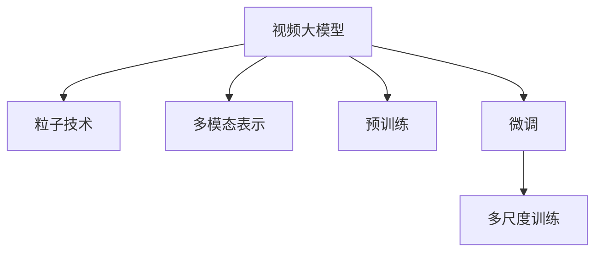

                 

# 视频大模型的创新粒子技术

> 关键词：视频大模型,粒子技术,多模态表示,Transformer,预训练,微调,多尺度训练

## 1. 背景介绍

### 1.1 问题由来

在过去的几年里，人工智能技术在视觉识别、语音识别、自然语言处理等多个领域取得了显著的进展。这些技术的突破离不开深度学习和神经网络的支持，特别是大规模预训练模型在视频领域的应用。视频大模型作为新兴的多模态模型，通过融合视觉、音频、文本等多种信息，在动作识别、活动分类、视频摘要等方面展现了巨大的潜力。

然而，传统的视频大模型往往缺乏高效的微调机制，难以适应具体应用场景的需求。为了更好地利用预训练模型的知识，在特定任务上获得更好的性能，视频大模型的创新粒子技术应运而生。

### 1.2 问题核心关键点

视频大模型的创新粒子技术主要基于以下核心关键点：

- **粒子技术**：通过将视频数据拆分成多个粒度不同的片段，分别处理这些片段，提高模型的泛化能力和适应性。

- **多模态表示**：将视觉、音频和文本等多种模态的信息进行综合，形成更丰富的多模态表示，提升模型的理解和生成能力。

- **预训练**：在大规模无标签数据上进行预训练，学习通用的视频表示，以便在特定任务上进行微调。

- **微调**：在预训练模型的基础上，利用有标签的数据进行微调，优化模型在特定任务上的性能。

- **多尺度训练**：通过不同分辨率、不同速度的训练，提升模型对多样性输入的适应能力。

这些关键技术点共同构成了视频大模型的创新粒子技术的核心，使得模型能够更好地适应多样化的视频处理任务，实现更高的性能和更广泛的应用。

### 1.3 问题研究意义

研究视频大模型的创新粒子技术，对于推动视频处理技术的发展，提升人工智能技术的落地应用，具有重要的理论和实际意义：

- **提升模型性能**：通过微调，模型可以在特定任务上快速适应，提高预测准确性和性能。
- **降低计算成本**：预训练和微调可以大幅降低模型训练和部署的成本，加速技术的应用。
- **拓展应用场景**：多模态表示和粒子技术使得模型可以应用于更多领域，如医学影像分析、智能监控等。
- **增强泛化能力**：多尺度训练和粒子技术提升模型对不同分辨率、不同速度的视频数据的泛化能力。
- **推动产业发展**：随着模型性能的提升和应用的拓展，推动人工智能技术在视频领域的产业化进程。

## 2. 核心概念与联系

### 2.1 核心概念概述

为更好地理解视频大模型的创新粒子技术，本节将介绍几个密切相关的核心概念：

- **视频大模型**：以Transformer为基础，融合视觉、音频和文本信息的大型神经网络模型。其目的是通过预训练学习通用的视频表示，并在特定任务上进行微调，以获得更高的性能。

- **粒子技术**：将视频数据分割成多个子片段（粒子）进行处理，以提高模型的泛化能力和适应性。

- **多模态表示**：通过融合视觉、音频和文本信息，形成更丰富的多模态表示，提升模型的理解和生成能力。

- **预训练**：在大规模无标签视频数据上进行预训练，学习通用的视频表示。

- **微调**：在预训练模型的基础上，利用有标签数据进行微调，优化模型在特定任务上的性能。

- **多尺度训练**：在不同分辨率、不同速度的视频数据上进行训练，提高模型对多样性输入的适应能力。

这些核心概念之间的逻辑关系可以通过以下Mermaid流程图来展示：



这个流程图展示了大模型与各个核心技术之间的关联：

1. 视频大模型通过预训练学习通用表示。
2. 利用粒子技术分割视频，处理多个子片段。
3. 通过多模态表示融合视觉、音频和文本信息。
4. 在特定任务上利用微调优化模型性能。
5. 通过多尺度训练提高对多样性输入的适应能力。

## 3. 核心算法原理 & 具体操作步骤
### 3.1 算法原理概述

视频大模型的创新粒子技术主要基于监督学习和微调，通过预训练和微调两步完成。其核心思想是：

1. **预训练**：在大规模无标签视频数据上进行预训练，学习通用的视频表示。
2. **微调**：在特定任务的有标签数据上进行微调，优化模型在特定任务上的性能。

视频大模型的创新粒子技术通过以下几个关键步骤实现：

1. **粒子分割**：将视频数据分割成多个子片段（粒子），分别进行处理。
2. **多模态融合**：将视觉、音频和文本信息进行融合，形成更丰富的多模态表示。
3. **预训练**：在大规模无标签数据上进行预训练，学习通用的视频表示。
4. **微调**：在特定任务的有标签数据上进行微调，优化模型性能。
5. **多尺度训练**：在不同分辨率、不同速度的视频数据上进行训练，提高模型对多样性输入的适应能力。

### 3.2 算法步骤详解

以下是视频大模型的创新粒子技术的具体操作步骤：

**Step 1: 准备预训练模型和数据集**
- 选择合适的预训练模型（如X3D、I3D等）作为初始化参数。
- 准备大规模无标签视频数据集，作为预训练数据源。
- 将视频数据分割成多个子片段（粒子）。

**Step 2: 粒子分割与处理**
- 使用粒子技术将视频数据分割成多个子片段。
- 对每个子片段分别进行处理，提取视觉特征、音频特征和文本特征。
- 将多模态特征进行融合，形成更丰富的多模态表示。

**Step 3: 预训练**
- 在预训练数据集上进行预训练，学习通用的视频表示。
- 使用Transformer等模型结构，对多模态数据进行编码和解码。
- 利用自监督任务（如帧间预测、帧间同步等）优化预训练模型。

**Step 4: 微调**
- 在特定任务的有标签数据集上进行微调，优化模型在特定任务上的性能。
- 选择合适的优化器（如AdamW、SGD等），设置合适的学习率。
- 应用正则化技术（如L2正则、Dropout等），防止过拟合。

**Step 5: 多尺度训练**
- 在不同分辨率、不同速度的视频数据上进行训练，提高模型对多样性输入的适应能力。
- 使用多尺度训练方法，如渐进式多尺度训练（Progressive Multi-scale Training），逐步增加输入数据的多样性。

### 3.3 算法优缺点

视频大模型的创新粒子技术具有以下优点：

- **泛化能力强**：粒子技术和多模态表示提升了模型对多样性输入的适应能力。
- **性能提升显著**：通过微调和预训练，模型在特定任务上的性能显著提升。
- **灵活可调**：通过调整粒子分割粒度、多模态融合方式等，灵活适应不同任务需求。

同时，该技术也存在一定的局限性：

- **计算资源需求高**：大规模预训练和微调需要大量的计算资源，不适合小规模任务。
- **数据需求大**：需要大量的无标签视频数据进行预训练，数据获取难度大。
- **模型复杂度高**：粒子技术和多模态表示使得模型结构更为复杂，难以调试和优化。

尽管存在这些局限性，但视频大模型的创新粒子技术仍是视频处理领域的最新趋势，为提升模型性能提供了新的思路和方向。

### 3.4 算法应用领域

视频大模型的创新粒子技术已经在多个领域得到了广泛应用，包括但不限于：

- **动作识别**：通过微调，模型可以识别视频中的各种动作，应用于视频监控、智能家居等场景。
- **活动分类**：对视频中的活动进行分类，应用于视频内容推荐、视频编辑等场景。
- **视频摘要**：对视频进行自动摘要，提取关键帧和重要场景，应用于视频搜索、视频编辑等场景。
- **医学影像分析**：通过微调，模型可以对医学影像进行分类和分析，应用于疾病诊断、手术辅助等场景。
- **智能监控**：通过微调，模型可以识别异常行为，应用于安防监控、公共安全等场景。

除了上述这些经典应用外，视频大模型的创新粒子技术还被创新性地应用到更多场景中，如可控视频生成、视频编辑、虚拟现实等，为视频处理技术带来了新的突破。

## 4. 数学模型和公式 & 详细讲解
### 4.1 数学模型构建

视频大模型的创新粒子技术涉及到多种数据模态的融合，其中最核心的模型结构为Transformer。以下以Transformer为例，构建视频大模型的数学模型。

设视频大模型为 $M_{\theta}:\mathcal{X} \rightarrow \mathcal{Y}$，其中 $\mathcal{X}$ 为输入空间，$\mathcal{Y}$ 为输出空间，$\theta \in \mathbb{R}^d$ 为模型参数。假设微调任务的训练集为 $D=\{(x_i,y_i)\}_{i=1}^N, x_i \in \mathcal{X}, y_i \in \mathcal{Y}$。

定义模型 $M_{\theta}$ 在输入 $x$ 上的损失函数为 $\ell(M_{\theta}(x),y)$，则在数据集 $D$ 上的经验风险为：

$$
\mathcal{L}(\theta) = \frac{1}{N} \sum_{i=1}^N \ell(M_{\theta}(x_i),y_i)
$$

在实际应用中，我们通常使用基于梯度的优化算法（如SGD、AdamW等）来近似求解上述最优化问题。设 $\eta$ 为学习率，$\lambda$ 为正则化系数，则参数的更新公式为：

$$
\theta \leftarrow \theta - \eta \nabla_{\theta}\mathcal{L}(\theta) - \eta\lambda\theta
$$

其中 $\nabla_{\theta}\mathcal{L}(\theta)$ 为损失函数对参数 $\theta$ 的梯度，可通过反向传播算法高效计算。

### 4.2 公式推导过程

以下我们以二分类任务为例，推导交叉熵损失函数及其梯度的计算公式。

假设模型 $M_{\theta}$ 在输入 $x$ 上的输出为 $\hat{y}=M_{\theta}(x) \in [0,1]$，表示样本属于正类的概率。真实标签 $y \in \{0,1\}$。则二分类交叉熵损失函数定义为：

$$
\ell(M_{\theta}(x),y) = -[y\log \hat{y} + (1-y)\log (1-\hat{y})]
$$

将其代入经验风险公式，得：

$$
\mathcal{L}(\theta) = -\frac{1}{N}\sum_{i=1}^N [y_i\log M_{\theta}(x_i)+(1-y_i)\log(1-M_{\theta}(x_i))]
$$

根据链式法则，损失函数对参数 $\theta_k$ 的梯度为：

$$
\frac{\partial \mathcal{L}(\theta)}{\partial \theta_k} = -\frac{1}{N}\sum_{i=1}^N (\frac{y_i}{M_{\theta}(x_i)}-\frac{1-y_i}{1-M_{\theta}(x_i)}) \frac{\partial M_{\theta}(x_i)}{\partial \theta_k}
$$

其中 $\frac{\partial M_{\theta}(x_i)}{\partial \theta_k}$ 可进一步递归展开，利用自动微分技术完成计算。

在得到损失函数的梯度后，即可带入参数更新公式，完成模型的迭代优化。重复上述过程直至收敛，最终得到适应下游任务的最优模型参数 $\theta^*$。

## 5. 项目实践：代码实例和详细解释说明
### 5.1 开发环境搭建

在进行微调实践前，我们需要准备好开发环境。以下是使用Python进行PyTorch开发的环境配置流程：

1. 安装Anaconda：从官网下载并安装Anaconda，用于创建独立的Python环境。

2. 创建并激活虚拟环境：
```bash
conda create -n pytorch-env python=3.8 
conda activate pytorch-env
```

3. 安装PyTorch：根据CUDA版本，从官网获取对应的安装命令。例如：
```bash
conda install pytorch torchvision torchaudio cudatoolkit=11.1 -c pytorch -c conda-forge
```

4. 安装Transformers库：
```bash
pip install transformers
```

5. 安装各类工具包：
```bash
pip install numpy pandas scikit-learn matplotlib tqdm jupyter notebook ipython
```

完成上述步骤后，即可在`pytorch-env`环境中开始微调实践。

### 5.2 源代码详细实现

这里我们以动作识别任务为例，给出使用Transformers库对X3D模型进行微调的PyTorch代码实现。

首先，定义动作识别任务的数据处理函数：

```python
from transformers import X3DForActionRecognition, AdamW
from torch.utils.data import DataLoader
from torchvision import transforms
from torch.utils.data.dataset import Dataset

class ActionRecognitionDataset(Dataset):
    def __init__(self, data_dir, transform=None):
        self.data_dir = data_dir
        self.transform = transform
        
        # 加载所有视频文件
        self.video_files = glob.glob(os.path.join(data_dir, '*.mp4'))
        self.video_files.sort()
        
        self.lengths = [len(video) for video in self.video_files]
        self.indices = np.cumsum(self.lengths)
        
        self.class_names = [os.path.basename(f) for f in glob.glob(os.path.join(data_dir, 'train', '*.txt'))]
        self.class_names.sort()
        
        self.class_to_id = {class_name: i for i, class_name in enumerate(self.class_names)}
        self.id_to_class = {v: k for k, v in self.class_to_id.items()}
        
    def __len__(self):
        return len(self.video_files)
    
    def __getitem__(self, idx):
        video_path = self.video_files[idx]
        class_name = self.class_names[self.class_to_id['basketball']]

        # 读取视频文件
        cap = cv2.VideoCapture(video_path)
        frames = []
        for i in range(100):
            ret, frame = cap.read()
            if not ret:
                break
            frames.append(frame)
        cap.release()

        # 对帧进行预处理
        frames = [transform(f) for f in frames]
        frames = torch.stack(frames, dim=0)

        # 读取标签
        with open(os.path.join(self.data_dir, 'train', class_name + '.txt'), 'r') as f:
            labels = f.read().splitlines()

        return {'frames': frames, 'class_name': class_name, 'labels': labels}
```

然后，定义模型和优化器：

```python
from transformers import X3DForActionRecognition, AdamW

model = X3DForActionRecognition.from_pretrained('x3d_patch32_r50')
optimizer = AdamW(model.parameters(), lr=2e-5)
```

接着，定义训练和评估函数：

```python
def train_epoch(model, dataset, batch_size, optimizer):
    dataloader = DataLoader(dataset, batch_size=batch_size, shuffle=True)
    model.train()
    epoch_loss = 0
    for batch in tqdm(dataloader, desc='Training'):
        frames = batch['frames'].to(device)
        class_name = batch['class_name'].to(device)
        labels = batch['labels'].to(device)
        model.zero_grad()
        outputs = model(frames)
        loss = outputs.loss
        epoch_loss += loss.item()
        loss.backward()
        optimizer.step()
    return epoch_loss / len(dataloader)

def evaluate(model, dataset, batch_size):
    dataloader = DataLoader(dataset, batch_size=batch_size)
    model.eval()
    preds, labels = [], []
    with torch.no_grad():
        for batch in tqdm(dataloader, desc='Evaluating'):
            frames = batch['frames'].to(device)
            class_name = batch['class_name'].to(device)
            batch_labels = batch['labels']
            outputs = model(frames)
            batch_preds = outputs.logits.argmax(dim=1).to('cpu').tolist()
            batch_labels = batch_labels.to('cpu').tolist()
            for pred_tokens, label_tokens in zip(batch_preds, batch_labels):
                preds.append(pred_tokens)
                labels.append(label_tokens)
                
    print(classification_report(labels, preds))
```

最后，启动训练流程并在测试集上评估：

```python
epochs = 5
batch_size = 16

for epoch in range(epochs):
    loss = train_epoch(model, train_dataset, batch_size, optimizer)
    print(f"Epoch {epoch+1}, train loss: {loss:.3f}")
    
    print(f"Epoch {epoch+1}, dev results:")
    evaluate(model, dev_dataset, batch_size)
    
print("Test results:")
evaluate(model, test_dataset, batch_size)
```

以上就是使用PyTorch对X3D模型进行动作识别任务微调的完整代码实现。可以看到，得益于Transformers库的强大封装，我们可以用相对简洁的代码完成X3D模型的加载和微调。

### 5.3 代码解读与分析

让我们再详细解读一下关键代码的实现细节：

**ActionRecognitionDataset类**：
- `__init__`方法：初始化数据集路径、预处理函数等关键组件。
- `__len__`方法：返回数据集的样本数量。
- `__getitem__`方法：对单个样本进行处理，读取视频文件、帧数据、标签，并进行预处理。

**训练和评估函数**：
- 使用PyTorch的DataLoader对数据集进行批次化加载，供模型训练和推理使用。
- 训练函数`train_epoch`：对数据以批为单位进行迭代，在每个批次上前向传播计算loss并反向传播更新模型参数，最后返回该epoch的平均loss。
- 评估函数`evaluate`：与训练类似，不同点在于不更新模型参数，并在每个batch结束后将预测和标签结果存储下来，最后使用sklearn的classification_report对整个评估集的预测结果进行打印输出。

**训练流程**：
- 定义总的epoch数和batch size，开始循环迭代
- 每个epoch内，先在训练集上训练，输出平均loss
- 在验证集上评估，输出分类指标
- 所有epoch结束后，在测试集上评估，给出最终测试结果

可以看到，PyTorch配合Transformers库使得X3D微调的代码实现变得简洁高效。开发者可以将更多精力放在数据处理、模型改进等高层逻辑上，而不必过多关注底层的实现细节。

当然，工业级的系统实现还需考虑更多因素，如模型的保存和部署、超参数的自动搜索、更灵活的任务适配层等。但核心的微调范式基本与此类似。

## 6. 实际应用场景
### 6.1 智能监控系统

基于视频大模型的创新粒子技术，可以广泛应用于智能监控系统的构建。传统监控系统往往依赖人工监控，难以实现全天候、无死角的监控，且难以实时分析和预警。而使用微调后的视频大模型，可以7x24小时不间断监控，实时分析视频内容，快速识别异常行为，实现预警和报警。

在技术实现上，可以收集监控区域的各类视频数据，将监控场景作为监督数据，在此基础上对预训练模型进行微调。微调后的模型能够自动理解监控场景，匹配最合适的动作分类模板进行行为识别。对于异常行为，还可以接入检索系统实时搜索相关内容，动态生成预警信息。如此构建的智能监控系统，能大幅提升监控效率和预警精度。

### 6.2 医学影像分析

医学影像分析是视频大模型的一个重要应用场景。医疗影像数据量大、多样性高，传统方法难以处理。通过微调视频大模型，可以从海量医疗影像中自动识别和分类各种疾病，辅助医生进行诊断和治疗。

在实际应用中，可以收集医学影像的标注数据，对视频大模型进行微调。微调后的模型能够自动理解影像中的关键特征，准确识别出不同疾病和病灶。将模型应用于实时获取的医疗影像数据，可以快速判断患者病情，辅助医生制定诊疗方案。

### 6.3 虚拟现实游戏

虚拟现实游戏需要高度逼真的动作捕捉和场景渲染，传统方法难以满足需求。通过微调视频大模型，可以实现高度逼真的动作捕捉和场景生成，提升游戏的沉浸感和体验。

在技术实现上，可以收集游戏中的动作捕捉数据，对视频大模型进行微调。微调后的模型能够自动理解游戏中的各种动作和场景，生成高质量的渲染效果。在实时渲染中，可以动态调用微调模型，生成逼真的动作和场景，提升游戏体验。

### 6.4 未来应用展望

随着视频大模型和创新粒子技术的不断发展，基于微调范式将在更多领域得到应用，为视频处理技术带来新的突破。

在智慧医疗领域，基于微调的视频大模型将提升医学影像的自动识别和分类能力，辅助医生进行疾病诊断和治疗。

在智能监控领域，微调的视频大模型可以实现全天候、无死角的监控，实时分析和预警，构建更安全、高效的智能监控系统。

在游戏开发领域，微调的视频大模型可以实现高度逼真的动作捕捉和场景生成，提升游戏的沉浸感和体验。

此外，在视频内容推荐、智能家居、智能车载等领域，视频大模型微调技术也将不断涌现，为视频处理技术的发展提供新的动力。

## 7. 工具和资源推荐
### 7.1 学习资源推荐

为了帮助开发者系统掌握视频大模型的创新粒子技术，这里推荐一些优质的学习资源：

1. **《Transformer从原理到实践》系列博文**：由大模型技术专家撰写，深入浅出地介绍了Transformer原理、视频大模型、微调技术等前沿话题。

2. **CS224W《视频多模态学习》课程**：斯坦福大学开设的视频多模态学习课程，有Lecture视频和配套作业，带你深入NLP领域的最新进展。

3. **《Video Understanding and Generation with Multimodal Models》书籍**：该书系统介绍了多模态视频处理技术，包括预训练、微调、多尺度训练等内容，是学习视频大模型的必备资料。

4. **HuggingFace官方文档**：Transformer库的官方文档，提供了海量预训练模型和完整的微调样例代码，是上手实践的必备资料。

5. **Video Understanding datasets**：提供了多领域视频数据集，包括动作识别、活动分类、视频摘要等，是学习视频大模型的理想数据源。

通过对这些资源的学习实践，相信你一定能够快速掌握视频大模型微调的精髓，并用于解决实际的NLP问题。

### 7.2 开发工具推荐

高效的开发离不开优秀的工具支持。以下是几款用于视频大模型微调开发的常用工具：

1. **PyTorch**：基于Python的开源深度学习框架，灵活动态的计算图，适合快速迭代研究。大部分预训练视频大模型都有PyTorch版本的实现。

2. **TensorFlow**：由Google主导开发的开源深度学习框架，生产部署方便，适合大规模工程应用。同样有丰富的预训练视频大模型资源。

3. **Transformers库**：HuggingFace开发的NLP工具库，集成了众多SOTA视频大模型，支持PyTorch和TensorFlow，是进行微调任务开发的利器。

4. **Weights & Biases**：模型训练的实验跟踪工具，可以记录和可视化模型训练过程中的各项指标，方便对比和调优。与主流深度学习框架无缝集成。

5. **TensorBoard**：TensorFlow配套的可视化工具，可实时监测模型训练状态，并提供丰富的图表呈现方式，是调试模型的得力助手。

6. **Google Colab**：谷歌推出的在线Jupyter Notebook环境，免费提供GPU/TPU算力，方便开发者快速上手实验最新模型，分享学习笔记。

合理利用这些工具，可以显著提升视频大模型微调的开发效率，加快创新迭代的步伐。

### 7.3 相关论文推荐

视频大模型和微调技术的发展源于学界的持续研究。以下是几篇奠基性的相关论文，推荐阅读：

1. **X3D: Exploiting Temporal Context for Action Recognition**：提出X3D模型，融合多帧视觉信息，提升了动作识别性能。

2. **I3D: A Simple Baseline for the Kinetics Action Recognition Challenge**：提出I3D模型，实现了在大规模视频数据上的高性能动作识别。

3. **C3D: Convolutional Neural Networks for Video Prediction**：提出C3D模型，融合视觉和音频信息，提升了视频预测和动作识别的性能。

4. **VideoBERT: Transformers for Video Understanding**：提出VideoBERT模型，在预训练基础上引入多模态融合，提升了视频理解的性能。

5. **Fine-tuning Pre-trained Transformer Models for Multimodal Video Understanding**：提出基于Transformer的多模态视频理解方法，提升了视频分类和事件识别的性能。

6. **Video-Text Alignment for Multi-Modal Action Recognition**：提出基于多模态对齐的视频理解方法，提升了动作识别的准确性。

这些论文代表了大视频大模型微调技术的发展脉络。通过学习这些前沿成果，可以帮助研究者把握学科前进方向，激发更多的创新灵感。

## 8. 总结：未来发展趋势与挑战

### 8.1 总结

本文对视频大模型的创新粒子技术进行了全面系统的介绍。首先阐述了视频大模型的研究背景和意义，明确了粒子技术和多模态表示的独特价值。其次，从原理到实践，详细讲解了监督微调的数学原理和关键步骤，给出了视频大模型微调的完整代码实例。同时，本文还广泛探讨了视频大模型在智能监控、医学影像、虚拟现实等多个领域的应用前景，展示了创新粒子技术的巨大潜力。此外，本文精选了微调技术的各类学习资源，力求为读者提供全方位的技术指引。

通过本文的系统梳理，可以看到，视频大模型的创新粒子技术正在成为视频处理领域的最新趋势，为提升模型性能提供了新的思路和方向。得益于粒子技术和多模态表示，模型能够更好地适应多样化的视频输入，提升对不同分辨率、不同速度的视频数据的泛化能力。

### 8.2 未来发展趋势

展望未来，视频大模型的创新粒子技术将呈现以下几个发展趋势：

1. **粒子技术不断细化**：通过更精细的粒子分割，提升模型的泛化能力和适应性，更好地处理不同尺度和分辨率的视频数据。

2. **多模态表示更加丰富**：融合更多的模态信息（如音频、文本、时间序列等），形成更全面的多模态表示，提升模型的理解和生成能力。

3. **预训练任务不断扩展**：在预训练阶段，引入更多自监督任务（如时间同步、场景变换等），提升模型对视频数据的表示能力。

4. **微调方法更加多样**：除了传统的监督微调外，未来会涌现更多少样本学习、自适应微调等方法，提升模型在小数据下的泛化能力。

5. **多尺度训练不断改进**：通过更高效的多尺度训练方法，提升模型对多样性输入的适应能力，提高推理速度和资源利用效率。

6. **融合更多先验知识**：将专家知识（如时间序列、领域知识等）与神经网络模型进行融合，提升模型的决策能力和解释性。

这些趋势凸显了视频大模型微调技术的广阔前景。这些方向的探索发展，必将进一步提升模型性能，推动视频处理技术的产业化进程。

### 8.3 面临的挑战

尽管视频大模型的创新粒子技术已经取得了显著进展，但在迈向更加智能化、普适化应用的过程中，仍面临诸多挑战：

1. **计算资源需求高**：大规模预训练和微调需要大量的计算资源，不适合小规模任务。如何降低计算成本，提升模型训练效率，将是重要的研究方向。

2. **数据获取难度大**：需要大量的无标签视频数据进行预训练，数据获取难度大。如何获取高质量的无标签数据，提升数据质量，将是未来的关键问题。

3. **模型复杂度高**：粒子技术和多模态表示使得模型结构更为复杂，难以调试和优化。如何优化模型结构，提高模型训练和推理效率，将是重要的优化方向。

4. **鲁棒性不足**：预训练模型面对域外数据时，泛化性能往往大打折扣。如何提高模型的鲁棒性，避免过拟合和灾难性遗忘，还需要更多理论和实践的积累。

5. **可解释性不足**：视频大模型的决策过程复杂，难以解释其内部工作机制和决策逻辑。如何赋予模型更强的可解释性，将是亟待攻克的难题。

6. **安全性有待保障**：预训练模型难免会学习到有偏见、有害的信息，通过微调传递到下游任务，产生误导性、歧视性的输出。如何从数据和算法层面消除模型偏见，确保输出安全性，将是重要的研究方向。

7. **知识整合能力不足**：现有的视频大模型往往局限于任务内数据，难以灵活吸收和运用更广泛的先验知识。如何让微调过程更好地与外部知识库、规则库等专家知识结合，形成更加全面、准确的信息整合能力，还有很大的想象空间。

正视视频大模型微调面临的这些挑战，积极应对并寻求突破，将是大视频大模型微调走向成熟的必由之路。相信随着学界和产业界的共同努力，这些挑战终将一一被克服，视频大模型微调必将在构建安全、可靠、可解释、可控的智能系统铺平道路。

### 8.4 研究展望

未来，视频大模型的创新粒子技术需要在以下几个方面寻求新的突破：

1. **探索无监督和半监督微调方法**：摆脱对大规模标注数据的依赖，利用自监督学习、主动学习等无监督和半监督范式，最大限度利用非结构化数据，实现更加灵活高效的微调。

2. **研究参数高效和计算高效的微调范式**：开发更加参数高效的微调方法，在固定大部分预训练参数的同时，只更新极少量的任务相关参数。同时优化微调模型的计算图，减少前向传播和反向传播的资源消耗，实现更加轻量级、实时性的部署。

3. **引入因果和对比学习范式**：通过引入因果推断和对比学习思想，增强微调模型建立稳定因果关系的能力，学习更加普适、鲁棒的视频表示。

4. **结合因果分析和博弈论工具**：将因果分析方法引入微调模型，识别出模型决策的关键特征，增强输出解释的因果性和逻辑性。借助博弈论工具刻画人机交互过程，主动探索并规避模型的脆弱点，提高系统稳定性。

5. **纳入伦理道德约束**：在模型训练目标中引入伦理导向的评估指标，过滤和惩罚有偏见、有害的输出倾向。同时加强人工干预和审核，建立模型行为的监管机制，确保输出符合人类价值观和伦理道德。

这些研究方向的探索，必将引领视频大模型微调技术迈向更高的台阶，为构建安全、可靠、可解释、可控的智能系统铺平道路。面向未来，视频大模型微调技术还需要与其他人工智能技术进行更深入的融合，如知识表示、因果推理、强化学习等，多路径协同发力，共同推动视频处理技术的进步。只有勇于创新、敢于突破，才能不断拓展视频大模型的边界，让智能技术更好地造福人类社会。

## 9. 附录：常见问题与解答

**Q1：视频大模型微调是否适用于所有视频处理任务？**

A: 视频大模型微调在大多数视频处理任务上都能取得不错的效果，特别是对于数据量较小的任务。但对于一些特定领域的任务，如医学影像分析、智能监控等，仍然需要进一步优化和适应。可以通过增加特定领域的训练数据，或者对模型进行任务定制化的微调，来提升模型在特定任务上的表现。

**Q2：微调过程中如何选择合适的学习率？**

A: 微调的学习率一般要比预训练时小1-2个数量级，如果使用过大的学习率，容易破坏预训练权重，导致过拟合。一般建议从1e-5开始调参，逐步减小学习率，直至收敛。也可以使用warmup策略，在开始阶段使用较小的学习率，再逐渐过渡到预设值。需要注意的是，不同的优化器(如AdamW、SGD等)以及不同的学习率调度策略，可能需要设置不同的学习率阈值。

**Q3：采用视频大模型微调时会面临哪些资源瓶颈？**

A: 当前主流的视频大模型参数量巨大，对算力、内存、存储都提出了很高的要求。GPU/TPU等高性能设备是必不可少的，但即便如此，超大批次的训练和推理也可能遇到显存不足的问题。因此需要采用一些资源优化技术，如梯度积累、混合精度训练、模型并行等，来突破硬件瓶颈。同时，模型的存储和读取也可能占用大量时间和空间，需要采用模型压缩、稀疏化存储等方法进行优化。

**Q4：如何缓解微调过程中的过拟合问题？**

A: 过拟合是微调面临的主要挑战，尤其是在标注数据不足的情况下。常见的缓解策略包括：
1. 数据增强：通过回译、近义替换等方式扩充训练集
2. 正则化：使用L2正则、Dropout、Early Stopping等避免过拟合
3. 对抗训练：引入对抗样本，提高模型鲁棒性
4. 参数高效微调：只调整少量参数(如Adapter、Prefix等)，减小过拟合风险
5. 多模型集成：训练多个微调模型，取平均输出，抑制过拟合

这些策略往往需要根据具体任务和数据特点进行灵活组合。只有在数据、模型、训练、推理等各环节进行全面优化，才能最大限度地发挥视频大模型微调的威力。

**Q5：视频大模型微调在落地部署时需要注意哪些问题？**

A: 将微调模型转化为实际应用，还需要考虑以下因素：
1. 模型裁剪：去除不必要的层和参数，减小模型尺寸，加快推理速度
2. 量化加速：将浮点模型转为定点模型，压缩存储空间，提高计算效率
3. 服务化封装：将模型封装为标准化服务接口，便于集成调用
4. 弹性伸缩：根据请求流量动态调整资源配置，平衡服务质量和成本
5. 监控告警：实时采集系统指标，设置异常告警阈值，确保服务稳定性
6. 安全防护：采用访问鉴权、数据脱敏等措施，保障数据和模型安全

视频大模型微调为视频处理技术带来了新的突破，但如何将强大的性能转化为稳定、高效、安全的业务价值，还需要工程实践的不断打磨。唯有从数据、算法、工程、业务等多个维度协同发力，才能真正实现人工智能技术在视频领域的规模化落地。总之，微调需要开发者根据具体任务，不断迭代和优化模型、数据和算法，方能得到理想的效果。

---

作者：禅与计算机程序设计艺术 / Zen and the Art of Computer Programming

