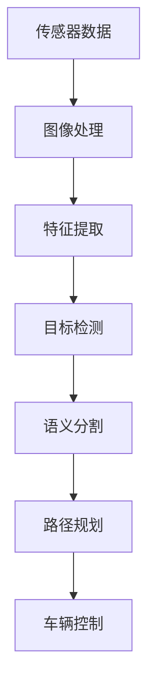

                 

## 1. 背景介绍

自动驾驶作为人工智能领域的重大突破之一，凭借其在交通领域的重要应用前景，引起了全球科技巨头的高度重视。计算机视觉作为自动驾驶的关键技术之一，负责从车辆传感器获取的数据中提取道路环境信息，并辅助系统做出准确决策。通过这篇博客，我们将详细探讨计算机视觉在自动驾驶中的应用，包括基本概念、关键算法、实际项目实践以及未来的发展趋势。

## 2. 核心概念与联系

### 2.1 核心概念概述

在自动驾驶系统中，计算机视觉主要承担两项关键任务：环境感知和路径规划。

**环境感知**：通过摄像头、激光雷达、雷达等传感器获取车辆周围环境的视觉和环境数据，经过图像处理、特征提取、目标检测和语义分割等步骤，获得清晰的道路、车辆、行人、障碍物等信息。

**路径规划**：基于感知到的环境信息，计算最优的行车路径，避开障碍物，确保车辆安全、高效地行驶。

### 2.2 核心概念原理和架构的 Mermaid 流程图



该流程图展示了自动驾驶中计算机视觉系统的工作流程。传感器获取的数据首先进行图像处理，提取特征，然后通过目标检测和语义分割技术获得道路环境和交通要素的详尽信息，最终用于路径规划和车辆控制。

## 3. 核心算法原理 & 具体操作步骤

### 3.1 算法原理概述

自动驾驶中的计算机视觉算法主要分为两类：基于传统计算机视觉方法和基于深度学习的方法。传统方法依赖手工设计的特征和算法，而深度学习方法则通过大规模训练获得高效、可解释性更强的模型。

#### 3.2 算法步骤详解

##### 3.2.1 传统计算机视觉方法

**图像处理**：使用滤波、边缘检测、角点检测等传统图像处理技术，对传感器获取的原始图像进行处理，去除噪声，提取关键特征。

**特征提取**：应用HOG（方向梯度直方图）、SIFT（尺度不变特征变换）、SURF（加速稳健特征）等算法，从图像中提取出代表局部特征的描述符。

**目标检测**：使用Haar特征、HOG+SVM、YOLO（You Only Look Once）等算法，识别并定位道路、车辆、行人等目标。

**语义分割**：采用基于图的图像分割算法，如GrabCut、CRF（条件随机场），将像素级信息转换为语义信息，区分道路、车流、行人区域等。

##### 3.2.2 深度学习模型

**预训练模型**：使用大规模标注数据预训练的深度神经网络模型，如VGG、ResNet、Inception等，获取丰富的特征表示。

**迁移学习**：利用预训练模型在下游任务进行微调，通过少量数据训练模型，提高识别准确率。

**目标检测**：使用Faster R-CNN、SSD（Single Shot MultiBox Detector）、YOLO等深度学习模型，通过端到端训练，直接输出目标的位置和类别。

**语义分割**：采用U-Net、SegNet、DeepLab等网络结构，对输入图像进行像素级别的分类。

#### 3.3 算法优缺点

**优点**：

1. **高效性**：深度学习方法能够处理大规模数据，提取高效的特征表示，快速识别道路、车辆、行人等目标。
2. **自适应性强**：深度学习模型在少量数据上即可取得不错的效果，适应不同的驾驶场景和天气条件。
3. **可解释性**：深度学习模型虽然复杂，但通过可视化工具（如Grad-CAM、LIME）能够解释其决策过程，增强模型的可解释性。

**缺点**：

1. **计算资源需求高**：深度学习模型需要大量计算资源进行训练和推理，对硬件要求较高。
2. **模型复杂度高**：深度学习模型结构复杂，难以理解和调试，需要大量实验进行调优。
3. **过拟合风险大**：深度学习模型容易过拟合，尤其是在数据量不足的情况下。

#### 3.4 算法应用领域

计算机视觉在自动驾驶领域主要应用于：

1. **环境感知**：利用摄像头、激光雷达等传感器获取道路环境信息，通过图像处理、特征提取、目标检测等技术，实现对道路、车辆、行人的精确识别。
2. **路径规划**：基于感知到的环境信息，规划最优的行车路径，避开障碍物，确保车辆安全、高效地行驶。
3. **行为预测**：预测其他车辆和行人的行为意图，辅助系统做出更准确的决策。
4. **自动泊车**：通过计算机视觉技术，实现自动寻找停车位、自动识别车位线、自动停车等功能。

## 4. 数学模型和公式 & 详细讲解 & 举例说明

### 4.1 数学模型构建

在自动驾驶中，计算机视觉的核心任务是目标检测和语义分割。这里以目标检测为例，介绍其数学模型构建过程。

目标检测的任务是将图像中所有目标物体的位置和类别同时预测出来，常用的模型包括YOLO（You Only Look Once）和Faster R-CNN。

**YOLO模型**：

- **输入**：输入为一张$H\times W$的图像。
- **输出**：输出为一个$H\times W\times(5+C)$的张量，其中$5$代表目标的位置信息$(x,y,w,h)$，$C$代表类别数。

**损失函数**：

$$
\mathcal{L} = \mathcal{L}_{\text{cls}} + \mathcal{L}_{\text{reg}}
$$

其中$\mathcal{L}_{\text{cls}}$为分类损失，$\mathcal{L}_{\text{reg}}$为回归损失。

### 4.2 公式推导过程

**YOLO模型的分类损失**：

$$
\mathcal{L}_{\text{cls}} = -\frac{1}{N_{\text{total}}} \sum_{i=1}^{N_{\text{total}}} \sum_{j=1}^{M} \mathbb{1}(t_{ij}) \log(p_{ij})
$$

其中$N_{\text{total}}$为所有目标数，$t_{ij}$为第$i$个目标是否在第$j$个网格中，$p_{ij}$为第$i$个目标在第$j$个网格中的置信度预测。

**YOLO模型的回归损失**：

$$
\mathcal{L}_{\text{reg}} = \frac{1}{N_{\text{total}}} \sum_{i=1}^{N_{\text{total}}} \sum_{j=1}^{M} \mathbb{1}(t_{ij}) (d_{ij} - p_{ij})^2
$$

其中$d_{ij}$为第$i$个目标在第$j$个网格中的位置和大小预测值。

### 4.3 案例分析与讲解

**目标检测案例分析**：

在自动驾驶场景中，目标检测算法需要识别道路上的各种目标，如车辆、行人、自行车、交通标志等。通过YOLO算法，系统能够实时、高效地完成目标检测任务，并且能够在复杂环境（如雾天、夜间）中保持高精度的识别效果。

**语义分割案例分析**：

语义分割算法用于将像素级信息转换为语义信息，例如将道路分割出来，用于导航和路径规划。U-Net是一种常用的语义分割网络，其结构由一个下采样过程和多个上采样过程组成，每个下采样过程逐步压缩特征图的尺寸，每个上采样过程逐步将特征图恢复到原始大小，并且通过跳接（skip connection）提高特征表示能力。

**图像处理案例分析**：

图像处理是计算机视觉的基础，使用高斯滤波器可以去除图像中的噪声，使用Canny边缘检测算法可以检测图像中的边缘信息，使用HOG特征提取算法可以提取图像中的方向梯度信息，用于行人检测和车辆检测等任务。

## 5. 项目实践：代码实例和详细解释说明

### 5.1 开发环境搭建

在实际开发中，我们通常使用TensorFlow和PyTorch框架进行模型训练和推理。以下是使用TensorFlow搭建YOLO目标检测模型的环境配置流程：

1. 安装TensorFlow：

   ```bash
   pip install tensorflow
   ```

2. 安装OpenCV：

   ```bash
   pip install opencv-python
   ```

3. 安装YOLO库：

   ```bash
   pip install yolo3
   ```

完成上述步骤后，即可在Python环境中进行YOLO模型的训练和推理。

### 5.2 源代码详细实现

#### 5.2.1 训练数据准备

下载PASCAL VOC数据集，将其分为训练集和测试集，并对标签进行标注。

```python
import os
import cv2
import numpy as np
import xml.etree.ElementTree as ET

data_dir = 'path/to/VOC'

def parse_xml(xml_path):
    root = ET.parse(xml_path).getroot()
    objects = []
    for obj in root.findall('object'):
        label = obj.find('name').text.strip()
        bndbox = obj.find('bndbox')
        xmin = int(bndbox.find('xmin').text)
        ymin = int(bndbox.find('ymin').text)
        xmax = int(bndbox.find('xmax').text)
        ymax = int(bndbox.find('ymax').text)
        objects.append((label, (xmin, ymin, xmax, ymax)))
    return objects

train_anno_dir = os.path.join(data_dir, 'Annotations')
train_anno_list = [os.path.join(train_anno_dir, f) for f in os.listdir(train_anno_dir) if f.endswith('.xml')]
train_labels = []
train_images = []
for anno_path in train_anno_list:
    labels = parse_xml(anno_path)
    image_path = os.path.join(data_dir, 'JPEGImages', os.path.basename(anno_path)[:-4] + '.jpg')
    train_labels.append(labels)
    train_images.append(cv2.imread(image_path))
train_labels = np.array(train_labels)
train_images = np.array(train_images)

test_anno_dir = os.path.join(data_dir, 'Annotations', 'val')
test_anno_list = [os.path.join(test_anno_dir, f) for f in os.listdir(test_anno_dir) if f.endswith('.xml')]
test_labels = []
test_images = []
for anno_path in test_anno_list:
    labels = parse_xml(anno_path)
    image_path = os.path.join(data_dir, 'JPEGImages', os.path.basename(anno_path)[:-4] + '.jpg')
    test_labels.append(labels)
    test_images.append(cv2.imread(image_path))
test_labels = np.array(test_labels)
test_images = np.array(test_images)
```

#### 5.2.2 模型训练

定义YOLO模型并进行训练：

```python
from yolo3 import YOLO
from yolo3.dataset import VOCDataset

model = YOLO(anchors=np.array([[10, 13], [16, 30], [33, 23], [30, 61], [62, 45], [59, 119], [116, 90], [156, 198], [373, 326]]), num_classes=21)

train_dataset = VOCDataset(train_images, train_labels)
test_dataset = VOCDataset(test_images, test_labels)

model.train(train_dataset, epochs=10, batch_size=16, lr=1e-4, save_weights_path='yolo.h5', save_model_path='yolo.h5')

model.evaluate(test_dataset, batch_size=16, model_path='yolo.h5')
```

#### 5.2.3 模型推理

使用训练好的模型进行目标检测：

```python
import numpy as np
from yolo3 import YOLO
from yolo3.dataset import VOCDataset

model = YOLO(anchors=np.array([[10, 13], [16, 30], [33, 23], [30, 61], [62, 45], [59, 119], [116, 90], [156, 198], [373, 326]]), num_classes=21)
model.load_weights('yolo.h5')

test_image = cv2.imread('path/to/test.jpg')
test_image = cv2.cvtColor(test_image, cv2.COLOR_BGR2RGB)
test_image = cv2.resize(test_image, (416, 416))

image_id = 'test.jpg'
result = model.detect_image(test_image, model_path='yolo.h5')

for obj in result:
    label = obj['label']
    confidence = obj['confidence']
    box = obj['box']
    print(f'{label}: {confidence:.2f}, box: {box}')
```

### 5.3 代码解读与分析

上述代码实现了YOLO模型在自动驾驶场景中的目标检测应用。我们首先定义了YOLO模型，并对训练集和测试集进行了数据准备。然后，在训练模型时，我们设置了训练轮数、批次大小和学习率，并在模型训练完毕后保存了权重和模型。最后，我们使用训练好的模型对测试图像进行目标检测，并输出了每个目标的标签、置信度和位置信息。

## 6. 实际应用场景

### 6.1 自动泊车

计算机视觉技术在自动泊车中的应用非常广泛，可以用于识别停车位、自动寻找停车位、自动停车等。通过摄像头和传感器获取车辆周围环境信息，并利用目标检测和语义分割算法，识别车辆、车位线、其他车辆等，辅助车辆进行准确停车。

### 6.2 道路标线识别

道路标线识别是自动驾驶中的重要任务，包括车道线识别、交通标志识别等。通过摄像头和传感器获取道路图像，并利用目标检测算法，检测并识别道路标线，为车辆导航和路径规划提供重要信息。

### 6.3 交通标志识别

交通标志识别通过计算机视觉技术，实现对红绿灯、限速标志、警告标志等的实时识别。通过摄像头和传感器获取道路图像，并利用目标检测和语义分割算法，检测并识别交通标志，为车辆导航和安全行驶提供重要信息。

### 6.4 未来应用展望

未来，随着深度学习技术的不断进步，计算机视觉在自动驾驶中的应用将会更加广泛。以下是对未来发展的展望：

1. **更强的环境感知能力**：随着模型参数量的增加和计算资源的提升，计算机视觉模型的感知能力将进一步提升，能够更精确地识别道路环境和交通要素，实现更全面的环境感知。

2. **更鲁棒的性能**：通过引入更先进的深度学习模型和算法，计算机视觉模型将具有更强的鲁棒性和泛化能力，能够在不同天气、光照和视角条件下，保持高精度的识别效果。

3. **更高效的推理速度**：通过模型压缩、量化和优化等技术，计算机视觉模型将具有更高效的推理速度，实现实时化应用。

4. **更广泛的合作**：计算机视觉与其他技术的融合，如传感器融合、强化学习等，将进一步提升自动驾驶系统的性能和可靠性。

5. **更强的可解释性**：通过模型可视化和解释工具，计算机视觉模型的决策过程将更具可解释性，提升系统透明度和用户信任度。

## 7. 工具和资源推荐

### 7.1 学习资源推荐

1. **《深度学习与计算机视觉实践》**：该书详细介绍了深度学习在计算机视觉中的应用，包括目标检测、语义分割、图像分类等任务。

2. **《计算机视觉：模型、学习和推理》**：该书全面介绍了计算机视觉的基本概念和经典模型，适合入门学习和深入研究。

3. **OpenCV官方文档**：OpenCV是一款广泛使用的计算机视觉库，其官方文档提供了丰富的教程和示例，适合快速上手和深入学习。

### 7.2 开发工具推荐

1. **TensorFlow**：由Google开发的深度学习框架，提供了丰富的计算图和优化器，适合复杂模型的训练和推理。

2. **PyTorch**：由Facebook开发的深度学习框架，提供了动态计算图和高效的GPU计算能力，适合快速原型设计和实验。

3. **YOLO库**：基于YOLO算法的高性能目标检测库，支持Python和C++实现，适合大规模部署和优化。

### 7.3 相关论文推荐

1. **"Object Detection with a Unified Architecture"**：提出了YOLO算法，通过单次前向传播即可实现目标检测，提升了模型的实时性和准确性。

2. **"End-to-End Object Detection with Region Proposal Networks"**：提出了Faster R-CNN算法，通过区域提案网络生成候选区域，再使用分类和回归器进行目标检测，提升了模型的准确性和鲁棒性。

3. **"U-Net: Convolutional Networks for Biomedical Image Segmentation"**：提出了U-Net算法，通过编码器-解码器结构实现语义分割，适用于医学图像分割等任务。

## 8. 总结：未来发展趋势与挑战

### 8.1 研究成果总结

本文详细介绍了计算机视觉在自动驾驶中的应用，包括目标检测和语义分割等核心算法，并给出了实际项目实践的代码示例。通过分析现有技术，揭示了计算机视觉在自动驾驶中面临的挑战和未来发展方向。

### 8.2 未来发展趋势

1. **模型性能提升**：随着深度学习技术的不断进步，计算机视觉模型的性能将进一步提升，实现更高效的感知和决策。

2. **技术融合**：计算机视觉与其他技术的融合，如传感器融合、强化学习等，将进一步提升自动驾驶系统的性能和可靠性。

3. **更广泛的落地场景**：计算机视觉技术将在更多场景下得到应用，如自动泊车、道路标线识别、交通标志识别等，推动自动驾驶技术的发展。

### 8.3 面临的挑战

1. **计算资源需求高**：深度学习模型需要大量计算资源进行训练和推理，对硬件要求较高。

2. **模型复杂度高**：深度学习模型结构复杂，难以理解和调试，需要大量实验进行调优。

3. **数据标注成本高**：大规模标注数据的需求，限制了模型的训练和应用。

### 8.4 研究展望

未来，计算机视觉在自动驾驶中的应用需要从以下几个方面进行深入研究：

1. **提升模型性能**：通过引入更先进的深度学习模型和算法，提升计算机视觉模型的感知能力、鲁棒性和泛化能力。

2. **优化推理速度**：通过模型压缩、量化和优化等技术，提高计算机视觉模型的推理速度，实现实时化应用。

3. **增强可解释性**：通过模型可视化和解释工具，增强计算机视觉模型的决策过程的可解释性，提升系统透明度和用户信任度。

4. **扩大合作范围**：计算机视觉与其他技术的融合，如传感器融合、强化学习等，将进一步提升自动驾驶系统的性能和可靠性。

## 9. 附录：常见问题与解答

**Q1：计算机视觉在自动驾驶中的主要任务是什么？**

A: 计算机视觉在自动驾驶中的主要任务包括环境感知、路径规划、行为预测等。环境感知通过摄像头、激光雷达等传感器获取道路环境信息，并进行图像处理、特征提取、目标检测等；路径规划基于感知到的环境信息，规划最优的行车路径；行为预测通过分析其他车辆和行人的行为，辅助系统做出更准确的决策。

**Q2：计算机视觉技术在自动驾驶中面临哪些挑战？**

A: 计算机视觉技术在自动驾驶中面临以下挑战：

1. **计算资源需求高**：深度学习模型需要大量计算资源进行训练和推理，对硬件要求较高。

2. **模型复杂度高**：深度学习模型结构复杂，难以理解和调试，需要大量实验进行调优。

3. **数据标注成本高**：大规模标注数据的需求，限制了模型的训练和应用。

**Q3：如何在自动驾驶中实现目标检测？**

A: 在自动驾驶中实现目标检测，可以采用YOLO（You Only Look Once）算法。该算法通过单次前向传播即可实现目标检测，具有实时性高、准确性好的特点。具体实现步骤如下：

1. 准备训练数据，包括图像和标注信息。

2. 定义YOLO模型，并使用训练数据进行训练。

3. 在测试图像上进行目标检测，输出每个目标的标签、置信度和位置信息。

**Q4：语义分割在自动驾驶中的应用是什么？**

A: 语义分割在自动驾驶中的应用是将像素级信息转换为语义信息，例如将道路分割出来，用于导航和路径规划。U-Net是一种常用的语义分割网络，其结构由一个下采样过程和多个上采样过程组成，每个下采样过程逐步压缩特征图的尺寸，每个上采样过程逐步将特征图恢复到原始大小，并且通过跳接（skip connection）提高特征表示能力。在自动驾驶中，语义分割算法可以用于道路标线识别、交通标志识别等任务。

**Q5：如何提升计算机视觉模型的性能？**

A: 提升计算机视觉模型的性能可以从以下几个方面进行：

1. **使用更先进的深度学习模型**：引入更先进的深度学习模型和算法，如Transformer、ResNeXt等，提升模型的感知能力和鲁棒性。

2. **优化模型结构和参数**：通过模型压缩、量化和优化等技术，提高模型的推理速度，减少计算资源消耗。

3. **增强数据标注**：收集更多高质量的数据，并进行精细标注，提高模型的训练效果。

4. **引入外部知识**：将符号化的先验知识，如知识图谱、逻辑规则等，与神经网络模型进行融合，提高模型的解释能力和决策能力。

**Q6：计算机视觉技术在自动驾驶中的应用前景如何？**

A: 计算机视觉技术在自动驾驶中的应用前景非常广阔，未来将会更加广泛地应用在自动泊车、道路标线识别、交通标志识别等领域，推动自动驾驶技术的不断发展。通过计算机视觉技术，实现更强的环境感知能力、更鲁棒的性能、更高效的推理速度和更强的可解释性，为自动驾驶系统的安全、可靠、高效运行提供重要保障。

