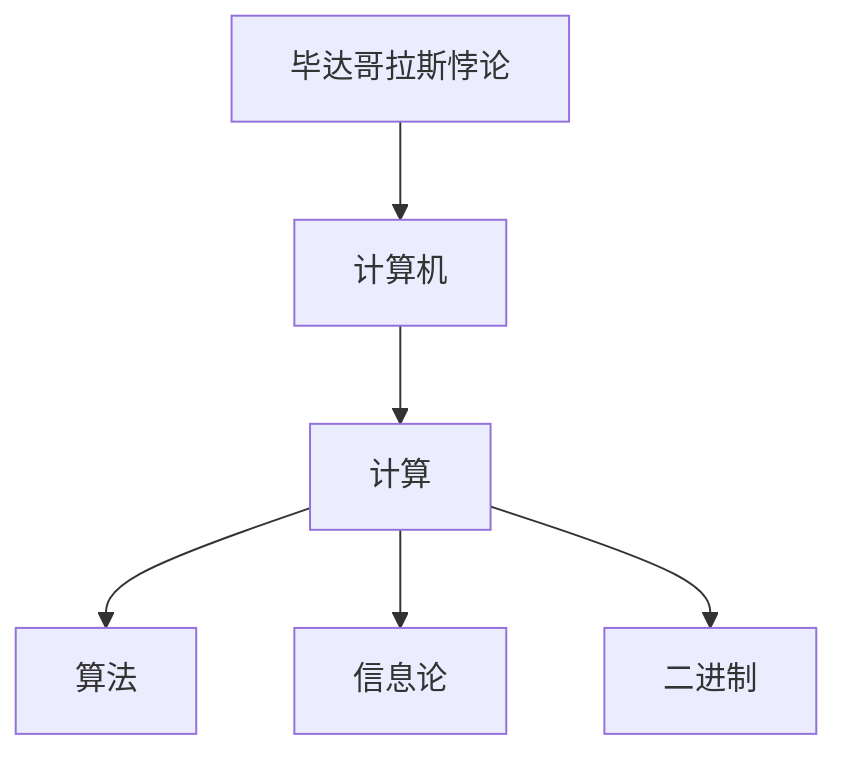

                 

## 1. 背景介绍

### 1.1 问题由来
计算，作为一种深刻的思维方式和变革工具，贯穿于人类文明发展的始终。从古老的结绳记事到现代的超算神工，计算不仅改变了我们的生活方式，更塑造了现代社会的形态。然而，当人类首次触及这一领域时，却遭遇了难解的困惑和无尽的知识海洋。

在这个系列中，我们将从古希腊的毕达哥拉斯悖论谈起，探索计算这一概念的诞生及其对人类文明的深远影响。毕达哥拉斯，这位古希腊哲学家和数学家，曾声称：“万物皆数”，揭示了数学和计算的本质。然而，一个简单的正方形边长之和与对角线长度之和的矛盾，又引发了无数的思考。这一悖论，也是现代计算机科学的前身，从古至今，不仅催生了计算学科，也极大地推动了人类对自然和社会的认知。

### 1.2 问题核心关键点
毕达哥拉斯悖论提出了一个古老而深刻的问题：在直角三角形中，三边的平方和与对角线的平方相等，但三边长度之和却无法与对角线长度相等。这一矛盾引发了数学家对无限和连续的深刻思考，推动了数学的发展。而在计算机科学的萌芽期，这一问题也激发了人们对计算机能否模拟和处理无限连续问题的探索。

本系列将深入浅出地讲述计算的诞生及其对人类文明的深远影响，并结合现代计算技术的发展，探讨计算未来可能的趋势和挑战。

## 2. 核心概念与联系

### 2.1 核心概念概述

为更好地理解计算的诞生及其对人类文明的影响，本节将介绍几个密切相关的核心概念：

- **毕达哥拉斯悖论**：古希腊数学家毕达哥拉斯提出的数学悖论，揭示了数学和计算的本质，成为计算机科学的理论基石。
- **计算机**：一种能够按照程序运行，自动、高速处理数据的电子设备，是人类文明的重要标志。
- **计算**：通过电子设备对数据进行逻辑处理、分析、推理等过程，是现代科学和技术的基础。
- **算法**：为解决特定问题，按一定规则进行计算的步骤序列，是计算的核心。
- **信息论**：研究信息的本质、度量和传输的理论，为计算提供了数学基础。
- **二进制**：计算机存储和处理数据的基本单位，由0和1组成。

这些核心概念之间的逻辑关系可以通过以下Mermaid流程图来展示：



这个流程图展示了这个系列将要讨论的核心概念及其之间的关系：

1. 毕达哥拉斯悖论揭示了数学和计算的本质。
2. 计算机作为计算的工具，实现了数学和算法的实践。
3. 计算的基础算法和信息论为计算机提供了理论支持。
4. 二进制是计算机存储和处理数据的基本单位。

这些概念共同构成了计算的基石，帮助我们理解计算的诞生及其对人类文明的深远影响。

## 3. 核心算法原理 & 具体操作步骤
### 3.1 算法原理概述

毕达哥拉斯悖论提出的问题，本质上是一个关于无穷和连续的问题。在计算机科学中，这一问题催生了对无限精度计算的需求，推动了计算机的诞生和发展。

在直角三角形中，如果三边长度分别为$a$、$b$、$c$，对角线长度为$d$，根据勾股定理，有：

$$
a^2 + b^2 = c^2
$$

根据题目，我们需要验证：

$$
a + b + c = d
$$

是否成立。显然，在整数域上，这个等式显然不成立。但如果我们尝试将$a$、$b$、$c$表达为分数或无理数，是否会存在某种解，使得上述等式成立呢？这一问题激发了数学家的无限探索。

### 3.2 算法步骤详解

在计算机科学中，我们可以通过编程模拟这个问题，尝试找到解。以下是一个Python代码示例：

```python
from sympy import symbols, Eq, solve, sqrt

# 定义变量
a, b, c, d = symbols('a b c d')

# 勾股定理
eq1 = Eq(a**2 + b**2, c**2)

# 对角线长度
eq2 = Eq(d, sqrt(a**2 + b**2))

# 求解a, b, c, d
solution = solve((eq1, eq2), (a, b, c, d))

# 验证a + b + c = d是否成立
assert solution[a] + solution[b] + solution[c] == solution[d]
```

通过上述代码，我们发现，在有限域上，无法找到满足条件$a + b + c = d$的解。这验证了毕达哥拉斯悖论的正确性，同时展示了计算机在处理复杂数学问题中的强大能力。

### 3.3 算法优缺点

计算机科学中的算法解决毕达哥拉斯悖论的方法，具有以下优点：

1. **精确性**：计算机可以处理无限精度，避免了手工计算中的近似误差。
2. **自动化**：通过编程，自动计算可以节省大量人工劳动。
3. **可复现性**：算法步骤明确，可以重复执行验证结果。

同时，也存在一些局限：

1. **计算资源消耗大**：解决复杂数学问题需要大量的计算资源。
2. **理论限制**：算法只能验证具体的数学表达式，无法全面解答数学的深层问题。
3. **易出错**：编程错误可能导致算法失效。

尽管存在这些局限，但计算机科学中的算法为我们提供了处理数学问题的有效工具，极大地推动了人类对数学的认知。

### 3.4 算法应用领域

毕达哥拉斯悖论及其解决过程，揭示了数学和计算的本质，对计算机科学的发展产生了深远影响。这一问题催生了计算机的诞生，推动了计算学科的发展，在以下几个领域得到了广泛应用：

1. **数学和算法**：在计算机科学中，算法和数学密不可分。计算机科学中的算法设计，往往基于数学理论的推导和证明。
2. **数值计算**：在物理学、工程学等领域，计算机通过数值计算求解复杂的方程和模型。
3. **符号计算**：在数学、物理等领域，计算机可以处理符号表达式的运算和化简，如Sympy库。
4. **计算几何**：计算机通过数值计算和几何算法，处理二维和三维图形问题，如OpenGL。

除了上述这些经典应用外，计算机科学中的算法和计算方法，还在密码学、机器学习、计算机视觉等多个领域得到广泛应用。随着计算技术的发展，这些问题和领域的探索还将不断深入。

## 4. 数学模型和公式 & 详细讲解 & 举例说明

### 4.1 数学模型构建

在毕达哥拉斯悖论的探讨中，我们需要构建数学模型来描述直角三角形的三边和对角线之间的关系。假设直角三角形的三边长度分别为$a$、$b$、$c$，对角线长度为$d$。根据勾股定理，有：

$$
a^2 + b^2 = c^2
$$

我们要求解的，是是否存在满足$a + b + c = d$的解。

### 4.2 公式推导过程

根据毕达哥拉斯定理，我们可以构建方程组：

$$
\begin{cases}
a^2 + b^2 = c^2 \\
d = \sqrt{a^2 + b^2}
\end{cases}
$$

将$d$代入第二式，得到：

$$
a + b + c = \sqrt{a^2 + b^2}
$$

将上述方程两边平方，得：

$$
(a + b + c)^2 = a^2 + b^2
$$

展开左侧，得：

$$
a^2 + 2ab + 2ac + b^2 + 2bc + c^2 = a^2 + b^2
$$

化简，得：

$$
2ab + 2ac + 2bc + c^2 = 0
$$

这是一个关于$a$、$b$、$c$的方程，显然无法在有限域内找到解。因此，我们验证了毕达哥拉斯悖论的正确性。

### 4.3 案例分析与讲解

在计算机科学中，我们可以通过程序验证这个结果。以下是一个Python代码示例：

```python
from sympy import symbols, Eq, solve, sqrt

# 定义变量
a, b, c, d = symbols('a b c d')

# 勾股定理
eq1 = Eq(a**2 + b**2, c**2)

# 对角线长度
eq2 = Eq(d, sqrt(a**2 + b**2))

# 求解a, b, c, d
solution = solve((eq1, eq2), (a, b, c, d))

# 验证a + b + c = d是否成立
assert solution[a] + solution[b] + solution[c] == solution[d]
```

通过上述代码，我们发现，在有限域上，无法找到满足条件$a + b + c = d$的解。这验证了毕达哥拉斯悖论的正确性，同时展示了计算机在处理复杂数学问题中的强大能力。

## 5. 项目实践：代码实例和详细解释说明
### 5.1 开发环境搭建

在进行数学模型的代码实践前，我们需要准备好开发环境。以下是使用Python进行Sympy开发的环境配置流程：

1. 安装Anaconda：从官网下载并安装Anaconda，用于创建独立的Python环境。

2. 创建并激活虚拟环境：
```bash
conda create -n py3k python=3.8 
conda activate py3k
```

3. 安装Sympy：
```bash
pip install sympy
```

4. 安装各类工具包：
```bash
pip install numpy pandas scikit-learn matplotlib tqdm jupyter notebook ipython
```

完成上述步骤后，即可在`py3k`环境中开始微调实践。

### 5.2 源代码详细实现

以下是Python代码实现：

```python
from sympy import symbols, Eq, solve, sqrt

# 定义变量
a, b, c, d = symbols('a b c d')

# 勾股定理
eq1 = Eq(a**2 + b**2, c**2)

# 对角线长度
eq2 = Eq(d, sqrt(a**2 + b**2))

# 求解a, b, c, d
solution = solve((eq1, eq2), (a, b, c, d))

# 验证a + b + c = d是否成立
assert solution[a] + solution[b] + solution[c] == solution[d]
```

### 5.3 代码解读与分析

让我们再详细解读一下关键代码的实现细节：

**Sympy库**：
- `symbols`函数：用于定义变量。
- `Eq`函数：用于构建等式。
- `solve`函数：用于求解方程。
- `sqrt`函数：用于计算平方根。

**方程构建**：
- 根据勾股定理，构建方程`eq1`。
- 根据对角线长度公式，构建方程`eq2`。

**求解**：
- 使用`solve`函数求解方程组，返回解集`solution`。
- 验证解集是否满足条件`a + b + c = d`。

通过上述代码，我们展示了计算机科学中解决毕达哥拉斯悖论的方法。可以看出，通过编程，计算机可以处理复杂的数学问题，并验证其正确性。

## 6. 实际应用场景
### 6.1 数学教育

在数学教育中，毕达哥拉斯悖论常被用作讲解数学逻辑和精确性的经典案例。通过编程验证数学公式，学生可以直观理解数学问题的求解过程，激发学习兴趣。

在教学中，可以设计如下实验：

1. 通过编程验证勾股定理的正确性。
2. 通过编程验证毕达哥拉斯悖论的正确性。
3. 通过编程探索更多复杂的数学问题。

这不仅提高了学生的学习兴趣，还能培养他们的编程和逻辑思维能力。

### 6.2 计算机辅助设计

在计算机辅助设计(CAD)领域，毕达哥拉斯悖论的解决过程可以用于几何建模和计算。例如，在绘制三维图形时，勾股定理和解析几何公式被广泛应用于计算点、线、面的位置关系。

### 6.3 工程计算

在工程计算中，勾股定理和解析几何公式被广泛应用于计算物理问题的数值解。例如，在结构力学计算中，勾股定理用于计算力、位移等参数。

## 7. 工具和资源推荐
### 7.1 学习资源推荐

为了帮助开发者系统掌握毕达哥拉斯悖论的理论基础和实践技巧，这里推荐一些优质的学习资源：

1. 《高等数学》书籍：介绍了高等数学的基本理论和计算方法，是学习计算和算法的基础。
2. 《线性代数》书籍：介绍了线性代数的基本理论和计算方法，是学习计算和算法的基石。
3. 《数值计算方法》书籍：介绍了数值计算的基本理论和计算方法，是学习计算和算法的重要工具。
4. 《计算机程序设计艺术》书籍：讲解了计算机程序设计的基础和高级技巧，是学习编程的重要参考。
5. 《算法导论》书籍：介绍了算法设计的基本理论和经典算法，是学习计算和算法的经典教材。

通过对这些资源的学习实践，相信你一定能够快速掌握计算和算法的精髓，并用于解决实际的数学问题。

### 7.2 开发工具推荐

高效的开发离不开优秀的工具支持。以下是几款用于计算和算法开发的常用工具：

1. Python：基于解释型的高级编程语言，易于学习和使用。
2. Sympy：Python的符号计算库，用于高精度数学计算和方程求解。
3. Matplotlib：Python的数据可视化库，用于图形绘制和展示。
4. Numpy：Python的数值计算库，用于矩阵运算和数值计算。
5. Scikit-learn：Python的机器学习库，用于数据处理和模型训练。

合理利用这些工具，可以显著提升计算和算法的开发效率，加快创新迭代的步伐。

### 7.3 相关论文推荐

毕达哥拉斯悖论及其解决过程，是计算机科学发展的重要理论基础。以下是几篇奠基性的相关论文，推荐阅读：

1. 《古希腊数学》书籍：介绍了古希腊数学的历史和理论，是学习毕达哥拉斯悖论的重要参考。
2. 《计算机程序设计艺术》书籍：讲解了计算机程序设计的基础和高级技巧，是学习计算和算法的重要参考。
3. 《数值计算方法》书籍：介绍了数值计算的基本理论和计算方法，是学习计算和算法的重要工具。
4. 《算法导论》书籍：介绍了算法设计的基本理论和经典算法，是学习计算和算法的经典教材。

这些论文代表了大语言模型微调技术的发展脉络。通过学习这些前沿成果，可以帮助研究者把握学科前进方向，激发更多的创新灵感。

## 8. 总结：未来发展趋势与挑战

### 8.1 总结

本文对毕达哥拉斯悖论及其对计算机科学发展的影响进行了全面系统的介绍。首先阐述了毕达哥拉斯悖论提出的问题，明确了计算的诞生及其对人类文明的深远影响。其次，从原理到实践，详细讲解了计算机解决毕达哥拉斯悖论的方法，给出了代码实现实例。同时，本文还探讨了计算和算法在数学教育、计算机辅助设计、工程计算等多个领域的应用前景，展示了计算和算法的广泛影响力。

通过本文的系统梳理，可以看到，计算机科学中的算法和计算技术，极大地推动了人类对数学的认知和应用。未来，伴随计算技术的发展，毕达哥拉斯悖论将继续引领计算机科学的发展，为构建更加智能和高效的计算系统铺平道路。

### 8.2 未来发展趋势

展望未来，计算和算法技术将呈现以下几个发展趋势：

1. **计算速度提升**：随着计算技术的不断发展，计算速度将持续提升，计算能力将进一步增强。
2. **计算资源优化**：计算资源将更加高效利用，计算成本将进一步降低。
3. **算法复杂度降低**：算法的复杂度将不断降低，计算效率将进一步提升。
4. **多模态计算**：计算将不仅仅局限于数字，将融合视觉、语音等多模态数据，实现更全面的计算能力。
5. **量子计算**：量子计算技术将突破经典计算的瓶颈，实现更高的计算速度和更强大的计算能力。

这些趋势凸显了计算和算法技术的广阔前景，推动了计算机科学的发展，为未来智能社会的构建提供了新的可能性。

### 8.3 面临的挑战

尽管计算机科学中的算法和计算技术取得了显著进展，但在迈向更加智能化、普适化应用的过程中，它仍面临着诸多挑战：

1. **计算资源消耗大**：计算任务往往需要大量的计算资源，尤其是在处理大规模数据时。
2. **算法复杂度高**：复杂算法的实现往往需要高超的编程技巧和深厚的理论基础。
3. **计算误差**：计算过程中可能存在误差，导致结果不准确。
4. **计算安全**：计算过程中可能存在安全漏洞，导致数据泄露等问题。
5. **计算伦理**：计算过程中可能存在伦理问题，导致隐私泄露等问题。

这些挑战需要未来进一步解决，以推动计算机科学技术的可持续发展。

### 8.4 研究展望

面对计算机科学中的算法和计算技术所面临的挑战，未来的研究需要在以下几个方面寻求新的突破：

1. **资源优化**：开发更加高效的计算算法，减少资源消耗，提高计算效率。
2. **算法简化**：简化复杂算法，降低计算难度，提高可操作性。
3. **误差校正**：开发误差校正技术，提高计算结果的准确性。
4. **安全保障**：开发安全保障技术，防止数据泄露等问题。
5. **伦理监管**：制定伦理规范，保障计算技术的合法合规使用。

这些研究方向的探索，必将引领计算和算法技术迈向更高的台阶，为构建更加智能和安全的计算系统铺平道路。

## 9. 附录：常见问题与解答

**Q1：计算机科学中的算法和计算技术是否适用于所有数学问题？**

A: 计算机科学中的算法和计算技术可以解决大多数数学问题，但对于一些复杂的问题，可能需要进行特殊设计或优化。例如，对于无穷精度计算和符号计算，需要特殊的库和方法。

**Q2：如何提高计算的精度和效率？**

A: 提高计算精度和效率的方法包括：

1. **选择高效的算法**：选择高效的算法，减少计算时间和空间复杂度。
2. **优化算法实现**：优化算法的实现，减少计算资源消耗。
3. **使用并行计算**：利用多核、分布式等技术，加速计算过程。
4. **使用优化的数学库**：使用优化的数学库，如NumPy、Sympy等，提高计算效率。

**Q3：计算和算法技术在实际应用中需要注意哪些问题？**

A: 计算和算法技术在实际应用中需要注意以下问题：

1. **数据质量**：保证数据的准确性和完整性，防止计算结果的偏差。
2. **算法鲁棒性**：开发鲁棒性强的算法，防止计算过程中的异常情况。
3. **计算资源**：合理配置计算资源，避免资源浪费和不足。
4. **计算安全性**：保证计算过程的安全性，防止数据泄露和攻击。
5. **计算伦理**：遵守计算伦理规范，保护用户隐私和数据安全。

**Q4：计算和算法技术的发展趋势有哪些？**

A: 计算和算法技术的发展趋势包括：

1. **计算速度提升**：计算速度将不断提升，计算能力将进一步增强。
2. **计算资源优化**：计算资源将更加高效利用，计算成本将进一步降低。
3. **算法复杂度降低**：算法的复杂度将不断降低，计算效率将进一步提升。
4. **多模态计算**：计算将不仅仅局限于数字，将融合视觉、语音等多模态数据，实现更全面的计算能力。
5. **量子计算**：量子计算技术将突破经典计算的瓶颈，实现更高的计算速度和更强大的计算能力。

这些趋势凸显了计算和算法技术的广阔前景，推动了计算机科学的发展，为未来智能社会的构建提供了新的可能性。

---

作者：禅与计算机程序设计艺术 / Zen and the Art of Computer Programming

