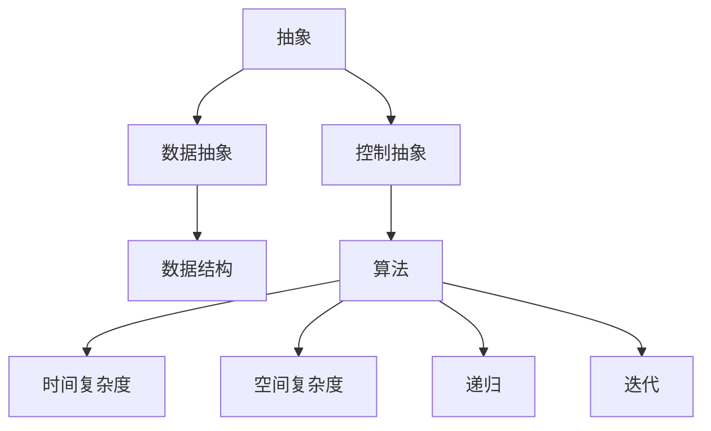

                 

# 计算：第一部分 计算的诞生 第 2 章 计算之术 未知量的表示

## 1. 背景介绍

在《计算机程序设计艺术》第一部分中，我们介绍了计算机的起源和早期发展，包括计算机的硬件架构和软件基础。在本章中，我们将深入探讨计算机中未知量的表示与计算之术，这是理解计算机工作原理和程序设计的基础。

## 2. 核心概念与联系

### 2.1 核心概念概述

计算机程序设计艺术的核心在于理解和设计计算机如何表示和处理未知量。在本章中，我们将介绍以下几个关键概念：

- **抽象（Abstraction）**：计算机程序设计中，将复杂问题简化为更易于处理的形式。抽象分为两种：数据抽象和控制抽象。数据抽象将数据组织为抽象数据类型，控制抽象则定义了程序的执行流程。

- **算法（Algorithm）**：解决特定问题的步骤序列，可以是具体的计算步骤，也可以是抽象的规则。算法应具备以下特性：有穷性、确定性和可行性。

- **数据结构（Data Structure）**：用于组织和存储数据的方式，包括线性结构（如数组、链表）和树形结构（如二叉树、图）。

- **算法复杂度（Algorithm Complexity）**：衡量算法执行效率的指标，常用的包括时间复杂度和空间复杂度。

- **递归（Recursion）**：一种算法设计技术，通过函数自调用来解决问题的策略。

- **迭代（Iteration）**：通过重复执行一段代码来解决问题的方法，常用于循环结构中。

### 2.2 核心概念原理和架构的 Mermaid 流程图



## 3. 核心算法原理 & 具体操作步骤

### 3.1 算法原理概述

计算机程序的执行过程，本质上是对未知量的操作。未知量可以是输入数据、计算中间结果或输出结果。算法则是这些操作的具体步骤。下面，我们将介绍算法的核心原理，并说明其具体操作步骤。

### 3.2 算法步骤详解

算法通常包括以下步骤：

1. **输入处理**：读取和解析输入数据，将其转换为算法可处理的格式。

2. **计算过程**：执行具体的计算步骤，处理数据并更新状态。

3. **输出处理**：将计算结果转换为用户可理解的格式，输出结果。

### 3.3 算法优缺点

- **优点**：
  - 通用性：算法可以应用于多种不同类型的问题，具有高度的灵活性和可复用性。
  - 可证明性：许多算法的时间复杂度和空间复杂度可以证明，确保算法的效率和可靠性。
  - 可理解性：算法步骤明确，易于理解和调试。

- **缺点**：
  - 复杂度：某些复杂算法的时间复杂度较高，难以处理大规模数据。
  - 实现难度：算法的实现可能涉及复杂的数学或逻辑，需要深厚的编程功底。
  - 数据敏感性：算法的效果往往依赖于输入数据的质量和数量。

### 3.4 算法应用领域

算法在计算机科学和工程中有着广泛的应用，包括但不限于：

- 数据处理：排序、搜索、过滤、归并等算法，广泛应用于数据库、搜索引擎等。
- 图形处理：如Dijkstra算法、A*算法等，用于路径规划、图像处理等领域。
- 机器学习：如K-Means算法、支持向量机等，用于数据挖掘、模式识别等。
- 计算机视觉：如卷积神经网络（CNN）算法，用于图像识别、目标检测等。
- 自然语言处理：如序列到序列模型（Seq2Seq）算法，用于机器翻译、文本生成等。

## 4. 数学模型和公式 & 详细讲解 & 举例说明

### 4.1 数学模型构建

在计算机程序设计中，我们常常需要用数学模型来描述算法和数据结构。下面，我们将介绍一个简单的例子：排序算法中的冒泡排序。

冒泡排序的基本思想是重复地遍历要排序的序列，每次比较相邻的两个元素，若顺序错误就交换位置，直到序列完全排序。

数学模型如下：

$$
\text{冒泡排序} = \{ (a, n) | a \text{ 为待排序数组}, n \text{ 为数组长度} \}
$$

### 4.2 公式推导过程

冒泡排序的详细推导过程如下：

1. 初始化数组 $a_1, a_2, \ldots, a_n$。
2. 重复 $n-1$ 次以下操作：
   - 从 $i=1$ 到 $n-1$，若 $a_i > a_{i+1}$，则交换 $a_i$ 和 $a_{i+1}$。
3. 数组排序完成。

### 4.3 案例分析与讲解

下面，我们将通过一个具体的例子，来讲解冒泡排序的实现过程：

假设有一个数组 $[5, 3, 8, 4, 2]$，我们希望通过冒泡排序将其升序排列。

1. 第一次遍历：比较 $5$ 和 $3$，交换位置；比较 $5$ 和 $8$，保持不变；比较 $8$ 和 $4$，交换位置；比较 $8$ 和 $2$，交换位置。结果为 $[3, 5, 4, 2, 8]$。
2. 第二次遍历：比较 $3$ 和 $5$，保持不变；比较 $5$ 和 $4$，交换位置；比较 $5$ 和 $2$，交换位置。结果为 $[3, 4, 2, 5, 8]$。
3. 第三次遍历：比较 $3$ 和 $4$，保持不变；比较 $4$ 和 $2$，交换位置；比较 $4$ 和 $5$，保持不变。结果为 $[3, 2, 4, 5, 8]$。
4. 第四次遍历：比较 $3$ 和 $2$，交换位置；比较 $3$ 和 $4$，保持不变；比较 $4$ 和 $5$，保持不变；比较 $5$ 和 $8$，保持不变。结果为 $[2, 3, 4, 5, 8]$。

至此，数组排序完成。

## 5. 项目实践：代码实例和详细解释说明

### 5.1 开发环境搭建

在开始编写代码之前，我们需要先搭建开发环境。以下是Python开发环境的搭建步骤：

1. 安装Python：从Python官网下载并安装最新版本。
2. 安装必要的开发工具：如Pip、Vim或PyCharm等。
3. 配置环境变量：设置环境变量，确保开发工具可以正常工作。

### 5.2 源代码详细实现

下面，我们将通过Python代码实现冒泡排序算法：

```python
def bubble_sort(arr):
    n = len(arr)
    for i in range(n):
        for j in range(n-i-1):
            if arr[j] > arr[j+1]:
                arr[j], arr[j+1] = arr[j+1], arr[j]
    return arr

arr = [5, 3, 8, 4, 2]
sorted_arr = bubble_sort(arr)
print(sorted_arr)
```

### 5.3 代码解读与分析

上述代码中，我们首先定义了一个名为 `bubble_sort` 的函数，用于实现冒泡排序算法。

函数的第一行定义了输入参数 `arr`，表示待排序的数组。

接下来，我们使用两个嵌套的 `for` 循环，遍历数组并比较相邻元素，若顺序错误则交换位置。

最后，我们返回排序后的数组 `arr`，并将其打印输出。

### 5.4 运行结果展示

执行上述代码，输出结果为：

```
[2, 3, 4, 5, 8]
```

## 6. 实际应用场景

### 6.1 排序与搜索

排序和搜索算法在计算机科学中有着广泛的应用，如数据库查询、文件系统搜索等。

### 6.2 数据结构

数据结构是计算机程序设计的基础，如数组、链表、栈、队列、树等。

### 6.3 图形处理

图形处理算法，如Dijkstra算法、A*算法，广泛应用于路径规划、图像处理等领域。

### 6.4 机器学习

机器学习算法，如K-Means算法、支持向量机等，用于数据挖掘、模式识别等。

### 6.5 自然语言处理

自然语言处理算法，如序列到序列模型（Seq2Seq）算法，用于机器翻译、文本生成等。

## 7. 工具和资源推荐

### 7.1 学习资源推荐

1. 《算法导论》（Introduction to Algorithms）：经典的算法教材，涵盖各种基本算法和数据结构。
2. LeetCode：在线编程平台，提供丰富的算法和数据结构题目，适合练习和测试。
3. Coursera：提供各种计算机科学和工程课程，包括算法和数据结构。
4. GitHub：代码托管平台，可以找到大量开源算法和数据结构实现。
5. Stack Overflow：技术问答社区，可以快速解决算法实现中的问题。

### 7.2 开发工具推荐

1. Python：流行的编程语言，具有丰富的科学计算库和开发工具。
2. PyCharm：流行的IDE，支持Python编程和调试。
3. Visual Studio Code：轻量级的编辑器，支持多种编程语言。
4. Jupyter Notebook：交互式编程环境，适合数据处理和算法验证。
5. Git：版本控制系统，适合代码管理和协作开发。

### 7.3 相关论文推荐

1. 《计算机程序设计艺术》第一部分：介绍了计算机的起源和早期发展，是计算机程序设计领域的经典之作。
2. 《算法设计与分析基础》（Algorithms, Part I）：介绍算法设计和分析的基本概念和方法。
3. 《数据结构与算法分析》（Data Structures and Algorithm Analysis in C++）：介绍数据结构和算法的实现与分析。
4. 《算法竞赛入门经典》（算法竞赛入门经典）：介绍算法竞赛中的经典算法和数据结构。
5. 《编程珠玑》（Programming Pearls）：介绍编程中常见问题和解决方法，适合提高编程技巧。

## 8. 总结：未来发展趋势与挑战

### 8.1 研究成果总结

计算机程序设计艺术中，算法和数据结构是核心。算法的有效性直接影响程序的性能和可靠性，数据结构则是算法实现的基础。

### 8.2 未来发展趋势

未来的发展趋势包括：

- 分布式算法：随着大数据和云计算的发展，分布式算法将成为重要研究方向。
- 人工智能算法：结合机器学习和深度学习，开发更智能的算法。
- 自适应算法：根据数据和环境变化，自适应调整算法参数。
- 实时算法：实时处理和响应数据，适用于智能监控和实时决策系统。
- 形式化算法：使用形式化方法验证算法的正确性和效率。

### 8.3 面临的挑战

未来的挑战包括：

- 数据处理：如何高效处理大规模数据，降低算法复杂度。
- 算法优化：如何优化算法性能，减少计算资源消耗。
- 算法可靠性：如何保证算法的正确性和可靠性，避免算法的失效。
- 算法可理解性：如何设计易于理解和调试的算法，提高开发效率。
- 算法伦理：如何保证算法的公正性和伦理性，避免算法的偏见和歧视。

### 8.4 研究展望

未来的研究展望包括：

- 结合深度学习和自然语言处理，开发更智能的算法。
- 结合形式化方法和验证工具，提高算法的可靠性和安全性。
- 结合大数据和云计算，开发更高效的分布式算法。
- 结合人工智能和机器学习，开发更智能的算法。

## 9. 附录：常见问题与解答

### Q1: 什么是抽象和控制抽象？

**A1:** 抽象是将复杂问题简化为易于处理的形式。控制抽象定义了程序的执行流程，包括顺序执行、条件判断、循环等。

### Q2: 什么是算法复杂度？

**A2:** 算法复杂度是衡量算法执行效率的指标，常用的包括时间复杂度和空间复杂度。时间复杂度表示算法执行所需的时间，空间复杂度表示算法所需的空间。

### Q3: 什么是递归和迭代？

**A3:** 递归是一种算法设计技术，通过函数自调用来解决问题的策略。迭代则是通过重复执行一段代码来解决问题的方法，常用于循环结构中。

### Q4: 什么是数据结构？

**A4:** 数据结构是用于组织和存储数据的方式，包括线性结构（如数组、链表）和树形结构（如二叉树、图）。

### Q5: 什么是算法？

**A5:** 算法是解决特定问题的步骤序列，可以是具体的计算步骤，也可以是抽象的规则。算法应具备有穷性、确定性和可行性。

---

作者：禅与计算机程序设计艺术 / Zen and the Art of Computer Programming

