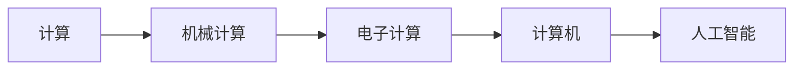

                 

# 计算：第一部分 计算的诞生 第 2 章 计算之术

## 1. 背景介绍

### 1.1 问题由来

计算的起源可以追溯到人类最早利用物理工具进行数学运算的历史，如古埃及的纸草数学，古印度的计算棒，以及中国古代的算筹等。这些物理工具虽然粗糙，但为后来的机械计算奠定了基础。然而，这些早期的计算方法效率低下，仅能进行简单的小规模计算。直到17世纪，随着机械钟表的发明，人类开始迈向更高级的计算技术。

然而，真正意义上的现代计算的诞生，则是在19世纪末至20世纪初。随着电磁学和电机的发明，人们开始探索如何让机器自动执行复杂计算。此时，人类对计算的需求日益增长，尤其是在商业、科学、工程等领域，对计算能力的需求变得愈发迫切。

在这样的历史背景下，计算的诞生已成为科技进步的重要里程碑。本章将通过详细介绍计算技术的诞生历程，揭示其对人类社会生活的深远影响，以及如何推动现代社会的发展。

### 1.2 问题核心关键点

- **计算的起源**：从古埃及的计算工具到电磁学的发展。
- **计算技术的诞生**：从机械计算到电机的发明。
- **计算的影响**：商业、科学、工程等领域对计算的需求。
- **计算的未来**：人工智能、量子计算等前沿技术的发展方向。

这些核心概念构成了计算技术发展的脉络，展示了计算对现代社会的重要作用。

## 2. 核心概念与联系

### 2.1 核心概念概述

本节将介绍几个与计算技术相关的核心概念，并解释它们之间的联系：

- **计算**：通过一系列规则将输入转化为输出的过程。可以是手工计算、机械计算、电子计算等形式。
- **机械计算**：通过机械装置，如计算尺、计算棒等，进行计算的方法。
- **电子计算**：通过电子电路，如电机、晶体管等，进行计算的方法。
- **计算机**：利用电子技术，实现自动进行复杂计算的设备。
- **人工智能**：利用计算机技术，使机器能够模拟人类智能的领域。

这些概念共同构成了计算技术的发展历程，揭示了计算技术对人类社会的深远影响。

### 2.2 核心概念原理和架构的 Mermaid 流程图



这个流程图展示了计算技术的发展脉络，从早期的机械计算，到后来的电子计算，再到现代计算机，最终催生出人工智能技术。

## 3. 核心算法原理 & 具体操作步骤

### 3.1 算法原理概述

计算技术的核心原理可以概括为“存储-运算-输出”三步骤。具体而言：

- **存储**：将数据和程序存入计算设备中。
- **运算**：执行计算逻辑，对数据进行加工处理。
- **输出**：将计算结果输出显示或存储。

这一过程的核心在于如何高效地执行运算逻辑。在计算技术的发展中，硬件和软件不断进步，使得这一过程更加高效和自动化。

### 3.2 算法步骤详解

具体到计算设备如计算机，其核心计算过程可以分为以下几个步骤：

1. **指令读取**：从存储器中读取指令。
2. **数据加载**：加载所需的数据。
3. **运算处理**：执行指令中的计算逻辑，对数据进行处理。
4. **结果存储**：将结果存回存储器，或输出显示。

这一步骤不断重复，形成计算过程的循环。现代计算机通过流水线和多核处理器等技术，进一步优化了这一过程的效率。

### 3.3 算法优缺点

计算技术带来了许多优势：

- **自动化**：解放了人力，提高计算效率。
- **精确性**：减少了人为计算的误差。
- **可重复性**：可以重复执行相同计算，确保一致性。

但同时，计算技术也存在一些局限：

- **能源消耗**：大规模计算需要大量能源。
- **硬件成本**：高性能计算设备价格昂贵。
- **数据隐私**：计算过程中可能涉及敏感数据，需要妥善处理。

理解这些优缺点，有助于更好地应用计算技术，提升其价值。

### 3.4 算法应用领域

计算技术广泛应用于各个领域，包括但不限于：

- **商业**：财务分析、市场预测、供应链管理等。
- **科学**：数据分析、模拟实验、药物研发等。
- **工程**：设计模拟、生产调度、设备维护等。
- **医疗**：病患诊断、医疗影像分析、疾病预测等。
- **教育**：在线教学、智能辅导、教学管理等。

以上领域只是冰山一角，计算技术已经成为现代社会不可或缺的一部分。

## 4. 数学模型和公式 & 详细讲解 & 举例说明

### 4.1 数学模型构建

在计算技术中，数学模型是描述计算过程和结果的重要工具。常见数学模型包括：

- **线性代数**：描述矩阵运算、向量运算等。
- **微积分**：描述函数求导、积分等。
- **统计学**：描述数据分布、回归分析等。

这些数学模型为计算技术提供了强大的理论基础，使其能够处理各种复杂问题。

### 4.2 公式推导过程

以矩阵乘法为例，展示数学模型的推导过程：

设 $A$ 和 $B$ 分别为两个矩阵，其维度分别为 $m \times n$ 和 $n \times p$。则矩阵乘法 $C = AB$ 的结果 $C$ 的维度为 $m \times p$。

其推导过程如下：

设 $C_{ij}$ 为矩阵 $C$ 中的第 $i$ 行第 $j$ 列元素，$A_{ik}$ 和 $B_{kj}$ 分别为矩阵 $A$ 和 $B$ 中的第 $i$ 行第 $k$ 列和第 $k$ 行第 $j$ 列元素。

则：

$$C_{ij} = \sum_{k=1}^n A_{ik}B_{kj}$$

这一推导展示了矩阵乘法的数学原理，是计算机执行复杂运算的重要基础。

### 4.3 案例分析与讲解

以计算机视觉中的图像识别为例，展示数学模型在实际应用中的作用：

设 $x$ 为输入的图像数据，$y$ 为输出结果（如物体类别）。

使用神经网络模型，将 $x$ 映射到 $y$。设 $w$ 为模型中的权重，$b$ 为偏置。则：

$$y = f(w \cdot x + b)$$

其中 $f$ 为激活函数。

通过训练模型，调整权重 $w$ 和偏置 $b$，使得 $f(w \cdot x + b)$ 能够更好地映射 $x$ 到 $y$。

这一过程展示了数学模型在计算机视觉中的应用，展示了计算技术对复杂问题的处理能力。

## 5. 项目实践：代码实例和详细解释说明

### 5.1 开发环境搭建

在项目实践前，需要搭建开发环境。以下是使用Python进行TensorFlow开发的简单环境配置流程：

1. 安装Anaconda：从官网下载并安装Anaconda，用于创建独立的Python环境。

2. 创建并激活虚拟环境：
```bash
conda create -n tf-env python=3.8 
conda activate tf-env
```

3. 安装TensorFlow：根据CUDA版本，从官网获取对应的安装命令。例如：
```bash
conda install tensorflow tensorflow-gpu -c conda-forge
```

4. 安装各类工具包：
```bash
pip install numpy pandas scikit-learn matplotlib tqdm jupyter notebook ipython
```

完成上述步骤后，即可在`tf-env`环境中开始项目实践。

### 5.2 源代码详细实现

以下是使用TensorFlow进行图像识别项目的Python代码实现。

首先，定义图像识别任务的数据处理函数：

```python
import tensorflow as tf
from tensorflow.keras.preprocessing.image import ImageDataGenerator

train_datagen = ImageDataGenerator(rescale=1./255, shear_range=0.2, zoom_range=0.2, horizontal_flip=True)
test_datagen = ImageDataGenerator(rescale=1./255)

train_generator = train_datagen.flow_from_directory(
    'train_dir',
    target_size=(150, 150),
    batch_size=32,
    class_mode='binary')

test_generator = test_datagen.flow_from_directory(
    'test_dir',
    target_size=(150, 150),
    batch_size=32,
    class_mode='binary')
```

然后，定义模型和损失函数：

```python
from tensorflow.keras.applications import VGG16
from tensorflow.keras.layers import Dense, Flatten
from tensorflow.keras.models import Model

vgg = VGG16(weights='imagenet', include_top=False, input_shape=(150, 150, 3))

x = Flatten()(vgg.output)
x = Dense(512, activation='relu')(x)
predictions = Dense(1, activation='sigmoid')(x)

model = Model(inputs=vgg.input, outputs=predictions)

loss = 'binary_crossentropy'
```

接着，定义训练和评估函数：

```python
epochs = 10

model.compile(optimizer='rmsprop', loss=loss, metrics=['acc'])

model.fit(train_generator, epochs=epochs, validation_data=test_generator)
```

最后，启动训练流程并在测试集上评估：

```python
model.evaluate(test_generator)
```

以上就是使用TensorFlow进行图像识别任务的项目实现。可以看到，TensorFlow提供了丰富的API，使得模型的搭建和训练过程变得简单高效。

### 5.3 代码解读与分析

让我们再详细解读一下关键代码的实现细节：

**ImageDataGenerator**：
- 用于数据增强，提高模型的鲁棒性。
- 支持图像旋转、平移、缩放、翻转等多种变换方式。

**VGG16模型**：
- 使用预训练的VGG16模型作为特征提取器。
- 通过Flatten层和全连接层构建分类器。

**训练函数**：
- 使用rmsprop优化器，二元交叉熵损失函数，准确率作为评估指标。
- 在训练过程中，模型通过前向传播和反向传播不断更新权重和偏置。

**评估函数**：
- 使用test_generator生成测试数据集。
- 在测试集上进行模型评估，输出损失和准确率。

通过这一系列代码的实现，展示了TensorFlow在图像识别项目中的应用，展示了计算技术的强大能力。

## 6. 实际应用场景

### 6.1 商业领域

在商业领域，计算技术广泛应用于财务分析、市场预测、供应链管理等方面。例如，通过计算技术，企业可以实时分析财务报表，预测未来市场趋势，优化供应链管理，从而提高效率和盈利能力。

### 6.2 科学领域

在科学领域，计算技术广泛应用于数据分析、模拟实验、药物研发等方面。例如，通过计算技术，科学家可以对大量数据进行高效处理，模拟实验过程，优化药物分子结构，从而加速科学研究的进程。

### 6.3 工程领域

在工程领域，计算技术广泛应用于设计模拟、生产调度、设备维护等方面。例如，通过计算技术，工程师可以模拟复杂结构的设计过程，优化生产调度方案，预测设备故障，从而提高工程项目的质量和效率。

### 6.4 医疗领域

在医疗领域，计算技术广泛应用于病患诊断、医疗影像分析、疾病预测等方面。例如，通过计算技术，医生可以分析医学影像，预测病情发展，优化治疗方案，从而提高医疗服务的质量和效率。

### 6.5 教育领域

在教育领域，计算技术广泛应用于在线教学、智能辅导、教学管理等方面。例如，通过计算技术，教师可以自动批改作业，推荐个性化学习资源，管理教学进度，从而提高教学质量和学习效果。

## 7. 工具和资源推荐

### 7.1 学习资源推荐

为了帮助开发者系统掌握计算技术，这里推荐一些优质的学习资源：

1. 《计算机体系结构》系列教材：详细介绍了计算机硬件和软件的基本原理和设计思想，是学习计算技术的重要基础。

2. 《机器学习》课程：斯坦福大学开设的机器学习课程，介绍了机器学习的原理和算法，是理解计算技术的重要补充。

3. 《深度学习》课程：斯坦福大学开设的深度学习课程，介绍了深度学习的原理和应用，展示了计算技术的前沿方向。

4. 《TensorFlow官方文档》：TensorFlow的官方文档，提供了丰富的API和样例，是学习TensorFlow的重要资源。

5. 《Python编程》系列书籍：Python是计算技术的重要工具，学习Python编程是理解计算技术的重要前提。

通过学习这些资源，可以全面掌握计算技术的基本原理和应用方法，为进一步研究打下坚实的基础。

### 7.2 开发工具推荐

高效的开发离不开优秀的工具支持。以下是几款用于计算技术开发的常用工具：

1. Python：灵活的编程语言，适用于计算技术的多样化需求。

2. TensorFlow：由Google主导开发的深度学习框架，支持大规模分布式计算，是计算技术的重要工具。

3. PyTorch：由Facebook开发的深度学习框架，灵活性高，易于上手，适用于研究原型开发。

4. Jupyter Notebook：交互式编程环境，支持Python和其他语言，适用于数据分析和模型开发。

5. GitHub：代码托管平台，支持版本控制，方便团队协作。

合理利用这些工具，可以显著提升计算技术的开发效率，加快创新迭代的步伐。

### 7.3 相关论文推荐

计算技术的发展源于学界的持续研究。以下是几篇奠基性的相关论文，推荐阅读：

1. Alan Turing的《On Computable Numbers》：开创了计算理论的先河，奠定了计算技术的基础。

2. Claude Shannon的《A Mathematical Theory of Communication》：提出了信息熵和信息论的概念，为计算技术提供了数学基础。

3. John von Neumann的《Theory of Self-Reproducing Automata》：介绍了自动机理论，为计算机设计提供了理论支持。

4. John Nash的《Econometric Models of Production and Employment》：展示了计算技术在经济学中的应用，展示了计算技术的广泛适用性。

5. Andrew Ng的《Deep Learning Specialization》：介绍了深度学习的原理和应用，展示了计算技术的前沿方向。

这些论文代表了大计算技术的发展脉络，展示了计算技术对社会的深远影响。

## 8. 总结：未来发展趋势与挑战

### 8.1 总结

计算技术的发展对人类社会生活产生了深远影响，成为科技进步的重要推动力。本章通过详细介绍计算技术的起源和发展历程，展示了计算技术对各个领域的影响，以及未来发展的方向。

通过本文的系统梳理，可以看到，计算技术的诞生和发展，是科技进步的重要里程碑。它不仅提高了人类的计算能力，还促进了科学、工程、商业等多个领域的创新和发展。

### 8.2 未来发展趋势

展望未来，计算技术将继续引领科技进步：

1. **量子计算**：量子计算利用量子力学的原理，实现比传统计算更高的计算效率和更广泛的适用性。

2. **人工智能**：人工智能利用计算技术，使机器能够模拟人类智能，推动自动化和智能化进程。

3. **分布式计算**：分布式计算通过多台计算机协同计算，提高计算效率和数据处理能力。

4. **边缘计算**：边缘计算将计算任务分散到终端设备，实现更快速的数据处理和决策。

5. **物联网**：物联网通过将计算技术应用到各个领域，实现数据采集、处理和应用的智能化。

这些趋势展示了计算技术未来的发展方向，预示着计算技术将更加深入地影响人类社会的各个方面。

### 8.3 面临的挑战

尽管计算技术取得了巨大的进展，但在迈向更加智能化、普适化应用的过程中，它仍面临诸多挑战：

1. **能源消耗**：大规模计算需要大量能源，如何高效利用能源是一个重要问题。

2. **硬件成本**：高性能计算设备价格昂贵，如何降低成本是一个重要研究方向。

3. **数据隐私**：计算过程中涉及敏感数据，如何保护数据隐私是一个重要挑战。

4. **计算复杂性**：计算任务越来越复杂，如何简化计算过程是一个重要研究方向。

5. **计算安全性**：计算过程中可能受到黑客攻击，如何保障计算安全是一个重要问题。

理解这些挑战，有助于更好地应用计算技术，推动计算技术的持续进步。

### 8.4 研究展望

未来的研究需要在以下几个方面寻求新的突破：

1. **量子计算**：探索量子计算原理和技术，实现更高的计算效率和更广泛的适用性。

2. **人工智能**：开发更加智能和高效的人工智能算法，提高机器的智能水平和自主性。

3. **分布式计算**：探索分布式计算技术和架构，提高计算效率和数据处理能力。

4. **边缘计算**：研究边缘计算的原理和应用，实现更快速的数据处理和决策。

5. **物联网**：研究物联网技术的应用和实现，实现数据采集、处理和应用的智能化。

这些研究方向展示了计算技术的未来发展方向，预示着计算技术将更加深入地影响人类社会的各个方面。

## 9. 附录：常见问题与解答

**Q1：计算技术的起源是什么？**

A: 计算技术的起源可以追溯到人类最早利用物理工具进行数学运算的历史，如古埃及的纸草数学，古印度的计算棒，以及中国古代的算筹等。这些物理工具虽然粗糙，但为后来的机械计算奠定了基础。

**Q2：计算技术是如何发展的？**

A: 计算技术的发展经历了从机械计算到电子计算的过程。最初，人们使用机械装置如计算尺、计算棒等进行计算。随着电磁学和电机的发明，人们开始探索如何让机器自动执行复杂计算。19世纪末至20世纪初，计算机的诞生标志着计算技术的重大进步。

**Q3：计算技术有哪些应用领域？**

A: 计算技术广泛应用于商业、科学、工程、医疗、教育等多个领域。在商业领域，计算技术广泛应用于财务分析、市场预测、供应链管理等方面。在科学领域，计算技术广泛应用于数据分析、模拟实验、药物研发等方面。在工程领域，计算技术广泛应用于设计模拟、生产调度、设备维护等方面。在医疗领域，计算技术广泛应用于病患诊断、医疗影像分析、疾病预测等方面。在教育领域，计算技术广泛应用于在线教学、智能辅导、教学管理等方面。

**Q4：计算技术未来的发展方向是什么？**

A: 计算技术的未来发展方向包括量子计算、人工智能、分布式计算、边缘计算和物联网等。量子计算利用量子力学的原理，实现比传统计算更高的计算效率和更广泛的适用性。人工智能利用计算技术，使机器能够模拟人类智能，推动自动化和智能化进程。分布式计算通过多台计算机协同计算，提高计算效率和数据处理能力。边缘计算将计算任务分散到终端设备，实现更快速的数据处理和决策。物联网通过将计算技术应用到各个领域，实现数据采集、处理和应用的智能化。

**Q5：计算技术面临哪些挑战？**

A: 计算技术面临的挑战包括能源消耗、硬件成本、数据隐私、计算复杂性和计算安全性等。大规模计算需要大量能源，如何高效利用能源是一个重要问题。高性能计算设备价格昂贵，如何降低成本是一个重要研究方向。计算过程中涉及敏感数据，如何保护数据隐私是一个重要挑战。计算任务越来越复杂，如何简化计算过程是一个重要研究方向。计算过程中可能受到黑客攻击，如何保障计算安全是一个重要问题。

通过本文的系统梳理，可以看到，计算技术的诞生和发展，是科技进步的重要里程碑。它不仅提高了人类的计算能力，还促进了科学、工程、商业等多个领域的创新和发展。未来，计算技术将继续引领科技进步，推动社会的发展和进步。

