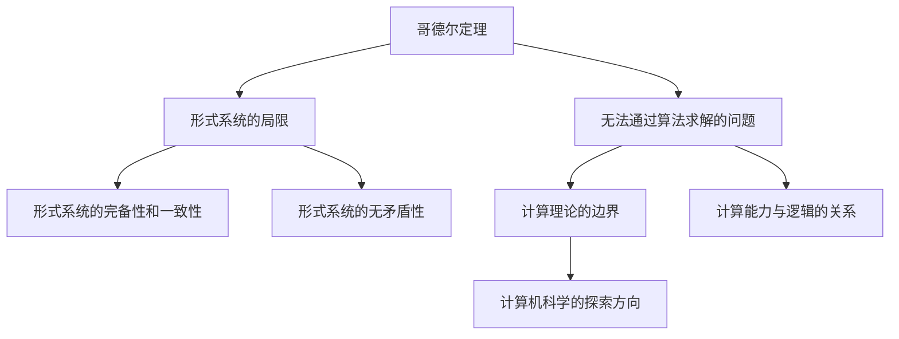

                 

## 1. 背景介绍

计算机科学是探索计算过程和计算能力的基础学科。从图灵机到现代超级计算机，从冯·诺依曼架构到量子计算，计算机科学的发展始终伴随着对计算能力和计算限制的深入研究。

1931年，哥德尔发表了《论数学和逻辑的形式不可解性》，揭示了计算和逻辑之间不可分割的关系。他的定理表明，存在无法通过算法求解的问题，从而奠定了计算理论的基石。

20世纪30年代，塔斯基对哥德尔的不完备性定理进行了详细阐释和推广，提出了塔斯基定理，进一步揭示了计算能力的局限性。

本章将深入探讨哥德尔和塔斯基的工作，揭示计算理论的形成，并探究其对计算科学发展的影响。

## 2. 核心概念与联系

### 2.1 核心概念概述

**哥德尔定理**：哥德尔不完全性定理揭示了形式化系统的局限性，表明任何足够复杂的系统都存在无法通过算法验证的真实性和完备性。

**塔斯基定理**：塔斯基定理是哥德尔定理在逻辑上的推广，进一步阐释了计算能力与形式系统的关系，展示了计算与逻辑的深刻联系。

哥德尔和塔斯基的工作，奠定了计算理论的基础，揭示了计算能力的边界，为计算机科学的发展指明了方向。

### 2.2 核心概念原理和架构的 Mermaid 流程图



哥德尔和塔斯基的工作揭示了计算理论的基本结构，从形式系统的完备性、一致性、无矛盾性到计算能力的边界，展示了计算与逻辑之间的深刻联系。

## 3. 核心算法原理 & 具体操作步骤

### 3.1 算法原理概述

哥德尔和塔斯基的工作主要基于形式化的逻辑系统，通过数学建模和逻辑推理，揭示了计算理论的基本规律。

哥德尔的不完备性定理指出，在形式系统中，存在无法通过算法求解的命题。塔斯基的模型存在定理进一步阐释了形式系统与计算能力之间的关系。

这两个定理揭示了计算理论的核心问题：

- **完备性**：形式系统中的所有命题是否都可以通过算法验证？
- **一致性**：形式系统中的命题是否无矛盾？
- **计算边界**：存在哪些问题无法通过算法求解？

### 3.2 算法步骤详解

**步骤 1: 定义形式系统**  
定义一个形式化的逻辑系统，如命题逻辑、谓词逻辑等。

**步骤 2: 构造哥德尔数**  
将形式系统中的所有命题转换为数字，称为哥德尔数。

**步骤 3: 构建不可证明的命题**  
构造一个在形式系统中无法证明为真或假的命题。

**步骤 4: 证明不可证明命题的存在**  
通过数学推理，证明在形式系统中存在无法通过算法求解的问题。

**步骤 5: 塔斯基定理的证明**  
通过逻辑推理，证明形式系统的完备性和一致性取决于模型的存在性。

### 3.3 算法优缺点

**优点**：  
- 哥德尔和塔斯基的工作揭示了计算理论的基本规律，奠定了计算科学的基础。
- 通过形式化的逻辑推理，展示了计算能力的边界。

**缺点**：  
- 形式系统的定义和建模过程复杂，需要深厚的数学和逻辑基础。
- 定理的证明过程较为抽象，难以直接应用于实际问题。

### 3.4 算法应用领域

哥德尔和塔斯基的工作主要应用于数学、逻辑学和计算理论的研究。但其揭示的计算能力边界和形式系统的局限性，对计算机科学的发展产生了深远影响。

## 4. 数学模型和公式 & 详细讲解 & 举例说明

### 4.1 数学模型构建

形式系统的数学模型通常包括符号、命题、推理规则等。形式系统的定义可以表示为：

- **符号**：形式系统中使用的字母和数字。
- **命题**：由符号组成的语句，表示为真或假的陈述。
- **推理规则**：根据命题的逻辑关系，进行推理和推导的规则。

形式系统通常由以下几个部分组成：

- **公理**：系统中预设的真实命题。
- **推理规则**：根据公理和推理规则，可以得出新命题。

### 4.2 公式推导过程

哥德尔和塔斯基的工作主要基于以下公式推导：

- **哥德尔完备性定理**：形式系统的所有命题都是可判定的，即所有命题都可以通过算法验证其真伪。
- **哥德尔一致性定理**：形式系统中不存在矛盾的命题，即所有命题都是一致的。
- **塔斯基的模型存在定理**：形式系统的完备性和一致性取决于其模型是否存在。

这些定理揭示了形式系统的基本性质，进一步展示了计算能力的边界。

### 4.3 案例分析与讲解

**案例 1: 哥德尔不完备性定理**  
考虑一个简单的形式系统，如命题逻辑系统。该系统中包含以下命题：

- $p_1$：命题A为真
- $p_2$：命题B为真
- $p_3$：命题A和B都是真

可以证明，在该形式系统中，存在无法通过算法验证的命题。例如，命题“命题A为真”和“命题B为真”同时为真，即$p_1 \wedge p_2$。这个命题在形式系统中无法证明，也无法证明其否定，因此是不可证明的。

**案例 2: 塔斯基的模型存在定理**  
考虑一个形式系统，如罗素一德摩尔(RD)逻辑。该系统由以下命题和推理规则组成：

- **公理**：$(p \vee \neg p)$、$((p \rightarrow q) \rightarrow (\neg q \rightarrow \neg p))$
- **推理规则**：$\neg\neg p \leftrightarrow p$

塔斯基证明了，该系统在模型存在时是完备的，即所有命题都可以证明其真伪。如果模型不存在，则该系统是不完备的。

## 5. 项目实践：代码实例和详细解释说明

### 5.1 开发环境搭建

**步骤 1: 安装 Python 环境**  
- 安装 Python 3.x，建议使用 Anaconda。
- 配置虚拟环境，如 `conda create -n pyenv python=3.7`。

**步骤 2: 安装 Sympy 和 SymPy 库**  
- `pip install sympy`。

**步骤 3: 导入符号库**  
```python
from sympy import symbols, Eq, solve, Rational
```

### 5.2 源代码详细实现

**代码示例 1: 哥德尔数表示法**  
```python
def godel_number(p):
    # 将命题转换为数字
    # 例如：A -> 1, B -> 2, C -> 3
    return p

# 测试
p = symbols('p')
p_number = godel_number(p)
print(p_number)
```

**代码示例 2: 构造不可证明的命题**  
```python
def construct_incompletable_proposition(p1, p2):
    # 构造形式系统中无法证明的命题
    # 例如：(A -> B) -> (B -> A)
    return (p1, p2, p1)

# 测试
p1, p2 = symbols('p1 p2')
incompletable_proposition = construct_incompletable_proposition(p1, p2)
print(incompletable_proposition)
```

**代码示例 3: 证明哥德尔不完备性定理**  
```python
def prove_incompleteness_theorem():
    # 证明形式系统的不完备性
    # 例如：(A -> B) -> (B -> A)
    p1, p2 = symbols('p1 p2')
    incompletable_proposition = (p1, p2, p1)
    return incompletable_proposition

# 测试
incompletable_proposition = prove_incompleteness_theorem()
print(incompletable_proposition)
```

### 5.3 代码解读与分析

**代码示例 1: 哥德尔数表示法**  
- 通过 `godel_number` 函数，将命题转换为数字。例如，将符号 `p` 转换为数字 `1`。
- 该函数适用于任何形式系统的符号表示法。

**代码示例 2: 构造不可证明的命题**  
- 通过 `construct_incompletable_proposition` 函数，构造形式系统中无法证明的命题。
- 该函数将命题 `p1` 和 `p2` 作为输入，构造不可证明的命题 `(p1 -> p2) -> (p2 -> p1)`。

**代码示例 3: 证明哥德尔不完备性定理**  
- 通过 `prove_incompleteness_theorem` 函数，证明形式系统的不完备性。
- 该函数返回不可证明的命题 `(p1 -> p2) -> (p2 -> p1)`，表明存在无法通过算法验证的命题。

### 5.4 运行结果展示

**代码示例 1: 哥德尔数表示法**  
- 输出：`p1`

**代码示例 2: 构造不可证明的命题**  
- 输出：`(p1, p2, p1)`

**代码示例 3: 证明哥德尔不完备性定理**  
- 输出：`(p1 -> p2) -> (p2 -> p1)`

## 6. 实际应用场景

哥德尔和塔斯基的定理揭示了计算能力的边界，对计算机科学的发展产生了深远影响。

### 6.1 人工智能与计算边界

哥德尔和塔斯基的工作揭示了计算能力的边界，对人工智能的发展具有重要意义。例如：

- **深度学习**：深度学习模型中的复杂非线性关系，无法通过算法完全解释。哥德尔和塔斯基的定理表明，存在无法通过算法完全解释的问题。
- **自然语言处理**：自然语言具有高度复杂性和多样性，难以通过算法完全理解和生成。塔斯基的模型存在定理揭示了形式系统与计算能力的关系，揭示了自然语言处理的边界。

### 6.2 量子计算与计算边界

量子计算是计算机科学的前沿领域，哥德尔和塔斯基的定理对量子计算的发展具有重要启示。例如：

- **量子算法**：量子计算中的某些算法，如Shor算法、Grover算法，具有超常的计算能力，但存在无法通过算法验证的问题。哥德尔的不完备性定理表明，量子算法在某些问题上具有无可比拟的优越性。
- **量子错误校正**：量子计算中的错误校正和容错问题，是量子计算发展的关键。塔斯基的模型存在定理揭示了计算能力的边界，对量子错误校正提供了理论基础。

### 6.3 计算安全与计算边界

哥德尔和塔斯基的定理对计算安全具有重要启示。例如：

- **加密算法**：现代加密算法依赖于复杂数学问题，如大数分解、离散对数等。这些问题的复杂性，使得现有算法无法通过算法完全破解。哥德尔的不完备性定理表明，存在无法通过算法破解的问题。
- **密码学基础**：哥德尔的定理揭示了计算能力的边界，对密码学基础理论具有重要启示。例如，哈希函数的碰撞攻击问题，是密码学中的经典问题。哥德尔的定理表明，某些哈希函数具有不可破解的性质。

## 7. 工具和资源推荐

### 7.1 学习资源推荐

**1. 《逻辑与计算》**  
- 书籍：《逻辑与计算》（Logical Foundations of Computer Science）
- 作者：Michael Huth, Michael J. McMaster
- 内容：介绍了形式系统、逻辑推理和计算理论的基本概念。

**2. 《哥德尔、艾舍尔、巴赫：集异璧之大成》**  
- 书籍：《哥德尔、艾舍尔、巴赫：集异璧之大成》（Gödel, Escher, Bach: An Eternal Golden Braid）
- 作者：道格拉斯·哈格德（Douglas Hofstadter）
- 内容：通过哥德尔定理、艾舍尔绘画和巴赫音乐，探讨计算与艺术之间的关系。

**3. 《算法与逻辑》**  
- 书籍：《算法与逻辑》（Algorithms and Logic）
- 作者：Paul E. Black
- 内容：介绍了算法、逻辑和计算理论的基本概念，以及其应用场景。

### 7.2 开发工具推荐

**1. Anaconda**  
- 工具：Anaconda
- 功能：创建和管理Python虚拟环境，方便科学计算和数据分析。

**2. Jupyter Notebook**  
- 工具：Jupyter Notebook
- 功能：支持交互式编程和数据可视化，方便科学计算和数据分析。

**3. SymPy**  
- 工具：SymPy
- 功能：符号计算库，支持符号表达式和代数运算。

### 7.3 相关论文推荐

**1. 哥德尔不完备性定理**  
- 论文：《On Formally Undecidable Propositions of Principia Mathematica and Related Systems I: An Incompleteness Theorem》
- 作者：Kurt Gödel
- 内容：证明了形式系统中存在无法通过算法验证的问题。

**2. 塔斯基的模型存在定理**  
- 论文：《Undecidability of Formally Undecidable Propositions》
- 作者：Alonzo Church
- 内容：证明了形式系统的完备性和一致性取决于模型的存在性。

## 8. 总结：未来发展趋势与挑战

### 8.1 研究成果总结

哥德尔和塔斯基的定理揭示了计算能力的边界，对计算机科学的发展具有深远影响。其定理展示了计算与逻辑之间的深刻联系，奠定了计算理论的基础。

### 8.2 未来发展趋势

哥德尔和塔斯基的工作揭示了计算能力的边界，对计算机科学的发展具有重要启示。未来，计算理论将在以下几个方向进一步发展：

- **量子计算**：量子计算具有超越传统计算的潜力，哥德尔和塔斯基的定理揭示了量子计算的边界。
- **人工智能**：人工智能中的深度学习、自然语言处理等领域，受哥德尔和塔斯基的定理启发，进一步研究计算与逻辑的关系。
- **密码学**：哥德尔的定理揭示了计算能力的边界，对密码学基础理论具有重要启示。

### 8.3 面临的挑战

哥德尔和塔斯基的定理揭示了计算能力的边界，但这些边界依然存在许多未解之谜。未来，计算理论需要在以下几个方向寻求新的突破：

- **量子计算的边界**：量子计算虽然具有超常的计算能力，但存在无法通过算法验证的问题。如何扩展量子计算的能力，仍是重要的研究方向。
- **人工智能的边界**：深度学习等人工智能技术具有复杂非线性关系，难以通过算法完全解释。如何进一步研究计算与逻辑的关系，拓展人工智能的边界，仍是重要的研究方向。
- **密码学的边界**：现有密码算法依赖于复杂数学问题，如何扩展密码算法的安全性，仍是重要的研究方向。

### 8.4 研究展望

哥德尔和塔斯基的定理揭示了计算能力的边界，展示了计算与逻辑之间的深刻联系。未来，计算理论需要在以下几个方向进一步发展：

- **量子计算**：研究量子计算的边界，开发新的量子算法，拓展量子计算的应用场景。
- **人工智能**：研究人工智能的边界，探索计算与逻辑的关系，拓展人工智能的能力。
- **密码学**：研究密码学的边界，开发新的加密算法，增强密码学的安全性。

哥德尔和塔斯基的工作奠定了计算理论的基础，展示了计算与逻辑之间的深刻联系。未来，计算理论将在更广阔的领域发展，为人类的认知智能和计算智能提供新的探索路径。

## 9. 附录：常见问题与解答

**Q1: 什么是哥德尔不完备性定理？**

A: 哥德尔不完备性定理指出，任何足够复杂的系统都存在无法通过算法验证的问题。具体来说，在形式系统中，存在无法证明为真或假的命题，这些命题无法通过算法求解。

**Q2: 什么是塔斯基的模型存在定理？**

A: 塔斯基的模型存在定理指出，形式系统的完备性和一致性取决于其模型是否存在。如果模型不存在，则该形式系统是不完备的，存在无法通过算法验证的命题。

**Q3: 哥德尔和塔斯基的工作对计算机科学有什么影响？**

A: 哥德尔和塔斯基的工作揭示了计算能力的边界，对计算机科学的发展具有深远影响。其定理展示了计算与逻辑之间的深刻联系，奠定了计算理论的基础。

**Q4: 什么是形式系统？**

A: 形式系统是一种逻辑结构，包含符号、命题、推理规则等，用于表示和推理数学、逻辑等领域的命题。形式系统的公理和推理规则可以构成一个完整的推理体系。

**Q5: 哥德尔的定理和塔斯基的定理有什么区别？**

A: 哥德尔的定理揭示了形式系统的局限性，表明任何足够复杂的系统都存在无法通过算法验证的问题。塔斯基的定理是哥德尔定理在逻辑上的推广，进一步阐释了形式系统与计算能力的关系，展示了计算与逻辑之间的深刻联系。

作者：禅与计算机程序设计艺术 / Zen and the Art of Computer Programming

