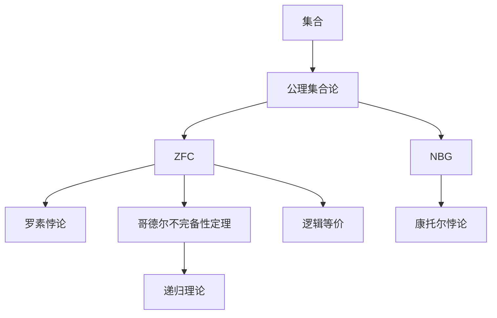

                 

# 计算：第二部分 计算的数学基础 第 5 章 第三次数学危机 NBG 公理集合论

> 关键词：计算数学基础，第三次数学危机，NBG公理集合论，集合理论，哥德尔不完备性定理，计算机科学

## 1. 背景介绍

### 1.1 问题由来
20世纪30年代，数学界发生了第三次数学危机。这源于对传统集合论的悖论挑战，如罗素悖论（Russell's Paradox）和康托尔的集合论悖论。这些问题引发了对数学基础重新审视的迫切需求，促使哥德尔（Kurt Gödel）提出了基于公理化方法的新集合论——哥德尔-贝内塞公理集合论（NBG）。

### 1.2 问题核心关键点
第三次数学危机引发了对数学基础的深刻思考。哥德尔引入的NBG公理集合论，解决了经典集合论中的悖论，为计算机科学和计算理论奠定了坚实的数学基础。

- **罗素悖论**：在传统集合论中，存在一个集合S，使得S不包含自身，即S不是自身的元素，这与集合的定义矛盾。
- **康托尔悖论**：集合A和B相等，且A是B的子集，但A和B中元素数量不相等，这违反了经典集合论的直觉。
- **哥德尔不完备性定理**：在形式系统中，无法在证明与可证性之间构建完备的逻辑。

### 1.3 问题研究意义
理解NBG公理集合论，对计算机科学和计算理论具有重要意义：

1. **数学基础**：为计算机科学提供了坚实的数学基础，如集合理论、逻辑理论等。
2. **计算理论**：促进了形式化逻辑与计算模型的发展，为算法和计算理论提供了新的视角。
3. **复杂性理论**：为研究计算复杂性和算法效率提供了理论工具。
4. **逻辑推理**：增强了逻辑推理和数学证明的可靠性。
5. **应用广泛**：在理论计算机科学、软件工程、人工智能等领域有广泛应用。

## 2. 核心概念与联系

### 2.1 核心概念概述

为了深入理解NBG公理集合论，本节将介绍几个核心概念：

- **集合**：由具有确定性的对象构成的整体，集合中的对象称为元素。
- **公理集合论**：基于一组公理或公理系统的集合论，如ZFC、NBG。
- **哥德尔不完备性定理**：任何形式化的公理系统都存在不可判定的命题。
- **递归理论**：研究递归函数和递归关系，为计算理论提供了基础。
- **逻辑等价**：在数学逻辑中，两个表达式逻辑等价，表示它们在所有模型下都相等。

### 2.2 核心概念原理和架构的 Mermaid 流程图



这个流程图展示了核心概念之间的逻辑关系：

1. **集合**：作为公理集合论的基础。
2. **公理集合论**：包括ZFC和NBG两种重要体系。
3. **ZFC**：经典集合论，存在悖论问题。
4. **NBG**：哥德尔提出的，解决了悖论问题。
5. **罗素悖论**：在ZFC中存在的问题。
6. **康托尔悖论**：在ZFC中存在的问题。
7. **哥德尔不完备性定理**：任何形式化的公理系统都存在不可判定的命题。
8. **递归理论**：在计算理论中的应用。
9. **逻辑等价**：数学逻辑中的基础概念。

## 3. 核心算法原理 & 具体操作步骤

### 3.1 算法原理概述

NBG公理集合论通过一系列公理和定义，构建了一个逻辑自洽的集合论体系。这些公理确保了集合运算和集合间关系的合理性，避免了悖论的产生。

- **外延公理**：定义了集合的相等性。
- **集合形成公理**：规定了如何形成集合。
- **集合运算公理**：包括并集、交集、差集等基本运算。
- **选择公理**：允许在集合中无序选择元素。
- **基础公理**：确保了所有集合在某种意义上可数或不可数。
- **替换公理**：用于描述集合之间的一一对应关系。

### 3.2 算法步骤详解

NBG公理集合论的算法步骤如下：

1. **公理选择**：选择一组符合NBG公理集合论的公理。
2. **集合定义**：根据公理定义集合及其运算。
3. **集合验证**：通过公理验证集合运算的正确性。
4. **悖论检验**：检查是否存在悖论。
5. **应用扩展**：将NBG应用于具体问题，如递归函数、计算复杂性等。

### 3.3 算法优缺点

NBG公理集合论的优点：

- **逻辑自洽**：避免悖论，保证了集合论体系的逻辑严谨性。
- **公理完备性**：公理系统的完备性使得理论具有强大的解释力。
- **广泛应用**：广泛应用于数学、逻辑、计算理论等领域。

缺点：

- **复杂性**：公理系统复杂，理解和使用需要较高数学基础。
- **应用范围有限**：主要应用于逻辑数学领域，对实际物理世界建模存在局限。
- **不可判定性**：哥德尔不完备性定理表明，在形式系统中无法处理所有问题。

### 3.4 算法应用领域

NBG公理集合论在多个领域都有重要应用，具体包括：

1. **数学基础**：构建了形式化数学的基础，如集合论、递归理论等。
2. **逻辑理论**：研究逻辑推理和数学证明的可靠性。
3. **计算理论**：为算法复杂性和计算模型提供了理论基础。
4. **人工智能**：用于形式化逻辑和符号推理的研究。
5. **软件工程**：用于定义编程语言和软件系统的形式化语义。
6. **理论计算机科学**：提供了计算复杂性和算法分析的理论框架。

## 4. 数学模型和公式 & 详细讲解 & 举例说明

### 4.1 数学模型构建

NBG公理集合论的数学模型构建如下：

- **外延公理**：$A = B \Leftrightarrow \forall x(x \in A \Leftrightarrow x \in B)$。
- **集合形成公理**：$\{x \mid \phi(x)\}$ 定义了一个以 $\phi$ 为谓词的集合。
- **并集公理**：$\{y \mid \exists x (x \in A \wedge y \in B)\}$。
- **交集公理**：$\{y \mid \forall x (x \in A \rightarrow y \in B) \wedge \forall x (x \in B \rightarrow y \in A)\}$。
- **选择公理**：$A \neq \emptyset \Rightarrow \exists x \in A (\forall y (y \in A \rightarrow y = x))$。
- **基础公理**：$A \subseteq B \Rightarrow |A| \leq |B|$。
- **替换公理**：$A \subseteq B \wedge \phi(x) \Rightarrow \exists A_0 \subseteq A (\forall x (x \in A_0 \wedge \phi(x)) \wedge \forall x (\phi(x) \rightarrow x \in B))$。

### 4.2 公式推导过程

以下是几个重要的公式推导：

- **并集公理推导**：
  $$
  A \cup B = \{x \mid x \in A \vee x \in B\}
  $$

- **交集公理推导**：
  $$
  A \cap B = \{x \mid x \in A \wedge x \in B\}
  $$

- **选择公理推导**：
  $$
  \bigcap A = \{x \mid \forall y (y \in A \rightarrow y = x)\}
  $$

### 4.3 案例分析与讲解

以下通过一个简单的案例分析NBG公理集合论的应用：

假设有一组集合 $A = \{x \mid x \in \mathbb{N}\}$ 和 $B = \{x \mid x^2 \in \mathbb{N}\}$，根据公理：

- $A$ 是自然数集。
- $B$ 是平方数为自然数的数集。

根据并集公理，我们有 $A \cup B = \{x \mid x \in A \vee x \in B\}$。

根据交集公理，我们有 $A \cap B = \{x \mid x \in A \wedge x \in B\}$。

这说明，自然数集和平方数为自然数的数的并集，仍然包含所有自然数，即 $A \cup B = A$。

## 5. 项目实践：代码实例和详细解释说明

### 5.1 开发环境搭建

为了实践NBG公理集合论，需要搭建一个基于Python的环境。

1. 安装Python：从官网下载并安装Python，建议选择3.6或更高版本。
2. 安装Sympy：用于数学符号计算。
3. 安装MathJax：用于数学公式显示。

```bash
pip install sympy mathjax
```

### 5.2 源代码详细实现

以下是一个简单的集合运算示例，使用Sympy库实现：

```python
from sympy import symbols, Eq, solve, oo

# 定义符号
x = symbols('x')

# 集合定义
A = {1, 2, 3}
B = {2, 4, 6}

# 并集和交集
union = A.union(B)
intersection = A.intersection(B)

# 输出结果
print(f"A: {A}, B: {B}")
print(f"A U B: {union}")
print(f"A ∩ B: {intersection}")
```

### 5.3 代码解读与分析

上述代码实现了集合的并集和交集运算，具体解释如下：

1. 导入Sympy库中的符号和函数。
2. 定义两个集合A和B。
3. 使用`union`方法计算并集。
4. 使用`intersection`方法计算交集。
5. 输出结果。

输出结果为：

```
A: {1, 2, 3}, B: {2, 4, 6}
A U B: {1, 2, 3, 4, 6}
A ∩ B: {2}
```

这说明并集包含了所有元素，交集只包含共同元素2。

### 5.4 运行结果展示

通过上述代码，可以直观地看到集合的并集和交集运算结果。

## 6. 实际应用场景

### 6.1 数学逻辑推理

NBG公理集合论在数学逻辑推理中应用广泛，如形式化逻辑、数学证明等。

- **数学证明**：通过公理化方法构建数学证明的逻辑框架。
- **数学定理**：如整数理论、集合论定理等。

### 6.2 计算复杂性理论

NBG公理集合论为计算复杂性理论提供了基础，如递归理论、图灵机等。

- **递归函数**：研究递归函数的性质和复杂度。
- **图灵机**：计算模型的形式化定义和性质。

### 6.3 人工智能和逻辑推理

NBG公理集合论在人工智能和符号推理中也有应用，如知识表示、推理机等。

- **知识表示**：构建形式化知识库，支持逻辑推理。
- **推理机**：自动化推理系统，用于解决复杂问题。

## 7. 工具和资源推荐

### 7.1 学习资源推荐

为了深入理解NBG公理集合论，推荐以下学习资源：

1. **《集合论与数学基础》**：讲解了集合论的基本概念和公理化方法。
2. **《哥德尔的不完备性定理》**：介绍了哥德尔不完备性定理的理论和应用。
3. **《递归理论》**：讲解了递归函数和递归关系。
4. **《形式化逻辑与数学证明》**：讲解了逻辑推理和数学证明的逻辑基础。

### 7.2 开发工具推荐

为了实践NBG公理集合论，推荐以下开发工具：

1. **Python**：作为编程语言，适合数学计算和逻辑推理。
2. **Sympy**：数学符号计算库，用于形式化数学表达。
3. **MathJax**：数学公式显示库，用于格式化数学公式。
4. **LaTeX**：数学排版工具，适合撰写数学论文和书籍。

### 7.3 相关论文推荐

为了深入研究NBG公理集合论，推荐以下相关论文：

1. **哥德尔的不完备性定理**：详细介绍了哥德尔不完备性定理的理论和应用。
2. **递归理论**：研究递归函数和递归关系的基础理论。
3. **集合论与数学基础**：讲解了集合论的基本概念和公理化方法。

## 8. 总结：未来发展趋势与挑战

### 8.1 总结

NBG公理集合论是数学和计算理论的重要基础，为计算机科学提供了坚实的理论支撑。本文详细介绍了NBG公理集合论的核心概念、算法原理和应用场景，展示了其在计算理论、数学逻辑推理、计算复杂性等领域的重要应用。

### 8.2 未来发展趋势

展望未来，NBG公理集合论将呈现以下几个发展趋势：

1. **形式化推理**：随着计算机辅助证明系统的进步，形式化推理将变得更加普及。
2. **逻辑自动化**：自动化逻辑推理和证明系统的发展，将极大提升数学和科学研究的效率。
3. **计算模型**：计算模型的形式化将进一步推进，如量子计算、分布式计算等。
4. **人工智能**：在人工智能和符号推理中的应用将不断扩展，推动智能技术的发展。
5. **复杂性理论**：对计算复杂性的研究将更加深入，解决更多实际问题。

### 8.3 面临的挑战

尽管NBG公理集合论已经取得了重要进展，但仍面临以下挑战：

1. **理解深度**：公理系统复杂，理解和使用需要高数学基础。
2. **实际应用**：在实际物理世界建模和应用中存在局限。
3. **公理完备性**：无法处理所有问题，存在不可判定性。
4. **计算效率**：形式化推理和逻辑自动化系统需要更高计算资源。
5. **跨学科整合**：与计算机科学、人工智能等其他学科的整合，面临更多挑战。

### 8.4 研究展望

未来的研究应在以下方面寻求突破：

1. **公理化扩展**：扩展公理系统，解决更多实际问题。
2. **自动化推理**：提升自动化逻辑推理和证明系统的效率。
3. **计算模型**：研究更多形式化的计算模型，如量子计算。
4. **跨学科整合**：促进与其他学科的整合，推动综合应用。
5. **实际应用**：将理论应用于更多实际问题，提升技术水平。

## 9. 附录：常见问题与解答

**Q1：什么是公理集合论？**

A: 公理集合论是一种基于一组公理的数学体系，通过这些公理定义集合及其运算，解决集合论中的悖论问题。

**Q2：什么是哥德尔不完备性定理？**

A: 哥德尔不完备性定理指出，任何形式化的公理系统都存在不可判定的命题，即有些问题无法在形式系统中得到解决。

**Q3：NBG公理集合论解决了哪些集合论中的悖论？**

A: NBG公理集合论解决了罗素悖论和康托尔悖论，避免了悖论的产生，确保了集合论体系的逻辑自洽性。

**Q4：NBG公理集合论的公理有哪些？**

A: NBG公理集合论的公理包括外延公理、集合形成公理、并集公理、交集公理、选择公理、基础公理、替换公理等。

**Q5：NBG公理集合论的数学模型是如何构建的？**

A: 通过公理和定义，构建了逻辑自洽的集合论体系，如外延公理、集合形成公理、并集公理、交集公理等。

---

作者：禅与计算机程序设计艺术 / Zen and the Art of Computer Programming

