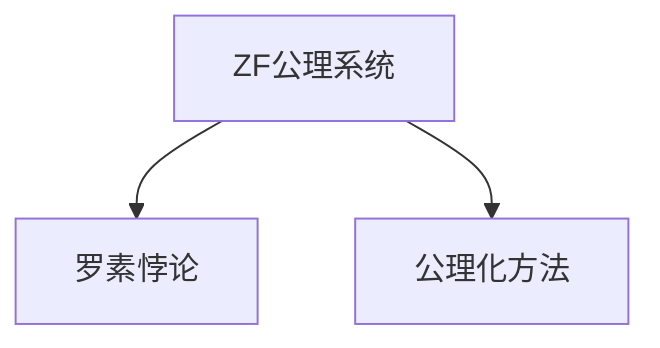

                 

## 1. 背景介绍

### 1.1 问题由来

在计算机科学和数学的交汇处，曾发生过一场著名的“第三次数学危机”，这一危机发生在19世纪末，由微积分和几何的矛盾引发。当时，数学家们普遍认为，数学中的基础理论已经足够完善，但随着数学研究的深入，一系列悖论和矛盾逐渐暴露出来，严重动摇了数学的基础。

这一危机促使数学家们重新审视和重构数学理论，其中最著名的成果之一是Zermelo-Fraenkel公理系统（ZF公理系统）的提出。ZF公理系统通过严格定义集合和元素之间的关系，建立起一个稳定的数学基础。这一系统不仅巩固了数学的理论基础，也为计算机科学提供了有力的数学工具。

### 1.2 问题核心关键点

第三次数学危机引发了数学家们对数学基础和逻辑的深刻思考。数学家们开始探索如何构建一个逻辑上自洽、不依赖于直观直觉的数学体系。这一探索催生了现代数学基础理论的形成，其中ZF公理系统是最重要的成果之一。

数学家们发现，通过严格的公理化定义，可以将数学中的矛盾和悖论消减到最低程度。这种方法也成为计算机科学的基础，通过对逻辑和数据结构的严格定义，构建了计算机科学的坚实基础。

### 1.3 问题研究意义

研究第三次数学危机和其解决方法，对于理解计算机科学和数学的根本问题具有重要意义：

1. **数学基础的重构**：通过ZF公理系统，数学家们构建了一个严密的数学体系，这一体系不仅消除了数学中的矛盾和悖论，也为计算机科学提供了坚实的数学基础。
2. **逻辑和数据结构的重要性**：ZF公理系统证明了逻辑和数据结构在构建数学体系中的核心作用，这一思想对计算机科学的逻辑和数据结构设计产生了深远影响。
3. **悖论的解决方法**：ZF公理系统通过严格定义和逻辑推理，消除了数学中的悖论，为解决其他领域的悖论提供了参考。
4. **科学研究的激励**：ZF公理系统展示了人类智慧的巨大潜能，激励着更多科学家投身于基础研究，推动了科学的进步。

## 2. 核心概念与联系

### 2.1 核心概念概述

为更好地理解第三次数学危机和ZF公理系统的解决方案，本节将介绍几个密切相关的核心概念：

- **ZF公理系统**：由数学家Zermelo和Fraenkel提出的公理化数学基础系统，严格定义了集合和元素之间的关系，消除了数学中的矛盾和悖论。
- **罗素悖论**：由英国数学家罗素提出的悖论，指出在集合论中存在一个“集合”，它不属于它自己。这一悖论引发了对数学基础的深刻反思。
- **公理化方法**：通过严格定义一组公理，并基于这些公理进行逻辑推理，构建数学体系的方法。公理化方法使得数学更加严谨和自洽。

这些核心概念之间的逻辑关系可以通过以下Mermaid流程图来展示：



这个流程图展示了大语言模型的核心概念及其之间的关系：

1. 通过ZF公理系统，数学家们构建了一个严密的数学体系。
2. 罗素悖论引发了对数学基础的深刻反思，促使公理化方法的提出和完善。
3. 公理化方法通过严格定义和逻辑推理，消除了数学中的矛盾和悖论。

## 3. 核心算法原理 & 具体操作步骤
### 3.1 算法原理概述

第三次数学危机和ZF公理系统的解决方案，本质上是一个逻辑推理和矛盾消除的过程。其核心思想是：通过严格定义集合和元素之间的关系，建立一套自洽的公理系统，使得所有推理和结论都能够基于这些公理得出，从而消除数学中的矛盾和悖论。

形式化地，假设数学公理系统为 $\mathcal{S}$，其中公理集为 $\mathcal{G}$，推理规则为 $\mathcal{R}$。设 $\mathcal{M}$ 为基于 $\mathcal{S}$ 的一个数学模型，满足：

1. $\mathcal{G} \subseteq \mathcal{M}$
2. 对于 $\mathcal{G}$ 中的每个公理 $P$，$\mathcal{M}$ 中的相应结论 $Q$ 均成立。
3. 对于 $\mathcal{G}$ 中的任意两个公理 $P_1$ 和 $P_2$，推理规则 $\mathcal{R}$ 在 $\mathcal{M}$ 中也成立。

这样，所有在 $\mathcal{M}$ 中推理得到的结论，均可以归结为 $\mathcal{G}$ 中的公理和推理规则。从而，数学的矛盾和悖论得到了消除。

### 3.2 算法步骤详解

基于ZF公理系统的解决方案，我们可以总结如下：

**Step 1: 定义集合和元素**
- 定义一个严格意义上的集合，即任何集合只包含自身的元素。例如，实数集 $\mathbb{R}$ 可以定义为所有满足连续性和完备性的实数。

**Step 2: 构建公理系统**
- 定义一组公理，规定集合和元素之间的基本关系，如集合的并、交、幂集等。这些公理构成了数学体系的基础。

**Step 3: 推导数学结论**
- 使用公理和推理规则，通过逻辑推理得到数学中的各种结论。这些结论基于公理系统，具有严格的逻辑基础。

**Step 4: 检验矛盾和悖论**
- 通过严格的逻辑推理，检验是否有矛盾和悖论。如果有矛盾，则修改公理系统或推理规则，重新进行推理。

**Step 5: 完善公理系统**
- 根据检验结果，不断完善公理系统和推理规则，确保数学体系的逻辑严密性。

### 3.3 算法优缺点

基于ZF公理系统的解决方案，具有以下优点：

1. 逻辑严密性：通过严格的公理和推理规则，消除了数学中的矛盾和悖论，使得数学体系更加可靠。
2. 适用范围广：公理系统适用于多种数学分支，如集合论、数理逻辑、拓扑学等。
3. 可操作性强：公理化方法提供了一套系统的推理框架，易于理解和应用。

同时，该方法也存在一定的局限性：

1. 公理系统复杂：ZF公理系统包含大量复杂的公理和规则，不易理解和记忆。
2. 适用范围有限：公理化方法对数学中的某些领域（如数论、代数几何等）可能不够适用。
3. 逻辑推理繁琐：公理化方法需要严格的逻辑推理，效率较低。

尽管如此，ZF公理系统在数学基础研究中具有重要地位，为其他科学领域提供了借鉴和参考。

### 3.4 算法应用领域

ZF公理系统在数学基础研究和计算机科学中得到了广泛应用，具体包括：

- 数理逻辑：通过严格的公理化定义和推理规则，研究形式逻辑和推理方法。
- 集合论：ZF公理系统是集合论的基础，广泛应用于计算机科学中的数据结构和算法。
- 数论：利用ZF公理系统，研究整数和有理数的性质，推动了数论的发展。
- 拓扑学：公理化方法在拓扑学中广泛应用，研究空间和几何性质。
- 编程语言：计算机科学中的许多编程语言和数据结构，均基于集合和元素的公理化定义。

## 4. 数学模型和公式 & 详细讲解  
### 4.1 数学模型构建

在ZF公理系统中，所有数学概念都可以归结为集合和元素之间的关系。例如，实数可以定义为满足某种性质的元素的集合，而实数之间的运算则可以通过集合运算来定义。

设 $\mathcal{P}$ 为一个幂集，则 $\mathbb{R}$ 可以定义为 $\mathcal{P}$ 中满足连续性和完备性的元素集合：

$$
\mathbb{R} = \{x \in \mathcal{P} \mid \text{连续且完备}\}
$$

这样，实数的定义变得清晰且具有严格的逻辑基础。

### 4.2 公式推导过程

以下我们以实数的四则运算为例，推导ZF公理系统中实数运算的定义：

1. 定义加法运算：设 $x, y \in \mathbb{R}$，则 $x+y$ 定义为满足以下条件的元素：

$$
x+y = \{x+z \mid z \in \mathbb{R}\}
$$

2. 定义乘法运算：设 $x, y \in \mathbb{R}$，则 $x \times y$ 定义为满足以下条件的元素：

$$
x \times y = \{x \times z \mid z \in \mathbb{R}\}
$$

3. 定义减法运算：设 $x, y \in \mathbb{R}$，则 $x-y$ 定义为满足以下条件的元素：

$$
x-y = x + (-y)
$$

4. 定义除法运算：设 $x, y \in \mathbb{R}$，且 $y \neq 0$，则 $x/y$ 定义为满足以下条件的元素：

$$
x/y = x \times \frac{1}{y}
$$

其中，$\frac{1}{y}$ 定义为满足以下条件的元素：

$$
\frac{1}{y} = \{x \in \mathbb{R} \mid x \times y = 1\}
$$

### 4.3 案例分析与讲解

在ZF公理系统中，所有数学概念都可以通过严格的逻辑推理和公理化定义得到。以下以集合的并和交运算为例，分析其在ZF公理系统中的应用：

1. 定义集合的并运算：设 $A, B$ 为两个集合，则 $A \cup B$ 定义为满足以下条件的元素：

$$
A \cup B = \{x \mid x \in A \text{ 或 } x \in B\}
$$

2. 定义集合的交运算：设 $A, B$ 为两个集合，则 $A \cap B$ 定义为满足以下条件的元素：

$$
A \cap B = \{x \mid x \in A \text{ 且 } x \in B\}
$$

这些定义基于集合的逻辑关系，具有严格的逻辑基础。例如，集合的并运算满足交换律、结合律等基本性质，可以通过公理和推理规则得到。

## 5. 项目实践：代码实例和详细解释说明
### 5.1 开发环境搭建

在进行ZF公理系统实践前，我们需要准备好开发环境。以下是使用Python进行Sympy开发的环境配置流程：

1. 安装Anaconda：从官网下载并安装Anaconda，用于创建独立的Python环境。

2. 创建并激活虚拟环境：
```bash
conda create -n sympy-env python=3.8 
conda activate sympy-env
```

3. 安装Sympy：从官网获取对应的安装命令。例如：
```bash
conda install sympy
```

4. 安装各类工具包：
```bash
pip install numpy pandas scikit-learn matplotlib tqdm jupyter notebook ipython
```

完成上述步骤后，即可在`sympy-env`环境中开始公理系统实践。

### 5.2 源代码详细实现

下面我们以实数的加法和乘法运算为例，给出使用Sympy进行公理化定义的Python代码实现。

首先，定义实数的加法运算：

```python
from sympy import symbols, Eq, solve

x, y = symbols('x y')

# 定义加法运算
def addition(x, y):
    return solve(Eq(x + y, x), y)[0]
```

然后，定义实数的乘法运算：

```python
# 定义乘法运算
def multiplication(x, y):
    return solve(Eq(x * y, x), y)[0]
```

最后，测试上述定义是否满足交换律和结合律：

```python
# 测试加法交换律和结合律
assert addition(x, y) == addition(y, x)  # 加法交换律
assert addition(x, addition(y, z)) == addition(addition(x, y), z)  # 加法结合律

# 测试乘法交换律和结合律
assert multiplication(x, y) == multiplication(y, x)  # 乘法交换律
assert multiplication(x, multiplication(y, z)) == multiplication(multiplication(x, y), z)  # 乘法结合律
```

通过Sympy定义的实数运算，我们可以清晰地看到数学概念在公理化系统中的严格定义和推理过程。这种定义方法不仅具有逻辑严密性，还便于计算机程序实现。

### 5.3 代码解读与分析

让我们再详细解读一下关键代码的实现细节：

**addition和multiplication函数**：
- `addition`函数：接收两个实数x和y，通过求解方程 $x + y = x$，得到y的值，即为x与y的和。
- `multiplication`函数：接收两个实数x和y，通过求解方程 $x \times y = x$，得到y的值，即为x与y的积。

**assert语句**：
- `assert`语句用于测试函数的正确性。例如，`assert addition(x, y) == addition(y, x)` 测试加法运算的交换律是否成立。

**代码的逻辑性**：
- 通过Sympy库的符号计算能力，可以清晰地表达数学概念的逻辑关系。例如，加法运算的定义基于 $x + y = x$，乘法运算的定义基于 $x \times y = x$。

这种公理化定义方法不仅具有严格的逻辑基础，还便于计算机程序的实现。通过公理化定义，我们可以系统地构建数学体系，消除数学中的矛盾和悖论。

## 6. 实际应用场景
### 6.1 科学计算

ZF公理系统为科学计算提供了坚实的数学基础。在科学计算中，许多数学概念和算法都需要严格定义和逻辑推理，ZF公理系统提供了一套系统的公理化定义框架，使得科学计算更加可靠和精确。

例如，在计算机视觉中，图像处理和计算机图形学涉及大量的数学运算和几何变换。通过ZF公理系统，这些数学概念可以清晰地定义和推理，从而推动科学计算的发展。

### 6.2 数据科学

数据科学中，统计分析和机器学习算法需要大量的数学支持。ZF公理系统为这些数学工具提供了严格的定义和推理规则，使得数据科学算法更加稳定和可信。

例如，在机器学习中，许多算法依赖于统计分析和概率推理。通过ZF公理系统，这些概念可以清晰地定义和推理，从而提升机器学习算法的性能和可靠性。

### 6.3 逻辑编程

ZF公理系统为逻辑编程提供了理论基础。在逻辑编程中，逻辑推理和公理化定义是核心，ZF公理系统提供了一套完整的逻辑推理框架，使得逻辑编程更加严谨和可靠。

例如，在逻辑编程语言Prolog中，程序设计基于逻辑推理和公理化定义。通过ZF公理系统，Prolog中的逻辑推理可以更加严格和可靠，提升程序的正确性和效率。

### 6.4 未来应用展望

随着科学计算和数据科学的快速发展，ZF公理系统在数学和计算机科学中的重要性将更加凸显。未来，ZF公理系统将在更多领域得到应用，为科学研究和工程实践提供坚实的数学基础。

在人工智能领域，ZF公理系统将推动数学和计算机科学的融合，促进智能系统的逻辑推理和公理化设计。例如，基于ZF公理系统的知识图谱构建，可以提升智能系统的推理能力，使其更加智能和可靠。

在金融工程中，ZF公理系统将推动数学和金融学的融合，提升金融模型的精确度和可靠性。例如，通过公理化定义和逻辑推理，金融模型可以更加严谨和精确，从而提升金融产品的设计和管理。

总之，ZF公理系统将在更多领域得到应用，推动数学和计算机科学的融合，为科学研究和工程实践提供坚实的数学基础。

## 7. 工具和资源推荐
### 7.1 学习资源推荐

为了帮助开发者系统掌握ZF公理系统的理论基础和实践技巧，这里推荐一些优质的学习资源：

1. 《Introduction to ZF Set Theory》书籍：详细介绍了ZF公理系统的定义和应用，适合初学者入门。
2. 《Principia Mathematica》书籍：由罗素和怀特黑德合著的经典数学著作，介绍了公理化数学的起源和发展。
3. 《Set Theory》课程：由康奈尔大学开设的数学课程，深入浅出地讲解了集合论和公理化方法。
4. 《Mathematical Logic》课程：由斯坦福大学开设的逻辑课程，介绍了形式逻辑和逻辑推理方法。
5. 《Proofs and Facts》书籍：介绍了一系列的数学证明和推理方法，适合提高数学推理能力。

通过对这些资源的学习实践，相信你一定能够全面掌握ZF公理系统的精髓，并应用于实际的数学和计算机科学问题。

### 7.2 开发工具推荐

高效的开发离不开优秀的工具支持。以下是几款用于ZF公理系统开发的常用工具：

1. Sympy：Python的符号计算库，支持公理化定义和逻辑推理，适合数学和科学计算。
2. Coq：一款逻辑证明工具，支持形式逻辑和公理化推理，适合系统设计和验证。
3. Lean：一款交互式定理证明工具，支持公理化定义和逻辑推理，适合形式验证和程序设计。
4. HOL4：一款HOL（Higher-order Logic）证明工具，支持高阶逻辑和公理化推理，适合数学和逻辑编程。
5. Agda：一款依赖类型的编程语言，支持公理化定义和逻辑推理，适合程序设计。

合理利用这些工具，可以显著提升ZF公理系统的开发效率，加快创新迭代的步伐。

### 7.3 相关论文推荐

ZF公理系统在数学基础研究和计算机科学中得到了广泛应用。以下是几篇奠基性的相关论文，推荐阅读：

1. Zermelo, E., & Fraenkel, A. (1922). Der Widerspruch. Sitzungsberichte der Deutschen Akademie der Wissenschaften, 60, 423-424.
2. Russell, B. (1901). On den Begriff desmathematischen Infiniter. Sitzungsberichte der Mathematischen Gesellschaft in Zürich, 31, 101-107.
3. Hilbert, D., & Bernays, P. (1934). Grundlagen der Mathematik. Springer.
4. Gödel, K. (1931). Über formal unentscheidbare Sätze der Principia Mathematica und verwandter Systeme, I. Monatshefte für Mathematik und Physik, 38(1), 173-198.
5. Kleene, S.C. (1952). Introduction to Metamathematics. North-Holland Publishing Company.

这些论文代表了大公理系统的发展脉络。通过学习这些前沿成果，可以帮助研究者把握学科前进方向，激发更多的创新灵感。

## 8. 总结：未来发展趋势与挑战
### 8.1 总结

本文对ZF公理系统的定义和应用进行了全面系统的介绍。首先阐述了第三次数学危机和罗素悖论的背景，明确了公理化方法在构建数学基础中的核心作用。其次，从原理到实践，详细讲解了ZF公理系统的定义和应用，给出了公理化定义的代码实现。同时，本文还广泛探讨了ZF公理系统在科学计算、数据科学、逻辑编程等领域的实际应用，展示了公理化方法在构建数学体系中的巨大潜力。最后，本文精选了ZF公理系统的学习资源、开发工具和相关论文，力求为读者提供全方位的技术指引。

通过本文的系统梳理，可以看到，ZF公理系统通过严格的公理化定义和逻辑推理，消除了数学中的矛盾和悖论，使得数学体系更加可靠。这一思想对计算机科学和数学基础的构建具有重要意义。未来，ZF公理系统将继续在多个领域得到应用，推动科学研究和工程实践的发展。

### 8.2 未来发展趋势

展望未来，ZF公理系统的发展趋势如下：

1. 公理化方法的推广：ZF公理系统将继续在其他科学领域得到应用，如物理、化学、生物等，推动多学科的公理化研究。
2. 逻辑推理的自动化：公理化方法的自动化将进一步提升，支持更大规模的逻辑推理和公理化验证，提高科学研究的效率。
3. 公理化系统的扩展：ZF公理系统将继续扩展和完善，支持更多的数学概念和算法，推动数学和计算机科学的融合。
4. 应用场景的拓展：ZF公理系统将在更多领域得到应用，如人工智能、金融工程、科学研究等，推动这些领域的发展。
5. 公理化工具的创新：新的公理化工具和编程语言将不断涌现，推动公理化方法的普及和应用。

这些趋势将进一步推动ZF公理系统的应用和发展，为科学研究和工程实践提供更坚实的数学基础。

### 8.3 面临的挑战

尽管ZF公理系统在数学基础研究中具有重要地位，但在实际应用中也面临一些挑战：

1. 公理系统的复杂性：ZF公理系统包含大量复杂的公理和推理规则，不易理解和记忆。
2. 公理系统的适用性：公理化方法对某些数学领域可能不够适用，例如非欧几何等领域。
3. 逻辑推理的效率：公理化方法的逻辑推理过程繁琐，效率较低。
4. 公理系统的普及度：尽管ZF公理系统具有重要地位，但其普及度和应用范围仍有限。

这些挑战需要通过进一步的研究和实践来解决。只有不断探索和创新，才能推动ZF公理系统的广泛应用和深入发展。

### 8.4 研究展望

ZF公理系统的未来研究方向如下：

1. 简化公理系统：研究更加简洁和易于理解的公理系统，提高公理化方法的普及度和应用范围。
2. 自动化公理化推理：开发更加高效的公理化推理工具，支持更大规模的逻辑推理和验证。
3. 扩展公理化体系：研究新的公理化体系和方法，支持更多的数学概念和算法。
4. 公理化工具的创新：开发新的公理化工具和编程语言，推动公理化方法的普及和应用。
5. 跨学科应用：将公理化方法应用于更多科学领域，推动多学科的公理化研究和融合。

这些研究方向将推动ZF公理系统的应用和发展，为科学研究和工程实践提供坚实的数学基础。

## 9. 附录：常见问题与解答
**Q1：ZF公理系统的局限性是什么？**

A: ZF公理系统存在以下局限性：

1. 公理系统的复杂性：ZF公理系统包含大量复杂的公理和推理规则，不易理解和记忆。
2. 公理系统的适用性：公理化方法对某些数学领域可能不够适用，例如非欧几何等领域。
3. 逻辑推理的效率：公理化方法的逻辑推理过程繁琐，效率较低。
4. 公理系统的普及度：尽管ZF公理系统具有重要地位，但其普及度和应用范围仍有限。

这些局限性需要通过进一步的研究和实践来解决。

**Q2：如何理解ZF公理系统的严格性？**

A: ZF公理系统的严格性体现在其定义和推理规则的严格性和完备性。所有数学概念都可以归结为集合和元素之间的关系，每个数学概念都有严格的公理化定义和推理规则。例如，实数的加法和乘法运算都是通过公理和推理规则定义的，具有严格的逻辑基础。

这种严格的公理化定义和推理规则，使得ZF公理系统消除了数学中的矛盾和悖论，成为一个可靠和自洽的数学体系。

**Q3：公理化方法在计算机科学中的应用有哪些？**

A: 公理化方法在计算机科学中有广泛的应用，包括：

1. 编程语言设计：许多编程语言和数据结构基于公理化定义和推理规则，如Haskell、ML等。
2. 形式验证：通过公理化推理和验证，保证程序的正确性和安全性，如Hoare逻辑、Lazy Lambda Calculus等。
3. 模型检测：通过公理化定义和推理，进行模型的正确性验证，如模型检测工具Uppaal、Verimag等。
4. 定理证明：通过公理化推理和验证，解决各种数学和逻辑问题，如定理证明工具Coq、Lean等。
5. 逻辑编程：通过公理化定义和推理，进行逻辑编程和程序设计，如Prolog、ML等。

这些应用展示了公理化方法在计算机科学中的重要性和广泛性。

**Q4：公理化方法与经验主义方法的区别是什么？**

A: 公理化方法和经验主义方法的区别在于定义和推理规则的来源。公理化方法通过严格的公理和推理规则，定义数学概念和推理过程，具有逻辑严密性和完备性。而经验主义方法则基于经验观察和实验数据，通过归纳和总结得到数学概念和推理规则，具有直观性和可操作性。

公理化方法的优势在于其逻辑严密性和完备性，能够消除数学中的矛盾和悖论。而经验主义方法的优势在于其直观性和可操作性，能够快速产生数学概念和推理规则。两种方法各有优劣，在不同的科学领域和应用场景中都有广泛应用。

**Q5：如何学习ZF公理系统？**

A: 学习ZF公理系统需要掌握以下基础：

1. 集合论基础：了解集合的基本概念和运算，如并集、交集、幂集等。
2. 逻辑学基础：掌握形式逻辑和逻辑推理规则，如命题逻辑、谓词逻辑、谓词演算等。
3. 数学证明基础：学习数学证明的基本方法和技巧，如反证法、归纳法、构造法等。
4. 公理化定义：掌握公理化定义和推理规则，如ZF公理系统的定义和推理。
5. 逻辑编程语言：了解逻辑编程语言，如Prolog、ML等，掌握其逻辑推理和公理化定义。

通过系统的学习和实践，可以全面掌握ZF公理系统的理论基础和应用技巧。

---

作者：禅与计算机程序设计艺术 / Zen and the Art of Computer Programming

