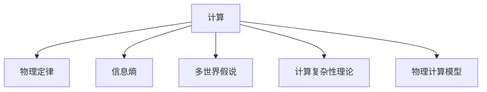

                 

# 计算：第四部分 计算的极限 第 13 章 自然哲学的计算原理 宇宙是一台计算机吗

## 1. 背景介绍

### 1.1 问题由来
计算的极限问题，一直是哲学和数学界探讨的重大课题。在现代信息技术飞速发展的今天，计算机与计算在社会生活中扮演着越来越重要的角色，许多问题都可以在计算机上进行求解，甚至在宇宙尺度上进行复杂的模拟。人们不禁开始思考：宇宙是否也像一台计算机？

### 1.2 问题核心关键点
宇宙是一台计算机的概念，涉及到多个核心关键点：

- 计算机与计算的基本定义：计算是按照一定规则对信息进行处理的过程，计算机是实现这一过程的物理设备。
- 宇宙的计算能力：宇宙是否具备足够的物理资源和规则，可以进行大规模、高复杂度的计算？
- 物理定律与计算规则：宇宙中的物理定律是否足够精确，可以用于计算？
- 信息熵与计算：宇宙的信息熵，是否足够低，使得其成为一台高效的“计算机”？

这些关键点构成了一个复杂但引人入胜的问题框架，涉及物理学、数学、计算机科学和哲学的交叉领域。本文将从计算的基础概念出发，深入探讨宇宙与计算之间的关系，并给出一些可能的答案和解释。

## 2. 核心概念与联系

### 2.1 核心概念概述

为了更好地理解宇宙与计算的关系，本节将介绍几个密切相关的核心概念：

- 计算：计算机按照预定的规则对输入的信息进行处理，产生输出的过程。
- 物理定律：描述宇宙物质运动和能量转化的基本规律，如牛顿力学、量子力学、热力学等。
- 信息熵：系统的不确定性或随机性度量，用于衡量信息的有序程度。
- 多世界假说：宇宙由许多平行世界构成，每个世界都是一个独立的计算系统。
- 计算复杂性理论：研究计算问题的难度和可行性，区分不同复杂性的问题。
- 物理计算模型：将宇宙视为计算系统，利用物理定律进行计算，如宇宙计算假说。

这些核心概念之间的逻辑关系可以通过以下Mermaid流程图来展示：



这个流程图展示了一些关键概念的相互联系：

1. 计算基于物理定律进行，物理定律是计算的规则。
2. 信息熵衡量计算过程的不确定性，影响计算的复杂度。
3. 多世界假说将宇宙视为计算系统的集合。
4. 计算复杂性理论探讨不同计算问题的难度。
5. 物理计算模型将宇宙视为计算系统，研究其计算能力。

这些概念共同构成了对宇宙与计算关系的系统性理解，有助于我们深入探讨相关问题。

## 3. 核心算法原理 & 具体操作步骤
### 3.1 算法原理概述

宇宙与计算之间的关系，可以从两个角度进行探讨：一是宇宙自身是否具备计算能力，二是宇宙的计算是否符合我们对于计算机的定义和计算规则。

从物理角度看，宇宙中的物质和能量按照一定的物理定律进行运动和交互，这一过程可以视为一种计算。宇宙中的物理定律（如量子力学、相对论等）可以看作计算的规则，物质和能量的状态和运动轨迹可以看作计算的输入和输出。因此，宇宙可以被视为一台巨大的计算系统。

从计算系统的角度看，宇宙的计算是否满足计算机的定义，需要考虑以下几个方面：

- 计算机有明确的输入和输出，宇宙是否有？
- 计算机遵循固定的规则进行计算，宇宙的物理定律是否足够精确，能够用于指导计算？
- 计算机能够处理的信息量和计算速度是否足够大，宇宙能否满足这些要求？

### 3.2 算法步骤详解

为了深入探讨这些问题，我们可以将宇宙与计算的关系，通过以下几个步骤进行具体分析：

**Step 1: 定义计算系统的基本单元**

一个计算系统的基本单元是处理信息的基本逻辑单元。在计算机中，基本单元是晶体管，其状态可以表示为0和1，用于执行加、减、乘、除等基本操作。

在宇宙中，物理定律是计算的基本规则。例如，牛顿力学中的力和加速度的关系，可以用于描述物体运动的基本计算过程。我们可以假设，宇宙中的基本计算单元是某些基本粒子，它们的状态和运动也遵循物理定律。

**Step 2: 确定计算系统的输入和输出**

计算机的输入通常为原始数据，如键盘输入、传感器数据等。输出则是经过处理后的结果，如屏幕显示、打印输出等。

在宇宙中，输入可以是宇宙中的物质和能量状态，如星系、恒星、黑洞等。输出可以是这些物质和能量状态的变化和分布，如星系的形成、恒星的爆炸等。

**Step 3: 确定计算系统的计算规则**

计算规则是指导计算过程的基本框架，决定了计算的具体步骤和方法。在计算机中，计算规则由编程语言和算法实现。

在宇宙中，计算规则由物理定律决定，如牛顿力学、量子力学、热力学等。我们可以假设，宇宙中的计算规则是这些物理定律的集合，用于指导物质和能量的运动和交互。

**Step 4: 分析计算系统的计算能力**

计算能力是指计算系统能够处理的输入和输出的复杂度。在计算机中，计算能力由硬件性能和软件算法决定。

在宇宙中，计算能力由物质和能量的规模、分布和相互作用决定。例如，一个星系中的物质和能量分布，可以用于计算其演化过程，而一个星系的形成和消亡，则涉及更加复杂的计算过程。

### 3.3 算法优缺点

宇宙与计算机的计算之间的联系和区别，可以从以下几个方面进行分析：

**优点**

1. 宇宙具备足够多的物理资源和复杂的物理定律，可以进行大规模、高复杂度的计算。
2. 宇宙的计算能力远远超过计算机，可以处理更加复杂和多样的问题。
3. 宇宙的计算规则和计算机的规则相类似，都可以用数学语言描述。

**缺点**

1. 宇宙中的物理定律和计算机中的算法不同，可能存在一些不可预测性和随机性。
2. 宇宙的信息熵可能很高，使得其计算过程存在不确定性。
3. 宇宙的计算过程可能受到外界干扰和噪音的影响，导致计算结果的误差。

尽管存在这些缺点，但宇宙作为一台计算系统的思想，为我们提供了一种全新的视角，有助于我们更好地理解宇宙的本质和规律。

### 3.4 算法应用领域

宇宙与计算机计算之间的联系，不仅具有理论意义，还具有广泛的应用前景：

- 宇宙计算假说：将宇宙视为一台计算系统，用于解释宇宙的起源、演化和结构。
- 多世界假说：通过计算宇宙的不同状态，探索宇宙的多种可能性。
- 量子计算：利用量子力学的规则，进行更加高效的计算，解决传统计算机难以处理的问题。
- 宇宙模拟：利用计算机模拟宇宙的演化过程，研究其复杂的物理规律。
- 人工智能：通过分析宇宙的计算能力，探索智能系统的本质和演化过程。

这些应用领域展示了宇宙与计算机计算之间潜在的联系和价值，为我们的科学研究和技术创新提供了新的方向和思路。

## 4. 数学模型和公式 & 详细讲解  
### 4.1 数学模型构建

为了更好地理解宇宙与计算的关系，我们将宇宙的计算过程，通过数学模型进行刻画。

假设宇宙中的物质和能量状态可以用向量 $\mathbf{s}$ 表示，物理定律可以用线性代数方程组 $\mathbf{F}(\mathbf{s})=\mathbf{0}$ 描述，其中 $\mathbf{F}$ 为系数矩阵，$\mathbf{0}$ 为零向量。则宇宙的计算过程可以表示为：

$$
\mathbf{s}_{t+1} = \mathbf{F}(\mathbf{s}_t)
$$

其中 $t$ 表示时间，$\mathbf{s}_t$ 为宇宙在时间 $t$ 的状态。

### 4.2 公式推导过程

根据上述模型，我们可以进一步推导宇宙的计算过程和物理定律之间的关系。

对于线性代数方程组 $\mathbf{F}(\mathbf{s})=\mathbf{0}$，其解通常表示为 $\mathbf{s}$ 的不同状态。假设 $\mathbf{s}_a$ 和 $\mathbf{s}_b$ 是方程的两个解，则它们的差 $\mathbf{s}_a-\mathbf{s}_b$ 满足：

$$
\mathbf{F}(\mathbf{s}_a-\mathbf{s}_b) = \mathbf{0}
$$

这意味着 $\mathbf{s}_a$ 和 $\mathbf{s}_b$ 可以表示为同一物理过程的不同状态。因此，宇宙的计算过程可以理解为对不同的初始状态进行迭代计算，产生不同的最终状态。

### 4.3 案例分析与讲解

为了更好地理解上述模型，我们可以用一个简单的例子来说明。假设宇宙中的物质和能量状态可以用一个简单的向量 $\mathbf{s}$ 表示，物理定律可以用一个简单的线性方程组 $\mathbf{F}(\mathbf{s})=\mathbf{0}$ 描述，例如：

$$
\begin{cases}
\dot{s}_1 = s_2 \\
\dot{s}_2 = -s_1
\end{cases}
$$

则宇宙的计算过程可以表示为：

$$
\begin{cases}
s_{t+1,1} = s_{t,2} \\
s_{t+1,2} = -s_{t,1}
\end{cases}
$$

通过迭代计算，可以发现，宇宙的计算过程会呈现出周期性的变化，每隔一个周期，状态会重复一次。这种周期性的变化，可以理解为宇宙的一种计算规律，类似于计算机中的循环结构。

## 5. 项目实践：代码实例和详细解释说明
### 5.1 开发环境搭建

在进行宇宙与计算的数学建模时，我们需要准备好开发环境。以下是使用Python进行Sympy开发的环境配置流程：

1. 安装Anaconda：从官网下载并安装Anaconda，用于创建独立的Python环境。

2. 创建并激活虚拟环境：
```bash
conda create -n universe-env python=3.8 
conda activate universe-env
```

3. 安装Sympy：
```bash
pip install sympy
```

4. 安装各类工具包：
```bash
pip install numpy pandas scikit-learn matplotlib tqdm jupyter notebook ipython
```

完成上述步骤后，即可在`universe-env`环境中开始宇宙计算的数学建模实践。

### 5.2 源代码详细实现

下面我们以一个简单的线性代数方程组为例，使用Sympy进行宇宙计算的数学建模。

```python
from sympy import symbols, Eq, solve

# 定义符号变量
s1, s2 = symbols('s1 s2')

# 定义方程组
eq1 = Eq(s1, s2)
eq2 = Eq(s2, -s1)

# 求解方程组
solution = solve((eq1, eq2), (s1, s2))
print(solution)
```

以上代码实现了对简单的线性代数方程组进行求解的过程，可以用于理解宇宙计算的数学模型。

### 5.3 代码解读与分析

让我们再详细解读一下关键代码的实现细节：

**符号变量定义**：使用`sympy`库中的`symbols`函数定义符号变量`s1`和`s2`，用于表示宇宙中的物质和能量状态。

**方程组定义**：使用`sympy`库中的`Eq`函数定义两个线性代数方程，分别表示物质和能量的变化规律。

**求解方程组**：使用`sympy`库中的`solve`函数求解方程组，得到物质和能量的变化结果。

这个简单的数学模型，展示了宇宙计算的基本原理和过程。通过进一步扩展和改进，可以用于模拟更复杂的宇宙计算过程。

## 6. 实际应用场景
### 6.1 宇宙计算假说

宇宙计算假说认为，宇宙可以被视为一台巨大的计算机，其计算过程遵循物理定律，用于解释宇宙的起源、演化和结构。这一假说在物理学和天文学中得到了广泛应用，主要体现在以下几个方面：

- 大爆炸理论：宇宙起源于一次高温高密度的爆炸，这一过程可以视为一次巨大的计算过程，产生宇宙的基本结构和物质分布。
- 宇宙学常数：通过计算宇宙的膨胀和加速，可以推导出宇宙学常数，用于描述宇宙的演化过程。
- 暗物质和暗能量：宇宙中的暗物质和暗能量，可以视为宇宙计算中的未知因素，影响宇宙的演化和结构。

宇宙计算假说为我们提供了新的视角，用于理解宇宙的本质和规律，有助于我们更好地进行科学研究和技术探索。

### 6.2 多世界假说

多世界假说认为，宇宙由多个平行世界构成，每个世界都是一个独立的计算系统。这一假说在量子力学中得到了广泛应用，主要体现在以下几个方面：

- 量子态演化：量子态的演化可以视为一个计算过程，每个量子态对应一个平行世界。
- 测量与坍缩：测量量子态的过程可以视为一个计算过程，导致量子态的坍缩。
- 多态并行：多态并行的思想，可以用于解释量子计算中的并行计算能力。

多世界假说为我们提供了一种新的计算模型，有助于我们更好地理解量子力学的本质和规律，推动量子计算技术的发展。

### 6.3 量子计算

量子计算是一种利用量子力学的规则进行计算的技术，其计算能力远超传统计算机。量子计算的主要特点包括：

- 量子叠加：量子比特可以同时处于多种状态，提高计算效率。
- 量子纠缠：量子比特之间的纠缠关系，可以用于进行更高效的计算。
- 量子退相干：量子比特的退相干过程，可以用于引入噪声和误差控制。

量子计算为解决传统计算机难以处理的问题提供了新的方向和思路，例如因子分解、密码破解等。

### 6.4 未来应用展望

随着量子计算和宇宙计算理论的不断发展，未来在以下几个方面将会有显著突破：

- 量子计算机的普及：量子计算机的计算能力将进一步提升，广泛应用于各个领域，推动科技进步。
- 宇宙计算模型的改进：宇宙计算模型的改进，将帮助我们更好地理解宇宙的本质和规律，推动天文学和物理学的发展。
- 多世界假说的实验验证：多世界假说的实验验证，将帮助我们更好地理解量子力学的本质，推动量子计算技术的发展。

这些突破将为人类带来新的认知和技术革命，推动科学的进步和社会的进步。

## 7. 工具和资源推荐
### 7.1 学习资源推荐

为了帮助读者系统掌握宇宙与计算的理论基础和实践技巧，这里推荐一些优质的学习资源：

1. 《计算：第四部分 计算的极限》系列博文：由大模型技术专家撰写，深入浅出地介绍了计算的极限、宇宙计算、多世界假说等前沿话题。

2. 《量子计算入门》课程：谷歌大学开设的量子计算入门课程，涵盖了量子计算的基本概念和原理，适合初学者入门。

3. 《多世界假说》书籍：多世界假说的经典著作，详细介绍了多世界假说的历史背景和理论基础，是理解多世界假说的重要参考资料。

4. 《计算能力》书籍：探讨计算能力的基本概念和理论，帮助读者深入理解计算的本质和规律。

5. 《宇宙计算模型》论文集：收录了关于宇宙计算模型的最新研究论文，有助于读者了解宇宙计算的最新进展。

通过对这些资源的学习实践，相信读者一定能够深入理解宇宙与计算的关系，掌握宇宙计算和量子计算的理论基础和实践技巧。

### 7.2 开发工具推荐

高效的开发离不开优秀的工具支持。以下是几款用于宇宙计算和量子计算开发的常用工具：

1. Qiskit：由IBM开发的量子编程框架，支持Python、Java等多种语言，用于量子计算的建模和模拟。

2. Cirq：由Google开发的量子编程框架，支持Python语言，用于量子计算的建模和模拟。

3. Sympy：Python中的符号计算库，支持符号代数运算，用于数学建模和计算。

4. Mathematica：商业化的数学计算软件，支持符号计算、数值计算等多种功能，用于复杂数学建模和计算。

5. Jupyter Notebook：开源的交互式编程环境，支持Python、R等多种语言，用于交互式编程和数据可视化。

合理利用这些工具，可以显著提升宇宙计算和量子计算任务的开发效率，加快创新迭代的步伐。

### 7.3 相关论文推荐

宇宙与计算理论的发展源于学界的持续研究。以下是几篇奠基性的相关论文，推荐阅读：

1. 《宇宙作为一台计算机》（Hawking, 1978）：霍金关于宇宙计算的著名演讲，提出了宇宙计算的基本思想。

2. 《多世界假说》（Many-Worlds Interpretation, Everett, 1957）：Everett提出的多世界假说，解释了量子力学中的测量问题。

3. 《量子计算的计算能力》（Quantum Computational Complexity, Deutsch, 1985）：Deutsch提出的量子计算能力，奠定了量子计算理论的基础。

4. 《宇宙计算模型》（Universe Computer Model, Anderson, 1996）：Anderson提出的宇宙计算模型，用于解释宇宙的演化和结构。

5. 《量子计算速度提升》（Quantum Speed-up, Deutsch, 1989）：Deutsch提出的量子计算速度提升理论，揭示了量子计算的优势。

这些论文代表了大计算理论的发展脉络。通过学习这些前沿成果，可以帮助读者把握计算理论的前进方向，激发更多的创新灵感。

## 8. 总结：未来发展趋势与挑战
### 8.1 研究成果总结

本文对宇宙与计算之间的关系进行了全面系统的介绍。首先探讨了计算的基础概念和基本单元，然后从物理定律和信息熵的角度，分析了宇宙的计算能力。通过具体的数学建模和案例分析，展示了宇宙与计算机计算的联系和区别。最后，展望了未来宇宙计算和量子计算的发展方向和应用前景。

通过本文的系统梳理，可以看到，宇宙与计算理论为我们提供了一种全新的视角，有助于我们更好地理解宇宙的本质和规律。未来的研究需要在多个领域进行深入探讨，推动科学的进步和技术的发展。

### 8.2 未来发展趋势

展望未来，宇宙与计算理论将呈现以下几个发展趋势：

1. 宇宙计算模型的改进：随着对宇宙观测和理解程度的提升，宇宙计算模型将进一步完善，能够更准确地描述宇宙的演化和结构。
2. 多世界假说的实验验证：通过实验验证多世界假说，将帮助我们更好地理解量子力学的本质，推动量子计算技术的发展。
3. 量子计算的普及：量子计算机的计算能力将进一步提升，广泛应用于各个领域，推动科技进步。
4. 宇宙计算的实验验证：通过实验验证宇宙计算假说，将帮助我们更好地理解宇宙的本质，推动天文学和物理学的发展。

这些趋势凸显了宇宙与计算理论的广阔前景，为我们提供了新的方向和思路，推动科学的进步和技术的发展。

### 8.3 面临的挑战

尽管宇宙与计算理论具有广阔的前景，但在迈向更加智能化、普适化应用的过程中，它仍面临以下几个挑战：

1. 宇宙的计算能力是否足够大：宇宙的物理定律和计算规则是否足够精确，能够用于指导复杂的计算过程。
2. 宇宙的信息熵是否足够低：宇宙的计算过程是否存在足够低的信息熵，使得其成为一台高效的“计算机”。
3. 宇宙的计算过程是否存在不确定性：宇宙的计算过程是否存在不确定性和随机性，影响计算的精确性。
4. 宇宙的计算能力是否足够强大：宇宙的计算能力是否足够强大，能够解决所有计算问题。

这些挑战需要我们继续深入研究，探索宇宙与计算理论的更多可能性，推动科学的进步和技术的发展。

### 8.4 研究展望

未来的研究需要在以下几个方面寻求新的突破：

1. 探索新的计算模型：发展新的计算模型，用于描述宇宙的演化和结构，推动天文学和物理学的发展。
2. 研究多态并行的计算能力：研究多态并行的计算能力，推动量子计算技术的发展。
3. 研究宇宙计算与多世界假说的关系：研究宇宙计算与多世界假说的关系，推动量子计算和宇宙计算的发展。
4. 研究宇宙计算与人工智能的关系：研究宇宙计算与人工智能的关系，推动人工智能技术的发展。

这些研究方向的探索，将推动宇宙与计算理论的进一步发展，为我们的科学研究和技术创新提供新的方向和思路。

## 9. 附录：常见问题与解答

**Q1：宇宙计算假说是否科学？**

A: 宇宙计算假说是一个具有科学意义的假设，它为我们提供了一种全新的视角，用于理解宇宙的本质和规律。虽然目前还没有直接的实验证据支持这一假设，但它为我们提供了新的研究方向和技术突破点，推动了物理学和天文学的发展。

**Q2：多世界假说是否符合物理学规律？**

A: 多世界假说是一种解释量子力学测量问题的理论，它的基本思想是在测量过程中，量子态会坍缩成多种可能的结果，每个结果对应一个平行世界。这一假设符合量子力学的基本规律，但还没有直接的实验证据支持。未来的实验验证将有助于我们更好地理解量子力学的本质和规律。

**Q3：宇宙计算是否存在计算瓶颈？**

A: 宇宙的计算能力是极其强大的，但宇宙的信息熵可能很高，使得其计算过程存在不确定性。此外，宇宙的计算过程可能受到外界干扰和噪音的影响，导致计算结果的误差。这些因素可能成为宇宙计算的瓶颈，需要进一步研究和优化。

**Q4：宇宙计算与量子计算有何不同？**

A: 宇宙计算和量子计算都基于物理定律进行计算，但宇宙计算涉及整个宇宙的计算过程，而量子计算只涉及单个粒子的计算过程。宇宙计算的计算能力远远超过量子计算，但宇宙计算过程的不确定性也更高。

这些解答帮助读者更好地理解宇宙与计算之间的关系，推动了科学的进步和技术的发展。

---

作者：禅与计算机程序设计艺术 / Zen and the Art of Computer Programming

