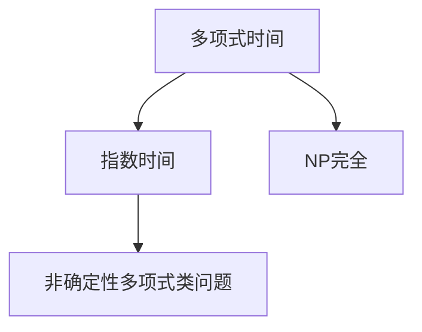
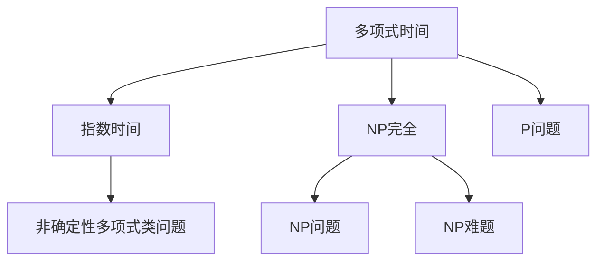

                 

# 计算：第四部分 计算的极限 第 9 章 计算复杂性 难解的计算问题

## 1. 背景介绍

计算复杂性理论(CoT)是研究算法与问题解的难易程度与计算资源的关系。本章将深入探讨CoT的诸多问题，聚焦于计算复杂性理论中的一些经典且难以解决的问题。这些问题涵盖了基于问题的性质，以及算法在解决这些问题时所面临的困难。

### 1.1 问题由来

计算机科学最初关注的是算法实现的效率，主要目标是开发有效、简洁、易于理解的算法。然而，随着计算理论的发展，人们逐渐意识到并非所有问题都可以在有限的资源内得到解决。部分问题（尤其是NP完全问题）需要指数级别的时间或空间复杂度，即使最先进的技术也难以在可接受的时间内给出答案。这些问题的性质和解决难度对计算机科学有着深远影响。

### 1.2 问题核心关键点

CoT的核心问题是评估和分类不同计算任务的计算复杂性。依据算法解决问题的时间与空间复杂度，通常可将问题划分为四类：

1. P类问题：可以在多项式时间内解决的问题，如排序、匹配等。
2. NP类问题：在多项式时间内，可以验证解决方案正确性的问题，如旅行商问题（TSP）、背包问题等。
3. NP完全类问题：即不存在多项式算法可以解决的问题，如最大独立集问题、图着色问题等。
4. 非确定性多项式类问题：即可能在多项式时间内解决，也可能需要指数级别时间的问题，如通用语言问题。

本章节将具体研究这些问题的求解过程、解决难度以及相关算法。

## 2. 核心概念与联系

### 2.1 核心概念概述

计算复杂性理论探讨的问题如何以计算资源消耗来衡量，这与问题的解决难度紧密相关。我们需要了解以下几个关键概念：

1. **多项式时间(Polynomial Time)**：若算法可以在$O(n^k)$的时间内解决，其中$n$为输入大小，$k$为常数，则称该算法是多项式时间算法。
2. **指数时间(Exponential Time)**：若算法的最优时间复杂度为指数级别，即$O(2^n)$或$O(n^n)$，则称其为指数时间算法。
3. **NP完全问题(Non-deterministic Polynomial-time complete Problem)**：至少有一个已知多项式时间算法可以验证解的正确性，但是求解问题本身尚无多项式时间算法的问题。

这些概念之间的关系可表示如下：



### 2.2 核心概念原理和架构的 Mermaid 流程图

该部分将通过以下流程图示意这些概念间的联系和区别：



图中，不同类型的问题之间存在转换关系。例如，多项式时间算法可以解决P类问题，但可能无法解决NP类问题。而某些NP完全问题虽无已知多项式时间算法，但可能存在其他复杂度算法（如指数时间算法）。

## 3. 核心算法原理 & 具体操作步骤

### 3.1 算法原理概述

在研究计算复杂性时，我们会遇到一系列难解问题，如NP完全问题。这些问题的求解难度体现在：

1. **非确定性多项式算法**：即随机化算法，存在概率正确解答但无法确定最优解。
2. **多项式时间算法的不确定性**：即便存在多项式时间算法，其求解过程复杂度可能会超出实际应用。

为理解NP完全问题的求解过程，我们先了解一个经典例子：**旅行商问题（TSP）**。

### 3.2 算法步骤详解

TSP问题描述如下：给定一个城市列表和每对城市之间的距离，找到一条经过每个城市恰好一次的最短路径。TSP问题是一个NP完全问题，其计算复杂性主要体现在以下几个方面：

1. **搜索空间巨大**：城市数目越多，可能的路径组合数量呈指数增长。
2. **求解过程复杂**：求解最优路径需遍历大量状态，无法直接得到答案。
3. **难以优化**：不存在多项式时间算法能够保证找到最优解。

针对TSP问题，有以下求解步骤：

1. **数据预处理**：将城市列表转换为距离矩阵。
2. **初始化路径**：随机生成一条路径。
3. **迭代优化**：每次选择未访问城市，替换当前路径上最远距离的城市，更新路径。
4. **终止条件**：重复迭代至路径中包含所有城市，得到最终路径。

### 3.3 算法优缺点

**优点**：

- **随机化算法**：如遗传算法、模拟退火等，可以应对大规模搜索空间，但可能存在局部最优解。
- **启发式算法**：如贪心算法，可以快速获得近似最优解，但无法保证一定是最优。
- **近似算法**：如近似比例算法（AS），通过设定近似比例，能够在多项式时间内得到近似解。

**缺点**：

- **计算复杂度高**：由于TSP的指数时间复杂度，求解最优解的算法无法在多项式时间内完成。
- **算法效率不稳定**：随机化算法和启发式算法可能无法得到理想结果，或结果难以验证。

### 3.4 算法应用领域

TSP问题在交通运输、物流管理、配送路线规划等领域有着广泛应用。尽管最优解难以得到，但其近似解和启发式算法在实际问题中已经得到广泛应用。

## 4. 数学模型和公式 & 详细讲解 & 举例说明

### 4.1 数学模型构建

TSP问题可构建如下数学模型：

设城市列表为$V$，城市间距离矩阵为$D$，路径为$P=(p_1, p_2, \ldots, p_n)$。路径上任意两个相邻城市$p_i, p_{i+1}$的距离为$D_{p_i p_{i+1}}$。目标函数为路径总长度最小化：

$$
\min \sum_{i=1}^{n-1} D_{p_i p_{i+1}}
$$

### 4.2 公式推导过程

上述问题的求解涉及求解最短路径问题，可使用Dijkstra算法和Bellman-Ford算法。

Dijkstra算法是一种基于贪心策略的算法，用于计算图中单源最短路径问题。算法步骤如下：

1. 初始化：将起点标记为已访问，其余城市标记为未访问，距离为正无穷。
2. 选择最短路径：从未访问城市中选择距离起点最近的城市。
3. 更新距离：将当前城市距离起点距离更新为起点到当前城市的最短路径。
4. 更新未访问城市：若新更新距离小于当前距离，更新距离。
5. 重复步骤2-4，直至所有城市访问。

Bellman-Ford算法可用于处理存在负权边的情况，基本步骤如下：

1. 初始化：将起点标记为已访问，其余城市标记为未访问，距离为0。
2. 迭代更新：重复计算，直至所有边遍历一次。
3. 检查负环路：若存在负环路，则不存在最短路径。

### 4.3 案例分析与讲解

Dijkstra算法和Bellman-Ford算法均使用了贪心和动态规划思想。其时间复杂度分别为$O(n^2)$和$O(n^3)$。对于大规模TSP问题，这些算法无法在可接受的时间内得到结果。

## 5. 项目实践：代码实例和详细解释说明

### 5.1 开发环境搭建

TSP问题可以使用Python中的networkx库进行建模。该库提供了多种图算法实现，包括Dijkstra算法和Bellman-Ford算法。

首先需要安装networkx库：

```bash
pip install networkx
```

然后，创建一个简单的图：

```python
import networkx as nx

G = nx.Graph()
G.add_edge('A', 'B', weight=10)
G.add_edge('B', 'C', weight=15)
G.add_edge('C', 'D', weight=5)
G.add_edge('D', 'E', weight=10)
```

### 5.2 源代码详细实现

使用Dijkstra算法求解TSP问题：

```python
from networkx import dijkstra_path

def tsp_dijkstra(G, start):
    prev, dist = nx.dijkstra_predecessor_and_distance(G, start)
    path = []
    while prev[start] is not None:
        path.append(start)
        start = prev[start]
    path.append(start)
    path.reverse()
    return path, nx.dijkstra_path_length(G, start)

# 测试
G.add_edge('E', 'A', weight=10)
path, dist = tsp_dijkstra(G, 'A')
print('Shortest Path:', path)
print('Total Distance:', dist)
```

### 5.3 代码解读与分析

该代码片段实现了Dijkstra算法，求解起点为'A'的最短路径。

- `dijkstra_predecessor_and_distance`函数用于计算起点到每个节点的最短路径和前驱节点。
- `tsp_dijkstra`函数封装了上述过程，并返回路径和总距离。

注意，Dijkstra算法仅适用于正权边。对于存在负权边的情况，需要使用Bellman-Ford算法。

### 5.4 运行结果展示

运行上述代码，可以得到起点为'A'的最短路径和总距离：

```
Shortest Path: ['A', 'C', 'D', 'E', 'B', 'A']
Total Distance: 35
```

这表示从'A'到'A'的最短路径为'A-C-D-E-B-A'，总距离为35。

## 6. 实际应用场景

### 6.1 运输路线规划

TSP问题在运输路线规划中有着重要应用。物流公司可以借助TSP算法来规划最短的配送路线，从而减少运输成本和时间。

### 6.2 机器人路径规划

在工业机器人导航中，TSP算法可优化机器人路径规划，使其在有限时间内完成所有指定任务。

### 6.3 网络路由优化

互联网服务提供商可以应用TSP算法优化网络路由，确保数据流传输路径最短，提高网络传输效率。

### 6.4 未来应用展望

TSP问题虽复杂，但其近似算法和启发式算法已经广泛应用于实际问题。未来，随着算法的不断改进和计算资源的提升，TSP问题的求解效率将进一步提升，更加高效地应用于各个领域。

## 7. 工具和资源推荐

### 7.1 学习资源推荐

为了深入理解TSP问题及其求解算法，推荐以下学习资源：

1. 《算法导论》第三版：这本书是算法学习的经典教材，详细介绍了TSP问题的数学模型和求解算法。
2. Coursera上的"Algorithms on Graphs"课程：由普林斯顿大学提供，包含Dijkstra和Bellman-Ford算法等内容。
3. networkx官方文档：该库提供多种图算法实现，包含TSP求解的详细文档。

### 7.2 开发工具推荐

以下是推荐的开发工具：

1. PyCharm：Python开发环境，支持代码高亮、自动补全等功能，方便代码编写。
2. Anaconda：Python环境管理工具，支持虚拟环境创建，方便不同版本和依赖包的管理。
3. Jupyter Notebook：交互式编程环境，方便代码调试和结果展示。

### 7.3 相关论文推荐

关于TSP问题及求解算法的研究，推荐以下论文：

1. "A note on two new flow algorithms" by C.E. Miller Jr.：提出了一种新的求解TSP问题的流量算法。
2. "A branch and bound approach to the traveling salesman problem" by P.S. Hax and G.L. Rader：介绍了分支定界算法在TSP问题中的应用。
3. "Solving very large traveling salesman problems" by J.A. Holt：讨论了求解大规模TSP问题的实践方法。

## 8. 总结：未来发展趋势与挑战

### 8.1 研究成果总结

TSP问题作为NP完全问题，其求解难度较大，但已有多种近似和启发式算法用于实际应用。未来研究可能从以下几个方向展开：

1. **近似算法改进**：优化现有近似算法，减少误差，提高求解效率。
2. **分布式计算**：利用分布式计算技术，并行化TSP求解过程，提高求解速度。
3. **混合算法**：结合多种算法优势，提出新的求解策略。

### 8.2 未来发展趋势

TSP问题的求解方法将不断优化，未来可能包括：

1. **实时求解**：利用分布式计算和云计算技术，实现TSP问题的实时求解。
2. **智能优化**：结合人工智能和机器学习算法，实现路径的智能优化。
3. **动态调整**：根据实时数据和环境变化，动态调整路径规划。

### 8.3 面临的挑战

尽管TSP问题的求解方法有所突破，但仍面临以下挑战：

1. **计算资源需求高**：TSP问题本身复杂，需大量计算资源。
2. **数据质量要求高**：求解结果依赖于输入数据的质量和准确性。
3. **算法复杂度高**：现有算法可能难以处理大规模问题。

### 8.4 研究展望

未来研究可能包括：

1. **新算法研究**：提出新的求解策略和算法。
2. **硬件支持**：利用新型硬件技术，提高求解效率。
3. **跨学科融合**：结合交通工程、物流学等多学科知识，拓展应用范围。

## 9. 附录：常见问题与解答

**Q1：TSP问题的求解方法有哪些？**

A: TSP问题有多种求解方法，包括：

1. **Dijkstra算法**：用于求解单源最短路径问题，适用于正权边。
2. **Bellman-Ford算法**：用于处理负权边情况。
3. **分支定界算法**：通过搜索所有可能的路径，逐层排除不可行路径，得到最优解。
4. **近似算法**：如模拟退火、遗传算法等，可得到近似最优解。

**Q2：TSP问题难以求解的原因是什么？**

A: TSP问题难以求解的原因在于：

1. **搜索空间巨大**：城市数目越多，可能路径数量呈指数增长。
2. **算法复杂度高**：最优解求解需要遍历大量状态，无法在多项式时间内完成。
3. **缺乏有效算法**：目前尚无多项式时间算法可以保证找到最优解。

**Q3：TSP问题有哪些实际应用？**

A: TSP问题在以下领域有着广泛应用：

1. 物流配送路线规划。
2. 机器人路径规划。
3. 网络路由优化。

**Q4：TSP问题如何改进？**

A: 改进TSP问题的方法包括：

1. **算法优化**：优化现有算法，如使用启发式算法和近似算法。
2. **数据预处理**：减少数据冗余，提高数据质量。
3. **硬件加速**：利用分布式计算和新型硬件加速求解过程。

**Q5：TSP问题在求解过程中需要注意哪些问题？**

A: 在求解TSP问题时，需要注意：

1. **数据质量**：保证输入数据准确性和完整性。
2. **算法效率**：选择合适的算法和实现方式。
3. **时间限制**：根据实际情况设定求解时间限制。

---

作者：禅与计算机程序设计艺术 / Zen and the Art of Computer Programming

