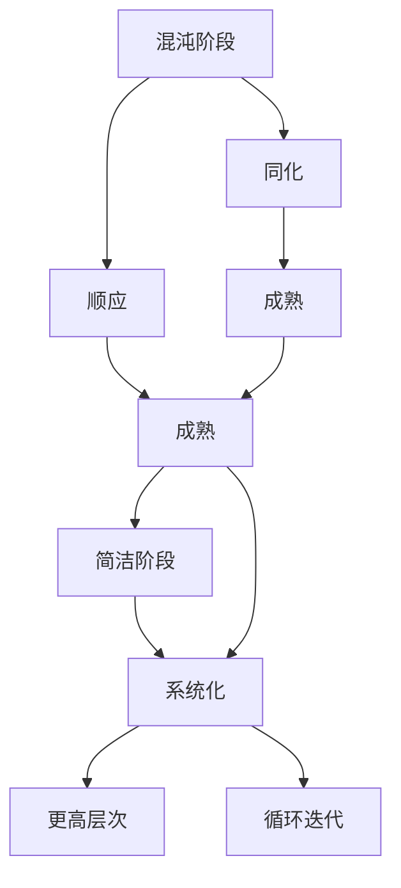

                 

## 1. 背景介绍

在人工智能(AI)的发展历程中，认知发展理论(Cognitive Development Theory)扮演了至关重要的角色。自皮亚杰(Jean Piaget)提出"图式(Schema)"、"同化(Assimilation)"和"顺应(Accommodation)"等基本概念以来，认知发展理论成为指导AI系统设计的重要理论框架之一。认知发展理论将认知过程抽象为一系列的阶段，每个阶段反映了人类思维和学习的特定发展水平。本文聚焦于其中的"混沌"和"简洁"阶段，探讨其与人工智能系统设计的关系，并结合具体的算法和技术，分析认知发展在AI中的应用和意义。

## 2. 核心概念与联系

### 2.1 核心概念概述

在认知发展理论中，"混沌"和"简洁"是对认知发展过程的两个不同阶段：

- **混沌阶段(Chaotic Stage)**：在这个阶段，个体的认知结构尚未成熟，无法处理复杂的任务。认知过程表现出混乱、无序和自我中心的特点，需要通过同化和顺应不断调整认知结构以适应环境。
- **简洁阶段(Simplified Stage)**：在这个阶段，个体的认知结构趋于成熟，能够处理复杂任务。认知过程表现出简洁、有序和系统化的特点，通过认知重组和抽象，构建更高层次的认知结构。

两个阶段之间是相互关联的，混沌阶段为简洁阶段的形成奠定了基础，简洁阶段又不断通过反馈回溯到混沌阶段，促进认知结构的进一步完善。

### 2.2 核心概念原理和架构的 Mermaid 流程图



这个流程图展示了混沌阶段向简洁阶段的发展路径，其中同化(Assimilation)和顺应(Accommodation)是关键过程，而系统化(Systematization)和更高层次(Cognitive Reorganization)是最终目标。

## 3. 核心算法原理 & 具体操作步骤

### 3.1 算法原理概述

基于认知发展理论的AI系统设计，主要遵循以下几个算法原理：

1. **同化和顺应**：通过同化(Assimilation)使新信息融入现有认知结构，通过顺应(Accommodation)调整认知结构以适应新信息。这反映了AI系统在处理新数据时，通过已有知识进行推理，并通过反馈不断优化模型。

2. **认知重组**：认知重组(Cognitive Reorganization)指通过整合和重组已有知识，构建更高层次的认知结构。在AI系统中，这通常意味着使用迁移学习、模型压缩、特征提取等技术，将低层次的特征提升到高层次的语义表示。

3. **系统化**：系统化(Systematization)指通过抽象和归纳，构建系统化的认知结构。在AI系统中，这通常意味着通过规则引擎、决策树、神经网络等技术，将复杂问题分解为可管理的小任务。

4. **反馈循环**：反馈循环(Feedback Loop)指通过不断获取反馈，调整认知结构和行为。在AI系统中，这通常意味着使用在线学习、增强学习、评估指标等技术，持续改进模型性能。

### 3.2 算法步骤详解

**步骤1：认知结构的建立**

1. **初始化**：在AI系统启动时，使用预训练模型或知识图谱，构建基本的认知结构。例如，使用BERT模型作为预训练的语义表示，或使用Graph Neural Network作为预训练的知识图谱。

2. **同化和顺应**：通过同化将新数据融入现有认知结构，通过顺应调整认知结构以适应新数据。例如，在大规模文本分类任务中，使用微调方法，将新文本数据与现有模型结合，进行同化和顺应。

**步骤2：认知结构的调整**

1. **认知重组**：通过特征提取、迁移学习等方法，将低层次的特征提升到高层次的语义表示。例如，在图像分类任务中，使用卷积神经网络(Convolutional Neural Network, CNN)提取图像特征，并通过全局最大池化(Global Max Pooling)进行特征重组。

2. **系统化**：通过规则引擎、决策树、神经网络等方法，将复杂问题分解为可管理的小任务。例如，在推荐系统任务中，使用协同过滤(Collaborative Filtering)和神经网络技术，将推荐问题分解为用户特征抽取和物品相似度计算。

**步骤3：认知结构的优化**

1. **反馈循环**：通过在线学习、增强学习等方法，不断获取反馈，调整认知结构和行为。例如，在对话系统中，使用序列到序列(Sequence to Sequence, Seq2Seq)模型，将用户输入和系统响应相结合，通过反馈不断优化模型。

2. **评估与优化**：使用评估指标，如准确率、召回率、F1分数等，评估模型性能。例如，在情感分析任务中，使用混淆矩阵(Confusion Matrix)评估分类效果，并使用超参数调优方法，优化模型结构。

### 3.3 算法优缺点

基于认知发展理论的AI系统设计具有以下优点：

1. **自适应性强**：通过同化和顺应机制，AI系统能够自适应新数据，不断优化认知结构。

2. **鲁棒性强**：系统化的认知结构有助于提高模型的鲁棒性和泛化能力，减少过拟合风险。

3. **知识迁移快**：认知重组和迁移学习方法，使得模型能够快速迁移已有知识，适应新任务。

4. **模型效率高**：系统化的方法，如神经网络、规则引擎等，能够高效处理复杂任务。

但同时，该方法也存在以下局限：

1. **模型复杂度高**：系统化的方法可能需要复杂的模型结构，增加计算和存储负担。

2. **数据依赖性强**：同化和顺应依赖于数据质量，数据不足或偏差可能影响模型效果。

3. **认知重组难度大**：高层次认知结构的构建，需要深厚的领域知识和丰富的经验。

4. **反馈信息干扰**：反馈循环中的信息干扰可能导致模型的不稳定。

5. **可解释性不足**：复杂的认知结构可能缺乏可解释性，难以理解模型内部机制。

### 3.4 算法应用领域

基于认知发展理论的AI系统设计，已经在多个领域得到广泛应用：

1. **自然语言处理(Natural Language Processing, NLP)**：在文本分类、机器翻译、问答系统等任务中，使用同化和顺应的机制，通过微调方法调整模型，提升性能。

2. **计算机视觉(Computer Vision)**：在图像分类、目标检测、图像生成等任务中，使用认知重组方法，通过特征提取和迁移学习，提高模型效果。

3. **推荐系统(Recommender Systems)**：在个性化推荐、商品匹配等任务中，使用系统化方法，通过协同过滤和神经网络，构建推荐模型。

4. **智能对话系统(Intelligent Dialogue Systems)**：在智能客服、智能助手等任务中，使用反馈循环方法，通过Seq2Seq模型和在线学习，提升对话效果。

5. **知识图谱(Knowledge Graph)**：在知识管理、信息检索等任务中，使用认知重组和系统化方法，通过Graph Neural Network和规则引擎，构建知识图谱。

6. **自动驾驶(Autonomous Driving)**：在路径规划、环境感知等任务中，使用同化和顺应方法，通过融合多传感器数据和模型训练，提升系统性能。

## 4. 数学模型和公式 & 详细讲解 & 举例说明

### 4.1 数学模型构建

在基于认知发展理论的AI系统中，数学模型主要包括以下几个部分：

1. **认知结构表示**：使用向量、矩阵等数学工具表示认知结构。例如，使用BERT模型表示文本语义。

2. **同化和顺应算法**：通过向量加权、矩阵变换等方法，实现同化和顺应。例如，使用微调方法，将新文本数据与现有模型结合。

3. **认知重组算法**：通过矩阵分解、特征提取等方法，进行认知重组。例如，使用CNN提取图像特征。

4. **系统化算法**：通过规则引擎、决策树、神经网络等方法，进行系统化建模。例如，使用Seq2Seq模型，将用户输入和系统响应相结合。

5. **反馈循环算法**：通过在线学习、增强学习等方法，实现反馈循环。例如，使用在线学习算法，不断调整模型参数。

### 4.2 公式推导过程

**同化和顺应算法**：

假设原始认知结构表示为向量 $\mathbf{x}$，新数据表示为向量 $\mathbf{y}$，同化和顺应公式为：

$$
\mathbf{z} = \alpha \mathbf{x} + (1-\alpha)\mathbf{y}
$$

其中 $\alpha$ 为同化权重，通常取值为0.5，表示平均分配新旧信息。

**认知重组算法**：

假设原始认知结构表示为矩阵 $\mathbf{A}$，特征提取表示为矩阵 $\mathbf{B}$，认知重组公式为：

$$
\mathbf{C} = \mathbf{A} \mathbf{B}
$$

其中 $\mathbf{C}$ 表示重组后的认知结构。

**系统化算法**：

假设认知重组后的结构表示为矩阵 $\mathbf{C}$，系统化表示为向量 $\mathbf{d}$，系统化公式为：

$$
\mathbf{e} = \mathbf{C} \mathbf{d}
$$

其中 $\mathbf{e}$ 表示系统化后的认知结构。

**反馈循环算法**：

假设系统化后的认知结构表示为向量 $\mathbf{e}$，反馈信息表示为向量 $\mathbf{f}$，反馈循环公式为：

$$
\mathbf{g} = \mathbf{e} + \beta \mathbf{f}
$$

其中 $\beta$ 为反馈权重，通常取值为0.1，表示在认知结构中添加少量反馈信息。

### 4.3 案例分析与讲解

以文本分类为例，分析认知发展理论在AI中的应用。

**初始化**：使用预训练的BERT模型作为初始认知结构。

**同化和顺应**：将新文本数据输入BERT模型，通过微调方法，同化和顺应新数据，调整模型参数。

**认知重组**：通过特征提取，使用CNN提取文本特征，进行认知重组。

**系统化**：使用规则引擎或神经网络，将特征映射到分类结果，进行系统化建模。

**反馈循环**：通过在线学习算法，不断获取反馈信息，调整模型参数，提高分类精度。

## 5. 项目实践：代码实例和详细解释说明

### 5.1 开发环境搭建

在实践中，使用Python和PyTorch搭建基于认知发展理论的AI系统。

**安装依赖**：

```bash
pip install torch torchvision transformers numpy pandas sklearn
```

**环境配置**：

```python
import torch
import torchvision.transforms as transforms
import torchvision.datasets as datasets
from transformers import BertTokenizer, BertForSequenceClassification

device = torch.device('cuda' if torch.cuda.is_available() else 'cpu')
```

### 5.2 源代码详细实现

以BERT微调为例，进行文本分类任务。

**数据预处理**：

```python
class TextDataset(torch.utils.data.Dataset):
    def __init__(self, texts, labels, tokenizer):
        self.texts = texts
        self.labels = labels
        self.tokenizer = tokenizer
        
    def __len__(self):
        return len(self.texts)
    
    def __getitem__(self, idx):
        text = self.texts[idx]
        label = self.labels[idx]
        
        encoding = self.tokenizer(text, return_tensors='pt', padding=True, truncation=True, max_length=128)
        return {'input_ids': encoding['input_ids'], 'attention_mask': encoding['attention_mask'], 'labels': torch.tensor(label)}
        
# 加载数据集
train_dataset = TextDataset(train_texts, train_labels, tokenizer)
val_dataset = TextDataset(val_texts, val_labels, tokenizer)
test_dataset = TextDataset(test_texts, test_labels, tokenizer)
```

**模型定义**：

```python
model = BertForSequenceClassification.from_pretrained('bert-base-uncased', num_labels=num_classes)

optimizer = AdamW(model.parameters(), lr=2e-5)
```

**微调过程**：

```python
def train_epoch(model, dataset, optimizer):
    model.train()
    total_loss = 0
    for batch in dataset:
        inputs = {key: value.to(device) for key, value in batch.items()}
        outputs = model(**inputs)
        loss = outputs.loss
        total_loss += loss.item()
        optimizer.zero_grad()
        loss.backward()
        optimizer.step()
    return total_loss / len(dataset)

def evaluate(model, dataset):
    model.eval()
    total_preds = []
    total_labels = []
    for batch in dataset:
        inputs = {key: value.to(device) for key, value in batch.items()}
        outputs = model(**inputs)
        batch_preds = outputs.logits.argmax(dim=1).tolist()
        batch_labels = batch['labels'].tolist()
        total_preds += batch_preds
        total_labels += batch_labels
    return classification_report(total_labels, total_preds)

# 微调过程
epochs = 3
batch_size = 16
train_losses = []
val_losses = []
test_losses = []
for epoch in range(epochs):
    train_loss = train_epoch(model, train_dataset, optimizer)
    train_losses.append(train_loss)
    val_loss = evaluate(model, val_dataset)
    val_losses.append(val_loss)
    test_loss = evaluate(model, test_dataset)
    test_losses.append(test_loss)
    print(f"Epoch {epoch+1}, Train Loss: {train_loss:.4f}, Val Loss: {val_loss:.4f}, Test Loss: {test_loss:.4f}")
```

### 5.3 代码解读与分析

**数据预处理**：

使用PyTorch的Dataset和DataLoader类，实现数据的加载和批处理。

**模型定义**：

使用BertForSequenceClassification类，加载预训练的BERT模型。

**微调过程**：

通过train_epoch和evaluate函数，实现模型的前向传播和反向传播，并计算损失。

## 6. 实际应用场景

### 6.1 医疗诊断系统

在医疗诊断中，基于认知发展理论的AI系统可以通过同化和顺应机制，不断优化诊断模型。例如，通过微调模型，将新病人的医疗记录和症状同化到现有模型中，并通过反馈循环调整模型参数，提高诊断准确率。

**初始化**：使用大规模医疗知识图谱作为初始认知结构。

**同化和顺应**：将新病人的数据输入模型，通过微调方法，同化和顺应新数据，调整模型参数。

**认知重组**：使用特征提取方法，提取病人的症状和历史数据特征，进行认知重组。

**系统化**：使用规则引擎或神经网络，将特征映射到诊断结果，进行系统化建模。

**反馈循环**：通过在线学习算法，不断获取反馈信息，调整模型参数，提高诊断精度。

### 6.2 金融风险预测

在金融风险预测中，基于认知发展理论的AI系统可以通过同化和顺应机制，不断优化风险评估模型。例如，通过微调模型，将新金融数据同化到现有模型中，并通过反馈循环调整模型参数，提高风险预测准确率。

**初始化**：使用金融领域的历史数据作为初始认知结构。

**同化和顺应**：将新金融数据输入模型，通过微调方法，同化和顺应新数据，调整模型参数。

**认知重组**：使用特征提取方法，提取金融数据的特征，进行认知重组。

**系统化**：使用规则引擎或神经网络，将特征映射到风险预测结果，进行系统化建模。

**反馈循环**：通过在线学习算法，不断获取反馈信息，调整模型参数，提高风险预测精度。

### 6.3 智能客服系统

在智能客服系统中，基于认知发展理论的AI系统可以通过同化和顺应机制，不断优化客服模型。例如，通过微调模型，将新客户的问题同化到现有模型中，并通过反馈循环调整模型参数，提高客服响应准确率。

**初始化**：使用预训练的对话模型作为初始认知结构。

**同化和顺应**：将新客户的问题输入模型，通过微调方法，同化和顺应新数据，调整模型参数。

**认知重组**：使用特征提取方法，提取客户问题的特征，进行认知重组。

**系统化**：使用规则引擎或神经网络，将特征映射到回答，进行系统化建模。

**反馈循环**：通过在线学习算法，不断获取反馈信息，调整模型参数，提高客服响应精度。

## 7. 工具和资源推荐

### 7.1 学习资源推荐

1. 《Cognitive Development Theory and AI Systems》：介绍认知发展理论在AI系统中的应用。

2. 《Pattern Recognition and Machine Learning》：深度学习经典教材，包含认知发展理论的相关内容。

3. 《Human-Computer Interaction and AI Systems》：介绍人机交互中的认知模型和AI系统。

4. 《Natural Language Processing with Transformers》：Transformers库的官方文档，包含微调方法的教学。

5. 《AI Systems and Cognitive Development》：综述性论文，总结认知发展理论在AI中的应用。

### 7.2 开发工具推荐

1. PyTorch：深度学习框架，支持大规模模型训练。

2. TensorFlow：深度学习框架，支持分布式计算和GPU加速。

3. Transformers：NLP模型库，包含预训练语言模型和微调方法。

4. Jupyter Notebook：交互式编程环境，方便开发和调试。

5. Weights & Biases：实验跟踪工具，记录模型训练和评估过程。

### 7.3 相关论文推荐

1. "Cognitive Development and Machine Learning"：介绍认知发展理论在机器学习中的应用。

2. "Chaos and Simplicity in Cognitive Development"：分析认知发展过程中的混沌和简洁阶段。

3. "Knowledge Representation and Cognitive Development"：研究认知发展理论在知识表示中的应用。

4. "AI Systems and Cognitive Development"：综述性论文，总结认知发展理论在AI中的应用。

## 8. 总结：未来发展趋势与挑战

### 8.1 总结

本文对基于认知发展理论的AI系统设计进行了系统介绍，重点讨论了混沌和简洁阶段的认知发展过程，并结合具体的算法和技术，分析了认知发展在AI中的应用和意义。通过详细讲解同化和顺应、认知重组、系统化等算法原理，展示了认知发展理论在自然语言处理、计算机视觉、推荐系统等领域的应用潜力。

通过本文的系统梳理，可以看到，基于认知发展理论的AI系统设计，已经在多个领域得到广泛应用，并为AI技术的发展提供了新的理论框架。未来，伴随认知发展理论的深入研究，相信AI系统将具备更加强大的认知能力和适应性，进一步拓展其在各个领域的应用边界。

### 8.2 未来发展趋势

1. **认知结构优化**：未来将进一步研究认知结构的优化方法，通过认知重组、系统化等手段，提升模型的认知能力。

2. **多模态认知模型**：结合视觉、听觉、文本等多种模态数据，构建多模态认知模型，提高模型的综合理解和推理能力。

3. **动态认知系统**：通过在线学习和增强学习，实现认知系统的动态调整和优化，适应不断变化的环境。

4. **跨领域认知模型**：研究跨领域的认知模型，将不同领域的知识进行融合，构建通用认知系统。

5. **人机协同认知系统**：探索人机协同的认知系统，通过人机交互，增强模型的理解能力和知识获取能力。

### 8.3 面临的挑战

尽管认知发展理论在AI系统设计中具有重要意义，但仍面临以下挑战：

1. **认知模型的复杂性**：认知模型的复杂性较高，构建和优化需要丰富的领域知识和经验。

2. **数据获取的难度**：认知模型依赖于大规模高质量的数据，获取和处理数据的难度较大。

3. **模型可解释性不足**：认知模型的内部机制复杂，缺乏可解释性，难以理解模型的决策过程。

4. **模型的鲁棒性问题**：认知模型在处理新数据时，可能存在鲁棒性不足的问题，需要进一步优化。

5. **模型的实时性问题**：认知模型在处理复杂任务时，可能存在实时性不足的问题，需要进一步优化。

### 8.4 研究展望

未来需要在以下方面进行深入研究：

1. **认知模型的简化**：研究如何简化认知模型，提高模型的可解释性和实用性。

2. **认知模型的泛化能力**：研究如何提升认知模型的泛化能力，使其能够更好地适应新任务和环境。

3. **认知模型的动态调整**：研究如何通过在线学习和增强学习，实现认知模型的动态调整和优化。

4. **认知模型的多模态融合**：研究如何结合多模态数据，构建多模态认知模型，提高模型的综合理解和推理能力。

5. **认知模型的跨领域应用**：研究如何将认知模型应用于跨领域任务，实现不同领域知识的融合。

## 9. 附录：常见问题与解答

**Q1：认知发展理论在AI中的应用有何优势？**

A: 认知发展理论将认知过程抽象为一系列的阶段，这些阶段反映了人类思维和学习的特定发展水平。在AI系统中，通过同化和顺应机制，AI系统能够自适应新数据，不断优化认知结构，提升模型的认知能力和泛化能力。

**Q2：同化和顺应机制在AI中的应用有哪些？**

A: 同化和顺应机制在AI中的应用主要体现在模型的训练过程中。通过同化和顺应机制，新数据能够融入现有认知结构，同时认知结构也能适应新数据，提升模型的泛化能力和鲁棒性。

**Q3：认知重组和系统化方法在AI中的应用有哪些？**

A: 认知重组和系统化方法在AI中的应用主要体现在模型的构建过程中。通过认知重组和系统化方法，低层次的特征可以提升到高层次的语义表示，复杂问题可以分解为可管理的小任务，提高模型的认知能力和推理能力。

**Q4：认知发展理论在AI系统设计中的局限性有哪些？**

A: 认知发展理论在AI系统设计中的局限性主要体现在模型的复杂性、数据获取的难度、模型可解释性不足、模型的鲁棒性和实时性问题等方面。

**Q5：未来认知发展理论在AI中的应用前景如何？**

A: 未来认知发展理论在AI中的应用前景广阔，可以通过简化认知模型、提升模型的泛化能力、动态调整模型等手段，进一步拓展认知模型在各个领域的应用边界，实现更加智能、高效的AI系统。

