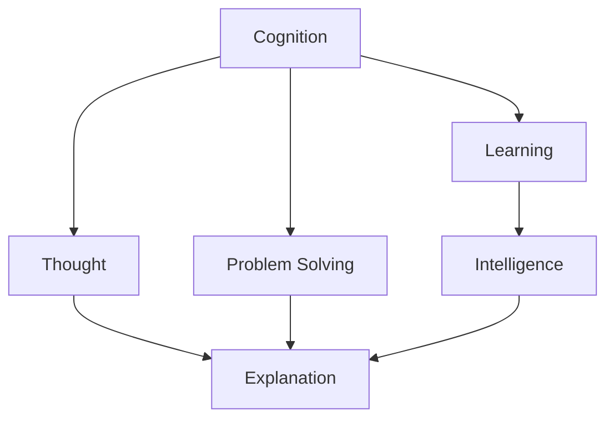

                 

## 1. 背景介绍

认知科学（Cognitive Science）是探究人类智能的学科，它跨越了心理学、神经科学、语言学、计算机科学等多个领域，旨在理解人类认知过程的机制。在这个不断发展的领域中，人工智能（AI），尤其是深度学习和神经网络，正在成为研究认知过程的重要工具。

在21世纪初，随着深度学习在图像识别、语音识别、自然语言处理等领域的突破，人们开始思考：AI系统是否具有“认知”能力？亦即，它们是否能够模拟人类学习、解释和解决问题？这篇博客将从认知科学的角度，深入探讨这些问题，并揭示AI在实现认知能力上的挑战和突破。

## 2. 核心概念与联系

认知，按照一般理解，是指人或动物处理信息、解决问题和适应环境的能力。从神经科学角度看，认知是大脑活动的表现，涉及记忆、感知、推理、决策等多个方面。人工智能试图模拟这种能力，希望通过学习算法，让机器也能够“思考”和“理解”。

### 2.1 核心概念概述

- **认知**：指理解、感知、记忆和推理等能力。
- **思维**：指问题解决和决策过程，是人类认知的关键部分。
- **智能**：指通过学习和推理处理信息，适应环境的高级能力。
- **学习**：指通过经验更新模型，获得解决问题的能力。
- **解释**：指将模型输出与现实世界联系起来，提供合理的推理过程。
- **解决问题**：指通过模型，找到问题的解决方案。

这些概念之间的联系可以通过以下Mermaid流程图来展示：



这个流程图展示了认知能力的各个组成部分及其相互关系：

1. **认知**是学习和思维的基础，由感知、记忆、推理等组成。
2. **学习**是认知的关键部分，通过经验和训练，提升模型的能力。
3. **思维**在认知中起着核心作用，用于解决具体问题。
4. **智能**是指机器能够通过学习和思维解决复杂问题，与认知紧密相连。
5. **解释**是认知的一部分，它提供解决方案的逻辑基础。
6. **解决问题**是思维和智能的综合体现，指通过模型找到问题的答案。

## 3. 核心算法原理 & 具体操作步骤

### 3.1 算法原理概述

认知的形式化，主要通过认知科学和人工智能的交叉研究来实现。基于认知科学模型的AI系统，通常包含以下几个关键步骤：

1. **数据收集**：获取人类认知的输入数据，如语音、图像、文本等。
2. **模型构建**：设计认知模型，如神经网络、符号系统等。
3. **训练模型**：通过学习算法，使模型能够处理输入数据，并形成认知表征。
4. **推理决策**：模型能够对新输入进行推理和决策，以解决问题。
5. **解释输出**：提供模型输出的解释，使结果更具有可信度。

形式化的认知模型通常包括感知器、神经网络、记忆单元等基本组件，通过反向传播、梯度下降等算法进行训练。

### 3.2 算法步骤详解

以下是认知形式化模型的详细操作步骤：

1. **数据预处理**：将原始数据转换为模型可以处理的形式，如图像预处理、文本分词等。
2. **模型初始化**：设定模型参数的初始值。
3. **训练过程**：
   - **前向传播**：将输入数据传递给模型，计算输出结果。
   - **损失计算**：根据输出结果与真实标签之间的差距，计算损失函数。
   - **反向传播**：计算损失对模型参数的梯度。
   - **参数更新**：通过梯度下降等算法，更新模型参数。
4. **模型评估**：在验证集或测试集上评估模型性能。
5. **推理决策**：使用模型对新输入进行推理，得出决策结果。
6. **输出解释**：通过逻辑推理或激活函数的解释，提供决策结果的解释。

### 3.3 算法优缺点

**优点**：
- **通用性**：认知模型能够处理多种类型的输入数据，应用广泛。
- **可解释性**：通过逻辑推理和激活函数，提供输出的解释，增加信任度。
- **学习能力**：通过持续学习，模型能够不断改进和适应新的输入。

**缺点**：
- **计算复杂度**：神经网络等复杂模型，计算复杂度较高。
- **参数过多**：深度学习模型参数量巨大，难以进行调优。
- **过拟合风险**：模型易受训练数据的影响，可能出现过拟合。

### 3.4 算法应用领域

认知形式化模型已经广泛应用于以下几个领域：

1. **自然语言处理**：如文本分类、情感分析、机器翻译等，帮助机器理解人类语言。
2. **图像识别**：如图像分类、目标检测、语义分割等，帮助机器识别图像内容。
3. **智能推荐**：如电商推荐、新闻推荐等，帮助用户发现更感兴趣的内容。
4. **智能医疗**：如疾病诊断、医学影像分析等，辅助医生进行决策。
5. **金融分析**：如风险评估、市场预测等，帮助金融机构做出更科学的决策。
6. **自动驾驶**：如环境感知、路径规划等，提升车辆安全性和舒适性。

## 4. 数学模型和公式 & 详细讲解

### 4.1 数学模型构建

为了形式化认知过程，我们通常使用神经网络模型。神经网络由多个层次组成，每层包含多个神经元。下面以一个简单的卷积神经网络（CNN）为例，来构建数学模型。

**输入层**：接受输入数据，将其转换为模型可以处理的向量。
**卷积层**：通过卷积操作提取特征。
**池化层**：通过池化操作减小特征维度。
**全连接层**：将池化后的特征映射到输出空间。
**输出层**：根据输出空间的分布，预测标签。

数学模型可以表示为：

$$
\text{Model} = (\text{Input}, \text{Convolution}, \text{Pooling}, \text{Fully Connected}, \text{Output})
$$

### 4.2 公式推导过程

假设我们使用一个简单的CNN模型来处理图像分类任务。输入为28x28的灰度图像，输出为10个类别的标签。

**输入层**：
$$
\mathbf{x} \in \mathbb{R}^{28 \times 28}
$$

**卷积层**：
$$
\mathbf{h} = \sigma(\mathbf{W} * \mathbf{x} + \mathbf{b})
$$
其中，$*$表示卷积操作，$\sigma$表示激活函数。

**池化层**：
$$
\mathbf{p} = \text{Max Pooling}(\mathbf{h})
$$

**全连接层**：
$$
\mathbf{z} = \mathbf{W}_h \mathbf{p} + \mathbf{b}_h
$$

**输出层**：
$$
\mathbf{y} = \text{Softmax}(\mathbf{z})
$$

### 4.3 案例分析与讲解

以手写数字识别为例，使用CNN模型进行训练和推理。假设我们有一个包含50000个样本的训练集，其中25000个用于训练，25000个用于验证。

**数据预处理**：将原始图像转换为大小为28x28的灰度图像，并归一化处理。

**模型构建**：构建一个包含1个卷积层、2个池化层、2个全连接层的CNN模型。

**训练过程**：使用随机梯度下降算法，将模型参数更新为最优值。

**模型评估**：在验证集上评估模型性能，计算损失函数和准确率。

**推理决策**：将新图像输入模型，输出预测结果。

**输出解释**：使用softmax函数，解释输出结果的来源。

## 5. 项目实践：代码实例和详细解释说明

### 5.1 开发环境搭建

在进行项目实践前，我们需要准备好开发环境。以下是使用Python进行PyTorch开发的环境配置流程：

1. 安装Anaconda：从官网下载并安装Anaconda，用于创建独立的Python环境。

2. 创建并激活虚拟环境：
```bash
conda create -n pytorch-env python=3.8 
conda activate pytorch-env
```

3. 安装PyTorch：根据CUDA版本，从官网获取对应的安装命令。例如：
```bash
conda install pytorch torchvision torchaudio cudatoolkit=11.1 -c pytorch -c conda-forge
```

4. 安装TensorFlow：
```bash
conda install tensorflow -c conda-forge
```

5. 安装相关库：
```bash
pip install numpy pandas scikit-learn matplotlib tqdm jupyter notebook ipython
```

完成上述步骤后，即可在`pytorch-env`环境中开始项目实践。

### 5.2 源代码详细实现

下面以手写数字识别为例，给出使用PyTorch实现CNN模型的代码：

```python
import torch
import torch.nn as nn
import torch.optim as optim
from torchvision import datasets, transforms

# 定义CNN模型
class CNN(nn.Module):
    def __init__(self):
        super(CNN, self).__init__()
        self.conv1 = nn.Conv2d(1, 32, 3, 1)
        self.pool = nn.MaxPool2d(2, 2)
        self.conv2 = nn.Conv2d(32, 64, 3, 1)
        self.fc1 = nn.Linear(64 * 14 * 14, 128)
        self.fc2 = nn.Linear(128, 10)

    def forward(self, x):
        x = self.pool(F.relu(self.conv1(x)))
        x = self.pool(F.relu(self.conv2(x)))
        x = x.view(-1, 64 * 14 * 14)
        x = F.relu(self.fc1(x))
        x = self.fc2(x)
        return F.log_softmax(x, dim=1)

# 加载数据集
train_dataset = datasets.MNIST('data/', train=True, transform=transforms.ToTensor(), download=True)
test_dataset = datasets.MNIST('data/', train=False, transform=transforms.ToTensor(), download=True)

# 定义超参数
batch_size = 64
learning_rate = 0.001
num_epochs = 5

# 定义模型和优化器
model = CNN()
optimizer = optim.Adam(model.parameters(), lr=learning_rate)

# 训练过程
for epoch in range(num_epochs):
    train_loader = torch.utils.data.DataLoader(train_dataset, batch_size=batch_size, shuffle=True)
    for batch_idx, (data, target) in enumerate(train_loader):
        data, target = data.to(device), target.to(device)
        optimizer.zero_grad()
        output = model(data)
        loss = F.nll_loss(output, target)
        loss.backward()
        optimizer.step()
        if batch_idx % 100 == 0:
            print('Train Epoch: {} [{}/{} ({:.0f}%)]\tLoss: {:.6f}'.format(
                epoch, batch_idx * len(data), len(train_loader.dataset),
                100. * batch_idx / len(train_loader), loss.item()))

# 测试过程
test_loader = torch.utils.data.DataLoader(test_dataset, batch_size=batch_size, shuffle=False)
total_correct = 0
total_sample = 0
with torch.no_grad():
    for data, target in test_loader:
        data, target = data.to(device), target.to(device)
        output = model(data)
        _, predicted = torch.max(output, 1)
        total_correct += (predicted == target).sum().item()
        total_sample += predicted.size(0)
print('Accuracy of the network on the 10000 test images: {} %'.format(100 * total_correct / total_sample))
```

### 5.3 代码解读与分析

让我们再详细解读一下关键代码的实现细节：

**CNN类**：
- `__init__`方法：初始化卷积层、激活函数、池化层、全连接层。
- `forward`方法：定义模型的前向传播过程。

**数据加载**：
- `train_dataset`和`test_dataset`：使用`torchvision`加载MNIST数据集。
- `transforms.ToTensor()`：将原始数据转换为Tensor形式。

**模型定义**：
- `model`：定义CNN模型。

**训练过程**：
- `optimizer`：定义优化器。
- 使用`DataLoader`对数据进行批次化加载。
- 在每个批次上进行前向传播、损失计算、反向传播和参数更新。

**测试过程**：
- 使用`DataLoader`对测试集进行批次化加载。
- 在每个批次上进行前向传播，统计预测准确率。

## 6. 实际应用场景

### 6.1 智能推荐系统

智能推荐系统已经成为电商、内容分发平台的核心功能。传统的推荐算法依赖于用户的历史行为数据，难以捕捉用户的隐性需求和偏好。通过形式化认知模型，智能推荐系统能够更好地理解用户行为，提供更加个性化的推荐结果。

在实践中，可以收集用户浏览、点击、购买等行为数据，提取文本和图像特征，训练认知模型。模型能够从用户行为中提取隐含的兴趣点和偏好，从而生成更加符合用户需求的商品推荐列表。

### 6.2 医学影像分析

医学影像分析是医疗诊断的重要工具。传统方法依赖于医生的经验，难以处理大量病例。通过形式化认知模型，医学影像分析系统能够自动识别疾病特征，辅助医生做出更准确的诊断。

在实践中，可以收集大量的医学影像数据，并标注相应的疾病信息。使用卷积神经网络等模型，对影像进行特征提取和分类。模型能够学习到疾病的典型特征，在新的影像数据上自动标注出病灶区域，提升诊断效率和准确性。

### 6.3 自然语言处理

自然语言处理是AI领域的重要分支，包括文本分类、情感分析、机器翻译等任务。形式化认知模型能够理解和生成自然语言，为NLP任务提供了强大的支持。

在实践中，可以收集大量的文本数据，并标注相应的标签或语义信息。使用循环神经网络、Transformer等模型，对文本进行特征提取和分类。模型能够学习到语言的语法和语义规则，在新的文本数据上自动进行分类或翻译。

### 6.4 未来应用展望

随着认知形式化模型的不断发展，未来的应用场景将更加广泛和多样化。以下是几个潜在的应用方向：

1. **智能客服**：通过形式化认知模型，构建智能客服系统，能够自动处理用户咨询，提供24小时不间断的服务。
2. **金融风险评估**：通过形式化认知模型，构建金融风险评估系统，能够自动分析金融市场数据，预测风险变化。
3. **自动驾驶**：通过形式化认知模型，构建自动驾驶系统，能够实时感知和理解周围环境，做出智能决策。
4. **教育辅导**：通过形式化认知模型，构建智能教育平台，能够自动评估学生学习效果，提供个性化辅导。
5. **智慧城市**：通过形式化认知模型，构建智慧城市系统，能够实时监测和管理城市运行状态，提升城市治理效率。

## 7. 工具和资源推荐

### 7.1 学习资源推荐

为了帮助开发者系统掌握认知形式化模型的理论基础和实践技巧，这里推荐一些优质的学习资源：

1. **《深度学习》书籍**：Yoshua Bengio、Ian Goodfellow和Aaron Courville合著的经典教材，详细介绍了深度学习的原理和应用。
2. **CS231n课程**：斯坦福大学开设的计算机视觉课程，有Lecture视频和配套作业，是学习深度学习的重要资源。
3. **自然语言处理专项课程**：Coursera和edX等在线教育平台提供的多门自然语言处理专项课程，涵盖从入门到高级的内容。
4. **论文阅读**：arXiv和Google Scholar等学术资源库，提供大量前沿研究成果，是学习认知形式化模型的重要渠道。

通过对这些资源的学习实践，相信你一定能够快速掌握认知形式化模型的精髓，并用于解决实际的AI问题。

### 7.2 开发工具推荐

高效的开发离不开优秀的工具支持。以下是几款用于认知形式化模型开发的常用工具：

1. **PyTorch**：基于Python的开源深度学习框架，灵活动态的计算图，适合快速迭代研究。大部分认知模型都有PyTorch版本的实现。
2. **TensorFlow**：由Google主导开发的开源深度学习框架，生产部署方便，适合大规模工程应用。同样有丰富的认知模型资源。
3. **Keras**：用户友好的深度学习框架，支持多种预训练模型，适合快速原型开发。
4. **MXNet**：由Apache开发的深度学习框架，支持多种编程语言，适合大规模分布式训练。

这些工具能够帮助开发者高效地实现认知形式化模型，并加速模型的训练和推理过程。

### 7.3 相关论文推荐

认知形式化模型的研究源于学界的持续探索。以下是几篇奠基性的相关论文，推荐阅读：

1. **《ImageNet Classification with Deep Convolutional Neural Networks》**：AlexNet论文，介绍了深度卷积神经网络在图像分类任务中的突破性表现。
2. **《Long Short-Term Memory》**：Hochreiter和Schmidhuber提出的LSTM模型，解决了序列数据的长期依赖问题。
3. **《Attention Is All You Need》**：Transformer论文，提出了自注意力机制，开创了自回归模型的新时代。
4. **《Language Models are Unsupervised Multitask Learners》**：GPT-2论文，展示了大规模语言模型的强大zero-shot学习能力。
5. **《Adversarial Examples for Images》**：Goodfellow等人提出的对抗样本，揭示了深度学习模型的脆弱性，引发了对模型鲁棒性的深入研究。

这些论文代表了大规模深度学习模型的发展脉络，为认知形式化模型的研究提供了理论基础和实践指导。

## 8. 总结：未来发展趋势与挑战

### 8.1 总结

本文对认知形式化模型进行了全面系统的介绍。首先阐述了认知科学和人工智能的研究背景和意义，明确了认知形式化模型在模拟人类认知过程中的重要作用。其次，从原理到实践，详细讲解了认知形式化模型的数学模型、训练步骤和应用场景，提供了完整的代码实例。同时，本文还广泛探讨了认知形式化模型在智能推荐、医学影像分析、自然语言处理等多个领域的应用前景，展示了其在AI技术落地过程中的广泛价值。

通过本文的系统梳理，可以看到，认知形式化模型已经在多个领域取得了显著成就，为AI技术的发展提供了重要的支持。未来，伴随认知科学和AI技术的不断进步，认知形式化模型必将在更多领域发挥更大的作用，进一步推动人工智能技术的进步。

### 8.2 未来发展趋势

展望未来，认知形式化模型将呈现以下几个发展趋势：

1. **模型复杂度增加**：随着深度学习技术的发展，认知形式化模型的复杂度将不断增加，能够处理更复杂的认知任务。
2. **多模态融合**：认知形式化模型将逐步融合视觉、语音、文本等多种模态，实现更为全面的人机交互。
3. **自监督学习**：通过无监督学习，认知形式化模型能够从大量未标注数据中学习知识，提升模型的泛化能力。
4. **联邦学习**：通过分布式学习，认知形式化模型能够从多个数据源中学习知识，提升模型的鲁棒性和泛化能力。
5. **实时推理**：通过优化模型结构和计算图，认知形式化模型能够实现实时推理，提升应用效率。
6. **跨领域迁移**：通过迁移学习，认知形式化模型能够跨领域应用，提升模型的通用性和适用性。

### 8.3 面临的挑战

尽管认知形式化模型已经取得了显著成就，但在迈向更加智能化、普适化应用的过程中，它仍面临诸多挑战：

1. **计算资源瓶颈**：深度学习模型对计算资源的要求较高，大规模模型难以在资源受限的环境中运行。
2. **模型可解释性不足**：认知形式化模型往往是"黑盒"系统，难以解释其内部工作机制和决策逻辑。
3. **知识表示困难**：认知形式化模型难以在模型中表示丰富的知识，难以理解复杂的语义关系。
4. **数据标注成本高**：大量高质量标注数据是认知形式化模型的基础，获取标注数据的成本较高。
5. **对抗样本脆弱**：认知形式化模型对对抗样本的攻击较为敏感，容易受到攻击和欺骗。
6. **跨领域迁移能力有限**：认知形式化模型在跨领域迁移时，往往需要大量领域特定数据，迁移能力有限。

### 8.4 研究展望

面对认知形式化模型所面临的挑战，未来的研究需要在以下几个方面寻求新的突破：

1. **优化模型结构**：设计更加轻量级的模型结构，减少计算资源消耗，提升推理效率。
2. **提高模型可解释性**：引入可解释性模型和解释技术，提供模型输出的解释和推理过程。
3. **增强知识表示能力**：引入知识图谱、符号系统等知识表示方法，提升模型的语义理解能力。
4. **开发新算法**：探索新算法和新模型，提升模型的泛化能力和跨领域迁移能力。
5. **增加对抗样本鲁棒性**：研究对抗样本生成和防御方法，提升模型的鲁棒性和安全性。

这些研究方向的探索，必将引领认知形式化模型迈向更高的台阶，为构建安全、可靠、可解释、可控的智能系统铺平道路。面向未来，认知形式化模型还需要与其他人工智能技术进行更深入的融合，如知识表示、因果推理、强化学习等，多路径协同发力，共同推动人工智能技术的进步。

## 9. 附录：常见问题与解答

**Q1：认知形式化模型是否适用于所有AI任务？**

A: 认知形式化模型在许多AI任务上取得了成功，如图像分类、文本分类、机器翻译等。但对于一些需要复杂推理和决策的任务，如自然语言生成、游戏AI等，认知形式化模型仍然面临挑战。

**Q2：认知形式化模型如何避免过拟合？**

A: 认知形式化模型避免过拟合的方法包括：
1. 数据增强：通过扩充训练集，增加数据的多样性。
2. 正则化：使用L2正则、Dropout等技术，避免模型过度拟合。
3. 对抗训练：引入对抗样本，提高模型的鲁棒性。
4. 参数共享：共享参数，减少模型复杂度，避免过拟合。

**Q3：如何提高认知形式化模型的解释性？**

A: 提高认知形式化模型的解释性可以通过以下方法：
1. 可解释性模型：使用可解释性较强的模型，如决策树、线性回归等。
2. 模型解释工具：使用模型解释工具，如LIME、SHAP等，提供模型输出的解释。
3. 可视化技术：使用可视化技术，如热力图、激活图等，展示模型输出的关键特征。

**Q4：认知形式化模型在实际应用中如何优化？**

A: 认知形式化模型在实际应用中可以通过以下方法进行优化：
1. 数据预处理：进行数据清洗和归一化，提升数据质量。
2. 模型优化：设计更加轻量级的模型结构，减少计算资源消耗。
3. 超参数调优：使用网格搜索、贝叶斯优化等方法，找到最优的超参数组合。
4. 集成学习：使用集成学习技术，提高模型的泛化能力和鲁棒性。

通过以上方法，可以有效提升认知形式化模型在实际应用中的效果和效率，提升系统的实用性和可靠性。

**Q5：如何平衡认知形式化模型的速度和准确性？**

A: 平衡认知形式化模型的速度和准确性可以通过以下方法：
1. 模型压缩：使用模型压缩技术，减少模型的参数量和计算量。
2. 量化加速：将浮点模型转换为定点模型，减少内存占用，提升计算效率。
3. 分布式计算：使用分布式计算技术，提升模型的并行处理能力。
4. 动态调整：根据应用场景需求，动态调整模型参数，优化计算速度和准确性。

通过以上方法，可以有效地平衡认知形式化模型的速度和准确性，提升其在实际应用中的表现。

---

作者：禅与计算机程序设计艺术 / Zen and the Art of Computer Programming

