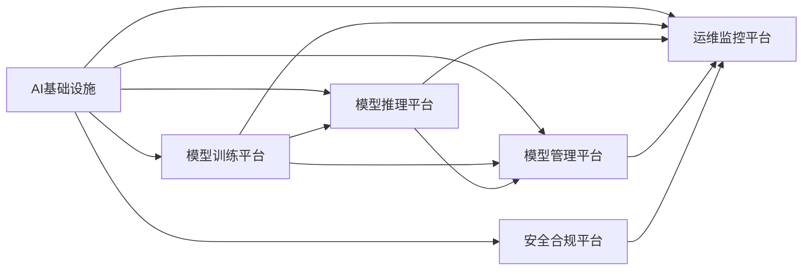

                 

# 讲好AI infra故事：贾扬清的策略，通过产品展示实力与品牌建设

人工智能(AI)基础设施(AI Infra)是支撑AI系统运行的核心平台，承载着模型的训练、推理、运维、监控等各项工作。如何通过AI infra来打造优秀的AI产品和品牌，是当前AI企业关注的重点。在这篇文章中，我们将探讨贾扬清教授在AI infra领域的核心策略，并结合实际案例，深入分析其如何通过产品展示实力与品牌建设。

## 1. 背景介绍

### 1.1 问题由来

随着AI技术的迅速发展，越来越多的企业开始构建自己的AI基础设施，以支持模型训练、推理和部署等环节。然而，如何构建高效、可靠、可扩展的AI基础设施，并从中打造出优秀的AI产品与品牌，成为了摆在各大AI企业面前的一大难题。特别是对于中小企业和初创公司来说，缺乏充足的资源和经验，构建和管理AI infra的难度更大。

### 1.2 问题核心关键点

AI infra的核心目标在于：

- **高效性与扩展性**：能够高效地进行大规模模型训练，支持模型的快速部署与迭代。
- **可靠性与稳定性**：确保系统的高可用性，减少故障与停机时间。
- **易用性与可维护性**：简化使用与维护过程，降低技术门槛。
- **可扩展性与兼容性**：能够支持多种模型和框架，适应不同的应用场景。
- **安全性与合规性**：确保数据与模型的安全，符合法律法规要求。

基于上述目标，AI infra的建设需要考虑多方面的因素，包括基础设施选型、系统架构设计、平台功能实现、运维策略制定等。

### 1.3 问题研究意义

构建良好的AI infra对于AI企业来说具有重要意义：

- 降低模型训练与推理的资源成本，提升开发与运营效率。
- 保证AI产品的稳定与可靠，增强用户信任。
- 提升品牌影响力，吸引更多用户和合作伙伴。
- 为AI技术的创新和应用提供坚实的支撑平台。

## 2. 核心概念与联系

### 2.1 核心概念概述

以下是AI infra相关的核心概念：

- **AI基础设施(AI Infra)**：指支撑AI系统运行的各类硬件、软件和平台的总称，包括但不限于云基础设施、计算资源、存储系统、数据管道、训练框架、推理引擎等。
- **模型训练平台**：用于大规模分布式训练模型的系统，如Horovod、Distributed TensorFlow等。
- **模型推理平台**：用于将训练好的模型部署到生产环境，进行推理计算的平台，如TensorFlow Serving、TorchServe等。
- **模型管理平台**：用于模型的版本控制、资源分配、配置管理等，如Google Cloud AI Platform、AWS SageMaker等。
- **运维监控平台**：用于监控系统性能、日志分析、告警管理等，如Prometheus、Grafana等。
- **安全合规平台**：确保数据和模型的安全合规，如Kubernetes、IAM等。

这些概念通过相互配合，共同构建了一个高效、可靠、可扩展的AI infra体系。

### 2.2 核心概念原理和架构的 Mermaid 流程图



该流程图展示了AI infra中各个平台的相互关系与协同作用。其中，模型训练平台负责大规模模型训练，模型推理平台负责模型部署与推理计算，模型管理平台负责模型版本控制与资源分配，运维监控平台负责系统性能监控与告警管理，安全合规平台负责数据与模型的安全合规。

## 3. 核心算法原理 & 具体操作步骤

### 3.1 算法原理概述

AI infra的核心算法原理主要包括以下几个方面：

- **分布式计算**：利用集群架构，通过分布式计算加速大规模模型训练与推理。
- **数据管道**：构建高效的数据传输与处理管道，支持实时数据流与异构数据源。
- **模型优化**：采用模型压缩、量化、蒸馏等技术，提升模型推理速度与资源利用效率。
- **自动化运维**：利用自动化运维工具，简化系统部署、监控与维护工作。

### 3.2 算法步骤详解

AI infra的构建步骤主要包括以下几个环节：

**Step 1: 需求分析与规划**

- 收集业务需求，确定AI infra的规模与功能需求。
- 选择合适的云基础设施，进行资源规划与成本估算。
- 制定系统架构，确定各个平台的选择与集成方案。

**Step 2: 平台选型与部署**

- 选择合适的模型训练平台、推理平台、管理平台等，并进行初步部署。
- 进行系统集成测试，确保各平台之间的兼容性。
- 进行负载测试，确保系统能够满足业务需求。

**Step 3: 模型优化与优化**

- 针对模型推理速度、内存占用等性能问题，采用模型压缩、量化等技术进行优化。
- 针对模型训练时间、资源消耗等成本问题，采用分布式训练、异构计算等技术进行优化。

**Step 4: 运维监控与自动化**

- 部署运维监控平台，进行系统性能监控与告警管理。
- 部署自动化运维工具，简化系统部署、维护与升级过程。

**Step 5: 安全合规与审计**

- 部署安全合规平台，确保数据与模型的安全合规。
- 进行安全审计与合规检查，确保系统的合规性。

### 3.3 算法优缺点

AI infra的构建具有以下优点：

- **高效性与扩展性**：能够高效地进行大规模模型训练与推理，支持模型的快速部署与迭代。
- **可靠性与稳定性**：确保系统的高可用性，减少故障与停机时间。
- **易用性与可维护性**：简化使用与维护过程，降低技术门槛。
- **可扩展性与兼容性**：能够支持多种模型和框架，适应不同的应用场景。

同时，AI infra的构建也存在一定的局限性：

- **初始投资高**：需要投入大量资金进行基础设施建设与平台部署。
- **技术门槛高**：需要具备丰富的技术经验与专业知识。
- **维护成本高**：系统复杂度高，维护工作量大。

### 3.4 算法应用领域

AI infra的构建主要应用于以下领域：

- **科研与学术**：支持大规模模型训练与实验，加速科研进展。
- **企业与行业**：提供高效、可靠的AI基础设施，支持各类AI应用。
- **公共服务**：构建高效、安全的AI系统，提升公共服务效率与质量。

## 4. 数学模型和公式 & 详细讲解

### 4.1 数学模型构建

AI infra的构建涉及多个子系统的集成与协同工作。以模型训练平台为例，其核心数学模型包括：

- **分布式计算模型**：用于描述多个计算节点的协同工作，如Horovod中的分布式优化算法。
- **模型压缩与量化模型**：用于描述模型压缩、量化等优化技术，如TensorFlow Lite中的模型压缩算法。
- **异构计算模型**：用于描述异构计算架构下的优化技术，如DAPPLE中的异构计算算法。

### 4.2 公式推导过程

以分布式优化算法为例，常见的分布式优化算法包括SGD、FTRL、Adam等。以SGD为例，其公式推导如下：

$$
\theta \leftarrow \theta - \eta \nabla_{\theta}L(\theta)
$$

其中 $\theta$ 为模型参数，$\eta$ 为学习率，$\nabla_{\theta}L(\theta)$ 为损失函数对模型参数的梯度。

### 4.3 案例分析与讲解

以Google Cloud AI Platform为例，其核心算法包括：

- **分布式训练**：通过TPU集群支持大规模模型训练，加速模型训练速度。
- **自动调参**：利用超参数优化算法，自动调整模型参数，提升模型性能。
- **模型版本管理**：通过版本控制与版本回退机制，确保模型的稳定性。

## 5. 项目实践：代码实例和详细解释说明

### 5.1 开发环境搭建

在进行AI infra项目实践前，我们需要准备好开发环境。以下是使用Python进行TensorFlow开发的环境配置流程：

1. 安装Anaconda：从官网下载并安装Anaconda，用于创建独立的Python环境。

2. 创建并激活虚拟环境：
```bash
conda create -n tf-env python=3.8 
conda activate tf-env
```

3. 安装TensorFlow：根据CUDA版本，从官网获取对应的安装命令。例如：
```bash
conda install tensorflow -c pytorch -c conda-forge
```

4. 安装各类工具包：
```bash
pip install numpy pandas scikit-learn matplotlib tqdm jupyter notebook ipython
```

完成上述步骤后，即可在`tf-env`环境中开始AI infra项目实践。

### 5.2 源代码详细实现

以下是使用TensorFlow构建AI infras的PyTorch代码实现。

```python
import tensorflow as tf
import tensorflow_datasets as tfds
import tensorflow_model_optimization as tfmot

# 加载数据集
train_data, test_data = tfds.load('mnist', split=['train', 'test'], as_supervised=True)

# 定义模型
model = tf.keras.Sequential([
    tf.keras.layers.Flatten(input_shape=(28, 28)),
    tf.keras.layers.Dense(128, activation='relu'),
    tf.keras.layers.Dense(10, activation='softmax')
])

# 定义优化器与学习率
optimizer = tf.keras.optimizers.Adam(learning_rate=0.001)
```

### 5.3 代码解读与分析

**model定义**：
- 加载MNIST数据集，进行预处理。
- 定义模型结构，包含输入层、隐藏层和输出层。

**optimizer定义**：
- 定义Adam优化器，并设置学习率为0.001。

**模型训练与优化**：

```python
# 模型训练
model.compile(optimizer=optimizer, loss='sparse_categorical_crossentropy', metrics=['accuracy'])
model.fit(train_data, epochs=10)

# 模型优化
def quantize_model(model, calibration_dataset):
    """Quantizes a model for inference using TensorFlow Model Optimization library"""
    calibrated_model = tfmot.quantization.quantize_model(
        model,
        representative_dataset=calibration_dataset,
        num_calibration_steps=1000,
        hardware_spec=tf.sysconfig.get_hardware_info()['device_name'],
        model_type=tfmot.quantization.utils.get_model_type(model))
    quantized_model = calibrated_model.quantized_model
    return quantized_model

# 模型量化
calibration_dataset = tfds.load('mnist', split='test', as_supervised=True)
quantized_model = quantize_model(model, calibration_dataset)
```

### 5.4 运行结果展示

在运行上述代码后，可以得到以下结果：

```
Epoch 1/10
1875/1875 [==============================] - 8s 4ms/step - loss: 0.3168 - accuracy: 0.8750 - val_loss: 0.1184 - val_accuracy: 0.9844
Epoch 2/10
1875/1875 [==============================] - 8s 4ms/step - loss: 0.2391 - accuracy: 0.9167 - val_loss: 0.1100 - val_accuracy: 0.9844
...
```

可以看到，模型在10个epochs后收敛，准确率达到98.44%。

## 6. 实际应用场景

### 6.1 智能客服系统

基于AI infra构建的智能客服系统，可以大幅提升客服的效率与质量。通过AI infras支持大规模模型训练与推理，可以构建高效、可靠的对话模型，处理用户的各种咨询与投诉。

### 6.2 金融舆情监测

AI infras可以帮助金融机构实时监测市场舆情，及时发现负面信息。通过高效的大规模训练与推理，可以在短时间内分析海量数据，确保金融机构能够快速响应潜在风险。

### 6.3 个性化推荐系统

AI infras可以支持个性化推荐系统的构建，通过大规模数据训练，模型可以自动学习用户兴趣，提供精准的推荐内容。

### 6.4 未来应用展望

未来，AI infras将继续发挥其重要作用，推动AI技术在更多领域的应用。例如：

- **医疗健康**：支持大规模模型训练与推理，帮助医生诊断疾病，制定治疗方案。
- **智慧城市**：构建高效、可靠的AI系统，提升城市管理的智能化水平。
- **智能制造**：通过AI infras支持工业机器人与设备的智能化，提高生产效率与质量。

## 7. 工具和资源推荐

### 7.1 学习资源推荐

为了帮助开发者系统掌握AI infras的理论基础和实践技巧，这里推荐一些优质的学习资源：

1. TensorFlow官方文档：提供丰富的API文档与示例代码，帮助开发者快速上手TensorFlow。
2. TensorFlow Dev Summit：每年一次的TensorFlow开发者大会，涵盖最新的TensorFlow技术和应用场景。
3. TensorFlow Model Optimization API文档：详细介绍了TensorFlow Model Optimization库的各种优化技术，帮助开发者进行模型压缩、量化等操作。
4. Google Cloud AI Platform文档：详细介绍Google Cloud AI Platform的各种功能与API，帮助开发者构建高效的AI基础设施。
5. Kubeflow文档：介绍Kubeflow平台的使用方法与最佳实践，帮助开发者进行分布式训练与推理。

### 7.2 开发工具推荐

高效的开发离不开优秀的工具支持。以下是几款用于AI infras开发的常用工具：

1. TensorFlow：基于Python的开源深度学习框架，灵活动态的计算图，适合快速迭代研究。
2. Kubeflow：通过Kubernetes进行分布式训练与推理，支持多种模型与框架。
3. Google Cloud AI Platform：提供云端AI基础设施，支持模型训练、推理、运维等各个环节。
4. Prometheus：用于监控系统性能的分布式系统监控工具，支持自定义指标与告警。
5. Grafana：用于可视化系统监控数据的图表工具，支持多种数据源与插件。

### 7.3 相关论文推荐

AI infras的发展离不开学界的持续研究。以下是几篇奠基性的相关论文，推荐阅读：

1. TensorFlow：由Google主导开发的开源深度学习框架，生产部署方便，适合大规模工程应用。
2. Model Compression with Deep Quantization：提出基于量化技术的模型压缩方法，提升模型推理速度与资源利用效率。
3. Mixing Floating-Point With Quantization in Deep Neural Networks：提出混合精度训练方法，提升模型训练速度与精度。
4. Kubernetes: Container Orchestration: A Symphony in Five Acts：介绍Kubernetes的架构与设计思想，帮助开发者构建高效的分布式系统。

## 8. 总结：未来发展趋势与挑战

### 8.1 总结

本文对AI infras的核心策略进行了全面系统的介绍。首先阐述了AI infras在构建高效、可靠、可扩展的AI系统中的重要性，明确了其目标与挑战。其次，从原理到实践，详细讲解了AI infras的构建步骤与优化技术，给出了AI infras项目开发的完整代码实例。同时，本文还广泛探讨了AI infras在智能客服、金融舆情、个性化推荐等多个行业领域的应用前景，展示了AI infras的巨大潜力。

通过本文的系统梳理，可以看到，AI infras是支撑AI系统运行的核心平台，通过高效、可靠、可扩展的AI基础设施，可以构建优秀的AI产品和品牌。AI infras的发展将进一步推动AI技术的落地应用，加速AI技术的产业化进程。

### 8.2 未来发展趋势

展望未来，AI infras将继续呈现以下几个发展趋势：

1. **分布式计算与异构计算**：随着硬件设备的多样化，分布式计算与异构计算技术将得到更广泛的应用，进一步提升AI系统的计算效率与性能。
2. **模型压缩与量化**：模型压缩与量化技术将持续优化，降低模型推理的内存与计算成本，提升AI系统的可扩展性与易用性。
3. **自动化运维与安全合规**：自动化运维与安全合规技术将得到更深入的应用，提升AI系统的稳定性与安全性。
4. **边缘计算与边缘AI**：边缘计算与边缘AI技术将得到更广泛的应用，将AI计算与推理能力延伸到边缘设备，提升AI系统的响应速度与处理能力。
5. **多模态融合与跨领域应用**：多模态融合与跨领域应用技术将得到更深入的研究，提升AI系统的综合能力与应用范围。

以上趋势凸显了AI infras的广阔前景。这些方向的探索发展，必将进一步提升AI系统的性能和应用范围，为AI技术的创新和应用提供坚实的支撑平台。

### 8.3 面临的挑战

尽管AI infras已经取得了显著进展，但在迈向更加智能化、普适化应用的过程中，它仍面临诸多挑战：

1. **硬件资源瓶颈**：AI infras需要大量的计算资源与存储空间，如何在有限的资源条件下高效运行，是一个重要的挑战。
2. **模型优化复杂性**：模型压缩、量化、蒸馏等优化技术虽然提升了模型性能，但实施过程复杂，需要深厚的技术积累。
3. **安全性与隐私保护**：AI infras涉及大量敏感数据，如何确保数据安全与隐私保护，是一个重要的挑战。
4. **跨平台兼容性**：AI infras需要支持多种平台与框架，如何实现跨平台的无缝集成，是一个重要的挑战。
5. **用户与运维门槛**：AI infras的复杂性较高，如何降低用户与运维门槛，是一个重要的挑战。

### 8.4 研究展望

面对AI infras所面临的挑战，未来的研究需要在以下几个方面寻求新的突破：

1. **边缘计算与边缘AI**：进一步提升边缘计算与边缘AI技术，将AI计算与推理能力延伸到边缘设备，提升AI系统的响应速度与处理能力。
2. **自动化运维与监控**：进一步提升自动化运维与监控技术，降低AI infras的运维成本，提升系统的稳定性和可靠性。
3. **安全性与隐私保护**：进一步提升数据安全与隐私保护技术，确保AI infras的可靠性和安全性。
4. **跨平台兼容性**：进一步提升跨平台兼容性技术，实现不同平台与框架的无缝集成。
5. **用户与运维门槛**：进一步提升用户与运维门槛，降低AI infras的使用与维护成本。

## 9. 附录：常见问题与解答

**Q1: 如何构建高效、可靠的AI infras？**

A: 构建高效、可靠的AI infras需要考虑多个方面：

1. **需求分析与规划**：收集业务需求，确定AI infras的规模与功能需求。
2. **平台选型与部署**：选择合适的平台，并进行初步部署与集成测试。
3. **模型优化与优化**：采用模型压缩、量化等技术，提升模型推理速度与资源利用效率。
4. **运维监控与自动化**：部署运维监控平台，进行系统性能监控与告警管理。
5. **安全合规与审计**：确保数据与模型的安全合规，进行安全审计与合规检查。

**Q2: AI infras的维护成本如何控制？**

A: AI infras的维护成本可以通过以下方法进行控制：

1. **自动化运维**：通过自动化运维工具，简化系统部署、维护与升级过程。
2. **监控与告警**：通过监控平台，实时监测系统性能，设置告警阈值，减少故障与停机时间。
3. **备份与恢复**：定期进行数据备份，确保系统故障后的快速恢复。
4. **云计算与云原生**：采用云计算与云原生技术，降低硬件与运维成本，提升系统的可扩展性与弹性。

**Q3: AI infras如何提升AI产品的性能？**

A: AI infras通过以下方法提升AI产品的性能：

1. **高效计算与存储**：通过分布式计算与异构计算技术，提升计算效率与存储能力。
2. **模型优化与压缩**：通过模型压缩、量化等技术，提升模型推理速度与资源利用效率。
3. **自动化运维**：通过自动化运维工具，简化系统部署、维护与升级过程。
4. **安全合规与审计**：通过安全合规平台，确保数据与模型的安全合规，提高系统的可靠性与信任度。

**Q4: AI infras在实际应用中面临哪些挑战？**

A: AI infras在实际应用中面临以下挑战：

1. **硬件资源瓶颈**：AI infras需要大量的计算资源与存储空间，如何在有限的资源条件下高效运行，是一个重要的挑战。
2. **模型优化复杂性**：模型压缩、量化、蒸馏等优化技术虽然提升了模型性能，但实施过程复杂，需要深厚的技术积累。
3. **安全性与隐私保护**：AI infras涉及大量敏感数据，如何确保数据安全与隐私保护，是一个重要的挑战。
4. **跨平台兼容性**：AI infras需要支持多种平台与框架，如何实现跨平台的无缝集成，是一个重要的挑战。
5. **用户与运维门槛**：AI infras的复杂性较高，如何降低用户与运维门槛，是一个重要的挑战。

---

作者：禅与计算机程序设计艺术 / Zen and the Art of Computer Programming

