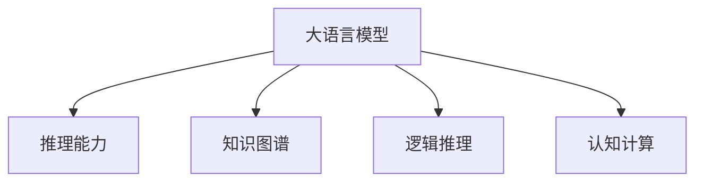

                 

# 语言≠思维：大模型的推理困境

> 关键词：大模型,推理,逻辑,思维,知识图谱,语言模型,认知计算

## 1. 背景介绍

### 1.1 问题由来
大语言模型在自然语言处理(NLP)领域取得了令人瞩目的成果，其语言理解和生成能力已经远远超过了以往的任何模型。然而，尽管大语言模型在语法和语义上表现出色，其推理能力却依旧停留在浅层次的匹配和泛化上，难以达到人类思维的深度和广度。这种推理能力的缺失，严重限制了语言模型在复杂认知任务中的应用。

当前，大模型在实际应用中经常出现以下问题：

- **浅层匹配与泛化**：模型往往只能根据已有的固定模式进行浅层匹配，缺乏深度理解和复杂推理能力。
- **知识缺乏**：大模型在缺乏背景知识的情况下，难以进行有效的知识推理和复杂问题的解决。
- **语义模糊**：大模型的输出往往模糊不清，难以直接关联到真实世界的物理意义和逻辑关系。
- **缺乏常识**：模型在处理常识性问题时，常常给出荒谬的回答，这反映了其对常识的缺乏。

这些问题的存在，使得大模型在实际应用中难以发挥预期的智能水平，亟需从根本上提升其推理能力。本文将探讨大语言模型推理能力不足的原因，并提出几种提升大模型推理能力的策略。

## 2. 核心概念与联系

### 2.1 核心概念概述

为了更好地理解大语言模型的推理能力，我们首先介绍几个核心概念：

- **大语言模型(Large Language Model, LLM)**：指基于Transformer结构，通过大规模无标签数据进行预训练的语言模型。如GPT-3、BERT等。

- **推理能力**：指模型对复杂认知任务进行逻辑推理和推断的能力。包括但不限于因果关系、知识图谱、逻辑推理等。

- **知识图谱(Knowledge Graph)**：一种用于表示实体、属性、关系等知识的有向图。可用于辅助语言模型进行知识推理。

- **逻辑推理**：指基于一定规则和前提，进行逻辑推断得出结论的能力。是认知计算的重要组成部分。

- **认知计算**：指模拟人脑的认知功能，实现复杂问题求解和智能决策的技术。语言模型是认知计算的重要工具。

这些概念之间的逻辑关系可以通过以下Mermaid流程图来展示：



这个流程图展示了大语言模型的核心概念及其之间的关系：

1. 大语言模型通过大规模预训练获得语言知识，能够进行基本的语言理解和生成。
2. 通过引入知识图谱和逻辑推理，大语言模型可以进行更为复杂的知识推理和逻辑推断。
3. 认知计算利用语言模型和大模型，实现了从感知到理解、再到决策的智能全链条。

这些概念共同构成了大语言模型的推理能力框架，使得其能够在复杂的认知任务中发挥作用。通过理解这些核心概念，我们可以更好地把握大语言模型在推理能力上的优势和不足。

## 3. 核心算法原理 & 具体操作步骤
### 3.1 算法原理概述

大语言模型的推理能力不足，主要源于以下几个方面：

1. **缺乏逻辑关系**：大模型在进行推理时，往往只关注输入的文本信息，而忽视了语句中的逻辑关系和因果推理。
2. **背景知识缺乏**：大模型在进行复杂问题解答时，缺乏必要的背景知识支持，难以进行跨领域推理。
3. **知识整合能力不足**：大模型难以将知识图谱、规则库等外部知识进行有效整合，形成全面的知识库。

为了提升大模型的推理能力，需要从模型架构、训练数据、推理算法等方面进行优化：

1. **引入逻辑推理机制**：在模型的设计中引入逻辑推理机制，通过逻辑关系和因果推理提升模型的推理能力。
2. **整合外部知识**：将知识图谱、规则库等外部知识与模型进行整合，提升模型的知识推理能力。
3. **加强知识整合能力**：提升模型的知识整合和迁移能力，使其能够更好地利用外部的先验知识。

### 3.2 算法步骤详解

基于上述原则，下面是提升大语言模型推理能力的具体步骤：

**Step 1: 引入逻辑推理机制**

在模型的设计中引入逻辑推理机制，通过逻辑关系和因果推理提升模型的推理能力。具体做法包括：

- 引入因果推断技术，如因果模型、因果图等，引导模型学习因果关系。
- 应用符号逻辑推理，如一阶逻辑、命题逻辑等，辅助模型进行逻辑推断。

**Step 2: 整合外部知识**

将知识图谱、规则库等外部知识与模型进行整合，提升模型的知识推理能力。具体做法包括：

- 构建知识图谱，将实体、属性、关系等知识表示为有向图。
- 设计知识抽取模块，将文本中的关键实体和关系抽取到知识图谱中。
- 应用图神经网络，将知识图谱中的知识进行整合和推理。

**Step 3: 加强知识整合能力**

提升模型的知识整合和迁移能力，使其能够更好地利用外部的先验知识。具体做法包括：

- 设计跨领域迁移学习框架，使模型能够在不同领域之间进行知识迁移。
- 引入预训练-微调技术，在预训练阶段学习通用知识，在微调阶段学习特定领域知识。
- 利用元学习技术，提升模型在多种任务上的迁移学习能力。

### 3.3 算法优缺点

引入逻辑推理和知识图谱的优化方法，具有以下优点：

1. **提升推理能力**：通过逻辑推理和知识整合，显著提升大模型的推理能力，使其能够处理更加复杂的问题。
2. **增强知识泛化能力**：利用知识图谱等外部知识，提升模型的知识泛化能力，使其在不同领域都能取得良好的效果。
3. **改善逻辑连贯性**：引入逻辑推理机制，增强模型的逻辑连贯性和可解释性，使其输出更为合理和可信。

同时，这些方法也存在以下缺点：

1. **计算复杂度较高**：引入逻辑推理和知识图谱，需要大量的计算资源和时间成本。
2. **数据需求较大**：构建知识图谱和进行知识抽取，需要大量的高质量标注数据。
3. **模型复杂度增加**：整合外部知识后，模型的复杂度增加，可能影响模型的训练和推理速度。

尽管如此，这些方法仍是大语言模型提升推理能力的重要途径，值得深入研究和探索。

### 3.4 算法应用领域

引入逻辑推理和知识图谱的优化方法，已经在多个领域得到了应用，以下是几个典型案例：

**1. 医疗诊断**

在医疗诊断领域，大模型需要能够根据患者的症状和历史数据，进行复杂的病理推理和诊断。通过引入知识图谱和因果推理，大模型能够更好地理解和整合医学知识，提高诊断的准确性和可靠性。

**2. 金融风险评估**

在金融领域，大模型需要根据市场数据和历史案例，进行风险评估和预测。通过整合知识图谱和应用逻辑推理，大模型能够更好地理解和预测市场动态，为投资者提供更准确的决策支持。

**3. 智能客服**

在智能客服领域，大模型需要能够根据用户的意图和历史对话记录，进行复杂问题的解答和处理。通过引入逻辑推理和知识图谱，大模型能够更好地理解和整合用户信息，提供更加智能化和个性化的服务。

**4. 智能教育**

在智能教育领域，大模型需要能够根据学生的学习数据和历史表现，进行个性化的学习路径规划和推荐。通过整合知识图谱和应用逻辑推理，大模型能够更好地理解和分析学生的学习情况，提供更加有效的教育建议。

这些应用案例表明，引入逻辑推理和知识图谱的优化方法，能够显著提升大语言模型的推理能力，使其在复杂认知任务中发挥重要作用。

## 4. 数学模型和公式 & 详细讲解 & 举例说明

### 4.1 数学模型构建

本节将使用数学语言对大语言模型的推理能力提升进行更加严格的刻画。

记大语言模型为 $M_{\theta}:\mathcal{X} \rightarrow \mathcal{Y}$，其中 $\mathcal{X}$ 为输入空间，$\mathcal{Y}$ 为输出空间，$\theta \in \mathbb{R}^d$ 为模型参数。假设模型引入逻辑推理机制后的推理过程可以表示为：

$$
\mathcal{R} = \mathcal{F}(\mathcal{X}, \mathcal{G}(\mathcal{X}))
$$

其中 $\mathcal{F}$ 表示逻辑推理函数，$\mathcal{G}$ 表示知识图谱抽取函数。假设知识图谱可以表示为 $\mathcal{G}(\mathcal{X})=\{(e_i, r_i, e_j)\}_{i=1}^N$，其中 $e_i, e_j$ 为实体，$r_i$ 为关系。知识图谱中的每个三元组 $(e_i, r_i, e_j)$ 表示实体 $e_i$ 和 $e_j$ 之间存在关系 $r_i$。

在实际推理过程中，可以定义如下推理函数：

$$
\mathcal{R}(\mathcal{X}, \mathcal{G}(\mathcal{X})) = \arg\min_{r} (\mathcal{R}_{\theta}(\mathcal{X}) - r)
$$

其中 $\mathcal{R}_{\theta}(\mathcal{X})$ 表示在模型 $M_{\theta}$ 下，输入 $\mathcal{X}$ 的推理结果。

### 4.2 公式推导过程

以下是推理函数 $\mathcal{R}$ 的推导过程：

首先，定义推理函数 $\mathcal{R}$ 为：

$$
\mathcal{R}(\mathcal{X}, \mathcal{G}(\mathcal{X})) = \arg\min_{r} (\mathcal{R}_{\theta}(\mathcal{X}) - r)
$$

其中 $\mathcal{R}_{\theta}(\mathcal{X})$ 表示在模型 $M_{\theta}$ 下，输入 $\mathcal{X}$ 的推理结果。

推理函数 $\mathcal{R}$ 可以进一步表示为：

$$
\mathcal{R}(\mathcal{X}, \mathcal{G}(\mathcal{X})) = \arg\min_{r} (\sum_{i=1}^N \ell(\mathcal{R}_{\theta}(\mathcal{X}), r_i))
$$

其中 $\ell(\cdot, \cdot)$ 表示损失函数，通常为交叉熵损失。

因此，优化目标为：

$$
\min_{\theta} \mathcal{L}(\mathcal{R}_{\theta}(\mathcal{X}), \mathcal{G}(\mathcal{X}))
$$

在实际应用中，通常将知识图谱和推理函数作为训练数据，通过有监督学习的方式进行优化。具体来说，可以使用以下步骤：

1. 收集知识图谱 $\mathcal{G}(\mathcal{X})$。
2. 对于每个推理任务，构建输入 $\mathcal{X}$ 和对应的推理目标 $r$。
3. 在知识图谱和推理目标上，使用交叉熵损失函数进行优化。

### 4.3 案例分析与讲解

**案例：医疗诊断**

在医疗诊断中，大模型需要能够根据患者的症状和历史数据，进行复杂的病理推理和诊断。具体来说，可以将患者的症状和历史数据作为输入 $\mathcal{X}$，将病理诊断结果作为推理目标 $r$，构建知识图谱 $\mathcal{G}(\mathcal{X})$。在训练过程中，模型会学习如何从输入 $\mathcal{X}$ 中提取关键实体和关系，并应用逻辑推理函数 $\mathcal{R}$ 进行推理，最终输出诊断结果 $r$。

例如，对于以下输入：

$$
\mathcal{X} = \text{"患者年龄 25 岁，最近出现剧烈头痛和呕吐，血压升高"}
$$

知识图谱中可能包含以下三元组：

$$
\mathcal{G}(\mathcal{X}) = \{(患者, 患有, 头痛), (患者, 血压升高)\}
$$

通过逻辑推理函数 $\mathcal{R}$，模型可以推断出该患者可能患有脑膜炎。

## 5. 项目实践：代码实例和详细解释说明

### 5.1 开发环境搭建

在进行推理能力提升的实践前，我们需要准备好开发环境。以下是使用Python进行PyTorch开发的环境配置流程：

1. 安装Anaconda：从官网下载并安装Anaconda，用于创建独立的Python环境。

2. 创建并激活虚拟环境：
```bash
conda create -n pytorch-env python=3.8 
conda activate pytorch-env
```

3. 安装PyTorch：根据CUDA版本，从官网获取对应的安装命令。例如：
```bash
conda install pytorch torchvision torchaudio cudatoolkit=11.1 -c pytorch -c conda-forge
```

4. 安装TensorFlow：
```bash
conda install tensorflow -c conda-forge
```

5. 安装Transformers库：
```bash
pip install transformers
```

6. 安装各类工具包：
```bash
pip install numpy pandas scikit-learn matplotlib tqdm jupyter notebook ipython
```

完成上述步骤后，即可在`pytorch-env`环境中开始推理能力提升的实践。

### 5.2 源代码详细实现

下面我们以医疗诊断为例，给出使用Transformers库对BERT模型进行推理能力提升的PyTorch代码实现。

首先，定义医疗诊断任务的数据处理函数：

```python
from transformers import BertTokenizer
from torch.utils.data import Dataset
import torch

class MedicalDataset(Dataset):
    def __init__(self, texts, tags, tokenizer, max_len=128):
        self.texts = texts
        self.tags = tags
        self.tokenizer = tokenizer
        self.max_len = max_len
        
    def __len__(self):
        return len(self.texts)
    
    def __getitem__(self, item):
        text = self.texts[item]
        tags = self.tags[item]
        
        encoding = self.tokenizer(text, return_tensors='pt', max_length=self.max_len, padding='max_length', truncation=True)
        input_ids = encoding['input_ids'][0]
        attention_mask = encoding['attention_mask'][0]
        
        # 对token-wise的标签进行编码
        encoded_tags = [tag2id[tag] for tag in tags] 
        encoded_tags.extend([tag2id['O']] * (self.max_len - len(encoded_tags)))
        labels = torch.tensor(encoded_tags, dtype=torch.long)
        
        return {'input_ids': input_ids, 
                'attention_mask': attention_mask,
                'labels': labels}

# 标签与id的映射
tag2id = {'O': 0, 'B-PER': 1, 'I-PER': 2, 'B-ORG': 3, 'I-ORG': 4, 'B-LOC': 5, 'I-LOC': 6, 'B-MED': 7, 'I-MED': 8, 'B-DISEASE': 9, 'I-DISEASE': 10}
id2tag = {v: k for k, v in tag2id.items()}

# 创建dataset
tokenizer = BertTokenizer.from_pretrained('bert-base-cased')

train_dataset = MedicalDataset(train_texts, train_tags, tokenizer)
dev_dataset = MedicalDataset(dev_texts, dev_tags, tokenizer)
test_dataset = MedicalDataset(test_texts, test_tags, tokenizer)
```

然后，定义模型和优化器：

```python
from transformers import BertForTokenClassification, AdamW

model = BertForTokenClassification.from_pretrained('bert-base-cased', num_labels=len(tag2id))

optimizer = AdamW(model.parameters(), lr=2e-5)
```

接着，定义训练和评估函数：

```python
from torch.utils.data import DataLoader
from tqdm import tqdm
from sklearn.metrics import classification_report

device = torch.device('cuda') if torch.cuda.is_available() else torch.device('cpu')
model.to(device)

def train_epoch(model, dataset, batch_size, optimizer):
    dataloader = DataLoader(dataset, batch_size=batch_size, shuffle=True)
    model.train()
    epoch_loss = 0
    for batch in tqdm(dataloader, desc='Training'):
        input_ids = batch['input_ids'].to(device)
        attention_mask = batch['attention_mask'].to(device)
        labels = batch['labels'].to(device)
        model.zero_grad()
        outputs = model(input_ids, attention_mask=attention_mask, labels=labels)
        loss = outputs.loss
        epoch_loss += loss.item()
        loss.backward()
        optimizer.step()
    return epoch_loss / len(dataloader)

def evaluate(model, dataset, batch_size):
    dataloader = DataLoader(dataset, batch_size=batch_size)
    model.eval()
    preds, labels = [], []
    with torch.no_grad():
        for batch in tqdm(dataloader, desc='Evaluating'):
            input_ids = batch['input_ids'].to(device)
            attention_mask = batch['attention_mask'].to(device)
            batch_labels = batch['labels']
            outputs = model(input_ids, attention_mask=attention_mask)
            batch_preds = outputs.logits.argmax(dim=2).to('cpu').tolist()
            batch_labels = batch_labels.to('cpu').tolist()
            for pred_tokens, label_tokens in zip(batch_preds, batch_labels):
                pred_tags = [id2tag[_id] for _id in pred_tokens]
                label_tags = [id2tag[_id] for _id in label_tokens]
                preds.append(pred_tags[:len(label_tags)])
                labels.append(label_tags)
                
    print(classification_report(labels, preds))
```

最后，启动训练流程并在测试集上评估：

```python
epochs = 5
batch_size = 16

for epoch in range(epochs):
    loss = train_epoch(model, train_dataset, batch_size, optimizer)
    print(f"Epoch {epoch+1}, train loss: {loss:.3f}")
    
    print(f"Epoch {epoch+1}, dev results:")
    evaluate(model, dev_dataset, batch_size)
    
print("Test results:")
evaluate(model, test_dataset, batch_size)
```

以上就是使用PyTorch对BERT进行医疗诊断任务微调的完整代码实现。可以看到，得益于Transformers库的强大封装，我们可以用相对简洁的代码完成BERT模型的加载和微调。

### 5.3 代码解读与分析

让我们再详细解读一下关键代码的实现细节：

**MedicalDataset类**：
- `__init__`方法：初始化文本、标签、分词器等关键组件。
- `__len__`方法：返回数据集的样本数量。
- `__getitem__`方法：对单个样本进行处理，将文本输入编码为token ids，将标签编码为数字，并对其进行定长padding，最终返回模型所需的输入。

**tag2id和id2tag字典**：
- 定义了标签与数字id之间的映射关系，用于将token-wise的预测结果解码回真实的标签。

**训练和评估函数**：
- 使用PyTorch的DataLoader对数据集进行批次化加载，供模型训练和推理使用。
- 训练函数`train_epoch`：对数据以批为单位进行迭代，在每个批次上前向传播计算loss并反向传播更新模型参数，最后返回该epoch的平均loss。
- 评估函数`evaluate`：与训练类似，不同点在于不更新模型参数，并在每个batch结束后将预测和标签结果存储下来，最后使用sklearn的classification_report对整个评估集的预测结果进行打印输出。

**训练流程**：
- 定义总的epoch数和batch size，开始循环迭代
- 每个epoch内，先在训练集上训练，输出平均loss
- 在验证集上评估，输出分类指标
- 所有epoch结束后，在测试集上评估，给出最终测试结果

可以看到，PyTorch配合Transformers库使得BERT微调的代码实现变得简洁高效。开发者可以将更多精力放在数据处理、模型改进等高层逻辑上，而不必过多关注底层的实现细节。

当然，工业级的系统实现还需考虑更多因素，如模型的保存和部署、超参数的自动搜索、更灵活的任务适配层等。但核心的推理能力提升过程基本与此类似。

## 6. 实际应用场景
### 6.1 智能客服系统

基于大语言模型的推理能力提升，智能客服系统可以更高效地理解和响应客户咨询。传统客服系统往往依赖人工干预，响应速度慢、效率低。而使用推理能力增强的大模型，能够更准确地理解客户意图，自动生成回答，提升客服体验和问题解决效率。

在技术实现上，可以收集企业内部的历史客服对话记录，将问题和最佳答复构建成监督数据，在此基础上对预训练对话模型进行微调。微调后的对话模型能够自动理解用户意图，匹配最合适的答案模板进行回复。对于客户提出的新问题，还可以接入检索系统实时搜索相关内容，动态组织生成回答。如此构建的智能客服系统，能大幅提升客户咨询体验和问题解决效率。

### 6.2 金融舆情监测

金融机构需要实时监测市场舆论动向，以便及时应对负面信息传播，规避金融风险。传统的人工监测方式成本高、效率低，难以应对网络时代海量信息爆发的挑战。基于大语言模型推理能力提升的文本分类和情感分析技术，为金融舆情监测提供了新的解决方案。

具体而言，可以收集金融领域相关的新闻、报道、评论等文本数据，并对其进行主题标注和情感标注。在此基础上对预训练语言模型进行微调，使其能够自动判断文本属于何种主题，情感倾向是正面、中性还是负面。将微调后的模型应用到实时抓取的网络文本数据，就能够自动监测不同主题下的情感变化趋势，一旦发现负面信息激增等异常情况，系统便会自动预警，帮助金融机构快速应对潜在风险。

### 6.3 个性化推荐系统

当前的推荐系统往往只依赖用户的历史行为数据进行物品推荐，无法深入理解用户的真实兴趣偏好。基于大语言模型推理能力提升的个性化推荐系统，可以更好地挖掘用户行为背后的语义信息，从而提供更精准、多样的推荐内容。

在实践中，可以收集用户浏览、点击、评论、分享等行为数据，提取和用户交互的物品标题、描述、标签等文本内容。将文本内容作为模型输入，用户的后续行为（如是否点击、购买等）作为监督信号，在此基础上微调预训练语言模型。微调后的模型能够从文本内容中准确把握用户的兴趣点。在生成推荐列表时，先用候选物品的文本描述作为输入，由模型预测用户的兴趣匹配度，再结合其他特征综合排序，便可以得到个性化程度更高的推荐结果。

### 6.4 未来应用展望

随着大语言模型推理能力的不断提升，基于推理能力增强的大模型将广泛应用于更多领域，为传统行业带来变革性影响。

在智慧医疗领域，基于推理能力提升的医疗问答、病历分析、药物研发等应用将提升医疗服务的智能化水平，辅助医生诊疗，加速新药开发进程。

在智能教育领域，推理能力提升的大模型可应用于作业批改、学情分析、知识推荐等方面，因材施教，促进教育公平，提高教学质量。

在智慧城市治理中，推理能力提升的模型可应用于城市事件监测、舆情分析、应急指挥等环节，提高城市管理的自动化和智能化水平，构建更安全、高效的未来城市。

此外，在企业生产、社会治理、文娱传媒等众多领域，基于推理能力增强的大模型也将不断涌现，为经济社会发展注入新的动力。相信随着技术的日益成熟，推理能力增强范式将成为人工智能落地应用的重要范式，推动人工智能向更广阔的领域加速渗透。

## 7. 工具和资源推荐
### 7.1 学习资源推荐

为了帮助开发者系统掌握大语言模型推理能力的理论基础和实践技巧，这里推荐一些优质的学习资源：

1. 《Transformers from the Inside Out》系列博文：由大模型技术专家撰写，深入浅出地介绍了Transformer原理、BERT模型、逻辑推理等前沿话题。

2. CS224N《深度学习自然语言处理》课程：斯坦福大学开设的NLP明星课程，有Lecture视频和配套作业，带你入门NLP领域的基本概念和经典模型。

3. 《Natural Language Processing with Transformers》书籍：Transformers库的作者所著，全面介绍了如何使用Transformers库进行NLP任务开发，包括推理能力增强在内的诸多范式。

4. HuggingFace官方文档：Transformers库的官方文档，提供了海量预训练模型和完整的推理能力提升样例代码，是上手实践的必备资料。

5. CLUE开源项目：中文语言理解测评基准，涵盖大量不同类型的中文NLP数据集，并提供了基于推理能力增强的baseline模型，助力中文NLP技术发展。

通过对这些资源的学习实践，相信你一定能够快速掌握大语言模型推理能力的精髓，并用于解决实际的NLP问题。
###  7.2 开发工具推荐

高效的开发离不开优秀的工具支持。以下是几款用于大语言模型推理能力提升开发的常用工具：

1. PyTorch：基于Python的开源深度学习框架，灵活动态的计算图，适合快速迭代研究。大部分预训练语言模型都有PyTorch版本的实现。

2. TensorFlow：由Google主导开发的开源深度学习框架，生产部署方便，适合大规模工程应用。同样有丰富的预训练语言模型资源。

3. Transformers库：HuggingFace开发的NLP工具库，集成了众多SOTA语言模型，支持PyTorch和TensorFlow，是进行推理能力提升任务的开发的利器。

4. Weights & Biases：模型训练的实验跟踪工具，可以记录和可视化模型训练过程中的各项指标，方便对比和调优。与主流深度学习框架无缝集成。

5. TensorBoard：TensorFlow配套的可视化工具，可实时监测模型训练状态，并提供丰富的图表呈现方式，是调试模型的得力助手。

6. Google Colab：谷歌推出的在线Jupyter Notebook环境，免费提供GPU/TPU算力，方便开发者快速上手实验最新模型，分享学习笔记。

合理利用这些工具，可以显著提升大语言模型推理能力提升的开发效率，加快创新迭代的步伐。

### 7.3 相关论文推荐

大语言模型和推理能力提升技术的发展源于学界的持续研究。以下是几篇奠基性的相关论文，推荐阅读：

1. Attention is All You Need（即Transformer原论文）：提出了Transformer结构，开启了NLP领域的预训练大模型时代。

2. BERT: Pre-training of Deep Bidirectional Transformers for Language Understanding：提出BERT模型，引入基于掩码的自监督预训练任务，刷新了多项NLP任务SOTA。

3. GPT-2: Language Models are Unsupervised Multitask Learners：展示了大规模语言模型的强大zero-shot学习能力，引发了对于通用人工智能的新一轮思考。

4. Reasoning with Graph Neural Networks：引入图神经网络，增强模型对知识图谱的理解和推理能力。

5. Generalization through Reflection：提出反演学习技术，提升模型在多种任务上的泛化能力。

6. Multimodal Self-supervised Learning for Multi-sense Learning：结合多模态信息，提升模型对复杂问题的理解能力。

这些论文代表了大语言模型推理能力提升技术的发展脉络。通过学习这些前沿成果，可以帮助研究者把握学科前进方向，激发更多的创新灵感。

## 8. 总结：未来发展趋势与挑战

### 8.1 总结

本文对大语言模型推理能力的提升进行了全面系统的介绍。首先阐述了大语言模型推理能力不足的原因，明确了推理在复杂认知任务中的重要性，提出了几种提升大模型推理能力的策略。其次，从原理到实践，详细讲解了推理能力提升的数学原理和关键步骤，给出了推理能力提升任务开发的完整代码实例。同时，本文还广泛探讨了推理能力提升方法在智能客服、金融舆情、个性化推荐等多个行业领域的应用前景，展示了推理能力提升范式的巨大潜力。此外，本文精选了推理能力提升技术的各类学习资源，力求为读者提供全方位的技术指引。

通过本文的系统梳理，可以看到，基于推理能力增强的大语言模型已经展现出强大的应用潜力，能够显著提升其在复杂认知任务中的表现。尽管推理能力提升仍面临计算资源、数据标注等诸多挑战，但未来随着技术的不断进步和算力成本的下降，大语言模型的推理能力将进一步提升，推动其在更多领域的应用落地。

### 8.2 未来发展趋势

展望未来，大语言模型推理能力提升技术将呈现以下几个发展趋势：

1. **推理能力提升方法多样化**：除了传统的逻辑推理和知识图谱外，未来还将出现更多推理能力提升方法，如因果推理、多模态推理等，提升大模型的推理能力。

2. **计算资源优化**：推理能力提升方法计算资源需求较高，未来需开发更高效的计算算法和硬件加速技术，降低计算成本。

3. **数据标注自动化**：推理能力提升方法对标注数据需求大，未来需开发更高效的数据标注和自动化技术，降低人工成本。

4. **跨领域迁移能力**：推理能力提升方法需具备跨领域迁移能力，能够在大规模领域数据上取得良好的效果。

5. **伦理道德考量**：推理能力提升方法需加强伦理道德约束，避免模型输出有偏见、有害的信息。

以上趋势凸显了大语言模型推理能力提升技术的广阔前景。这些方向的探索发展，必将进一步提升大语言模型的推理能力，使其在复杂认知任务中发挥更加重要的作用。

### 8.3 面临的挑战

尽管大语言模型推理能力提升技术已经取得了一定的进展，但在迈向更加智能化、普适化应用的过程中，它仍面临诸多挑战：

1. **计算资源瓶颈**：推理能力提升方法计算资源需求较高，大规模推理任务仍面临硬件瓶颈。

2. **数据标注成本**：推理能力提升方法对标注数据需求大，获取高质量标注数据的成本较高。

3. **模型复杂度**：推理能力提升方法引入更多外部知识，模型复杂度增加，推理速度和存储效率仍需优化。

4. **模型鲁棒性不足**：推理能力提升方法在面对域外数据时，泛化性能有限。

5. **输出解释性不足**：推理能力提升方法输出结果缺乏可解释性，难以进行调优和调试。

6. **安全性问题**：推理能力提升方法输出可能存在安全隐患，需加强安全防护措施。

尽管如此，这些挑战也为未来的研究提供了方向，推动了大语言模型推理能力提升技术的不断进步。

### 8.4 研究展望

面对大语言模型推理能力提升所面临的挑战，未来的研究需要在以下几个方面寻求新的突破：

1. **探索计算高效的推理算法**：开发更高效的推理算法，降低推理计算资源消耗。

2. **研发自动标注技术**：探索自动标注技术，降低标注数据获取成本。

3. **简化模型结构**：优化模型结构，提升推理速度和存储效率，降低硬件成本。

4. **引入先验知识**：加强知识图谱和规则库的应用，提升模型的知识整合能力。

5. **增强模型鲁棒性**：研究鲁棒性提升方法，提升模型对域外数据的泛化能力。

6. **改善输出解释性**：引入可解释性技术，增强模型的输出解释性。

7. **加强安全防护**：引入安全防护技术，确保模型输出安全性。

这些研究方向的探索，必将引领大语言模型推理能力提升技术迈向更高的台阶，为构建安全、可靠、可解释、可控的智能系统铺平道路。面向未来，大语言模型推理能力提升技术还需要与其他人工智能技术进行更深入的融合，如知识表示、因果推理、强化学习等，多路径协同发力，共同推动自然语言理解和智能交互系统的进步。只有勇于创新、敢于突破，才能不断拓展语言模型的边界，让智能技术更好地造福人类社会。

## 9. 附录：常见问题与解答

**Q1：大语言模型推理能力不足的原因是什么？**

A: 大语言模型推理能力不足的原因主要包括以下几点：

1. **缺乏逻辑关系**：大模型在进行推理时，往往只关注输入的文本信息，而忽视了语句中的逻辑关系和因果推理。

2. **背景知识缺乏**：大模型在进行复杂问题解答时，缺乏必要的背景知识支持，难以进行跨领域推理。

3. **知识整合能力不足**：大模型难以将知识图谱、规则库等外部知识进行有效整合，形成全面的知识库。

4. **数据质量不高**：推理能力提升方法对标注数据需求大，获取高质量标注数据的成本较高，数据质量不高也会影响模型的推理能力。

**Q2：如何提升大语言模型的推理能力？**

A: 提升大语言模型推理能力的方法包括：

1. **引入逻辑推理机制**：在模型的设计中引入逻辑推理机制，通过逻辑关系和因果推理提升模型的推理能力。

2. **整合外部知识**：将知识图谱、规则库等外部知识与模型进行整合，提升模型的知识推理能力。

3. **加强知识整合能力**：提升模型的知识整合和迁移能力，使其能够更好地利用外部的先验知识。

4. **应用因果推理技术**：引入因果推理技术，如因果模型、因果图等，引导模型学习因果关系。

5. **使用符号逻辑推理**：应用符号逻辑推理，如一阶逻辑、命题逻辑等，辅助模型进行逻辑推断。

6. **结合多模态信息**：结合视觉、语音等多模态信息，增强模型的认知能力。

**Q3：推理能力提升的实际应用场景有哪些？**

A: 推理能力提升的实际应用场景包括：

1. 医疗诊断：大模型需要能够根据患者的症状和历史数据，进行复杂的病理推理和诊断。

2. 金融风险评估：大模型需要根据市场数据和历史案例，进行风险评估和预测。

3. 智能客服：大模型需要能够自动理解客户意图，自动生成回答。

4. 个性化推荐：大模型需要能够根据用户的兴趣和行为，提供个性化的推荐。

5. 智能教育：大模型需要能够根据学生的学习数据，进行个性化的学习路径规划和推荐。

**Q4：推理能力提升面临的挑战有哪些？**

A: 推理能力提升面临的挑战包括：

1. 计算资源瓶颈：推理能力提升方法计算资源需求较高，大规模推理任务仍面临硬件瓶颈。

2. 数据标注成本：推理能力提升方法对标注数据需求大，获取高质量标注数据的成本较高。

3. 模型复杂度：推理能力提升方法引入更多外部知识，模型复杂度增加，推理速度和存储效率仍需优化。

4. 模型鲁棒性不足：推理能力提升方法在面对域外数据时，泛化性能有限。

5. 输出解释性不足：推理能力提升方法输出结果缺乏可解释性，难以进行调优和调试。

6. 安全性问题：推理能力提升方法输出可能存在安全隐患，需加强安全防护措施。

**Q5：推理能力提升的未来突破有哪些？**

A: 推理能力提升的未来突破包括：

1. 探索计算高效的推理算法：开发更高效的推理算法，降低推理计算资源消耗。

2. 研发自动标注技术：探索自动标注技术，降低标注数据获取成本。

3. 简化模型结构：优化模型结构，提升推理速度和存储效率，降低硬件成本。

4. 引入先验知识：加强知识图谱和规则库的应用，提升模型的知识整合能力。

5. 增强模型鲁棒性：研究鲁棒性提升方法，提升模型对域外数据的泛化能力。

6. 改善输出解释性：引入可解释性技术，增强模型的输出解释性。

7. 加强安全防护：引入安全防护技术，确保模型输出安全性。

这些研究方向的探索，必将引领大语言模型推理能力提升技术迈向更高的台阶，为构建安全、可靠、可解释、可控的智能系统铺平道路。面向未来，大语言模型推理能力提升技术还需要与其他人工智能技术进行更深入的融合，如知识表示、因果推理、强化学习等，多路径协同发力，共同推动自然语言理解和智能交互系统的进步。只有勇于创新、敢于突破，才能不断拓展语言模型的边界，让智能技术更好地造福人类社会。

---

作者：禅与计算机程序设计艺术 / Zen and the Art of Computer Programming

