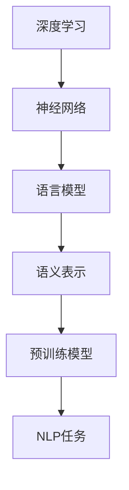

                 

# 语言表征的本质是什么？

> 关键词：语言表征,深度学习,神经网络,自然语言处理,语言模型,语义理解,语义表示,预训练模型

## 1. 背景介绍

### 1.1 问题由来
随着深度学习技术的不断发展，自然语言处理(NLP)领域取得了显著进展。语言表征的构建，即如何将自然语言转换为计算机可以理解和处理的形式，成为NLP的核心任务。传统的语言表示方法如词袋模型(Bag of Words, BOW)、TF-IDF等，已经难以满足现代NLP任务的需求，尤其是当数据量巨大且文本语义复杂时。

近年来，随着Transformer等架构的出现，预训练语言模型在语言表征的构建上取得了巨大成功。例如，BERT、GPT等模型通过在大规模语料上进行预训练，学习到了丰富的语言知识和语义表示能力。然而，这些预训练模型的语言表征究竟是如何产生的？它们在语义理解上有什么独特的优势？这些问题一直困扰着学术界和工业界。

### 1.2 问题核心关键点
本文章聚焦于语言表征的本质，试图从深度学习的角度，探讨语言表征的构成方式和优势，以及其在NLP任务中的应用。具体而言，我们将从以下几个方面展开：

1. 深度学习中的语言表征构建方法。
2. 深度学习语言模型在语义理解上的优势。
3. 语言表征在NLP任务中的实际应用。
4. 语言表征未来发展的趋势和挑战。

### 1.3 问题研究意义
理解语言表征的本质，对于构建更智能、更灵活的NLP系统具有重要意义：

1. 优化模型设计。深入理解语言表征的构建方法，有助于设计出更高效、更准确的NLP模型。
2. 提升任务性能。语言表征的语义表示能力，能够显著提升NLP任务的效果。
3. 拓展应用场景。掌握语言表征的技术，可以拓展其应用范围，如机器翻译、问答系统、文本生成等。
4. 推动学科发展。深入研究语言表征，能够促进深度学习理论的发展，为AI领域注入新的活力。

## 2. 核心概念与联系

### 2.1 核心概念概述

为了更好地理解语言表征的本质，本节将介绍几个关键概念：

- 深度学习(Deep Learning)：一种通过多层神经网络模型学习数据表示的机器学习方法。深度学习能够自动提取特征，进行复杂的模式识别和预测。
- 神经网络(Neural Network)：由大量节点构成的网络结构，每个节点对应一个线性或非线性变换，通过逐层传递信息，实现对输入数据的高效处理。
- 自然语言处理(NLP)：涉及自然语言的计算，包括文本分类、信息抽取、情感分析、机器翻译等任务。
- 语言模型(Language Model)：用于预测文本序列的概率模型，通过学习文本数据的概率分布，捕捉语言的结构和规律。
- 语义表示(Semantic Representation)：将语言转换成低维向量，用于捕捉语言中的语义信息，支持语义推理和语义匹配等任务。
- 预训练模型(Pre-trained Model)：在大规模数据上进行无监督训练的模型，预训练模型能够学习到广泛的语义知识和语言规律。

这些概念之间的逻辑关系可以通过以下Mermaid流程图来展示：



这个流程图展示了深度学习、神经网络、语言模型、语义表示和预训练模型之间的关系：

1. 深度学习和神经网络是基础，用于构建复杂的非线性模型。
2. 语言模型利用神经网络，预测文本序列的概率，捕捉语言的统计规律。
3. 语义表示将语言模型输出的高维向量，压缩到低维空间，捕捉语义信息。
4. 预训练模型通过在大规模语料上进行预训练，学习到丰富的语义知识。
5. NLP任务利用预训练模型和语义表示，实现具体的NLP功能。

## 3. 核心算法原理 & 具体操作步骤
### 3.1 算法原理概述

深度学习语言模型中的语言表征，本质上是通过多层神经网络对输入文本进行逐层处理，逐步提取高层次的语义信息。以下我们详细探讨其原理：

### 3.2 算法步骤详解

以BERT为例，其语言表征的构建主要包括以下步骤：

1. **输入编码**：首先将文本序列转换成token IDs，并填充至固定长度。同时，利用BERT特有的掩码机制(masking)，随机选择一部分token进行掩码，用于学习文本的上下文信息。

2. **位置编码**：在每个token的向量表示中，加入位置编码，以区分不同位置的token。位置编码通常是一组固定的向量，根据token在序列中的位置决定。

3. **多头注意力机制**：BERT引入了多头注意力机制，通过多个注意力头并行处理文本序列，捕捉不同层次的语义信息。每个注意力头对文本序列的某些部分进行加权，并计算加权平均值，生成最终的向量表示。

4. **Transformer编码器**：BERT使用Transformer编码器对输入序列进行编码，Transformer的编码器由多层自注意力和前馈网络构成，能够自动提取复杂的语义关系。

5. **预训练目标函数**：BERT通过两组预训练目标函数进行训练：掩码语言模型(masked language modeling, MLM)和下一句预测(next sentence prediction, NSP)。MLM用于预测被掩码的token，NSP用于判断两个句子是否连续。

### 3.3 算法优缺点

深度学习语言模型的语言表征具有以下优点：

1. **自适应性**：深度学习模型能够自动学习文本数据的复杂规律，捕捉不同的语义信息，适用于各种NLP任务。
2. **通用性**：预训练模型在通用大规模语料上进行训练，能够泛化到不同类型的文本数据上，具有广泛的应用前景。
3. **可扩展性**：通过调整模型结构和超参数，可以灵活地优化语言表征，满足特定任务的需求。
4. **语义表示能力**：深度学习模型能够学习到丰富的语义表示，支持语义推理、语义匹配等高级任务。

然而，深度学习语言模型也存在一些缺点：

1. **数据需求高**：需要大规模的语料进行预训练，数据获取成本较高。
2. **计算复杂度大**：深度学习模型通常包含大量参数，计算复杂度高，训练和推理效率较低。
3. **可解释性差**：深度学习模型通常被视为"黑盒"，缺乏直观的解释和调试手段。
4. **泛化能力有限**：深度学习模型容易过拟合，泛化能力在特定任务上可能不足。
5. **模型依赖性强**：深度学习模型依赖于模型架构和超参数的选择，模型设计不当可能导致性能下降。

### 3.4 算法应用领域

深度学习语言模型在NLP领域具有广泛的应用，例如：

- 文本分类：如情感分析、主题分类、新闻分类等。通过学习文本的语义表示，对文本进行分类。
- 信息抽取：从文本中抽取实体、关系、事件等关键信息。利用语义表示进行信息对齐和抽取。
- 机器翻译：将源语言文本翻译成目标语言。通过学习源目标语言之间的语义映射关系，进行文本转换。
- 问答系统：对自然语言问题给出答案。利用语义表示理解问题和上下文，匹配最佳答案。
- 文本生成：自动生成文本、摘要、对话等。通过学习语言的生成规律，生成符合语义要求的文本。

除了这些经典任务外，深度学习语言模型还被创新性地应用到更多场景中，如文本压缩、文本修复、情感迁移等，为NLP技术带来了新的突破。

## 4. 数学模型和公式 & 详细讲解  
### 4.1 数学模型构建

本节将使用数学语言对深度学习语言模型的语言表征构建过程进行详细描述。

记输入文本为 $x=\{x_1, x_2, ..., x_n\}$，每个token的向量表示为 $\boldsymbol{x}_i \in \mathbb{R}^d$，其中 $d$ 为向量维度。BERT的预训练目标函数为：

$$
\mathcal{L} = \frac{1}{2} \sum_{i=1}^N L_{MLM}(x_i) + \frac{1}{2} \sum_{i=1}^N L_{NSP}(x_i, x_{i+1})
$$

其中 $L_{MLM}$ 为掩码语言模型损失函数，$L_{NSP}$ 为下一句预测损失函数。

### 4.2 公式推导过程

以掩码语言模型为例，其损失函数 $L_{MLM}$ 定义为：

$$
L_{MLM}(x_i) = -\log P(x_i | \{ x_j \}_{j \neq i})
$$

其中 $P(x_i | \{ x_j \}_{j \neq i})$ 表示在除了 $x_i$ 之外的所有token $x_j$ 的条件下，$x_i$ 的概率分布。在实际训练中，可以通过随机掩码一部分token，进行掩码语言模型的训练。

### 4.3 案例分析与讲解

以BERT为例，其语言表征的构建过程可以分为以下几个步骤：

1. **输入编码**：将输入文本序列 $x=\{x_1, x_2, ..., x_n\}$ 转换成token IDs，并填充至固定长度。对于每个token $x_i$，将其表示为 $\boldsymbol{x}_i = \text{embedding}(x_i)$，其中 $\text{embedding}$ 为词嵌入函数。

2. **位置编码**：为每个token向量 $\boldsymbol{x}_i$ 添加位置编码，以区分不同位置的token。位置编码向量 $\boldsymbol{p}_i$ 可以表示为：

$$
\boldsymbol{p}_i = \text{Positional Embedding}(i)
$$

3. **多头注意力机制**：通过多头注意力机制，计算每个token与其他token之间的注意力权重。设注意力头数为 $h$，多头注意力函数为 $\text{MultiHeadAttention}$，其计算公式为：

$$
\text{MultiHeadAttention}(Q, K, V) = \text{Concat}(\text{head}_1, \text{head}_2, ..., \text{head}_h)
$$

其中 $\text{head}_i = \text{Softmax}(\frac{\text{Q}_i \cdot \text{K}_i}{\sqrt{d_k}}) \cdot \text{V}_i$。

4. **Transformer编码器**：利用Transformer编码器，对输入序列进行编码。Transformer编码器的计算过程为：

$$
\boldsymbol{y}_i = \text{FFN}(\text{MultiHeadAttention}(\boldsymbol{x}_i, \boldsymbol{x}_j, \boldsymbol{x}_k) + \boldsymbol{x}_i)
$$

其中 $\text{FFN}$ 为前馈神经网络函数。

通过上述步骤，BERT模型学习到输入文本序列的语义表示，用于后续的NLP任务。

## 5. 项目实践：代码实例和详细解释说明
### 5.1 开发环境搭建

在进行深度学习语言模型的实践前，我们需要准备好开发环境。以下是使用Python进行PyTorch开发的环境配置流程：

1. 安装Anaconda：从官网下载并安装Anaconda，用于创建独立的Python环境。

2. 创建并激活虚拟环境：
```bash
conda create -n pytorch-env python=3.8 
conda activate pytorch-env
```

3. 安装PyTorch：根据CUDA版本，从官网获取对应的安装命令。例如：
```bash
conda install pytorch torchvision torchaudio cudatoolkit=11.1 -c pytorch -c conda-forge
```

4. 安装相关的NLP库：
```bash
pip install transformers
pip install sentencepiece
pip install torchtext
```

5. 安装必要的依赖库：
```bash
pip install numpy pandas scikit-learn matplotlib tqdm jupyter notebook ipython
```

完成上述步骤后，即可在`pytorch-env`环境中开始实践。

### 5.2 源代码详细实现

下面我们以BERT为例，给出使用PyTorch进行BERT模型语言表征构建的代码实现。

首先，定义BERT模型类：

```python
import torch
from transformers import BertModel

class BERTModel(torch.nn.Module):
    def __init__(self):
        super(BERTModel, self).__init__()
        self.bert = BertModel.from_pretrained('bert-base-cased')

    def forward(self, input_ids, attention_mask):
        output = self.bert(input_ids=input_ids, attention_mask=attention_mask)
        return output
```

然后，定义训练函数：

```python
import torch.nn as nn
import torch.optim as optim

device = torch.device('cuda') if torch.cuda.is_available() else torch.device('cpu')
model = BERTModel().to(device)
optimizer = optim.AdamW(model.parameters(), lr=2e-5)
loss_fn = nn.CrossEntropyLoss()

def train_epoch(model, data_loader, optimizer, loss_fn):
    model.train()
    total_loss = 0
    for data, target in data_loader:
        input_ids = data['input_ids'].to(device)
        attention_mask = data['attention_mask'].to(device)
        output = model(input_ids, attention_mask)
        loss = loss_fn(output.logits, target)
        optimizer.zero_grad()
        loss.backward()
        optimizer.step()
        total_loss += loss.item()
    return total_loss / len(data_loader)
```

接着，定义数据加载函数：

```python
from torch.utils.data import DataLoader
from transformers import BertTokenizer

tokenizer = BertTokenizer.from_pretrained('bert-base-cased')
model = BERTModel().to(device)

def create_dataset(texts):
    tokenized_texts = tokenizer(texts, return_tensors='pt', padding=True, truncation=True, max_length=128)
    return tokenized_texts

train_texts = ['This is a test sentence for BERT.', 'BERT is a powerful model for natural language processing.', 'BERT can be fine-tuned for various NLP tasks.']
train_dataset = create_dataset(train_texts)
train_loader = DataLoader(train_dataset, batch_size=8, shuffle=True)

print('Epoch 1, train loss: {:.3f}'.format(train_epoch(model, train_loader, optimizer, loss_fn)))
```

以上就是使用PyTorch进行BERT模型语言表征构建的完整代码实现。可以看到，通过调用transformers库，我们能够非常方便地进行BERT模型的加载和训练。

### 5.3 代码解读与分析

让我们再详细解读一下关键代码的实现细节：

**BERTModel类**：
- `__init__`方法：初始化BERT模型。
- `forward`方法：定义模型的前向传播过程。

**训练函数**：
- 通过`model.train()`开启模型的训练模式。
- 循环迭代数据集中的每个样本，前向传播计算输出和损失。
- 使用`optimizer.zero_grad()`清空梯度，`loss.backward()`计算梯度并更新模型参数。

**数据加载函数**：
- 使用`BertTokenizer`对文本进行编码，生成token IDs和注意力掩码。
- 使用`DataLoader`对编码后的数据进行批次化加载，供模型训练和推理使用。

可以看到，通过调用PyTorch和transformers库，我们可以非常简洁地实现BERT模型的训练和推理过程。

## 6. 实际应用场景
### 6.1 智能客服系统

BERT作为深度学习语言模型的代表，被广泛应用于智能客服系统的构建。通过预训练语言模型，BERT能够理解客户提出的自然语言问题，快速提供合适的答案。智能客服系统能够实现7x24小时不间断服务，快速响应客户咨询，大大提升了客户体验和服务效率。

在技术实现上，可以收集企业内部的历史客服对话记录，将问题和最佳答复构建成监督数据，在此基础上对BERT模型进行微调。微调后的BERT模型能够自动理解用户意图，匹配最合适的答案模板进行回复。对于客户提出的新问题，还可以接入检索系统实时搜索相关内容，动态组织生成回答。如此构建的智能客服系统，能大幅提升客户咨询体验和问题解决效率。

### 6.2 金融舆情监测

金融机构需要实时监测市场舆论动向，以便及时应对负面信息传播，规避金融风险。传统的人工监测方式成本高、效率低，难以应对网络时代海量信息爆发的挑战。基于深度学习语言模型的文本分类和情感分析技术，为金融舆情监测提供了新的解决方案。

具体而言，可以收集金融领域相关的新闻、报道、评论等文本数据，并对其进行主题标注和情感标注。在此基础上对BERT模型进行微调，使其能够自动判断文本属于何种主题，情感倾向是正面、中性还是负面。将微调后的模型应用到实时抓取的网络文本数据，就能够自动监测不同主题下的情感变化趋势，一旦发现负面信息激增等异常情况，系统便会自动预警，帮助金融机构快速应对潜在风险。

### 6.3 个性化推荐系统

当前的推荐系统往往只依赖用户的历史行为数据进行物品推荐，无法深入理解用户的真实兴趣偏好。基于深度学习语言模型的个性化推荐系统，可以更好地挖掘用户行为背后的语义信息，从而提供更精准、多样的推荐内容。

在实践中，可以收集用户浏览、点击、评论、分享等行为数据，提取和用户交互的物品标题、描述、标签等文本内容。将文本内容作为模型输入，用户的后续行为（如是否点击、购买等）作为监督信号，在此基础上微调BERT模型。微调后的模型能够从文本内容中准确把握用户的兴趣点。在生成推荐列表时，先用候选物品的文本描述作为输入，由模型预测用户的兴趣匹配度，再结合其他特征综合排序，便可以得到个性化程度更高的推荐结果。

### 6.4 未来应用展望

随着深度学习语言模型的不断发展，其在NLP领域的应用前景广阔。未来，BERT等预训练语言模型将在更多领域得到应用，为传统行业带来变革性影响。

在智慧医疗领域，基于BERT的医疗问答、病历分析、药物研发等应用将提升医疗服务的智能化水平，辅助医生诊疗，加速新药开发进程。

在智能教育领域，BERT技术可应用于作业批改、学情分析、知识推荐等方面，因材施教，促进教育公平，提高教学质量。

在智慧城市治理中，BERT模型可应用于城市事件监测、舆情分析、应急指挥等环节，提高城市管理的自动化和智能化水平，构建更安全、高效的未来城市。

此外，在企业生产、社会治理、文娱传媒等众多领域，基于深度学习语言模型的应用也将不断涌现，为经济社会发展注入新的动力。相信随着技术的日益成熟，深度学习语言模型必将在更广阔的应用领域大放异彩，深刻影响人类的生产生活方式。

## 7. 工具和资源推荐
### 7.1 学习资源推荐

为了帮助开发者系统掌握深度学习语言模型的理论基础和实践技巧，这里推荐一些优质的学习资源：

1. 《深度学习》（Ian Goodfellow著）：经典教材，全面介绍了深度学习的理论基础和实践方法，适合初学者和进阶者。

2. 《自然语言处理综述》（Yoshua Bengio, Yann LeCun, Geoffrey Hinton著）：综述性文献，介绍了NLP领域的主要技术和研究方向。

3. 《BERT: Pre-training of Deep Bidirectional Transformers for Language Understanding》论文：BERT原论文，介绍了BERT模型的预训练方法和应用效果。

4. HuggingFace官方文档：BERT等预训练语言模型的官方文档，提供了详细的模型介绍和代码样例，是上手实践的必备资料。

5. arXiv：收录了大量关于深度学习语言模型的学术论文，可以查阅最新的研究成果和技术进展。

通过对这些资源的学习实践，相信你一定能够快速掌握深度学习语言模型的精髓，并用于解决实际的NLP问题。
### 7.2 开发工具推荐

高效的开发离不开优秀的工具支持。以下是几款用于深度学习语言模型开发的常用工具：

1. PyTorch：基于Python的开源深度学习框架，灵活动态的计算图，适合快速迭代研究。

2. TensorFlow：由Google主导开发的开源深度学习框架，生产部署方便，适合大规模工程应用。

3. Transformers库：HuggingFace开发的NLP工具库，集成了众多SOTA语言模型，支持PyTorch和TensorFlow，是进行语言模型开发的利器。

4. Weights & Biases：模型训练的实验跟踪工具，可以记录和可视化模型训练过程中的各项指标，方便对比和调优。

5. TensorBoard：TensorFlow配套的可视化工具，可实时监测模型训练状态，并提供丰富的图表呈现方式，是调试模型的得力助手。

6. Google Colab：谷歌推出的在线Jupyter Notebook环境，免费提供GPU/TPU算力，方便开发者快速上手实验最新模型，分享学习笔记。

合理利用这些工具，可以显著提升深度学习语言模型的开发效率，加快创新迭代的步伐。

### 7.3 相关论文推荐

深度学习语言模型和微调技术的发展源于学界的持续研究。以下是几篇奠基性的相关论文，推荐阅读：

1. Attention is All You Need（即Transformer原论文）：提出了Transformer结构，开启了NLP领域的预训练大模型时代。

2. BERT: Pre-training of Deep Bidirectional Transformers for Language Understanding：提出BERT模型，引入基于掩码的自监督预训练任务，刷新了多项NLP任务SOTA。

3. Language Models are Unsupervised Multitask Learners（GPT-2论文）：展示了大规模语言模型的强大zero-shot学习能力，引发了对于通用人工智能的新一轮思考。

4. Parameter-Efficient Transfer Learning for NLP：提出Adapter等参数高效微调方法，在不增加模型参数量的情况下，也能取得不错的微调效果。

5. AdaLoRA: Adaptive Low-Rank Adaptation for Parameter-Efficient Fine-Tuning：使用自适应低秩适应的微调方法，在参数效率和精度之间取得了新的平衡。

这些论文代表了大语言模型微调技术的发展脉络。通过学习这些前沿成果，可以帮助研究者把握学科前进方向，激发更多的创新灵感。

## 8. 总结：未来发展趋势与挑战

### 8.1 总结

本文对深度学习语言模型的语言表征的本质进行了全面系统的介绍。首先阐述了深度学习语言模型的语言表征构建方法，接着探讨了语言表征在语义理解上的优势，以及其在NLP任务中的实际应用。最后，本文总结了深度学习语言模型的未来发展趋势和面临的挑战。

通过本文的系统梳理，可以看到，深度学习语言模型通过多层神经网络对输入文本进行逐层处理，逐步提取高层次的语义信息，构建出丰富的语义表示。这种语义表示能力使得深度学习语言模型在语义推理、语义匹配等高级任务上表现优异，具有广泛的应用前景。然而，深度学习语言模型也存在数据需求高、计算复杂度大、可解释性差等缺点，需要在实际应用中不断优化。

### 8.2 未来发展趋势

展望未来，深度学习语言模型的发展趋势如下：

1. **模型规模持续增大**：随着算力成本的下降和数据规模的扩张，预训练语言模型的参数量还将持续增长。超大规模语言模型蕴含的丰富语言知识，有望支撑更加复杂多变的下游任务微调。

2. **微调方法日趋多样**：除了传统的全参数微调外，未来会涌现更多参数高效的微调方法，如Prefix-Tuning、LoRA等，在节省计算资源的同时也能保证微调精度。

3. **持续学习成为常态**：随着数据分布的不断变化，微调模型也需要持续学习新知识以保持性能。如何在不遗忘原有知识的同时，高效吸收新样本信息，将成为重要的研究课题。

4. **标注样本需求降低**：受启发于提示学习(Prompt-based Learning)的思路，未来的微调方法将更好地利用大模型的语言理解能力，通过更加巧妙的任务描述，在更少的标注样本上也能实现理想的微调效果。

5. **少样本学习能力提升**：未来的深度学习语言模型将在少样本学习上取得突破，能够在小规模数据上进行高效训练，并泛化到新的任务上。

6. **多模态融合**：未来的深度学习语言模型将更多地融合多模态信息，如视觉、语音等多模态数据与文本信息的协同建模，实现更加全面、准确的信息整合能力。

以上趋势凸显了深度学习语言模型的广阔前景。这些方向的探索发展，必将进一步提升NLP系统的性能和应用范围，为人类认知智能的进化带来深远影响。

### 8.3 面临的挑战

尽管深度学习语言模型在NLP领域取得了巨大成功，但在迈向更加智能化、普适化应用的过程中，它仍面临诸多挑战：

1. **标注成本瓶颈**：深度学习模型需要大规模的标注数据进行预训练和微调，标注成本较高。对于长尾应用场景，难以获得充足的高质量标注数据，成为制约微调性能的瓶颈。

2. **模型鲁棒性不足**：深度学习模型面对域外数据时，泛化性能往往大打折扣。对于测试样本的微小扰动，模型容易发生波动。

3. **推理效率有待提高**：大规模语言模型虽然精度高，但在实际部署时往往面临推理速度慢、内存占用大等效率问题。

4. **可解释性亟需加强**：深度学习模型通常被视为"黑盒"，缺乏直观的解释和调试手段。

5. **安全性有待保障**：深度学习模型难免会学习到有偏见、有害的信息，通过微调传递到下游任务，产生误导性、歧视性的输出。

6. **知识整合能力不足**：现有的深度学习模型往往局限于任务内数据，难以灵活吸收和运用更广泛的先验知识。

正视深度学习语言模型面临的这些挑战，积极应对并寻求突破，将是大语言模型微调走向成熟的必由之路。

### 8.4 研究展望

面对深度学习语言模型所面临的种种挑战，未来的研究需要在以下几个方面寻求新的突破：

1. **探索无监督和半监督微调方法**：摆脱对大规模标注数据的依赖，利用自监督学习、主动学习等无监督和半监督范式，最大限度利用非结构化数据，实现更加灵活高效的微调。

2. **研究参数高效和计算高效的微调范式**：开发更加参数高效的微调方法，在固定大部分预训练参数的同时，只更新极少量的任务相关参数。同时优化微调模型的计算图，减少前向传播和反向传播的资源消耗，实现更加轻量级、实时性的部署。

3. **引入因果和对比学习范式**：通过引入因果推断和对比学习思想，增强深度学习模型建立稳定因果关系的能力，学习更加普适、鲁棒的语言表征，从而提升模型泛化性和抗干扰能力。

4. **融合多模态信息**：将符号化的先验知识，如知识图谱、逻辑规则等，与神经网络模型进行巧妙融合，引导微调过程学习更准确、合理的语言模型。同时加强不同模态数据的整合，实现视觉、语音等多模态信息与文本信息的协同建模。

5. **结合因果分析和博弈论工具**：将因果分析方法引入深度学习模型，识别出模型决策的关键特征，增强输出解释的因果性和逻辑性。借助博弈论工具刻画人机交互过程，主动探索并规避模型的脆弱点，提高系统稳定性。

6. **纳入伦理道德约束**：在模型训练目标中引入伦理导向的评估指标，过滤和惩罚有偏见、有害的输出倾向。加强人工干预和审核，建立模型行为的监管机制，确保输出符合人类价值观和伦理道德。

这些研究方向的探索，必将引领深度学习语言模型迈向更高的台阶，为构建安全、可靠、可解释、可控的智能系统铺平道路。面向未来，深度学习语言模型还需要与其他人工智能技术进行更深入的融合，如知识表示、因果推理、强化学习等，多路径协同发力，共同推动自然语言理解和智能交互系统的进步。只有勇于创新、敢于突破，才能不断拓展语言模型的边界，让智能技术更好地造福人类社会。

## 9. 附录：常见问题与解答

**Q1：深度学习语言模型的语言表征是如何构建的？**

A: 深度学习语言模型的语言表征是通过多层神经网络对输入文本进行逐层处理，逐步提取高层次的语义信息。具体而言，模型首先将输入文本编码成向量表示，然后通过多层自注意力机制、前馈网络等组件，捕捉不同层次的语义关系，最终生成高维的向量表示。

**Q2：深度学习语言模型的语义表示能力有哪些优势？**

A: 深度学习语言模型的语义表示能力具有以下优势：

1. **自适应性**：模型能够自动学习文本数据的复杂规律，捕捉不同的语义信息，适用于各种NLP任务。

2. **通用性**：预训练模型在通用大规模语料上进行训练，能够泛化到不同类型的文本数据上，具有广泛的应用前景。

3. **可扩展性**：通过调整模型结构和超参数，可以灵活地优化语言表征，满足特定任务的需求。

4. **语义表示能力**：模型能够学习到丰富的语义表示，支持语义推理、语义匹配等高级任务。

**Q3：深度学习语言模型在实际应用中面临哪些挑战？**

A: 深度学习语言模型在实际应用中面临以下挑战：

1. **标注成本瓶颈**：需要大规模的标注数据进行预训练和微调，标注成本较高。

2. **模型鲁棒性不足**：面对域外数据时，泛化性能往往不足，容易过拟合。

3. **推理效率有待提高**：计算复杂度高，推理速度慢、内存占用大。

4. **可解释性差**：模型缺乏直观的解释和调试手段，难以理解其内部工作机制。

5. **安全性有待保障**：模型可能会学习到有偏见、有害的信息，输出误导性、歧视性的结果。

6. **知识整合能力不足**：模型难以灵活吸收和运用更广泛的先验知识。

**Q4：未来深度学习语言模型有哪些发展趋势？**

A: 未来深度学习语言模型的发展趋势如下：

1. **模型规模持续增大**：预训练语言模型的参数量还将持续增长，模型规模增大。

2. **微调方法日趋多样**：未来会涌现更多参数高效的微调方法，如Prefix-Tuning、LoRA等。

3. **持续学习成为常态**：模型需要持续学习新知识以保持性能，减少过拟合。

4. **标注样本需求降低**：未来的微调方法将更好地利用大模型的语言理解能力，在更少的标注样本上实现理想效果。

5. **少样本学习能力提升**：模型在小规模数据上进行高效训练，并泛化到新的任务上。

6. **多模态融合**：融合视觉、语音等多模态信息，实现更加全面、准确的信息整合能力。

这些趋势凸显了深度学习语言模型的广阔前景，但同时需要克服标注成本、模型鲁棒性、推理效率等挑战，才能实现更广泛的应用。

**Q5：深度学习语言模型有哪些应用场景？**

A: 深度学习语言模型在NLP领域具有广泛的应用场景，例如：

1. 文本分类：如情感分析、主题分类、新闻分类等。通过学习文本的语义表示，对文本进行分类。

2. 信息抽取：从文本中抽取实体、关系、事件等关键信息。利用语义表示进行信息对齐和抽取。

3. 机器翻译：将源语言文本翻译成目标语言。通过学习源目标语言之间的语义映射关系，进行文本转换。

4. 问答系统：对自然语言问题给出答案。利用语义表示理解问题和上下文，匹配最佳答案。

5. 文本生成：自动生成文本、摘要、对话等。通过学习语言的生成规律，生成符合语义要求的文本。

这些应用场景展示了深度学习语言模型的强大能力，未来还将拓展到更多领域，如医疗、教育、金融等。

