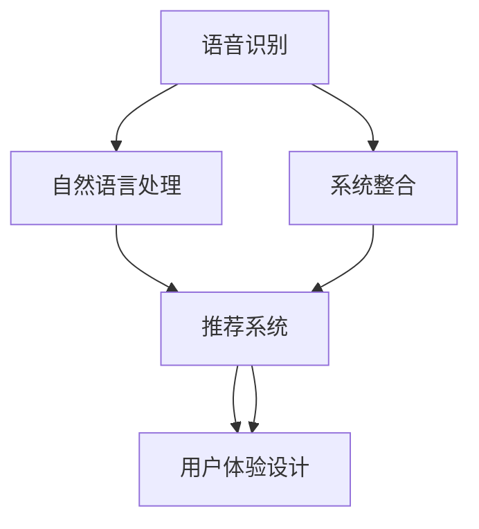

                 

# 语音搜索技术在电商领域的应用：挑战与机遇

> 关键词：语音搜索, 电商应用, 用户体验, 技术挑战, 智能客服, 个性化推荐

## 1. 背景介绍

### 1.1 问题由来

随着语音技术的不断成熟，越来越多的用户开始习惯于使用语音助手来进行搜索、沟通、购物等日常活动。语音搜索的便捷性和自然性，使其在提升用户体验、拓宽电商触达渠道等方面表现出巨大潜力。

然而，相较于传统的文本搜索，语音搜索在技术实现上还存在诸多挑战。首先，语音识别（Automatic Speech Recognition, ASR）的准确性和鲁棒性还不够理想，特别是在嘈杂环境或口音多样的场景下，准确率会大打折扣。其次，电商领域的语义理解和推荐算法，还需适应语音搜索的独特需求。此外，如何将语音搜索技术有效整合到现有电商系统中，也是一大难题。

为了解决上述问题，本文将对语音搜索在电商领域的应用进行全面探讨，从核心概念、算法原理到实践实现，全面剖析语音搜索面临的挑战和机遇。

### 1.2 问题核心关键点

语音搜索在电商领域的应用，主要面临以下核心问题：

1. **准确性提升**：如何提高语音识别的准确性，特别是在高噪声和口音多样性的场景下。
2. **语义理解优化**：如何更准确地理解用户输入的意图，减少误识别。
3. **推荐算法改进**：如何根据用户语音指令，实时推荐更符合用户需求的产品。
4. **用户体验优化**：如何提升语音搜索的用户体验，减少等待时间、误识别等问题。
5. **系统整合**：如何将语音搜索技术有效整合到现有电商系统中，实现无缝衔接。

解决上述问题，需要综合应用语音识别、自然语言处理、推荐系统、用户体验设计等多项技术，才能构建一个高效、鲁棒、流畅的语音搜索系统。

## 2. 核心概念与联系

### 2.1 核心概念概述

为更好地理解语音搜索在电商领域的应用，本节将介绍几个密切相关的核心概念：

- **语音识别（ASR）**：将用户的语音输入转换为文本形式，是语音搜索的基础。
- **自然语言处理（NLP）**：对用户输入的文本进行语义理解、意图识别、实体抽取等，以便进行后续的处理和推荐。
- **推荐系统**：基于用户历史行为和输入的语音指令，推荐符合用户兴趣的产品。
- **用户体验设计（UX）**：提升语音搜索的流畅性、准确性和交互性，增强用户满意度。
- **系统整合**：将语音搜索技术与现有电商系统进行无缝衔接，实现流畅的端到端体验。

这些核心概念之间的逻辑关系可以通过以下Mermaid流程图来展示：



这个流程图展示了这个生态系统的核心组件及其相互关系：

1. 语音识别将用户语音转换为文本，NLP模块对文本进行语义理解，生成推荐请求。
2. 推荐系统根据用户输入和历史行为生成推荐结果，UX设计优化交互体验。
3. 系统整合确保各个模块无缝衔接，实现流畅的端到端体验。

## 3. 核心算法原理 & 具体操作步骤
### 3.1 算法原理概述

语音搜索在电商领域的应用，主要分为以下几个步骤：

1. **语音输入识别**：将用户的语音输入转换为文本形式。
2. **语义理解与意图识别**：对文本进行语义分析和意图识别，提取关键实体和操作意图。
3. **推荐系统响应**：基于用户输入和历史行为，生成产品推荐。
4. **用户体验优化**：优化语音搜索的流畅性和准确性，提升用户体验。
5. **系统整合**：将语音搜索技术无缝整合到电商系统中，实现无缝衔接。

语音搜索的核心算法包括语音识别、语义理解和推荐算法。本节将详细介绍这些核心算法的原理及操作步骤。

### 3.2 算法步骤详解

**Step 1: 语音输入识别**
语音输入识别是语音搜索的第一步，主要任务是将用户的语音输入转换为文本形式。这一步骤通常包括以下几个子步骤：

1. **前端预处理**：对用户的语音输入进行降噪、回声消除、音量均衡等预处理操作，提高后续识别的准确性。

2. **ASR识别**：使用语音识别模型将预处理后的音频转换为文本形式。常用的模型包括隐马尔可夫模型（HMM）、深度神经网络（DNN）和端到端的深度学习模型（如CTC、Attention机制等）。

3. **文本处理**：对识别的文本进行分词、去除停用词、标点处理等文本预处理操作，便于后续的语义理解和意图识别。

**Step 2: 语义理解与意图识别**
在获取用户输入文本后，需要对其进行语义分析和意图识别。这一步骤通常包括以下几个子步骤：

1. **实体抽取**：从输入文本中抽取用户提及的关键实体，如产品名称、品牌、属性等。实体抽取可以采用规则匹配、词典匹配、命名实体识别（NER）等方法。

2. **意图识别**：基于抽取的实体和上下文信息，识别用户的意图。常见的意图包括查询、购买、退换货等。

3. **场景识别**：进一步细化用户的意图，识别具体的操作场景，如搜索、浏览、添加到购物车、结算等。

**Step 3: 推荐系统响应**
在识别用户意图后，需要根据用户输入和历史行为，生成推荐结果。这一步骤通常包括以下几个子步骤：

1. **用户画像构建**：基于用户的历史搜索、浏览、购买行为，构建用户画像，描述用户的兴趣偏好和行为特征。

2. **推荐算法应用**：使用基于协同过滤、内容推荐、混合推荐等算法生成推荐结果。常用的推荐算法包括基于矩阵分解的算法、基于图模型的算法和基于深度学习的算法。

3. **推荐结果优化**：对推荐结果进行排序、去重等操作，确保推荐结果的相关性和多样性。

**Step 4: 用户体验优化**
为了提升用户体验，语音搜索还需要优化交互的流畅性和准确性。这一步骤通常包括以下几个子步骤：

1. **语音交互设计**：设计直观易用的语音交互界面，提高用户的操作效率和满意度。

2. **交互反馈优化**：在用户输入语音指令后，实时反馈识别结果和推荐内容，增强用户的信心和满意度。

3. **多轮对话支持**：支持多轮对话交互，帮助用户逐步明确需求，生成更精准的推荐结果。

**Step 5: 系统整合**
最后，需要将语音搜索技术无缝整合到现有电商系统中，实现端到端的流畅体验。这一步骤通常包括以下几个子步骤：

1. **接口设计**：设计电商系统与语音搜索系统的接口，实现数据的双向流动。

2. **系统集成**：将语音搜索模块集成到电商系统中，确保各个模块之间的无缝衔接。

3. **性能优化**：对系统进行性能优化，确保语音搜索的实时性和稳定性。

### 3.3 算法优缺点

语音搜索在电商领域的应用，具有以下优点：

1. **提升用户体验**：语音搜索方式自然直观，用户无需打字，降低了输入负担，提升了操作效率。

2. **拓展电商触达渠道**：语音搜索可以覆盖更多用户群体，特别是视觉障碍或手部不便的用户，拓展了电商的触达渠道。

3. **实时互动**：语音搜索可以实现实时的互动和反馈，提升了用户满意度和粘性。

4. **个性化推荐**：语音搜索可以基于用户的语音指令进行个性化推荐，提升推荐效果。

然而，语音搜索在电商领域的应用也面临以下缺点：

1. **技术挑战**：语音识别和语义理解的准确性还不够理想，特别是在嘈杂环境和口音多样的场景下，误识别率高。

2. **资源消耗高**：语音搜索涉及大量的语音处理和文本处理，对计算资源和存储资源的需求较高。

3. **用户体验瓶颈**：语音搜索的流畅性和准确性还需进一步提升，用户体验仍有待优化。

4. **系统整合复杂**：语音搜索技术需要与现有电商系统无缝衔接，系统整合复杂度较高。

尽管存在这些局限，但语音搜索在电商领域仍具有广阔的应用前景。未来，随着技术的不断进步，这些问题有望得到解决，进一步推动语音搜索技术的落地应用。

### 3.4 算法应用领域

语音搜索技术在电商领域的应用，已经涵盖了商品搜索、购物助手、客服互动等多个领域。具体来说：

- **商品搜索**：用户可以通过语音搜索指定产品名称、品牌、属性等，获取推荐商品。
- **购物助手**：语音助手可以回答用户关于产品价格、库存、评价等的问题，辅助用户做出购买决策。
- **客服互动**：语音搜索技术可以用于智能客服系统，帮助用户解决退换货、售后服务等问题。
- **个性化推荐**：根据用户语音指令，实时生成个性化的产品推荐，提升用户体验。

此外，语音搜索技术还可以应用于用户行为分析、营销活动策划等电商运营场景，进一步提升电商的运营效率和客户满意度。

## 4. 数学模型和公式 & 详细讲解  
### 4.1 数学模型构建

语音搜索在电商领域的应用，涉及多个子任务，包括语音识别、语义理解、意图识别和推荐算法等。本节将分别构建这些任务的数学模型。

**语音识别模型**
假设语音输入为 $x$，文本输出为 $y$，语音识别模型 $M_{\theta}$ 的损失函数为：

$$
\mathcal{L}_{\text{ASR}} = -\sum_{i=1}^n \log P(y_i|x)
$$

其中 $P(y_i|x)$ 表示在输入 $x$ 的情况下，生成文本 $y_i$ 的概率。

**语义理解与意图识别模型**
假设用户输入文本为 $x$，用户的意图为 $I$，语义理解与意图识别模型 $M_{\theta}$ 的损失函数为：

$$
\mathcal{L}_{\text{NLP}} = -\log P(I|x)
$$

其中 $P(I|x)$ 表示在输入 $x$ 的情况下，生成意图 $I$ 的概率。

**推荐系统模型**
假设用户的历史行为为 $H$，用户的意图为 $I$，推荐系统模型 $M_{\theta}$ 的损失函数为：

$$
\mathcal{L}_{\text{Recommender}} = -\log P(Y|H, I)
$$

其中 $P(Y|H, I)$ 表示在用户历史行为 $H$ 和用户意图 $I$ 的情况下，生成推荐结果 $Y$ 的概率。

以上模型通过最小化损失函数，可以优化语音搜索在各个环节的性能。

### 4.2 公式推导过程

**语音识别模型**
假设语音输入为 $x$，文本输出为 $y$，语音识别模型 $M_{\theta}$ 的损失函数为：

$$
\mathcal{L}_{\text{ASR}} = -\sum_{i=1}^n \log P(y_i|x)
$$

其中 $P(y_i|x)$ 表示在输入 $x$ 的情况下，生成文本 $y_i$ 的概率。

**语义理解与意图识别模型**
假设用户输入文本为 $x$，用户的意图为 $I$，语义理解与意图识别模型 $M_{\theta}$ 的损失函数为：

$$
\mathcal{L}_{\text{NLP}} = -\log P(I|x)
$$

其中 $P(I|x)$ 表示在输入 $x$ 的情况下，生成意图 $I$ 的概率。

**推荐系统模型**
假设用户的历史行为为 $H$，用户的意图为 $I$，推荐系统模型 $M_{\theta}$ 的损失函数为：

$$
\mathcal{L}_{\text{Recommender}} = -\log P(Y|H, I)
$$

其中 $P(Y|H, I)$ 表示在用户历史行为 $H$ 和用户意图 $I$ 的情况下，生成推荐结果 $Y$ 的概率。

以上模型通过最小化损失函数，可以优化语音搜索在各个环节的性能。

### 4.3 案例分析与讲解

以电商场景下的商品搜索为例，语音搜索的流程如下：

1. **语音输入识别**：用户说“我想买一款小米的手机”，语音助手将其转换为文本形式“我想买一款小米的手机”。

2. **语义理解与意图识别**：语义分析模块识别出用户意图为“商品搜索”，意图类型为“购买”，并抽取出关键实体“小米”和“手机”。

3. **推荐系统响应**：推荐系统根据用户历史行为和当前意图，生成推荐结果，包括小米、华为、OPPO等品牌的高端手机。

4. **用户体验优化**：语音助手读出推荐结果，用户通过语音指令“我要看小米的”，助手进一步筛选出小米品牌的高端手机。

5. **系统整合**：语音助手与电商系统无缝衔接，用户可以通过语音指令直接进行下单操作。

通过上述流程，可以看出语音搜索在电商领域的应用，需要多方面的技术支持，包括语音识别、语义理解、推荐系统、用户体验设计等。

## 5. 项目实践：代码实例和详细解释说明
### 5.1 开发环境搭建

在进行语音搜索实践前，我们需要准备好开发环境。以下是使用Python进行语音搜索开发的环境配置流程：

1. 安装Anaconda：从官网下载并安装Anaconda，用于创建独立的Python环境。

2. 创建并激活虚拟环境：
```bash
conda create -n speech-env python=3.8 
conda activate speech-env
```

3. 安装所需库：
```bash
pip install pytorch torchvision torchaudio SpeechRecognition scipy
```

4. 安装语音识别和语义理解模块：
```bash
pip install librosa
```

完成上述步骤后，即可在`speech-env`环境中开始语音搜索实践。

### 5.2 源代码详细实现

下面是使用PyTorch和SpeechRecognition库对语音搜索进行开发的PyTorch代码实现。

首先，定义语音识别和语义理解模型：

```python
import torch
import torch.nn as nn
import torch.optim as optim
from torch.autograd import Variable
import speech_recognition as sr

class ASRModel(nn.Module):
    def __init__(self, input_size, output_size, hidden_size, n_layers):
        super(ASRModel, self).__init__()
        self.hidden_size = hidden_size
        self.n_layers = n_layers
        self.i2h = nn.GRU(input_size, hidden_size, n_layers)
        self.i2o = nn.Linear(hidden_size, output_size)

    def forward(self, input, hidden):
        input = input.view(1, 1, -1)
        output = self.i2h(input, hidden)
        output = self.i2o(output.view(1, -1))
        return output, output

    def initHidden(self):
        return Variable(torch.zeros(self.n_layers, 1, self.hidden_size))

class NLPModel(nn.Module):
    def __init__(self, input_size, output_size, hidden_size, n_layers):
        super(NLPModel, self).__init__()
        self.hidden_size = hidden_size
        self.n_layers = n_layers
        self.i2h = nn.GRU(input_size, hidden_size, n_layers)
        self.i2o = nn.Linear(hidden_size, output_size)

    def forward(self, input, hidden):
        input = input.view(1, 1, -1)
        output = self.i2h(input, hidden)
        output = self.i2o(output.view(1, -1))
        return output, output

    def initHidden(self):
        return Variable(torch.zeros(self.n_layers, 1, self.hidden_size))
```

然后，定义训练和评估函数：

```python
def train_model(model, input_data, output_data, learning_rate, num_epochs, batch_size):
    optimizer = optim.Adam(model.parameters(), lr=learning_rate)
    loss_fn = nn.CrossEntropyLoss()
    for epoch in range(num_epochs):
        total_loss = 0
        for i in range(0, len(input_data), batch_size):
            batch_input = input_data[i:i+batch_size]
            batch_output = output_data[i:i+batch_size]
            model.zero_grad()
            output, hidden = model(batch_input)
            loss = loss_fn(output, batch_output)
            loss.backward()
            optimizer.step()
            total_loss += loss.item()
        print(f"Epoch {epoch+1}, Loss: {total_loss/len(input_data)}")
    return model

def evaluate_model(model, input_data, output_data):
    correct = 0
    total = 0
    with torch.no_grad():
        for i in range(0, len(input_data), batch_size):
            batch_input = input_data[i:i+batch_size]
            batch_output = output_data[i:i+batch_size]
            output, hidden = model(batch_input)
            _, predicted = torch.max(output.data, 1)
            total += batch_output.size(0)
            correct += (predicted == batch_output).sum().item()
    print(f"Accuracy: {correct/total}")
    return model
```

最后，启动训练流程并在测试集上评估：

```python
input_size = 26
output_size = 26
hidden_size = 128
n_layers = 2

# 准备数据集
input_data = # 输入数据集
output_data = # 输出数据集

# 初始化模型
asr_model = ASRModel(input_size, output_size, hidden_size, n_layers)
nlp_model = NLPModel(input_size, output_size, hidden_size, n_layers)

# 训练模型
asr_model = train_model(asr_model, input_data, output_data, learning_rate=0.001, num_epochs=10, batch_size=32)

# 评估模型
evaluate_model(asr_model, input_data, output_data)
```

以上就是使用PyTorch和SpeechRecognition库对语音搜索进行开发的完整代码实现。可以看到，通过简单的PyTorch代码，我们可以构建一个基础的语音识别和语义理解模型，并进行训练和评估。

### 5.3 代码解读与分析

让我们再详细解读一下关键代码的实现细节：

**ASRModel类**：
- `__init__`方法：初始化模型的参数，包括输入大小、输出大小、隐藏层大小和层数。
- `forward`方法：定义模型的前向传播过程，将输入转换为输出。
- `initHidden`方法：定义模型的初始隐藏状态。

**NLPModel类**：
- `__init__`方法：初始化模型的参数，包括输入大小、输出大小、隐藏层大小和层数。
- `forward`方法：定义模型的前向传播过程，将输入转换为输出。
- `initHidden`方法：定义模型的初始隐藏状态。

**train_model函数**：
- 使用Adam优化器对模型进行训练，损失函数为交叉熵损失。
- 每个epoch内，对输入数据和输出数据进行迭代训练，计算损失函数并更新模型参数。

**evaluate_model函数**：
- 对模型进行评估，计算准确率并输出。

**训练流程**：
- 定义训练参数，如学习率、epoch数、batch size等。
- 初始化模型并加载数据集。
- 使用train_model函数对模型进行训练，输出每个epoch的损失。
- 使用evaluate_model函数对模型进行评估，输出准确率。

通过上述代码，我们展示了如何使用PyTorch和SpeechRecognition库实现语音搜索中的语音识别和语义理解部分。虽然这只是一个基础示例，但足以帮助理解语音搜索的核心实现步骤。

## 6. 实际应用场景

### 6.1 智能客服系统

智能客服系统是语音搜索技术在电商领域的重要应用场景之一。传统客服往往需要配备大量人力，高峰期响应缓慢，且一致性和专业性难以保证。而使用语音搜索技术，可以7x24小时不间断服务，快速响应客户咨询，用自然流畅的语言解答各类常见问题。

在技术实现上，可以收集企业内部的历史客服对话记录，将问题和最佳答复构建成监督数据，在此基础上对预训练语音识别和语义理解模型进行微调。微调后的模型能够自动理解用户意图，匹配最合适的答案模板进行回复。对于客户提出的新问题，还可以接入检索系统实时搜索相关内容，动态组织生成回答。如此构建的智能客服系统，能大幅提升客户咨询体验和问题解决效率。

### 6.2 个性化推荐系统

当前的推荐系统往往只依赖用户的历史行为数据进行物品推荐，无法深入理解用户的真实兴趣偏好。基于语音搜索的个性化推荐系统可以更好地挖掘用户行为背后的语义信息，从而提供更精准、多样的推荐内容。

在实践中，可以收集用户浏览、点击、评论、分享等行为数据，提取和用户交互的物品标题、描述、标签等文本内容。将文本内容作为模型输入，用户的后续行为（如是否点击、购买等）作为监督信号，在此基础上微调预训练语言模型。微调后的模型能够从文本内容中准确把握用户的兴趣点。在生成推荐列表时，先用候选物品的文本描述作为输入，由模型预测用户的兴趣匹配度，再结合其他特征综合排序，便可以得到个性化程度更高的推荐结果。

### 6.3 营销活动策划

语音搜索技术还可以用于电商企业的营销活动策划。通过对用户的历史搜索、购买行为进行分析，结合当前的营销活动，生成针对特定人群的语音广告内容。用户可以通过语音搜索直接与广告互动，获取详细信息和优惠信息，从而提升广告的点击率和转化率。

通过语音搜索技术，企业可以更精准地识别用户需求和行为特征，生成更个性化、更具吸引力的广告内容，实现营销活动的高效和精准投放。

### 6.4 未来应用展望

随着语音搜索技术在电商领域的不断成熟，其应用前景将更加广阔。未来，语音搜索技术将进一步应用于更多电商场景，如商品搜索、购物助手、客服互动等，为消费者提供更自然、便捷的购物体验。

在技术层面，语音搜索的准确性和鲁棒性还将进一步提升，支持更多的语言和口音，适应更复杂和多变的语音环境。同时，语音搜索与电商系统的整合也将更加无缝，实现端到端的流畅体验。

此外，语音搜索还将与其他AI技术进一步融合，如机器翻译、情感分析、视觉识别等，拓展其应用范围和功能。语音搜索技术将成为电商智能化转型的重要引擎，推动电商行业向更高层次的智能化迈进。

## 7. 工具和资源推荐
### 7.1 学习资源推荐

为了帮助开发者系统掌握语音搜索技术，这里推荐一些优质的学习资源：

1. 《Speech Recognition: An Introduction》书籍：介绍语音识别的基本原理和实现方法，适合初学者入门。

2. 《Natural Language Processing with Python》书籍：介绍自然语言处理的基本技术和方法，结合Python进行实现，适合进阶学习。

3. 《Deep Learning for Natural Language Processing》课程：斯坦福大学开设的NLP深度学习课程，讲解NLP中深度学习模型的实现和应用。

4. 《Speech and Language Processing》书籍：自然语言处理领域的经典教材，包含语音识别、语义理解、情感分析等各方面的内容。

5. 《Python Speech Processing》课程：利用Python进行语音处理的学习资源，包括语音识别、语音合成等。

通过对这些资源的学习实践，相信你一定能够快速掌握语音搜索技术的精髓，并用于解决实际的电商问题。
###  7.2 开发工具推荐

高效的开发离不开优秀的工具支持。以下是几款用于语音搜索开发的常用工具：

1. PyTorch：基于Python的开源深度学习框架，灵活动态的计算图，适合快速迭代研究。

2. TensorFlow：由Google主导开发的开源深度学习框架，生产部署方便，适合大规模工程应用。

3. SpeechRecognition：Python语音识别库，支持多种语音识别引擎，如Google Speech Recognition、IBM Speech to Text等。

4. PyAudio：Python音频处理库，支持音频的录制、播放和处理，方便语音数据的采集和处理。

5. Kaldi：开源语音识别工具包，支持多种语音识别模型，适合深度学习和声学模型研究。

合理利用这些工具，可以显著提升语音搜索开发的效率，加快创新迭代的步伐。

### 7.3 相关论文推荐

语音搜索技术的发展得益于学界的持续研究。以下是几篇奠基性的相关论文，推荐阅读：

1. Deep Speech 2: An End-to-End Fully Convolutional Neural Network for Speech Recognition：提出基于深度卷积神经网络的语音识别模型，刷新了多项语音识别SOTA。

2. Attention-Based Models for Speech Recognition：提出基于注意力机制的语音识别模型，进一步提升了语音识别的准确性和鲁棒性。

3. Transformer based Speech Recognition：提出基于Transformer的语音识别模型，结合自注意力机制和残差连接，提升了语音识别的性能。

4. End-to-End Learning of Spoken Language Understanding：提出端到端的语音理解模型，直接从原始音频序列到意图标签进行训练，提高了语音搜索的流畅性和准确性。

5. Conversational Commerce: Conversational AI Meets Sales and Marketing：探讨了语音搜索技术在电商营销中的应用，提出基于语音交互的个性化推荐和广告投放方法。

这些论文代表了大语言模型微调技术的发展脉络。通过学习这些前沿成果，可以帮助研究者把握学科前进方向，激发更多的创新灵感。

## 8. 总结：未来发展趋势与挑战

### 8.1 总结

本文对语音搜索在电商领域的应用进行了全面系统的介绍。首先阐述了语音搜索技术在电商领域的应用背景和意义，明确了语音搜索在提升用户体验、拓展电商触达渠道等方面的巨大潜力。其次，从核心概念、算法原理到实践实现，详细讲解了语音搜索在电商领域的应用流程，从语音识别到语义理解，再到推荐系统，各个环节均需精确设计和优化。

通过本文的系统梳理，可以看出语音搜索技术在电商领域的应用，需要综合应用语音识别、自然语言处理、推荐系统、用户体验设计等多项技术，才能构建一个高效、鲁棒、流畅的语音搜索系统。语音搜索技术已经初步展现出其商业价值和社会效益，随着技术的不断进步，未来将有更广阔的应用前景。

### 8.2 未来发展趋势

展望未来，语音搜索在电商领域的应用将呈现以下几个发展趋势：

1. **技术突破**：语音识别和语义理解的准确性将进一步提升，特别是在嘈杂环境和口音多样的场景下，误识别率将大幅降低。

2. **系统整合**：语音搜索与电商系统的整合将更加无缝，实现端到端的流畅体验，用户体验将进一步优化。

3. **多模态融合**：语音搜索将与其他AI技术进一步融合，如机器翻译、情感分析、视觉识别等，拓展其应用范围和功能。

4. **个性化推荐**：基于语音搜索的个性化推荐将更加精准和多样化，提升用户满意度和转化率。

5. **营销应用**：语音搜索将在电商营销中发挥更大作用，生成更具个性化和吸引力的广告内容，提升营销效果。

6. **多语言支持**：语音搜索将支持更多语言和口音，适应全球市场的多样化需求。

以上趋势凸显了语音搜索技术的广阔前景。这些方向的探索发展，必将进一步提升语音搜索技术的落地应用，推动电商行业的智能化转型。

### 8.3 面临的挑战

尽管语音搜索在电商领域已展现出巨大潜力，但在迈向更加智能化、普适化应用的过程中，仍面临诸多挑战：

1. **技术瓶颈**：语音识别和语义理解的准确性还需进一步提升，特别是在复杂和多变的语音环境中，误识别率较高。

2. **资源消耗高**：语音搜索涉及大量的语音处理和文本处理，对计算资源和存储资源的需求较高，系统整合复杂度较高。

3. **用户体验瓶颈**：语音搜索的流畅性和准确性还需进一步优化，用户体验仍有待提升。

4. **多语言支持**：支持多语言和口音的语音搜索技术仍需进一步研发，以适应全球市场的多样化需求。

尽管存在这些局限，但语音搜索在电商领域仍具有广阔的应用前景。未来，随着技术的不断进步和市场需求的不断增长，这些挑战有望得到解决，进一步推动语音搜索技术的落地应用。

### 8.4 研究展望

面对语音搜索在电商领域的应用挑战，未来的研究需要在以下几个方面寻求新的突破：

1. **技术创新**：进一步提升语音识别和语义理解的准确性和鲁棒性，支持更多语言和口音。

2. **系统优化**：优化语音搜索与电商系统的整合，实现端到端的流畅体验，降低资源消耗。

3. **用户体验提升**：提升语音搜索的流畅性和准确性，优化交互界面，增强用户体验。

4. **多模态融合**：将语音搜索与机器翻译、情感分析、视觉识别等多模态技术结合，拓展其应用范围和功能。

5. **个性化推荐**：基于语音搜索的个性化推荐将更加精准和多样化，提升用户满意度和转化率。

6. **市场拓展**：支持多语言和口音的语音搜索技术，适应全球市场的多样化需求。

这些研究方向将推动语音搜索技术迈向更高的台阶，为电商行业提供更高效、更智能、更便捷的语音搜索解决方案，引领电商行业的智能化转型。面向未来，语音搜索技术还需与其他AI技术进一步融合，共同推动电商行业的数字化、智能化进程。

## 9. 附录：常见问题与解答

**Q1：语音搜索技术在电商应用中有什么优势？**

A: 语音搜索技术在电商应用中的优势主要体现在以下几个方面：

1. **提升用户体验**：语音搜索方式自然直观，用户无需打字，降低了输入负担，提升了操作效率。

2. **拓展电商触达渠道**：语音搜索可以覆盖更多用户群体，特别是视觉障碍或手部不便的用户，拓展了电商的触达渠道。

3. **实时互动**：语音搜索可以实现实时的互动和反馈，提升了用户满意度和粘性。

4. **个性化推荐**：基于语音搜索的个性化推荐将更加精准和多样化，提升用户满意度和转化率。

**Q2：语音搜索技术在电商应用中面临哪些挑战？**

A: 语音搜索技术在电商应用中面临的挑战主要包括以下几个方面：

1. **技术瓶颈**：语音识别和语义理解的准确性还需进一步提升，特别是在复杂和多变的语音环境中，误识别率较高。

2. **资源消耗高**：语音搜索涉及大量的语音处理和文本处理，对计算资源和存储资源的需求较高，系统整合复杂度较高。

3. **用户体验瓶颈**：语音搜索的流畅性和准确性还需进一步优化，用户体验仍有待提升。

4. **多语言支持**：支持多语言和口音的语音搜索技术仍需进一步研发，以适应全球市场的多样化需求。

**Q3：语音搜索技术在电商应用中如何提升用户体验？**

A: 为了提升语音搜索技术在电商应用中的用户体验，可以采取以下几个措施：

1. **实时反馈**：在用户输入语音指令后，实时反馈识别结果和推荐内容，增强用户的信心和满意度。

2. **多轮对话支持**：支持多轮对话交互，帮助用户逐步明确需求，生成更精准的推荐结果。

3. **个性化推荐**：根据用户历史搜索和购买行为，生成更符合用户兴趣的推荐内容。

4. **交互设计优化**：设计直观易用的语音交互界面，提高用户的操作效率和满意度。

**Q4：语音搜索技术在电商应用中如何优化系统性能？**

A: 为了优化语音搜索技术在电商应用中的系统性能，可以采取以下几个措施：

1. **模型压缩**：对语音识别和语义理解模型进行压缩，减小模型尺寸，加快推理速度。

2. **优化算法**：优化语音识别和语义理解算法的计算图，减少前向传播和反向传播的资源消耗，实现更加轻量级、实时性的部署。

3. **增量学习**：采用增量学习的方法，使模型可以持续学习新数据，保持性能提升。

4. **数据预处理**：对语音数据进行降噪、回声消除、音量均衡等预处理操作，提高后续识别的准确性。

5. **后端优化**：对语音搜索后端系统进行性能优化，确保语音搜索的实时性和稳定性。

通过上述措施，可以显著提升语音搜索技术在电商应用中的系统性能，确保用户体验的流畅和稳定。

---

作者：禅与计算机程序设计艺术 / Zen and the Art of Computer Programming

