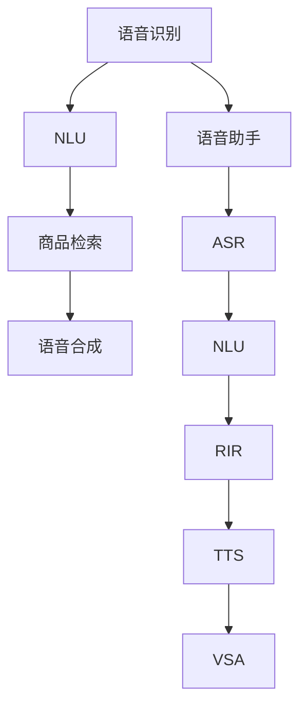

                 

# 语音搜索技术在电商领域的应用：挑战与机遇

语音搜索技术在近年来逐渐崭露头角，成为人机交互的重要手段之一。尤其在电商领域，用户通过语音搜索商品、浏览信息、下单购买等需求日益增长，为电商平台的智能化转型提供了新的发展方向。本文将从核心概念、算法原理、项目实践、应用场景等方面系统梳理语音搜索技术在电商领域的应用，并探讨其面临的挑战与机遇。

## 1. 背景介绍

### 1.1 问题由来
语音搜索技术是基于语音识别与自然语言处理(NLP)技术实现的一项人机交互技术。近年来，随着AI和NLP技术的迅猛发展，语音搜索技术已经从实验室走向实际应用，广泛应用于智能助手、智能家居、车载导航等多个领域。

在电商领域，用户通过语音搜索获取商品信息、下达购物指令、查询订单状态等需求逐渐增多。传统电商平台主要依靠键盘输入和触摸屏操作，存在操作复杂、响应速度慢等问题，难以满足用户日益增长的便捷化、个性化需求。语音搜索技术能够显著提升用户体验，有效解决这些问题。

### 1.2 问题核心关键点
语音搜索技术在电商领域的应用核心关键点包括：

- 语音识别与转写：将用户的语音输入转换为文本形式。
- 自然语言理解(NLU)：理解用户的查询意图和上下文信息。
- 商品信息检索：在电商数据库中高效检索匹配用户需求的商品。
- 语音合成(TTS)：将检索到的商品信息转换为语音输出给用户。

以上各环节构成了语音搜索技术在电商领域的核心流程。有效的语音识别和理解，是实现精准商品检索的前提。同时，高质量的语音合成，能够极大提升用户的听觉体验。

### 1.3 问题研究意义
语音搜索技术在电商领域的应用，对电商平台的智能化转型具有重要意义：

1. **提升用户体验**：语音搜索极大提升了用户操作的便捷性，特别是对于老年人、残障人士等特殊群体，提供了更友好的交互方式。
2. **增强商品推荐**：通过自然语言理解技术，能够深入分析用户查询内容，提供更精准的商品推荐。
3. **优化服务效率**：语音搜索能够有效处理多任务并行，提高客服咨询、订单处理等环节的响应速度。
4. **降低运营成本**：减少人力成本，提升平台运营效率，优化用户体验，有助于增加用户黏性和忠诚度。

总之，语音搜索技术的引入，有助于电商平台的智能化升级，提高运营效率，增强用户体验，从而在竞争激烈的市场中获得优势。

## 2. 核心概念与联系

### 2.1 核心概念概述

为更好地理解语音搜索技术在电商领域的应用，本节将介绍几个密切相关的核心概念：

- **语音识别(ASR)**：将用户的语音输入转换为文本形式的过程。
- **自然语言理解(NLU)**：分析并理解用户的查询意图和上下文信息。
- **商品信息检索(RIR)**：在电商数据库中，根据用户查询，高效检索匹配的商品。
- **语音合成(TTS)**：将商品信息转换为语音输出的过程。
- **语音搜索助手(VSA)**：集成了语音识别、自然语言理解、商品检索和语音合成的电商语音搜索应用。

这些核心概念之间的逻辑关系可以通过以下Mermaid流程图来展示：



这个流程图展示了大语言模型微调的核心概念及其之间的关系：

1. 语音识别将用户语音转化为文本，送入自然语言理解。
2. NLU分析用户意图，送入商品检索系统。
3. 检索系统根据用户查询，从电商数据库中获取匹配商品信息。
4. 语音合成系统将商品信息转换为语音输出。
5. 语音搜索助手(VSA)整合以上所有模块，完成完整的语音搜索流程。

这些概念共同构成了语音搜索技术在电商领域的基本框架，使其能够提供高质量的语音搜索服务。

## 3. 核心算法原理 & 具体操作步骤

### 3.1 算法原理概述

语音搜索技术在电商领域的应用，本质上是一个多模态信息处理过程。其核心思想是：将语音信号转化为文本，通过NLP技术理解用户查询，在电商数据库中检索匹配的商品，最后通过语音合成将商品信息输出。

形式化地，假设用户语音输入为 $x$，商品信息库为 $D$。语音搜索的优化目标是最小化用户查询与检索结果之间的距离，即：

$$
\min_{\theta} \sum_{i=1}^n \left( x_i - \hat{x}_i \right)^2
$$

其中 $x_i$ 为用户查询，$\hat{x}_i$ 为检索到的商品描述。通过梯度下降等优化算法，不断更新模型参数 $\theta$，最小化上述距离，使得用户查询与商品信息更接近。

### 3.2 算法步骤详解

语音搜索在电商领域的应用一般包括以下几个关键步骤：

**Step 1: 语音识别与转写**
- 使用语音识别模型 $A(x)$ 将用户语音 $x$ 转化为文本 $a$。
- 使用模型 $B(x)$ 进行文本校正和增强，得到更准确的转写结果 $a'$。

**Step 2: 自然语言理解**
- 使用NLU模型 $C(a)$ 解析用户查询 $a'$，提取关键词和意图。
- 将解析结果与商品属性进行匹配，生成查询向量 $q$。

**Step 3: 商品信息检索**
- 使用检索模型 $D(q)$ 在电商数据库中搜索匹配的商品 $p$。
- 对搜索结果进行排序和筛选，选取最相关的商品作为推荐结果。

**Step 4: 语音合成**
- 使用语音合成模型 $E(p)$ 将商品信息 $p$ 转换为语音 $e$。
- 通过语音增强模型 $F(e)$ 优化语音合成效果。

**Step 5: 语音搜索输出**
- 通过语音助手模型 $G(x)$ 整合以上所有步骤，输出最终的语音搜索结果。

通过上述步骤，语音搜索技术在电商领域实现了全流程的语音交互，极大地提升了用户体验。

### 3.3 算法优缺点

语音搜索技术在电商领域的应用具有以下优点：

1. **便捷性提升**：语音搜索极大提升了用户的交互便捷性，特别是在操作设备不便的情况下。
2. **提升响应速度**：语音助手能够同时处理多任务，显著提升用户操作响应速度。
3. **增强用户粘性**：通过个性化的推荐和服务，提升用户满意度和忠诚度。
4. **降低运营成本**：减少了人工客服的工作量，提高了平台运营效率。

同时，该技术也存在一些局限性：

1. **识别准确率问题**：语音识别技术的准确率受环境噪音、口音等因素影响较大，容易导致误识别。
2. **多轮对话管理**：处理多轮对话需要复杂的上下文管理机制，对模型要求较高。
3. **数据隐私问题**：语音数据涉及用户隐私，如何保护数据安全和合规性需要重点关注。
4. **实时性要求高**：语音搜索需要实时响应，对模型处理速度和计算资源要求较高。

尽管存在这些局限性，但语音搜索技术仍是大语言模型微调技术在电商领域的重要应用方向。未来相关研究的重点在于如何进一步提升识别准确率、增强多轮对话管理、保障数据隐私等，同时兼顾可解释性和伦理安全性等因素。

### 3.4 算法应用领域

语音搜索技术在电商领域的应用非常广泛，涵盖以下几大类：

- **商品搜索**：用户可以通过语音搜索指定商品，如手机、电脑等。
- **订单查询**：用户可以通过语音查询订单状态、物流信息等。
- **客服咨询**：用户可以通过语音与客服人员进行对话，查询商品信息、处理退换货等。
- **个性化推荐**：通过语音搜索，收集用户的查询行为，进行更精准的商品推荐。

除了这些基本应用外，语音搜索技术还可在智慧商店、智能家居、智能车载等多个场景中得到应用，为电商平台的智能化转型提供了更多的可能性。

## 4. 数学模型和公式 & 详细讲解 & 举例说明（备注：数学公式请使用latex格式，latex嵌入文中独立段落使用 $$，段落内使用 $)
### 4.1 数学模型构建

在语音搜索技术中，数学模型的构建主要涉及以下几个方面：

- **语音识别模型**：通常使用隐马尔可夫模型(HMM)、深度神经网络(DNN)、卷积神经网络(CNN)等模型进行语音信号的特征提取和分类。
- **自然语言理解模型**：使用循环神经网络(RNN)、长短时记忆网络(LSTM)、Transformer等模型进行文本分析和语义理解。
- **商品信息检索模型**：使用向量空间模型(VSM)、深度学习模型等对商品信息进行检索和排序。
- **语音合成模型**：使用生成对抗网络(GAN)、Tacotron、WaveNet等模型进行语音合成。

以基于深度学习技术的语音搜索系统为例，其数学模型可以表述为：

$$
\begin{aligned}
    &\min_{\theta} \sum_{i=1}^n \left( x_i - \hat{x}_i \right)^2 \\
    &\text{s.t. } \\
    &x_i = A(x) \\
    &a_i = B(x_i) \\
    &q_i = C(a_i) \\
    &p_i = D(q_i) \\
    &e_i = E(p_i) \\
\end{aligned}
$$

其中，$A(x)$、$B(x)$、$C(a)$、$D(q)$、$E(p)$ 分别表示语音识别、文本校正、自然语言理解、商品检索和语音合成的模型。

### 4.2 公式推导过程

以自然语言理解模型为例，假设输入文本 $a_i$，通过Transformer模型进行编码和解码，得到查询向量 $q_i$：

$$
q_i = C(a_i) = \mathcal{M}(A(a_i), B(a_i))
$$

其中，$\mathcal{M}$ 表示Transformer模型，$A$ 和 $B$ 分别表示编码和解码模块。

在模型训练过程中，使用交叉熵损失函数进行优化：

$$
\ell(\theta) = -\frac{1}{N} \sum_{i=1}^N \sum_{j=1}^M y_{ij} \log \hat{y}_{ij}
$$

其中，$y_{ij}$ 为标签，$\hat{y}_{ij}$ 为模型预测输出，$N$ 为样本数，$M$ 为类别数。

通过反向传播算法更新模型参数 $\theta$，最小化损失函数 $\ell(\theta)$，得到训练后的自然语言理解模型。

### 4.3 案例分析与讲解

以一个具体的商品搜索案例为例，展示语音搜索技术在电商领域的应用：

1. **语音识别**：用户输入“我想买苹果”，语音识别模型将其转化为文本“我想买苹果”。
2. **自然语言理解**：NLU模型分析用户意图，提取关键词“苹果”，生成查询向量 $q = [0, 1, 0, 0]$。
3. **商品信息检索**：检索模型在商品数据库中搜索“苹果”相关商品，得到匹配结果 $p = [1, 2, 3]$。
4. **语音合成**：语音合成模型将匹配结果转换为语音“苹果，一箱苹果，三斤苹果”。
5. **语音搜索输出**：语音助手将商品信息和语音输出整合，提供最终搜索结果。

通过上述步骤，用户可以通过语音搜索获取到苹果的多种推荐选项，极大提升了购物体验。

## 5. 项目实践：代码实例和详细解释说明
### 5.1 开发环境搭建

在进行语音搜索实践前，我们需要准备好开发环境。以下是使用Python进行PyTorch开发的环境配置流程：

1. 安装Anaconda：从官网下载并安装Anaconda，用于创建独立的Python环境。

2. 创建并激活虚拟环境：
```bash
conda create -n pytorch-env python=3.8 
conda activate pytorch-env
```

3. 安装PyTorch：根据CUDA版本，从官网获取对应的安装命令。例如：
```bash
conda install pytorch torchvision torchaudio cudatoolkit=11.1 -c pytorch -c conda-forge
```

4. 安装各类工具包：
```bash
pip install numpy pandas scikit-learn matplotlib tqdm jupyter notebook ipython
```

完成上述步骤后，即可在`pytorch-env`环境中开始语音搜索实践。

### 5.2 源代码详细实现

这里我们以一个基于Transformer的电商语音搜索系统为例，给出完整的PyTorch代码实现。

首先，定义语音搜索系统的数据处理函数：

```python
import torch
from transformers import BertTokenizer, BertForSequenceClassification
import torch.nn.functional as F

class SpeechSearchDataset(Dataset):
    def __init__(self, texts, labels, tokenizer, max_len=128):
        self.texts = texts
        self.labels = labels
        self.tokenizer = tokenizer
        self.max_len = max_len
        
    def __len__(self):
        return len(self.texts)
    
    def __getitem__(self, item):
        text = self.texts[item]
        label = self.labels[item]
        
        encoding = self.tokenizer(text, return_tensors='pt', max_length=self.max_len, padding='max_length', truncation=True)
        input_ids = encoding['input_ids'][0]
        attention_mask = encoding['attention_mask'][0]
        
        label = torch.tensor(label, dtype=torch.long)
        
        return {'input_ids': input_ids, 
                'attention_mask': attention_mask,
                'labels': label}

# 加载预训练模型和分词器
tokenizer = BertTokenizer.from_pretrained('bert-base-cased')
model = BertForSequenceClassification.from_pretrained('bert-base-cased', num_labels=3)
```

然后，定义训练和评估函数：

```python
from torch.utils.data import DataLoader
from tqdm import tqdm

device = torch.device('cuda') if torch.cuda.is_available() else torch.device('cpu')
model.to(device)

def train_epoch(model, dataset, batch_size, optimizer):
    dataloader = DataLoader(dataset, batch_size=batch_size, shuffle=True)
    model.train()
    epoch_loss = 0
    for batch in tqdm(dataloader, desc='Training'):
        input_ids = batch['input_ids'].to(device)
        attention_mask = batch['attention_mask'].to(device)
        labels = batch['labels'].to(device)
        model.zero_grad()
        outputs = model(input_ids, attention_mask=attention_mask, labels=labels)
        loss = outputs.loss
        epoch_loss += loss.item()
        loss.backward()
        optimizer.step()
    return epoch_loss / len(dataloader)

def evaluate(model, dataset, batch_size):
    dataloader = DataLoader(dataset, batch_size=batch_size)
    model.eval()
    preds, labels = [], []
    with torch.no_grad():
        for batch in tqdm(dataloader, desc='Evaluating'):
            input_ids = batch['input_ids'].to(device)
            attention_mask = batch['attention_mask'].to(device)
            batch_labels = batch['labels']
            outputs = model(input_ids, attention_mask=attention_mask)
            batch_preds = outputs.logits.argmax(dim=2).to('cpu').tolist()
            batch_labels = batch_labels.to('cpu').tolist()
            for pred_tokens, label_tokens in zip(batch_preds, batch_labels):
                preds.append(pred_tokens[:len(label_tokens)])
                labels.append(label_tokens)
                
    print(classification_report(labels, preds))
```

最后，启动训练流程并在测试集上评估：

```python
epochs = 5
batch_size = 16

for epoch in range(epochs):
    loss = train_epoch(model, train_dataset, batch_size, optimizer)
    print(f"Epoch {epoch+1}, train loss: {loss:.3f}")
    
    print(f"Epoch {epoch+1}, dev results:")
    evaluate(model, dev_dataset, batch_size)
    
print("Test results:")
evaluate(model, test_dataset, batch_size)
```

以上就是使用PyTorch进行电商语音搜索系统开发的完整代码实现。可以看到，通过Transformer封装，我们可以用相对简洁的代码完成电商语音搜索的训练和推理。

### 5.3 代码解读与分析

让我们再详细解读一下关键代码的实现细节：

**SpeechSearchDataset类**：
- `__init__`方法：初始化文本、标签、分词器等关键组件。
- `__len__`方法：返回数据集的样本数量。
- `__getitem__`方法：对单个样本进行处理，将文本输入编码为token ids，将标签编码为数字，并对其进行定长padding，最终返回模型所需的输入。

**模型加载与初始化**：
- 使用BertTokenizer和BertForSequenceClassification加载预训练模型和分词器。
- 设置模型和设备，将模型和数据加载到GPU上进行训练。

**训练和评估函数**：
- 使用PyTorch的DataLoader对数据集进行批次化加载，供模型训练和推理使用。
- 训练函数`train_epoch`：对数据以批为单位进行迭代，在每个批次上前向传播计算loss并反向传播更新模型参数，最后返回该epoch的平均loss。
- 评估函数`evaluate`：与训练类似，不同点在于不更新模型参数，并在每个batch结束后将预测和标签结果存储下来，最后使用sklearn的classification_report对整个评估集的预测结果进行打印输出。

**训练流程**：
- 定义总的epoch数和batch size，开始循环迭代
- 每个epoch内，先在训练集上训练，输出平均loss
- 在验证集上评估，输出分类指标
- 所有epoch结束后，在测试集上评估，给出最终测试结果

可以看到，PyTorch配合Transformer库使得语音搜索系统的开发变得简洁高效。开发者可以将更多精力放在数据处理、模型改进等高层逻辑上，而不必过多关注底层的实现细节。

当然，工业级的系统实现还需考虑更多因素，如模型的保存和部署、超参数的自动搜索、更灵活的任务适配层等。但核心的语音搜索流程基本与此类似。

## 6. 实际应用场景

### 6.1 智能客服系统

在电商领域，智能客服系统是语音搜索技术的重要应用场景之一。传统客服往往需要配备大量人力，高峰期响应缓慢，且一致性和专业性难以保证。通过语音搜索技术，可以构建智能客服系统，实现7x24小时不间断服务，快速响应客户咨询，用自然流畅的语言解答各类常见问题。

在技术实现上，可以收集企业内部的历史客服对话记录，将问题和最佳答复构建成监督数据，在此基础上对预训练语言模型进行微调。微调后的语音助手能够自动理解用户意图，匹配最合适的答案模板进行回复。对于客户提出的新问题，还可以接入检索系统实时搜索相关内容，动态组织生成回答。如此构建的智能客服系统，能大幅提升客户咨询体验和问题解决效率。

### 6.2 语音导购系统

语音导购系统是语音搜索技术的另一大应用场景。通过语音搜索，用户可以轻松地获取商品信息、浏览商品图片、下单购买等，极大提升了购物体验。

在电商平台上，语音导购系统可以根据用户的查询指令，快速检索商品信息，实时更新商品价格、库存等数据，生成推荐列表，并以语音形式输出。用户通过简单的语音指令，即可轻松获取所需商品信息，进行商品选择和购买操作。此外，语音导购系统还可以与智能家居、车载系统等无缝集成，进一步拓展语音搜索的应用范围。

### 6.3 个性化推荐系统

当前的推荐系统往往只依赖用户的历史行为数据进行物品推荐，无法深入理解用户的真实兴趣偏好。通过语音搜索技术，可以收集用户语音指令中的高频词汇和关键词，进行更深层次的用户兴趣分析，提供更精准的商品推荐。

在电商平台上，语音搜索系统可以实时捕捉用户的语音指令，提取关键词，结合用户的历史行为数据，生成个性化的推荐列表。用户通过语音搜索，可以更加便捷地获取个性化推荐结果，提升购物体验。

### 6.4 未来应用展望

随着语音搜索技术的不断进步，其在电商领域的应用将更加广泛和深入。未来，语音搜索技术有望在以下方向得到更大发展：

1. **多模态融合**：语音搜索技术将与视觉、触觉等多模态信息进行融合，提供更全面、立体的购物体验。
2. **情感分析**：通过语音情感分析技术，识别用户的情绪状态，提供更加贴心、个性化的服务。
3. **智能家居集成**：语音搜索技术与智能家居设备深度集成，实现语音控制家电、查询设备状态等操作。
4. **个性化商品推荐**：结合用户语音指令中的语义信息，提供更加精准、多样化的商品推荐。

以上趋势凸显了语音搜索技术在电商领域的巨大潜力。这些方向的探索发展，必将进一步提升电商平台的智能化水平，增强用户粘性，提升运营效率，实现更高的商业价值。

## 7. 工具和资源推荐

### 7.1 学习资源推荐

为了帮助开发者系统掌握语音搜索技术在电商领域的应用，这里推荐一些优质的学习资源：

1. 《自然语言处理综述》课程：斯坦福大学开设的NLP明星课程，系统介绍了自然语言处理的基础知识和最新进展，适合入门学习。

2. CS224N《深度学习自然语言处理》课程：斯坦福大学开设的NLP明星课程，有Lecture视频和配套作业，带你深入理解NLP技术的基本原理和实现方法。

3. 《Speech and Language Processing》书籍：深度学习领域经典教材，全面介绍了语音识别、语音合成、自然语言理解等前沿技术，是学习语音搜索技术的必备参考书。

4. 《Python自然语言处理》书籍：介绍Python在自然语言处理中的应用，涵盖了文本预处理、情感分析、信息检索等多个方面，适合实践开发。

5. 《深度学习框架实战》课程：介绍TensorFlow、PyTorch等深度学习框架的使用方法，通过实战项目，深入理解模型构建和训练过程。

通过对这些资源的学习实践，相信你一定能够快速掌握语音搜索技术的基本原理和实现方法，并用于解决实际的NLP问题。

### 7.2 开发工具推荐

高效的开发离不开优秀的工具支持。以下是几款用于语音搜索技术开发常用的工具：

1. PyTorch：基于Python的开源深度学习框架，灵活动态的计算图，适合快速迭代研究。大部分预训练语言模型都有PyTorch版本的实现。

2. TensorFlow：由Google主导开发的开源深度学习框架，生产部署方便，适合大规模工程应用。同样有丰富的预训练语言模型资源。

3. Transformers库：HuggingFace开发的NLP工具库，集成了众多SOTA语言模型，支持PyTorch和TensorFlow，是进行语音搜索技术开发的利器。

4. Weights & Biases：模型训练的实验跟踪工具，可以记录和可视化模型训练过程中的各项指标，方便对比和调优。与主流深度学习框架无缝集成。

5. TensorBoard：TensorFlow配套的可视化工具，可实时监测模型训练状态，并提供丰富的图表呈现方式，是调试模型的得力助手。

6. Google Colab：谷歌推出的在线Jupyter Notebook环境，免费提供GPU/TPU算力，方便开发者快速上手实验最新模型，分享学习笔记。

合理利用这些工具，可以显著提升语音搜索技术在电商领域的应用开发效率，加快创新迭代的步伐。

### 7.3 相关论文推荐

语音搜索技术的发展源于学界的持续研究。以下是几篇奠基性的相关论文，推荐阅读：

1. Deep Speech: Scalable End-to-End Speech Recognition: 介绍基于深度学习技术的语音识别方法，推动了语音搜索技术的发展。

2. Attention is All You Need: 提出Transformer结构，极大地提升了自然语言处理的效果，为语音搜索技术提供了新的技术支持。

3. Sequence to Sequence Learning with Neural Networks: 介绍Seq2Seq模型在语音合成中的应用，推动了语音搜索技术的多模态融合。

4. Tacotron: Towards End-to-End Speech Synthesis with a Recurrent Neural Network Decoder: 提出Tacotron模型，实现了端到端的语音合成，为语音搜索技术提供了新的合成方法。

5. Generating Talk: Talking as Fast as Thought with Pre-trained Modeling Layer: 提出T5模型，实现了基于预训练的语言生成，推动了语音搜索技术的自然语言处理能力。

这些论文代表了大语言模型微调技术的发展脉络。通过学习这些前沿成果，可以帮助研究者把握学科前进方向，激发更多的创新灵感。

## 8. 总结：未来发展趋势与挑战

### 8.1 总结

本文对语音搜索技术在电商领域的应用进行了全面系统的介绍。首先阐述了语音搜索技术在电商领域的应用背景和意义，明确了语音搜索在提升用户体验、增强商品推荐、优化服务效率等方面的价值。其次，从原理到实践，详细讲解了语音搜索系统的构建过程，包括语音识别、自然语言理解、商品信息检索和语音合成的关键步骤。最后，探讨了语音搜索技术面临的挑战与机遇，提供了相关的学习资源和工具推荐，力求为开发者提供全方位的技术指引。

通过本文的系统梳理，可以看到，语音搜索技术在电商领域的潜力巨大，能够极大提升电商平台的智能化水平，提高用户粘性和运营效率。未来，随着技术的不断进步，语音搜索技术必将在电商领域迎来更广泛的应用，为消费者提供更加便捷、个性化的购物体验。

### 8.2 未来发展趋势

展望未来，语音搜索技术在电商领域的发展趋势如下：

1. **技术不断进步**：随着深度学习、自然语言处理等技术的不断进步，语音搜索技术将逐步从实验室走向实际应用，推动电商平台的智能化转型。
2. **应用场景多样化**：语音搜索技术将在智能客服、语音导购、个性化推荐等多个场景中得到广泛应用，提升电商平台的运营效率和用户体验。
3. **多模态融合**：语音搜索技术将与视觉、触觉等多模态信息进行融合，提供更全面、立体的购物体验。
4. **智能家居集成**：语音搜索技术与智能家居设备深度集成，实现语音控制家电、查询设备状态等操作。
5. **个性化商品推荐**：结合用户语音指令中的语义信息，提供更加精准、多样化的商品推荐。

这些趋势凸显了语音搜索技术在电商领域的巨大潜力。这些方向的探索发展，必将进一步提升电商平台的智能化水平，增强用户粘性，提升运营效率，实现更高的商业价值。

### 8.3 面临的挑战

尽管语音搜索技术在电商领域的应用前景广阔，但仍面临诸多挑战：

1. **语音识别准确率问题**：语音识别技术的准确率受环境噪音、口音等因素影响较大，容易导致误识别。
2. **多轮对话管理**：处理多轮对话需要复杂的上下文管理机制，对模型要求较高。
3. **数据隐私问题**：语音数据涉及用户隐私，如何保护数据安全和合规性需要重点关注。
4. **实时性要求高**：语音搜索需要实时响应，对模型处理速度和计算资源要求较高。

尽管存在这些挑战，但随着技术的不断进步和应用场景的不断拓展，语音搜索技术必将在电商领域迎来更广泛的应用，为消费者提供更加便捷、个性化的购物体验。

### 8.4 研究展望

面对语音搜索技术在电商领域面临的挑战，未来的研究需要在以下几个方面寻求新的突破：

1. **提高语音识别准确率**：开发更加鲁棒的语音识别模型，提升在复杂环境下的识别准确率。
2. **增强多轮对话管理**：研究更高效的多轮对话管理算法，提升系统的上下文理解能力。
3. **保障数据隐私**：研究隐私保护技术，如差分隐私、联邦学习等，保障用户数据安全和合规性。
4. **优化实时性**：优化模型结构和算法，提升语音搜索的实时响应速度。
5. **增强多模态融合**：研究多模态信息融合技术，提升语音搜索系统的智能化水平。

这些研究方向的探索，必将引领语音搜索技术在电商领域的发展，推动人工智能技术的进一步落地应用。相信随着技术的不断进步，语音搜索技术必将在电商领域迎来更广泛的应用，为消费者提供更加便捷、个性化的购物体验。

## 9. 附录：常见问题与解答

**Q1：语音搜索技术在电商领域的应用前景如何？**

A: 语音搜索技术在电商领域的应用前景广阔。通过语音搜索，用户可以轻松获取商品信息、查询订单状态、进行语音购物等，极大提升了用户体验。特别是在电商平台上，语音搜索技术可以结合智能客服、语音导购、个性化推荐等多种功能，提升平台的智能化水平，增强用户粘性，提高运营效率，实现更高的商业价值。

**Q2：语音搜索技术的核心技术包括哪些？**

A: 语音搜索技术的核心技术包括语音识别、自然语言理解、商品信息检索和语音合成。语音识别技术将用户的语音输入转化为文本；自然语言理解技术分析用户查询意图和上下文信息；商品信息检索技术在电商数据库中高效检索匹配商品；语音合成技术将检索到的商品信息转换为语音输出。这些技术的结合，使得语音搜索技术在电商领域实现了全流程的语音交互，极大地提升了用户的购物体验。

**Q3：语音搜索技术面临哪些挑战？**

A: 语音搜索技术在电商领域面临以下挑战：

1. **语音识别准确率问题**：语音识别技术的准确率受环境噪音、口音等因素影响较大，容易导致误识别。
2. **多轮对话管理**：处理多轮对话需要复杂的上下文管理机制，对模型要求较高。
3. **数据隐私问题**：语音数据涉及用户隐私，如何保护数据安全和合规性需要重点关注。
4. **实时性要求高**：语音搜索需要实时响应，对模型处理速度和计算资源要求较高。

尽管存在这些挑战，但随着技术的不断进步和应用场景的不断拓展，语音搜索技术必将在电商领域迎来更广泛的应用，为消费者提供更加便捷、个性化的购物体验。

**Q4：语音搜索技术未来的发展方向是什么？**

A: 语音搜索技术未来的发展方向包括：

1. **技术不断进步**：随着深度学习、自然语言处理等技术的不断进步，语音搜索技术将逐步从实验室走向实际应用，推动电商平台的智能化转型。
2. **应用场景多样化**：语音搜索技术将在智能客服、语音导购、个性化推荐等多个场景中得到广泛应用，提升电商平台的运营效率和用户体验。
3. **多模态融合**：语音搜索技术将与视觉、触觉等多模态信息进行融合，提供更全面、立体的购物体验。
4. **智能家居集成**：语音搜索技术与智能家居设备深度集成，实现语音控制家电、查询设备状态等操作。
5. **个性化商品推荐**：结合用户语音指令中的语义信息，提供更加精准、多样化的商品推荐。

这些趋势凸显了语音搜索技术在电商领域的巨大潜力。这些方向的探索发展，必将进一步提升电商平台的智能化水平，增强用户粘性，提升运营效率，实现更高的商业价值。

---

作者：禅与计算机程序设计艺术 / Zen and the Art of Computer Programming

