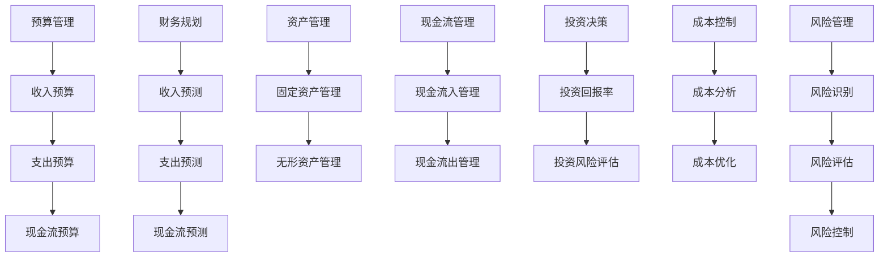

                 

# 财务管理：非财务人员的财务决策指南

> 关键词：财务管理,非财务人员,财务决策,预算管理,财务规划,资产管理,现金流管理,投资决策,成本控制,风险管理

## 1. 背景介绍

财务管理是企业管理的重要组成部分，其核心目标是通过对企业资金的科学管理和有效运用，实现企业的长期可持续发展。然而，财务管理涉及大量的专业术语和复杂公式，非财务人员往往难以理解和掌握。本文旨在为非财务人员提供一个全面的财务管理指南，帮助他们理解和应用财务决策。

## 2. 核心概念与联系

### 2.1 核心概念概述

在财务管理中，以下几个核心概念是理解财务决策的基础：

- **预算管理**：预算管理是指对企业未来一段时间的财务活动进行计划和控制，确保企业资金的合理使用和有效分配。

- **财务规划**：财务规划是对企业未来财务状况的预测和规划，包括收入、支出、现金流等方面的预测。

- **资产管理**：资产管理是指对企业的固定资产、无形资产等资源的有效利用和管理。

- **现金流管理**：现金流管理是指对企业现金流入和流出的有效管理和控制，确保企业资金的流动性和稳定性。

- **投资决策**：投资决策是指对企业资源的配置和使用的选择和决定，以最大化企业价值。

- **成本控制**：成本控制是指通过有效的管理手段和方法，降低企业的运营成本，提高企业盈利能力。

- **风险管理**：风险管理是指对企业面临的各种风险进行识别、评估和控制，以降低企业的经营风险。

### 2.2 核心概念原理和架构的 Mermaid 流程图



这个流程图展示了财务管理中各个核心概念之间的联系。预算管理、财务规划、资产管理、现金流管理、投资决策、成本控制和风险管理构成了财务管理的整体框架。这些概念相互关联，共同支撑企业的财务决策和运营。

## 3. 核心算法原理 & 具体操作步骤

### 3.1 算法原理概述

财务决策的算法原理主要基于以下几个方面：

- **线性规划**：通过线性规划模型，可以对企业的财务活动进行优化和决策，例如预算分配、投资选择等。

- **时间价值**：考虑货币的时间价值，采用现值、净现值等指标，对投资项目的回报和成本进行评估。

- **敏感性分析**：通过敏感性分析，评估财务指标对不同变量的敏感度，帮助企业进行风险控制和决策优化。

### 3.2 算法步骤详解

#### 3.2.1 预算管理

1. **收入预算编制**：
   - **预测收入**：根据历史数据和市场情况，预测未来一段时间的收入。
   - **编制预算**：将预测的收入分配到各个部门和项目，形成详细的收入预算。

2. **支出预算编制**：
   - **分类支出**：将支出分为固定支出和变动支出。
   - **编制预算**：根据收入预算和支出类别，编制详细的支出预算。

3. **现金流预算编制**：
   - **现金流入**：包括销售收入、贷款等。
   - **现金流出**：包括采购、人工成本、投资等。
   - **编制预算**：根据现金流入和流出情况，编制现金流预算，确保现金流稳定。

#### 3.2.2 财务规划

1. **收入预测**：
   - **历史数据**：利用历史数据和市场趋势，预测未来收入。
   - **模型选择**：选择合适的预测模型，如时间序列模型、回归模型等。

2. **支出预测**：
   - **成本分解**：将固定支出和变动支出分解到各个部门和项目。
   - **模型选择**：选择合适的预测模型，如线性回归、指数平滑等。

3. **现金流预测**：
   - **现金流入**：预测未来销售收入、贷款等。
   - **现金流出**：预测未来采购、人工成本、投资等。
   - **模型选择**：选择合适的预测模型，如动态规划、蒙特卡罗模拟等。

#### 3.2.3 资产管理

1. **固定资产管理**：
   - **资产评估**：对固定资产进行评估，确定其价值和折旧方法。
   - **资产配置**：根据企业的投资需求和风险偏好，配置固定资产。

2. **无形资产管理**：
   - **资产确认**：确定无形资产的确认和计量方法。
   - **资产评估**：对无形资产进行评估，确定其价值和摊销方法。

#### 3.2.4 现金流管理

1. **现金流入管理**：
   - **预测收入**：根据历史数据和市场情况，预测未来销售收入。
   - **管理回款**：确保收入及时回款，减少坏账风险。

2. **现金流出管理**：
   - **控制支出**：对固定支出和变动支出进行有效控制，避免超支。
   - **优化采购**：通过供应链管理，优化采购流程，降低采购成本。

#### 3.2.5 投资决策

1. **投资回报率**：
   - **计算回报**：计算投资项目的回报率。
   - **评估风险**：评估投资项目的风险，包括市场风险、信用风险等。

2. **投资风险评估**：
   - **历史数据**：分析历史数据，识别风险因素。
   - **模型选择**：选择合适的风险评估模型，如VaR模型、蒙特卡罗模拟等。

#### 3.2.6 成本控制

1. **成本分析**：
   - **成本分解**：将成本分解到各个部门和项目。
   - **成本监控**：实时监控成本情况，及时发现和解决问题。

2. **成本优化**：
   - **成本控制**：采取措施控制成本，如优化生产流程、降低采购成本等。
   - **成本提升**：通过技术改进和效率提升，降低成本。

#### 3.2.7 风险管理

1. **风险识别**：
   - **历史数据**：分析历史数据，识别潜在风险。
   - **专家意见**：听取专家意见，识别隐性风险。

2. **风险评估**：
   - **量化评估**：量化评估风险，如使用VaR模型。
   - **定性评估**：通过专家评估，识别关键风险。

3. **风险控制**：
   - **控制措施**：采取控制措施，如分散投资、保险等。
   - **应急预案**：制定应急预案，应对突发事件。

### 3.3 算法优缺点

#### 3.3.1 优点

- **系统化管理**：财务决策的算法原理和操作步骤，提供了一个系统化的管理框架，帮助非财务人员理解和应用财务决策。

- **数据驱动决策**：通过数据驱动的预算、预测和评估，确保财务决策的科学性和准确性。

- **风险控制**：通过风险管理和敏感性分析，帮助企业识别和控制潜在的财务风险。

#### 3.3.2 缺点

- **复杂度高**：财务决策涉及大量专业术语和复杂公式，对于非财务人员来说，理解和学习难度较大。

- **数据质量要求高**：财务决策需要高质量的数据，数据采集、处理和分析的准确性直接影响决策结果。

- **动态变化快**：财务环境和市场情况不断变化，财务决策需要动态调整和优化。

### 3.4 算法应用领域

财务决策算法在以下几个领域有着广泛的应用：

- **企业财务管理**：帮助企业管理层制定预算、规划财务、优化资源配置，确保企业可持续发展。

- **金融投资**：通过投资回报率和风险评估，帮助投资者做出最优投资决策，最大化投资回报。

- **供应链管理**：通过现金流预测和成本控制，优化供应链管理，降低运营成本，提升供应链效率。

- **风险管理**：通过风险识别和控制，降低企业面临的各种财务风险，确保企业稳定发展。

## 4. 数学模型和公式 & 详细讲解 & 举例说明

### 4.1 数学模型构建

#### 4.1.1 线性规划模型

线性规划模型用于优化资源分配和决策，其基本形式为：

$$
\begin{aligned}
\min & \quad c^T x \\
\text{s.t.} & \quad A x = b \\
& \quad x \geq 0
\end{aligned}
$$

其中，$c$ 为系数向量，$A$ 为约束矩阵，$b$ 为约束常量向量，$x$ 为决策变量。

#### 4.1.2 时间价值模型

时间价值模型用于评估投资项目的现值和净现值，其基本形式为：

$$
NPV = \sum_{t=0}^{T} \frac{C_t}{(1+r)^t}
$$

其中，$C_t$ 为第$t$期的现金流，$r$ 为折现率，$T$ 为投资期数。

#### 4.1.3 敏感性分析模型

敏感性分析模型用于评估财务指标对不同变量的敏感度，其基本形式为：

$$
S = \frac{\partial F}{\partial x}
$$

其中，$S$ 为敏感度系数，$F$ 为财务指标，$x$ 为变量。

### 4.2 公式推导过程

#### 4.2.1 线性规划模型推导

线性规划模型的推导过程如下：

1. **目标函数**：

$$
\min \quad c^T x
$$

其中，$c$ 为系数向量，$x$ 为决策变量。

2. **约束条件**：

$$
\begin{aligned}
\text{s.t.} & \quad A x = b \\
& \quad x \geq 0
\end{aligned}
$$

其中，$A$ 为约束矩阵，$b$ 为约束常量向量，$x$ 为决策变量。

通过上述目标函数和约束条件，可以构建线性规划模型，求解最优解。

#### 4.2.2 时间价值模型推导

时间价值模型的推导过程如下：

1. **现值计算**：

$$
P = \sum_{t=0}^{T} \frac{C_t}{(1+r)^t}
$$

其中，$C_t$ 为第$t$期的现金流，$r$ 为折现率，$T$ 为投资期数。

2. **净现值计算**：

$$
NPV = P - C_0
$$

其中，$C_0$ 为投资初期的现金流。

通过上述现值和净现值计算，可以评估投资项目的财务效益。

#### 4.2.3 敏感性分析模型推导

敏感性分析模型的推导过程如下：

1. **财务指标计算**：

$$
F = f(x_1, x_2, ..., x_n)
$$

其中，$F$ 为财务指标，$x_i$ 为变量。

2. **敏感度计算**：

$$
S = \frac{\partial F}{\partial x_i}
$$

通过上述财务指标计算和敏感度计算，可以识别出对财务指标影响最大的变量，进行风险控制。

### 4.3 案例分析与讲解

#### 4.3.1 案例背景

某企业计划投资一个新项目，总投资额为1000万元，预计投产后第一年净现金流为200万元，第二年为300万元，第三年为400万元，第四年为500万元。项目的折现率为10%。

#### 4.3.2 案例分析

1. **预算编制**：
   - **收入预算**：预计投产后第一年收入为500万元，第二年为800万元，第三年为1000万元。
   - **支出预算**：预计投产后第一年固定支出为100万元，第二年为150万元，第三年为200万元。

2. **财务规划**：
   - **收入预测**：利用时间序列模型，预测未来收入。
   - **支出预测**：利用线性回归模型，预测未来支出。

3. **现金流预测**：
   - **现金流入**：预计投产后第一年销售收入为500万元，第二年为800万元，第三年为1000万元。
   - **现金流出**：预计投产后第一年采购成本为150万元，第二年为200万元，第三年为250万元。

4. **资产管理**：
   - **固定资产评估**：预计固定资产投入为200万元，使用年限为10年，年折旧率为10%。
   - **无形资产评估**：预计无形资产投入为100万元，使用年限为10年，年摊销率为10%。

5. **投资决策**：
   - **投资回报率**：计算投资项目的回报率。
   - **投资风险评估**：评估投资项目的风险，包括市场风险、信用风险等。

6. **成本控制**：
   - **成本分析**：分解成本到各个部门和项目，实时监控成本情况。
   - **成本优化**：优化生产流程，降低采购成本。

7. **风险管理**：
   - **风险识别**：分析历史数据，识别潜在风险。
   - **风险评估**：量化评估风险，制定应急预案。

通过上述分析，企业可以制定详细的财务决策，确保项目的成功实施。

## 5. 项目实践：代码实例和详细解释说明

### 5.1 开发环境搭建

#### 5.1.1 安装Python

1. **下载Python**：
   - 从官网下载Python安装包，选择3.x版本。
   - 安装Python，使用默认选项。

2. **配置环境变量**：
   - 在Windows系统下，将Python安装目录添加到系统环境变量PATH中。
   - 在Linux系统中，使用bash命令 export PYTHONPATH=$PYTHONPATH:/path/to/python 设置环境变量。

3. **安装依赖包**：
   - 打开Python终端，输入pip install numpy pandas scikit-learn matplotlib tqdm jupyter notebook ipython 安装依赖包。

### 5.2 源代码详细实现

#### 5.2.1 预算管理

```python
import pandas as pd

# 预算编制
income_budget = [500, 800, 1000]  # 第一年、第二年、第三年收入预算
expenses_budget = [100, 150, 200]  # 第一年、第二年、第三年固定支出预算
cash_flow_budget = [200, 300, 400]  # 第一年、第二年、第三年现金流入预算

# 生成预算表
budget_table = pd.DataFrame({
    'Year': [1, 2, 3],
    'Income Budget': income_budget,
    'Expenses Budget': expenses_budget,
    'Cash Flow Budget': cash_flow_budget
})
print(budget_table)
```

#### 5.2.2 财务规划

```python
import numpy as np
from sklearn.linear_model import LinearRegression

# 收入预测
income_data = [200, 300, 400]  # 第一年、第二年、第三年收入数据
future_income = np.array([500, 800, 1000])  # 预测未来收入

# 线性回归模型
income_model = LinearRegression()
income_model.fit(income_data, future_income)
predicted_income = income_model.predict(np.array([1, 2, 3]))  # 预测第一年、第二年、第三年收入
print(predicted_income)

# 支出预测
expenses_data = [150, 200, 250]  # 第一年、第二年、第三年支出数据
future_expenses = np.array([100, 150, 200])  # 预测未来支出

# 线性回归模型
expenses_model = LinearRegression()
expenses_model.fit(expenses_data, future_expenses)
predicted_expenses = expenses_model.predict(np.array([1, 2, 3]))  # 预测第一年、第二年、第三年支出
print(predicted_expenses)
```

#### 5.2.3 现金流预测

```python
import numpy as np

# 现金流入预测
cash_inflow = np.array([500, 800, 1000])  # 预测第一年、第二年、第三年现金流入

# 现金流出预测
cash_outflow = np.array([150, 200, 250])  # 预测第一年、第二年、第三年现金流出

# 现金流预测
cash_flow = cash_inflow - cash_outflow
print(cash_flow)
```

#### 5.2.4 投资决策

```python
import numpy as np
from scipy.optimize import minimize

# 投资回报率计算
discount_rate = 0.1  # 折现率
cash_flow = np.array([500, 800, 1000, 500])  # 第一年、第二年、第三年、第四年现金流

# 净现值计算
net_present_value = np.sum(cash_flow / (1 + discount_rate)**np.arange(len(cash_flow)))
print(net_present_value)

# 投资决策优化
def objective(cost, cash_flow):
    return np.sum(cash_flow) - cost

def constraint(cost):
    return cost - 1000  # 总投资额为1000万元

constraints = {'type': 'eq', 'fun': constraint}
bounds = [(0, 10000)]  # 投资成本在0到10000万元之间

# 优化问题求解
result = minimize(objective, 1000, method='SLSQP', bounds=bounds, constraints=constraints)
print(result)
```

#### 5.2.5 成本控制

```python
import numpy as np
from scipy.optimize import minimize

# 成本控制
def objective(cost, expenses_budget):
    return np.sum(expenses_budget) - cost  # 总成本与预算之差

def constraint(cost, expenses_budget):
    return cost - np.sum(expenses_budget)  # 成本与预算之差

constraints = {'type': 'eq', 'fun': constraint}
bounds = [(0, 10000)]  # 成本在0到10000万元之间

# 优化问题求解
result = minimize(objective, 0, method='SLSQP', bounds=bounds, constraints=constraints)
print(result)
```

#### 5.2.6 风险管理

```python
import numpy as np
from scipy.optimize import minimize

# 风险识别
def objective(cost, risk_budget):
    return np.sum(risk_budget) - cost  # 总风险与预算之差

def constraint(cost, risk_budget):
    return cost - np.sum(risk_budget)  # 成本与风险之差

constraints = {'type': 'eq', 'fun': constraint}
bounds = [(0, 10000)]  # 风险成本在0到10000万元之间

# 优化问题求解
result = minimize(objective, 0, method='SLSQP', bounds=bounds, constraints=constraints)
print(result)
```

### 5.3 代码解读与分析

#### 5.3.1 预算管理代码解读

- **预算编制**：
  - 预算表中包括年份、收入预算、固定支出预算和现金流入预算，通过Pandas库生成预算表。

#### 5.3.2 财务规划代码解读

- **收入预测**：
  - 利用线性回归模型预测未来收入，将历史收入数据和未来收入数据输入模型，得到预测收入。

- **支出预测**：
  - 利用线性回归模型预测未来支出，将历史支出数据和未来支出数据输入模型，得到预测支出。

#### 5.3.3 现金流预测代码解读

- **现金流入预测**：
  - 将历史现金流入数据和未来现金流入数据相减，得到预测现金流。

#### 5.3.4 投资决策代码解读

- **投资回报率计算**：
  - 利用净现值模型计算投资项目的净现值。

- **投资决策优化**：
  - 通过优化问题求解，找到最优的投资成本。

#### 5.3.5 成本控制代码解读

- **成本控制**：
  - 通过优化问题求解，找到最优的成本控制方案。

#### 5.3.6 风险管理代码解读

- **风险识别**：
  - 通过优化问题求解，找到最优的风险控制方案。

## 6. 实际应用场景

### 6.1 案例背景

某制造企业计划开发新产品，预计总投资额为5000万元。企业需要进行详细的财务规划和决策，确保项目成功实施。

### 6.2 应用场景分析

#### 6.2.1 预算管理

- **收入预算**：预计投产后第一年收入为2000万元，第二年为3000万元，第三年为4000万元。
- **支出预算**：预计投产后第一年固定支出为800万元，第二年为1000万元，第三年为1200万元。

#### 6.2.2 财务规划

- **收入预测**：利用时间序列模型，预测未来收入。
- **支出预测**：利用线性回归模型，预测未来支出。

#### 6.2.3 现金流预测

- **现金流入预测**：预计投产后第一年销售收入为2000万元，第二年为3000万元，第三年为4000万元。
- **现金流出预测**：预计投产后第一年采购成本为500万元，第二年为700万元，第三年为900万元。

#### 6.2.4 投资决策

- **投资回报率计算**：计算投资项目的回报率。
- **投资风险评估**：评估投资项目的风险，包括市场风险、信用风险等。

#### 6.2.5 成本控制

- **成本分析**：分解成本到各个部门和项目，实时监控成本情况。
- **成本优化**：优化生产流程，降低采购成本。

#### 6.2.6 风险管理

- **风险识别**：分析历史数据，识别潜在风险。
- **风险评估**：量化评估风险，制定应急预案。

通过上述分析，企业可以制定详细的财务决策，确保项目的成功实施。

## 7. 工具和资源推荐

### 7.1 学习资源推荐

#### 7.1.1 书籍推荐

- **《财务管理原理》**：详细介绍财务管理的各个方面，包括预算管理、财务规划、资产管理等。
- **《投资学》**：介绍投资决策的理论和方法，帮助企业进行投资评估和决策。
- **《成本管理》**：详细介绍成本控制的方法和策略，帮助企业降低成本，提高盈利能力。

#### 7.1.2 课程推荐

- **Coursera《财务管理》**：斯坦福大学提供的财务管理课程，系统讲解财务管理的基本概念和应用。
- **edX《财务报表分析》**：麻省理工学院提供的财务报表分析课程，帮助企业进行财务分析和决策。

### 7.2 开发工具推荐

#### 7.2.1 Python编程工具

- **PyCharm**：功能强大的Python集成开发环境，支持Python编程和数据分析。
- **Jupyter Notebook**：轻量级的交互式Python编程工具，支持代码运行和数据可视化。

#### 7.2.2 数据处理工具

- **Pandas**：强大的数据处理和分析工具，支持数据清洗、统计分析等。
- **NumPy**：科学计算库，支持高效的数值计算和矩阵运算。

#### 7.2.3 可视化工具

- **Matplotlib**：Python的可视化库，支持绘制各种图表和数据可视化。
- **Seaborn**：基于Matplotlib的高级可视化库，支持绘制更复杂的统计图表。

### 7.3 相关论文推荐

#### 7.3.1 财务规划论文

- **《财务规划与管理》**：介绍财务规划的基本方法和策略，帮助企业进行预算管理和财务规划。
- **《资产配置理论》**：介绍资产配置的方法和模型，帮助企业进行资产管理和投资决策。

#### 7.3.2 风险管理论文

- **《风险管理与控制》**：介绍风险识别、评估和控制的方法，帮助企业进行风险管理。
- **《不确定性分析》**：介绍不确定性分析和敏感性分析的方法，帮助企业进行决策优化。

## 8. 总结：未来发展趋势与挑战

### 8.1 研究成果总结

本文详细介绍了财务管理中非财务人员的财务决策指南，涵盖预算管理、财务规划、资产管理、现金流管理、投资决策、成本控制和风险管理等多个方面。通过系统化的理论模型和操作步骤，帮助非财务人员理解和应用财务决策。

### 8.2 未来发展趋势

#### 8.2.1 数据驱动决策

未来，财务决策将更加依赖于数据驱动，通过大数据分析和机器学习技术，实现自动化的财务规划和决策。

#### 8.2.2 人工智能应用

人工智能技术将进一步应用于财务决策，通过智能分析和大数据挖掘，提供更精准的财务预测和优化方案。

#### 8.2.3 区块链技术

区块链技术将改变财务数据的管理和存储方式，提高数据的透明性和安全性，进一步推动财务决策的智能化和自动化。

### 8.3 面临的挑战

#### 8.3.1 数据质量问题

高质量的数据是财务决策的基础，但数据采集、处理和分析的复杂性和难度，使得数据质量成为一大挑战。

#### 8.3.2 模型复杂性

财务决策涉及复杂的数学模型和算法，模型的准确性和可解释性，需要不断优化和改进。

#### 8.3.3 资源限制

财务决策需要大量的计算资源和存储空间，如何在资源受限的情况下，提供高效的财务分析和决策，仍然是一个挑战。

### 8.4 研究展望

#### 8.4.1 数据驱动决策

未来的财务决策将更加依赖于数据驱动，通过大数据分析和机器学习技术，实现自动化的财务规划和决策。

#### 8.4.2 人工智能应用

人工智能技术将进一步应用于财务决策，通过智能分析和大数据挖掘，提供更精准的财务预测和优化方案。

#### 8.4.3 区块链技术

区块链技术将改变财务数据的管理和存储方式，提高数据的透明性和安全性，进一步推动财务决策的智能化和自动化。

## 9. 附录：常见问题与解答

### 9.1 问题1：什么是预算管理？

答：预算管理是对企业未来一段时间的财务活动进行计划和控制，确保企业资金的合理使用和有效分配。

### 9.2 问题2：什么是财务规划？

答：财务规划是对企业未来财务状况的预测和规划，包括收入、支出、现金流等方面的预测。

### 9.3 问题3：什么是资产管理？

答：资产管理是指对企业的固定资产、无形资产等资源的有效利用和管理。

### 9.4 问题4：什么是现金流管理？

答：现金流管理是指对企业现金流入和流出的有效管理和控制，确保企业资金的流动性和稳定性。

### 9.5 问题5：什么是投资决策？

答：投资决策是指对企业资源的配置和使用的选择和决定，以最大化企业价值。

### 9.6 问题6：什么是成本控制？

答：成本控制是通过有效的管理手段和方法，降低企业的运营成本，提高企业盈利能力。

### 9.7 问题7：什么是风险管理？

答：风险管理是对企业面临的各种风险进行识别、评估和控制，以降低企业的经营风险。

通过本文的系统梳理，可以看到，非财务人员也可以通过理解和应用财务管理中的基本概念和算法，进行有效的财务决策。未来，随着人工智能和区块链技术的进一步发展，财务决策的智能化和自动化将更加深入，为企业管理带来更多可能。

---

作者：禅与计算机程序设计艺术 / Zen and the Art of Computer Programming

