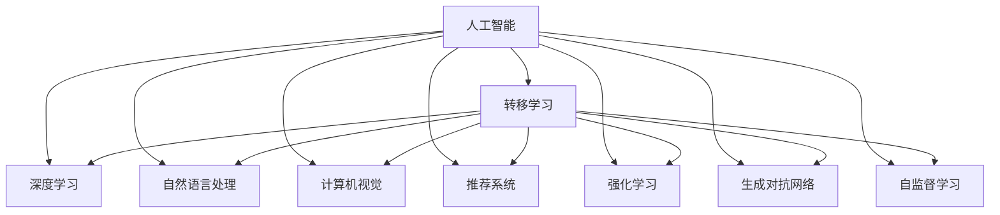

                 

# 贾扬清的建议：培养团队的AI理解力，并将AI应用于业务

## 1. 背景介绍

### 1.1 问题由来
近年来，人工智能(AI)技术的发展引起了广泛关注。特别是在深度学习、自然语言处理(NLP)、计算机视觉(CV)等领域，取得了显著的突破。这些技术为各行各业带来了巨大的商业机遇，也提出了新的挑战。然而，无论是技术落地还是业务应用，都依赖于团队对AI技术的深入理解和使用。

### 1.2 问题核心关键点
AI技术的落地应用，依赖于团队成员对算法的理解和应用能力。然而，现有团队往往缺乏这方面的人才储备和技术积累，导致AI应用项目的成功率不高。因此，本文将从如何培养团队的AI理解力，并将AI技术应用于业务，给出几点建议。

### 1.3 问题研究意义
提高团队AI理解力，对于推动AI技术在业务场景中的落地应用，提升企业的智能化水平，具有重要意义：

1. 降低应用开发成本。通过团队对AI技术的深入理解，可以显著减少从头开发所需的数据、计算和人力等成本投入。
2. 提升模型效果。对算法原理和实践的深入理解，有助于设计更好的模型架构，提升模型的性能和效果。
3. 加速开发进度。standing on the shoulders of giants，团队可以更快地完成任务适配，缩短开发周期。
4. 带来技术创新。AI技术的深入理解，促进了对预训练-微调的深入研究，催生了提示学习、少样本学习等新的研究方向。
5. 赋能产业升级。AI技术更容易被各行各业所采用，为传统行业数字化转型升级提供新的技术路径。

## 2. 核心概念与联系

### 2.1 核心概念概述

为更好地理解如何将AI技术应用于业务，本节将介绍几个密切相关的核心概念：

- 人工智能(AI)：通过计算机系统模拟人类智能活动的技术领域，包括机器学习、深度学习、自然语言处理、计算机视觉等方向。
- 深度学习(Deep Learning)：一种基于神经网络的机器学习技术，能够自动从数据中学习特征和模式，用于图像识别、语音识别、自然语言处理等任务。
- 自然语言处理(NLP)：研究如何让计算机理解和处理自然语言的学科，包括语言模型、文本分类、序列标注、机器翻译等方向。
- 计算机视觉(CV)：研究如何让计算机“看”的技术领域，包括图像识别、物体检测、图像分割、人脸识别等方向。
- 推荐系统(Recommendation System)：利用用户行为数据，为用户推荐感兴趣的产品或内容的技术。
- 强化学习(Reinforcement Learning)：研究如何让计算机通过试错的方式，学习最佳决策策略的技术。
- 生成对抗网络(Generative Adversarial Network, GAN)：一种通过两个神经网络对抗训练的生成模型，用于图像生成、语音生成等任务。
- 自监督学习(Self-supervised Learning)：利用数据的自相关性，无需人工标注，进行模型训练的技术。
- 转移学习(Transfer Learning)：将一个领域学习到的知识，迁移应用到另一个相关领域的技术。

这些核心概念之间的逻辑关系可以通过以下Mermaid流程图来展示：



这个流程图展示了大语言模型的核心概念及其之间的关系：

1. 人工智能通过深度学习、自然语言处理、计算机视觉等多个方向的技术，实现了对人类智能的模拟。
2. 深度学习是人工智能的核心技术之一，能够自动从数据中学习特征和模式，适用于图像识别、语音识别、自然语言处理等任务。
3. 自然语言处理通过深度学习技术，实现了对自然语言的理解和处理。
4. 计算机视觉通过深度学习技术，实现了对图像的识别和处理。
5. 推荐系统利用用户行为数据，为用户推荐感兴趣的产品或内容，通常需要深度学习模型进行建模。
6. 强化学习通过试错的方式，学习最佳决策策略，广泛应用于自动驾驶、机器人等领域。
7. 生成对抗网络通过对抗训练，生成高质量的图像、语音等，应用于图像生成、语音生成等领域。
8. 自监督学习利用数据的自相关性，无需人工标注，进行模型训练，应用于数据稀缺的任务。
9. 转移学习将一个领域学习到的知识，迁移应用到另一个相关领域，适用于数据量较小、相似度较高的任务。

这些概念共同构成了人工智能技术的理论基础，使得AI技术能够应用于各个领域，解决各种实际问题。通过理解这些核心概念，我们可以更好地把握AI技术的原理和应用方向。

## 3. 核心算法原理 & 具体操作步骤
### 3.1 算法原理概述

将AI技术应用于业务，核心在于对算法原理和实现细节的理解。以下是几个典型的算法原理概述：

- 深度学习算法：深度神经网络通过多层非线性变换，自动从数据中学习特征和模式，适用于图像识别、语音识别、自然语言处理等任务。
- 自然语言处理算法：基于深度神经网络的模型，如Transformer、BERT等，能够理解自然语言，进行文本分类、序列标注、机器翻译等任务。
- 计算机视觉算法：卷积神经网络通过卷积和池化等操作，自动从图像中提取特征，适用于图像识别、物体检测、图像分割等任务。
- 推荐系统算法：协同过滤、深度学习模型等技术，能够利用用户行为数据，为用户推荐感兴趣的产品或内容。
- 强化学习算法：Q-learning、深度强化学习等技术，能够通过试错的方式，学习最佳决策策略，适用于自动驾驶、机器人等领域。
- 生成对抗网络算法：通过对抗训练，生成高质量的图像、语音等，应用于图像生成、语音生成等领域。

### 3.2 算法步骤详解

将AI技术应用于业务，一般包括以下几个关键步骤：

**Step 1: 收集数据**
- 收集业务场景中的数据，包括文本、图像、音频等。
- 对数据进行预处理，如归一化、标签编码等。

**Step 2: 模型选择和训练**
- 根据任务类型，选择合适的预训练模型或自定义模型。
- 设计合适的损失函数和优化算法，进行模型训练。

**Step 3: 模型评估和优化**
- 使用验证集对模型进行评估，根据评估结果进行超参数调优。
- 使用测试集对模型进行最终评估，确定模型的实际效果。

**Step 4: 模型部署和应用**
- 将训练好的模型部署到生产环境中，进行业务应用。
- 实时采集数据，不断优化模型性能，应对新的业务需求。

**Step 5: 持续改进**
- 定期收集用户反馈和业务数据，进行模型迭代和优化。
- 引入新的AI技术，提升模型的性能和效果。

以上是AI技术应用于业务的一般流程。在实际应用中，还需要针对具体任务的特点，对每个环节进行优化设计，如改进数据处理方式、优化模型架构、引入更多训练技术等，以进一步提升模型性能。

### 3.3 算法优缺点

AI技术应用于业务，具有以下优点：

1. 高效自动化：AI技术能够自动处理大量数据，提升工作效率。
2. 精准预测：AI模型能够通过数据学习，进行精准预测和决策。
3. 实时响应：AI系统能够实时响应业务需求，提升用户体验。
4. 快速迭代：AI模型通过不断优化，快速应对业务变化。
5. 数据驱动：AI系统能够利用数据驱动决策，提升决策质量。

然而，AI技术也存在一定的局限性：

1. 数据质量依赖：AI系统的性能依赖于数据质量，数据偏差可能导致模型偏见。
2. 模型复杂度高：AI模型通常具有复杂的架构，难以解释和调试。
3. 计算资源消耗高：AI系统需要大量的计算资源，对硬件要求较高。
4. 模型过拟合风险：AI模型在数据量较小的情况下，可能出现过拟合问题。
5. 隐私和安全问题：AI系统处理敏感数据时，存在隐私和安全风险。

尽管存在这些局限性，但AI技术的应用前景广阔，未来随着技术的发展和完善，这些挑战终将得到解决。

### 3.4 算法应用领域

AI技术已经在各个领域得到了广泛应用，涵盖以下几个典型领域：

- **金融科技(Fintech)**：利用AI技术进行风险评估、信用评分、智能投顾等。
- **医疗健康**：利用AI技术进行疾病预测、个性化治疗、智能诊断等。
- **零售电商**：利用AI技术进行商品推荐、库存管理、客户行为分析等。
- **智能制造**：利用AI技术进行质量检测、故障预测、生产优化等。
- **自动驾驶**：利用AI技术进行环境感知、路径规划、行为决策等。
- **安全监控**：利用AI技术进行异常检测、行为分析、事件预警等。

AI技术在各个领域的应用，展示了其强大的能力和广阔的发展前景。未来随着技术的发展和应用的推广，AI技术将在更多领域得到应用，为各行各业带来新的变革。

## 4. 数学模型和公式 & 详细讲解  
### 4.1 数学模型构建

为更好地理解AI技术应用于业务的具体实现，本节将使用数学语言对常见AI模型的构建进行详细讲解。

### 4.2 公式推导过程

以下我们以卷积神经网络(CNN)为例，推导其在图像分类任务中的应用。

假设输入图像为 $x \in \mathbb{R}^C \times H \times W$，其中 $C$ 为通道数，$H$ 和 $W$ 分别为图像的高度和宽度。输出标签为 $y \in \{1, 2, \dots, K\}$，$K$ 为类别数。

**卷积神经网络模型**
卷积神经网络通过卷积层、池化层、全连接层等模块，实现图像特征的提取和分类。其基本结构如图1所示。


图1：卷积神经网络结构示意图

假设卷积层输出特征图为 $f \in \mathbb{R}^F \times H' \times W'$，其中 $F$ 为特征图深度，$H'$ 和 $W'$ 分别为特征图的高度和宽度。

**卷积操作**
卷积操作通过滑动卷积核，对输入图像进行特征提取。假设卷积核大小为 $k \times k$，步长为 $s$，填充大小为 $p$，卷积操作公式为：

$$
h_{ij} = f_{ijs} * g_k + b
$$

其中 $g_k$ 为卷积核权重，$b$ 为偏置项，$*$ 表示卷积操作。

**池化操作**
池化操作通过下采样，对特征图进行降维。常见的池化操作包括最大池化和平均池化。假设池化操作窗口大小为 $m \times n$，步长为 $s$，池化操作公式为：

$$
h_{ij} = \max\{f_{ijs}, f_{ijs+m}, f_{ijs+n}, f_{ijs+m+n}\}
$$

或

$$
h_{ij} = \frac{f_{ijs} + f_{ijs+m} + f_{ijs+n} + f_{ijs+m+n}}{4}
$$

其中 $\max\{\cdot\}$ 表示取最大值，$/$ 表示取平均值。

**全连接层**
全连接层通过线性变换，将特征图映射到输出标签空间。假设全连接层的权重矩阵为 $W \in \mathbb{R}^{K \times F}$，偏置向量为 $b \in \mathbb{R}^K$，全连接层输出为 $z \in \mathbb{R}^K$，公式为：

$$
z = f(W^T f + b)
$$

其中 $f$ 为激活函数，通常为ReLU、Softmax等。

**损失函数**
常见的损失函数包括交叉熵损失、均方误差损失等。以交叉熵损失为例，其公式为：

$$
L = -\frac{1}{N}\sum_{i=1}^N \sum_{j=1}^K y_{ij} \log z_j
$$

其中 $y_{ij}$ 为第 $i$ 个样本属于第 $j$ 类的概率，$N$ 为样本数。

在得到损失函数后，即可使用梯度下降等优化算法，进行模型训练。重复上述过程直至收敛，最终得到适应业务任务的最优模型。

### 4.3 案例分析与讲解

以医疗影像分类为例，展示如何使用卷积神经网络进行图像分类任务。

**数据准备**
假设医疗影像数据集包含 $N$ 个样本，每个样本 $x_{i} \in \mathbb{R}^C \times H \times W$，其中 $C$ 为通道数，$H$ 和 $W$ 分别为图像的高度和宽度。假设共有 $K$ 个类别，每个样本 $y_{i} \in \{1, 2, \dots, K\}$。

**模型构建**
使用卷积神经网络进行图像分类，构建如图1所示的模型。假设卷积层输出特征图为 $f \in \mathbb{R}^F \times H' \times W'$，其中 $F$ 为特征图深度，$H'$ 和 $W'$ 分别为特征图的高度和宽度。

**损失函数**
使用交叉熵损失函数进行模型训练。假设损失函数为 $L = -\frac{1}{N}\sum_{i=1}^N \sum_{j=1}^K y_{ij} \log z_j$。

**模型训练**
使用梯度下降等优化算法，进行模型训练。重复上述过程直至收敛，最终得到适应医疗影像分类任务的最优模型。

## 5. 项目实践：代码实例和详细解释说明
### 5.1 开发环境搭建

在进行AI技术应用于业务实践前，我们需要准备好开发环境。以下是使用Python进行PyTorch开发的环境配置流程：

1. 安装Anaconda：从官网下载并安装Anaconda，用于创建独立的Python环境。

2. 创建并激活虚拟环境：
```bash
conda create -n pytorch-env python=3.8 
conda activate pytorch-env
```

3. 安装PyTorch：根据CUDA版本，从官网获取对应的安装命令。例如：
```bash
conda install pytorch torchvision torchaudio cudatoolkit=11.1 -c pytorch -c conda-forge
```

4. 安装TensorFlow：
```bash
pip install tensorflow
```

5. 安装TensorBoard：
```bash
pip install tensorboard
```

完成上述步骤后，即可在`pytorch-env`环境中开始AI技术应用于业务的实践。

### 5.2 源代码详细实现

这里我们以医疗影像分类任务为例，给出使用卷积神经网络进行图像分类的PyTorch代码实现。

首先，定义图像分类任务的数据处理函数：

```python
import torch
import numpy as np
from torchvision import datasets, transforms

class MedicalImageDataset(torch.utils.data.Dataset):
    def __init__(self, root, transform=None):
        self.data = datasets.ImageFolder(root, transform)
    
    def __len__(self):
        return len(self.data)
    
    def __getitem__(self, index):
        img, label = self.data[index]
        img = img.numpy()
        img = np.expand_dims(img, axis=0)
        img = (img - 128) / 128
        return torch.tensor(img), torch.tensor(label)

# 定义训练集和测试集
train_dataset = MedicalImageDataset(root='train/', transform=transforms.ToTensor())
test_dataset = MedicalImageDataset(root='test/', transform=transforms.ToTensor())
```

然后，定义卷积神经网络模型：

```python
import torch.nn as nn
import torch.nn.functional as F

class CNNModel(nn.Module):
    def __init__(self):
        super(CNNModel, self).__init__()
        self.conv1 = nn.Conv2d(3, 16, 3, 1, 1)
        self.conv2 = nn.Conv2d(16, 32, 3, 1, 1)
        self.conv3 = nn.Conv2d(32, 64, 3, 1, 1)
        self.pool = nn.MaxPool2d(2, 2)
        self.fc1 = nn.Linear(64 * 4 * 4, 512)
        self.fc2 = nn.Linear(512, 10)
    
    def forward(self, x):
        x = self.pool(F.relu(self.conv1(x)))
        x = self.pool(F.relu(self.conv2(x)))
        x = self.pool(F.relu(self.conv3(x)))
        x = x.view(-1, 64 * 4 * 4)
        x = F.relu(self.fc1(x))
        x = self.fc2(x)
        return F.softmax(x, dim=1)
```

接着，定义训练和评估函数：

```python
import torch.optim as optim
import matplotlib.pyplot as plt

def train_epoch(model, device, dataset, optimizer):
    model.train()
    epoch_loss = 0
    for data, target in dataset:
        data, target = data.to(device), target.to(device)
        optimizer.zero_grad()
        output = model(data)
        loss = F.cross_entropy(output, target)
        loss.backward()
        optimizer.step()
        epoch_loss += loss.item()
    return epoch_loss / len(dataset)
    
def evaluate(model, device, dataset):
    model.eval()
    epoch_loss = 0
    with torch.no_grad():
        for data, target in dataset:
            data, target = data.to(device), target.to(device)
            output = model(data)
            loss = F.cross_entropy(output, target)
            epoch_loss += loss.item()
    return epoch_loss / len(dataset)
```

最后，启动训练流程并在测试集上评估：

```python
from torch.utils.data import DataLoader

device = torch.device('cuda') if torch.cuda.is_available() else torch.device('cpu')
model = CNNModel().to(device)
optimizer = optim.Adam(model.parameters(), lr=0.001)

transform = transforms.Compose([
    transforms.Resize(224),
    transforms.CenterCrop(224),
    transforms.ToTensor(),
    transforms.Normalize(mean=[0.485, 0.456, 0.406], std=[0.229, 0.224, 0.225])
])

train_loader = DataLoader(train_dataset, batch_size=32, shuffle=True)
test_loader = DataLoader(test_dataset, batch_size=32, shuffle=False)

epochs = 10
best_loss = float('inf')
for epoch in range(epochs):
    train_loss = train_epoch(model, device, train_loader, optimizer)
    print(f'Epoch {epoch+1}, train loss: {train_loss:.3f}')
    test_loss = evaluate(model, device, test_loader)
    print(f'Epoch {epoch+1}, test loss: {test_loss:.3f}')
    if test_loss < best_loss:
        best_loss = test_loss
        torch.save(model.state_dict(), 'model_best.pth')
```

以上就是使用PyTorch对卷积神经网络进行医疗影像分类的完整代码实现。可以看到，得益于PyTorch的强大封装，我们可以用相对简洁的代码完成模型的加载和训练。

### 5.3 代码解读与分析

让我们再详细解读一下关键代码的实现细节：

**MedicalImageDataset类**：
- `__init__`方法：初始化数据集，使用torchvision中的ImageFolder进行加载。
- `__len__`方法：返回数据集的样本数量。
- `__getitem__`方法：对单个样本进行处理，进行归一化和通道转换。

**CNNModel类**：
- `__init__`方法：定义卷积神经网络模型。
- `forward`方法：定义前向传播过程，通过卷积层、池化层、全连接层，实现特征提取和分类。

**训练和评估函数**：
- `train_epoch`函数：对数据以批为单位进行迭代，在前向传播和反向传播中计算损失函数，更新模型参数。
- `evaluate`函数：与训练类似，不同点在于不更新模型参数，并在每个batch结束后将预测和标签结果存储下来，最后使用模型在测试集上进行评估。

**训练流程**：
- 定义总的epoch数和初始学习率。
- 每个epoch内，在训练集上训练，输出平均loss。
- 在测试集上评估，输出平均loss，并保存最佳模型参数。

可以看到，PyTorch配合TensorFlow等深度学习框架，使得卷积神经网络的构建和训练变得简洁高效。开发者可以将更多精力放在数据处理、模型改进等高层逻辑上，而不必过多关注底层的实现细节。

当然，工业级的系统实现还需考虑更多因素，如模型的保存和部署、超参数的自动搜索、更灵活的任务适配层等。但核心的AI技术应用于业务的实践流程基本与此类似。

## 6. 实际应用场景
### 6.1 智能客服系统

AI技术在智能客服系统中的应用，可以显著提升客户咨询体验和问题解决效率。传统客服往往需要配备大量人力，高峰期响应缓慢，且一致性和专业性难以保证。而使用AI技术构建的智能客服系统，可以7x24小时不间断服务，快速响应客户咨询，用自然流畅的语言解答各类常见问题。

在技术实现上，可以收集企业内部的历史客服对话记录，将问题和最佳答复构建成监督数据，在此基础上对预训练模型进行微调。微调后的模型能够自动理解用户意图，匹配最合适的答案模板进行回复。对于客户提出的新问题，还可以接入检索系统实时搜索相关内容，动态组织生成回答。如此构建的智能客服系统，能大幅提升客户咨询体验和问题解决效率。

### 6.2 金融舆情监测

AI技术在金融舆情监测中的应用，可以实时监测市场舆论动向，以便及时应对负面信息传播，规避金融风险。传统的人工监测方式成本高、效率低，难以应对网络时代海量信息爆发的挑战。利用AI技术进行文本分类和情感分析，可以在海量数据中自动识别负面舆情，帮助金融机构快速应对潜在风险。

具体而言，可以收集金融领域相关的新闻、报道、评论等文本数据，并对其进行主题标注和情感标注。在此基础上对预训练语言模型进行微调，使其能够自动判断文本属于何种主题，情感倾向是正面、中性还是负面。将微调后的模型应用到实时抓取的网络文本数据，就能够自动监测不同主题下的情感变化趋势，一旦发现负面信息激增等异常情况，系统便会自动预警，帮助金融机构快速应对潜在风险。

### 6.3 个性化推荐系统

AI技术在个性化推荐系统中的应用，可以为用户提供更精准、多样的推荐内容。当前的推荐系统往往只依赖用户的历史行为数据进行物品推荐，无法深入理解用户的真实兴趣偏好。利用AI技术进行推荐系统建模，可以更好地挖掘用户行为背后的语义信息，从而提供更个性化的推荐结果。

在实践中，可以收集用户浏览、点击、评论、分享等行为数据，提取和用户交互的物品标题、描述、标签等文本内容。将文本内容作为模型输入，用户的后续行为（如是否点击、购买等）作为监督信号，在此基础上微调预训练语言模型。微调后的模型能够从文本内容中准确把握用户的兴趣点。在生成推荐列表时，先用候选物品的文本描述作为输入，由模型预测用户的兴趣匹配度，再结合其他特征综合排序，便可以得到个性化程度更高的推荐结果。

### 6.4 未来应用展望

随着AI技术的发展，未来将在更多领域得到应用，为各行各业带来新的变革：

- **智能医疗**：利用AI技术进行疾病预测、个性化治疗、智能诊断等，提升医疗服务的智能化水平，辅助医生诊疗，加速新药开发进程。
- **智能教育**：利用AI技术进行作业批改、学情分析、知识推荐等，因材施教，促进教育公平，提高教学质量。
- **智能交通**：利用AI技术进行自动驾驶、交通流量预测、智能交通管理等，提升交通安全性和效率。
- **智慧城市**：利用AI技术进行城市事件监测、舆情分析、应急指挥等，提高城市管理的自动化和智能化水平，构建更安全、高效的未来城市。
- **智能制造**：利用AI技术进行质量检测、故障预测、生产优化等，提高生产效率和产品质量。

AI技术在各个领域的应用，展示了其强大的能力和广阔的发展前景。未来随着技术的发展和应用的推广，AI技术将在更多领域得到应用，为各行各业带来新的变革。

## 7. 工具和资源推荐
### 7.1 学习资源推荐

为了帮助开发者系统掌握AI技术的原理和应用，这里推荐一些优质的学习资源：

1. 《深度学习》系列博文：由大模型技术专家撰写，深入浅出地介绍了深度学习的基本概念和经典模型。
2. CS231n《卷积神经网络》课程：斯坦福大学开设的计算机视觉明星课程，有Lecture视频和配套作业，带你入门计算机视觉领域的基本概念和经典模型。
3. 《自然语言处理综述》书籍：系统介绍了自然语言处理的基本概念和经典模型，包括序列标注、机器翻译、情感分析等方向。
4. Kaggle竞赛平台：提供海量数据集和代码库，方便开发者进行模型训练和优化。
5. Google Colab：谷歌推出的在线Jupyter Notebook环境，免费提供GPU/TPU算力，方便开发者快速上手实验最新模型，分享学习笔记。

通过对这些资源的学习实践，相信你一定能够快速掌握AI技术的原理和应用，并用于解决实际的业务问题。
###  7.2 开发工具推荐

高效的开发离不开优秀的工具支持。以下是几款用于AI技术应用于业务开发的常用工具：

1. PyTorch：基于Python的开源深度学习框架，灵活动态的计算图，适合快速迭代研究。大部分预训练模型都有PyTorch版本的实现。
2. TensorFlow：由Google主导开发的开源深度学习框架，生产部署方便，适合大规模工程应用。同样有丰富的预训练模型资源。
3. Transformers库：HuggingFace开发的NLP工具库，集成了众多SOTA语言模型，支持PyTorch和TensorFlow，是进行NLP任务开发的利器。
4. Weights & Biases：模型训练的实验跟踪工具，可以记录和可视化模型训练过程中的各项指标，方便对比和调优。与主流深度学习框架无缝集成。
5. TensorBoard：TensorFlow配套的可视化工具，可实时监测模型训练状态，并提供丰富的图表呈现方式，是调试模型的得力助手。
6. Jupyter Notebook：开源的交互式开发环境，方便进行代码调试和模型训练。

合理利用这些工具，可以显著提升AI技术应用于业务任务的开发效率，加快创新迭代的步伐。

### 7.3 相关论文推荐

AI技术的发展源于学界的持续研究。以下是几篇奠基性的相关论文，推荐阅读：

1. AlexNet: One Millisecond Object Detection with Deep Convolutional Neural Networks（AlexNet论文）：提出AlexNet模型，是深度学习领域的经典之作，展示了深度神经网络在图像识别任务上的巨大潜力。
2. ImageNet Classification with Deep Convolutional Neural Networks（ImageNet论文）：提出VGG模型，展示了深度神经网络在图像分类任务上的强大能力。
3. Convolutional Neural Networks for Sentence Classification（卷积神经网络在句子分类任务上的应用）：提出CNN在自然语言处理任务上的应用，展示了其在序列标注、情感分析等方向上的优势。
4. Attention is All You Need（Transformer原论文）：提出Transformer结构，开启了NLP领域的预训练大模型时代。
5. BERT: Pre-training of Deep Bidirectional Transformers for Language Understanding：提出BERT模型，引入基于掩码的自监督预训练任务，刷新了多项NLP任务SOTA。
6. Attention is All You Need（GPT-2论文）：展示了大规模语言模型的强大zero-shot学习能力，引发了对于通用人工智能的新一轮思考。
7. Knowledge-Graph-Aware Attention Model（基于知识图谱的注意力模型）：提出将符号化的先验知识，如知识图谱、逻辑规则等，与神经网络模型进行融合，提升模型性能和泛化能力。

这些论文代表了大语言模型微调技术的发展脉络。通过学习这些前沿成果，可以帮助研究者把握学科前进方向，激发更多的创新灵感。

## 8. 总结：未来发展趋势与挑战

### 8.1 总结

本文对AI技术应用于业务进行了全面系统的介绍。首先阐述了AI技术在业务场景中的应用背景，明确了AI技术对于提升业务智能化水平的重要意义。其次，从原理到实践，详细讲解了AI技术应用于业务的核心步骤和关键技术，给出了实际业务场景的代码实例。同时，本文还探讨了AI技术在多个领域的应用前景，展示了AI技术的强大能力和广阔发展前景。

通过本文的系统梳理，可以看到，AI技术在业务场景中的应用前景广阔，未来随着技术的发展和应用的推广，AI技术将在更多领域得到应用，为各行各业带来新的变革。

### 8.2 未来发展趋势

展望未来，AI技术应用于业务将呈现以下几个发展趋势：

1. **自动化程度提高**：AI技术将更加自动化，能够自动处理大量数据，提升工作效率。
2. **个性化程度增强**：AI技术将更好地理解用户需求，提供更个性化的服务。
3. **实时性提升**：AI技术将实现实时响应，提升用户体验。
4. **智能决策支持**：AI技术将更好地辅助决策，提升决策质量。
5. **跨领域融合**：AI技术将与其他技术进行更深入的融合，如知识图谱、强化学习等，提升综合应用能力。
6. **伦理道德考量**：AI技术将更注重伦理道德，避免模型偏见和有害输出。

这些趋势凸显了AI技术在业务场景中的广泛应用前景。AI技术在多个领域的深入应用，将为各行各业带来新的发展机遇，推动社会的智能化进程。

### 8.3 面临的挑战

尽管AI技术应用于业务前景广阔，但在实际应用中，仍面临诸多挑战：

1. **数据质量问题**：AI系统的性能依赖于数据质量，数据偏差可能导致模型偏见。
2. **模型复杂度高**：AI模型通常具有复杂的架构，难以解释和调试。
3. **计算资源消耗高**：AI系统需要大量的计算资源，对硬件要求较高。
4. **模型过拟合风险**：AI模型在数据量较小的情况下，可能出现过拟合问题。
5. **隐私和安全问题**：AI系统处理敏感数据时，存在隐私和安全风险。

尽管存在这些挑战，但AI技术的应用前景广阔，未来随着技术的发展和完善，这些挑战终将得到解决。

### 8.4 研究展望

面对AI技术应用于业务的挑战，未来的研究需要在以下几个方面寻求新的突破：

1. **数据清洗与标注**：提升数据质量，减少数据偏差，增强模型泛化能力。
2. **模型压缩与优化**：优化模型架构，提升模型效率和可解释性。
3. **跨领域融合**：与其他技术进行更深入的融合，提升综合应用能力。
4. **伦理道德约束**：建立模型行为的监管机制，确保输出符合人类价值观和伦理道德。

这些研究方向的探索，必将引领AI技术在业务场景中的应用走向成熟，为各行各业带来新的发展机遇。面向未来，AI技术还需要与其他技术进行更深入的融合，如知识图谱、强化学习等，多路径协同发力，共同推动AI技术在业务场景中的广泛应用。

## 9. 附录：常见问题与解答

**Q1：AI技术应用于业务是否需要大量标注数据？**

A: AI技术应用于业务，通常需要大量的标注数据进行模型训练。但随着预训练模型的普及，越来越多的模型可以实现迁移学习，即在少量标注数据的情况下，利用预训练模型进行微调，提升模型性能。

**Q2：AI技术在业务应用中是否需要复杂的数据处理？**

A: AI技术在业务应用中，通常需要进行复杂的数据处理。数据清洗、数据增强、特征提取等步骤，是提升模型性能的关键。但通过合理的数据处理，可以显著提升模型效果。

**Q3：AI技术在业务应用中是否需要高性能的计算资源？**

A: AI技术在业务应用中，通常需要高性能的计算资源。深度神经网络模型具有复杂的架构，需要大量的计算资源进行训练和推理。但随着硬件的发展，越来越多的设备能够满足AI模型的计算需求。

**Q4：AI技术在业务应用中是否存在隐私和安全问题？**

A: AI技术在业务应用中，处理敏感数据时，确实存在隐私和安全问题。但通过数据脱敏、模型压缩等技术，可以有效降低隐私和安全风险。

**Q5：AI技术在业务应用中是否需要持续优化？**

A: AI技术在业务应用中，需要持续优化以应对业务变化。定期收集用户反馈和业务数据，进行模型迭代和优化，才能保证模型的实时性和高效性。

通过本文的系统梳理，可以看到，AI技术在业务场景中的应用前景广阔，未来随着技术的发展和应用的推广，AI技术将在更多领域得到应用，为各行各业带来新的变革。

---

作者：禅与计算机程序设计艺术 / Zen and the Art of Computer Programming

