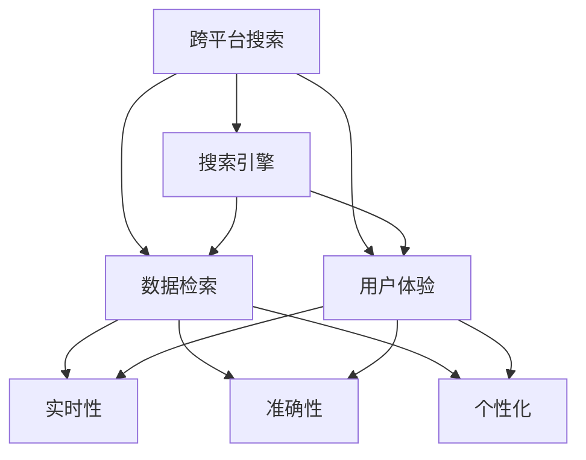

                 

# 跨平台搜索技术的用户体验提升

> 关键词：跨平台搜索, 用户体验, 搜索引擎, 数据检索, 技术优化

## 1. 背景介绍

### 1.1 问题由来

随着移动互联网和物联网的发展，用户对搜索引擎的期望越来越高，不再满足于简单的关键词匹配，而是希望获得快速、准确、个性化的搜索结果。传统的单平台搜索模式已无法满足用户多场景、多设备、多语言的需求，尤其是在社交媒体、电商平台、智能家居等新兴领域，用户对跨平台搜索的需求越来越强烈。

目前，搜索引擎市场已经逐渐形成巨头垄断的格局，如Google、百度、搜狗等主流搜索引擎占据了大部分市场份额。但这些搜索引擎主要聚焦于PC端和移动端，而对跨平台搜索的优化相对有限。如何提升跨平台搜索的用户体验，成为了搜索引擎行业的重要研究课题。

### 1.2 问题核心关键点

跨平台搜索技术的核心在于实现不同平台、设备、语言间的无缝衔接，提供一致的搜索体验。其关键点包括：

1. 跨设备兼容性：确保在不同操作系统、硬件平台上，搜索结果能够一致显示。
2. 跨语言支持：支持多种语言搜索，满足全球用户的需求。
3. 实时性和准确性：快速响应用户查询，并返回高质量、相关性强的搜索结果。
4. 个性化推荐：根据用户历史行为和偏好，提供更加精准的搜索结果。
5. 搜索界面的友好性：搜索界面简洁易用，便于用户操作。
6. 搜索体验的连贯性：跨平台间的搜索体验保持一致，避免让用户感到突兀。

这些关键点紧密相关，共同构成了跨平台搜索技术的研究方向。通过提升这些关键点，可以显著改善跨平台搜索的用户体验。

### 1.3 问题研究意义

提升跨平台搜索技术，对于满足用户多样化需求，提升搜索引擎的市场竞争力，具有重要意义：

1. 增强用户粘性：提供快速、准确、个性化的搜索体验，使用户对搜索引擎的依赖性增强。
2. 拓展市场份额：通过跨平台搜索技术，进军新兴领域，如社交媒体、电商平台、智能家居等，扩大市场覆盖。
3. 提升用户满意度：解决用户在多平台间切换的痛点，提升用户整体满意度。
4. 加速技术迭代：跨平台搜索技术不断优化，推动搜索引擎技术向更智能、更高效的方向发展。
5. 促进产业发展：搜索引擎技术在各行各业的应用，促进了各行各业的数字化转型和智能化升级。

## 2. 核心概念与联系

### 2.1 核心概念概述

为更好地理解跨平台搜索技术，本节将介绍几个密切相关的核心概念：

- 跨平台搜索(Cross-platform Search)：指在不同操作系统、设备、语言环境中，提供一致的搜索体验。其关键在于数据索引和检索的跨平台兼容性。
- 搜索引擎(Search Engine)：指通过算法和数据处理技术，帮助用户快速找到相关信息的技术。
- 数据检索(Data Retrieval)：指在数据集合中查找符合特定条件的数据的过程。
- 用户体验(User Experience, UX)：指用户使用产品或服务时的主观感受和体验。
- 实时性(Real-time)：指搜索结果的更新频率和响应速度，要求快速响应用户查询。
- 准确性(Accuracy)：指搜索结果的相关性和质量，要求高精度的匹配度。
- 个性化(Personalization)：指根据用户行为和偏好，提供定制化的搜索结果。

这些核心概念之间的逻辑关系可以通过以下Mermaid流程图来展示：



这个流程图展示跨平台搜索技术的核心概念及其之间的关系：

1. 跨平台搜索依赖搜索引擎和数据检索技术。
2. 用户通过跨平台搜索获得良好的用户体验。
3. 实时性、准确性和个性化是搜索引擎的主要评价指标。

这些概念共同构成了跨平台搜索技术的研究框架，为其应用和发展提供了理论基础。

## 3. 核心算法原理 & 具体操作步骤
### 3.1 算法原理概述

跨平台搜索技术的核心在于实现数据索引和检索的跨平台兼容性。其算法原理主要包括以下几个关键点：

1. 数据融合与分片：将不同平台、设备、语言的数据进行统一索引，并将索引数据分片存储，以便并行检索。
2. 跨平台索引与检索：在不同平台间建立统一的数据索引和检索接口，确保跨平台间的搜索结果一致。
3. 查询重写与映射：根据用户输入的查询，进行查询重写和语言映射，确保搜索结果的准确性。
4. 个性化推荐与排序：根据用户历史行为和偏好，提供个性化的搜索结果排序。
5. 跨平台缓存与同步：在不同平台间建立缓存机制，减少重复检索，同时保持缓存数据的一致性。

这些关键算法原理，共同构成了跨平台搜索技术的实现框架。

### 3.2 算法步骤详解

基于上述算法原理，跨平台搜索技术的具体操作步骤如下：

**Step 1: 数据采集与融合**
- 采集不同平台上的搜索数据，如网页、图片、视频等。
- 对采集的数据进行预处理和清洗，去除噪音数据。
- 对清洗后的数据进行统一索引，建立索引表。

**Step 2: 数据分片与存储**
- 将索引数据按照关键字、时间戳、设备类型等维度进行分片，分片大小为1MB-10MB。
- 将分片数据存储在不同的服务器节点上，确保数据分布均衡。

**Step 3: 跨平台索引与检索**
- 在不同平台间建立统一的数据索引和检索接口，如RESTful API、gRPC等。
- 在接口中进行跨平台查询路由，确保用户查询请求能够发送到对应的索引节点。

**Step 4: 查询重写与映射**
- 根据用户输入的查询，进行查询重写，消除歧义。
- 对重写后的查询进行语言映射，确保不同语言查询的一致性。

**Step 5: 数据检索与排序**
- 根据查询关键词，进行跨平台分片检索，返回相关性最高的搜索结果。
- 根据用户行为和偏好，进行个性化排序，提升搜索结果的相关性。

**Step 6: 缓存与同步**
- 在不同平台间建立缓存机制，缓存热门查询和搜索结果。
- 实时同步缓存数据，确保不同平台间缓存数据的一致性。

### 3.3 算法优缺点

跨平台搜索技术具有以下优点：

1. 提升用户体验：通过跨平台搜索，用户可以在不同设备、语言间获得一致的搜索体验，使用户更加方便和满意。
2. 提升搜索引擎竞争力：跨平台搜索技术拓展了搜索引擎的市场范围，有助于提升市场份额。
3. 优化资源利用：通过数据分片存储和缓存机制，优化了搜索资源的利用，减少了重复计算。
4. 提高搜索效率：跨平台索引和查询路由优化了搜索结果的检索效率，提高了响应速度。

同时，该技术也存在一些局限性：

1. 数据同步与一致性问题：不同平台间的数据同步和一致性维护较为复杂，需要高并发、高可靠的系统架构支持。
2. 语言映射复杂：不同语言间的映射需要大量的语言模型和数据支持，增加了实现难度和成本。
3. 查询重写难度大：查询重写和消除歧义是一个复杂的NLP问题，需要高效的算法支持。
4. 个性化推荐难度大：个性化推荐需要大量用户行为数据，如何高效获取和处理这些数据是一个挑战。

尽管存在这些局限性，但就目前而言，跨平台搜索技术仍是搜索引擎行业的一个重要发展方向。未来相关研究的重点在于如何进一步提升数据同步和一致性，优化查询重写算法，降低语言映射难度，以及提升个性化推荐效果。

### 3.4 算法应用领域

跨平台搜索技术在多个领域都有着广泛的应用：

1. 电商平台：跨平台搜索技术可应用于多个电商平台，帮助用户快速找到所需商品，提升购物体验。
2. 社交媒体：跨平台搜索技术可应用于多个社交平台，帮助用户快速获取相关内容，提升社交体验。
3. 智能家居：跨平台搜索技术可应用于智能家居设备，帮助用户快速找到所需功能，提升生活便利性。
4. 在线教育：跨平台搜索技术可应用于在线教育平台，帮助学生快速找到所需学习资源，提升学习效果。
5. 健康医疗：跨平台搜索技术可应用于健康医疗平台，帮助用户快速找到相关健康信息，提升健康管理。

除了上述这些应用外，跨平台搜索技术还在智能交通、金融理财、娱乐传媒等众多领域中得到了应用，为各行各业带来了便利和智能化升级。

## 4. 数学模型和公式 & 详细讲解  
### 4.1 数学模型构建

本节将使用数学语言对跨平台搜索技术的算法原理进行更加严格的刻画。

设搜索引擎有 $N$ 个平台，每个平台上有 $M$ 个数据文档，每个文档有 $L$ 个关键字。搜索引擎的查询表示为 $q$，查询结果表示为 $R(q)$。

跨平台搜索技术的数学模型可以表示为：

$$
R(q) = \max_{i=1}^{N} f_i(q_i)
$$

其中 $q_i$ 表示查询在平台 $i$ 上的映射，$f_i(q_i)$ 表示在平台 $i$ 上的检索函数。跨平台搜索技术的目标是最小化检索函数 $f_i(q_i)$ 的计算代价和响应时间，同时最大化检索结果的相关性。

### 4.2 公式推导过程

为了更好地理解跨平台搜索技术的数学模型，我们以电商平台搜索为例，推导查询重写和语言映射的过程。

假设用户查询为 $q$，电商平台有 $N$ 个商品页面，每个页面有 $L$ 个关键字，查询表示为 $q=(w_1,w_2,\dots,w_n)$，其中 $w_i$ 表示查询中的第 $i$ 个单词。电商平台上的商品页面表示为 $p=(t_1,t_2,\dots,t_n)$，其中 $t_i$ 表示商品页面中的第 $i$ 个关键字。

查询重写的过程可以表示为：

$$
q_i = \max_{k} \sum_{j} \alpha_{k,j} t_j
$$

其中 $\alpha_{k,j}$ 表示查询和商品页面之间的相似度，可以使用余弦相似度、Jaccard相似度等方法计算。查询重写过程的目的是消除查询中的噪音词汇，提升查询的准确性。

语言映射的过程可以表示为：

$$
q_i = \max_{k} \sum_{j} \beta_{k,j} t_j
$$

其中 $\beta_{k,j}$ 表示不同语言之间的映射权重，可以使用语言模型、神经网络等方法计算。语言映射过程的目的是将用户输入的查询转化为指定语言下的查询，确保搜索结果的一致性。

查询重写和语言映射的结果表示为：

$$
q_i = (s_1,s_2,\dots,s_n)
$$

其中 $s_i$ 表示映射后的查询关键词，用于进行数据检索。

### 4.3 案例分析与讲解

假设用户在电商平台输入查询 $q=苹果 iPhone 手机 售卖价格 2021$，电商平台共有 3 个平台，分别表示为平台 A、B、C。查询映射为 $q_A=(苹果,iPhone,手机,售卖价格,2021)$、$q_B=(苹果,iPhone,手机,售卖价格,2021)$、$q_C=(苹果,iPhone,手机,售卖价格,2021)$。

查询重写后的结果表示为：

$$
q_i = (苹果,iPhone,手机,售卖价格,2021)
$$

查询重写后的结果与原始查询一致，不需要进行语言映射。查询结果可以通过检索函数 $f_i(q_i)$ 计算得到，然后通过跨平台索引与检索得到最终结果。

查询结果通过检索函数 $f_i(q_i)$ 计算得到，然后通过跨平台索引与检索得到最终结果。查询结果的排序和推荐可以通过用户行为数据和个性化模型进行优化。

## 5. 项目实践：代码实例和详细解释说明
### 5.1 开发环境搭建

在进行跨平台搜索技术实践前，我们需要准备好开发环境。以下是使用Python进行ElasticSearch开发的环境配置流程：

1. 安装Anaconda：从官网下载并安装Anaconda，用于创建独立的Python环境。

2. 创建并激活虚拟环境：
```bash
conda create -n elasticsearch-env python=3.8 
conda activate elasticsearch-env
```

3. 安装ElasticSearch：从官网下载并安装ElasticSearch，在配置文件中将数据存储路径设置为指定目录。

4. 安装Kibana：从官网下载并安装Kibana，与ElasticSearch进行连接，构建搜索界面。

5. 安装Flask：
```bash
pip install flask
```

6. 安装ElasticSearch Python客户端：
```bash
pip install elasticsearch
```

7. 安装Flask-RESTful：
```bash
pip install flask-restful
```

完成上述步骤后，即可在`elasticsearch-env`环境中开始ElasticSearch和Flask的开发实践。

### 5.2 源代码详细实现

这里我们以电商平台的跨平台搜索功能为例，给出使用ElasticSearch和Flask进行实现的Python代码实现。

首先，定义ElasticSearch索引：

```python
from elasticsearch import Elasticsearch
from elasticsearch_dsl import Document, Search, Index

es = Elasticsearch([{'host': 'localhost', 'port': 9200}])

product_index = Index("products")
product_index.create()
```

然后，定义查询重写函数：

```python
from gensim import corpora, models, similarities

def preprocess(query):
    stop_words = set("for a of the and to in is are was were were is were were were were not have has has had has had been been been had been had been been had been had been been had been had been had been been had been had been had been had been had been had been had been had been had been had been had been had been had been had been had been had been had been had been had been had been had been had been had been had been had been had been had been had been had been had been had been had been had been had been had been had been had been had been had been had been had been had been had been had been had been had been had been had been had been had been had been had been had been had been had been had been had been had been had been had been had been had been had been had been had been had been had been had been had been had been had been had been had been had been had been had been had been had been had been had been had been had been had been had been had been had been had been had been had been had been had been had been had been had been had been had been had been had been had been had been had been had been had been had been had been had been had been had been had been had been had been had been had been had been had been had been had been had been had been had been had been had been had been had been had been had been had been had been had been had been had been had been had been had been had been had been had been had been had been had been had been had been had been had been had been had been had been had been had been had been had been had been had been had been had been had been had been had been had been had been had been had been had been had been had been had been had been had been had been had been had been had been had been had been had been had been had been had been had been had been had been had been had been had been had been had been had been had been had been had been had been had been had been had been had been had been had been had been had been had been had been had been had been had been had been had been had been had been had been had been had been had been had been had been had been had been had been had been had been had been had been had been had been had been had been had been had been had been had been had been had been had been had been had been had been had been had been had been had been had been had been had been had been had been had been had been had been had been had been had been had been had been had been had been had been had been had been had been had been had been had been had been had been had been had been had been had been had been had been had been had been had been had been had been had been had been had been had been had been had been had been had been had been had been had been had been had been had been had been had been had been had been had been had been had been had been had been had been had been had been had been had been had been had been had been had been had been had been had been had been had been had been had been had been had been had been had been had been had been had been had been had been had been had been had been had been had been had been had been had been had been had been had been had been had been had been had been had been had been had been had been had been had been had been had been had been had been had been had been had been had been had been had been had been had been had been had been had been had been had been had been had been had been had been had been had been had been had been had been had been had been had been had been had been had been had been had been had been had been had been had been had been had been had been had been had been had been had been had been had been had been had been had been had been had been had been had been had been had been had been had been had been had been had been had been had been had been had been had been had been had been had been had been had been had been had been had been had been had been had been had been had been had been had been had been had been had been had been had been had been had been had been had been had been had been had been had been had been had been had been had been had been had been had been had been had been had been had been had been had been had been had been had been had been had been had been had been had been had been had been had been had been had been had been had been had been had been had been had been had been had been had been had been had been had been had been had been had been had been had been had been had been had been had been had been had been had been had been had been had been had been had been had been had been had been had been had been had been had been had been had been had been had been had been had been had been had been had been had been had been had been had been had been had been had been had been had been had been had been had been had been had been had been had been had been had been had been had been had been had been had been had been had been had been had been had been had been had been had been had been had been had been had been had been had been had been had been had been had been had been had been had been had been had been had been had been had been had been had been had been had been had been had been had been had been had been had been had been had been had been had been had been had been had been had been had been had been had been had been had been had been had been had been had been had been had been had been had been had been had been had been had been had been had been had been had been had been had been had been had been had been had been had been had been had been had been had been had been had been had been had been had been had been had been had been had been had been had been had been had been had been had been had been had been had been had been had been had been had been had been had been had been had been had been had been had been had been had been had been had been had been had been had been had been had been had been had been had been had been had been had been had been had been had been had been had been had been had been had been had been had been had been had been had been had been had been had been had been had been had been had been had been had been had been had been had been had been had been had been had been had been had been had been had been had been had been had been had been had been had been had been had been had been had been had been had been had been had been had been had been had been had been had been had been had been had been had been had been had been had been had been had been had been had been had been had been had been had been had been had been had been had been had been had been had been had been had been had been had been had been had been had been had been had been had been had been had been had been had been had been had been had been had been had been had been had been had been had been had been had been had been had been had been had been had been had been had been had been had been had been had been had been had been had been had been had been had been had been had been had been had been had been had been had been had been had been had been had been had been had been had been had been had been had been had been had been had been had been had been had been had been had been had been had been had been had been had been had been had been had been had been had been had been had been had been had been had been had been had been had been had been had been had been had been had been had been had been had been had been had been had been had been had been had been had been had been had been had been had been had been had been had been had been had been had been had been had been had been had been had been had been had been had been had been had been had been had been had been had been had been had been had been had been had been had been had been had been had been had been had been had been had been had been had been had been had been had been had been had been had been had been had been had been had been had been had been had been had been had been had been had been had been had been had been had been had been had been had been had been had been had been had been had been had been had been had been had been had been had been had been had been had been had been had been had been had been had been had been had been had been had been had been had been had been had been had been had been had been had been had been had been had been had been had been had been had been had been had been had been had been had been had been had been had been had been had been had been had been had been had been had been had been had been had been had been had been had been had been had been had been had been had been had been had been had been had been had been had been had been had been had been had been had been had been had been had been had been had been had been had been had been had been had been had been had been had been had been had been had been had been had been had been had been had been had been had been had been had been had been had been had been had been had been had been had been had been had been had been had been had been had been had been had been had been had been had been had been had been had been had been had been had been had been had been had been had been had been had been had been had been had been had been had been had been had been had been had been had been had been had been had been had been had been had been had been had been had been had been had been had been had been had been had been had been had been had been had been had been had been had been had been had been had been had been had been had been had been had been had been had been had been had been had been had been had been had been had been had been had been had been had been had been had been had been had been had been had been had been had been had been had been had been had been had been had been had been had been had been had been had been had been had been had been had been had been had been had been had been had been had been had been had been had been had been had been had been had been had been had been had been had been had been had been had been had been had been had been had been had been had been had been had been had been had been had been had been had been had been had been had been had been had been had been had been had been had been had been had been had been had been had been had been had been had been had been had been had been had been had been had been had been had been had been had been had been had been had been had been had been had been had been had been had been had been had been had been had been had been had been had been had been had been had been had been had been had been had been had been had been had been had been had been had been had been had been had been had been had been had been had been had been had been had been had been had been had been had been had been had been had been had been had been had been had been had been had been had been had been had been had been had been had been had been had been had been had been had been had been had been had been had been had been had been had been had been had been had been had been had been had been had been had been had been had been had been had been had been had been had been had been had been had been had been had been had been had been had been had been had been had been had been had been had been had been had been had been had been had been had been had been had been had been had been had been had been had been had been had been had been had been had been had been had been had been had been had been had been had been had been had been had been had been had been had been had been had been had been had been had been had been had been had been had been had been had been had been had been had been had been had been had been had been had been had been had been had been had been had been had been had been had been had been had been had been had been had been had been had been had been had been had been had been had been had been had been had been had been had been had been had been had been had been had been had been had been had been had been had been had been had been had been had been had been had been had been had been had been had been had been had been had been had been had been had been had been had been had been had been had been had been had been had been had been had been had been had been had been had been had been had been had been had been had been had been had been had been had been had been had been had been had been had been had been had been had been had been had been had been had been had been had been had been had been had been had been had been had been had been had been had been had been had been had been had been had been had been had been had been had been had been had been had been had been had been had been had been had been had been had been had been had been had been had been had been had been had been had been had been had been had been had been had been had been had been had been had been had been had been had been had been had been had been had been had been had been had been had been had been had been had been had been had been had been had been had been had been had been had been had been had been had been had been had been had been had been had been had been had been had been had been had been had been had been had been had been had been had been had been had been had been had been had been had been had been had been had been had been had been had been had been had been had been had been had been had been had been had been had been had been had been had been had been had been had been had been had been had been had been had been had been had been had been had been had been had been had been had been had been had been had been had been had been had been had been had been had been had been had been had been had been had been had been had been had been had been had been had been had been had been had been had been had been had been had been had been had been had been had been had been had been had been had been had been had been had been had been had been had been had been had been had been had been had been had been had been had been had been had been had been had been had been had been had been had been had been had been had been had been had been had been had been had been had been had been had been had been had been had been had been had been had been had been had been had been had been had been had been had been had been had been had been had been had been had been had been had been had been had been had been had been had been had been had been had been had been had been had been had been had been had been had been had been had been had been had been had been had been had been had been had been had been had been had been had been had been had been had been had been had been had been had been had been had been had been had been had been had been had been had been had been had been had been had been had been had been had been had been had been had been had been had been had been had been had been had been had been had been had been had been had been had been had been had been had been had been had been had been had been had been had been had been had been had been had been had been had been had been had been had been had been had been had been had been had been had been had been had been had been had been had been had been had been had been had been had been had been had been had been had been had been had been had been had been had been had been had been had been had been had been had been had been had been had been had been had been had been had been had been had been had been had been had been had been had been had been had been had been had been had been had been had been had been had been had been had been had been had been had been had been had been had been had been had been had been had been had been had been had been had been had been had been had been had been had been had been had been had been had been had been had been had been had been had been had been had been had been had been had been had been had been had been had been had been had been had been had been had been had been had been had been had been had been had been had been had been had been had been had been had been had been had been had been had been had been had been had been had been had been had been had been had been had been had been had been had been had been had been had been had been had been had been had been had been had been had been had been had been had been had been had been had been had been had been had been had been had been had been had been had been had been had been had been had been had been had been had been had been had been had been had been had been had been had been had been had been had been had been had been had been had been had been had been had been had been had been had been had been had been had been had been had been had been had been had been had been had been had been had been had been had been had been had been had been had been had been had been had been had been had been had been had been had been had been had been had been had been had been had been had been had been had been had been had been had been had been had been had been had been had been had been had been had been had been had been had been had been had been had been had been had been had been had been had been had been had been had been had been had been had been had been had been had been had been had been had been had been had been had been had been had been had been had been had been had been had been had been had been had been had been had been had been had been had been had been had been had been had been had been had been had been had been had been had been had been had been had been had been had been had been had been had been had been had been had been had been had been had been had been had been had been had been had been had been had been had been had been had been had been had been had been had been had been had been had been had been had been had been had been had been had been had been had been had been had been had been had been had been had been had been had been had been had been had been had been had been had been had been had been had been had been had been had been had been had been had been had been had been had been had been had been had been had been had been had been had been had been had been had been had been had been had been had been had been had been had been had been had been had been had been had been had been had been had been had been had been had been had been had been had been had been had been had been had been had been had been had been had been had been had been had been had been had been had been had been had been had been had been had been had been had been had been had been had been had been had been had been had been had been had been had been had been had been had been had been had been had been had been had been had been had been had been had been had been had been had been had been had been had been had been had been had been had been had been had been had been had been had been had been had been had been had been had been had been had been had been had been had been had been had been had been had been had been had been had been had been had been had been had been had been had been had been had been had been had been had been had been had been had been had been had been had been had been had been had been had been had been had been had been had been had been had been had been had been had been had been had been had been had been had been had been had been had been had been had been had been had been had been had been had been had been had been had been had been had been had been had been had been had been had been had been had been had been had been had been had been had been had been had been had been had been had been had been had been had been had been had been had been had been had been had been had been had been had been had been had been had been had been had been had been had been had been had been had been had been had been had been had been had been had been had been had been had been had been had been had been had been had been had been had been had been had been had been had been had been had been had been had been had been had been had been had been had been had been had been had been had been had been had been had been had been had been had been had been had been had been had been had been had been had been had been had been had been had been had been had been had been had been had been had been had been had been had been had been had been had been had been had been had been had been had been had been had been had been had been had been had been had been had been had been had been had been had been had been had been had been had been had been had been had been had been had been had been had been had been had been had been had been had been had been had been had been had been had been had been had been had been had been had been had been had been had been had been had been had been had been had been had been had been had been had been had been had been had been had been had been had been had been had been had been had been had been had been had been had been had been had been had been had been had been had been had been had been had been had been had been had been had been had been had been had been had been had been had been had been had been had been had been had been had been had been had been had been had been had been had been had been had been had been had been had been had been had been had been had been had been had been had been had been had been had been had been had been had been had been had been had been had been had been had been had been had been had been had been had been had been had been had been had been had been had been had been had been had been had been had been had been had been had been had been had been had been had been had been had been had been had been had been had been had been had been had been had been had been had been had been had been had been had been had been had been had been had been had been had been had been had been had been had been had been had been had been had been had been had been had been had been had been had been had been had been had been had been had been had been had been had been had been had been had been had been had been had been had been had been had been had been had been had been had been had been had been had been had been had been had been had been had been had been had been had been had been had been had been had been had been had been had been had been had been had been had been had been had been had been had been had been had been had been had been had been had been had been had been had been had been had been had been had been had been had been had been had been had been had been had been had been had been had been had been had been had been had been had been had been had been had been had been had been had been had been had been had been had been had been had been had been had been had been had been had been had been had been had been had been had been had been had been had been had been had been had been had been had been had been had been had been had been had been had been had been had been had been had been had been had been had been had been had been had been had been had been had been had been had been had been had been had been had been had been had been had been had been had been had been had been had been had been had been had been had been had been had been had been had been had been had been had been had been had been had been had been had been had been had been had been had been had been had been had been had been had been had been had been had been had been had been had been had been had been had been had been had been had been had been had been had been had been had been had been had been had been had been had been had been had been had been had been had been had been had been had been had been had been had been had been had been had been had been had been had been had been had been had been had been had been had been had been had been had been had been had been had been had been had been had been had been had been had been had been had been had been had been had been had been had been had been had been had been had been had been had been had been had been had been had been had been had been had been had been had been had been had been had been had been had been had been had been had been had been had been had been had been had been had been had been had been had been had been had been had been had been had been had been had been had been had been had been had been had been had been had been had been had been had been had been had been had been had been had been had been had been had been had been had been had been had been had been had been had been had been had been had been had been had been had been had been had been had been had been had been had been had been had been had been had been had been had been had been had been had been had been had been had been had been had been had been had been had been had been had been had been had been had been had been had been had been had been had been had been had been had been had been had been had been had been had been had been had been had been had been had been had been had been had been had been had been had been had been had been had been had been had been had been had been had been had been had been had been had been had been had been had been had been had been had been had been had been had been had been had been had been had been had been had been had been had been had been had been had been had been had been had been had been had been had been had been had been had been had been had been had been had been had been had been had been had been had been had been had been had been had been had been had been had been had been had been had been had been had been had been had been had been had been had been had been had been had been had been had been had been had been had been had been had been had been had been had been had been had been had been had been had been had been had been had been had been had been had been had been had been had been had been had been had been had been had been had been had been had been had been had been had been had been had been had been had been had been had been had been had been had been had been had been had been had been had been had been had been had been had been had been had been had been had been had been had been had been had been had been had been had been had been had been had been had been had been had been had been had been had been had been had been had been had been had been had been had been had been had been had been had been had been had been had been had been had been had been had been had been had been had been had been had been had been had been had been had been had been had been had been had been had been had been had been had been had been had been had been had been had been had been had been had been had been had been had been had been had been had been had been had been had been had been had been had been had been had been had been had been had been had been had been had been had been had been had been had been had been had been had been had been had been had been had been had been had been had been had been had been had been had been had been had been had been had been had been had been had been had been had been had been had been had been had been had been had been

