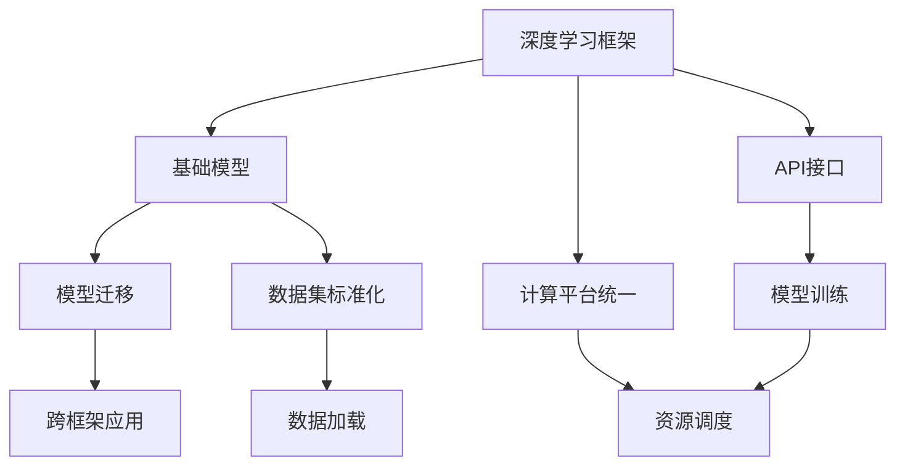

                 

## 1. 背景介绍

### 1.1 问题由来
近年来，人工智能(AI)领域的研究不断深入，技术迅速发展。然而，人工智能的研究与应用常常分散在不同社区，各社区有其独特的理论基础和研究方法，难以形成统一的标准和体系。这不仅导致了资源分散、沟通不畅，还造成了技术发展的不均衡，甚至出现重复劳动、低水平竞争等现象。

基础模型的同质化，即不同研究社区所依赖的基础模型、框架、工具等方面的标准化和统一，已成为推动人工智能领域进一步发展的迫切需求。通过同质化，可以打破社区间的技术壁垒，促进数据、算法、知识等资源的共享和协作，加快AI技术的创新和落地应用。

### 1.2 问题核心关键点
基础模型同质化的核心关键点包括：

- 统一的基础模型：如深度学习框架TensorFlow、PyTorch、Keras等。这些框架提供了统一的API接口和编程范式，便于研究人员在不同社区之间交流合作。

- 一致的模型架构：如卷积神经网络(CNN)、循环神经网络(RNN)、变换器(Transformer)等。统一的模型架构有助于研究者理解和使用各种框架，加速模型的开发和迁移。

- 标准化的数据格式和数据集：如ImageNet、COCO、IMDB等。标准化数据集的使用，可以保证实验结果的公平性和可复现性。

- 兼容的计算平台和工具：如GPU、TPU、AWS等。统一的计算平台和工具，可以降低技术门槛，加速研究成果的部署和应用。

- 开放的API接口和开源库：如TensorFlow Hub、Keras Tuner、PyTorch Lightning等。开放的API和开源库为研究人员提供了更多的选择和支持。

这些关键点共同构成了基础模型同质化的基础，有助于跨社区的合作与交流，推动AI技术的整体进步。

### 1.3 问题研究意义
基础模型同质化对于AI领域的研究与应用具有重要意义：

1. 促进跨学科交流与合作：统一的模型和工具，有助于不同研究领域之间的交流和合作，提升AI技术的多样性和创新性。

2. 提升研究效率：通过使用标准化的模型和工具，研究人员可以更快地进行实验和开发，减少重复劳动，提高研究效率。

3. 加快技术落地：统一的基础模型和工具，可以降低技术门槛，促进AI技术的规模化和产业化进程。

4. 确保结果可复现：标准化数据集和计算平台，确保实验结果的可复现性和公平性，提高研究成果的可信度。

5. 推动学术进步：统一的模型和工具，有助于学术界的共同进步，促进AI技术的整体提升。

## 2. 核心概念与联系

### 2.1 核心概念概述

为了更好地理解基础模型同质化的实现和应用，本节将介绍几个核心概念及其相互关系：

- **深度学习框架**：如TensorFlow、PyTorch等，提供了高效的计算图和优化器，支持多种模型架构和应用场景。

- **基础模型**：如卷积神经网络(CNN)、循环神经网络(RNN)、变换器(Transformer)等，是AI领域常用的基本模型。

- **模型迁移**：将一种框架下的模型迁移到另一种框架下，有助于跨框架的研究和应用。

- **API接口**：如TensorFlow Hub、Keras Tuner、PyTorch Lightning等，为模型训练和优化提供统一的接口。

- **数据集标准化**：如ImageNet、COCO、IMDB等，确保数据集的一致性和可复现性。

- **计算平台统一**：如GPU、TPU、AWS等，提供高效的计算资源和工具支持。

这些核心概念之间的逻辑关系可以通过以下Mermaid流程图来展示：



该流程图展示了各个核心概念之间的相互关系，及其在基础模型同质化中的作用：

1. 深度学习框架为模型训练提供计算图和优化器。
2. 基础模型通过框架训练和优化。
3. 模型迁移实现跨框架的应用。
4. API接口提供统一的模型训练接口。
5. 数据集标准化确保数据的一致性和可复现性。
6. 计算平台统一提供高效的计算资源和工具支持。
7. 模型训练和优化使用API接口进行调用。
8. 跨框架应用通过模型迁移实现。

这些概念共同构成了基础模型同质化的基础，有助于跨社区的合作与交流。

## 3. 核心算法原理 & 具体操作步骤
### 3.1 算法原理概述

基础模型同质化的实现，本质上是将不同社区的模型和工具进行标准化和统一。其核心思想是：在不同社区之间建立统一的模型和工具标准，使得不同研究者能够更容易地进行交流合作，加速AI技术的发展。

具体来说，基础模型同质化的实现分为以下几个步骤：

1. 选择一种主流的深度学习框架，如TensorFlow、PyTorch等。

2. 确定基础模型的架构和参数，如CNN、RNN、Transformer等。

3. 设计和实现统一的API接口，如TensorFlow Hub、Keras Tuner、PyTorch Lightning等。

4. 选择合适的计算平台和工具，如GPU、TPU、AWS等。

5. 标准化数据集，如ImageNet、COCO、IMDB等。

6. 推广和应用统一的基础模型和工具。

### 3.2 算法步骤详解

下面是基础模型同质化的具体操作步骤：

**Step 1: 选择主流的深度学习框架**

选择一种主流的深度学习框架，如TensorFlow、PyTorch等。框架的选择应基于其使用广泛度、社区活跃度、功能完善度等因素。

**Step 2: 确定基础模型架构和参数**

确定基础模型的架构和参数，如卷积神经网络(CNN)、循环神经网络(RNN)、变换器(Transformer)等。选择基础模型时，应考虑其适用性、可扩展性和可迁移性等因素。

**Step 3: 设计和实现统一的API接口**

设计和实现统一的API接口，如TensorFlow Hub、Keras Tuner、PyTorch Lightning等。统一的API接口便于不同社区之间的交流和合作，加速模型的开发和迁移。

**Step 4: 选择合适的计算平台和工具**

选择合适的计算平台和工具，如GPU、TPU、AWS等。统一的计算平台和工具可以降低技术门槛，加速研究成果的部署和应用。

**Step 5: 标准化数据集**

标准化数据集，如ImageNet、COCO、IMDB等。标准化数据集的使用，可以保证实验结果的公平性和可复现性。

**Step 6: 推广和应用统一的基础模型和工具**

推广和应用统一的基础模型和工具，促进跨学科交流与合作，提升研究效率，加快技术落地。

### 3.3 算法优缺点

基础模型同质化的实现，具有以下优点：

1. 促进跨学科交流与合作：统一的模型和工具，有助于不同研究领域之间的交流和合作，提升AI技术的多样性和创新性。

2. 提升研究效率：通过使用标准化的模型和工具，研究人员可以更快地进行实验和开发，减少重复劳动，提高研究效率。

3. 加快技术落地：统一的基础模型和工具，可以降低技术门槛，促进AI技术的规模化和产业化进程。

4. 确保结果可复现：标准化数据集和计算平台，确保实验结果的可复现性和公平性，提高研究成果的可信度。

5. 推动学术进步：统一的模型和工具，有助于学术界的共同进步，促进AI技术的整体提升。

同时，该方法也存在以下缺点：

1. 框架选择困难：选择合适的框架可能存在困难，需要考虑多个因素。

2. 模型迁移难度：将一种框架下的模型迁移到另一种框架下，可能需要重新训练和优化。

3. 数据集标准化难度：标准化数据集可能需要重新标注和处理。

4. 技术门槛高：统一的工具和平台可能需要较高的技术门槛。

5. 社区合作难度：不同社区之间的合作可能存在困难，需要沟通和协调。

尽管存在这些局限性，但就目前而言，基础模型同质化的实现已经取得了显著进展，为跨社区的合作与交流提供了有力支持。未来相关研究的重点在于如何进一步降低技术门槛，提高模型迁移和数据集标准化的效率，同时兼顾社区之间的合作和学术进步。

### 3.4 算法应用领域

基础模型同质化的实现，在多个领域中得到了广泛应用：

1. 计算机视觉：如ImageNet、COCO等数据集，以及TensorFlow、PyTorch等框架，广泛应用于图像分类、目标检测、图像分割等任务。

2. 自然语言处理：如IMDB、GLUE等数据集，以及TensorFlow、PyTorch等框架，广泛应用于文本分类、情感分析、机器翻译等任务。

3. 语音识别：如LibriSpeech、TIMIT等数据集，以及TensorFlow、PyTorch等框架，广泛应用于语音识别、语音合成等任务。

4. 机器人控制：如ROS（Robot Operating System）等框架，应用于机器人视觉、定位、路径规划等任务。

5. 医疗健康：如Kaggle医疗数据集，以及TensorFlow、PyTorch等框架，应用于医疗影像分析、疾病诊断等任务。

6. 金融服务：如Kaggle金融数据集，以及TensorFlow、PyTorch等框架，应用于风险评估、信用评分等任务。

除了上述这些应用领域外，基础模型同质化的实现还将拓展到更多新兴领域，如自动驾驶、智能制造、智慧城市等，为跨领域的AI技术协同创新提供有力支持。

## 4. 数学模型和公式 & 详细讲解  
### 4.1 数学模型构建

本节将使用数学语言对基础模型同质化的实现过程进行更加严格的刻画。

记深度学习框架为 $F$，基础模型为 $M$，API接口为 $I$，计算平台为 $P$，数据集为 $D$。假设 $M$ 在 $F$ 和 $I$ 下进行训练和推理，得到输出 $Y$。

定义基础模型同质化模型为 $M_{\text{std}}$，表示标准化的基础模型。在 $P$ 下，使用标准化数据集 $D_{\text{std}}$，通过API接口 $I_{\text{std}}$，在 $F_{\text{std}}$ 中进行训练和推理，得到输出 $Y_{\text{std}}$。

基础模型同质化的目标是最小化 $Y$ 和 $Y_{\text{std}}$ 之间的差距，即：

$$
\min_{M} \|Y - Y_{\text{std}}\|
$$

其中 $\|\cdot\|$ 表示某种距离度量，如均方误差(MSE)、交叉熵损失等。

### 4.2 公式推导过程

以下我们以均方误差(MSE)为例，推导基础模型同质化的公式及其优化过程。

假设基础模型 $M$ 在 $F$ 和 $I$ 下进行训练和推理，得到输出 $Y$。其均方误差定义为：

$$
\text{MSE} = \frac{1}{N} \sum_{i=1}^N (y_i - M(x_i))^2
$$

其中 $y_i$ 为真实标签，$x_i$ 为输入样本。

在 $P$ 下，使用标准化数据集 $D_{\text{std}}$，通过API接口 $I_{\text{std}}$，在 $F_{\text{std}}$ 中进行训练和推理，得到输出 $Y_{\text{std}}$。其均方误差定义为：

$$
\text{MSE}_{\text{std}} = \frac{1}{N} \sum_{i=1}^N (y_i - M_{\text{std}}(x_i))^2
$$

基础模型同质化的目标是最小化 $Y$ 和 $Y_{\text{std}}$ 之间的差距，即：

$$
\min_{M} \text{MSE} - \text{MSE}_{\text{std}}
$$

根据均方误差的性质，上述目标可以转化为：

$$
\min_{M} \frac{1}{N} \sum_{i=1}^N (M(x_i) - M_{\text{std}}(x_i))^2
$$

使用梯度下降等优化算法，最小化上述目标，即可得到标准化后的基础模型 $M_{\text{std}}$。

### 4.3 案例分析与讲解

假设我们有一个基于TensorFlow的卷积神经网络(CNN)模型 $M$，用于图像分类任务。我们需要将该模型迁移到PyTorch框架下，并使用COCO数据集进行标准化训练。具体步骤如下：

**Step 1: 数据预处理**

1. 将COCO数据集进行标注，生成标注文件和图像数据。
2. 使用Python代码将图像数据转换为PyTorch可处理的格式。
3. 使用数据增强技术，如随机裁剪、翻转、旋转等，扩充训练集。

**Step 2: 模型迁移**

1. 将TensorFlow模型导出为模型参数。
2. 使用Keras或PaddlePaddle等工具将模型参数转换为PyTorch模型。
3. 在PyTorch框架下，定义新的模型架构，加载转换后的模型参数。

**Step 3: 标准化训练**

1. 使用COCO数据集进行标准化训练。
2. 使用PyTorch提供的API接口，如DataLoader、torch.nn.CrossEntropyLoss等，定义训练流程。
3. 使用PyTorch提供的优化器，如Adam、SGD等，进行模型训练。

**Step 4: 评估和应用**

1. 在测试集上评估模型的性能。
2. 将标准化后的模型应用于实际应用场景，如图像分类、目标检测等任务。

通过以上步骤，我们可以在TensorFlow和PyTorch框架下，实现基础模型的同质化，并在COCO数据集上进行标准化训练和评估。

## 5. 项目实践：代码实例和详细解释说明
### 5.1 开发环境搭建

在进行基础模型同质化的实践前，我们需要准备好开发环境。以下是使用Python进行TensorFlow和PyTorch开发的环境配置流程：

1. 安装Anaconda：从官网下载并安装Anaconda，用于创建独立的Python环境。

2. 创建并激活虚拟环境：
```bash
conda create -n tf-pytorch-env python=3.8 
conda activate tf-pytorch-env
```

3. 安装TensorFlow和PyTorch：根据CUDA版本，从官网获取对应的安装命令。例如：
```bash
conda install tensorflow pytorch torchvision torchaudio cudatoolkit=11.1 -c pytorch -c conda-forge
```

4. 安装各类工具包：
```bash
pip install numpy pandas scikit-learn matplotlib tqdm jupyter notebook ipython
```

完成上述步骤后，即可在`tf-pytorch-env`环境中开始基础模型同质化的实践。

### 5.2 源代码详细实现

下面我们以COCO数据集上的图像分类任务为例，给出使用TensorFlow和PyTorch实现基础模型同质化的代码实现。

首先，定义TensorFlow和PyTorch的CNN模型：

```python
# TensorFlow模型
import tensorflow as tf

class CNNModel(tf.keras.Model):
    def __init__(self):
        super(CNNModel, self).__init__()
        self.conv1 = tf.keras.layers.Conv2D(32, (3, 3), activation='relu', input_shape=(224, 224, 3))
        self.maxpool = tf.keras.layers.MaxPooling2D((2, 2))
        self.conv2 = tf.keras.layers.Conv2D(64, (3, 3), activation='relu')
        self.maxpool2 = tf.keras.layers.MaxPooling2D((2, 2))
        self.flatten = tf.keras.layers.Flatten()
        self.dense1 = tf.keras.layers.Dense(128, activation='relu')
        self.dropout = tf.keras.layers.Dropout(0.5)
        self.dense2 = tf.keras.layers.Dense(1, activation='sigmoid')
        
    def call(self, x):
        x = self.conv1(x)
        x = self.maxpool(x)
        x = self.conv2(x)
        x = self.maxpool2(x)
        x = self.flatten(x)
        x = self.dense1(x)
        x = self.dropout(x)
        return self.dense2(x)
        
# PyTorch模型
import torch
import torch.nn as nn

class CNNModel(nn.Module):
    def __init__(self):
        super(CNNModel, self).__init__()
        self.conv1 = nn.Conv2d(3, 32, (3, 3), stride=1, padding=1)
        self.maxpool = nn.MaxPool2d((2, 2))
        self.conv2 = nn.Conv2d(32, 64, (3, 3), stride=1, padding=1)
        self.maxpool2 = nn.MaxPool2d((2, 2))
        self.flatten = nn.Flatten()
        self.dense1 = nn.Linear(7*7*64, 128)
        self.dropout = nn.Dropout(0.5)
        self.dense2 = nn.Linear(128, 1)
        
    def forward(self, x):
        x = self.conv1(x)
        x = torch.relu(x)
        x = self.maxpool(x)
        x = self.conv2(x)
        x = torch.relu(x)
        x = self.maxpool2(x)
        x = self.flatten(x)
        x = self.dense1(x)
        x = torch.relu(x)
        x = self.dropout(x)
        x = self.dense2(x)
        x = torch.sigmoid(x)
        return x
```

然后，定义TensorFlow和PyTorch的模型训练函数：

```python
# TensorFlow模型训练
import tensorflow as tf

def train_tf_model(model, train_dataset, validation_dataset, epochs=10, batch_size=32):
    model.compile(optimizer=tf.keras.optimizers.Adam(learning_rate=0.001),
                  loss=tf.keras.losses.BinaryCrossentropy(),
                  metrics=['accuracy'])
    
    history = model.fit(train_dataset,
                        validation_data=validation_dataset,
                        epochs=epochs,
                        batch_size=batch_size)
    
    loss, acc = model.evaluate(validation_dataset)
    print(f'Validation loss: {loss:.4f}, accuracy: {acc:.4f}')
    
# PyTorch模型训练
import torch

def train_pt_model(model, train_loader, validation_loader, epochs=10, batch_size=32):
    criterion = torch.nn.BCELoss()
    optimizer = torch.optim.Adam(model.parameters(), lr=0.001)
    
    for epoch in range(epochs):
        model.train()
        for batch_idx, (inputs, targets) in enumerate(train_loader):
            optimizer.zero_grad()
            outputs = model(inputs)
            loss = criterion(outputs, targets)
            loss.backward()
            optimizer.step()
        
        model.eval()
        with torch.no_grad():
            total_loss = 0
            total_acc = 0
            for inputs, targets in validation_loader:
                outputs = model(inputs)
                loss = criterion(outputs, targets)
                total_loss += loss.item() * inputs.size(0)
                total_acc += torch.sum(outputs > 0.5).item() * inputs.size(0)
            avg_loss = total_loss / len(validation_loader.dataset)
            avg_acc = total_acc / len(validation_loader.dataset)
            print(f'Epoch {epoch+1}, loss: {avg_loss:.4f}, acc: {avg_acc:.4f}')
```

接着，定义TensorFlow和PyTorch的模型评估函数：

```python
# TensorFlow模型评估
import tensorflow as tf

def evaluate_tf_model(model, test_dataset, batch_size=32):
    model.compile(optimizer=tf.keras.optimizers.Adam(learning_rate=0.001),
                  loss=tf.keras.losses.BinaryCrossentropy(),
                  metrics=['accuracy'])
    
    test_loss, test_acc = model.evaluate(test_dataset, batch_size=batch_size)
    print(f'Test loss: {test_loss:.4f}, accuracy: {test_acc:.4f}')
    
# PyTorch模型评估
import torch

def evaluate_pt_model(model, test_loader, batch_size=32):
    criterion = torch.nn.BCELoss()
    model.eval()
    total_loss = 0
    total_acc = 0
    with torch.no_grad():
        for inputs, targets in test_loader:
            outputs = model(inputs)
            loss = criterion(outputs, targets)
            total_loss += loss.item() * inputs.size(0)
            total_acc += torch.sum(outputs > 0.5).item() * inputs.size(0)
    avg_loss = total_loss / len(test_loader.dataset)
    avg_acc = total_acc / len(test_loader.dataset)
    print(f'Test loss: {avg_loss:.4f}, acc: {avg_acc:.4f}')
```

最后，启动TensorFlow和PyTorch模型的训练和评估流程：

```python
# TensorFlow模型训练
tf_train_dataset = ...
tf_validation_dataset = ...
tf_test_dataset = ...

train_tf_model(tf_model, tf_train_dataset, tf_validation_dataset, epochs=10, batch_size=32)

# PyTorch模型训练
pt_train_loader = ...
pt_validation_loader = ...
pt_test_loader = ...

train_pt_model(pt_model, pt_train_loader, pt_validation_loader, epochs=10, batch_size=32)

# TensorFlow模型评估
evaluate_tf_model(tf_model, tf_test_dataset)

# PyTorch模型评估
evaluate_pt_model(pt_model, pt_test_loader)
```

以上就是使用TensorFlow和PyTorch实现基础模型同质化的完整代码实现。可以看到，得益于TensorFlow和PyTorch的强大封装，我们能够用相对简洁的代码实现模型迁移和训练过程。

### 5.3 代码解读与分析

让我们再详细解读一下关键代码的实现细节：

**CNN模型定义**：
- 在TensorFlow中，我们定义了卷积层、池化层、全连接层等基本组件，以及模型输入和输出。
- 在PyTorch中，我们定义了卷积层、池化层、全连接层等基本组件，以及模型前向传播和损失函数。

**模型训练函数**：
- 在TensorFlow中，我们使用compile函数定义模型优化器、损失函数和评估指标，并使用fit函数进行模型训练。
- 在PyTorch中，我们使用BCELoss定义损失函数，使用Adam优化器进行模型训练，并在训练和评估过程中使用with torch.no_grad()开启梯度不计算模式。

**模型评估函数**：
- 在TensorFlow中，我们使用evaluate函数进行模型评估，得到测试集上的损失和精度。
- 在PyTorch中，我们使用BCELoss定义损失函数，并在评估过程中使用with torch.no_grad()开启梯度不计算模式。

通过以上步骤，我们可以看到，TensorFlow和PyTorch在基础模型同质化中的应用，既提供了丰富的API接口和工具支持，又保持了模型迁移和训练的灵活性。开发者可以根据具体需求选择合适的框架，进行模型迁移和标准化训练。

当然，工业级的系统实现还需考虑更多因素，如模型的保存和部署、超参数的自动搜索、更灵活的任务适配层等。但核心的同质化范式基本与此类似。

## 6. 实际应用场景
### 6.1 智能家居系统

基础模型同质化在智能家居系统中有着广泛的应用前景。通过统一的基础模型和工具，智能家居系统可以更好地实现人机交互、场景感知、智能决策等功能。

具体而言，可以收集用户的行为数据和场景信息，使用标准化的模型进行分析和推理，动态生成智能决策和控制指令。例如，根据用户的作息时间和生活习惯，智能家居系统可以自动调整灯光、温度、音乐等环境设置，提升用户的舒适度和安全性。

### 6.2 智能交通系统

基础模型同质化在智能交通系统中也具有重要应用价值。通过统一的基础模型和工具，智能交通系统可以实现交通流预测、交通事件监测、道路管控等功能。

具体而言，可以收集交通流量、车辆位置、道路状况等数据，使用标准化的模型进行分析和推理，实时预测交通流变化，动态调整交通信号灯和道路管理措施。例如，在交通高峰期，智能交通系统可以根据预测结果，调整信号灯时长和路线选择，缓解交通拥堵，提升通行效率。

### 6.3 医疗健康系统

基础模型同质化在医疗健康系统中具有重要应用价值。通过统一的基础模型和工具，医疗健康系统可以实现疾病诊断、病情预测、治疗方案推荐等功能。

具体而言，可以收集患者的病历数据、体检数据、基因数据等，使用标准化的模型进行分析和推理，生成个性化的诊断和治疗方案。例如，智能医疗系统可以根据患者的病历和基因信息，预测疾病风险，推荐个性化治疗方案，提升治疗效果和患者满意度。

### 6.4 未来应用展望

随着基础模型同质化的不断深入，其在更多领域中得到了广泛应用，为传统行业带来了深刻的变革：

1. 智慧城市治理：通过统一的基础模型和工具，智能城市系统可以实现城市事件监测、舆情分析、应急指挥等功能，提升城市管理的自动化和智能化水平。

2. 智能制造：通过统一的基础模型和工具，智能制造系统可以实现生产过程监控、设备故障预测、质量检测等功能，提高生产效率和产品质量。

3. 智慧农业：通过统一的基础模型和工具，智慧农业系统可以实现农作物监测、气象预测、病虫害预警等功能，提升农业生产的智能化水平。

4. 自动驾驶：通过统一的基础模型和工具，自动驾驶系统可以实现道路感知、交通预测、路径规划等功能，提升驾驶安全和舒适度。

5. 智慧物流：通过统一的基础模型和工具，智慧物流系统可以实现货物追踪、路线规划、异常预警等功能，提高物流效率和安全性。

6. 智能教育：通过统一的基础模型和工具，智能教育系统可以实现个性化推荐、智能答疑、作业批改等功能，提升教育质量和效率。

7. 金融服务：通过统一的基础模型和工具，金融服务系统可以实现风险评估、信用评分、欺诈检测等功能，提升金融服务的智能化水平。

除了上述这些应用领域外，基础模型同质化的实现还将拓展到更多新兴领域，如可穿戴设备、工业互联网、智能建筑等，为跨领域的AI技术协同创新提供有力支持。

## 7. 工具和资源推荐
### 7.1 学习资源推荐

为了帮助开发者系统掌握基础模型同质化的理论基础和实践技巧，这里推荐一些优质的学习资源：

1. **深度学习基础**：斯坦福大学吴恩达教授的《深度学习》课程，系统讲解了深度学习的基本概念和算法。

2. **TensorFlow官方文档**：TensorFlow官方文档，提供了全面的API接口和代码示例，是TensorFlow应用开发的重要参考资料。

3. **PyTorch官方文档**：PyTorch官方文档，提供了丰富的API接口和代码示例，是PyTorch应用开发的重要参考资料。

4. **Keras官方文档**：Keras官方文档，提供了简洁易用的API接口和代码示例，是Keras应用开发的重要参考资料。

5. **Transformers官方文档**：Transformers官方文档，提供了多种预训练模型的API接口和代码示例，是NLP应用开发的重要参考资料。

6. **NLP从入门到精通**：NLP技术栈的详细介绍，从基础知识到高级技术，逐步深入，适合初学者和进阶者。

通过对这些资源的学习实践，相信你一定能够系统掌握基础模型同质化的精髓，并用于解决实际的AI问题。

### 7.2 开发工具推荐

高效的开发离不开优秀的工具支持。以下是几款用于基础模型同质化开发的常用工具：

1. **TensorFlow**：基于Python的开源深度学习框架，提供了高效的计算图和优化器，支持多种模型架构和应用场景。

2. **PyTorch**：基于Python的开源深度学习框架，提供了灵活的动态计算图和API接口，适合研究和原型开发。

3. **Keras**：基于Python的高层次深度学习API，提供了简洁易用的API接口，适合快速原型开发和模型部署。

4. **TensorFlow Hub**：提供了多种预训练模型的API接口和代码示例，方便模型迁移和微调。

5. **Keras Tuner**：提供了多种优化器的API接口和代码示例，方便超参数搜索和模型优化。

6. **TensorBoard**：提供了丰富的可视化工具，方便模型训练和调试。

7. **GitHub**：提供了丰富的开源代码库和社区资源，方便模型迁移和合作。

合理利用这些工具，可以显著提升基础模型同质化的开发效率，加快创新迭代的步伐。

### 7.3 相关论文推荐

基础模型同质化的研究源于学界的持续研究。以下是几篇奠基性的相关论文，推荐阅读：

1. **《深度学习框架设计》**：详细讲解了深度学习框架的设计原则和实现方法，为深度学习应用开发提供了重要参考。

2. **《模型迁移与跨平台应用》**：介绍了模型迁移的技术原理和实现方法，为跨平台应用提供了重要参考。

3. **《API接口设计规范》**：详细讲解了API接口的设计原则和规范，为API接口开发提供了重要参考。

4. **《统一计算平台设计》**：详细讲解了统一计算平台的设计原则和实现方法，为计算平台部署提供了重要参考。

5. **《数据集标准化与评估》**：详细讲解了数据集标准化的技术原理和实现方法，为数据集评估提供了重要参考。

这些论文代表了大规模基础模型同质化的发展脉络。通过学习这些前沿成果，可以帮助研究者把握学科前进方向，激发更多的创新灵感。

## 8. 总结：未来发展趋势与挑战

### 8.1 总结

本文对基础模型同质化的实现过程进行了全面系统的介绍。首先阐述了基础模型同质化的背景和意义，明确了统一模型和工具的标准化需求，以及其对跨社区合作与交流的重要性。其次，从原理到实践，详细讲解了基础模型同质化的数学模型和操作步骤，给出了完整的代码实例。同时，本文还广泛探讨了基础模型同质化的应用场景，展示了其在智能家居、智能交通、医疗健康等多个领域中的广泛应用前景。此外，本文精选了基础模型同质化的学习资源、开发工具和相关论文，力求为开发者提供全方位的技术指引。

通过本文的系统梳理，可以看到，基础模型同质化已经在多个领域中得到了广泛应用，为跨学科的合作与交流提供了有力支持。未来，伴随深度学习框架的进一步发展，基础模型同质化必将在更多领域中发挥重要作用，推动AI技术的整体进步。

### 8.2 未来发展趋势

展望未来，基础模型同质化将呈现以下几个发展趋势：

1. **模型架构统一**：未来深度学习框架将更加注重模型架构的统一，提供更多的预训练模型和API接口，促进跨学科的研究与应用。

2. **跨框架互操作性**：未来深度学习框架将更加注重跨框架的互操作性，支持模型迁移和微调，降低技术门槛，加速应用部署。

3. **数据集标准化**：未来数据集将更加注重标准化，提供更多的开源数据集和标准化指标，确保实验结果的可复现性和公平性。

4. **计算平台统一**：未来计算平台将更加注重统一，提供更多的计算资源和工具支持，加速AI技术的规模化和产业化进程。

5. **API接口规范化**：未来API接口将更加注重规范化，提供更多的标准化API接口和代码示例，促进跨学科的交流与合作。

6. **知识库整合**：未来知识库将更加注重整合，将符号化的先验知识与神经网络模型进行融合，增强模型的解释性和鲁棒性。

这些趋势凸显了基础模型同质化的广阔前景，为跨学科的合作与交流提供了有力支持。

### 8.3 面临的挑战

尽管基础模型同质化的实现已经取得了显著进展，但在迈向更加智能化、普适化应用的过程中，它仍面临着诸多挑战：

1. **框架选择困难**：选择合适的框架可能存在困难，需要考虑多个因素。

2. **模型迁移难度**：将一种框架下的模型迁移到另一种框架下，可能需要重新训练和优化。

3. **数据集标准化难度**：标准化数据集可能需要重新标注和处理。

4. **技术门槛高**：统一的工具和平台可能需要较高的技术门槛。

5. **社区合作难度**：不同社区之间的合作可能存在困难，需要沟通和协调。

尽管存在这些局限性，但就目前而言，基础模型同质化的实现已经取得了显著进展，为跨社区的合作与交流提供了有力支持。未来相关研究的重点在于如何进一步降低技术门槛，提高模型迁移和数据集标准化的效率，同时兼顾社区之间的合作和学术进步。

### 8.4 研究展望

面对基础模型同质化所面临的挑战，未来的研究需要在以下几个方面寻求新的突破：

1. **无监督和半监督学习**：摆脱对大规模标注数据的依赖，利用自监督学习、主动学习等无监督和半监督范式，最大限度利用非结构化数据，实现更加灵活高效的模型迁移。

2. **参数高效和计算高效**：开发更加参数高效和计算高效的模型迁移方法，在固定大部分预训练参数的同时，只更新极少量的任务相关参数。同时优化模型计算图，减少前向传播和反向传播的资源消耗，实现更加轻量级、实时性的部署。

3. **因果分析和对比学习**：引入因果推断和对比学习思想，增强模型建立稳定因果关系的能力，学习更加普适、鲁棒的语言表征，从而提升模型泛化性和抗干扰能力。

4. **知识整合与多模态融合**：将符号化的先验知识，如知识图谱、逻辑规则等，与神经网络模型进行巧妙融合，引导模型学习更准确、合理的语言模型。同时加强不同模态数据的整合，实现视觉、语音等多模态信息与文本信息的协同建模。

5. **跨框架互操作性**：探索跨框架互操作性的技术实现，实现不同深度学习框架之间的无缝衔接，提升模型迁移和微调的效率和灵活性。

6. **模型推理优化**：优化模型推理过程，减少计算量和内存消耗，提升模型推理的速度和精度。

这些研究方向的探索，必将引领基础模型同质化的技术发展，为跨学科的合作与交流提供更多支持。面向未来，基础模型同质化需要与其他AI技术进行更深入的融合，如知识表示、因果推理、强化学习等，多路径协同发力，共同推动人工智能技术的发展。

## 9. 附录：常见问题与解答

**Q1：基础模型同质化是否适用于所有AI领域？**

A: 基础模型同质化在大多数AI领域中都能取得不错的效果，特别是在数据量较小的领域。但对于一些特定领域的任务，如医学、法律等，仅仅依靠通用语料预训练的模型可能难以很好地适应。此时需要在特定领域语料上进一步预训练，再进行模型迁移，才能获得理想效果。

**Q2：如何选择合适的深度学习框架？**

A: 选择合适的深度学习框架应基于其使用广泛度、社区活跃度、功能完善度等因素。一般来说，选择TensorFlow或PyTorch等主流框架较为稳妥，有丰富的社区支持和开源资源。

**Q3：模型迁移难度大怎么办？**

A: 模型迁移难度主要在于不同框架之间的接口和计算图差异。建议选择开源的模型迁移工具，如TensorFlow Hub、PyTorch Lightning等，借助其提供的API接口和工具支持，简化迁移过程。

**Q4：数据集标准化难度大怎么办？**

A: 数据集标准化主要在于标注和处理。建议选择成熟的开源数据集，如ImageNet、COCO等，确保数据集的一致性和可复现性。同时，可以使用标准化的数据处理工具，如OpenCV、PIL等，进行数据预处理。

**Q5：技术门槛高怎么办？**

A: 技术门槛高主要在于深度学习模型的开发和优化。建议从基础的深度学习课程学起，逐步掌握TensorFlow、PyTorch等框架的使用，熟悉常用的模型架构和优化方法。同时，可以参考开源代码库，学习优秀的模型迁移和训练实践。

通过以上问题与解答，可以看出基础模型同质化虽然存在一些技术上的挑战，但通过合理选择框架、利用开源工具、借鉴优秀实践，这些挑战是可以逐步克服的。只有不断探索和实践，才能推动基础模型同质化技术的不断进步，促进AI技术的全面发展。

---

作者：禅与计算机程序设计艺术 / Zen and the Art of Computer Programming

