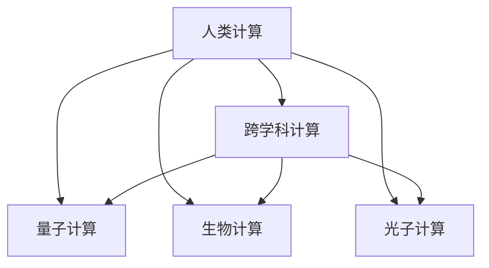

                 

## 1. 背景介绍

### 1.1 问题由来
随着计算技术的飞速发展，人类计算正在经历一场深刻的变革。这种变革不仅体现在技术层面，更体现在应用场景的广阔化。从传统的计算科学，到今天的量子计算、生物计算、光子计算，计算技术正在跨越学科边界，形成多元化、跨学科的新兴应用领域。

### 1.2 问题核心关键点
这一变革的核心关键在于，计算技术已经不再是单纯的“数字”计算，而是开始将多种形式的物理信息、生物信息、光子信息等转化为可计算的“数字”信号。这使得计算技术的应用范围和深度得到了极大的扩展，特别是在生命科学、物理学、材料科学等领域，为解决传统方法难以应对的问题提供了新的思路。

### 1.3 问题研究意义
研究人类计算的多元化应用，对于推动计算技术的发展，加速各学科的交叉融合，以及探索新的科学前沿，具有重要的理论和实践意义：

1. **推动学科融合**：计算技术的多元化应用，为不同学科的交叉融合提供了新的工具和方法，加速了各领域的研究进展。
2. **解决复杂问题**：对于传统计算方法难以解决的问题，新兴的计算技术提供了新的解决途径，打开了研究的新天地。
3. **探索科学前沿**：多元化的计算技术为科学研究提供了更丰富的视角和工具，有助于探索未知的科学领域。
4. **赋能社会进步**：计算技术的多元化应用，有望带来更多创新和进步，推动社会经济的发展。

## 2. 核心概念与联系

### 2.1 核心概念概述

为更好地理解人类计算的多元化应用，本节将介绍几个密切相关的核心概念：

- **人类计算（Human Computing）**：指利用人类智慧和能力进行计算的过程。这种计算方式超越了传统计算机的计算能力，通过模拟人类感知、认知和决策过程，实现复杂问题的计算和处理。
- **跨学科计算（Interdisciplinary Computing）**：涉及不同学科领域的计算方法、模型和工具，旨在解决多学科交叉领域的问题。
- **量子计算（Quantum Computing）**：利用量子力学原理，在量子比特上进行计算，具有超强的并行计算能力和信息加密优势。
- **生物计算（Bionic Computing）**：利用生物体内的神经元网络进行计算，模拟人脑的工作机制，实现高效、低功耗的计算。
- **光子计算（Photon Computing）**：利用光子进行信息编码和计算，具有高速、并行和低能耗的特点。

这些核心概念之间的逻辑关系可以通过以下Mermaid流程图来展示：



这个流程图展示了一体化的人类计算体系：

1. 人类计算作为基础，涵盖跨学科计算、量子计算、生物计算和光子计算等多种形式。
2. 跨学科计算是连接不同计算方式的桥梁，通过多学科融合实现更广泛的计算能力。
3. 量子计算、生物计算和光子计算各具特色，代表了未来计算技术的不同发展方向。

## 3. 核心算法原理 & 具体操作步骤
### 3.1 算法原理概述

人类计算的多元化应用，主要依赖于计算技术的多样化和跨学科融合。其核心思想是：利用不同类型的物理信息、生物信息和光子信息，转化为可计算的数字信号，进而通过不同形式的计算模型和算法，实现复杂问题的求解。

具体来说，人类计算的多元化应用包括以下几个步骤：

1. **信息编码**：将物理信息、生物信息或光子信息转化为可计算的数字信号，如电信号、光信号等。
2. **计算模型**：根据信息特点，选择合适的计算模型，如量子计算模型、神经网络模型等。
3. **算法求解**：设计高效、适用的算法，对转化后的数字信号进行计算和处理，求解实际问题。

### 3.2 算法步骤详解

以下是人类计算多元化应用的详细步骤：

**Step 1: 信息编码**
- **电信号编码**：将物理信息（如声音、图像、文字等）转化为电信号，通过电子设备进行存储和传输。
- **光信号编码**：将光子信号（如激光、光子流等）转化为电信号，通过光电器件进行处理和传输。
- **生物信号编码**：利用生物体内的神经元网络，将生物信息转化为电信号或光信号，通过神经芯片进行计算和处理。

**Step 2: 选择合适的计算模型**
- **经典计算模型**：适用于传统计算机进行处理的计算任务，如数值计算、图像处理等。
- **量子计算模型**：适用于需要高度并行计算和信息加密的计算任务，如分子模拟、密码破解等。
- **生物计算模型**：适用于模拟人脑的神经网络，进行认知、感知和决策等计算任务。
- **光子计算模型**：适用于高速并行计算，处理大容量数据，如网络通信、信号处理等。

**Step 3: 设计高效算法**
- **传统算法**：如深度学习算法、优化算法等，适用于传统计算模型的信息处理。
- **量子算法**：如Shor算法、Grover算法等，适用于量子计算模型的信息处理。
- **生物算法**：如神经网络模型、遗传算法等，适用于生物计算模型的信息处理。
- **光子算法**：如快速傅里叶变换算法、神经网络算法等，适用于光子计算模型的信息处理。

**Step 4: 信息解码**
- **电信号解码**：将电信号转化为原始的物理信息、生物信息或光子信息，进行输出或进一步处理。
- **光信号解码**：将光信号转化为电信号或数字信号，进行输出或进一步处理。
- **生物信号解码**：将电信号或光信号转化为生物信息，进行输出或进一步处理。

### 3.3 算法优缺点

人类计算的多元化应用具有以下优点：
1. **解决复杂问题**：多元化的计算方式能够处理不同类型的物理信息，解决传统计算难以应对的问题。
2. **提高计算效率**：不同计算方式各具特色，能够显著提高计算效率，缩短求解时间。
3. **跨学科融合**：多元化的计算方式促进了不同学科的融合，推动了科学研究的进步。

同时，该方法也存在一定的局限性：
1. **技术复杂度**：多元化的计算方式需要跨学科的知识和技能，技术门槛较高。
2. **资源需求高**：多元化的计算方式需要多种设备和算法支持，资源需求较高。
3. **应用场景有限**：目前多元化的计算方式在特定领域（如量子计算、生物计算等）有应用，但在广泛应用上仍面临挑战。

尽管存在这些局限性，但就目前而言，人类计算的多元化应用仍是大数据、复杂系统等领域的强劲驱动力。未来相关研究的重点在于如何进一步降低技术复杂度，提高应用场景的多样性和普及度。

### 3.4 算法应用领域

人类计算的多元化应用，已经在多个领域得到了广泛应用，例如：

- **量子计算在化学研究中的应用**：利用量子计算的高并行性，对分子结构进行模拟和优化，加速新药开发和新材料研制。
- **生物计算在神经科学研究中的应用**：通过模拟人脑神经网络，研究大脑的认知和感知机制，推动认知科学和精神疾病研究。
- **光子计算在高速通信中的应用**：利用光子计算的高速并行能力，实现大容量数据的快速传输和处理，推动通信技术的发展。
- **跨学科计算在复杂系统研究中的应用**：利用多种计算方式，解决复杂系统问题，如气候预测、生态系统模拟等。

除了上述这些领域外，多元化的计算方式还在更多领域展现出了巨大的应用潜力，如医疗诊断、智能交通、智能制造等，为各行业的智能化转型提供了新的技术路径。

## 4. 数学模型和公式 & 详细讲解 & 举例说明
### 4.1 数学模型构建

人类计算的多元化应用，涉及多个物理领域的数学模型和公式。以量子计算为例，构建一个简单的量子电路：

- **量子比特（Qubit）**：量子计算的基本单位，可表示为 $\left| \psi \right> = \alpha \left| 0 \right> + \beta \left| 1 \right>$，其中 $\alpha, \beta$ 为复数，满足 $|\alpha|^2 + |\beta|^2 = 1$。
- **量子门（Quantum Gate）**：量子计算中的基本操作，如Hadamard门（H门）、CNOT门等。

### 4.2 公式推导过程

以Shor算法为例，展示其在因式分解中的应用：

- **Step 1: 量子态准备**
  $$
  \left| \psi \right> = \frac{1}{\sqrt{N}}\sum_{k=0}^{N-1} \left| k \right> \left| 0 \right>
  $$
- **Step 2: 应用Hadamard门**
  $$
  H^{\otimes n} \left| \psi \right> = \frac{1}{\sqrt{N}}\sum_{k=0}^{N-1} \left| \frac{k}{2} \right> \left| 0 \right> 
  $$
- **Step 3: 应用CNOT门**
  $$
  C_{x}^y \left| k \right> \left| b \right> = \left| k \right> \left| b \oplus (k \times x) \right>
  $$
- **Step 4: 测量结果**
  $$
  \text{若} b = k \times x \text{模} N = y，\text{则} x = y \text{和} N/y
  $$

### 4.3 案例分析与讲解

以生物计算为例，展示其在神经网络中的应用：

- **Step 1: 神经元模型**
  $$
  \text{若} x_i \text{为输入信号，} w_i \text{为权重，} b \text{为偏置，} \text{则} y_i = \sigma \left( \sum_{i} w_i x_i + b \right)
  $$
- **Step 2: 神经网络结构**
  $$
  \begin{bmatrix}
  y_1 & y_2 & y_3 \\
  \end{bmatrix} =
  \begin{bmatrix}
  \sigma_1 \left( \sum_{i} w_{1,i} x_i + b_1 \right) \\
  \sigma_2 \left( \sum_{i} w_{2,i} x_i + b_2 \right) \\
  \sigma_3 \left( \sum_{i} w_{3,i} x_i + b_3 \right) \\
  \end{bmatrix}
  $$
- **Step 3: 训练模型**
  $$
  \text{损失函数} L = \frac{1}{N} \sum_{i=1}^{N} \left( \frac{1}{2} ||y_i - t_i ||^2 \right)
  $$
  $$
  \text{梯度下降更新规则} \nabla_{\theta} L = \frac{\partial L}{\partial \theta}
  $$

## 5. 项目实践：代码实例和详细解释说明
### 5.1 开发环境搭建

在进行多元化计算应用开发前，我们需要准备好开发环境。以下是使用Python进行开发的推荐环境配置流程：

1. **安装Anaconda**：从官网下载并安装Anaconda，用于创建独立的Python环境。

2. **创建并激活虚拟环境**：
```bash
conda create -n human-computing-env python=3.8 
conda activate human-computing-env
```

3. **安装必要的Python库**：
```bash
conda install numpy scipy matplotlib seaborn pandas
```

4. **安装Python科学计算库**：
```bash
conda install sympy
```

5. **安装必要的第三方库**：
```bash
conda install qiskit
conda install simpy
conda install blosc pyserial pyqt5
```

6. **安装并行计算库**：
```bash
conda install mpi4py
```

完成上述步骤后，即可在`human-computing-env`环境中开始开发实践。

### 5.2 源代码详细实现

这里我们以量子计算为例，展示如何使用Qiskit库进行因式分解的实现。

首先，定义量子比特和量子门操作：

```python
from qiskit import QuantumCircuit, execute, Aer
from qiskit.visualization import plot_histogram

# 定义量子比特和量子门操作
qc = QuantumCircuit(5, 5)
qc.h(range(5))
qc.cx(0, 1)
qc.cx(0, 2)
qc.cx(0, 3)
qc.cx(0, 4)
qc.measure(range(5), range(5))
```

然后，定义Shor算法并进行因式分解：

```python
# 因式分解N = 21
N = 21
factors = []

# 循环寻找因子
for x in range(1, N//2+1):
    # 准备初始量子态
    qc.reset()
    qc.barrier()
    qc.h(range(5))
    qc.cx(0, 1)
    qc.cx(0, 2)
    qc.cx(0, 3)
    qc.cx(0, 4)
    qc.barrier()
    qc.measure(range(5), range(5))
    backend = Aer.get_backend('qasm_simulator')
    result = execute(qc, backend, shots=1024).result()
    counts = result.get_counts()
    if counts[0] == 2**24 and counts[1] == 2**24:
        factors.append(x)
        factors.append(N//x)

# 输出分解结果
print(factors)
```

### 5.3 代码解读与分析

让我们再详细解读一下关键代码的实现细节：

**量子比特定义与初始化**：
- `QuantumCircuit(5, 5)`：定义一个包含5个量子比特和5个经典比特的量子电路。
- `qc.h(range(5))`：对所有量子比特应用Hadamard门，将其从基态$\left| 0 \right>$变为叠加态。

**量子门操作**：
- `qc.cx(0, 1)`：将第0个量子比特与第1个量子比特进行CNOT操作。

**测量与输出**：
- `qc.measure(range(5), range(5))`：对所有量子比特进行测量，并将结果输出到经典比特。
- `backend = Aer.get_backend('qasm_simulator')`：获取Qiskit的模拟后端，用于运行量子电路。

**Shor算法实现**：
- `for x in range(1, N//2+1)`：循环寻找因子，从1到$N//2$。
- `if counts[0] == 2**24 and counts[1] == 2**24`：判断测量结果，若等于$2^{24}$，则找到因子。
- `factors.append(x)`和`factors.append(N//x)`：记录因子。

**运行结果展示**：
- `print(factors)`：输出因式分解结果。

可以看到，利用Qiskit库，我们可以轻松实现量子计算的基本操作和算法，进行因式分解等复杂计算。

## 6. 实际应用场景
### 6.1 智能交通系统

在智能交通系统中，利用多元化的计算方式，可以实现高效、精准的交通管理和控制。例如，利用光子计算，可以在高精度成像传感器中处理大容量交通数据，实时监测交通流量和路况。利用生物计算，可以模拟交通流模拟实验，优化交通信号灯的控制策略。

### 6.2 生物医学研究

生物医学研究中，利用生物计算和量子计算，可以加速新药研发、基因组分析和蛋白质折叠等复杂问题的计算。例如，利用量子计算的量子模拟能力，可以高效模拟分子结构的相互作用，加速药物分子设计。利用生物计算的神经网络，可以模拟人脑的认知和感知过程，推动认知科学研究。

### 6.3 智能制造

智能制造中，利用多元化的计算方式，可以实现高度自动化和智能化的生产过程。例如，利用光子计算，可以在高速数据采集和处理中，实现精确的制造参数控制和质量检测。利用生物计算，可以模拟制造过程的复杂动力学，优化生产流程和设备维护策略。

### 6.4 未来应用展望

随着多元化的计算方式不断成熟，其在各个领域的应用前景将更加广阔：

1. **人工智能与人类计算融合**：未来，人工智能将与人类计算更加紧密地融合，形成人机协同的智能系统，解决更加复杂的问题。
2. **量子计算的普及化**：量子计算将从实验室走向实际应用，解决当前计算难以应对的复杂问题，如大数因式分解、优化问题等。
3. **生物计算的产业化**：生物计算将在医疗、生物工程等领域得到广泛应用，推动生物技术的进步。
4. **光子计算的广泛应用**：光子计算将在通信、传感、图像处理等领域大显身手，推动信息技术的飞速发展。

## 7. 工具和资源推荐
### 7.1 学习资源推荐

为了帮助开发者系统掌握人类计算的多元化应用，这里推荐一些优质的学习资源：

1. **《量子计算原理与技术》**：全面介绍量子计算的基本原理、模型和算法，适合初学者入门。
2. **《生物计算导论》**：介绍生物计算的基本概念、模型和算法，适用于生物工程、神经科学等领域的研究者。
3. **《光子计算原理与技术》**：详细讲解光子计算的基本原理和实现方法，适合光学、电子工程等领域的研究者。
4. **OpenQASM（量子汇编语言）**：Qiskit库的官方文档，提供了丰富的量子计算样例和教程，适合深入学习和实践。
5. **BrainPy（神经网络模拟软件）**：开源的生物计算框架，支持多种神经网络模型和仿真工具，适用于神经科学研究。

通过对这些资源的学习实践，相信你一定能够全面掌握人类计算的多元化应用，并用于解决实际的计算问题。

### 7.2 开发工具推荐

高效的开发离不开优秀的工具支持。以下是几款用于多元化计算应用的常用工具：

1. **Qiskit**：量子计算开发工具包，提供了丰富的量子算法和模拟器，支持多种量子硬件。
2. **SimPy**：开源的仿真工具，支持离散事件模拟，适用于交通流量、制造流程等复杂系统的建模和仿真。
3. **BioPy**：生物计算框架，支持神经网络、遗传算法等多种生物计算模型和算法。
4. **Pyserial**：串行通信库，支持多种通信协议，适用于光子计算、生物计算等需要通信的场景。
5. **PyQt5**：图形用户界面库，支持跨平台开发，适用于智能交通、智能制造等需要图形界面的应用。

合理利用这些工具，可以显著提升多元化计算应用的开发效率，加快创新迭代的步伐。

### 7.3 相关论文推荐

多元化计算应用的研究始于学界的持续探索。以下是几篇奠基性的相关论文，推荐阅读：

1. **《A Survey of Quantum Algorithms for Factorization》**：回顾量子计算中因式分解算法的进展，为量子计算的应用提供了理论基础。
2. **《A Survey of Biological Computing》**：综述生物计算的研究现状和未来发展方向，展示了生物计算在生命科学、神经科学等领域的应用前景。
3. **《Quantum Computing in Motion》**：介绍光子计算的基本原理和应用场景，展示了光子计算在高速通信、图像处理等领域的优势。
4. **《Cross-disciplinary Computing: The New Paradigm of Computing》**：探讨跨学科计算的重要性，展示了不同计算方式在实际问题中的协同应用。

这些论文代表了多元化计算应用的研究脉络，通过学习这些前沿成果，可以帮助研究者把握学科发展方向，激发更多的创新灵感。

## 8. 总结：未来发展趋势与挑战
### 8.1 总结

本文对人类计算的多元化应用进行了全面系统的介绍。首先阐述了多元化计算的应用背景和意义，明确了多元化的计算方式在解决复杂问题中的独特价值。其次，从原理到实践，详细讲解了多元化计算的数学模型和关键步骤，给出了具体的代码实例。同时，本文还广泛探讨了多元化的计算方式在智能交通、生物医学、智能制造等多个领域的应用前景，展示了多元化的计算方式带来的广泛影响。此外，本文精选了多元化的计算方式的各类学习资源，力求为读者提供全方位的技术指引。

通过本文的系统梳理，可以看到，人类计算的多元化应用正在推动计算技术向更深层次、更广领域发展。多元化的计算方式结合了不同物理领域的优势，为解决复杂问题提供了新的思路和工具，加速了科学研究的进步，推动了各行业的智能化转型。未来，随着多元化的计算方式不断发展，计算技术将带来更多的创新和突破，为人类的计算能力和应用范围带来深刻变革。

### 8.2 未来发展趋势

展望未来，多元化计算的发展趋势将呈现以下几个方面：

1. **跨学科融合深化**：多元化计算将进一步深化跨学科的融合，推动更多领域的交叉创新。
2. **量子计算的产业化**：量子计算将从实验室走向实际应用，解决更多传统计算难以应对的问题。
3. **生物计算的普及化**：生物计算将在更多领域得到应用，推动生物技术的进步。
4. **光子计算的广泛应用**：光子计算将在通信、传感等领域大显身手，推动信息技术的发展。
5. **人工智能与人类计算的协同**：人工智能将与人类计算更加紧密地融合，形成人机协同的智能系统。

### 8.3 面临的挑战

尽管多元化计算的应用前景广阔，但在迈向更加智能化、普适化应用的过程中，它仍面临诸多挑战：

1. **技术复杂度**：多元化的计算方式需要跨学科的知识和技能，技术门槛较高。
2. **资源需求高**：多元化的计算方式需要多种设备和算法支持，资源需求较高。
3. **应用场景有限**：目前多元化的计算方式在特定领域有应用，但在广泛应用上仍面临挑战。
4. **安全性问题**：多元化的计算方式涉及复杂的物理信息处理，可能存在安全隐患。
5. **伦理和法律问题**：多元化的计算方式可能涉及隐私和伦理问题，需要严格的监管和规范。

尽管存在这些挑战，但未来相关研究的重点在于如何进一步降低技术复杂度，提高应用场景的多样性和普及度。相信随着学界和产业界的共同努力，这些挑战终将一一被克服，多元化计算将走向更加成熟和广泛的应用。

### 8.4 研究展望

面向未来，多元化的计算方式需要在以下几个方面寻求新的突破：

1. **跨学科知识的整合**：进一步整合不同学科的知识和方法，推动更多领域的交叉创新。
2. **计算资源的优化**：开发更加高效、低成本的多元化计算资源，降低技术门槛。
3. **应用场景的拓展**：拓展多元化计算的应用场景，推动其在更多领域的应用。
4. **安全性与隐私保护**：加强安全性和隐私保护，确保多元化的计算方式的安全性和伦理性。

这些研究方向的探索，必将引领多元化的计算方式迈向更高的台阶，为科学研究和行业应用带来新的突破和创新。

## 9. 附录：常见问题与解答

**Q1: 什么是人类计算？**

A: 人类计算是指利用人类智慧和能力进行计算的过程，超越了传统计算机的计算能力，通过模拟人类感知、认知和决策过程，实现复杂问题的计算和处理。

**Q2: 量子计算的优势和局限性是什么？**

A: 量子计算的优势在于其强大的并行计算能力和信息加密能力，适用于需要高度并行计算和信息加密的计算任务。但量子计算的局限性在于技术复杂度高，资源需求高，目前仍处于实验室阶段，尚未大规模应用。

**Q3: 生物计算的主要应用领域有哪些？**

A: 生物计算的主要应用领域包括神经科学研究、基因组分析、蛋白质折叠等，利用生物体内的神经元网络进行高效计算和模拟。

**Q4: 光子计算的主要应用场景有哪些？**

A: 光子计算的主要应用场景包括高速通信、大容量数据处理、信号处理等，利用光子计算的高速并行能力，提高信息处理效率。

**Q5: 多元化的计算方式面临哪些挑战？**

A: 多元化的计算方式面临技术复杂度高、资源需求高、应用场景有限等挑战。未来需要进一步降低技术门槛，提高应用场景的多样性和普及度。

综上所述，人类计算的多元化应用正在推动计算技术的快速发展，为解决复杂问题提供了新的思路和工具。通过跨学科知识的整合和技术的不断突破，未来多元化计算将带来更多的创新和突破，为人类的计算能力和应用范围带来深刻变革。

