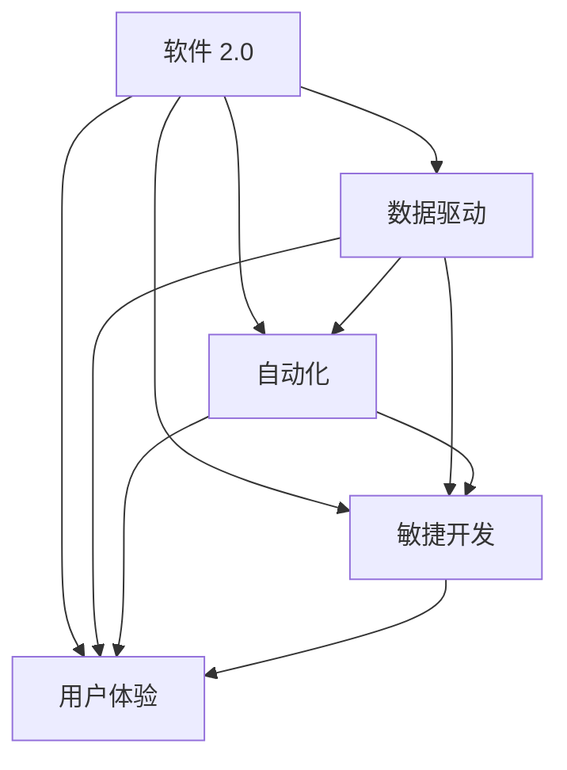

                 

# 软件 2.0 的价值：提升效率、创造价值

> 关键词：软件 2.0, 效率提升, 价值创造, 自动化, 机器学习, 数据驱动, 软件工程, 用户体验

## 1. 背景介绍

### 1.1 问题由来

随着信息技术的快速发展，软件系统在各行各业中的应用越来越广泛。从早期的数据处理、办公自动化到今天的智能推荐、自动驾驶，软件系统已经成为推动社会进步的重要力量。然而，在过去的软件开发和运维过程中，由于手工编码、人工测试等低效步骤的存在，项目交付周期长、质量不稳定的问题始终未能彻底解决。

为了应对这一挑战，业界逐步兴起了一种以数据驱动、自动化和用户体验为中心的全新软件开发范式——软件 2.0。与传统软件 1.0 注重手工编码、功能实现不同，软件 2.0 更加强调数据的价值、自动化的效率和用户体验的持续优化。它将软件看作一个有机整体，通过数据驱动的方式不断优化系统，以实现性能、安全、可扩展性的提升，从而创造更大的商业价值。

### 1.2 问题核心关键点

软件 2.0 的核心在于通过数据驱动和自动化手段，实现对软件系统的持续优化，从而提升效率、创造价值。具体而言，软件 2.0 涉及以下几个关键点：

- **数据驱动**：利用数据分析和机器学习技术，不断优化软件系统的性能和用户体验。
- **自动化**：通过工具和框架实现代码自动化、测试自动化、部署自动化等，提升开发和运维效率。
- **用户体验**：聚焦用户需求，不断迭代产品功能和界面，提升用户满意度。
- **敏捷开发**：采用敏捷开发模式，缩短项目交付周期，快速响应市场需求变化。

这些关键点构成了软件 2.0 的基本框架，帮助软件开发团队构建高效、稳定、创新的软件系统。

## 2. 核心概念与联系

### 2.1 核心概念概述

为了更好地理解软件 2.0 的原理和架构，本节将介绍几个核心概念：

- **软件 2.0**：一种以数据驱动、自动化和用户体验为中心的软件开发范式，通过数据分析和机器学习不断优化软件系统，以提升性能、安全、可扩展性，创造更大的商业价值。
- **数据驱动**：利用数据分析和机器学习技术，基于数据反馈不断优化软件系统的功能和性能，提升用户体验。
- **自动化**：通过工具和框架实现代码自动化、测试自动化、部署自动化等，提升开发和运维效率。
- **敏捷开发**：采用敏捷开发模式，以快速迭代、快速反馈为核心，缩短项目交付周期，快速响应市场需求变化。
- **用户体验**：聚焦用户需求，不断迭代产品功能和界面，提升用户满意度。

这些概念之间的逻辑关系可以通过以下 Mermaid 流程图来展示：



这个流程图展示了大数据驱动的软件 2.0 的基本框架，其中数据驱动、自动化、敏捷开发和用户体验是构成软件 2.0 的关键组件，共同支撑着高效、稳定、创新的软件系统的构建。

## 3. 核心算法原理 & 具体操作步骤

### 3.1 算法原理概述

软件 2.0 的核心算法原理包括以下几个方面：

- **数据驱动**：通过数据分析和机器学习技术，对软件系统的性能和用户体验进行持续优化。具体而言，可以基于用户行为数据、系统运行日志等数据，利用回归分析、聚类分析、异常检测等方法，发现系统瓶颈和性能问题，进而优化系统功能和性能。
- **自动化**：通过工具和框架实现代码自动化、测试自动化、部署自动化等，提升开发和运维效率。常用的自动化工具包括 Continuous Integration (CI)、Continuous Deployment (CD)、Containerization (Docker)、Infrastructure as Code (IaC) 等。
- **敏捷开发**：采用敏捷开发模式，以快速迭代、快速反馈为核心，缩短项目交付周期，快速响应市场需求变化。常用的敏捷开发框架包括 Scrum、Kanban、XP 等。
- **用户体验**：聚焦用户需求，不断迭代产品功能和界面，提升用户满意度。常用的用户体验优化工具包括 A/B 测试、用户行为分析、热图分析等。

这些核心算法原理构成了软件 2.0 的基本技术框架，帮助软件开发团队构建高效、稳定、创新的软件系统。

### 3.2 算法步骤详解

软件 2.0 的实现步骤一般包括以下几个关键环节：

**Step 1: 数据采集和预处理**

- 收集软件系统运行时的日志数据、用户行为数据、系统性能数据等。
- 对数据进行清洗、去重、归一化等预处理操作，确保数据质量。

**Step 2: 数据分析和模型训练**

- 利用数据分析和机器学习技术，对数据进行回归分析、聚类分析、异常检测等，发现系统瓶颈和性能问题。
- 训练模型，利用历史数据预测未来的性能趋势，优化系统功能和性能。

**Step 3: 自动化实现**

- 使用 CI/CD 工具和框架实现代码自动化、测试自动化、部署自动化等。
- 通过容器化技术实现代码和环境的一致性，提升系统的稳定性和可扩展性。

**Step 4: 敏捷开发**

- 采用敏捷开发模式，进行快速迭代和反馈，缩短项目交付周期，快速响应市场需求变化。
- 使用敏捷开发框架如 Scrum、Kanban 等，进行项目管理、任务分配和进度跟踪。

**Step 5: 用户体验优化**

- 聚焦用户需求，进行产品功能和界面的迭代优化。
- 使用 A/B 测试、用户行为分析等工具，不断优化用户体验。

**Step 6: 持续集成和持续部署**

- 通过持续集成和持续部署机制，确保代码和环境的持续集成和持续部署，提升开发和运维效率。

这些步骤共同构成了软件 2.0 的实现流程，帮助软件开发团队构建高效、稳定、创新的软件系统。

### 3.3 算法优缺点

软件 2.0 的优势在于：

- 提升效率：通过自动化和敏捷开发模式，大幅提升开发和运维效率，缩短项目交付周期。
- 创造价值：通过数据分析和用户体验优化，提升系统性能和用户满意度，创造更大的商业价值。
- 持续优化：通过持续集成和持续部署机制，实现对软件系统的持续优化，提升系统的稳定性和可扩展性。

同时，软件 2.0 也存在以下缺点：

- 技术门槛高：需要具备数据分析、机器学习、自动化工具等技术，对开发团队的技术能力要求较高。
- 数据质量要求高：需要确保采集的数据质量，避免噪声和偏差对分析结果的影响。
- 投资成本高：初期需要投入大量的硬件和软件资源，进行数据采集和分析，短期内可能存在较大的投资成本。

尽管存在这些缺点，但就目前而言，软件 2.0 仍然是软件开发和运维的先进范式，帮助软件开发团队构建高效、稳定、创新的软件系统，推动软件技术的发展和应用。

### 3.4 算法应用领域

软件 2.0 技术在多个领域得到了广泛应用，具体如下：

- **软件开发和运维**：利用数据驱动和自动化手段，提升开发和运维效率，缩短项目交付周期。
- **智能推荐系统**：利用用户行为数据和数据分析技术，实现个性化推荐，提升用户体验。
- **金融科技**：利用数据分析和机器学习技术，进行风险控制、欺诈检测、智能投顾等。
- **医疗健康**：利用医疗数据和数据分析技术，进行疾病预测、个性化治疗、智能诊断等。
- **智能客服**：利用自然语言处理和数据分析技术，提升客服系统的响应速度和用户满意度。

随着技术的发展和应用场景的拓展，软件 2.0 将在更多领域发挥重要作用，为各行各业带来变革性影响。

## 4. 数学模型和公式 & 详细讲解 & 举例说明

### 4.1 数学模型构建

软件 2.0 的数学模型主要包括以下几个方面：

- **回归分析**：用于预测软件系统性能和用户行为趋势，公式为 $Y = \beta_0 + \beta_1X_1 + \beta_2X_2 + ... + \beta_nX_n + \epsilon$。
- **聚类分析**：用于发现软件系统的不同用户群体，公式为 $k-means: \min\limits_{\mu_k}\sum\limits_{x_i \in C_k}\|x_i-\mu_k\|^2$。
- **异常检测**：用于识别软件系统的异常行为，公式为 $k-means: \min\limits_{\mu_k}\sum\limits_{x_i \in C_k}\|x_i-\mu_k\|^2$。

这些数学模型构成了软件 2.0 的基本数学框架，帮助软件开发团队基于数据进行持续优化和改进。

### 4.2 公式推导过程

以回归分析为例，进行公式推导：

- **模型建立**：假设软件系统的性能 $Y$ 与用户行为 $X_1, X_2, ..., X_n$ 之间存在线性关系，即 $Y = \beta_0 + \beta_1X_1 + \beta_2X_2 + ... + \beta_nX_n + \epsilon$。
- **数据准备**：收集软件系统运行时的日志数据和用户行为数据，构建训练集 $\{(x_i,y_i)\}_{i=1}^N$。
- **模型训练**：利用最小二乘法求解参数 $\beta_0, \beta_1, \beta_2, ..., \beta_n$，使得模型误差最小，即 $\min\limits_{\theta}\sum\limits_{i=1}^N(y_i - f_{\theta}(x_i))^2$。

通过上述步骤，可以训练出基于数据的回归模型，用于预测软件系统性能和用户行为趋势，从而进行持续优化。

### 4.3 案例分析与讲解

以智能推荐系统为例，展示软件 2.0 的应用：

- **数据采集**：收集用户的历史浏览记录、评分、评论等数据。
- **数据清洗**：对数据进行去重、归一化、降噪等预处理操作。
- **模型训练**：利用协同过滤、深度学习等方法，训练推荐模型。
- **自动化实现**：使用 CI/CD 工具和框架，实现代码自动化、测试自动化、部署自动化等。
- **敏捷开发**：采用敏捷开发模式，进行快速迭代和反馈，缩短项目交付周期。
- **用户体验优化**：聚焦用户需求，进行产品功能和界面的迭代优化。

通过数据分析和自动化手段，智能推荐系统可以不断优化推荐算法和用户体验，提升用户满意度，创造更大的商业价值。

## 5. 项目实践：代码实例和详细解释说明

### 5.1 开发环境搭建

在进行软件 2.0 实践前，我们需要准备好开发环境。以下是使用 Python 进行数据驱动开发的环境配置流程：

1. 安装 Python：从官网下载并安装 Python，确保版本支持数据分析和机器学习库。
2. 安装相关库：使用 pip 安装 pandas、numpy、scikit-learn 等数据分析和机器学习库。
3. 安装开发工具：使用 IDE 或编辑器，如 PyCharm、Visual Studio Code 等。

完成上述步骤后，即可在 Python 环境中开始软件 2.0 实践。

### 5.2 源代码详细实现

这里我们以数据分析和机器学习在金融风控中的应用为例，展示软件 2.0 的代码实现。

```python
import pandas as pd
from sklearn.linear_model import LinearRegression
from sklearn.model_selection import train_test_split
from sklearn.metrics import mean_squared_error

# 数据加载和预处理
data = pd.read_csv('financial_data.csv')
X = data[['age', 'income', 'credit_score']]
y = data['default']
X_train, X_test, y_train, y_test = train_test_split(X, y, test_size=0.2, random_state=42)

# 模型训练
model = LinearRegression()
model.fit(X_train, y_train)

# 模型评估
y_pred = model.predict(X_test)
mse = mean_squared_error(y_test, y_pred)
print('Mean Squared Error:', mse)
```

通过上述代码，我们完成了金融风控数据的加载和预处理，利用线性回归模型进行了训练和评估，展示了数据分析和机器学习在金融风控中的应用。

### 5.3 代码解读与分析

让我们再详细解读一下关键代码的实现细节：

**数据加载和预处理**：
- 使用 pandas 库加载数据，确保数据质量。
- 对数据进行清洗、去重、归一化等预处理操作，确保数据质量。

**模型训练**：
- 使用 scikit-learn 库中的线性回归模型进行训练，利用历史数据预测未来的性能趋势。

**模型评估**：
- 使用均方误差（MSE）评估模型的预测性能，确保模型的准确性。

可以看到，Python 配合 pandas、scikit-learn 等库，使得数据分析和机器学习的代码实现变得简洁高效。开发者可以将更多精力放在数据处理、模型改进等高层逻辑上，而不必过多关注底层的实现细节。

当然，工业级的系统实现还需考虑更多因素，如数据存储和读取、模型的可扩展性、系统的稳定性等。但核心的软件 2.0 方法基本与此类似。

## 6. 实际应用场景

### 6.1 金融风控

在金融风控领域，利用数据分析和机器学习技术，可以实现风险控制、欺诈检测、智能投顾等功能。具体而言，可以收集用户的财务数据、交易数据、行为数据等，利用回归分析、分类分析等方法，发现潜在风险用户和异常交易行为，从而提升风控系统的准确性和效率。

在技术实现上，可以构建分布式计算环境，利用大数据技术进行数据采集和分析，采用机器学习算法构建风控模型，通过自动化和敏捷开发模式进行持续优化和部署。

### 6.2 智能推荐系统

当前的推荐系统往往只依赖用户的历史行为数据进行物品推荐，无法深入理解用户的真实兴趣偏好。利用数据分析和机器学习技术，可以实现更加精准的推荐。具体而言，可以收集用户浏览、点击、评论、分享等行为数据，提取和用户交互的物品标题、描述、标签等文本内容。利用文本处理和机器学习技术，进行协同过滤、深度学习等推荐算法，生成个性化推荐列表。

在技术实现上，可以采用分布式计算和深度学习框架进行数据处理和模型训练，利用自动化和敏捷开发模式进行持续优化和部署，从而提升推荐系统的性能和用户体验。

### 6.3 智慧医疗

智慧医疗系统需要实时监测患者健康数据，进行疾病预测和智能诊断。利用数据分析和机器学习技术，可以实现健康数据的实时采集和处理，构建疾病预测模型和智能诊断系统。具体而言，可以收集患者的生理指标、行为数据、历史病历等数据，利用回归分析、分类分析等方法，构建疾病预测模型和智能诊断系统。

在技术实现上，可以采用分布式计算和大数据技术进行数据采集和分析，利用机器学习算法构建疾病预测和智能诊断模型，通过自动化和敏捷开发模式进行持续优化和部署，从而提升智慧医疗系统的性能和用户体验。

### 6.4 未来应用展望

随着数据驱动和自动化技术的不断进步，软件 2.0 将在更多领域得到应用，为各行各业带来变革性影响。

在智慧城市治理中，利用数据分析和机器学习技术，可以实现城市事件监测、舆情分析、应急指挥等功能。通过智能化的城市管理，提升城市运行效率和居民生活质量。

在智能制造领域，利用数据分析和机器学习技术，可以实现生产过程的优化和设备预测性维护。通过智能化的生产管理，提升制造业的效率和竞争力。

在智能农业领域，利用数据分析和机器学习技术，可以实现农作物的精准管理和病虫害的预测预防。通过智能化的农业管理，提升农业生产效率和可持续发展能力。

未来，随着技术的发展和应用场景的拓展，软件 2.0 将在更多领域发挥重要作用，为各行各业带来变革性影响。相信随着技术的日益成熟，软件 2.0 必将在构建智慧社会中扮演越来越重要的角色。

## 7. 工具和资源推荐

### 7.1 学习资源推荐

为了帮助开发者系统掌握软件 2.0 的理论基础和实践技巧，这里推荐一些优质的学习资源：

1. 《Python数据分析与机器学习》系列博文：由 Python 数据分析和机器学习专家撰写，深入浅出地介绍了数据分析和机器学习的基本概念和常用方法。
2. Kaggle 平台：全球最大的数据科学竞赛平台，提供海量数据集和算法竞赛，帮助开发者提升数据分析和机器学习技能。
3. Coursera 《数据科学导论》课程：由斯坦福大学教授编写，涵盖数据分析和机器学习的基础知识和实践技巧。
4. Udacity 《数据科学纳米学位》课程：提供系统化的数据科学学习路径，涵盖数据清洗、特征工程、模型训练等环节。
5. Kaggle 竞赛社区：聚集全球数据科学爱好者，提供丰富的数据集和算法竞赛，激发开发者的创新灵感。

通过对这些资源的学习实践，相信你一定能够快速掌握软件 2.0 的精髓，并用于解决实际的业务问题。

### 7.2 开发工具推荐

高效的开发离不开优秀的工具支持。以下是几款用于数据分析和机器学习开发的常用工具：

1. Jupyter Notebook：免费的开源交互式编程环境，支持多语言代码编写和可视化展示。
2. Pandas：开源数据分析库，提供高效的数据处理和清洗功能。
3. Scikit-learn：开源机器学习库，提供丰富的算法和工具，支持快速原型开发和模型评估。
4. TensorFlow：由 Google 开发的深度学习框架，提供丰富的计算图和优化算法，支持大规模模型训练。
5. PyTorch：由 Facebook 开发的深度学习框架，提供动态计算图和高效的深度学习模型，支持快速的模型迭代和优化。
6. Keras：基于 TensorFlow 和 Theano 的高层次深度学习框架，支持快速构建和训练深度神经网络。

合理利用这些工具，可以显著提升数据分析和机器学习任务的开发效率，加速创新迭代的步伐。

### 7.3 相关论文推荐

软件 2.0 技术的发展源于学界的持续研究。以下是几篇奠基性的相关论文，推荐阅读：

1. "An Introduction to Statistical Learning" by Gareth James et al.：介绍了统计学习的基本概念和方法，是数据分析和机器学习的经典教材。
2. "Machine Learning: A Probabilistic Perspective" by Kevin Murphy：介绍了机器学习的基本概念和方法，涵盖了回归分析、分类分析、聚类分析等常用算法。
3. "The Elements of Statistical Learning" by Trevor Hastie et al.：介绍了统计学习的理论和实践，涵盖了特征选择、模型评估等关键技术。
4. "Deep Learning" by Ian Goodfellow et al.：介绍了深度学习的基本概念和方法，涵盖了神经网络、卷积神经网络、循环神经网络等常用算法。
5. "Practical Deep Learning for Coders" by Kornél Kovács et al.：介绍了深度学习在实际应用中的实现方法和技术细节，帮助开发者快速上手实践。

这些论文代表了大数据驱动和自动化技术的发展脉络。通过学习这些前沿成果，可以帮助研究者把握学科前进方向，激发更多的创新灵感。

## 8. 总结：未来发展趋势与挑战

### 8.1 研究成果总结

本文对软件 2.0 的原理和实践进行了全面系统的介绍。首先阐述了软件 2.0 的研究背景和意义，明确了数据驱动、自动化和用户体验优化在构建高效、稳定、创新的软件系统中的重要作用。其次，从原理到实践，详细讲解了软件 2.0 的核心算法原理和操作步骤，给出了数据分析和机器学习的代码实例。同时，本文还广泛探讨了软件 2.0 在金融风控、智能推荐、智慧医疗等多个行业领域的应用前景，展示了软件 2.0 技术的广阔前景。最后，本文精选了软件 2.0 相关的学习资源、开发工具和研究论文，力求为读者提供全方位的技术指引。

通过本文的系统梳理，可以看到，数据驱动和自动化技术正在成为软件开发和运维的先进范式，极大地提升开发和运维效率，创造更大的商业价值。未来，随着技术的发展和应用场景的拓展，软件 2.0 将在更多领域发挥重要作用，为各行各业带来变革性影响。

### 8.2 未来发展趋势

展望未来，软件 2.0 技术将呈现以下几个发展趋势：

1. 自动化程度更高：通过更多的自动化工具和框架，实现从代码编写到部署的全程自动化，提升开发和运维效率。
2. 数据质量更高：利用更多的数据采集和预处理技术，确保数据的质量和准确性，提升数据分析和机器学习的精度。
3. 用户满意度更高：通过更多的用户体验优化技术，如 A/B 测试、用户行为分析等，提升用户满意度和粘性。
4. 跨领域应用更广：将软件 2.0 技术应用于更多领域，如智慧城市、智能制造、智能农业等，推动各行各业的数字化转型。
5. 系统可扩展性更强：通过分布式计算和容器化技术，提升系统的可扩展性和弹性，支持大规模数据的处理和分析。

这些趋势将推动软件 2.0 技术向更加智能化、普适化应用的方向发展，为各行各业带来变革性影响。

### 8.3 面临的挑战

尽管软件 2.0 技术已经取得了显著成就，但在迈向更加智能化、普适化应用的过程中，它仍面临诸多挑战：

1. 技术门槛高：需要具备数据分析、机器学习、自动化工具等技术，对开发团队的技术能力要求较高。
2. 数据质量要求高：需要确保采集的数据质量，避免噪声和偏差对分析结果的影响。
3. 投资成本高：初期需要投入大量的硬件和软件资源，进行数据采集和分析，短期内可能存在较大的投资成本。
4. 系统稳定性差：在大规模数据处理和分析过程中，可能出现数据丢失、网络延迟等问题，影响系统的稳定性和可靠性。
5. 用户接受度低：部分用户对新系统和新技术的接受度较低，需要开展更多的用户教育和培训，提升用户满意度。

尽管存在这些挑战，但通过不断改进和优化，软件 2.0 必将在更多领域发挥重要作用，推动各行各业的数字化转型。

### 8.4 研究展望

面对软件 2.0 面临的挑战，未来的研究需要在以下几个方面寻求新的突破：

1. 探索更多的自动化工具和框架：开发更加高效的自动化工具和框架，提升开发和运维效率。
2. 研究数据采集和预处理技术：开发更多数据采集和预处理技术，确保数据的质量和准确性。
3. 引入更多先验知识：将符号化的先验知识，如知识图谱、逻辑规则等，与神经网络模型进行巧妙融合，增强系统的智能性和鲁棒性。
4. 提升系统稳定性和可扩展性：采用分布式计算和容器化技术，提升系统的稳定性和可扩展性。
5. 加强用户教育和培训：开展更多的用户教育和培训，提升用户对新系统和新技术的接受度。

这些研究方向的探索，必将推动软件 2.0 技术向更加智能化、普适化应用的方向发展，为各行各业带来变革性影响。总之，软件 2.0 技术需要在技术、数据、业务等多个维度协同发力，才能真正实现高效、稳定、创新的软件系统的构建。

## 9. 附录：常见问题与解答

**Q1: 软件 2.0 与传统软件 1.0 有什么区别？**

A: 软件 2.0 与传统软件 1.0 的区别主要在于其数据驱动和自动化特性。软件 1.0 强调手工编码和功能实现，通过逐行代码编写实现软件功能。而软件 2.0 则利用数据驱动和自动化手段，通过数据分析和机器学习不断优化软件系统的性能和用户体验，提升开发和运维效率，创造更大的商业价值。

**Q2: 如何选择合适的自动化工具和框架？**

A: 选择合适的自动化工具和框架需要根据具体项目的技术栈和需求进行评估。常用的自动化工具包括 CI/CD 工具、容器化工具、IaC 工具等。常用的自动化框架包括 Jenkins、Travis CI、GitLab CI 等。可以根据项目需求选择合适的工具和框架，提升开发和运维效率。

**Q3: 数据驱动和自动化如何结合？**

A: 数据驱动和自动化的结合需要从数据采集、预处理、分析、模型训练、自动化实现等多个环节进行协同设计。首先，通过数据采集技术收集软件系统的运行数据和用户行为数据。然后，对数据进行预处理和清洗，确保数据质量。接着，利用数据分析和机器学习技术，对数据进行回归分析、聚类分析、异常检测等，发现系统瓶颈和性能问题，训练模型。最后，通过自动化工具和框架，实现代码自动化、测试自动化、部署自动化等，提升开发和运维效率。

**Q4: 如何提升软件 2.0 系统的稳定性和可扩展性？**

A: 提升软件 2.0 系统的稳定性和可扩展性需要从多个环节进行优化。首先，采用分布式计算和大数据技术进行数据采集和处理，确保数据的可靠性和一致性。其次，使用容器化技术实现代码和环境的一致性，提升系统的稳定性和可扩展性。最后，通过自动化和敏捷开发模式进行持续优化和部署，确保系统的持续稳定性和可扩展性。

**Q5: 如何提升软件 2.0 系统的用户满意度？**

A: 提升软件 2.0 系统的用户满意度需要从用户体验优化和技术改进两个方面进行努力。首先，通过聚焦用户需求，进行产品功能和界面的迭代优化，提升用户满意度。其次，通过数据分析和机器学习技术，进行个性化推荐和智能诊断，提升用户的使用体验。最后，通过用户教育和培训，提升用户对新系统和新技术的接受度，增强用户粘性和满意度。

通过本文的系统梳理，可以看到，软件 2.0 技术正在成为软件开发和运维的先进范式，极大地提升开发和运维效率，创造更大的商业价值。未来，随着技术的不断进步和应用场景的拓展，软件 2.0 必将在更多领域发挥重要作用，推动各行各业的数字化转型。相信随着技术的日益成熟，软件 2.0 必将在构建智慧社会中扮演越来越重要的角色。

---

作者：禅与计算机程序设计艺术 / Zen and the Art of Computer Programming

