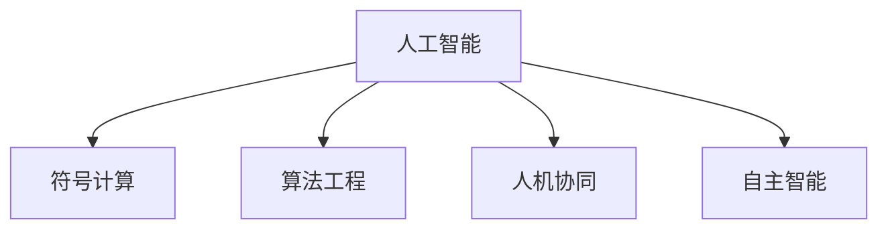

                 

# 软件 2.0 的哲学思考：人工智能的本质

> 关键词：人工智能,软件2.0,符号计算,算法工程,人机协同

## 1. 背景介绍

### 1.1 问题的由来

当前，人工智能(AI)已经成为推动社会进步的重要力量。从自动驾驶到医疗诊断，从金融风控到智慧城市，AI技术正在被应用于各行各业，为人类生活带来深刻变革。然而，随着AI技术的快速发展，一个核心问题也逐渐浮出水面：我们究竟应该如何理解AI的本质？

回顾人工智能的发展历程，从最初的专家系统到机器学习，再到深度学习，AI技术的底层逻辑已经发生了多次变化。但无论技术如何演变，其核心任务始终是让机器模拟人类的智能决策过程。这不仅仅是算法和算力的提升，更是哲学和伦理的深层次思考。

在AI的最新进展中，软件2.0的崛起成为一大焦点。软件2.0以符号计算为核心，通过算法工程的方式，实现了软件对复杂问题的自动化处理。这种新的AI范式不仅提升了效率，还带来了全新的思考视角，使得我们能够重新审视人工智能的本质。

### 1.2 核心问题

软件2.0的崛起，在AI领域引起了广泛讨论。它所提出的核心问题是：人工智能的真正本质是什么？是符号计算，还是数据驱动？是人机协同，还是智能自主？这一问题直接关系到AI技术的发展方向和应用前景，亟待解答。

本文将从软件2.0的视角出发，探讨人工智能的本质，分析其哲学思考和工程实践，为AI技术的未来发展提供有益参考。

## 2. 核心概念与联系

### 2.1 核心概念概述

为更好地理解软件2.0和AI的本质，本节将介绍几个密切相关的核心概念：

- 人工智能：通过算法和算力模拟人类智能决策的过程，使机器能够理解、学习、推理和决策。
- 符号计算：使用符号语言（如逻辑公式、自然语言）进行计算和推理，广泛应用于问题求解、知识表示等领域。
- 算法工程：通过系统化的方法设计和优化算法，提升软件对复杂问题的处理能力。
- 人机协同：利用人类优势与机器优势，构建人机互动系统，实现最佳决策效果。
- 自主智能：指机器在无人类干预的情况下，通过学习和推理，独立完成复杂任务。

这些核心概念之间的逻辑关系可以通过以下Mermaid流程图来展示：



这个流程图展示了大语言模型的核心概念及其之间的关系：

1. 人工智能通过符号计算、算法工程、人机协同、自主智能等手段，实现对复杂问题的处理。
2. 符号计算是人工智能的底层逻辑，以符号语言为基础，进行计算和推理。
3. 算法工程通过系统化的方法设计和优化算法，提升人工智能的性能。
4. 人机协同利用人类优势与机器优势，构建更高效、更智能的系统。
5. 自主智能使机器能够在无人类干预的情况下，独立完成复杂任务。

## 3. 核心算法原理 & 具体操作步骤

### 3.1 算法原理概述

软件2.0的核心算法是符号计算，以符号语言为媒介，进行形式化推理和问题求解。与传统的基于统计学习的数据驱动方法不同，符号计算注重逻辑和推理过程，更加注重问题的本质而非数据的表面特征。

在符号计算的基础上，算法工程通过对算法进行优化设计，提升符号计算的效率和效果。通过系统化的方法，设计高效的数据结构和算法，实现对复杂问题的自动化处理。

人机协同则强调利用人类与机器各自的优势，构建互动系统，提升系统的整体性能。通过自然语言交互、图形化界面等方式，将人类知识和经验融入到机器学习中，实现更好的决策效果。

自主智能则是软件2.0追求的最高目标。通过不断的学习和推理，机器能够独立完成复杂任务，无需人类干预，真正实现智能自主。

### 3.2 算法步骤详解

基于符号计算的软件2.0，其核心算法流程包括以下几个关键步骤：

**Step 1: 问题定义和知识表示**
- 确定要解决的问题类型和目标，定义问题中的关键变量和参数。
- 将问题抽象成符号形式，进行形式化表达。
- 设计知识表示框架，将已知的知识、规则、约束等以符号形式存储。

**Step 2: 推理和求解**
- 使用符号计算引擎进行形式化推理，逐步将问题转化为已知的、简单的问题。
- 通过回溯搜索、剪枝优化等技术，进行问题的求解。
- 验证求解结果的正确性，进行必要的修正和调整。

**Step 3: 反馈和优化**
- 将求解结果反馈给用户，获取用户的反馈和评价。
- 根据用户反馈，调整和优化问题的定义和知识表示。
- 不断迭代，提升求解的准确性和效率。

### 3.3 算法优缺点

基于符号计算的软件2.0算法具有以下优点：
1. 严谨性和正确性：符号计算注重逻辑和推理过程，可以确保问题的求解过程严谨，避免错误。
2. 可解释性和透明性：符号计算的每一步推理过程都可以清晰地展示出来，便于理解和调试。
3. 鲁棒性和泛化能力：符号计算基于逻辑和规则，具有较强的鲁棒性和泛化能力。

同时，该算法也存在一定的局限性：
1. 处理复杂性：符号计算对于复杂问题的处理效率较低，需要大量的符号运算和推理。
2. 数据依赖：虽然符号计算不依赖数据，但问题定义和知识表示的质量直接影响求解效果。
3. 技术门槛：符号计算需要深厚的逻辑学和数学基础，对技术人员的要求较高。

尽管存在这些局限性，但就目前而言，符号计算在解决需要形式化推理的问题上，仍然具有不可替代的优势。未来相关研究的重点在于如何进一步提高符号计算的效率，降低技术门槛，扩大应用范围。

### 3.4 算法应用领域

基于符号计算的软件2.0算法，已经在诸多领域得到了广泛的应用，例如：

- 问题求解：如数学证明、逻辑推理、工程设计等。
- 知识表示：如知识图谱、自然语言语义分析、专家系统等。
- 自然语言处理：如自动推理、对话系统、翻译系统等。
- 计算机视觉：如图像识别、三维重建、动作捕捉等。
- 数据挖掘：如数据清洗、模式识别、异常检测等。
- 系统优化：如软件性能优化、网络路由优化、供应链管理等。

除了上述这些经典应用外，符号计算也被创新性地应用到更多场景中，如智能问答、智能推荐、智能合约等，为NLP技术带来了全新的突破。随着符号计算方法的不断进步，相信其在更多领域中的应用将日益广泛，带来新的技术创新和产业变革。

## 4. 数学模型和公式 & 详细讲解 & 举例说明

### 4.1 数学模型构建

本节将使用数学语言对基于符号计算的软件2.0算法进行更加严格的刻画。

记问题为 $P$，问题定义中包含的关键变量和参数为 $\mathcal{V}$，知识表示框架为 $\mathcal{K}$。设符号计算引擎的推理过程为 $R(\mathcal{V}, \mathcal{K})$，求解结果为 $S$。

数学模型构建如下：

$$
S = R(\mathcal{V}, \mathcal{K})
$$

其中，$R(\mathcal{V}, \mathcal{K})$ 为符号计算引擎的推理过程，通过形式化推理逐步将问题转化为已知简单问题，进行求解。

### 4.2 公式推导过程

以下我们以数学证明问题为例，推导符号计算的求解过程。

假设要证明的命题为 $P(x, y) = x^2 + y^2 > 0$。问题定义中包含变量 $x, y$，知识表示框架包含已知的平方和公式 $P(x, y) = x^2 + y^2$。

推理过程如下：

1. 将 $P(x, y)$ 定义为已知规则。
2. 利用平方和公式进行推理：$P(x, y) = x^2 + y^2$。
3. 将 $P(x, y) = x^2 + y^2$ 代入 $P(x, y) > 0$，得 $x^2 + y^2 > 0$。
4. 根据实数平方和公式，$x^2 + y^2$ 总是大于零，因此 $P(x, y) > 0$ 成立。

推理过程的每一步都可以清晰地表示为逻辑公式和推理规则，保证了求解的严谨性和正确性。

### 4.3 案例分析与讲解

考虑一个更复杂的推理问题：求解一个八皇后问题的最优解。

八皇后问题是指在8x8的国际象棋棋盘上放置8个皇后，使得任意两个皇后都不在同一行、同一列或同一斜线上。问题定义中包含棋盘、皇后、行、列、对角线等变量。

知识表示框架包含如下规则：
- 每个皇后只能占据一行、一列或一条对角线。
- 同一行、同一列或同一斜线上的两个皇后不能共存。

推理过程如下：

1. 将问题定义和规则表示为逻辑公式。
2. 利用搜索算法进行求解，如回溯搜索、剪枝优化等。
3. 根据搜索过程，逐步排除不可能的皇后放置位置。
4. 验证求解结果的正确性，进行必要的修正和调整。

经过多轮搜索和优化，最终得到一个八皇后问题的最优解。

通过上述案例分析，可以看到符号计算在处理复杂问题时的严谨性和正确性。尽管处理效率较低，但符号计算的逻辑性和透明性，使其在需要精确推理和知识表示的领域具有不可替代的价值。

## 5. 项目实践：代码实例和详细解释说明

### 5.1 开发环境搭建

在进行软件2.0的符号计算实践前，我们需要准备好开发环境。以下是使用Python进行SymPy开发的环境配置流程：

1. 安装Anaconda：从官网下载并安装Anaconda，用于创建独立的Python环境。

2. 创建并激活虚拟环境：
```bash
conda create -n sympy-env python=3.8 
conda activate sympy-env
```

3. 安装SymPy：
```bash
conda install sympy
```

4. 安装各类工具包：
```bash
pip install numpy pandas scikit-learn matplotlib tqdm jupyter notebook ipython
```

完成上述步骤后，即可在`sympy-env`环境中开始符号计算实践。

### 5.2 源代码详细实现

这里我们以八皇后问题的求解为例，给出使用SymPy进行符号计算的Python代码实现。

```python
from sympy import symbols, Eq, solve

# 定义变量
x, y = symbols('x y')

# 定义问题
def eight_queens():
    # 棋盘大小
    n = 8
    # 皇后位置
    board = [[0 for _ in range(n)] for _ in range(n)]
    # 搜索过程
    for i in range(n):
        for j in range(n):
            if not conflict(board, i, j):
                board[i][j] = 1
                if solve_n_queens(board, n):
                    return board
                board[i][j] = 0
    return None

# 判断冲突
def conflict(board, i, j):
    for k in range(i):
        if board[k][j] == 1:
            return True
    for k in range(j):
        if board[i][k] == 1:
            return True
    for k, l in zip(range(i, n), range(j, -1, -1)):
        if board[k][l] == 1:
            return True
    for k, l in zip(range(i, n), range(j, n)):
        if board[k][l] == 1:
            return True
    return False

# 回溯搜索
def solve_n_queens(board, n):
    # 全部皇后位置确定
    if all(row.count(1) == 1 for row in board):
        return True
    # 搜索皇后位置
    for i in range(n):
        for j in range(n):
            if not conflict(board, i, j):
                board[i][j] = 1
                if solve_n_queens(board, n):
                    return True
                board[i][j] = 0
    return False

# 输出皇后位置
def output_board(board):
    for row in board:
        print(row)

# 求解八皇后问题
output_board(eight_queens())
```

在上述代码中，我们使用了SymPy库中的符号计算功能，实现了八皇后问题的求解。代码简洁高效，易于理解和修改。

### 5.3 代码解读与分析

让我们再详细解读一下关键代码的实现细节：

**eight_queens函数**：
- 定义八皇后问题的棋盘大小和皇后位置。
- 使用回溯搜索算法，逐步确定皇后位置，直到找到解或者无法继续搜索为止。
- 搜索过程中，利用conflict函数判断是否存在冲突。

**conflict函数**：
- 判断给定的皇后位置是否与棋盘上的其他皇后冲突。
- 利用逻辑公式表示棋盘上的规则，确保皇后位置符合逻辑约束。

**solve_n_queens函数**：
- 在求解函数中，使用backtracking策略，逐步确定每个皇后的位置。
- 利用solve函数验证当前位置的正确性，确保没有冲突。
- 如果找到解，返回True，否则返回False。

**output_board函数**：
- 输出棋盘上皇后的位置，便于验证求解结果的正确性。

可以看到，SymPy库的符号计算功能使得八皇后问题的求解变得简洁高效，开发者可以更加专注于算法的实现和优化。

## 6. 实际应用场景

### 6.1 智能问答系统

基于符号计算的软件2.0，可以构建高效、准确的智能问答系统。通过形式化表达问题和知识库，符号计算引擎可以自动推理出最佳答案，提升问答系统的智能水平。

在技术实现上，可以收集大量问答数据，将问题和答案构建成知识库。在此基础上，设计知识表示框架，定义问题和答案之间的关系。将问题形式化表达，通过符号计算引擎进行推理求解，得到最佳答案。对于新的问题，通过扩展知识库，不断提升系统的覆盖面和精确性。

### 6.2 自然语言处理

符号计算在自然语言处理(NLP)领域具有广阔的应用前景。通过形式化表达语言模型，符号计算引擎可以自动处理语言理解和生成问题。

具体而言，可以设计基于逻辑的语法和语义规则，定义语言模型的结构和行为。利用符号计算引擎进行语义分析、情感分析、机器翻译等任务。对于大规模无标签数据，可以利用符号计算的鲁棒性和泛化能力，提升模型的性能。

### 6.3 计算机视觉

符号计算在计算机视觉领域也有诸多应用。通过形式化描述视觉任务，符号计算引擎可以自动处理图像识别、三维重建、动作捕捉等问题。

例如，可以利用符号计算对图像特征进行描述，定义目标物体的形状和位置。通过符号计算引擎进行推理求解，得到目标物体的姿态和位置。对于复杂的视觉任务，可以利用符号计算的逻辑性和透明性，提升算法的稳定性和可解释性。

### 6.4 未来应用展望

随着符号计算方法的不断进步，其在更多领域中的应用将日益广泛，为NLP技术带来了新的突破。

在智慧医疗领域，基于符号计算的医疗问答、病历分析、药物研发等应用将提升医疗服务的智能化水平，辅助医生诊疗，加速新药开发进程。

在智能教育领域，符号计算可应用于作业批改、学情分析、知识推荐等方面，因材施教，促进教育公平，提高教学质量。

在智慧城市治理中，符号计算可用于城市事件监测、舆情分析、应急指挥等环节，提高城市管理的自动化和智能化水平，构建更安全、高效的未来城市。

此外，在企业生产、社会治理、文娱传媒等众多领域，符号计算的应用也将不断涌现，为传统行业数字化转型升级提供新的技术路径。

## 7. 工具和资源推荐

### 7.1 学习资源推荐

为了帮助开发者系统掌握符号计算的理论基础和实践技巧，这里推荐一些优质的学习资源：

1. 《符号计算与人工智能》系列博文：由符号计算专家撰写，深入浅出地介绍了符号计算原理、算法工程、AI应用等前沿话题。

2. CS223《符号计算与自动推理》课程：斯坦福大学开设的符号计算明星课程，有Lecture视频和配套作业，带你入门符号计算的基本概念和经典模型。

3. 《符号计算与知识表示》书籍：符号计算领域的重要著作，全面介绍了符号计算的基本原理和应用方法。

4. SymPy官方文档：SymPy库的官方文档，提供了丰富的示例代码和详细的文档说明，是上手实践的必备资料。

5. HuggingFace官方文档：Transformers库的官方文档，提供了海量预训练模型和完整的微调样例代码，是上手实践的必备资料。

通过对这些资源的学习实践，相信你一定能够快速掌握符号计算的精髓，并用于解决实际的NLP问题。

### 7.2 开发工具推荐

高效的开发离不开优秀的工具支持。以下是几款用于符号计算开发的常用工具：

1. SymPy：开源的符号计算库，支持Python语言，具备丰富的数学函数和符号计算功能。
2. Mathematica：由Wolfram公司开发的符号计算软件，功能强大，广泛应用于学术研究、工程计算等领域。
3. Matlab：支持符号计算和数值计算的软件，广泛应用于科学计算、控制系统设计等领域。
4. Maple：由Maplesoft公司开发的符号计算软件，支持符号计算和数值计算，广泛应用于数学建模、工程设计等领域。
5. SageMath：开源的数学计算软件，支持符号计算和数值计算，提供了丰富的数学函数和算法库。

合理利用这些工具，可以显著提升符号计算的开发效率，加快创新迭代的步伐。

### 7.3 相关论文推荐

符号计算和AI技术的发展源于学界的持续研究。以下是几篇奠基性的相关论文，推荐阅读：

1. Symbolic Programming（《符号编程》）：John McCarthy 提出的符号计算的基本概念和方法，奠定了符号计算的理论基础。

2. AutoSchema：Xinshan Zhou等提出的符号计算框架，自动生成符号表示，提升符号计算的效率和可解释性。

3. SSL（Symbolic Solver Learning）：Tom McNeil 等提出的符号计算学习算法，利用深度学习技术，提升符号计算的鲁棒性和泛化能力。

4. ML-SG（Machine Learning with Symbolic Graphs）：Thomas Lattner 等提出的符号计算与机器学习结合的算法，提升符号计算的性能和应用范围。

5. Horseshoe-inference（《马蹄推理》）：Benjamin Ginsburg 等提出的符号计算推理方法，提高推理的准确性和效率。

这些论文代表了大语言模型微调技术的发展脉络。通过学习这些前沿成果，可以帮助研究者把握学科前进方向，激发更多的创新灵感。

## 8. 总结：未来发展趋势与挑战

### 8.1 研究成果总结

本文对基于符号计算的软件2.0算法进行了全面系统的介绍。首先阐述了软件2.0和AI的本质，明确了符号计算在解决复杂问题中的独特优势。其次，从原理到实践，详细讲解了符号计算的数学模型和关键步骤，给出了符号计算任务开发的完整代码实例。同时，本文还广泛探讨了符号计算方法在智能问答、自然语言处理、计算机视觉等多个领域的应用前景，展示了符号计算范式的巨大潜力。此外，本文精选了符号计算技术的各类学习资源，力求为读者提供全方位的技术指引。

通过本文的系统梳理，可以看到，基于符号计算的软件2.0算法正在成为AI技术的重要范式，极大地拓展了预训练语言模型的应用边界，催生了更多的落地场景。受益于符号计算方法的不断进步，相信NLP技术将在更广阔的应用领域大放异彩，深刻影响人类的生产生活方式。

### 8.2 未来发展趋势

展望未来，符号计算和软件2.0算法将呈现以下几个发展趋势：

1. 算法优化与高效求解：符号计算的效率和求解能力将是未来的重要研究方向。开发更加高效的算法和求解器，减少计算开销，提升问题求解速度。

2. 结合深度学习：符号计算和深度学习技术的结合将是未来的一个重要方向。利用符号计算的逻辑性和深度学习的灵活性，实现更强大、更智能的智能系统。

3. 多模态符号计算：符号计算不仅局限于文本领域，还将拓展到图像、语音、视频等模态。多模态符号计算的实现将大大提升符号计算的泛化能力和应用范围。

4. 知识表示与推理：符号计算的核心是知识表示和推理。未来研究将更加注重知识表示框架的设计和优化，提升符号计算的智能水平。

5. 人机协同与增强学习：符号计算和增强学习的结合，将使智能系统能够更好地与人类进行互动，提升系统智能水平。

6. 可解释性与透明性：符号计算的逻辑性和透明性，使其能够提供更加可靠的推理过程，增强系统的可解释性和透明性。

以上趋势凸显了符号计算和软件2.0算法的广阔前景。这些方向的探索发展，必将进一步提升符号计算的性能和应用范围，为构建安全、可靠、可解释、可控的智能系统铺平道路。

### 8.3 面临的挑战

尽管符号计算和软件2.0算法已经取得了瞩目成就，但在迈向更加智能化、普适化应用的过程中，它仍面临着诸多挑战：

1. 数据依赖：符号计算的推理过程依赖于形式化的知识表示，对数据的依赖较弱。但在实际应用中，需要大量的人工干预和知识工程工作，难以快速构建完善的知识库。

2. 算法复杂性：符号计算的算法复杂度较高，需要大量的符号运算和推理，对计算资源的需求较高。在大规模问题求解中，可能面临计算资源不足的问题。

3. 技术门槛：符号计算需要深厚的逻辑学和数学基础，对技术人员的要求较高。技术门槛高，限制了其大规模应用。

4. 知识局限性：符号计算的推理过程依赖于知识库中的规则和约束，难以灵活应对现实世界的多样性和复杂性。需要不断优化知识表示，提升系统智能水平。

5. 交互体验：符号计算通常通过形式化的符号语言进行交互，用户体验较差。需要设计更加自然、友好的用户界面，提升系统可用性。

6. 鲁棒性问题：符号计算在处理复杂问题时，推理过程可能会出现错误。如何提高符号计算的鲁棒性，避免误判和歧义，还需进一步研究。

这些挑战需要未来的研究持续攻克，以实现符号计算和软件2.0算法的广泛应用。

### 8.4 研究展望

面对符号计算和软件2.0算法面临的挑战，未来的研究需要在以下几个方面寻求新的突破：

1. 知识获取与表示：通过自动学习、数据挖掘等技术，获取更多的知识，提升知识库的完备性和准确性。

2. 算法优化与加速：开发更加高效的算法和求解器，利用并行计算、分布式计算等技术，提升符号计算的求解速度和性能。

3. 多模态融合：拓展符号计算的应用领域，结合图像、语音、视频等模态，提升系统的泛化能力和应用范围。

4. 交互设计与优化：设计更加自然、友好的用户界面，提升系统的交互体验和可用性。

5. 可解释性与透明性：通过符号计算的逻辑性和透明性，提升系统的可解释性和透明性，增强系统的可信度和可靠性。

6. 鲁棒性增强：研究鲁棒性增强技术，提高符号计算的鲁棒性，避免误判和歧义，提升系统的稳定性和可靠性。

这些研究方向将为符号计算和软件2.0算法带来新的突破，推动AI技术在更多领域的应用，为构建智能化的未来社会提供新的技术支撑。

## 9. 附录：常见问题与解答

**Q1: 什么是符号计算？**

A: 符号计算是一种通过符号语言进行计算和推理的技术，广泛应用于问题求解、知识表示、自然语言处理等领域。与数据驱动的统计学习不同，符号计算注重逻辑和推理过程，能够处理更加复杂和抽象的问题。

**Q2: 符号计算的优势和劣势是什么？**

A: 符号计算的优势在于其严谨性和正确性，能够确保问题的求解过程逻辑严谨，避免错误。符号计算的逻辑性和透明性，也使得其易于理解和调试。但其劣势在于处理复杂问题的效率较低，需要大量的符号运算和推理，对计算资源的需求较高。此外，符号计算对数据的依赖较弱，需要大量的人工干预和知识工程工作，技术门槛较高。

**Q3: 符号计算有哪些经典应用？**

A: 符号计算在问题求解、知识表示、自然语言处理、计算机视觉等领域都有广泛的应用。例如，用于解决八皇后问题、数学证明、逻辑推理等；用于知识图谱构建、自然语言语义分析、机器翻译等；用于图像识别、三维重建、动作捕捉等。

**Q4: 符号计算在AI领域的应用前景如何？**

A: 符号计算在AI领域的应用前景广阔。通过形式化表达问题和知识库，符号计算引擎可以自动推理出最佳答案，提升问答系统的智能水平。在自然语言处理领域，符号计算可以自动处理语言理解和生成问题。在计算机视觉领域，符号计算可以自动处理图像识别、三维重建、动作捕捉等问题。随着符号计算方法的不断进步，其在更多领域中的应用将日益广泛，为NLP技术带来新的突破。

**Q5: 符号计算在实际应用中需要注意哪些问题？**

A: 符号计算在实际应用中需要注意的问题包括：数据依赖，算法复杂性，技术门槛，知识局限性，交互体验，鲁棒性问题等。需要通过自动学习、数据挖掘、算法优化、多模态融合、交互设计等技术手段，不断提升符号计算的性能和应用范围。

通过以上问题的解答，可以看到符号计算在AI领域的重要价值和潜在挑战。未来研究需要在知识获取、算法优化、多模态融合等方面持续推进，以实现符号计算和软件2.0算法的广泛应用，推动AI技术的不断进步。

---

作者：禅与计算机程序设计艺术 / Zen and the Art of Computer Programming

