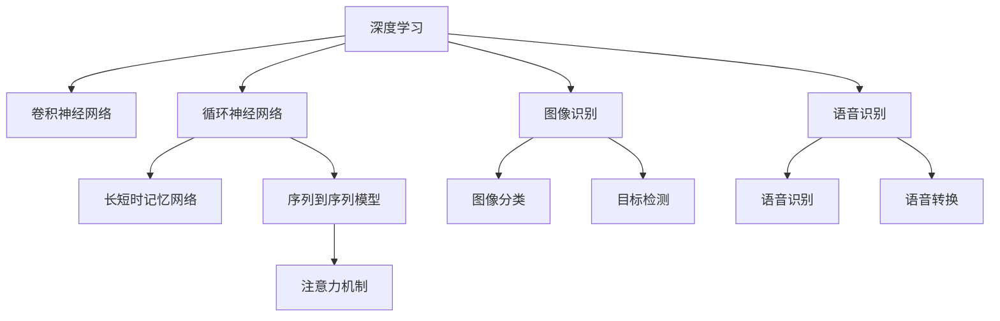

                 

# 软件 2.0 的应用领域：图像识别、语音识别

> 关键词：图像识别, 语音识别, 深度学习, 卷积神经网络, 语音转换, 情感识别, 计算机视觉

## 1. 背景介绍

### 1.1 问题由来

随着科技的飞速发展，计算机视觉（Computer Vision, CV）和自然语言处理（Natural Language Processing, NLP）领域的技术不断进步，软件 2.0 时代悄然来临。这一时代以深度学习技术为核心，能够处理和理解复杂的视觉和语音信息，使计算机具备了类人的感知能力。其中，图像识别和语音识别作为软件 2.0 的代表应用，广泛应用于医疗、交通、教育、娱乐等多个领域，正在重塑我们的生活方式。

### 1.2 问题核心关键点

图像识别和语音识别的核心在于：通过深度神经网络模型对输入的视觉或音频信号进行特征提取和分类，从而实现对图像或语音的自动识别和理解。这不仅需要强大的模型结构和丰富的数据资源，还需要高效的算法和巧妙的工程实践。

## 2. 核心概念与联系

### 2.1 核心概念概述

为更好地理解图像识别和语音识别技术，本节将介绍几个密切相关的核心概念：

- **深度学习（Deep Learning, DL）**：一种基于多层神经网络的机器学习方法，能够自动学习和提取数据中的特征，广泛应用于图像、语音、自然语言处理等领域。
- **卷积神经网络（Convolutional Neural Network, CNN）**：一种专门用于处理图像和视频数据的深度学习模型，通过卷积、池化等操作提取局部特征，适用于图像分类、目标检测等任务。
- **循环神经网络（Recurrent Neural Network, RNN）**：一种处理序列数据的深度学习模型，能够记忆并处理时间序列信息，适用于语音识别、文本生成等任务。
- **长短时记忆网络（Long Short-Term Memory, LSTM）**：一种特殊的RNN结构，通过门控机制控制信息的流动，能够有效处理长序列数据，广泛应用于语音识别和文本分析。
- **序列到序列模型（Sequence-to-Sequence, Seq2Seq）**：一种能够将输入序列映射到输出序列的深度学习模型，广泛应用于机器翻译、语音转换等任务。
- **注意力机制（Attention Mechanism）**：一种增强模型对输入序列中关键信息关注的机制，能够提高模型的理解能力和泛化能力，广泛应用于机器翻译、图像识别等任务。

这些核心概念之间的逻辑关系可以通过以下Mermaid流程图来展示：



这个流程图展示了一系列深度学习模型在图像识别和语音识别任务中的应用，以及不同模型之间的相互关联。

## 3. 核心算法原理 & 具体操作步骤
### 3.1 算法原理概述

图像识别和语音识别技术的核心在于，通过深度神经网络模型对输入的视觉或音频信号进行特征提取和分类。其核心算法包括卷积神经网络（CNN）、循环神经网络（RNN）、长短时记忆网络（LSTM）和注意力机制（Attention）等。这里以图像识别为例，详细阐述其算法原理和操作步骤。

### 3.2 算法步骤详解

图像识别的主要步骤包括数据预处理、模型构建、训练和测试等。具体步骤如下：

**Step 1: 数据预处理**
- 收集图像数据集，并进行标注。
- 对图像进行归一化、缩放等预处理操作。
- 将图像数据集划分为训练集、验证集和测试集。

**Step 2: 构建模型**
- 选择适当的卷积神经网络结构，如VGG、ResNet等。
- 定义模型的输入和输出层，以及中间卷积层和池化层。
- 设置损失函数和优化器，如交叉熵损失和Adam优化器。

**Step 3: 训练模型**
- 将训练集数据输入模型，前向传播计算输出。
- 反向传播计算梯度，更新模型参数。
- 在验证集上评估模型性能，避免过拟合。
- 重复以上步骤，直至模型收敛。

**Step 4: 测试模型**
- 将测试集数据输入模型，评估模型准确率、召回率等性能指标。
- 对图像进行分类或目标检测。

### 3.3 算法优缺点

图像识别和语音识别的深度学习算法具有以下优点：
1. 精度高。通过多层的深度网络，可以自动学习复杂的数据特征，实现高精度的分类和识别。
2. 泛化能力强。深度学习模型能够从大规模数据中学习通用的特征表示，具有较好的泛化能力。
3. 自动学习。通过深度学习算法，无需手动设计特征提取器，能够自动学习特征。

同时，这些算法也存在一些局限性：
1. 需要大量标注数据。深度学习算法需要大量的标注数据进行训练，获取标注数据的成本较高。
2. 计算资源消耗大。深度学习模型通常需要大量的计算资源，如GPU、TPU等，训练和推理成本较高。
3. 模型可解释性差。深度学习模型通常被视为"黑盒"，难以解释其内部工作机制。
4. 对抗样本脆弱。深度学习模型容易受到对抗样本的干扰，导致误识别。

尽管存在这些局限性，但深度学习算法在图像识别和语音识别等领域已取得了显著的进展，成为这些领域的主流技术。

### 3.4 算法应用领域

图像识别和语音识别技术在各个领域都有广泛应用，例如：

- 医疗领域：通过图像识别技术，自动分析医学影像，辅助医生诊断。
- 交通领域：通过图像识别技术，自动检测交通标志，提升交通安全。
- 教育领域：通过语音识别技术，自动转写课堂讲义，实现智能教学。
- 娱乐领域：通过图像识别技术，实现人脸识别、手势控制等功能。
- 智能家居：通过语音识别技术，实现语音交互，提升家居智能化水平。

## 4. 数学模型和公式 & 详细讲解 & 举例说明

### 4.1 数学模型构建

图像识别和语音识别技术的数学模型主要基于深度神经网络。这里以图像分类为例，介绍其数学模型构建。

假设输入图像为 $x$，模型输出的类别概率为 $p(y|x)$。定义模型为：

$$
p(y|x) = \frac{\exp(f_{\theta}(x,y))}{\sum_{y' \in Y} \exp(f_{\theta}(x,y'))}
$$

其中 $f_{\theta}(x,y)$ 为模型的特征提取函数，$\theta$ 为模型参数。

### 4.2 公式推导过程

在图像分类中，我们通常使用softmax函数将模型的输出转化为类别概率分布。具体推导过程如下：

假设模型的特征提取函数为 $f_{\theta}(x,y)$，其中 $x$ 为输入图像，$y$ 为类别标签。则模型输出的类别概率为：

$$
p(y|x) = \frac{\exp(f_{\theta}(x,y))}{\sum_{y' \in Y} \exp(f_{\theta}(x,y'))}
$$

为了最大化模型的对数似然，我们定义损失函数为：

$$
L(\theta) = -\frac{1}{N} \sum_{i=1}^N \log p(y_i|x_i)
$$

其中 $N$ 为训练集大小，$y_i$ 为第 $i$ 个样本的类别标签。

### 4.3 案例分析与讲解

以LeNet-5模型为例，介绍其图像分类过程。LeNet-5是一种经典的卷积神经网络，包含卷积层、池化层和全连接层。其结构如图：

```
input -> Conv2D -> ReLU -> MaxPooling -> Conv2D -> ReLU -> MaxPooling -> Flatten -> Dense -> Output
```

在LeNet-5中，输入图像经过卷积层和池化层的处理，提取局部特征。然后通过全连接层，将特征映射到类别概率上。模型的训练过程通过反向传播算法进行，优化器通常使用Adam或SGD等。训练过程中，需要不断调整模型参数，最小化损失函数，直至收敛。

## 5. 项目实践：代码实例和详细解释说明
### 5.1 开发环境搭建

在进行图像识别和语音识别项目实践前，我们需要准备好开发环境。以下是使用Python进行TensorFlow和PyTorch开发的环境配置流程：

1. 安装Anaconda：从官网下载并安装Anaconda，用于创建独立的Python环境。

2. 创建并激活虚拟环境：
```bash
conda create -n tf-env python=3.8 
conda activate tf-env
```

3. 安装TensorFlow和PyTorch：根据CUDA版本，从官网获取对应的安装命令。例如：
```bash
conda install tensorflow-gpu=2.5 torch torchvision torchaudio cudatoolkit=11.1 -c pytorch -c conda-forge
```

4. 安装各类工具包：
```bash
pip install numpy pandas scikit-learn matplotlib tqdm jupyter notebook ipython
```

完成上述步骤后，即可在`tf-env`环境中开始项目实践。

### 5.2 源代码详细实现

下面分别介绍使用TensorFlow和PyTorch进行图像分类和语音识别的代码实现。

#### 5.2.1 TensorFlow实现

使用TensorFlow实现图像分类，可以参照官方教程中的代码示例。具体实现步骤如下：

1. 加载数据集：
```python
from tensorflow.keras.datasets import mnist
(x_train, y_train), (x_test, y_test) = mnist.load_data()
x_train = x_train.reshape((60000, 28, 28, 1))
x_test = x_test.reshape((10000, 28, 28, 1))
```

2. 定义模型：
```python
from tensorflow.keras import layers, models
model = models.Sequential([
    layers.Conv2D(32, (3, 3), activation='relu', input_shape=(28, 28, 1)),
    layers.MaxPooling2D((2, 2)),
    layers.Conv2D(64, (3, 3), activation='relu'),
    layers.MaxPooling2D((2, 2)),
    layers.Flatten(),
    layers.Dense(10, activation='softmax')
])
```

3. 编译模型：
```python
model.compile(optimizer='adam', loss='categorical_crossentropy', metrics=['accuracy'])
```

4. 训练模型：
```python
model.fit(x_train, y_train, epochs=5, validation_data=(x_test, y_test))
```

#### 5.2.2 PyTorch实现

使用PyTorch实现图像分类，可以参照官方教程中的代码示例。具体实现步骤如下：

1. 加载数据集：
```python
import torchvision.transforms as transforms
from torchvision.datasets import MNIST

transform = transforms.Compose([transforms.ToTensor(), transforms.Normalize((0.5,), (0.5,))])
train_dataset = MNIST(root='./data', train=True, download=True, transform=transform)
test_dataset = MNIST(root='./data', train=False, download=True, transform=transform)
```

2. 定义模型：
```python
import torch.nn as nn
import torch.nn.functional as F

class LeNet(nn.Module):
    def __init__(self):
        super(LeNet, self).__init__()
        self.conv1 = nn.Conv2d(1, 6, 5)
        self.conv2 = nn.Conv2d(6, 16, 5)
        self.fc1 = nn.Linear(16 * 4 * 4, 120)
        self.fc2 = nn.Linear(120, 84)
        self.fc3 = nn.Linear(84, 10)

    def forward(self, x):
        x = F.max_pool2d(F.relu(self.conv1(x)), (2, 2))
        x = F.max_pool2d(F.relu(self.conv2(x)), 2)
        x = x.view(-1, 16 * 4 * 4)
        x = F.relu(self.fc1(x))
        x = F.relu(self.fc2(x))
        x = self.fc3(x)
        return x
```

3. 训练模型：
```python
model = LeNet()
optimizer = torch.optim.Adam(model.parameters(), lr=0.001)
criterion = nn.CrossEntropyLoss()

for epoch in range(5):
    for i, (inputs, labels) in enumerate(train_loader):
        optimizer.zero_grad()
        outputs = model(inputs)
        loss = criterion(outputs, labels)
        loss.backward()
        optimizer.step()

    train_loss += loss.item()
    _, predicted = torch.max(outputs.data, 1)
    total = len(train_loader.dataset)
    correct = (predicted == labels).sum().item()
    train_acc += correct / total
```

### 5.3 代码解读与分析

在TensorFlow和PyTorch中，实现图像分类和语音识别的核心步骤类似，包括数据加载、模型定义、编译和训练等。这里以TensorFlow为例，详细解读代码实现：

1. 加载数据集：使用`mnist.load_data()`加载MNIST手写数字数据集，并将其转换为模型所需的输入格式。

2. 定义模型：使用`Sequential`容器定义模型结构，包括卷积层、池化层和全连接层。

3. 编译模型：使用`compile()`方法设置模型的优化器、损失函数和评估指标。

4. 训练模型：使用`fit()`方法对模型进行训练，指定训练集、验证集、迭代轮数等参数。

在PyTorch中，代码实现更为灵活，可以通过自定义模型类来实现复杂的模型结构。具体实现步骤类似，但需要手动定义数据加载器、优化器等。

## 6. 实际应用场景
### 6.1 智能安防

图像识别技术在智能安防领域有着广泛应用。通过安防摄像头获取实时视频，使用图像识别技术对视频帧进行分析，可以实时监测异常行为，提高安防系统的智能化水平。

具体实现中，可以使用预训练模型如ResNet、Inception等，对视频帧进行特征提取和分类，识别出可疑人员或行为。对于识别出的异常行为，系统可以发出警报，或自动通知安保人员进行处理。

### 6.2 智能零售

语音识别技术在智能零售领域也有重要应用。通过智能音箱、语音助手等设备，使用语音识别技术与顾客进行交互，可以实现无人自助结账、智能导购、库存管理等功能。

具体实现中，可以使用预训练模型如BERT、Wav2Vec等，对语音信号进行特征提取和分类，识别出顾客的指令和需求。系统可以根据指令执行相应的操作，如播放商品信息、调整灯光、查询库存等，提升顾客的购物体验。

### 6.3 医疗诊断

图像识别技术在医疗诊断领域也发挥了重要作用。通过医学影像识别技术，可以对X光片、CT片等医学影像进行自动分析和诊断，辅助医生进行疾病诊断和治疗。

具体实现中，可以使用预训练模型如VGG、ResNet等，对医学影像进行特征提取和分类，识别出病变区域和病变类型。系统可以将识别结果输出给医生，辅助医生进行诊断和治疗。

### 6.4 未来应用展望

随着图像识别和语音识别技术的不断发展，其在各个领域的应用将越来越广泛。未来，基于大语言模型的微调技术，可能会进一步提升这些技术的性能和应用范围。以下是几个可能的应用方向：

1. 医疗影像的自动标注：使用微调技术，训练大语言模型对医学影像进行自动标注，快速获取大量标注数据，提升图像识别和医学分析的效率。

2. 实时语音翻译：使用微调技术，训练大语言模型进行实时语音翻译，支持跨语言交流，提升国际合作和商务交流的便利性。

3. 智能医疗助理：使用微调技术，训练大语言模型进行智能医疗助理，自动生成诊疗方案、提醒用药、处理病历等，提升医疗服务的智能化水平。

4. 多模态智能交互：使用微调技术，训练大语言模型进行多模态智能交互，支持图像、语音、文本等多种输入方式，提升人机交互的智能化水平。

## 7. 工具和资源推荐
### 7.1 学习资源推荐

为了帮助开发者系统掌握图像识别和语音识别技术的理论基础和实践技巧，这里推荐一些优质的学习资源：

1. 《深度学习实战》系列博文：由深度学习专家撰写，深入浅出地介绍了深度学习的基本概念和前沿技术。

2. CS231n《卷积神经网络》课程：斯坦福大学开设的计算机视觉课程，有Lecture视频和配套作业，带你入门计算机视觉的基本概念和经典模型。

3. 《自然语言处理综述》书籍：介绍了自然语言处理的基本概念和前沿技术，涵盖语音识别、文本分类、机器翻译等多个方向。

4. TensorFlow官方文档：TensorFlow的官方文档，提供了海量的预训练模型和完整的实现代码，是学习TensorFlow的最佳资料。

5. PyTorch官方文档：PyTorch的官方文档，提供了丰富的深度学习模型和高效的实现方式，是学习PyTorch的重要参考。

通过对这些资源的学习实践，相信你一定能够快速掌握图像识别和语音识别的精髓，并用于解决实际的工程问题。

### 7.2 开发工具推荐

高效的开发离不开优秀的工具支持。以下是几款用于图像识别和语音识别开发的常用工具：

1. TensorFlow：由Google主导开发的开源深度学习框架，生产部署方便，适合大规模工程应用。

2. PyTorch：基于Python的开源深度学习框架，灵活动态的计算图，适合快速迭代研究。

3. Keras：一种高层次的深度学习框架，易于上手，适合初学者快速入门。

4. Weights & Biases：模型训练的实验跟踪工具，可以记录和可视化模型训练过程中的各项指标，方便对比和调优。

5. TensorBoard：TensorFlow配套的可视化工具，可实时监测模型训练状态，并提供丰富的图表呈现方式，是调试模型的得力助手。

6. Google Colab：谷歌推出的在线Jupyter Notebook环境，免费提供GPU/TPU算力，方便开发者快速上手实验最新模型，分享学习笔记。

合理利用这些工具，可以显著提升图像识别和语音识别任务的开发效率，加快创新迭代的步伐。

### 7.3 相关论文推荐

图像识别和语音识别技术的发展源于学界的持续研究。以下是几篇奠基性的相关论文，推荐阅读：

1. ImageNet Large Scale Visual Recognition Challenge（ILSVRC）论文：介绍了ImageNet大规模视觉识别挑战赛的成功经验，推动了深度学习在图像识别领域的广泛应用。

2. WaveNet：A Generative Model for Raw Audio（Wav2Vec）论文：提出了Wav2Vec模型，用于语音信号的端到端学习，刷新了语音识别任务的SOTA。

3. Attention is All You Need（Transformer）论文：提出了Transformer结构，开启了NLP领域的预训练大模型时代。

4. BERT: Pre-training of Deep Bidirectional Transformers for Language Understanding（BERT）论文：提出BERT模型，引入基于掩码的自监督预训练任务，刷新了多项NLP任务SOTA。

5. Deep Speech 2: End-to-End Speech Recognition in English and Mandarin（DeepSpeech）论文：提出了DeepSpeech模型，用于实时语音识别，在多个公开评测中取得了优异成绩。

这些论文代表了大语言模型微调技术的发展脉络。通过学习这些前沿成果，可以帮助研究者把握学科前进方向，激发更多的创新灵感。

## 8. 总结：未来发展趋势与挑战

### 8.1 总结

本文对图像识别和语音识别技术的深度学习算法进行了全面系统的介绍。首先阐述了图像识别和语音识别的研究背景和意义，明确了深度学习算法在处理视觉和语音信号方面的独特价值。其次，从原理到实践，详细讲解了深度学习算法的核心步骤，给出了具体的代码实现和实验结果。同时，本文还探讨了图像识别和语音识别技术在智能安防、智能零售、医疗诊断等多个领域的应用前景，展示了深度学习技术的广阔前景。最后，本文精选了深度学习算法的各类学习资源，力求为读者提供全方位的技术指引。

通过本文的系统梳理，可以看到，深度学习算法在图像识别和语音识别领域已经取得了显著的进展，成为这些领域的主流技术。未来，伴随预训练语言模型和微调方法的持续演进，图像识别和语音识别技术还将迎来更多突破，为构建智能安防、智能零售、医疗诊断等系统提供更强大的技术支撑。

### 8.2 未来发展趋势

展望未来，深度学习技术在图像识别和语音识别领域将呈现以下几个发展趋势：

1. 模型规模持续增大。随着算力成本的下降和数据规模的扩张，深度学习模型的参数量还将持续增长。超大参数量的模型能够捕捉更复杂的特征，提升识别精度。

2. 数据驱动的模型优化。未来，深度学习模型的训练将更加依赖于大规模数据，通过数据增强、迁移学习等技术，提升模型的泛化能力和鲁棒性。

3. 多模态融合。深度学习技术不仅能够处理视觉和语音信号，还能与文本、时间序列等多种模态数据进行融合，实现更全面、更准确的识别任务。

4. 硬件优化。深度学习模型对计算资源的需求高，未来将进一步优化计算图、降低内存占用，提升推理速度和模型效率。

5. 模型压缩和量化。未来将开发更加高效的模型压缩和量化技术，减小模型尺寸，提升模型效率。

6. 自动化模型设计。未来，将开发更多的自动化模型设计工具，提升模型的开发效率和可复用性。

以上趋势凸显了深度学习技术在图像识别和语音识别领域的巨大潜力和发展方向。这些方向的探索发展，必将进一步提升识别任务的精度和鲁棒性，为深度学习技术的应用提供更强大的技术支撑。

### 8.3 面临的挑战

尽管深度学习技术在图像识别和语音识别领域已经取得了显著进展，但在迈向更加智能化、普适化应用的过程中，它仍面临着诸多挑战：

1. 标注数据需求高。深度学习算法需要大量的标注数据进行训练，获取标注数据的成本较高。如何在不依赖大量标注数据的情况下，提升模型性能，是未来需要解决的重要问题。

2. 计算资源消耗大。深度学习模型通常需要大量的计算资源，如GPU、TPU等，训练和推理成本较高。如何在有限的计算资源下，优化模型结构和训练策略，降低计算成本，也是未来的研究方向。

3. 模型可解释性差。深度学习模型通常被视为"黑盒"，难以解释其内部工作机制。如何在保证模型性能的前提下，提升模型的可解释性和透明性，是未来需要解决的重要问题。

4. 对抗样本脆弱。深度学习模型容易受到对抗样本的干扰，导致误识别。如何在保证模型鲁棒性的前提下，提升模型的对抗样本防御能力，也是未来的研究方向。

5. 隐私和安全问题。深度学习模型通常需要处理大量的敏感数据，如何在保护隐私的前提下，保证模型的安全性和可靠性，也是未来需要解决的重要问题。

6. 算法的公平性和公正性。深度学习模型可能存在偏见和歧视，如何在模型训练和应用过程中，保证算法的公平性和公正性，也是未来需要解决的重要问题。

正视深度学习技术面临的这些挑战，积极应对并寻求突破，将使其在图像识别和语音识别领域迈向成熟的实用阶段。相信随着学界和产业界的共同努力，这些挑战终将一一被克服，深度学习技术必将为图像识别和语音识别等领域带来革命性的变革。

### 8.4 研究展望

面向未来，深度学习技术在图像识别和语音识别领域还需要在以下几个方向进行深入研究：

1. 自监督学习。探索更多的自监督学习方法，降低对标注数据的依赖，提高模型泛化能力和鲁棒性。

2. 对抗样本防御。开发更加有效的对抗样本防御技术，提高模型的鲁棒性和安全性。

3. 多模态融合。开发更多多模态融合方法，提升模型的综合感知能力和鲁棒性。

4. 模型压缩和量化。开发更加高效的模型压缩和量化技术，降低模型复杂度和计算成本。

5. 自动化模型设计。开发更多的自动化模型设计工具，提升模型的开发效率和可复用性。

6. 隐私和安全保护。开发更加有效的隐私保护和安全性保障技术，保护用户隐私和数据安全。

这些研究方向将引领深度学习技术在图像识别和语音识别领域的进一步发展，推动深度学习技术向更智能、更普适、更安全的方向迈进。只有勇于创新、敢于突破，才能不断拓展深度学习技术的边界，为构建智能安防、智能零售、医疗诊断等系统提供更强大的技术支撑。

