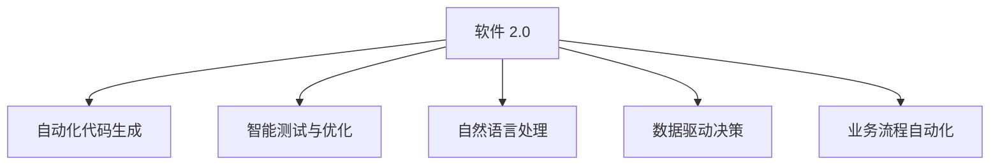

                 

## 1. 背景介绍

### 1.1 问题由来
随着人工智能技术的飞速发展，软件工程领域出现了新的分支——软件 2.0。软件 2.0 利用机器学习、自然语言处理等技术，将软件开发过程自动化，极大提升了开发效率和软件质量。然而，尽管其技术日趋成熟，要将这些前沿技术真正落地到实际应用中，仍面临着诸多挑战。

### 1.2 问题核心关键点
软件 2.0 的应用需要从实验室走向现实，具体来说：

1. 技术应用的复杂性：将多种先进技术进行集成和优化，以适应不同企业的需求。
2. 用户友好性：如何让复杂的技术易于使用，降低使用门槛，提升用户体验。
3. 业务适配性：如何将软件 2.0 技术融入企业现有业务流程中，实现高效协同。
4. 可扩展性和维护性：确保系统具有良好的扩展性和维护性，满足长期发展需求。
5. 性能和资源优化：优化系统性能，合理利用计算资源，确保高效运行。

### 1.3 问题研究意义
软件 2.0 技术的应用，对提升软件开发生产力、降低开发成本、加速创新迭代具有重要意义：

1. 提升开发效率：自动化代码生成、测试、优化等过程，大大缩短开发周期。
2. 提升软件质量：利用机器学习技术进行代码质量和性能分析，减少错误和漏洞。
3. 促进创新迭代：利用自然语言处理技术，快速构建和迭代原型，加速产品上市。
4. 实现数据驱动决策：利用大数据和深度学习技术，进行智能数据分析，指导业务决策。
5. 赋能数字化转型：支持企业在数字化转型过程中，提升自动化水平和智能决策能力。

## 2. 核心概念与联系

### 2.1 核心概念概述

为更好地理解软件 2.0 的应用，本节将介绍几个密切相关的核心概念：

- 软件 2.0：利用机器学习、自然语言处理、大数据等技术，提升软件开发效率、质量和智能化的技术。
- 自动化代码生成(Automatic Code Generation, ACG)：通过代码生成器自动生成代码片段，减少人工编码工作量。
- 智能测试与优化：利用机器学习算法，自动测试和优化代码质量，提升系统性能。
- 自然语言处理(Natural Language Processing, NLP)：使计算机能理解、解释、生成人类语言的技术。
- 数据驱动决策：利用大数据分析，指导企业决策，优化业务流程。
- 业务流程自动化：将软件 2.0 技术应用于企业业务流程中，实现智能化、自动化。

这些核心概念之间的逻辑关系可以通过以下Mermaid流程图来展示：



这个流程图展示了大语言模型的核心概念及其之间的关系：

1. 软件 2.0 通过自动化代码生成、智能测试、自然语言处理等技术，提升软件开发效率和质量。
2. 数据驱动决策通过大数据分析和机器学习，提供科学决策依据。
3. 业务流程自动化使软件 2.0 技术在企业业务流程中得到广泛应用。

## 3. 核心算法原理 & 具体操作步骤
### 3.1 算法原理概述

软件 2.0 技术的应用，核心在于如何将多种技术进行有机融合，形成智能化的软件开发和决策系统。以下是软件 2.0 技术应用的算法原理概述：

1. **自动化代码生成**：利用机器学习模型分析已有代码结构，自动生成相似功能的新代码。常见的算法包括基于规则的代码生成和基于神经网络的代码生成。
2. **智能测试与优化**：利用机器学习算法，自动生成测试用例，并进行代码质量分析和性能优化。常见的算法包括遗传算法、贝叶斯网络和强化学习。
3. **自然语言处理**：利用自然语言处理技术，解析用户需求、生成代码注释、文档和报告。常见的算法包括分词、句法分析、语义分析和生成模型。
4. **数据驱动决策**：利用大数据分析和机器学习，从历史数据中提取有价值的信息，辅助决策。常见的算法包括回归分析、分类算法、聚类算法和时序预测。
5. **业务流程自动化**：将软件 2.0 技术应用于企业业务流程中，实现自动化。常见的算法包括工作流自动化、机器人流程自动化和决策树。

### 3.2 算法步骤详解

软件 2.0 技术的实际应用步骤如下：

1. **需求分析与建模**：明确业务需求，建立软件开发和决策模型。
2. **数据收集与预处理**：收集相关数据，并进行清洗、归一化等预处理。
3. **模型训练与优化**：选择合适的机器学习模型，并进行训练和调优。
4. **系统实现与集成**：将训练好的模型应用到实际系统中，并进行集成和优化。
5. **系统测试与部署**：进行系统测试和性能评估，确保系统稳定运行，并逐步部署到生产环境。
6. **监控与维护**：对系统进行实时监控和维护，及时发现和解决问题，确保长期稳定运行。

### 3.3 算法优缺点

软件 2.0 技术的应用，具有以下优点：

1. 自动化程度高：通过自动化工具和算法，大幅提升开发效率和质量。
2. 智能化决策：利用机器学习和自然语言处理，提供科学决策依据。
3. 灵活适配性：针对不同企业需求，进行个性化定制。
4. 成本效益高：节省人力和开发成本，提升企业竞争力。

同时，软件 2.0 技术的应用也存在以下缺点：

1. 数据隐私和安全问题：大量数据收集和处理过程中，存在隐私泄露和数据安全风险。
2. 技术复杂度高：需要多种先进技术的有机结合，技术门槛较高。
3. 维护成本高：复杂系统的维护和升级需要大量人力和资源。
4. 结果可解释性不足：机器学习模型往往作为"黑盒"，难以解释其内部决策逻辑。
5. 性能瓶颈：处理大规模数据和高复杂度任务时，系统性能可能受限。

### 3.4 算法应用领域

软件 2.0 技术的应用领域广泛，包括但不限于：

- 软件开发与自动化：自动生成代码、智能测试、代码优化等。
- 自然语言处理与分析：文本分类、情感分析、机器翻译等。
- 数据科学与分析：大数据分析、数据挖掘、数据可视化等。
- 业务流程自动化：企业级业务流程自动化、决策支持系统等。
- 智能运维与监控：智能监控、故障预测、自动修复等。
- 工业智能与制造：智能制造、自动化生产、质量控制等。
- 医疗健康：智能诊断、医疗记录分析、健康管理等。
- 金融科技：智能投顾、风险管理、交易分析等。
- 教育培训：个性化学习推荐、智能评估、教学辅助等。

## 4. 数学模型和公式 & 详细讲解  
### 4.1 数学模型构建

软件 2.0 技术的实现，通常依赖于以下数学模型和公式：

- **机器学习模型**：常见的算法包括线性回归、决策树、支持向量机、随机森林、神经网络等。
- **自然语言处理模型**：常见的算法包括n-gram模型、词向量模型、Transformer模型等。
- **数据驱动决策模型**：常见的算法包括时间序列预测、分类算法、聚类算法等。

### 4.2 公式推导过程

以机器学习中的线性回归为例，推导其模型公式和损失函数：

设训练数据集为 $(x_1, y_1), (x_2, y_2), \ldots, (x_n, y_n)$，其中 $x_i$ 为自变量，$y_i$ 为因变量。假设 $y$ 与 $x$ 之间存在线性关系 $y = wx + b$，其中 $w$ 为模型参数，$b$ 为截距。

根据最小二乘法，模型参数 $w$ 和 $b$ 的求解过程如下：

$$
\hat{y} = wx + b
$$

$$
\mathcal{L}(w) = \frac{1}{2N}\sum_{i=1}^N(y_i - \hat{y}_i)^2
$$

其中，$\mathcal{L}(w)$ 为损失函数，$N$ 为样本数。

根据梯度下降算法，求解最优参数 $w$ 和 $b$ 的公式为：

$$
\frac{\partial \mathcal{L}(w)}{\partial w} = \frac{1}{N}\sum_{i=1}^N(x_i - \bar{x}) \hat{y}_i
$$

$$
\frac{\partial \mathcal{L}(w)}{\partial b} = \frac{1}{N}\sum_{i=1}^N(\hat{y}_i - \bar{y})
$$

其中，$\bar{x}$ 和 $\bar{y}$ 分别为样本的均值。

通过上述公式，即可使用机器学习算法对软件 2.0 系统进行训练和优化，实现自动化和智能化。

### 4.3 案例分析与讲解

以智能运维系统为例，分析其构建和实现过程：

1. **需求分析**：明确系统需求，如监控系统健康状况、预测故障发生、自动修复等。
2. **数据收集**：收集系统日志、性能指标、告警信息等数据。
3. **模型训练**：选择合适的机器学习算法，如时间序列预测、异常检测算法等，对数据进行训练。
4. **系统实现**：利用训练好的模型，实时监控系统状态，预测潜在故障，自动生成修复方案。
5. **系统测试**：对系统进行全面测试，确保系统稳定运行。
6. **部署与维护**：将系统部署到生产环境，进行持续监控和维护，优化模型参数。

## 5. 项目实践：代码实例和详细解释说明
### 5.1 开发环境搭建

在进行软件 2.0 项目实践前，我们需要准备好开发环境。以下是使用Python进行PyTorch开发的环境配置流程：

1. 安装Anaconda：从官网下载并安装Anaconda，用于创建独立的Python环境。

2. 创建并激活虚拟环境：
```bash
conda create -n pytorch-env python=3.8 
conda activate pytorch-env
```

3. 安装PyTorch：根据CUDA版本，从官网获取对应的安装命令。例如：
```bash
conda install pytorch torchvision torchaudio cudatoolkit=11.1 -c pytorch -c conda-forge
```

4. 安装各类工具包：
```bash
pip install numpy pandas scikit-learn matplotlib tqdm jupyter notebook ipython
```

完成上述步骤后，即可在`pytorch-env`环境中开始软件 2.0 项目的开发。

### 5.2 源代码详细实现

下面我们以自然语言处理文本分类任务为例，给出使用Transformers库对BERT模型进行代码生成的PyTorch代码实现。

首先，定义文本分类任务的数据处理函数：

```python
from transformers import BertTokenizer
from torch.utils.data import Dataset
import torch

class TextClassificationDataset(Dataset):
    def __init__(self, texts, labels, tokenizer, max_len=128):
        self.texts = texts
        self.labels = labels
        self.tokenizer = tokenizer
        self.max_len = max_len
        
    def __len__(self):
        return len(self.texts)
    
    def __getitem__(self, item):
        text = self.texts[item]
        label = self.labels[item]
        
        encoding = self.tokenizer(text, return_tensors='pt', max_length=self.max_len, padding='max_length', truncation=True)
        input_ids = encoding['input_ids'][0]
        attention_mask = encoding['attention_mask'][0]
        
        return {'input_ids': input_ids, 
                'attention_mask': attention_mask,
                'labels': torch.tensor(label, dtype=torch.long)}
```

然后，定义模型和优化器：

```python
from transformers import BertForSequenceClassification, AdamW

model = BertForSequenceClassification.from_pretrained('bert-base-cased', num_labels=2)

optimizer = AdamW(model.parameters(), lr=2e-5)
```

接着，定义训练和评估函数：

```python
from torch.utils.data import DataLoader
from tqdm import tqdm
from sklearn.metrics import classification_report

device = torch.device('cuda') if torch.cuda.is_available() else torch.device('cpu')
model.to(device)

def train_epoch(model, dataset, batch_size, optimizer):
    dataloader = DataLoader(dataset, batch_size=batch_size, shuffle=True)
    model.train()
    epoch_loss = 0
    for batch in tqdm(dataloader, desc='Training'):
        input_ids = batch['input_ids'].to(device)
        attention_mask = batch['attention_mask'].to(device)
        labels = batch['labels'].to(device)
        model.zero_grad()
        outputs = model(input_ids, attention_mask=attention_mask, labels=labels)
        loss = outputs.loss
        epoch_loss += loss.item()
        loss.backward()
        optimizer.step()
    return epoch_loss / len(dataloader)

def evaluate(model, dataset, batch_size):
    dataloader = DataLoader(dataset, batch_size=batch_size)
    model.eval()
    preds, labels = [], []
    with torch.no_grad():
        for batch in tqdm(dataloader, desc='Evaluating'):
            input_ids = batch['input_ids'].to(device)
            attention_mask = batch['attention_mask'].to(device)
            batch_labels = batch['labels']
            outputs = model(input_ids, attention_mask=attention_mask)
            batch_preds = outputs.logits.argmax(dim=1).to('cpu').tolist()
            batch_labels = batch_labels.to('cpu').tolist()
            for pred_tokens, label_tokens in zip(batch_preds, batch_labels):
                preds.append(pred_tokens)
                labels.append(label_tokens)
                
    print(classification_report(labels, preds))
```

最后，启动训练流程并在测试集上评估：

```python
epochs = 5
batch_size = 16

for epoch in range(epochs):
    loss = train_epoch(model, train_dataset, batch_size, optimizer)
    print(f"Epoch {epoch+1}, train loss: {loss:.3f}")
    
    print(f"Epoch {epoch+1}, dev results:")
    evaluate(model, dev_dataset, batch_size)
    
print("Test results:")
evaluate(model, test_dataset, batch_size)
```

以上就是使用PyTorch对BERT进行文本分类任务代码生成的完整代码实现。可以看到，得益于Transformers库的强大封装，我们可以用相对简洁的代码完成BERT模型的加载和微调。

### 5.3 代码解读与分析

让我们再详细解读一下关键代码的实现细节：

**TextClassificationDataset类**：
- `__init__`方法：初始化文本、标签、分词器等关键组件。
- `__len__`方法：返回数据集的样本数量。
- `__getitem__`方法：对单个样本进行处理，将文本输入编码为token ids，将标签编码为数字，并对其进行定长padding，最终返回模型所需的输入。

**训练和评估函数**：
- 使用PyTorch的DataLoader对数据集进行批次化加载，供模型训练和推理使用。
- 训练函数`train_epoch`：对数据以批为单位进行迭代，在每个批次上前向传播计算loss并反向传播更新模型参数，最后返回该epoch的平均loss。
- 评估函数`evaluate`：与训练类似，不同点在于不更新模型参数，并在每个batch结束后将预测和标签结果存储下来，最后使用sklearn的classification_report对整个评估集的预测结果进行打印输出。

**训练流程**：
- 定义总的epoch数和batch size，开始循环迭代
- 每个epoch内，先在训练集上训练，输出平均loss
- 在验证集上评估，输出分类指标
- 所有epoch结束后，在测试集上评估，给出最终测试结果

可以看到，PyTorch配合Transformers库使得BERT代码生成的代码实现变得简洁高效。开发者可以将更多精力放在数据处理、模型改进等高层逻辑上，而不必过多关注底层的实现细节。

当然，工业级的系统实现还需考虑更多因素，如模型的保存和部署、超参数的自动搜索、更灵活的任务适配层等。但核心的代码生成范式基本与此类似。

## 6. 实际应用场景
### 6.1 智能运维系统

基于软件 2.0 技术的智能运维系统，可以实时监控和预测系统状态，自动生成故障诊断和修复方案。系统通过收集各种性能指标和告警信息，利用机器学习算法进行分析和预测，及时发现潜在的故障，并自动生成解决策略，减少运维人员的工作量，提高系统的稳定性和可靠性。

在技术实现上，可以构建分布式监控系统，实时采集系统日志和性能指标。利用LSTM、GRU等时序预测算法，对系统状态进行建模，预测未来趋势。当预测到异常情况时，自动触发报警，并调用自动化修复脚本进行处理，实现快速响应和自动修复。

### 6.2 智能客服系统

基于软件 2.0 技术的智能客服系统，可以处理大量的客户咨询请求，提供快速、准确的回复和解决方案。系统通过自然语言处理技术，解析客户问题，匹配最佳答案，生成多轮对话，最终完成客户需求的处理。

在技术实现上，可以构建多轮对话模型，利用Transformer模型进行对话状态维护和回答生成。将历史对话数据和常见问题进行标注，训练对话模型，提升对话的自然性和准确性。同时，引入用户行为分析，优化对话策略，提高用户满意度。

### 6.3 金融风险管理

基于软件 2.0 技术的金融风险管理系统，可以实时监控市场动态，预测风险变化，提供风险预警和控制建议。系统通过收集金融市场数据，利用大数据分析和机器学习算法，进行风险评估和预测。当预测到异常情况时，自动触发预警，并提出相应的风险控制措施，帮助金融机构规避风险。

在技术实现上，可以构建风险评估模型，利用回归分析、聚类算法等，对历史数据进行分析和建模。同时，引入实时监控系统，实时获取市场数据，利用机器学习算法进行预测和评估。当预测到异常时，自动触发预警，并提出相应的控制建议，帮助金融机构进行决策。

### 6.4 未来应用展望

随着软件 2.0 技术的不断发展，未来的应用场景将更加广泛，为各个行业带来深远的影响：

1. **医疗健康**：智能诊断、健康管理、医疗记录分析等。
2. **教育培训**：个性化学习推荐、智能评估、教学辅助等。
3. **智能制造**：智能监控、故障预测、自动修复等。
4. **金融科技**：智能投顾、风险管理、交易分析等。
5. **能源管理**：能源监控、需求预测、智能调度等。
6. **交通管理**：交通流量预测、智能调度和优化等。

随着技术的进一步成熟，软件 2.0 技术将在更多领域得到应用，为各行各业带来新的机遇和挑战。

## 7. 工具和资源推荐
### 7.1 学习资源推荐

为了帮助开发者系统掌握软件 2.0 理论基础和实践技巧，这里推荐一些优质的学习资源：

1. 《软件 2.0: The Revolutionary Approach to Building Smart Applications》系列博文：由软件 2.0 专家撰写，深入浅出地介绍了软件 2.0 原理、应用和实践。

2. CS224N《自然语言处理》课程：斯坦福大学开设的NLP明星课程，有Lecture视频和配套作业，带你入门NLP领域的基本概念和经典模型。

3. 《自然语言处理综论》书籍：斯坦福大学计算机系撰写，全面介绍了自然语言处理的理论、算法和应用，适合深入学习。

4. DeepLearning.AI Coursera课程：由深度学习领域的权威专家Andrew Ng主讲的NLP课程，涵盖从基础到高级的多个知识点。

5. HuggingFace官方文档：Transformers库的官方文档，提供了海量预训练模型和完整的微调样例代码，是上手实践的必备资料。

通过对这些资源的学习实践，相信你一定能够快速掌握软件 2.0 技术的精髓，并用于解决实际的NLP问题。

### 7.2 开发工具推荐

高效的开发离不开优秀的工具支持。以下是几款用于软件 2.0 开发常用的工具：

1. PyTorch：基于Python的开源深度学习框架，灵活动态的计算图，适合快速迭代研究。大部分预训练语言模型都有PyTorch版本的实现。

2. TensorFlow：由Google主导开发的开源深度学习框架，生产部署方便，适合大规模工程应用。同样有丰富的预训练语言模型资源。

3. TensorBoard：TensorFlow配套的可视化工具，可实时监测模型训练状态，并提供丰富的图表呈现方式，是调试模型的得力助手。

4. Weights & Biases：模型训练的实验跟踪工具，可以记录和可视化模型训练过程中的各项指标，方便对比和调优。与主流深度学习框架无缝集成。

5. Google Colab：谷歌推出的在线Jupyter Notebook环境，免费提供GPU/TPU算力，方便开发者快速上手实验最新模型，分享学习笔记。

合理利用这些工具，可以显著提升软件 2.0 开发的效率，加快创新迭代的步伐。

### 7.3 相关论文推荐

软件 2.0 技术的发展源于学界的持续研究。以下是几篇奠基性的相关论文，推荐阅读：

1. **Code2Vec: Learning Textual Representations of Code Using Character n-grams**：提出基于字符n-gram的代码表示学习算法，提升代码生成和理解的准确性。

2. **Deep Learning for Software Performance Optimization**：利用深度学习模型进行性能分析和优化，提升软件运行效率。

3. **Neural Architectures for Large-Scale Language Modeling**：提出Transformer模型，用于大规模语言模型的预训练，为软件 2.0 技术提供基础。

4. **A Survey on Deep Learning in Software Engineering**：全面综述了深度学习在软件开发中的各种应用，包括自动化测试、代码生成、智能运维等。

5. **Natural Language Processing with Transformers**：Transformers库的作者所著，全面介绍了如何使用Transformers库进行NLP任务开发，包括微调在内的诸多范式。

这些论文代表了大语言模型微调技术的发展脉络。通过学习这些前沿成果，可以帮助研究者把握学科前进方向，激发更多的创新灵感。

## 8. 总结：未来发展趋势与挑战

### 8.1 总结

本文对软件 2.0 技术的应用，从实验室走向现实进行了全面系统的介绍。首先阐述了软件 2.0 技术的背景和意义，明确了其在提升软件开发效率、质量和智能决策方面的独特价值。其次，从原理到实践，详细讲解了自动化代码生成、智能测试、自然语言处理等关键技术，给出了代码生成的PyTorch代码实现。同时，本文还广泛探讨了软件 2.0 技术在智能运维、智能客服、金融风险管理等多个行业领域的应用前景，展示了软件 2.0 技术的巨大潜力。此外，本文精选了软件 2.0 技术的各类学习资源，力求为读者提供全方位的技术指引。

通过本文的系统梳理，可以看到，软件 2.0 技术的应用，已经从实验室走向了实际应用，在提升软件开发生产力、降低开发成本、加速创新迭代方面展现了巨大的价值。未来，随着技术的发展，软件 2.0 技术将进一步深化和拓展，推动软件工程领域的全面革新。

### 8.2 未来发展趋势

展望未来，软件 2.0 技术的应用将呈现以下几个发展趋势：

1. **技术融合与创新**：软件 2.0 技术与更多前沿技术（如强化学习、自动推理等）的融合，将带来更强大的智能决策能力。
2. **广泛应用与扩展**：软件 2.0 技术将在更多行业和场景中得到应用，如医疗、金融、制造等。
3. **自动化与智能化**：通过更先进的自动化工具和智能化算法，提升开发效率和决策精度。
4. **多模态融合**：将文本、图像、视频等多模态信息进行融合，提升系统的智能感知能力。
5. **持续学习与优化**：利用持续学习和反馈机制，不断优化模型性能，适应数据分布的变化。
6. **模型压缩与优化**：针对大规模数据和复杂任务，优化模型结构，提高推理速度和资源效率。
7. **可解释性与透明性**：提升模型的可解释性，增强系统的透明性和可信度。

以上趋势凸显了软件 2.0 技术的广阔前景。这些方向的探索发展，必将进一步提升软件 2.0 技术的应用效果，为构建人机协同的智能系统铺平道路。

### 8.3 面临的挑战

尽管软件 2.0 技术已经取得了诸多进展，但在迈向更加智能化、普适化应用的过程中，仍面临着诸多挑战：

1. **技术门槛高**：需要具备较强的数学、算法和工程能力，技术门槛较高。
2. **数据隐私与伦理问题**：在数据收集和处理过程中，可能存在隐私泄露和伦理风险。
3. **资源消耗大**：处理大规模数据和高复杂度任务时，资源消耗较大。
4. **模型可解释性不足**：机器学习模型往往作为"黑盒"，难以解释其内部决策逻辑。
5. **业务适配性差**：系统可能需要根据不同企业的业务需求进行个性化定制，开发成本较高。
6. **模型泛化能力不足**：在复杂多变的业务场景中，模型泛化能力可能受限。

### 8.4 研究展望

面对软件 2.0 技术面临的挑战，未来的研究需要在以下几个方面寻求新的突破：

1. **数据隐私与安全保护**：在数据收集和处理过程中，引入隐私保护技术和匿名化处理，确保数据安全。
2. **模型可解释性增强**：引入可解释性技术，如特征可视化、模型压缩等，增强模型的可解释性和透明性。
3. **业务适配性提升**：根据不同企业需求，进行系统定制和优化，提升业务适配性。
4. **资源消耗优化**：利用模型压缩、分布式计算等技术，优化系统资源消耗。
5. **模型泛化能力增强**：通过迁移学习、多任务学习等技术，增强模型泛化能力，适应更多业务场景。
6. **持续学习与优化**：引入持续学习机制，使模型能够不断学习和优化，适应数据分布的变化。
7. **多模态融合与协同**：将文本、图像、视频等多模态信息进行融合，提升系统的智能感知能力。

这些研究方向的探索，必将引领软件 2.0 技术迈向更高的台阶，为构建安全、可靠、可解释、可控的智能系统铺平道路。面向未来，软件 2.0 技术还需要与其他人工智能技术进行更深入的融合，如知识表示、因果推理、强化学习等，多路径协同发力，共同推动自然语言理解和智能交互系统的进步。只有勇于创新、敢于突破，才能不断拓展软件 2.0 技术的边界，让智能技术更好地造福人类社会。

## 9. 附录：常见问题与解答

**Q1：什么是软件 2.0 技术？**

A: 软件 2.0 技术是指利用机器学习、自然语言处理等技术，提升软件开发效率、质量和智能决策能力。主要包括自动化代码生成、智能测试、自然语言处理、数据驱动决策等。

**Q2：如何选择合适的深度学习框架？**

A: 选择合适的深度学习框架需要考虑以下几个因素：
1. 开源社区活跃度：选择社区活跃的框架，能够获取更多的资源和支持。
2. 性能表现：不同的框架在性能上有所差异，需要根据实际需求进行选择。
3. 适用性：不同的框架适用不同的场景，选择适用的框架可以降低开发难度。
4. 易用性：选择易用性较高的框架，能够更快地上手和开发。
5. 稳定性：选择稳定可靠的框架，能够保证系统的长期稳定运行。

**Q3：软件 2.0 技术如何提升开发效率？**

A: 软件 2.0 技术通过自动化代码生成、智能测试、自然语言处理等技术，大大提升了开发效率：
1. 自动化代码生成：通过代码生成器自动生成代码片段，减少人工编码工作量。
2. 智能测试：利用机器学习算法，自动生成测试用例，并进行代码质量分析和性能优化。
3. 自然语言处理：利用自然语言处理技术，解析用户需求、生成代码注释、文档和报告，提高开发效率。

**Q4：软件 2.0 技术的未来发展方向是什么？**

A: 软件 2.0 技术的未来发展方向包括：
1. 技术融合与创新：通过与更多前沿技术的融合，提升系统的智能决策能力。
2. 广泛应用与扩展：在更多行业和场景中得到应用，如医疗、金融、制造等。
3. 自动化与智能化：通过更先进的自动化工具和智能化算法，提升开发效率和决策精度。
4. 多模态融合：将文本、图像、视频等多模态信息进行融合，提升系统的智能感知能力。
5. 持续学习与优化：利用持续学习和反馈机制，不断优化模型性能，适应数据分布的变化。
6. 模型压缩与优化：针对大规模数据和复杂任务，优化模型结构，提高推理速度和资源效率。
7. 可解释性与透明性：提升模型的可解释性，增强系统的透明性和可信度。

**Q5：如何优化软件 2.0 系统性能？**

A: 优化软件 2.0 系统性能可以从以下几个方面入手：
1. 数据预处理：进行数据清洗、归一化等预处理，提高数据质量。
2. 模型压缩与优化：利用模型压缩、分布式计算等技术，优化模型结构和资源消耗。
3. 模型调优：通过超参数调整、学习率优化等技术，提高模型精度和泛化能力。
4. 系统架构优化：通过合理的设计和架构优化，提高系统的稳定性和扩展性。
5. 资源管理：合理管理计算资源，确保系统高效运行。

---

作者：禅与计算机程序设计艺术 / Zen and the Art of Computer Programming

