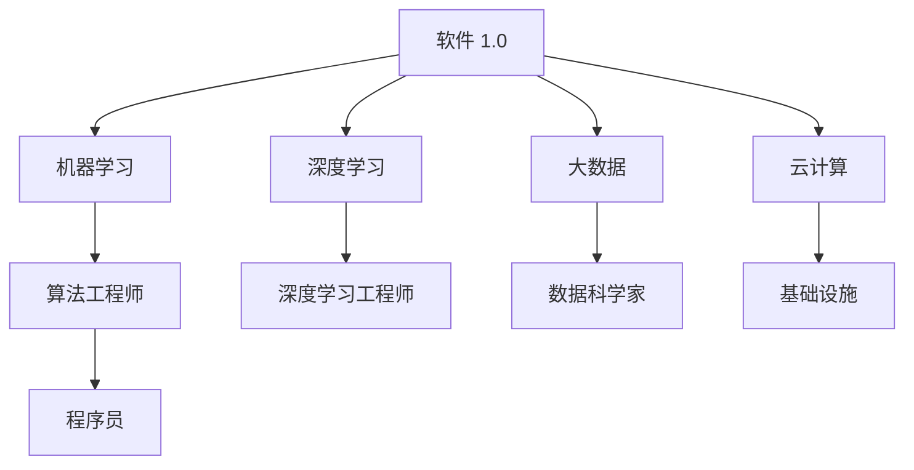

                 

# 软件 2.0 的时代：数据驱动一切

## 1. 背景介绍

在科技发展日新月异的今天，数据已成为一个至关重要的资产，驱动着各行各业的变革。软件 2.0 时代，也即数据驱动的时代，正逐渐成为信息技术的核心范式。本文将深入探讨软件 2.0 时代的基本概念、原理及其在实际应用中的实践，并对其未来发展趋势与挑战进行展望。

### 1.1 背景起源

软件 1.0 时代，以传统软件工程为主导，程序员手工编写代码，软件功能直接与用户需求对应。但随着互联网的普及和数据量的爆炸性增长，传统的软件开发模式难以适应大规模、复杂、个性化的需求。

软件 2.0 时代，以数据为驱动，基于机器学习和大数据技术的软件系统成为主流。算法工程师、数据科学家和程序员共同协作，构建出智能、动态、自我进化的软件系统。

## 2. 核心概念与联系

### 2.1 核心概念概述

为更好地理解软件 2.0 时代的基本框架，本节将介绍几个密切相关的核心概念：

- 软件 2.0：以数据为驱动的软件系统，基于机器学习和大数据技术，具备自学习、自适应的能力，能够根据用户行为数据不断优化功能和服务。

- 机器学习：通过算法模型对数据进行训练和预测，发现数据背后的模式和规律，用于提升软件系统的智能化水平。

- 深度学习：机器学习的一个分支，使用多层神经网络模型，处理海量复杂数据，挖掘深度隐含关系，实现更强的预测能力。

- 大数据：指大规模、高速、复杂的数据集合，通过分析挖掘，可以发现有价值的信息和知识，驱动软件系统的决策和优化。

- 云计算：提供灵活、可扩展的计算和存储资源，支持大数据处理和深度学习模型的训练。

这些核心概念之间的逻辑关系可以通过以下Mermaid流程图来展示：



这个流程图展示的核心概念及其之间的关系：

1. 软件 1.0 通过机器学习、深度学习和大数据技术，向软件 2.0 转变。
2. 算法工程师、数据科学家和程序员分别从模型算法、数据处理和编程实现的角度，推动软件 2.0 的发展。
3. 云计算提供了必需的基础设施支持，保障软件 2.0 的高效运行。

## 3. 核心算法原理 & 具体操作步骤
### 3.1 算法原理概述

软件 2.0 时代的数据驱动，核心在于通过机器学习和深度学习算法，对用户行为数据进行分析和建模，从而驱动软件系统的智能决策和服务优化。

假设软件系统收集了 $N$ 个用户行为数据 $\{(x_i,y_i)\}_{i=1}^N$，其中 $x_i$ 为输入特征，$y_i$ 为输出标签。软件 2.0 系统的目标是找到一个最优的模型 $f$，使得对任意新的输入 $x$，都能预测出其输出 $y$。形式化地，优化目标为：

$$
\min_{f} \mathcal{L}(f) = \frac{1}{N}\sum_{i=1}^N L(f(x_i),y_i)
$$

其中 $\mathcal{L}$ 为损失函数，$L$ 为单样本损失，如均方误差、交叉熵等。常用的机器学习算法包括线性回归、决策树、随机森林、梯度提升等，深度学习算法包括卷积神经网络、循环神经网络、注意力机制等。

### 3.2 算法步骤详解

软件 2.0 系统通常包括以下几个关键步骤：

**Step 1: 数据收集与预处理**
- 收集用户行为数据，进行清洗、去重、标准化等预处理操作。
- 进行特征工程，构造有意义、有助于模型训练的特征向量。
- 进行数据划分，分为训练集、验证集和测试集。

**Step 2: 模型训练与评估**
- 选择合适的模型和优化算法，如随机梯度下降、Adam等。
- 在训练集上训练模型，通过前向传播和反向传播不断调整模型参数，最小化损失函数。
- 在验证集上评估模型性能，选择合适的超参数，防止过拟合。

**Step 3: 模型部署与应用**
- 将训练好的模型部署到生产环境，集成到实际应用系统中。
- 对新的用户行为数据进行实时预测，驱动软件系统做出相应决策。
- 持续收集用户反馈，更新训练数据和模型参数，迭代优化。

### 3.3 算法优缺点

软件 2.0 的算法范式具有以下优点：
1. 智能决策：通过机器学习和大数据技术，系统能够根据用户行为数据进行智能决策，提高系统响应速度和准确性。
2. 自适应优化：系统具备自我学习和自我优化的能力，能够根据反馈数据不断改进模型，提升性能。
3. 灵活性高：软件 2.0 系统能够灵活适应各种应用场景，满足不同用户的需求。

同时，这种范式也存在一定的局限性：
1. 数据质量依赖：软件 2.0 系统的效果很大程度上依赖于数据质量，包括数据的准确性、完整性、一致性等。
2. 模型复杂度高：机器学习和深度学习模型往往具有较高的复杂度，需要较强的计算资源。
3. 模型解释性差：许多机器学习算法尤其是深度学习模型，其内部工作机制难以解释，缺乏透明性。
4. 数据隐私风险：用户行为数据涉及个人隐私，模型训练和应用过程中需要注意隐私保护。

尽管存在这些局限性，但就目前而言，数据驱动的软件 2.0 范式已成为信息化建设的重要方向，并广泛应用到金融、电商、医疗、交通等多个领域，带来了前所未有的变革。

### 3.4 算法应用领域

软件 2.0 算法范式在各领域的应用日益广泛，以下是几个典型场景：

**金融风控：**
金融公司通过收集和分析用户的交易记录、信用评级、社交网络等数据，构建风控模型。模型能够实时监控交易行为，识别异常行为，进行风险预警和信用评估。

**电商推荐：**
电商网站通过收集用户的浏览、购买、评价等行为数据，使用协同过滤、内容推荐等算法，为用户推荐个性化的商品和服务。推荐系统能够根据用户偏好，动态调整推荐策略，提高转化率和用户满意度。

**医疗诊断：**
医院通过电子病历、影像诊断、基因组数据等医疗数据，构建智能诊断系统。系统能够快速识别病情，辅助医生进行诊断和治疗决策，提升医疗服务的效率和准确性。

**交通调度：**
交通管理部门通过收集车辆位置、行驶速度、交通事故等数据，使用预测模型优化交通信号灯控制，调整路线规划，减少交通拥堵，提高道路通行效率。

**智能客服：**
企业通过收集客户咨询、反馈、投诉等数据，使用自然语言处理和机器学习算法，构建智能客服系统。系统能够自动理解客户问题，提供快速响应和解决方案，提升客户体验。

## 4. 数学模型和公式 & 详细讲解 & 举例说明
### 4.1 数学模型构建

软件 2.0 系统的数学模型构建，通常包括以下几个步骤：

**Step 1: 特征工程**
- 定义输入特征 $x \in \mathcal{X}$，其中 $\mathcal{X}$ 为特征空间。
- 定义输出标签 $y \in \mathcal{Y}$，其中 $\mathcal{Y}$ 为标签空间。

**Step 2: 模型选择与构建**
- 选择合适的模型 $f: \mathcal{X} \rightarrow \mathcal{Y}$，如线性回归、逻辑回归、决策树、深度神经网络等。
- 定义损失函数 $\mathcal{L}(f)$，如均方误差、交叉熵、对数损失等。

**Step 3: 训练与优化**
- 根据训练数据 $\{(x_i,y_i)\}_{i=1}^N$，使用优化算法 $\mathcal{A}$，如随机梯度下降、Adam等，求解最优模型参数 $\theta$。

### 4.2 公式推导过程

以线性回归为例，推导其数学模型和损失函数。

假设数据集 $\{(x_i,y_i)\}_{i=1}^N$ 为线性回归任务，模型 $f$ 为线性函数：

$$
f(x) = \theta_0 + \theta_1 x_1 + \theta_2 x_2 + \ldots + \theta_p x_p
$$

其中 $\theta_0,\theta_1,\ldots,\theta_p$ 为模型参数。损失函数 $\mathcal{L}(f)$ 定义为均方误差损失：

$$
\mathcal{L}(f) = \frac{1}{2N} \sum_{i=1}^N (y_i - f(x_i))^2
$$

利用梯度下降算法，求解最优参数 $\theta$：

$$
\theta \leftarrow \theta - \eta \nabla_{\theta}\mathcal{L}(f)
$$

其中 $\eta$ 为学习率，$\nabla_{\theta}\mathcal{L}(f)$ 为损失函数对参数 $\theta$ 的梯度。

### 4.3 案例分析与讲解

**案例：电商推荐系统**

电商网站通过用户行为数据，构建推荐系统。具体步骤如下：

1. **数据收集**：收集用户浏览、购买、评价等行为数据。

2. **特征工程**：构造用户特征向量，如年龄、性别、购买次数、评价评分等。

3. **模型训练**：使用协同过滤、内容推荐等算法，训练推荐模型。

4. **模型评估**：在验证集上评估模型性能，调整模型参数。

5. **应用部署**：将训练好的模型部署到推荐系统，实时生成推荐结果。

6. **迭代优化**：根据用户反馈，更新训练数据和模型参数，不断优化推荐效果。

## 5. 项目实践：代码实例和详细解释说明
### 5.1 开发环境搭建

在进行软件 2.0 系统的开发前，我们需要准备好开发环境。以下是使用Python进行PyTorch开发的环境配置流程：

1. 安装Anaconda：从官网下载并安装Anaconda，用于创建独立的Python环境。

2. 创建并激活虚拟环境：
```bash
conda create -n pytorch-env python=3.8 
conda activate pytorch-env
```

3. 安装PyTorch：根据CUDA版本，从官网获取对应的安装命令。例如：
```bash
conda install pytorch torchvision torchaudio cudatoolkit=11.1 -c pytorch -c conda-forge
```

4. 安装TensorFlow：
```bash
pip install tensorflow
```

5. 安装各类工具包：
```bash
pip install numpy pandas scikit-learn matplotlib tqdm jupyter notebook ipython
```

完成上述步骤后，即可在`pytorch-env`环境中开始软件 2.0 系统的开发。

### 5.2 源代码详细实现

下面我们以金融风控系统为例，给出使用PyTorch进行线性回归的PyTorch代码实现。

首先，定义数据集：

```python
import pandas as pd
from sklearn.model_selection import train_test_split

data = pd.read_csv('credit.csv')
X = data[['age', 'income', 'duration', 'campaign', 'loan', 'contact', 'day', 'month', 'quarter', 'poutcome']]
y = data['default']
X_train, X_test, y_train, y_test = train_test_split(X, y, test_size=0.2, random_state=42)
```

然后，定义模型和优化器：

```python
import torch
from torch import nn
from torch.optim import Adam

class LinearRegression(nn.Module):
    def __init__(self, input_dim, output_dim):
        super(LinearRegression, self).__init__()
        self.linear = nn.Linear(input_dim, output_dim)

    def forward(self, x):
        out = self.linear(x)
        return out

model = LinearRegression(input_dim=X_train.shape[1], output_dim=1)
optimizer = Adam(model.parameters(), lr=0.01)
```

接着，定义训练和评估函数：

```python
from torch.utils.data import TensorDataset, DataLoader

def train_epoch(model, dataset, optimizer):
    model.train()
    loss = 0
    for x, y in dataset:
        optimizer.zero_grad()
        y_pred = model(x)
        loss += nn.MSELoss()(y_pred, y)
        loss.backward()
        optimizer.step()
    return loss / len(dataset)

def evaluate(model, dataset):
    model.eval()
    loss = 0
    with torch.no_grad():
        for x, y in dataset:
            y_pred = model(x)
            loss += nn.MSELoss()(y_pred, y)
    return loss / len(dataset)
```

最后，启动训练流程并在测试集上评估：

```python
epochs = 1000
batch_size = 64

for epoch in range(epochs):
    train_loss = train_epoch(model, (torch.tensor(X_train, dtype=torch.float32), torch.tensor(y_train, dtype=torch.float32)), optimizer)
    test_loss = evaluate(model, (torch.tensor(X_test, dtype=torch.float32), torch.tensor(y_test, dtype=torch.float32)))
    print(f'Epoch {epoch+1}, train loss: {train_loss:.4f}, test loss: {test_loss:.4f}')

print('Final test loss:', test_loss)
```

以上就是使用PyTorch进行线性回归的完整代码实现。可以看到，通过简单的代码，我们构建了一个基于数据驱动的金融风控系统。

### 5.3 代码解读与分析

让我们再详细解读一下关键代码的实现细节：

**数据处理**：
- 使用Pandas库读取CSV文件，构造特征矩阵 $X$ 和标签向量 $y$。
- 将数据集划分为训练集和测试集，并进行标准化处理。

**模型定义**：
- 定义线性回归模型类 `LinearRegression`，继承自 `nn.Module`，使用 `nn.Linear` 层作为线性变换。
- 初始化模型参数。

**优化器设置**：
- 使用 `Adam` 优化器，设置学习率。

**训练与评估**：
- 定义训练函数 `train_epoch`：在训练集上使用随机梯度下降法更新模型参数，计算损失。
- 定义评估函数 `evaluate`：在测试集上计算模型损失，评估模型性能。

**训练流程**：
- 设置迭代次数和批次大小，开始循环迭代。
- 在每个epoch内，先进行训练，输出训练损失。
- 在测试集上评估模型性能，输出测试损失。

通过上述代码，我们实现了基于数据驱动的金融风控系统，展示了软件 2.0 技术的基本应用流程。

## 6. 实际应用场景
### 6.1 金融风控

金融公司通过收集和分析用户的交易记录、信用评级、社交网络等数据，构建风控模型。模型能够实时监控交易行为，识别异常行为，进行风险预警和信用评估。

### 6.2 电商推荐

电商网站通过收集用户的浏览、购买、评价等行为数据，使用协同过滤、内容推荐等算法，为用户推荐个性化的商品和服务。推荐系统能够根据用户偏好，动态调整推荐策略，提高转化率和用户满意度。

### 6.3 医疗诊断

医院通过电子病历、影像诊断、基因组数据等医疗数据，构建智能诊断系统。系统能够快速识别病情，辅助医生进行诊断和治疗决策，提升医疗服务的效率和准确性。

### 6.4 交通调度

交通管理部门通过收集车辆位置、行驶速度、交通事故等数据，使用预测模型优化交通信号灯控制，调整路线规划，减少交通拥堵，提高道路通行效率。

### 6.5 智能客服

企业通过收集客户咨询、反馈、投诉等数据，使用自然语言处理和机器学习算法，构建智能客服系统。系统能够自动理解客户问题，提供快速响应和解决方案，提升客户体验。

## 7. 工具和资源推荐
### 7.1 学习资源推荐

为了帮助开发者系统掌握软件 2.0 技术的基本框架和实践技巧，这里推荐一些优质的学习资源：

1. 《Deep Learning》书籍：Ian Goodfellow等人合著，全面介绍了深度学习的基础理论和实际应用，是学习深度学习的经典教材。

2. 《Python Machine Learning》书籍：Sebastian Raschka著，详细讲解了机器学习算法的Python实现，适合初学者入门。

3. 《TensorFlow官方文档》：Google推出的深度学习框架文档，提供了详尽的API和实例代码，是学习TensorFlow的重要资源。

4. Coursera《Deep Learning Specialization》课程：Andrew Ng主讲的深度学习专项课程，涵盖了从基础到高级的深度学习内容。

5. Kaggle竞赛平台：通过参与实际的数据科学竞赛，能够将所学知识应用于实际问题，提高实践能力。

通过对这些资源的学习实践，相信你一定能够快速掌握软件 2.0 技术的基本概念和实践方法，并用于解决实际的工程问题。

### 7.2 开发工具推荐

高效的开发离不开优秀的工具支持。以下是几款用于软件 2.0 系统开发的常用工具：

1. PyTorch：基于Python的开源深度学习框架，灵活动态的计算图，适合快速迭代研究。大部分预训练语言模型都有PyTorch版本的实现。

2. TensorFlow：由Google主导开发的开源深度学习框架，生产部署方便，适合大规模工程应用。同样有丰富的预训练语言模型资源。

3. Jupyter Notebook：开源的交互式笔记本工具，支持多语言和框架，方便开发和协作。

4. Visual Studio Code：微软推出的轻量级IDE，支持丰富的插件和扩展，提高开发效率。

5. Git和GitHub：版本控制和代码托管平台，便于团队协作和版本管理。

合理利用这些工具，可以显著提升软件 2.0 系统的开发效率，加快创新迭代的步伐。

### 7.3 相关论文推荐

软件 2.0 技术的发展源于学界的持续研究。以下是几篇奠基性的相关论文，推荐阅读：

1. TensorFlow: A System for Large-Scale Machine Learning：Google发表的TensorFlow论文，介绍了TensorFlow系统的设计和实现。

2. Neural Network Learning for Zero Examples：Ian Goodfellow等人提出的零样本学习算法，展示了神经网络模型在零样本情况下的强大泛化能力。

3. Deep Learning for NLP：Ian Goodfellow等人提出的大规模语言模型，展示了深度学习在自然语言处理领域的巨大潜力。

4. Semi-Supervised Sequence Learning：Andrew Ng等人提出的半监督学习算法，通过利用少量标注数据，提高模型泛化能力。

5. Scaling Deep Learning with Heterogeneous Data：Ian Goodfellow等人提出的异构数据驱动的深度学习算法，展示了大规模数据集训练的效果。

这些论文代表了大数据和深度学习驱动的软件 2.0 技术的发展脉络。通过学习这些前沿成果，可以帮助研究者把握学科前进方向，激发更多的创新灵感。

## 8. 总结：未来发展趋势与挑战

### 8.1 总结

本文对软件 2.0 时代的基本概念、原理及其在实际应用中的实践进行了全面系统的介绍。首先阐述了软件 2.0 时代的基本框架和关键概念，明确了数据驱动的变革趋势。其次，从原理到实践，详细讲解了软件 2.0 的数学模型和算法流程，给出了软件 2.0 系统开发的完整代码实例。同时，本文还广泛探讨了软件 2.0 技术在金融、电商、医疗、交通等多个领域的应用前景，展示了数据驱动技术的巨大潜力。

通过本文的系统梳理，可以看到，数据驱动的软件 2.0 范式正逐渐成为信息化建设的重要方向，广泛应用到各行各业。未来，伴随数据规模的不断扩大和算法技术的不断进步，软件 2.0 技术必将在更广阔的领域发挥更大作用，推动智能化社会的全面发展。

### 8.2 未来发展趋势

展望未来，软件 2.0 技术将呈现以下几个发展趋势：

1. 数据规模不断扩大：随着物联网、大数据、AI等技术的进一步发展，数据量将呈指数级增长，为软件 2.0 系统提供更丰富、更全面、更复杂的数据支持。

2. 算法模型更高效：随着硬件性能的提升和算法优化的深入，软件 2.0 系统将具备更快的训练速度和更低的计算成本，能够实时处理海量数据。

3. 自动化和智能化水平提升：软件 2.0 系统将进一步融合人工智能技术，实现更强的自适应和自动化能力，提升系统智能化水平。

4. 跨领域数据融合：软件 2.0 系统将打破数据孤岛，实现多领域数据的融合和协同，提升决策的全面性和准确性。

5. 人机协作更加紧密：软件 2.0 系统将与人类协同工作，实现更高效、更灵活的信息处理和决策。

6. 伦理和安全问题备受关注：随着数据隐私和模型安全问题的日益突出，软件 2.0 系统将引入更多的伦理和安全约束，确保系统的公正性和可信性。

以上趋势凸显了软件 2.0 技术的广阔前景。这些方向的探索发展，必将进一步推动数据驱动的智能化社会建设，为人类社会带来深远影响。

### 8.3 面临的挑战

尽管软件 2.0 技术已经取得了显著成就，但在迈向更加智能化、普适化应用的过程中，仍面临诸多挑战：

1. 数据质量瓶颈：数据质量的依赖使得软件 2.0 系统的效果受限于数据收集和处理的准确性、完整性、一致性等。数据噪声和缺失数据是影响系统性能的重要因素。

2. 模型复杂性高：深度学习模型通常具有较高的复杂度，需要强大的计算资源和存储能力。如何优化模型结构，提高计算效率，是未来需要重点关注的问题。

3. 模型解释性差：许多深度学习模型尤其是黑盒模型，难以解释其内部工作机制和决策逻辑，缺乏透明性。如何提高模型的可解释性和可审计性，是保障系统可信性的关键。

4. 数据隐私风险：用户行为数据涉及个人隐私，模型训练和应用过程中需要注意隐私保护。如何保障数据隐私，避免数据滥用，是重要的法律和伦理问题。

5. 系统鲁棒性不足：软件 2.0 系统在面对噪声数据、对抗样本等异常情况时，鲁棒性有待提高。如何增强系统的鲁棒性，避免灾难性遗忘，是未来的研究方向。

6. 模型泛化能力有限：软件 2.0 系统在面对新的、未见过的数据时，泛化能力往往不足。如何提高模型的泛化能力，增强系统适应性，是重要的研究课题。

正视软件 2.0 面临的这些挑战，积极应对并寻求突破，将使软件 2.0 技术更加成熟，具备更广泛的应用前景。

### 8.4 研究展望

面向未来，软件 2.0 技术的研究应在以下几个方面寻求新的突破：

1. 探索无监督和半监督学习方法：摆脱对大规模标注数据的依赖，利用自监督学习、主动学习等无监督和半监督范式，最大限度利用非结构化数据，实现更加灵活高效的训练。

2. 研究参数高效和计算高效的模型：开发更加参数高效的模型，在固定大部分预训练参数的同时，只更新极少量的任务相关参数。同时优化模型的计算图，减少前向传播和反向传播的资源消耗，实现更加轻量级、实时性的部署。

3. 引入因果分析和博弈论思想：将因果分析方法引入软件 2.0 系统，识别出系统决策的关键特征，增强输出解释的因果性和逻辑性。借助博弈论思想刻画人机交互过程，主动探索并规避系统的脆弱点，提高系统稳定性。

4. 结合符号化知识库：将符号化的先验知识，如知识图谱、逻辑规则等，与神经网络模型进行巧妙融合，引导模型学习更准确、合理的语言模型。同时加强不同模态数据的整合，实现视觉、语音等多模态信息与文本信息的协同建模。

5. 纳入伦理和隐私约束：在软件 2.0 系统的训练目标中引入伦理导向的评估指标，过滤和惩罚有害的输出倾向。同时加强人工干预和审核，建立模型行为的监管机制，确保输出符合人类价值观和伦理道德。

这些研究方向的探索，必将引领软件 2.0 技术迈向更高的台阶，为构建安全、可靠、可解释、可控的智能系统铺平道路。面向未来，软件 2.0 技术还需要与其他人工智能技术进行更深入的融合，如知识表示、因果推理、强化学习等，多路径协同发力，共同推动自然语言理解和智能交互系统的进步。只有勇于创新、敢于突破，才能不断拓展软件 2.0 技术的边界，让智能技术更好地造福人类社会。

## 9. 附录：常见问题与解答

**Q1：什么是软件 2.0？**

A: 软件 2.0 是指以数据为驱动，基于机器学习和大数据技术，具备自学习、自适应能力，能够根据用户行为数据不断优化功能和服务的新一代软件系统。

**Q2：软件 2.0 的优点和缺点是什么？**

A: 优点：智能决策、自适应优化、灵活性高。缺点：数据质量依赖、模型复杂度高、模型解释性差、数据隐私风险。

**Q3：软件 2.0 系统的一般开发流程是什么？**

A: 数据收集与预处理、模型训练与评估、模型部署与应用、持续收集反馈、迭代优化。

**Q4：如何选择合适的学习率？**

A: 一般建议从1e-5开始调参，逐步减小学习率，直至收敛。也可以使用warmup策略，在开始阶段使用较小的学习率，再逐渐过渡到预设值。

**Q5：如何缓解软件 2.0 系统的过拟合问题？**

A: 数据增强、正则化、对抗训练、参数高效微调、多模型集成等方法。

通过本文的系统梳理，可以看到，软件 2.0 技术的核心在于数据驱动，通过机器学习和深度学习算法，驱动软件系统的智能决策和服务优化。随着数据规模的不断扩大和算法技术的不断进步，软件 2.0 必将在更广阔的领域发挥更大作用，推动智能化社会的全面发展。未来，伴随算力成本的下降和数据规模的扩张，软件 2.0 技术将进一步拓展其应用边界，为各行各业带来颠覆性的变革。

---

作者：禅与计算机程序设计艺术 / Zen and the Art of Computer Programming

