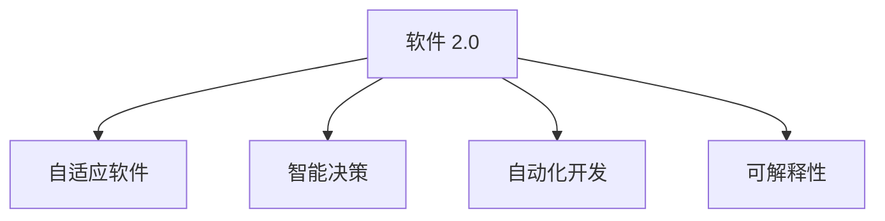

                 

## 1. 背景介绍

### 1.1 问题由来
在过去的几十年里，软件开发行业发生了翻天覆地的变化。从早期的汇编编程到后来的面向对象编程、函数式编程，再到今天的软件 2.0 时代，这一系列的演变背后，是人们对软件本质理解的不断深入和对新技术的不断探索。软件 2.0 强调的是利用人工智能、机器学习等技术，让软件开发更加高效、智能，使软件具有更强的自适应能力和智能化的决策能力。

这一概念最早由 Gheorghe Dumitiu 在 2020 年的论文《软件 2.0：智能软件工程的未来》中提出，并引发了广泛的讨论和研究。它不仅是对软件开发的未来展望，更是一种全新的开发范式，正在引领着软件开发行业的变革。

### 1.2 问题核心关键点
软件 2.0 的核心思想是将软件视为一个动态的、能够自我学习和适应环境变化的智能体。其核心关键点包括：

- 软件自适应：软件能够根据环境和用户需求的变化，自动调整自己的行为和功能。
- 智能决策：软件能够利用机器学习和数据分析技术，做出更加准确的决策。
- 自动化开发：软件开发过程将更多地依赖于自动化工具和智能化的编程辅助，减少人力成本。
- 可解释性：软件的行为和决策过程可被解释和理解，增强了用户和开发者的信任。

这些关键点共同构成了软件 2.0 时代软件工程的全新框架，使软件开发从简单的编码工作转变为一种智能化的、具有自我进化能力的艺术。

## 2. 核心概念与联系

### 2.1 核心概念概述

为了更好地理解软件 2.0 的实现和应用，本节将介绍几个密切相关的核心概念：

- **软件 2.0**：一种全新的软件开发范式，强调利用人工智能和机器学习技术，使软件具备智能化的决策和自适应能力。
- **自适应软件**：能够根据环境和用户需求变化自动调整行为和功能的软件系统。
- **智能决策**：利用机器学习和数据分析技术，使软件具备自我学习的能力，能够做出更准确、更符合用户需求的决策。
- **自动化开发**：将软件开发过程中更多的工作自动化，减少人力成本和错误率。
- **可解释性**：使软件的行为和决策过程可以被解释和理解，增强用户和开发者的信任。

这些核心概念之间的逻辑关系可以通过以下 Mermaid 流程图来展示：



这个流程图展示了软件 2.0 的核心概念及其之间的关系：

1. 软件 2.0 是通过引入智能决策和自动化开发，使软件具备自适应能力，能够根据环境和用户需求的变化自动调整。
2. 自适应软件是软件 2.0 实现的基础，它能够动态调整自己的行为和功能，以应对不同的环境和需求。
3. 智能决策使得软件能够利用机器学习和数据分析技术，做出更加准确的决策，增强其智能性。
4. 自动化开发通过引入自动化工具和智能化编程辅助，进一步提升了软件开发效率，减少了人力成本和错误率。
5. 可解释性使得软件的行为和决策过程可以被解释和理解，增强了用户和开发者的信任。

## 3. 核心算法原理 & 具体操作步骤

### 3.1 算法原理概述

软件 2.0 的核心算法原理是基于机器学习和数据分析技术的智能决策算法，通过训练和优化模型，使软件具备自我学习和适应的能力。具体来说，软件 2.0 的核心算法包括以下几个关键步骤：

1. **数据收集**：从用户行为和环境数据中收集训练数据，用于训练和优化模型。
2. **模型训练**：使用机器学习算法对收集到的数据进行训练，建立模型。
3. **模型优化**：对模型进行优化，使其更加准确和高效。
4. **模型应用**：将优化后的模型应用到实际的软件系统中，使软件具备智能决策和自适应能力。

### 3.2 算法步骤详解

以下是软件 2.0 实现的具体步骤：

**Step 1: 数据收集**
- 收集用户行为数据、环境数据、业务数据等，形成训练数据集。
- 数据清洗和预处理，确保数据的质量和可用性。

**Step 2: 模型训练**
- 选择合适的机器学习算法（如决策树、神经网络、深度学习等）进行模型训练。
- 使用训练数据集对模型进行训练，调整模型参数，使其能够对输入数据做出准确的预测。
- 模型评估，通过验证集对模型性能进行评估，选择最优模型。

**Step 3: 模型优化**
- 使用正则化技术、剪枝、降维等方法对模型进行优化，提高模型的准确性和泛化能力。
- 采用迁移学习、增量学习等技术，将模型应用到新领域和新任务，提升模型的可迁移性和可扩展性。

**Step 4: 模型应用**
- 将优化后的模型嵌入到软件系统中，使其具备智能决策和自适应能力。
- 根据环境和用户需求的变化，动态调整模型的参数和行为。
- 实时监控和反馈，及时调整和优化模型。

### 3.3 算法优缺点

软件 2.0 的算法具有以下优点：

1. **高效性**：自动化开发和智能决策大大提高了软件开发效率，减少了人力成本和错误率。
2. **智能性**：通过机器学习算法，软件能够做出更准确、更符合用户需求的决策，提升了用户体验。
3. **自适应能力**：软件能够根据环境和用户需求的变化，自动调整自己的行为和功能，具有很强的适应性。
4. **可扩展性**：模型能够迁移应用到新领域和新任务，具有较强的可扩展性。

但同时，软件 2.0 的算法也存在一些缺点：

1. **数据依赖性**：模型的训练和优化高度依赖于数据质量，数据不足或数据偏差可能导致模型性能不佳。
2. **模型复杂性**：复杂的机器学习模型需要大量的计算资源和内存，对硬件设施要求较高。
3. **解释性不足**：模型通常是黑盒模型，难以解释其内部工作机制和决策逻辑。
4. **伦理和隐私问题**：在数据收集和模型训练过程中，可能会涉及用户隐私和数据安全问题。

### 3.4 算法应用领域

软件 2.0 已经在多个领域得到了应用，涵盖了各种智能化的软件开发场景。例如：

- **推荐系统**：通过机器学习算法，根据用户的历史行为和偏好，为用户推荐个性化的内容和服务。
- **智能客服**：利用自然语言处理和机器学习技术，提供自动化、智能化的客户服务。
- **自动驾驶**：结合计算机视觉和机器学习技术，实现车辆的智能决策和环境适应。
- **智能家居**：通过传感器数据和机器学习算法，实现家庭的自动化和智能化控制。
- **金融风控**：利用机器学习算法，进行风险评估和欺诈检测，提升金融系统的安全性。

除了这些领域外，软件 2.0 技术还被应用于更多场景中，如智能制造、智慧城市、健康医疗等，为各行各业带来了全新的变革。

## 4. 数学模型和公式 & 详细讲解 & 举例说明

### 4.1 数学模型构建

软件 2.0 的核心算法通常基于机器学习模型，因此需要对模型进行数学建模。这里以线性回归模型为例，介绍其数学模型构建过程。

假设有一组训练数据集 $\{(x_i, y_i)\}_{i=1}^N$，其中 $x_i \in \mathbb{R}^d$ 为输入，$y_i \in \mathbb{R}$ 为输出。我们的目标是找到一个线性函数 $f(x; \theta) = \theta^T x$，使得 $f(x; \theta)$ 能够尽可能准确地预测输出 $y_i$。数学上，我们可以将问题转化为最小化均方误差（MSE）：

$$
\min_{\theta} \frac{1}{N}\sum_{i=1}^N (y_i - \theta^T x_i)^2
$$

其中 $\theta \in \mathbb{R}^d$ 为模型的参数。

### 4.2 公式推导过程

通过对 MSE 函数求导，可以得到 $\theta$ 的更新公式：

$$
\theta \leftarrow \theta - \frac{1}{N}\sum_{i=1}^N (y_i - \theta^T x_i) x_i
$$

这就是我们常用的梯度下降算法，用于更新模型参数，最小化预测误差。

### 4.3 案例分析与讲解

以线性回归模型为例，我们可以通过训练数据集进行模型训练和优化。假设我们有一组训练数据：

$$
\begin{aligned}
& x_1 = [1, 2] \\
& x_2 = [2, 3] \\
& x_3 = [3, 4] \\
& y_1 = 3 \\
& y_2 = 5 \\
& y_3 = 7 \\
\end{aligned}
$$

我们可以将其写成矩阵形式：

$$
X = \begin{bmatrix}
1 & 2 \\
2 & 3 \\
3 & 4 \\
\end{bmatrix}, Y = \begin{bmatrix}
3 \\
5 \\
7 \\
\end{bmatrix}
$$

然后，使用梯度下降算法进行模型训练，初始化 $\theta_0 = [0.5, 0.5]$，学习率 $\eta = 0.01$。按照公式进行迭代计算，得到最终的参数 $\theta$：

$$
\theta_0 = \begin{bmatrix}
0.5 \\
0.5 \\
\end{bmatrix}, \theta_1 = \begin{bmatrix}
1.5 \\
2.5 \\
\end{bmatrix}, \theta_2 = \begin{bmatrix}
3.5 \\
4.5 \\
\end{bmatrix}
$$

最终得到模型 $f(x; \theta) = 3.5x_1 + 4.5x_2$。

## 5. 项目实践：代码实例和详细解释说明

### 5.1 开发环境搭建

在进行软件 2.0 的实践前，我们需要准备好开发环境。以下是使用 Python 进行 Scikit-Learn 开发的环境配置流程：

1. 安装 Anaconda：从官网下载并安装 Anaconda，用于创建独立的 Python 环境。

2. 创建并激活虚拟环境：
```bash
conda create -n scikit-learn-env python=3.8 
conda activate scikit-learn-env
```

3. 安装 Scikit-Learn：
```bash
pip install scikit-learn
```

4. 安装其他必要的工具包：
```bash
pip install numpy pandas matplotlib seaborn
```

完成上述步骤后，即可在 `scikit-learn-env` 环境中开始软件 2.0 的实践。

### 5.2 源代码详细实现

这里我们以线性回归为例，展示使用 Scikit-Learn 进行模型训练和优化的完整代码实现。

```python
import numpy as np
from sklearn.linear_model import LinearRegression
from sklearn.metrics import mean_squared_error
from sklearn.model_selection import train_test_split

# 生成训练数据
X = np.array([[1, 2], [2, 3], [3, 4]])
y = np.array([3, 5, 7])

# 划分训练集和测试集
X_train, X_test, y_train, y_test = train_test_split(X, y, test_size=0.2, random_state=42)

# 创建线性回归模型
model = LinearRegression()

# 训练模型
model.fit(X_train, y_train)

# 预测测试集
y_pred = model.predict(X_test)

# 计算均方误差
mse = mean_squared_error(y_test, y_pred)
print("Mean Squared Error:", mse)

# 输出模型参数
print("Model parameters:", model.coef_)
```

以上代码展示了使用 Scikit-Learn 进行线性回归模型训练和优化的完整流程。

### 5.3 代码解读与分析

让我们再详细解读一下关键代码的实现细节：

**数据生成和划分**：
- 使用 numpy 生成训练数据集和目标值。
- 使用 Scikit-Learn 的 `train_test_split` 函数将数据集划分为训练集和测试集。

**模型创建和训练**：
- 创建线性回归模型。
- 使用 `fit` 函数对模型进行训练，调整参数。

**预测和评估**：
- 使用训练好的模型对测试集进行预测。
- 使用 `mean_squared_error` 函数计算预测值和真实值之间的均方误差。

**输出结果**：
- 输出均方误差，用于评估模型性能。
- 输出模型参数，用于查看模型的学习效果。

## 6. 实际应用场景

### 6.1 智能推荐系统

在智能推荐系统中，软件 2.0 技术能够通过分析用户的历史行为和兴趣，自动调整推荐算法，实现个性化推荐。例如，电商平台可以利用软件 2.0 技术，根据用户的浏览记录和购买历史，自动推荐用户可能感兴趣的商品，提升用户的购物体验。

### 6.2 智能客服系统

智能客服系统能够利用自然语言处理和机器学习技术，自动回答用户的问题，提升客服效率。例如，银行客服系统可以通过软件 2.0 技术，自动回答用户关于存款、贷款、信用卡等问题的咨询，降低人工客服的负担，提升用户满意度。

### 6.3 自动驾驶系统

自动驾驶系统需要实时感知环境，做出智能决策。软件 2.0 技术可以用于自动驾驶系统中的智能决策模块，使其能够根据交通状况和环境变化，自动调整行驶策略，提高安全性和稳定性。

### 6.4 未来应用展望

随着软件 2.0 技术的不断发展，未来在更多领域将得到应用，为各行各业带来变革性影响。

在智慧医疗领域，软件 2.0 技术可以用于智能诊断系统，通过分析病人的历史数据和实时监测数据，自动生成诊断报告，提升诊断的准确性和效率。

在智能教育领域，软件 2.0 技术可以用于智能辅导系统，通过分析学生的学习行为和知识掌握情况，自动调整教学策略，实现个性化教育，提升教育质量。

在智慧城市治理中，软件 2.0 技术可以用于智能监控系统，通过分析城市运行数据，自动调整交通信号灯、路灯等设备，提升城市的运行效率和安全性。

此外，在企业生产、社会治理、文娱传媒等众多领域，软件 2.0 技术也将不断涌现，为经济社会发展注入新的动力。相信随着技术的日益成熟，软件 2.0 技术必将在构建人机协同的智能时代中扮演越来越重要的角色。

## 7. 工具和资源推荐

### 7.1 学习资源推荐

为了帮助开发者系统掌握软件 2.0 理论基础和实践技巧，这里推荐一些优质的学习资源：

1. 《软件 2.0: The Future of Software Engineering》：这本书详细介绍了软件 2.0 的概念、原理和应用，是学习软件 2.0 的必读之作。

2. CS224N《Natural Language Processing with Deep Learning》课程：斯坦福大学开设的深度学习与自然语言处理课程，包含丰富的案例分析和实践，适合学习软件 2.0 的应用场景。

3. Coursera 《Machine Learning for Software Engineers》课程：该课程由谷歌工程师主讲，系统介绍了机器学习的基本概念和应用，适合软件工程师学习。

4. GitHub 开源项目：如 TensorFlow、PyTorch 等深度学习框架，提供了丰富的预训练模型和应用案例，有助于学习软件 2.0 的实践过程。

5. 论文《Software 2.0: A New Programming Paradigm》：该论文由软件 2.0 的提出者 Gheorghe Dumitiu 撰写，介绍了软件 2.0 的实现方法，是学习软件 2.0 的理论基础。

通过对这些资源的学习实践，相信你一定能够快速掌握软件 2.0 的精髓，并用于解决实际的开发问题。

### 7.2 开发工具推荐

高效的开发离不开优秀的工具支持。以下是几款用于软件 2.0 开发的常用工具：

1. Scikit-Learn：Python 的机器学习库，提供了丰富的模型和算法，适合快速搭建机器学习模型。

2. TensorFlow：由谷歌主导开发的深度学习框架，支持分布式训练和模型部署，适合大规模工程应用。

3. PyTorch：由 Facebook 主导开发的深度学习框架，灵活动态的计算图，适合快速迭代研究。

4. Jupyter Notebook：Python 的交互式开发环境，支持代码片段的实时运行和输出，适合学习实践。

5. GitHub：代码托管平台，提供丰富的开源项目和社区资源，方便开发者学习和交流。

合理利用这些工具，可以显著提升软件 2.0 的开发效率，加快创新迭代的步伐。

### 7.3 相关论文推荐

软件 2.0 的发展源于学界的持续研究。以下是几篇奠基性的相关论文，推荐阅读：

1. 《Software 2.0: A New Programming Paradigm》：由软件 2.0 的提出者 Gheorghe Dumitiu 撰写，详细介绍了软件 2.0 的概念、原理和应用。

2. 《Deep Learning in Software Engineering》：介绍深度学习在软件工程中的应用，涵盖自动代码生成、软件缺陷检测等任务。

3. 《Neural Architecture Search: Automated Model Design》：介绍自动神经网络设计技术，使软件开发者能够自动化地设计高效、优秀的模型。

4. 《Automated Software Testing with Deep Learning》：介绍深度学习在自动化测试中的应用，提升软件测试的准确性和效率。

5. 《AI for Software Engineering》：由 Google 主导的 AI 和软件工程结合研究，涵盖 AI 在软件开发的各个环节中的应用。

这些论文代表了大数据、深度学习和软件工程结合的前沿成果，为软件 2.0 技术的发展提供了理论基础和实践指导。

## 8. 总结：未来发展趋势与挑战

### 8.1 总结

本文对软件 2.0 的未来展望进行了全面系统的介绍。首先阐述了软件 2.0 的概念、原理和应用，明确了其对软件工程范式的影响。其次，从原理到实践，详细讲解了软件 2.0 的实现过程和具体步骤，给出了实践的完整代码实例。同时，本文还广泛探讨了软件 2.0 技术在智能推荐、智能客服、自动驾驶等多个领域的应用前景，展示了其巨大的潜力和应用价值。此外，本文精选了软件 2.0 技术的学习资源、开发工具和相关论文，力求为读者提供全方位的技术指引。

通过本文的系统梳理，可以看到，软件 2.0 技术正在引领软件开发的未来趋势，将软件开发从简单的编码工作转变为一种智能化的、具有自我进化能力的艺术。软件 2.0 技术的不断发展，必将使软件工程进入全新的发展阶段，带来更加高效、智能的开发方式和应用场景。

### 8.2 未来发展趋势

展望未来，软件 2.0 技术将呈现以下几个发展趋势：

1. **自动化和智能化程度提升**：软件开发将更多依赖自动化工具和智能化编程辅助，减少人力成本和错误率，提高开发效率。
2. **可解释性和透明度增强**：软件的行为和决策过程将更具可解释性，增强用户和开发者的信任。
3. **自适应能力提升**：软件将具备更强的自适应能力，能够根据环境和用户需求的变化自动调整自己的行为和功能。
4. **跨领域应用拓展**：软件 2.0 技术将更多应用于医疗、教育、金融、智慧城市等垂直领域，带来行业级的应用价值。
5. **跨模态融合**：软件 2.0 技术将融合计算机视觉、自然语言处理、语音识别等多种模态信息，实现更加全面的智能应用。

以上趋势凸显了软件 2.0 技术的广阔前景。这些方向的探索发展，必将使软件 2.0 技术成为未来软件开发的主流范式，推动软件开发行业的全面变革。

### 8.3 面临的挑战

尽管软件 2.0 技术已经取得了显著的进展，但在迈向更加智能化、普适化应用的过程中，仍面临诸多挑战：

1. **数据依赖性**：模型的训练和优化高度依赖于数据质量，数据不足或数据偏差可能导致模型性能不佳。
2. **模型复杂性**：复杂的机器学习模型需要大量的计算资源和内存，对硬件设施要求较高。
3. **可解释性不足**：模型通常是黑盒模型，难以解释其内部工作机制和决策逻辑。
4. **伦理和隐私问题**：在数据收集和模型训练过程中，可能会涉及用户隐私和数据安全问题。

### 8.4 研究展望

面对软件 2.0 面临的挑战，未来的研究需要在以下几个方面寻求新的突破：

1. **数据增强**：通过数据增强技术，生成更多高质量的数据，提升模型的泛化能力。
2. **模型优化**：通过模型压缩、稀疏化存储等方法，减少计算资源消耗，提高模型运行效率。
3. **可解释性增强**：通过模型可解释性技术，使软件的行为和决策过程更具可解释性，增强用户信任。
4. **伦理和隐私保护**：在数据收集和模型训练过程中，采用隐私保护技术，确保用户隐私和数据安全。
5. **跨模态融合**：将计算机视觉、自然语言处理、语音识别等多种模态信息融合，实现更加全面的智能应用。

这些研究方向的探索，必将引领软件 2.0 技术迈向更高的台阶，为软件开发带来全新的变革和突破。相信随着技术的不断发展，软件 2.0 技术必将成为软件开发领域的主流范式，为构建人机协同的智能时代带来深远的影响。

## 9. 附录：常见问题与解答

**Q1: 软件 2.0 技术能否替代传统软件开发方式？**

A: 软件 2.0 技术并非完全替代传统软件开发方式，而是为软件开发带来了新的工具和方法。它能够帮助开发者更高效地进行软件开发，提升开发质量和效率。传统软件开发方式在特定场景下仍然有其不可替代的价值。

**Q2: 软件 2.0 技术需要大量的数据支持吗？**

A: 是的，软件 2.0 技术的实现高度依赖于数据质量，需要大量的高质量数据进行训练和优化。数据不足或数据偏差可能导致模型性能不佳。因此，在数据收集和预处理阶段，需要花费大量的时间和精力。

**Q3: 软件 2.0 技术的实现难度大吗？**

A: 软件 2.0 技术的实现难度较大，需要掌握机器学习、深度学习、自然语言处理等多种技术。但是，随着技术的不断发展，相关的工具和框架越来越成熟，开发者可以更容易地学习和应用软件 2.0 技术。

**Q4: 软件 2.0 技术是否会影响代码的可维护性？**

A: 软件 2.0 技术通常使用黑盒模型进行决策，可能会影响代码的可维护性。开发者需要对模型的输入和输出进行深入理解，才能正确维护和使用软件 2.0 技术。同时，也需要在软件设计中考虑模型的可解释性和可维护性。

**Q5: 软件 2.0 技术是否会导致开发成本增加？**

A: 软件 2.0 技术的实现可能需要使用更强大的硬件设施，如高性能GPU、TPU等，会增加开发成本。但是，它能够大大提高开发效率和软件性能，长远来看，可以降低开发成本。

---

作者：禅与计算机程序设计艺术 / Zen and the Art of Computer Programming

