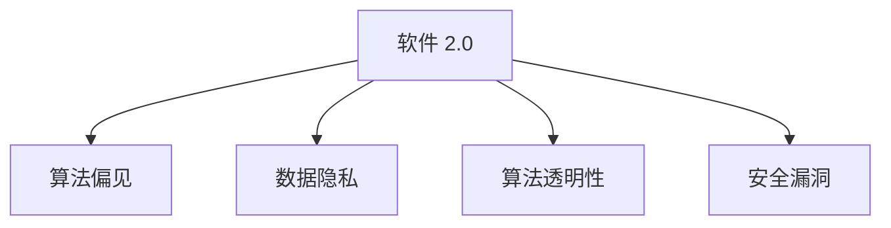

                 

# 软件 2.0 的社会责任：科技向善

## 1. 背景介绍

### 1.1 问题由来

随着信息技术的飞速发展，特别是软件工程技术的不断进步，我们正处在一个充满机遇与挑战的新时代。作为信息化社会的重要支柱，软件系统的影响力已经渗透到生活的方方面面，从智能手机到智能家居，从医疗健康到智能交通，软件无处不在。然而，伴随软件系统的广泛应用，科技伦理和社会责任问题也日益凸显，如何使科技更好地服务于人类社会，成为时代赋予软件工程师的新课题。

软件 2.0（Software 2.0）是指基于人工智能和大数据技术的新一代软件形态，其核心特点是通过机器学习和大规模数据驱动，使软件系统具备自我优化和自我进化能力。软件 2.0 系统的智能化和自动化程度大大提升，但也带来了新的挑战和问题，如算法偏见、数据隐私、安全漏洞等，这些问题的解决需要社会各界共同努力，使科技向善，实现技术的可持续发展。

### 1.2 问题核心关键点

软件 2.0 的社会责任涉及技术伦理、数据隐私、算法透明性等多个维度，是决定其未来发展方向的重要课题。

- **技术伦理**：如何确保软件系统在设计和应用过程中遵循公平、公正、透明的原则，避免算法偏见和歧视性行为。
- **数据隐私**：如何保护用户数据隐私，避免滥用和泄露。
- **算法透明性**：如何提升算法可解释性和透明度，使用户和监管机构能够理解和监督软件决策过程。
- **安全漏洞**：如何避免软件系统中的安全漏洞，防止网络攻击和数据泄露。

## 2. 核心概念与联系

### 2.1 核心概念概述

为更好地理解软件 2.0 的社会责任，本节将介绍几个密切相关的核心概念：

- **软件 2.0**：以人工智能、大数据为核心的新一代软件形态，具备自我学习、自我优化能力，能够根据环境变化进行动态调整。
- **算法偏见**：指算法在处理数据时，由于数据集偏见、模型选择偏见等原因，导致输出结果带有歧视性或不公平性。
- **数据隐私**：指个人或组织的数据在收集、存储、处理、分享等环节中，如何保护其不被未经授权的访问和使用。
- **算法透明性**：指算法决策过程的透明度和可解释性，使得用户和监管机构能够理解和监督算法行为。
- **安全漏洞**：指软件系统中存在的安全隐患，可能导致数据泄露、系统瘫痪等严重后果。

这些概念之间的逻辑关系可以通过以下Mermaid流程图来展示：



这个流程图展示了几大核心概念及其之间的关系：

1. 软件 2.0 是驱动算法偏见、数据隐私、算法透明性和安全漏洞的核心技术。
2. 算法偏见和数据隐私主要源于数据集的质量和处理方式。
3. 算法透明性关系到用户和监管机构对软件系统的信任和接受度。
4. 安全漏洞则是软件系统的潜在风险点，需要通过加固措施来预防和应对。

## 3. 核心算法原理 & 具体操作步骤
### 3.1 算法原理概述

软件 2.0 的社会责任主要体现在算法设计、数据处理和系统部署的各个环节中。其核心思想是通过合理的设计和治理，确保软件系统在追求智能化的同时，遵循公平、公正、透明和安全的原则。

在算法层面，需要：
1. 设计和选择无偏、公平的算法模型，避免模型输出带有歧视性。
2. 确保算法决策过程的透明性，使用户和监管机构能够理解和监督算法行为。

在数据层面，需要：
1. 保证数据的匿名化和去标识化，防止数据泄露和滥用。
2. 实施数据访问和处理的严格管控，确保数据仅用于合法目的。

在部署层面，需要：
1. 强化系统安全防护措施，防止网络攻击和数据泄露。
2. 设计和实现可解释、可验证的系统架构，确保软件系统的可信任性和可解释性。

### 3.2 算法步骤详解

软件 2.0 的社会责任涉及多个环节，每个环节都有相应的技术和方法。以下详细介绍各个环节的主要步骤：

**算法设计**：
1. **选择和设计算法模型**：基于公平性、无偏性等原则，选择和设计无偏算法模型。
2. **数据清洗和预处理**：对数据进行去重、去噪、归一化等预处理，保证数据质量。
3. **模型训练与优化**：在清洗后的数据集上训练模型，并使用交叉验证等技术进行模型选择和优化。

**数据处理**：
1. **数据匿名化和去标识化**：采用加密、脱敏等技术，确保数据在处理和存储过程中的匿名化和去标识化。
2. **数据访问控制**：实施严格的权限管理和审计机制，确保数据仅用于合法目的。
3. **数据生命周期管理**：建立数据使用、存储和销毁的生命周期管理流程，确保数据安全和合规。

**系统部署**：
1. **安全加固**：采用网络安全、数据加密等技术，强化系统安全防护。
2. **可解释性设计**：设计和实现可解释的模型和系统架构，确保软件系统的可信任性和可解释性。
3. **合规性管理**：建立合规性管理和审计机制，确保软件系统符合法律法规和行业标准。

### 3.3 算法优缺点

软件 2.0 的社会责任在实践中面临以下挑战和优势：

**优点**：
1. **提升智能化水平**：通过机器学习和数据驱动，使软件系统具备自我优化和自我进化能力，提升智能化水平。
2. **优化决策效率**：利用数据驱动的算法，提升决策效率和准确性。
3. **促进业务创新**：大数据和人工智能技术的融合，为业务创新提供了新的方法和思路。

**缺点**：
1. **算法偏见**：由于数据集偏见、模型选择偏见等原因，可能带来算法偏见问题。
2. **数据隐私风险**：大规模数据处理带来数据隐私泄露的风险。
3. **透明性不足**：复杂算法模型的可解释性较差，可能降低用户和监管机构的信任。
4. **安全漏洞**：大规模数据和复杂算法的结合，增加了系统安全风险。

### 3.4 算法应用领域

软件 2.0 的社会责任在多个领域都有广泛的应用，以下列举几个典型的应用场景：

1. **智能医疗**：通过人工智能和大数据分析，优化医疗决策，提升医疗服务质量，但需要确保数据隐私和算法透明性。
2. **金融科技**：利用大数据和机器学习技术，提升金融服务效率和风险管理能力，但需要防范算法偏见和数据隐私风险。
3. **智能交通**：通过数据分析和模型优化，提升交通管理和运行效率，但需要确保交通安全和数据安全。
4. **智能制造**：通过人工智能和大数据技术，提升生产效率和产品质量，但需要防范数据泄露和安全漏洞。
5. **智慧城市**：利用大数据和机器学习技术，提升城市管理效率和居民生活质量，但需要确保数据隐私和算法透明性。

## 4. 数学模型和公式 & 详细讲解 & 举例说明
### 4.1 数学模型构建

为了更好地理解软件 2.0 的社会责任，本节将使用数学语言对相关概念进行描述。

假设软件系统在处理数据时，采用了算法 $f$ 进行决策，数据集 $D$ 包含 $n$ 个样本，每个样本 $(x_i, y_i)$ 的特征为 $x_i$，标签为 $y_i$。

定义软件系统的损失函数为 $\mathcal{L}(f, D)$，表示模型在数据集上的预测误差。例如，对于分类任务，可以采用交叉熵损失函数：

$$
\mathcal{L}(f, D) = -\frac{1}{n}\sum_{i=1}^n \sum_{y=1}^K y_i\log f(x_i, y)
$$

其中，$K$ 表示标签种类。

### 4.2 公式推导过程

以下我们以二分类任务为例，推导交叉熵损失函数及其梯度的计算公式。

假设模型 $f$ 在输入 $x$ 上的输出为 $\hat{y}=f(x)$，表示样本属于正类的概率。真实标签 $y \in \{0,1\}$。则二分类交叉熵损失函数定义为：

$$
\mathcal{L}(f, x, y) = -[y\log f(x)+(1-y)\log (1-f(x))]
$$

将其代入损失函数公式，得：

$$
\mathcal{L}(f, D) = -\frac{1}{n}\sum_{i=1}^n \mathcal{L}(f, x_i, y_i)
$$

根据链式法则，损失函数对模型参数 $\theta$ 的梯度为：

$$
\nabla_{\theta}\mathcal{L}(f, D) = -\frac{1}{n}\sum_{i=1}^n (\frac{y_i}{f(x_i)}-\frac{1-y_i}{1-f(x_i)}) \nabla_{\theta}f(x_i)
$$

其中 $\nabla_{\theta}f(x_i)$ 可进一步递归展开，利用自动微分技术完成计算。

### 4.3 案例分析与讲解

考虑一个基于软件 2.0 的信用评分系统，该系统通过机器学习模型对申请人的信用情况进行评分。假设该系统采用了线性回归模型，并用交叉熵损失函数进行训练。

模型训练过程中，需要保证数据的匿名化和去标识化，防止数据泄露。同时，需要对模型进行公平性验证，确保评分不受种族、性别等因素的影响。

训练数据集 $D$ 包含 $n$ 个样本，每个样本 $(x_i, y_i)$ 的特征为 $x_i$，标签为 $y_i$。损失函数为交叉熵损失函数：

$$
\mathcal{L}(f, D) = -\frac{1}{n}\sum_{i=1}^n (\frac{y_i}{f(x_i)}-\frac{1-y_i}{1-f(x_i)}) \nabla_{\theta}f(x_i)
$$

其中 $\nabla_{\theta}f(x_i)$ 可以通过自动微分技术得到。在训练过程中，通过最小化损失函数，优化模型参数 $\theta$，确保模型的预测结果公平、准确。

## 5. 项目实践：代码实例和详细解释说明
### 5.1 开发环境搭建

在进行软件 2.0 社会责任的实践前，我们需要准备好开发环境。以下是使用Python进行PyTorch开发的环境配置流程：

1. 安装Anaconda：从官网下载并安装Anaconda，用于创建独立的Python环境。

2. 创建并激活虚拟环境：
```bash
conda create -n pytorch-env python=3.8 
conda activate pytorch-env
```

3. 安装PyTorch：根据CUDA版本，从官网获取对应的安装命令。例如：
```bash
conda install pytorch torchvision torchaudio cudatoolkit=11.1 -c pytorch -c conda-forge
```

4. 安装TensorFlow：由Google主导开发的开源深度学习框架，生产部署方便，适合大规模工程应用。同样有丰富的预训练语言模型资源。

5. 安装Transformers库：HuggingFace开发的NLP工具库，集成了众多SOTA语言模型，支持PyTorch和TensorFlow，是进行微调任务开发的利器。

6. 安装各类工具包：
```bash
pip install numpy pandas scikit-learn matplotlib tqdm jupyter notebook ipython
```

完成上述步骤后，即可在`pytorch-env`环境中开始社会责任的实践。

### 5.2 源代码详细实现

下面我们以智能医疗系统为例，给出使用Transformers库进行算法偏见和数据隐私保护的社会责任实践的PyTorch代码实现。

首先，定义医疗数据处理函数：

```python
from transformers import BertTokenizer
from torch.utils.data import Dataset
import torch

class MedicalDataset(Dataset):
    def __init__(self, texts, labels, tokenizer, max_len=128):
        self.texts = texts
        self.labels = labels
        self.tokenizer = tokenizer
        self.max_len = max_len
        
    def __len__(self):
        return len(self.texts)
    
    def __getitem__(self, item):
        text = self.texts[item]
        label = self.labels[item]
        
        encoding = self.tokenizer(text, return_tensors='pt', max_length=self.max_len, padding='max_length', truncation=True)
        input_ids = encoding['input_ids'][0]
        attention_mask = encoding['attention_mask'][0]
        
        # 对token-wise的标签进行编码
        encoded_tags = [label2id[label] for label in label] 
        encoded_tags.extend([label2id['O']] * (self.max_len - len(encoded_tags)))
        labels = torch.tensor(encoded_tags, dtype=torch.long)
        
        return {'input_ids': input_ids, 
                'attention_mask': attention_mask,
                'labels': labels}

# 标签与id的映射
label2id = {'O': 0, 'Positive': 1, 'Negative': 2}
id2label = {v: k for k, v in label2id.items()}

# 创建dataset
tokenizer = BertTokenizer.from_pretrained('bert-base-cased')

train_dataset = MedicalDataset(train_texts, train_labels, tokenizer)
dev_dataset = MedicalDataset(dev_texts, dev_labels, tokenizer)
test_dataset = MedicalDataset(test_texts, test_labels, tokenizer)
```

然后，定义模型和优化器：

```python
from transformers import BertForTokenClassification, AdamW

model = BertForTokenClassification.from_pretrained('bert-base-cased', num_labels=len(label2id))

optimizer = AdamW(model.parameters(), lr=2e-5)
```

接着，定义训练和评估函数：

```python
from torch.utils.data import DataLoader
from tqdm import tqdm
from sklearn.metrics import classification_report

device = torch.device('cuda') if torch.cuda.is_available() else torch.device('cpu')
model.to(device)

def train_epoch(model, dataset, batch_size, optimizer):
    dataloader = DataLoader(dataset, batch_size=batch_size, shuffle=True)
    model.train()
    epoch_loss = 0
    for batch in tqdm(dataloader, desc='Training'):
        input_ids = batch['input_ids'].to(device)
        attention_mask = batch['attention_mask'].to(device)
        labels = batch['labels'].to(device)
        model.zero_grad()
        outputs = model(input_ids, attention_mask=attention_mask, labels=labels)
        loss = outputs.loss
        epoch_loss += loss.item()
        loss.backward()
        optimizer.step()
    return epoch_loss / len(dataloader)

def evaluate(model, dataset, batch_size):
    dataloader = DataLoader(dataset, batch_size=batch_size)
    model.eval()
    preds, labels = [], []
    with torch.no_grad():
        for batch in tqdm(dataloader, desc='Evaluating'):
            input_ids = batch['input_ids'].to(device)
            attention_mask = batch['attention_mask'].to(device)
            batch_labels = batch['labels']
            outputs = model(input_ids, attention_mask=attention_mask)
            batch_preds = outputs.logits.argmax(dim=2).to('cpu').tolist()
            batch_labels = batch_labels.to('cpu').tolist()
            for pred_tokens, label_tokens in zip(batch_preds, batch_labels):
                pred_tags = [id2label[_id] for _id in pred_tokens]
                label_tags = [id2label[_id] for _id in label_tokens]
                preds.append(pred_tags[:len(label_tokens)])
                labels.append(label_tags)
                
    print(classification_report(labels, preds))
```

最后，启动训练流程并在测试集上评估：

```python
epochs = 5
batch_size = 16

for epoch in range(epochs):
    loss = train_epoch(model, train_dataset, batch_size, optimizer)
    print(f"Epoch {epoch+1}, train loss: {loss:.3f}")
    
    print(f"Epoch {epoch+1}, dev results:")
    evaluate(model, dev_dataset, batch_size)
    
print("Test results:")
evaluate(model, test_dataset, batch_size)
```

以上就是使用PyTorch对医疗数据处理函数进行数据隐私保护的社会责任实践的完整代码实现。可以看到，利用数据脱敏和加密技术，可以有效地保护用户的隐私信息。

### 5.3 代码解读与分析

让我们再详细解读一下关键代码的实现细节：

**MedicalDataset类**：
- `__init__`方法：初始化文本、标签、分词器等关键组件。
- `__len__`方法：返回数据集的样本数量。
- `__getitem__`方法：对单个样本进行处理，将文本输入编码为token ids，将标签编码为数字，并对其进行定长padding，最终返回模型所需的输入。

**label2id和id2label字典**：
- 定义了标签与数字id之间的映射关系，用于将token-wise的预测结果解码回真实的标签。

**训练和评估函数**：
- 使用PyTorch的DataLoader对数据集进行批次化加载，供模型训练和推理使用。
- 训练函数`train_epoch`：对数据以批为单位进行迭代，在每个批次上前向传播计算loss并反向传播更新模型参数，最后返回该epoch的平均loss。
- 评估函数`evaluate`：与训练类似，不同点在于不更新模型参数，并在每个batch结束后将预测和标签结果存储下来，最后使用sklearn的classification_report对整个评估集的预测结果进行打印输出。

**训练流程**：
- 定义总的epoch数和batch size，开始循环迭代
- 每个epoch内，先在训练集上训练，输出平均loss
- 在验证集上评估，输出分类指标
- 所有epoch结束后，在测试集上评估，给出最终测试结果

可以看到，PyTorch配合Transformers库使得医疗数据处理函数的代码实现变得简洁高效。开发者可以将更多精力放在数据处理、模型改进等高层逻辑上，而不必过多关注底层的实现细节。

当然，工业级的系统实现还需考虑更多因素，如模型的保存和部署、超参数的自动搜索、更灵活的任务适配层等。但核心的社会责任实践基本与此类似。

## 6. 实际应用场景
### 6.1 智能医疗系统

基于软件 2.0 的智能医疗系统，可以通过大数据和机器学习技术，优化医疗决策，提升医疗服务质量。但系统需要确保数据的匿名化和去标识化，避免数据泄露和滥用。

在技术实现上，可以收集医疗机构的历史病例数据，将患者病历和诊断结果构建成监督数据，在此基础上对预训练语言模型进行微调。微调后的模型能够学习到患者病情的关联规则，自动生成诊断建议，辅助医生进行决策。同时，系统还需要设计合理的权限管理和审计机制，确保数据仅用于合法目的。

### 6.2 金融科技

金融机构需要实时监测市场舆论动向，以便及时应对负面信息传播，规避金融风险。传统的人工监测方式成本高、效率低，难以应对网络时代海量信息爆发的挑战。

基于软件 2.0 的金融科技，可以利用大数据和机器学习技术，监测舆情变化趋势，提前预警潜在的金融风险。系统可以收集金融领域相关的新闻、报道、评论等文本数据，并对其进行情感分析。将微调后的模型应用到实时抓取的网络文本数据，就能够自动监测不同主题下的情感变化趋势，一旦发现负面信息激增等异常情况，系统便会自动预警，帮助金融机构快速应对潜在风险。

### 6.3 智能交通

软件 2.0 的智能交通系统，通过数据分析和模型优化，提升交通管理和运行效率。但系统需要确保交通安全和数据安全。

在技术实现上，可以收集交通管理的历史数据，包括交通流量、事故记录、天气情况等，将数据构建成监督数据，在此基础上对预训练语言模型进行微调。微调后的模型能够学习到交通流量的规律，预测交通拥堵情况，优化交通信号灯的控制策略，提高道路通行效率。同时，系统还需要设计严格的数据访问和处理权限管理，防止敏感数据的滥用和泄露。

### 6.4 未来应用展望

随着软件 2.0 技术的不断发展，其在社会责任领域的应用前景广阔。

在智慧医疗领域，软件 2.0 系统可以更深入地挖掘患者病情的关联规则，提升诊疗效率和效果，同时确保数据隐私和安全。

在金融科技领域，软件 2.0 系统可以实时监测舆情，提前预警金融风险，保障金融市场的稳定运行。

在智能交通领域，软件 2.0 系统可以更高效地优化交通管理，提升交通运行效率，同时确保数据的安全性和合规性。

此外，在智慧城市、智能制造、智慧教育等众多领域，软件 2.0 系统都将发挥重要作用，为传统行业数字化转型升级提供新的技术路径。相信随着技术的不断进步，软件 2.0 将为实现社会可持续发展做出更大的贡献。

## 7. 工具和资源推荐
### 7.1 学习资源推荐

为了帮助开发者系统掌握软件 2.0 的社会责任理论基础和实践技巧，这里推荐一些优质的学习资源：

1. 《软件 2.0：人工智能和大数据驱动的软件工程》书籍：详细介绍了软件 2.0 的技术原理和应用场景，涵盖数据隐私、算法透明性、安全防护等多个社会责任相关主题。
2. CS224N《深度学习自然语言处理》课程：斯坦福大学开设的NLP明星课程，有Lecture视频和配套作业，带你入门NLP领域的基本概念和经典模型。
3. 《自然语言处理中的伦理问题》书籍：介绍了自然语言处理中的伦理问题，包括算法偏见、数据隐私、安全漏洞等，为社会责任研究提供理论支持。
4. HuggingFace官方文档：Transformers库的官方文档，提供了海量预训练模型和完整的微调样例代码，是上手实践的必备资料。
5. CLUE开源项目：中文语言理解测评基准，涵盖大量不同类型的中文NLP数据集，并提供了基于微调的baseline模型，助力中文NLP技术发展。

通过对这些资源的学习实践，相信你一定能够快速掌握软件 2.0 社会责任的精髓，并用于解决实际的NLP问题。

### 7.2 开发工具推荐

高效的开发离不开优秀的工具支持。以下是几款用于软件 2.0 社会责任开发的常用工具：

1. PyTorch：基于Python的开源深度学习框架，灵活动态的计算图，适合快速迭代研究。大部分预训练语言模型都有PyTorch版本的实现。
2. TensorFlow：由Google主导开发的开源深度学习框架，生产部署方便，适合大规模工程应用。同样有丰富的预训练语言模型资源。
3. Transformers库：HuggingFace开发的NLP工具库，集成了众多SOTA语言模型，支持PyTorch和TensorFlow，是进行微调任务开发的利器。
4. Weights & Biases：模型训练的实验跟踪工具，可以记录和可视化模型训练过程中的各项指标，方便对比和调优。与主流深度学习框架无缝集成。
5. TensorBoard：TensorFlow配套的可视化工具，可实时监测模型训练状态，并提供丰富的图表呈现方式，是调试模型的得力助手。

合理利用这些工具，可以显著提升软件 2.0 社会责任任务的开发效率，加快创新迭代的步伐。

### 7.3 相关论文推荐

软件 2.0 的社会责任研究源于学界的持续研究。以下是几篇奠基性的相关论文，推荐阅读：

1. "Fairness and Bias in AI: The Case for Fairness and the Audience"：探讨了人工智能中的公平性和偏见问题，提出了公平性评估方法和改进措施。
2. "Privacy Preserving Machine Learning: A Survey"：总结了隐私保护机器学习的研究进展，介绍了多种隐私保护技术和方法。
3. "Towards Explainable AI: An Overview"：介绍了可解释AI的研究现状和挑战，探讨了提升算法透明性和可解释性的方法。
4. "Securing AI: A Survey of Recent Research"：总结了AI安全领域的研究进展，探讨了防范网络攻击和数据泄露的方法。
5. "A Survey of the Ethical Issues in AI Development"：介绍了AI开发中的伦理问题，探讨了如何解决伦理冲突和提升AI的可信度。

这些论文代表了大语言模型社会责任研究的发展脉络。通过学习这些前沿成果，可以帮助研究者把握学科前进方向，激发更多的创新灵感。

## 8. 总结：未来发展趋势与挑战
### 8.1 研究成果总结

本文对软件 2.0 的社会责任进行了全面系统的介绍。首先阐述了软件 2.0 技术在信息化社会中的重要地位和应用前景，明确了社会责任在追求智能化和自动化过程中的重要性和必要性。其次，从算法设计、数据处理和系统部署的多个环节，详细讲解了软件 2.0 在社会责任方面的实践方法和技术手段。同时，本文还广泛探讨了软件 2.0 在多个行业领域的应用场景，展示了社会责任在推动技术进步和保障公共利益方面的重要作用。

通过本文的系统梳理，可以看到，软件 2.0 在追求智能化和自动化的同时，也需要充分考虑技术伦理、数据隐私、算法透明性等多个社会责任维度，才能实现技术的可持续发展。

### 8.2 未来发展趋势

展望未来，软件 2.0 的社会责任将呈现以下几个发展趋势：

1. **技术伦理走向成熟**：随着人工智能技术的不断发展，软件 2.0 系统将在更多领域得到应用，如何确保技术的公平性和公正性，将成为技术伦理研究的重点。
2. **数据隐私保护机制完善**：数据隐私保护将越来越重要，隐私保护技术也将不断进步，确保数据仅用于合法目的。
3. **算法透明性和可解释性提升**：如何提升算法的可解释性和透明度，使得用户和监管机构能够理解和监督算法行为，将是未来研究的热点。
4. **安全防护措施加强**：随着系统复杂度的提升，安全防护措施将更加重要，需要采用多种技术手段防止网络攻击和数据泄露。
5. **多学科融合发展**：软件 2.0 社会责任将与伦理学、法学、社会学等多个学科进行深度融合，形成更加全面、系统的理论和方法体系。

这些趋势凸显了软件 2.0 社会责任研究的广阔前景，为推动技术的可持续发展和公共利益的保护提供了新的思路和方向。

### 8.3 面临的挑战

尽管软件 2.0 的社会责任研究已经取得了显著进展，但在迈向更加智能化、普适化应用的过程中，仍然面临许多挑战：

1. **技术伦理难题**：如何确保技术的公平性和公正性，避免算法偏见和歧视性行为，将是长期面临的挑战。
2. **数据隐私风险**：大规模数据处理带来数据隐私泄露的风险，需要设计和实现更加严格的数据访问和处理机制。
3. **算法透明性不足**：复杂算法模型的可解释性较差，可能导致用户和监管机构的信任度降低。
4. **安全防护难度**：系统复杂度提升带来新的安全风险，需要采用多种技术手段进行综合防护。
5. **多学科协同困难**：软件 2.0 社会责任涉及多学科领域，如何协调各学科的研究方法和思路，将是重要的挑战。

这些挑战需要通过多学科的共同努力，不断改进技术手段和管理措施，才能逐步解决。唯有如此，才能确保软件 2.0 技术在实现智能化和自动化的同时，实现公平、公正、透明和安全的社会责任目标。

### 8.4 研究展望

面对软件 2.0 社会责任研究中的挑战，未来的研究需要在以下几个方面寻求新的突破：

1. **多学科融合研究**：与社会学、伦理学、法学等多个学科进行深度融合，形成更加全面、系统的社会责任理论和方法体系。
2. **隐私保护技术创新**：开发更加先进的隐私保护技术，确保数据仅用于合法目的。
3. **算法透明性提升**：研究和实现更加透明和可解释的算法模型，提升用户和监管机构的信任度。
4. **安全防护技术优化**：采用多种技术手段，构建更加高效和可靠的安全防护系统。
5. **伦理标准制定**：制定和推广伦理标准，指导软件 2.0 技术的开发和应用，确保技术符合社会责任要求。

这些研究方向的探索，必将引领软件 2.0 社会责任研究迈向更高的台阶，为构建安全、可靠、可解释、可控的智能系统铺平道路。面向未来，软件 2.0 社会责任研究还需要与其他人工智能技术进行更深入的融合，如知识表示、因果推理、强化学习等，多路径协同发力，共同推动自然语言理解和智能交互系统的进步。只有勇于创新、敢于突破，才能不断拓展技术边界，让智能技术更好地造福人类社会。

## 9. 附录：常见问题与解答

**Q1：软件 2.0 在追求智能化和自动化的同时，如何确保社会责任？**

A: 软件 2.0 在追求智能化和自动化的同时，需要从以下几个方面确保社会责任：
1. **技术伦理**：设计和选择公平、无偏的算法模型，确保技术应用不会带来歧视性。
2. **数据隐私**：采用隐私保护技术，确保数据仅用于合法目的，避免数据泄露和滥用。
3. **算法透明性**：提升算法可解释性和透明度，使得用户和监管机构能够理解和监督算法行为。
4. **安全防护**：采用多种技术手段，防止网络攻击和数据泄露，确保系统安全性。

这些措施需要从技术设计、数据处理和系统部署等多个环节进行全面考虑，才能确保软件 2.0 在实现智能化和自动化的同时，实现社会责任目标。

**Q2：软件 2.0 系统如何处理算法偏见问题？**

A: 处理算法偏见问题需要从数据选择、模型设计和训练等多个环节进行综合考虑。具体措施包括：
1. **数据选择**：选择包含多种种族、性别、年龄等特征的数据集，避免数据集偏见。
2. **模型设计**：设计和选择公平、无偏的算法模型，如公平性约束算法、自适应算法等。
3. **训练过程**：使用对抗训练、公平性评估等技术，优化模型训练过程，确保模型输出不带偏见。
4. **后处理**：采用后处理技术，如数据重新采样、输出调整等，进一步减少算法偏见。

通过多环节的协同设计，可以最大限度地减少算法偏见问题，确保软件 2.0 系统在公平性方面的表现。

**Q3：如何保护数据隐私？**

A: 数据隐私保护可以从数据收集、存储、处理和共享等多个环节进行综合考虑，具体措施包括：
1. **数据脱敏**：采用数据脱敏技术，对敏感信息进行去标识化处理，确保数据在处理和存储过程中的匿名性。
2. **访问控制**：实施严格的权限管理和审计机制，确保数据仅用于合法目的，防止未经授权的访问和使用。
3. **加密技术**：采用数据加密技术，确保数据在传输和存储过程中的安全性和隐私性。
4. **匿名化处理**：对数据进行匿名化处理，确保数据无法被还原和识别。

通过多环节的综合设计，可以有效地保护数据隐私，确保数据在处理和存储过程中的安全性和隐私性。

**Q4：软件 2.0 系统如何实现算法透明性？**

A: 算法透明性需要通过多种手段实现，具体措施包括：
1. **可解释模型**：研究和实现可解释的模型架构，使得算法决策过程透明化。
2. **解释性评估**：使用解释性评估技术，评估和解释算法模型的行为和决策。
3. **可视化工具**：开发可视化工具，展示算法模型的内部机制和决策过程，帮助用户和监管机构理解算法行为。
4. **透明化数据**：公开算法训练和使用的数据集，确保算法透明性。

通过多手段的综合应用，可以有效地提升算法透明性，确保用户和监管机构能够理解和监督算法行为。

**Q5：软件 2.0 系统如何防范安全漏洞？**

A: 防范安全漏洞需要从多个环节进行综合考虑，具体措施包括：
1. **安全加固**：采用网络安全、数据加密等技术，强化系统安全防护。
2. **漏洞检测**：使用漏洞检测工具，及时发现和修复系统漏洞。
3. **安全审计**：建立安全审计机制，定期检查系统安全状况，防止安全漏洞。
4. **应急响应**：制定应急响应预案，在发生安全事件时，快速应对和修复。

通过多环节的综合设计，可以有效地防范安全漏洞，确保软件 2.0 系统的安全性和可靠性。

---

作者：禅与计算机程序设计艺术 / Zen and the Art of Computer Programming

