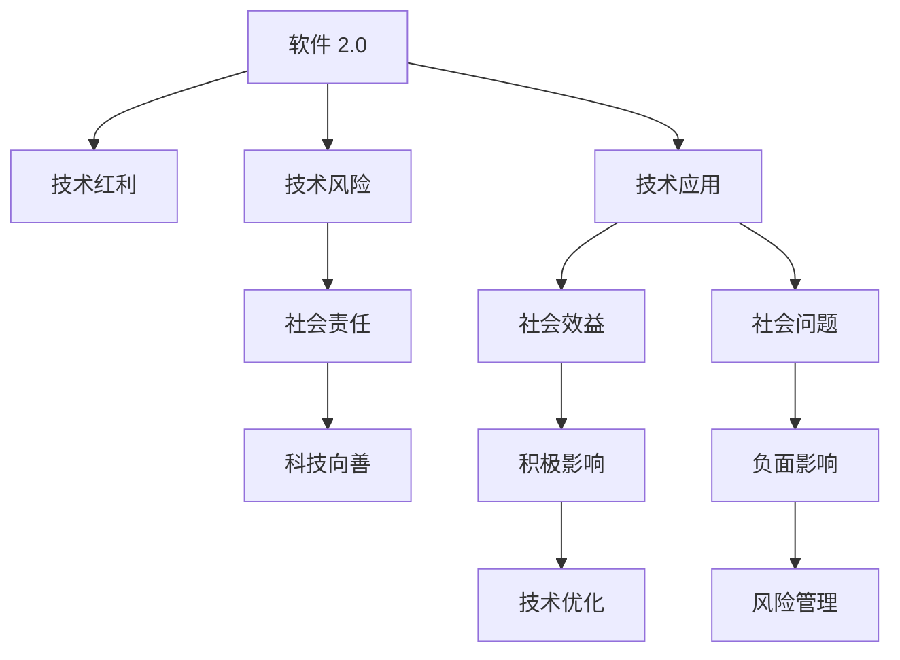

                 

# 软件 2.0 的社会责任：科技向善

## 1. 背景介绍

随着技术的飞速发展，人类社会的各个方面都发生了深刻变革。尤其是信息技术领域的突破，使得“软件 2.0”时代加速到来。软件的智能化、自动化水平不断提升，人工智能、大数据、物联网等技术的融合，正在重塑人类的生产生活方式。然而，在享受技术带来的便利的同时，我们也需要警惕科技的双刃剑效应。如何在享受科技红利的同时，避免其可能带来的风险和负面影响，已成为不可回避的重要议题。本文将探讨软件 2.0 时代的社会责任问题，强调科技向善的价值导向，提出在技术创新中应遵循的原则和策略。

## 2. 核心概念与联系

### 2.1 核心概念概述

为更好地理解软件 2.0 时代的社会责任，我们首先介绍几个关键概念：

- **软件 2.0（Software 2.0）**：相对于传统依赖人工编程的软件 1.0，软件 2.0 利用人工智能、自动化算法等技术，使软件具有自主学习和优化能力，能够实现更高效、更智能的应用。

- **技术红利（Technological Dividends）**：指通过技术进步带来的经济和社会效益，如提高生产效率、降低成本、提升生活质量等。

- **技术风险（Technological Risks）**：指技术应用可能带来的潜在风险，包括信息泄露、隐私侵害、就业冲击、道德伦理等负面影响。

- **社会责任（Social Responsibility）**：指技术开发者和企业在使用技术时应负有的社会义务和伦理准则，确保技术应用有利于社会整体福祉。

- **科技向善（Technology for Good）**：强调技术应积极服务于人类福祉，通过创新应用，解决社会问题，推动社会进步。

这些概念之间的关系可以通过以下Mermaid流程图来展示：



这个流程图展示了软件 2.0 技术如何通过技术应用，产生积极的社会效益，但也可能带来负面影响。社会责任和科技向善的核心理念在于引导技术开发者和企业，积极应对技术风险，确保技术应用符合社会利益，推动社会进步。

## 3. 核心算法原理 & 具体操作步骤
### 3.1 算法原理概述

软件 2.0 时代的社会责任，主要通过技术伦理和应用策略来实现。其核心在于，在技术开发和应用过程中，遵循一定的伦理准则，合理利用技术红利，规避技术风险，确保技术应用符合社会公共利益。

### 3.2 算法步骤详解

具体来说，实现软件 2.0 的社会责任，可以遵循以下步骤：

**Step 1: 明确技术应用目标**

- 在开发软件 2.0 产品前，需明确产品的社会目标和应用场景。例如，是否旨在提升医疗健康、教育公平、环境保护等社会公益领域，还是优化商业运营、增强用户体验等经济效益领域。

**Step 2: 制定伦理准则**

- 根据技术应用目标，制定相应的伦理准则和标准，确保技术开发和应用过程中遵循伦理规范，如数据隐私保护、公平性、透明性等。

**Step 3: 评估技术风险**

- 对技术应用可能带来的风险进行评估，包括信息安全、隐私侵犯、算法偏见等，采取相应的防范措施。

**Step 4: 进行技术优化**

- 根据伦理准则和风险评估结果，优化技术应用方案，确保技术实现符合社会责任。

**Step 5: 持续监测和反馈**

- 在技术应用过程中，持续监测其社会影响，收集用户反馈，及时调整优化。

### 3.3 算法优缺点

**优点：**

- **提高社会效益**：通过技术优化，可以更高效地解决社会问题，提升生活质量。
- **促进公平公正**：在技术应用中注重伦理规范，有助于缩小社会不平等，推动社会公正。
- **增强透明度**：通过公开透明的算法和数据使用，增强公众信任和接受度。

**缺点：**

- **成本和复杂度增加**：遵循伦理准则，增加技术开发和应用的复杂度和成本。
- **创新受限**：严格的伦理规范可能限制技术创新的边界，影响技术突破。
- **用户接受度不确定**：部分用户可能对新技术持怀疑态度，影响接受度和推广。

### 3.4 算法应用领域

软件 2.0 技术在多个领域的应用中，需特别关注社会责任问题，包括但不限于：

- **医疗健康**：开发智能诊断、个性化治疗、远程医疗等软件，需确保数据隐私保护和算法公平性。
- **教育公平**：利用人工智能优化教学内容、个性化教育方案，需确保不扩大教育差距。
- **环境保护**：开发环境监测、资源管理软件，需关注数据准确性和算法可解释性。
- **社会治理**：利用大数据、人工智能优化城市管理、公共安全等，需确保算法透明和用户隐私保护。
- **商业应用**：开发智能客服、推荐系统等，需关注算法偏见和用户数据安全。

## 4. 数学模型和公式 & 详细讲解  
### 4.1 数学模型构建

软件 2.0 技术的应用通常涉及复杂的数据处理和模型训练，以下我们将以智能推荐系统为例，说明数学模型的构建过程。

**智能推荐系统数学模型**：

- **输入数据**：用户历史行为数据、物品属性数据。
- **模型目标**：预测用户对物品的兴趣程度，推荐相关物品。

数学模型包括：

- **用户-物品矩阵**：用户对物品的兴趣程度。
- **协同过滤模型**：利用用户-物品矩阵进行相似度计算，推荐物品。

### 4.2 公式推导过程

设用户集合为 $U$，物品集合为 $I$，用户对物品 $i$ 的兴趣程度为 $r_{ui}$，协同过滤模型中用户 $u$ 和物品 $i$ 的相似度为 $s_{ui}$。推荐系统通过预测用户 $u$ 对物品 $i$ 的兴趣程度，根据兴趣程度排序推荐物品。

协同过滤模型的数学模型为：

$$
r_{ui} \propto s_{ui} = \frac{\mathbf{u}_i^T\mathbf{v}_u}{\|\mathbf{u}_i\|\|\mathbf{v}_u\|}
$$

其中 $\mathbf{u}_i$ 和 $\mathbf{v}_u$ 分别为物品 $i$ 和用户 $u$ 的特征向量。

推荐系统推荐的物品为：

$$
\hat{i} = \arg\max_i \sum_{u \in U} r_{ui} \alpha_u
$$

其中 $\alpha_u$ 为用户 $u$ 的权重系数。

### 4.3 案例分析与讲解

以电子商务平台的个性化推荐系统为例，用户在浏览、购买、评价等行为中会产生大量数据。通过协同过滤模型，推荐系统可以预测用户对未购买物品的兴趣程度，并推荐相关物品。

在实际应用中，推荐系统需注意以下几点：

- **隐私保护**：确保用户数据匿名化处理，避免信息泄露。
- **算法公平性**：关注不同用户群体、不同物品的推荐公平性，避免偏见。
- **透明度**：用户应了解推荐系统的推荐逻辑和依据，增强信任度。

## 5. 项目实践：代码实例和详细解释说明
### 5.1 开发环境搭建

在项目实践中，开发环境搭建是关键步骤。以下以智能推荐系统为例，介绍开发环境的搭建流程：

**Step 1: 安装开发环境**

- 安装Python 3.8及以上版本，并创建虚拟环境：
```bash
python -m venv venv
source venv/bin/activate
```

- 安装必要的依赖库：
```bash
pip install torch torchvision scikit-learn pandas numpy scipy
```

- 安装PyTorch库：
```bash
pip install torch torchvision
```

**Step 2: 准备数据集**

- 下载并处理用户历史行为数据、物品属性数据，并转化为适合模型的格式。

### 5.2 源代码详细实现

智能推荐系统的代码实现如下：

```python
import torch
import torch.nn as nn
import torch.nn.functional as F

class协同过滤模型(nn.Module):
    def __init__(self, embedding_dim):
        super(协同过滤模型, self).__init__()
        self.embedding = nn.Embedding(用户数, embedding_dim)
        self.fc = nn.Linear(embedding_dim*物品数, 物品数)
        
    def forward(self, user, item):
        u = self.embedding(user)
        v = self.fc(u)
        v = F.sigmoid(v)
        v = v.view(-1, 物品数)
        s = torch.matmul(u, v.t())
        return s

# 训练函数
def train_model(model, train_data, test_data, batch_size, epochs):
    model.train()
    optimizer = torch.optim.Adam(model.parameters(), lr=0.01)
    criterion = nn.MSELoss()
    for epoch in range(epochs):
        for i, (user, item) in enumerate(train_data):
            user, item = user.to(device), item.to(device)
            optimizer.zero_grad()
            s = model(user, item)
            loss = criterion(s, item)
            loss.backward()
            optimizer.step()
            if i % 100 == 0:
                print(f'Epoch {epoch+1}, Step {i}, Loss: {loss.item()}')
    model.eval()
    test_loss = 0
    for user, item in test_data:
        user, item = user.to(device), item.to(device)
        s = model(user, item)
        test_loss += criterion(s, item).item()
    print(f'Test Loss: {test_loss/len(test_data)}')
```

### 5.3 代码解读与分析

- **协同过滤模型**：采用用户-物品矩阵进行协同过滤，预测用户对物品的兴趣程度。
- **训练函数**：使用Adam优化器，均方误差损失函数，在训练数据上迭代优化模型。
- **测试函数**：在测试数据上评估模型性能，输出平均损失。

## 6. 实际应用场景
### 6.4 未来应用展望

软件 2.0 技术在多个领域的应用前景广阔，以下列举几个典型场景：

- **智慧医疗**：开发智能诊断、个性化治疗、远程医疗等软件，需确保数据隐私保护和算法公平性。
- **智能城市**：利用大数据、人工智能优化城市管理、公共安全等，需确保算法透明和用户隐私保护。
- **智能教育**：利用人工智能优化教学内容、个性化教育方案，需确保不扩大教育差距。
- **环境监测**：开发环境监测、资源管理软件，需关注数据准确性和算法可解释性。

未来，软件 2.0 技术将继续拓展应用边界，推动社会进步。同时，需警惕技术应用可能带来的风险，遵循社会责任原则，确保技术向善。

## 7. 工具和资源推荐
### 7.1 学习资源推荐

为了帮助开发者系统掌握软件 2.0 技术的社会责任问题，这里推荐一些优质的学习资源：

1. **《软件 2.0：人工智能与自动化编程的未来》**：全面介绍软件 2.0 技术的理论基础和实践应用，强调技术创新的社会责任。
2. **《数据科学与伦理：人工智能与道德指南》**：介绍数据科学中的伦理问题，强调技术应用中的道德规范。
3. **《人工智能伦理与隐私保护》**：深入探讨人工智能技术的伦理问题，提出相应的解决策略。
4. **在线课程**：Coursera、edX等平台上的相关课程，涵盖技术伦理、隐私保护、算法透明等内容。
5. **开源项目**：参与开源项目，如OpenAI的GPT-3项目，了解技术开发中的社会责任实践。

### 7.2 开发工具推荐

在软件 2.0 技术的开发中，选择合适的工具可以显著提升开发效率和应用效果。以下是一些推荐工具：

1. **Python 3.x**：广泛使用的编程语言，具有丰富的第三方库支持。
2. **PyTorch**：流行的深度学习框架，支持动态图和静态图模式，适合快速迭代开发。
3. **TensorFlow**：Google开发的深度学习框架，支持分布式计算，适合大规模工程应用。
4. **Jupyter Notebook**：交互式编程环境，便于开发者快速进行数据探索和算法验证。
5. **GitHub**：代码托管平台，支持版本控制和协作开发，方便团队管理和代码共享。

### 7.3 相关论文推荐

软件 2.0 技术的发展离不开学界的持续研究。以下是几篇奠基性的相关论文，推荐阅读：

1. **《软件 2.0：人工智能与自动化编程的未来》**：提出软件 2.0 的概念，探讨技术伦理和应用策略。
2. **《数据科学与伦理：人工智能与道德指南》**：介绍数据科学中的伦理问题，提出相应的解决策略。
3. **《人工智能伦理与隐私保护》**：深入探讨人工智能技术的伦理问题，提出相应的解决策略。
4. **《智能推荐系统：算法、模型与应用》**：详细介绍智能推荐系统的算法和实现，强调数据隐私保护和算法公平性。

这些论文代表了大语言模型微调技术的发展脉络，通过学习这些前沿成果，可以帮助研究者把握学科前进方向，激发更多的创新灵感。

## 8. 总结：未来发展趋势与挑战
### 8.1 研究成果总结

本文对软件 2.0 技术的社会责任问题进行了全面系统的探讨。首先阐述了软件 2.0 技术的应用目标、技术红利、技术风险和社会责任，明确了技术开发者和企业在使用技术时应负有的社会义务和伦理准则。其次，从原理到实践，详细讲解了软件 2.0 技术在实际应用中的具体操作，并通过案例分析，展示了技术伦理和应用策略在实际项目中的具体实现。

通过本文的系统梳理，可以看到，软件 2.0 技术在推动社会进步的同时，也面临着伦理、公平、隐私等诸多挑战。如何在享受技术红利的同时，避免其可能带来的风险和负面影响，已成为不可回避的重要议题。

### 8.2 未来发展趋势

展望未来，软件 2.0 技术将继续拓展应用边界，推动社会进步。但同时，需警惕技术应用可能带来的风险，遵循社会责任原则，确保技术向善。

**趋势一：技术伦理和公平性**：随着技术应用的深入，技术伦理和公平性问题将更加凸显。开发者和企业需建立伦理规范和公平性评估机制，确保技术应用符合社会利益。

**趋势二：数据隐私和安全**：数据隐私和安全问题将更加重要。开发者需采用数据加密、匿名化处理等技术，确保用户数据安全。

**趋势三：算法透明和可解释性**：算法透明和可解释性将成为用户和监管机构关注的重点。开发者需提供透明的算法逻辑和可解释的决策过程。

**趋势四：用户参与和反馈机制**：用户应参与到技术应用的设计和评估中，通过反馈机制不断优化技术应用。

**趋势五：跨领域合作**：技术应用需跨领域合作，整合不同领域的专业知识，推动技术创新和社会进步。

### 8.3 面临的挑战

尽管软件 2.0 技术在多个领域的应用前景广阔，但在迈向更加智能化、普适化应用的过程中，它仍面临着诸多挑战：

**挑战一：技术伦理规范缺失**：部分技术开发者和企业缺乏伦理规范意识，可能导致技术应用出现偏差和负面影响。

**挑战二：数据隐私和安全风险**：数据隐私和安全风险是技术应用的重要挑战。如何在享受技术红利的同时，确保数据隐私和安全，还需进一步探索。

**挑战三：算法偏见和公平性问题**：部分算法可能存在偏见，导致技术应用不公平。需制定算法公平性评估标准，确保技术应用的公正性。

**挑战四：技术透明度不足**：部分技术应用缺乏透明性，难以解释其内部工作机制和决策逻辑。需提升技术透明度，增强公众信任。

**挑战五：用户接受度和普及率**：部分技术应用用户接受度低，影响普及率。需提升用户体验，增强技术应用的接受度。

### 8.4 研究展望

面对软件 2.0 技术面临的诸多挑战，未来的研究需要在以下几个方面寻求新的突破：

**研究一：技术伦理规范体系**：建立技术伦理规范体系，确保技术开发和应用遵循伦理准则。

**研究二：数据隐私和安全技术**：开发数据加密、匿名化处理等技术，确保用户数据安全。

**研究三：算法公平性和透明性**：开发算法公平性评估工具，确保技术应用的公正性。

**研究四：用户参与和反馈机制**：建立用户参与和反馈机制，提升技术应用的接受度和普及率。

**研究五：跨领域合作和知识整合**：促进不同领域之间的合作，整合跨领域的专业知识，推动技术创新和社会进步。

这些研究方向的研究突破，将为软件 2.0 技术的社会责任实践提供有力支撑，确保技术应用符合社会利益，推动社会进步。

## 9. 附录：常见问题与解答

**Q1：如何在技术开发和应用中遵循伦理准则？**

A: 在技术开发和应用中遵循伦理准则，需从以下几个方面入手：
1. 建立伦理委员会，制定明确的伦理规范。
2. 对技术应用进行伦理评估，确保符合伦理规范。
3. 在技术应用中强调数据隐私保护、算法透明和公平性等原则。

**Q2：如何确保技术应用的数据隐私和安全？**

A: 确保技术应用的数据隐私和安全，需从以下几个方面入手：
1. 采用数据加密、匿名化处理等技术。
2. 建立严格的数据访问和存储管理制度，限制数据访问权限。
3. 定期进行安全审计，发现和修复安全漏洞。

**Q3：如何提升技术应用的透明度和可解释性？**

A: 提升技术应用的透明度和可解释性，需从以下几个方面入手：
1. 提供透明的算法逻辑和决策过程。
2. 采用可解释的模型和算法，如决策树、线性模型等。
3. 在技术应用中引入可视化工具，展示模型内部运行机制。

**Q4：如何确保技术应用的公平性和公正性？**

A: 确保技术应用的公平性和公正性，需从以下几个方面入手：
1. 制定算法公平性评估标准，进行公平性测试。
2. 采用公平性增强技术，如调整算法参数、引入反偏见算法等。
3. 建立伦理审查机制，确保技术应用符合社会利益。

**Q5：如何提升技术应用的接受度和普及率？**

A: 提升技术应用的接受度和普及率，需从以下几个方面入手：
1. 增强用户体验，简化操作流程。
2. 进行用户教育和培训，提升用户理解度和接受度。
3. 建立用户反馈机制，及时调整优化技术应用。

---

作者：禅与计算机程序设计艺术 / Zen and the Art of Computer Programming

