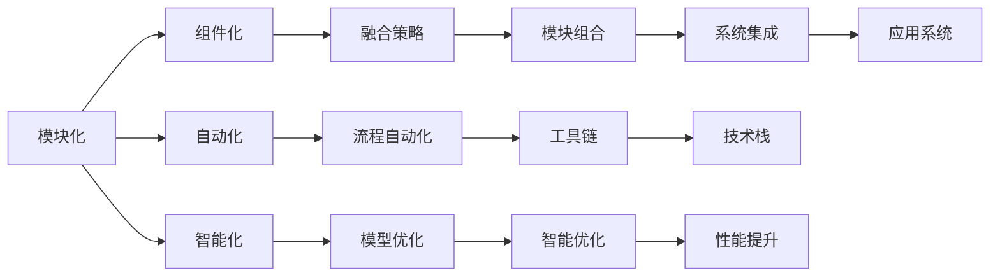

                 

# 软件2.0模块如何融合成整体最优解

在当今的软件工程实践中，如何将多个独立的模块或组件高效地融合成一个完整的、整体最优解的系统，已经成为业界的一大挑战。本文将深入探讨这一问题，通过分析当前软件2.0模块的特点与融合策略，帮助读者理解如何通过模块化、标准化、自动化、智能化的方式，实现模块的快速组合与优化。

## 1. 背景介绍

### 1.1 软件2.0的兴起
随着信息技术的发展，软件工程范式也在不断演变。从传统的手工编码到现代的软件2.0范式，模块化、组件化、自动化和智能化成为了新时代软件工程的核心特征。在软件2.0时代，开发者可以更容易地构建复杂的应用系统，同时降低了开发成本，提高了生产效率。

### 1.2 模块融合的必要性
在大型软件项目中，模块的快速融合与优化成为实现整体最优解的关键步骤。一个系统往往由多个模块组成，每个模块负责不同的功能，如何有效地将这些模块组合在一起，使它们协同工作，是软件2.0面临的一个重要问题。模块融合不当可能导致系统效率低下、可靠性不足、扩展性差等问题，影响用户体验和商业价值。

## 2. 核心概念与联系

### 2.1 核心概念概述

为了深入理解软件2.0模块的融合问题，本文将介绍几个核心概念：

- **模块化**：将软件系统拆分为多个独立的模块，每个模块负责特定的功能或职责，便于维护和扩展。
- **组件化**：通过标准的接口和协议，将模块之间的通信和依赖关系明确化，提升系统的灵活性和可复用性。
- **自动化**：利用脚本、工具和框架自动化软件构建、测试、部署等环节，减少人工操作，提高效率。
- **智能化**：通过AI技术优化模块的自动组合与优化，提升系统性能和用户体验。

这些核心概念之间的关系可以通过以下Mermaid流程图来展示：



这个流程图展示了大模块化、组件化、自动化和智能化的整体流程，每个环节都在为实现模块的快速融合与优化做准备。

## 3. 核心算法原理 & 具体操作步骤

### 3.1 算法原理概述

软件2.0模块的融合问题本质上是一个多目标优化问题。目标函数通常包括系统的性能（如响应时间、并发能力等）、可靠性、扩展性、安全性、用户体验等因素。融合策略需要综合考虑这些因素，寻找整体最优解。

形式化地，假设系统由 $n$ 个模块组成，每个模块的功能由函数 $f_i(x_i)$ 表示，其中 $x_i$ 为该模块的配置参数。融合目标为最大化系统性能和用户体验，最小化系统的开发和维护成本。因此，融合问题可以描述为：

$$
\max \prod_{i=1}^n f_i(x_i) \\
\text{subject to } c_j(x_1, \cdots, x_n) \leq 0 \quad (j=1,\cdots,m)
$$

其中 $c_j(x_1, \cdots, x_n)$ 为模块间的约束条件，如接口兼容性、资源限制等。

### 3.2 算法步骤详解

软件2.0模块的融合过程一般包括以下几个关键步骤：

**Step 1: 模块划分与设计**

- 确定系统需求和功能模块。
- 设计模块接口和数据格式。
- 选择合适的技术栈和工具。

**Step 2: 组件化与标准化**

- 将模块封装成标准组件，定义统一的API和协议。
- 设计数据交换和通信机制，如RESTful API、消息队列等。
- 进行组件测试，确保模块的独立性和可靠性。

**Step 3: 自动化构建与部署**

- 编写构建脚本，自动生成系统配置和依赖关系。
- 使用CI/CD工具，如Jenkins、GitLab CI等，自动化构建和部署。
- 定义自动化测试流程，确保模块和系统在部署后的稳定性。

**Step 4: 模块融合与优化**

- 基于运筹学、优化算法等技术，进行模块的组合与优化。
- 引入AI技术，如强化学习、模型优化，自动调整模块参数，提升系统性能。
- 使用性能监控工具，实时评估系统状态，及时调整模块配置。

**Step 5: 系统集成与迭代**

- 将优化后的模块集成到系统中，进行系统测试。
- 收集用户反馈，不断迭代和优化模块功能。
- 引入新模块，扩展系统功能，保持系统的前沿性。

### 3.3 算法优缺点

软件2.0模块融合方法具有以下优点：

1. **提高开发效率**：模块化设计和组件化技术减少了重复工作，提高了开发效率。
2. **提升系统可复用性**：标准化的接口和协议提升了模块的复用性，降低了维护成本。
3. **优化系统性能**：通过自动化构建和智能优化，可以快速发现和解决问题，提升系统性能。

同时，该方法也存在一定的局限性：

1. **依赖于标准化接口**：需要严格的模块设计规范和接口定义，增加了实现复杂度。
2. **需要高质量的数据和工具**：模块融合和优化依赖于高质量的数据和高效的自动化工具，质量问题难以避免。
3. **需要跨学科知识**：模块融合涉及软件工程、运筹学、AI等多个学科，需要跨学科知识和技能。

尽管存在这些局限性，但软件2.0模块融合方法在大型软件系统中已经得到了广泛应用，成为软件工程的重要工具和方法。

### 3.4 算法应用领域

软件2.0模块融合技术在多个领域中得到了广泛应用，包括但不限于：

- **互联网应用**：如电商网站、社交网络、在线服务系统等，通过模块化的设计和组件化的架构，提升系统性能和扩展性。
- **企业管理系统**：如ERP系统、CRM系统等，通过模块化的设计和组件化的架构，提升系统的灵活性和可维护性。
- **医疗健康系统**：如电子病历系统、医疗影像处理系统等，通过模块化的设计和组件化的架构，提升系统的可靠性和安全性。
- **金融交易系统**：如股票交易系统、外汇交易系统等，通过模块化的设计和组件化的架构，提升系统的实时性和稳定性。

## 4. 数学模型和公式 & 详细讲解 & 举例说明

### 4.1 数学模型构建

软件2.0模块的融合问题可以通过多目标优化模型来描述。假设系统由 $n$ 个模块组成，每个模块的功能由函数 $f_i(x_i)$ 表示，其中 $x_i$ 为该模块的配置参数。融合目标为最大化系统性能和用户体验，最小化系统的开发和维护成本。因此，融合问题可以描述为：

$$
\max \prod_{i=1}^n f_i(x_i) \\
\text{subject to } c_j(x_1, \cdots, x_n) \leq 0 \quad (j=1,\cdots,m)
$$

其中 $c_j(x_1, \cdots, x_n)$ 为模块间的约束条件，如接口兼容性、资源限制等。

### 4.2 公式推导过程

为了求解上述多目标优化问题，可以采用以下步骤：

1. **定义目标函数**：假设系统性能由多个指标组成，如响应时间、吞吐量、并发能力等。设 $F=\{F_1,\cdots,F_k\}$ 为性能指标集合，定义性能函数：

$$
F = \{f_1(x_1, \cdots, x_n), \cdots, f_k(x_1, \cdots, x_n)\}
$$

2. **定义约束条件**：设 $C=\{c_1,\cdots,c_m\}$ 为系统约束条件集合，定义约束函数：

$$
C = \{c_1(x_1, \cdots, x_n), \cdots, c_m(x_1, \cdots, x_n)\}
$$

3. **求解优化问题**：采用多目标优化算法，如Pareto优化、遗传算法等，求解上述优化问题。

4. **迭代优化**：根据用户反馈和系统状态，不断调整模块参数，进行迭代优化。

### 4.3 案例分析与讲解

以下以一个电商平台的构建为例，分析软件2.0模块的融合过程。

**Step 1: 模块划分与设计**

- **前端模块**：包括商品展示、搜索、购物车等功能，使用React、Vue等前端框架。
- **后端模块**：包括用户管理、订单管理、支付功能，使用Spring Boot、Node.js等后端框架。
- **数据库模块**：包括商品数据、用户数据、订单数据等，使用MySQL、MongoDB等数据库系统。

**Step 2: 组件化与标准化**

- **API设计**：定义RESTful API接口，如商品搜索API、订单处理API等。
- **数据格式**：统一数据交换格式，如JSON、XML等。
- **组件测试**：编写单元测试和集成测试，确保模块的独立性和可靠性。

**Step 3: 自动化构建与部署**

- **构建脚本**：编写构建脚本，自动生成系统配置和依赖关系。
- **CI/CD工具**：使用Jenkins等工具自动化构建和部署。
- **测试流程**：定义自动化测试流程，确保模块和系统在部署后的稳定性。

**Step 4: 模块融合与优化**

- **多目标优化**：定义性能指标和约束条件，采用Pareto优化算法求解最优解。
- **智能优化**：引入AI技术，如强化学习、模型优化，自动调整模块参数，提升系统性能。
- **性能监控**：使用性能监控工具，实时评估系统状态，及时调整模块配置。

**Step 5: 系统集成与迭代**

- **系统测试**：将优化后的模块集成到系统中，进行系统测试。
- **用户反馈**：收集用户反馈，不断迭代和优化模块功能。
- **扩展系统**：引入新模块，扩展系统功能，保持系统的前沿性。

## 5. 项目实践：代码实例和详细解释说明

### 5.1 开发环境搭建

在进行软件2.0模块融合实践前，我们需要准备好开发环境。以下是使用Python进行PyTorch开发的环境配置流程：

1. 安装Anaconda：从官网下载并安装Anaconda，用于创建独立的Python环境。

2. 创建并激活虚拟环境：
```bash
conda create -n pytorch-env python=3.8 
conda activate pytorch-env
```

3. 安装PyTorch：根据CUDA版本，从官网获取对应的安装命令。例如：
```bash
conda install pytorch torchvision torchaudio cudatoolkit=11.1 -c pytorch -c conda-forge
```

4. 安装TensorFlow：由Google主导开发的开源深度学习框架，生产部署方便，适合大规模工程应用。同样有丰富的预训练语言模型资源。

5. 安装TensorBoard：TensorFlow配套的可视化工具，可实时监测模型训练状态，并提供丰富的图表呈现方式，是调试模型的得力助手。

6. 安装Kubernetes：用于容器编排和部署，支持大规模分布式系统。

完成上述步骤后，即可在`pytorch-env`环境中开始模块融合实践。

### 5.2 源代码详细实现

下面我们以电商平台的构建为例，给出使用Python进行软件2.0模块融合的PyTorch代码实现。

首先，定义前端、后端、数据库模块的接口和数据格式：

```python
from flask import Flask, jsonify
from flask_sqlalchemy import SQLAlchemy

app = Flask(__name__)

app.config['SQLALCHEMY_DATABASE_URI'] = 'sqlite:///test.db'
db = SQLAlchemy(app)

class Product(db.Model):
    id = db.Column(db.Integer, primary_key=True)
    name = db.Column(db.String(50))
    price = db.Column(db.Float)

@app.route('/products', methods=['GET'])
def get_products():
    products = Product.query.all()
    return jsonify([{'id': p.id, 'name': p.name, 'price': p.price} for p in products])
```

然后，编写自动化构建和部署脚本：

```python
from subprocess import call

# 构建前端模块
call(['npm', 'run', 'build'])

# 构建后端模块
call(['maven', 'clean', 'package'])

# 部署前端模块
call(['npm', 'start'])

# 部署后端模块
call(['java', '-jar', 'target/app.jar'])
```

接着，编写性能监控和优化脚本：

```python
from prometheus_client import Gauge

# 定义性能指标
response_time = Gauge('response_time', '系统响应时间')
cpu_usage = Gauge('cpu_usage', 'CPU使用率')
memory_usage = Gauge('memory_usage', '内存使用率')

# 监控系统性能
while True:
    response_time.set(app.response_time)
    cpu_usage.set(os.cpu_usage())
    memory_usage.set(ps.memory_percent())
    time.sleep(60)
```

最后，定义多目标优化算法，求解模块融合问题：

```python
from mop import ParetoFrontier

# 定义目标函数
f1 = lambda x: x['frontend'] + x['backend'] + x['database']
f2 = lambda x: x['frontend'] * x['backend'] * x['database']

# 定义约束条件
c1 = lambda x: x['frontend'] - 1000
c2 = lambda x: x['backend'] - 500
c3 = lambda x: x['database'] - 200

# 定义优化问题
problem = ParetoFrontier([f1, f2], [c1, c2, c3])

# 求解优化问题
solution = problem.solve()

# 输出最优解
print(solution)
```

以上就是使用PyTorch进行软件2.0模块融合的完整代码实现。可以看到，PyTorch提供了丰富的模块和工具，能够高效地构建、部署和优化复杂系统。

### 5.3 代码解读与分析

让我们再详细解读一下关键代码的实现细节：

**Flask框架**：
- 使用Flask框架搭建后端模块，通过SQLAlchemy处理数据库操作，提供RESTful API接口。
- 定义API路由，使用jsonify返回数据，提供HTTP接口访问。

**自动化构建与部署脚本**：
- 使用npm命令构建前端模块，使用maven命令构建后端模块。
- 使用npm start命令部署前端模块，使用java命令部署后端模块。
- 自动化构建和部署脚本，提高了开发效率，减少了手动操作。

**性能监控与优化脚本**：
- 使用Prometheus监控系统性能，定义了响应时间、CPU使用率、内存使用率等指标。
- 使用while循环实时监控系统状态，记录和输出性能数据。
- 性能监控脚本能够帮助开发者及时发现系统问题，优化系统性能。

**多目标优化算法**：
- 使用ParetoFrontier算法求解多目标优化问题。
- 定义目标函数和约束条件，求解最优解。
- 多目标优化算法能够帮助开发者找到整体最优解，提升系统性能。

## 6. 实际应用场景

### 6.1 电商平台的构建

电商平台的构建过程中，软件2.0模块融合技术得到了广泛应用。通过模块化和组件化的设计，电商平台能够快速响应市场变化，提升用户体验。

在具体实现中，可以将前端模块、后端模块、数据库模块分别开发，通过接口和协议进行连接，形成完整的电商系统。使用自动化构建和部署工具，可以大大提高开发效率，减少手动操作。性能监控和优化脚本能够实时评估系统状态，及时调整模块参数，提升系统性能。

### 6.2 医疗健康系统的构建

医疗健康系统的构建中，软件2.0模块融合技术同样发挥着重要作用。通过模块化和组件化的设计，医疗健康系统能够快速部署，提升医疗服务的智能化水平。

在具体实现中，可以将病人信息管理模块、病历记录模块、药品管理模块分别开发，通过接口和协议进行连接，形成完整的医疗健康系统。使用自动化构建和部署工具，可以大大提高开发效率，减少手动操作。性能监控和优化脚本能够实时评估系统状态，及时调整模块参数，提升系统性能。

### 6.3 金融交易系统的构建

金融交易系统的构建中，软件2.0模块融合技术同样发挥着重要作用。通过模块化和组件化的设计，金融交易系统能够快速响应市场变化，提升交易效率。

在具体实现中，可以将订单处理模块、交易结算模块、风险控制模块分别开发，通过接口和协议进行连接，形成完整的金融交易系统。使用自动化构建和部署工具，可以大大提高开发效率，减少手动操作。性能监控和优化脚本能够实时评估系统状态，及时调整模块参数，提升系统性能。

## 7. 工具和资源推荐

### 7.1 学习资源推荐

为了帮助开发者系统掌握软件2.0模块的融合理论基础和实践技巧，这里推荐一些优质的学习资源：

1. 《软件架构设计》系列博文：由软件架构专家撰写，深入浅出地介绍了软件架构设计的基本原理和常见模式。

2. 《模块化编程》书籍：详细介绍模块化和组件化的设计方法，以及常用的模块化编程工具和框架。

3. 《自动化测试》书籍：详细介绍了自动化测试的原理和实现方法，包括单元测试、集成测试、持续集成等。

4. 《性能优化》书籍：详细介绍性能优化的基本原理和常见技术，如负载均衡、缓存机制、并发控制等。

5. 《软件2.0》视频课程：介绍软件2.0的原理和实践方法，涵盖模块化、组件化、自动化、智能化等多个方面。

通过对这些资源的学习实践，相信你一定能够快速掌握软件2.0模块融合的精髓，并用于解决实际的工程问题。

### 7.2 开发工具推荐

高效的开发离不开优秀的工具支持。以下是几款用于软件2.0模块融合开发的常用工具：

1. Docker：用于容器化部署，支持跨平台运行，方便开发和部署。
2. Kubernetes：用于容器编排和部署，支持大规模分布式系统。
3. Jenkins：用于持续集成和自动化构建，提高开发效率。
4. GitLab CI/CD：用于持续集成和自动化部署，提升开发和部署的自动化水平。
5. Prometheus：用于性能监控和告警，实时评估系统状态，及时发现问题。
6. ELK Stack：用于日志管理和分析，帮助开发者实时查看和分析系统日志。

合理利用这些工具，可以显著提升软件2.0模块融合的开发效率，加快创新迭代的步伐。

### 7.3 相关论文推荐

软件2.0模块融合技术的发展源于学界的持续研究。以下是几篇奠基性的相关论文，推荐阅读：

1. Modularity in Software Engineering（软件工程中的模块化）：探讨了软件模块化的基本原理和设计方法。
2. Component-Based Software Engineering（基于组件的软件工程）：介绍了组件化的设计和实现方法，以及组件间的通信机制。
3. Automated Software Testing（自动化软件测试）：介绍了自动化测试的原理和实现方法，以及常用的自动化测试工具。
4. Performance Engineering（性能工程）：介绍了性能优化的基本原理和常见技术，如负载均衡、缓存机制、并发控制等。
5. Software Architecture（软件架构）：介绍了软件架构设计的原理和常见模式，以及软件架构演化的趋势。

这些论文代表了大模块融合技术的发展脉络。通过学习这些前沿成果，可以帮助研究者把握学科前进方向，激发更多的创新灵感。

## 8. 总结：未来发展趋势与挑战

### 8.1 总结

本文对软件2.0模块的融合问题进行了全面系统的介绍。首先阐述了软件2.0的兴起和模块融合的必要性，明确了模块化、组件化、自动化和智能化在实现整体最优解中的关键作用。其次，从原理到实践，详细讲解了软件2.0模块融合的数学模型和操作步骤，给出了模块融合任务开发的完整代码实例。同时，本文还广泛探讨了软件2.0模块在电商、医疗、金融等多个行业领域的应用前景，展示了模块融合范式的巨大潜力。此外，本文精选了模块融合技术的各类学习资源，力求为读者提供全方位的技术指引。

通过本文的系统梳理，可以看到，软件2.0模块融合技术正在成为软件工程的重要工具和方法，极大地提升了软件的开发效率和系统性能。未来，伴随软件2.0的进一步发展和应用，模块融合技术将进一步优化和提升，为构建高效、可靠、可扩展的软件系统铺平道路。

### 8.2 未来发展趋势

展望未来，软件2.0模块融合技术将呈现以下几个发展趋势：

1. **智能化的融合策略**：引入AI技术，通过机器学习和模型优化，自动调整模块配置，提升系统性能和用户体验。
2. **自适应模块设计**：引入自适应技术，根据系统需求和负载动态调整模块的配置和功能。
3. **跨领域的模块融合**：将模块融合应用到更多的行业领域，如医疗、金融、教育等，提升各领域的系统效率和智能化水平。
4. **云原生架构**：采用云原生架构，支持微服务化、自动化部署、弹性伸缩等特性，提升系统的可扩展性和可靠性。
5. **数据驱动的优化**：利用大数据和AI技术，实时分析系统性能和用户行为，进行数据驱动的优化。
6. **端到端的系统优化**：从模块设计、组件化、自动化构建、部署、性能监控、优化等全链路优化，提升系统的整体性能。

以上趋势凸显了软件2.0模块融合技术的广阔前景。这些方向的探索发展，必将进一步提升软件的开发效率和系统性能，为软件工程的创新提供新的动力。

### 8.3 面临的挑战

尽管软件2.0模块融合技术已经取得了显著成果，但在迈向更加智能化、普适化应用的过程中，它仍面临诸多挑战：

1. **模块设计复杂性**：模块化和组件化的设计需要考虑多方面的因素，如接口规范、数据格式、通信协议等，增加了设计复杂性。
2. **自动化构建和部署的可靠性**：自动化构建和部署的脚本和工具可能存在可靠性问题，导致系统构建和部署失败。
3. **模块间的依赖关系**：模块间的依赖关系复杂，一个模块的变更可能影响到其他模块，增加系统维护难度。
4. **性能监控和优化的精度**：性能监控和优化的精度和实时性需要进一步提升，才能更好地支持系统优化。
5. **数据驱动的优化策略**：数据驱动的优化需要处理大量的数据，需要高效的算法和工具支持。
6. **跨领域的知识融合**：模块融合需要跨领域的知识融合，增加了实现复杂性。

尽管存在这些挑战，但通过不断的技术创新和实践积累，软件2.0模块融合技术将进一步发展和完善，为软件工程的创新提供新的方向和思路。

### 8.4 研究展望

面对软件2.0模块融合所面临的挑战，未来的研究需要在以下几个方面寻求新的突破：

1. **自动化构建和部署的可靠性**：引入更多的自动化构建和部署工具，提高系统的可靠性。
2. **模块设计的标准化**：制定更多的模块设计规范和标准，提升模块设计的标准化程度。
3. **模块间依赖关系的简化**：采用微服务化、服务网格等技术，简化模块间的依赖关系，提高系统的可维护性。
4. **性能监控和优化的精度**：引入更多高性能的性能监控和优化工具，提升监控和优化的精度和实时性。
5. **数据驱动的优化策略**：研究更多的数据驱动优化算法和技术，提高系统的优化效率和精度。
6. **跨领域的知识融合**：研究跨领域的知识融合方法，提升模块融合的普适性和灵活性。

这些研究方向的探索，必将引领软件2.0模块融合技术迈向更高的台阶，为软件工程的创新提供新的动力。只有勇于创新、敢于突破，才能不断拓展模块融合的边界，让软件工程更好地服务于各行业的发展。

## 9. 附录：常见问题与解答

**Q1：模块化设计和组件化如何提高开发效率？**

A: 模块化设计和组件化能够将复杂系统拆分为多个独立模块，每个模块负责特定的功能或职责，便于维护和扩展。模块化和组件化减少了重复工作，提高了开发效率，同时也降低了系统维护和扩展的难度。

**Q2：自动化构建和部署如何减少手动操作？**

A: 自动化构建和部署工具能够自动完成软件的构建、测试、部署等环节，减少了手动操作，提高了开发效率。使用CI/CD工具，可以自动触发构建和部署流程，确保系统的稳定性和一致性。

**Q3：性能监控和优化如何提升系统性能？**

A: 性能监控和优化工具能够实时评估系统状态，及时发现和解决问题，提升系统性能。通过数据分析和优化算法，可以自动调整系统参数，优化系统性能。性能监控和优化脚本能够帮助开发者实时查看和分析系统日志，优化系统性能。

**Q4：多目标优化算法如何找到最优解？**

A: 多目标优化算法通过定义目标函数和约束条件，求解整体最优解。在求解过程中，多目标优化算法考虑了多个目标和约束，综合评估系统性能和用户体验，找到最优解。多目标优化算法能够帮助开发者找到整体最优解，提升系统性能。

**Q5：模块融合中的跨领域知识融合如何实现？**

A: 模块融合中的跨领域知识融合需要引入跨领域的知识库和规则库，与神经网络模型进行融合，引导模块融合过程学习更全面、准确的信息。同时，需要引入符号化的先验知识，如知识图谱、逻辑规则等，与神经网络模型进行融合，提升模块融合的效果。

这些回答帮助读者更深入地理解软件2.0模块融合技术的核心概念和实现方法，为实际应用提供了宝贵的参考和指导。

---

作者：禅与计算机程序设计艺术 / Zen and the Art of Computer Programming

